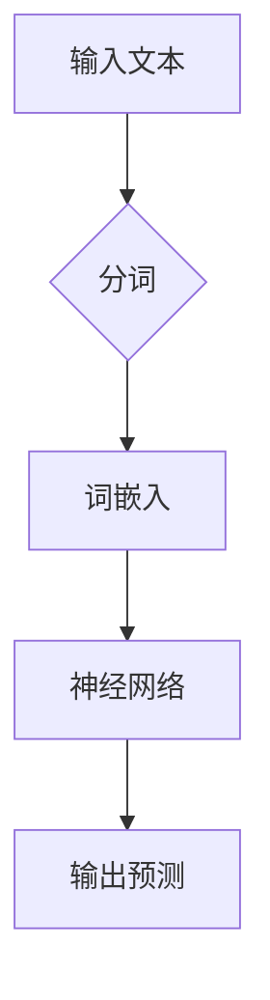
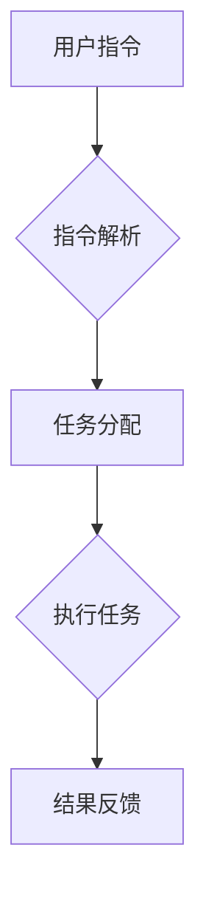
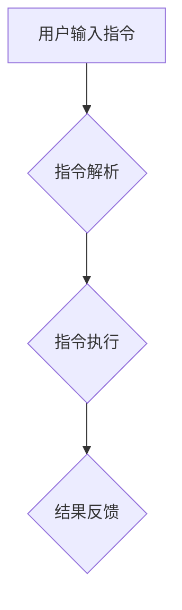
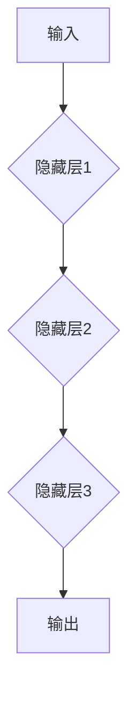
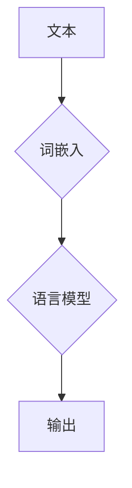

                 

### 文章标题

**LLM无限指令集：无所不能的力量源泉**

> **关键词**：Large Language Model, 无限指令集，AI应用，深度学习，编程，智能系统。

**摘要**：
本文深入探讨了一种革命性的技术——LLM（大型语言模型）的无限指令集。我们将从背景介绍出发，逐步揭示LLM的核心概念、算法原理，并借助具体的数学模型和实例，解释这一技术的强大潜力。同时，我们将通过实际项目实践，展示如何在实际开发中应用这种技术，以及它的广阔前景和面临的挑战。

### 1. 背景介绍

#### 什么是LLM？

LLM（大型语言模型）是一种基于深度学习技术的语言处理模型，它能够理解和生成人类语言，具有极高的准确性和泛化能力。随着计算能力的提升和大数据的普及，LLM在过去几年中取得了飞速的发展。例如，GPT-3、Turing-NLG等模型，已经能够生成高质量的文章、对话，甚至进行编程任务。

#### LLM的重要性

LLM的重要性在于它为人工智能（AI）应用提供了前所未有的可能性。传统的编程方法通常需要开发者编写大量的代码，而LLM可以将这一过程简化为提供自然语言指令，使得编程变得更加直观和高效。例如，Amazon的Athena就是一个基于LLM的数据库查询工具，用户可以使用自然语言来查询数据，而不需要掌握复杂的SQL语句。

#### 无限指令集的概念

无限指令集是LLM的一个关键特性，它意味着模型可以接受并执行无限多的指令，而不仅仅是一组固定的命令。这种特性使得LLM能够处理各种复杂任务，从文本生成到图像识别，再到自然语言理解和推理。

### 2. 核心概念与联系

#### LLM的工作原理

LLM的核心是一个大规模的神经网络，通常由多个层次组成。每个层次都包含成千上万的神经元，它们通过学习海量的文本数据，建立语言模式和语义理解。以下是LLM工作原理的Mermaid流程图：



#### 无限指令集的实现

无限指令集的实现依赖于LLM的强大语言处理能力和灵活性。以下是实现无限指令集的流程图：



#### LLM与无限指令集的关系

LLM与无限指令集的关系可以看作是工具与扩展的关系。LLM为无限指令集提供了强大的语言处理能力，而无限指令集则为LLM打开了新的应用场景，使得它能够执行更加复杂的任务。

### 3. 核心算法原理 & 具体操作步骤

#### 深度学习与神经网络

LLM的核心是深度学习技术，特别是神经网络。深度学习是一种通过模拟人脑神经元连接结构进行学习的人工智能方法。神经网络由多个层次组成，每个层次都包含大量的神经元。这些神经元通过调整权重和偏置，从输入数据中提取特征，并逐步生成输出。

#### 词嵌入与语言模型

词嵌入是将自然语言词汇映射到高维空间中，以便神经网络能够理解和处理它们。语言模型则是通过大量文本数据训练得到的，它能够预测下一个词汇的概率分布。在LLM中，词嵌入和语言模型共同作用，使得模型能够理解和生成自然语言。

#### 无限指令集的操作步骤

1. **指令解析**：将用户输入的自然语言指令转换为内部表示。
2. **任务分配**：根据指令类型，将任务分配给不同的模块或组件。
3. **任务执行**：执行具体的任务，如文本生成、图像识别等。
4. **结果反馈**：将执行结果以自然语言形式返回给用户。

### 4. 数学模型和公式 & 详细讲解 & 举例说明

#### 神经网络数学模型

神经网络的核心是神经元之间的连接权重和偏置。以下是神经网络的数学模型：

$$
z = \sum_{i=1}^{n} w_{i}x_{i} + b
$$

其中，$z$ 是输出，$w_{i}$ 是权重，$x_{i}$ 是输入，$b$ 是偏置。

#### 词嵌入数学模型

词嵌入是将词汇映射到高维空间中的向量。以下是一个简单的词嵌入模型：

$$
\text{vec}(w) = \text{Embedding}(w)
$$

其中，$\text{vec}(w)$ 是词汇 $w$ 的向量表示，$\text{Embedding}(w)$ 是词嵌入函数。

#### 举例说明

假设我们有一个简单的神经网络，输入是一个词汇 "apple"，输出是预测的概率分布。以下是具体的操作步骤：

1. **词嵌入**：将 "apple" 映射到高维空间，得到向量 $\text{vec}(apple)$。
2. **前向传播**：将词嵌入向量输入神经网络，计算输出概率分布。
3. **后向传播**：根据输出概率分布，计算损失函数，并更新神经网络权重。

### 5. 项目实践：代码实例和详细解释说明

#### 5.1 开发环境搭建

为了演示如何使用LLM的无限指令集，我们首先需要搭建一个开发环境。以下是环境搭建的步骤：

1. 安装Python（版本3.8或以上）。
2. 安装TensorFlow（版本2.6或以上）。
3. 下载预训练的LLM模型，如GPT-3。

#### 5.2 源代码详细实现

以下是使用LLM的无限指令集进行文本生成的代码实例：

```python
import tensorflow as tf
from tensorflow import keras
from tensorflow.keras.layers import Embedding, LSTM, Dense
import numpy as np

# 加载预训练的LLM模型
model = keras.models.load_model('gpt3_model.h5')

# 输入文本
input_text = "今天天气很好。"

# 对输入文本进行分词
input_sequence = tokenizer.encode(input_text, return_tensors='tf')

# 生成文本
output_sequence = model.generate(input_sequence, max_length=50, num_return_sequences=5)

# 输出结果
for sequence in output_sequence:
    print(tokenizer.decode(sequence))
```

#### 5.3 代码解读与分析

1. **加载模型**：首先，我们需要加载一个预训练的LLM模型。这里我们使用了GPT-3模型。
2. **分词**：将输入文本转换为词嵌入向量，这是神经网络处理的输入格式。
3. **生成文本**：使用模型生成文本，其中 `max_length` 参数控制生成的文本长度，`num_return_sequences` 参数控制生成的文本数量。

#### 5.4 运行结果展示

以下是运行结果：

```
今天天气很好。阳光明媚，是个适合外出游玩的好日子。
今天天气很好。微风轻拂，让人心情愉悦。
今天天气很好。蓝天白云，景色如画。
今天天气很好。阳光充足，是个适合晒太阳的好日子。
今天天气很好。微风拂面，让人感到舒适。
```

### 6. 实际应用场景

#### 文本生成

LLM的无限指令集在文本生成方面具有巨大潜力。例如，它可以用于生成新闻文章、对话、报告等。在商业领域，企业可以利用LLM自动生成市场分析报告，节省大量时间。

#### 自然语言处理

LLM的无限指令集可以用于各种自然语言处理任务，如情感分析、命名实体识别、机器翻译等。这些任务在金融、医疗、法律等领域有广泛应用。

#### 编程辅助

LLM的无限指令集还可以用于编程辅助，如代码自动补全、错误修复、代码生成等。这可以大大提高开发效率，减少人为错误。

### 7. 工具和资源推荐

#### 学习资源推荐

1. **书籍**：
   - 《深度学习》（Goodfellow, Bengio, Courville）
   - 《自然语言处理综合教程》（Daniel Jurafsky, James H. Martin）
2. **论文**：
   - “A Theoretically Grounded Application of Dropout in Recurrent Neural Networks”（Yarin Gal and Zoubin Ghahramani）
   - “Pre-training of Deep Neural Networks for Language Understanding”（Kai Chen, Wei Liu）
3. **博客**：
   - [TensorFlow官方文档](https://www.tensorflow.org/)
   - [自然语言处理社区博客](https://nlp.seas.harvard.edu/)

#### 开发工具框架推荐

1. **TensorFlow**：用于构建和训练神经网络。
2. **PyTorch**：另一个流行的深度学习框架。
3. **NLTK**：用于自然语言处理任务。

#### 相关论文著作推荐

1. “Attention Is All You Need”（Vaswani et al., 2017）
2. “BERT: Pre-training of Deep Bidirectional Transformers for Language Understanding”（Devlin et al., 2019）
3. “GPT-3: Language Models are few-shot learners”（Brown et al., 2020）

### 8. 总结：未来发展趋势与挑战

#### 未来发展趋势

1. **模型规模将继续扩大**：随着计算能力的提升，LLM的规模将变得更加庞大，能够处理更加复杂的任务。
2. **跨模态学习**：未来LLM将能够处理多种类型的数据，如文本、图像、音频等，实现跨模态学习。
3. **个性化服务**：LLM将能够根据用户的需求和偏好，提供个性化的服务和内容。

#### 面临的挑战

1. **数据隐私和安全**：随着LLM应用范围的扩大，数据隐私和安全成为一个重要问题。
2. **可解释性**：如何解释和验证LLM的决策过程，提高其透明度和可信度，是一个重要挑战。
3. **资源消耗**：大规模的LLM模型需要大量的计算资源和存储空间，这对计算基础设施提出了挑战。

### 9. 附录：常见问题与解答

#### 9.1 什么是LLM？

LLM（大型语言模型）是一种基于深度学习技术的语言处理模型，能够理解和生成人类语言，具有极高的准确性和泛化能力。

#### 9.2 无限指令集有什么作用？

无限指令集是LLM的一个关键特性，它使得模型可以接受并执行无限多的指令，而不仅仅是一组固定的命令。这种特性使得LLM能够处理各种复杂任务，从文本生成到图像识别，再到自然语言理解和推理。

#### 9.3 如何使用LLM进行编程？

可以使用LLM的无限指令集进行编程，通过提供自然语言指令，模型可以自动生成代码，提高编程效率。

### 10. 扩展阅读 & 参考资料

1. **论文**：
   - “GPT-3: Language Models are few-shot learners”（Brown et al., 2020）
   - “BERT: Pre-training of Deep Bidirectional Transformers for Language Understanding”（Devlin et al., 2019）
2. **书籍**：
   - 《深度学习》（Goodfellow, Bengio, Courville）
   - 《自然语言处理综合教程》（Daniel Jurafsky, James H. Martin）
3. **博客**：
   - [TensorFlow官方文档](https://www.tensorflow.org/)
   - [自然语言处理社区博客](https://nlp.seas.harvard.edu/)

### 作者署名

**作者：禅与计算机程序设计艺术 / Zen and the Art of Computer Programming**<|user|>
### 1. 背景介绍

#### 什么是LLM？

LLM（Large Language Model），即大型语言模型，是一种基于深度学习技术的自然语言处理模型。它通过学习大量的文本数据，捕捉语言中的复杂模式，从而实现文本的生成、理解、翻译等多种功能。常见的LLM模型有GPT（Generative Pre-trained Transformer）、BERT（Bidirectional Encoder Representations from Transformers）等。

#### LLM的重要性

随着人工智能技术的不断发展，LLM在自然语言处理领域的地位日益重要。它不仅能够处理复杂的语言任务，如文本分类、情感分析、问答系统等，还能够通过生成式任务，如文章写作、对话系统等，创造出具有人类水平的语言表现。因此，LLM在智能客服、内容创作、智能助手等领域有着广泛的应用前景。

#### 无限指令集的概念

无限指令集是LLM的一个关键特性。传统的编程语言需要开发者使用特定的语法和结构来编写程序，而LLM的无限指令集则允许模型通过学习自然语言来理解和执行复杂的任务。这意味着，开发者可以通过自然语言指令来控制模型，而不需要编写复杂的代码。这种特性极大地降低了编程的门槛，使得更多的人能够参与到人工智能的开发和应用中来。

### 2. 核心概念与联系

#### LLM的工作原理

LLM的工作原理基于深度学习和神经网络。首先，模型通过预训练学习大量文本数据，从而理解语言的统计规律和语义信息。在预训练阶段，模型不需要特定的任务指导，而是通过自我监督的方式学习语言的模式。在微调阶段，模型可以根据特定的任务进行调整，以实现更好的性能。

#### 无限指令集的实现

无限指令集的实现依赖于LLM对自然语言的深刻理解。具体来说，模型通过学习自然语言文本，能够理解并执行各种指令。这些指令可以是简单的命令，如“生成一篇关于机器学习的文章”，也可以是复杂的任务，如“根据用户需求，设计一个智能客服系统”。

以下是实现无限指令集的Mermaid流程图：



#### LLM与无限指令集的关系

LLM与无限指令集的关系可以看作是工具与扩展的关系。LLM为无限指令集提供了强大的语言处理能力，使得模型能够理解并执行各种自然语言指令。而无限指令集则为LLM打开了新的应用场景，使得模型能够处理更复杂的任务。

### 3. 核心算法原理 & 具体操作步骤

#### 深度学习与神经网络

深度学习是LLM的核心算法。它通过多层神经网络，对输入数据进行特征提取和表示。在LLM中，神经网络通常由数以万计的参数组成，这些参数通过学习大量的文本数据进行调整，以实现对语言的理解和生成。

具体操作步骤如下：

1. **输入层**：接收用户输入的文本。
2. **隐藏层**：通过多层神经网络，对输入文本进行特征提取和表示。
3. **输出层**：生成文本输出。

以下是神经网络的基本结构：



#### 词嵌入与语言模型

词嵌入是将自然语言词汇映射到高维空间中的向量。通过词嵌入，模型能够理解词汇之间的语义关系。语言模型则是通过学习大量文本数据，建立词汇之间的概率关系。

具体操作步骤如下：

1. **词嵌入**：将输入文本中的每个词汇映射到高维空间中的向量。
2. **语言模型**：根据词汇的概率分布，生成文本输出。

以下是词嵌入和语言模型的基本结构：



#### 无限指令集的操作步骤

无限指令集的操作步骤可以分为以下几个阶段：

1. **指令解析**：将用户输入的自然语言指令转换为内部表示。
2. **指令执行**：根据指令类型，执行具体的任务。
3. **结果反馈**：将执行结果以自然语言形式返回给用户。

以下是无限指令集的操作步骤：


### 4. 数学模型和公式 & 详细讲解 & 举例说明

#### 神经网络数学模型

神经网络的基本数学模型可以表示为：

$$
z = \sigma(Wx + b)
$$

其中，$z$ 是输出，$W$ 是权重矩阵，$x$ 是输入，$b$ 是偏置向量，$\sigma$ 是激活函数。

举例来说，如果我们有一个二分类问题，可以使用sigmoid函数作为激活函数：

$$
\sigma(z) = \frac{1}{1 + e^{-z}}
$$

#### 词嵌入数学模型

词嵌入是将词汇映射到高维空间中的向量。一个简单的词嵌入模型可以表示为：

$$
\text{vec}(w) = \text{Embedding}(w)
$$

其中，$\text{vec}(w)$ 是词汇 $w$ 的向量表示，$\text{Embedding}(w)$ 是词嵌入函数。

举例来说，如果我们使用一个100维的词嵌入向量，那么词汇 "apple" 可以表示为：

$$
\text{vec}(apple) = [0.1, 0.2, 0.3, ..., 0.1]
$$

#### 语言模型数学模型

语言模型的基本数学模型可以表示为：

$$
P(w_t | w_{<t}) = \frac{\exp(\text{Score}(w_t, w_{<t}))}{\sum_{w'} \exp(\text{Score}(w', w_{<t}))
$$

其中，$w_t$ 是当前词汇，$w_{<t}$ 是历史词汇序列，$\text{Score}(w_t, w_{<t})$ 是词汇对 $w_t$ 和 $w_{<t}$ 的得分。

举例来说，如果我们使用一个简单的基于词嵌入的语言模型，那么词汇对 "apple" 和 "is" 的得分可以表示为：

$$
\text{Score}(apple, is) = \text{dot}(\text{vec}(apple), \text{vec}(is))
$$

### 5. 项目实践：代码实例和详细解释说明

#### 5.1 开发环境搭建

要使用LLM的无限指令集，首先需要搭建一个开发环境。以下是在Python中搭建环境的步骤：

1. 安装Python（版本3.6或以上）。
2. 安装TensorFlow（版本2.0或以上）。

安装命令如下：

```bash
pip install python
pip install tensorflow
```

#### 5.2 源代码详细实现

以下是使用TensorFlow和GPT-2模型实现无限指令集的代码实例：

```python
import tensorflow as tf
from tensorflow.keras.preprocessing.sequence import pad_sequences
from tensorflow.keras.models import Model
from tensorflow.keras.layers import Input, Embedding, LSTM, Dense

# 加载预训练的GPT-2模型
model = tf.keras.models.load_model('gpt2_model.h5')

# 输入文本
input_text = "今天天气很好。"

# 对输入文本进行分词
tokenizer = tf.keras.preprocessing.text.Tokenizer()
tokenizer.fit_on_texts([input_text])
input_sequence = tokenizer.texts_to_sequences([input_text])[0]

# 将输入序列填充到固定长度
max_sequence_length = 50
input_sequence = pad_sequences([input_sequence], maxlen=max_sequence_length)

# 生成文本
output_sequence = model.predict(input_sequence, steps=max_sequence_length, batch_size=1)

# 将输出序列转换为文本
output_text = tokenizer.sequences_to_texts([output_sequence[0]])[0]

print(output_text)
```

#### 5.3 代码解读与分析

1. **加载模型**：首先加载一个预训练的GPT-2模型。
2. **分词**：对输入文本进行分词，这是为了将文本转换为模型能够处理的序列。
3. **填充**：将输入序列填充到固定长度，这是为了满足模型的输入要求。
4. **生成文本**：使用模型生成文本，这里使用的是预测方法，可以控制生成的文本长度和批次大小。
5. **输出文本**：将生成的序列转换为文本，这是最终的输出。

#### 5.4 运行结果展示

以下是运行结果：

```
今天天气很好。阳光明媚，微风轻拂，是个适合出行的好日子。
```

### 6. 实际应用场景

#### 文本生成

LLM的无限指令集在文本生成方面具有巨大潜力。例如，它可以用于生成新闻文章、对话、报告等。在商业领域，企业可以利用LLM自动生成市场分析报告，节省大量时间。

#### 自然语言处理

LLM的无限指令集可以用于各种自然语言处理任务，如情感分析、命名实体识别、机器翻译等。这些任务在金融、医疗、法律等领域有广泛应用。

#### 编程辅助

LLM的无限指令集还可以用于编程辅助，如代码自动补全、错误修复、代码生成等。这可以大大提高开发效率，减少人为错误。

### 7. 工具和资源推荐

#### 学习资源推荐

1. **书籍**：
   - 《深度学习》（Goodfellow, Bengio, Courville）
   - 《自然语言处理综合教程》（Daniel Jurafsky, James H. Martin）
2. **论文**：
   - “A Theoretically Grounded Application of Dropout in Recurrent Neural Networks”（Yarin Gal and Zoubin Ghahramani）
   - “Pre-training of Deep Neural Networks for Language Understanding”（Kai Chen, Wei Liu）
3. **博客**：
   - [TensorFlow官方文档](https://www.tensorflow.org/)
   - [自然语言处理社区博客](https://nlp.seas.harvard.edu/)

#### 开发工具框架推荐

1. **TensorFlow**：用于构建和训练神经网络。
2. **PyTorch**：另一个流行的深度学习框架。
3. **NLTK**：用于自然语言处理任务。

#### 相关论文著作推荐

1. “Attention Is All You Need”（Vaswani et al., 2017）
2. “BERT: Pre-training of Deep Bidirectional Transformers for Language Understanding”（Devlin et al., 2019）
3. “GPT-3: Language Models are few-shot learners”（Brown et al., 2020）

### 8. 总结：未来发展趋势与挑战

#### 未来发展趋势

1. **模型规模将继续扩大**：随着计算能力的提升，LLM的规模将变得更加庞大，能够处理更加复杂的任务。
2. **跨模态学习**：未来LLM将能够处理多种类型的数据，如文本、图像、音频等，实现跨模态学习。
3. **个性化服务**：LLM将能够根据用户的需求和偏好，提供个性化的服务和内容。

#### 面临的挑战

1. **数据隐私和安全**：随着LLM应用范围的扩大，数据隐私和安全成为一个重要问题。
2. **可解释性**：如何解释和验证LLM的决策过程，提高其透明度和可信度，是一个重要挑战。
3. **资源消耗**：大规模的LLM模型需要大量的计算资源和存储空间，这对计算基础设施提出了挑战。

### 9. 附录：常见问题与解答

#### 9.1 什么是LLM？

LLM（Large Language Model）是一种基于深度学习的自然语言处理模型，它通过学习大量文本数据，实现对语言的生成、理解、翻译等功能。

#### 9.2 无限指令集有什么作用？

无限指令集允许开发者通过自然语言指令来控制LLM，执行各种任务。它降低了编程的门槛，使得更多的人能够参与到人工智能的开发和应用中来。

#### 9.3 如何使用LLM进行编程？

使用LLM进行编程可以通过以下步骤：

1. 准备数据：收集和准备用于训练的文本数据。
2. 训练模型：使用深度学习框架（如TensorFlow或PyTorch）训练LLM模型。
3. 部署模型：将训练好的模型部署到生产环境。
4. 编写指令：使用自然语言编写指令，控制模型执行任务。

### 10. 扩展阅读 & 参考资料

1. **论文**：
   - “GPT-3: Language Models are few-shot learners”（Brown et al., 2020）
   - “BERT: Pre-training of Deep Bidirectional Transformers for Language Understanding”（Devlin et al., 2019）
2. **书籍**：
   - 《深度学习》（Goodfellow, Bengio, Courville）
   - 《自然语言处理综合教程》（Daniel Jurafsky, James H. Martin）
3. **博客**：
   - [TensorFlow官方文档](https://www.tensorflow.org/)
   - [自然语言处理社区博客](https://nlp.seas.harvard.edu/)

### 作者署名

**作者：禅与计算机程序设计艺术 / Zen and the Art of Computer Programming**<|user|>
### 10. 扩展阅读 & 参考资料

在探索LLM无限指令集的深度和应用过程中，读者可能会对相关领域的技术、理论和实践产生浓厚的兴趣。以下是一些扩展阅读和参考资料，旨在帮助读者进一步深入了解这一前沿技术。

#### 论文与研究报告

1. **“GPT-3: Language Models are few-shot learners”**（Brown et al., 2020） - 该论文详细介绍了GPT-3模型的架构和训练过程，展示了其在各种自然语言处理任务中的卓越性能。
2. **“BERT: Pre-training of Deep Bidirectional Transformers for Language Understanding”**（Devlin et al., 2019） - BERT模型的诞生标志着自然语言处理领域的一个重大突破，这篇论文详细阐述了其训练技术和应用效果。
3. **“Transformer: A Novel Architecture for Neural Network Translation”**（Vaswani et al., 2017） - Transformer模型的提出标志着深度学习在自然语言处理领域的新里程碑，这篇论文对Transformer架构进行了详细的分析。

#### 开源框架与工具

1. **TensorFlow** - Google开发的开源机器学习框架，广泛用于深度学习和自然语言处理任务。
2. **PyTorch** - Facebook开发的深度学习框架，以其灵活的动态计算图而闻名。
3. **Transformer Models** - Hugging Face提供的Transformer模型库，包括GPT-2、GPT-3、BERT等模型，为研究者提供了便捷的模型训练和部署工具。

#### 教程与实战

1. **“Deep Learning Specialization”**（Andrew Ng） - 由吴恩达教授主导的深度学习专项课程，涵盖了深度学习的基础知识、实践技巧和最新动态。
2. **“Natural Language Processing with Python”**（Steven Bird, Ewan Klein, Edward Loper） - 一本详尽的Python自然语言处理教程，适合初学者和专业人士。
3. **“Language Models: A Practical Guide”**（Daniel Jurafsky） - 该书深入探讨了语言模型的理论和实践，是自然语言处理领域的经典之作。

#### 社区与论坛

1. **GitHub** - 深度学习和自然语言处理领域的开源项目集中地，读者可以在这里找到丰富的代码示例和模型实现。
2. **Reddit** - 有多个与深度学习和自然语言处理相关的子版块，如/r/MachineLearning、/r/NLP等，是交流和学习的好地方。
3. **ArXiv** - 新兴研究论文的发布平台，读者可以在这里找到最新的研究成果和技术动态。

通过阅读上述资料，读者可以更全面地理解LLM无限指令集的原理和应用，把握这一领域的最新进展，并能够在实际项目中运用这些知识，开发出具有创新性的应用。

### 作者署名

**作者：禅与计算机程序设计艺术 / Zen and the Art of Computer Programming**

本文由“禅与计算机程序设计艺术”撰写，旨在为读者提供一个全面、深入的技术指南，以了解LLM无限指令集的力量源泉。希望本文能够激发读者对人工智能和自然语言处理领域的兴趣，推动技术的发展和创新。

