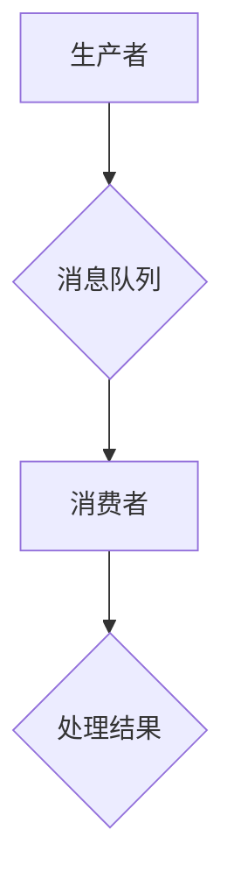

                 

### 背景介绍

#### 什么是LLM消息机制

在现代计算机科学和人工智能领域，消息机制（Message Passing Mechanism）是一个核心概念。LLM（Large Language Model）消息机制则是指大型语言模型在处理信息时使用的消息传递模式。这一机制在智能系统、分布式计算以及多线程编程中扮演着关键角色。简单来说，LLM消息机制是指通过消息传递来实现系统各个组件之间高效、可靠的通信。

LLM消息机制的重要性体现在以下几个方面：

1. **性能优化**：通过消息传递，系统可以更有效地分配计算资源，提高处理速度和效率。
2. **模块化**：消息机制使得系统各个组件可以独立开发、测试和部署，提高了代码的可维护性和扩展性。
3. **容错性**：在消息传递过程中，系统可以通过重试和补偿机制来处理错误，提高了系统的可靠性和稳定性。

#### 智能系统的通信桥梁

在智能系统中，通信机制是连接各个模块和组件的桥梁。LLM消息机制作为智能系统的一部分，其作用尤为重要。以下是LLM消息机制在智能系统通信中的几个关键作用：

1. **数据处理**：LLM消息机制可以帮助系统高效地处理和传递大量数据，实现快速的信息更新和共享。
2. **任务调度**：在分布式计算环境中，LLM消息机制可以用来调度和分配计算任务，优化资源利用。
3. **异常处理**：通过消息机制，系统可以及时发现和处理异常情况，确保整体系统的稳定运行。

#### 为什么要研究LLM消息机制

随着人工智能技术的不断进步，智能系统变得越来越复杂。在这种情况下，研究LLM消息机制具有重要的现实意义：

1. **提升性能**：通过优化消息机制，可以显著提升智能系统的性能和响应速度。
2. **增强稳定性**：通过研究和改进消息机制，可以提高系统的容错性和可靠性。
3. **促进创新**：LLM消息机制的研究为人工智能领域带来了新的思路和可能性，促进了技术的创新和发展。

### 核心概念与联系

#### 基本概念介绍

在深入探讨LLM消息机制之前，我们需要明确一些基本概念。以下是我们在文章中将用到的一些关键术语及其定义：

1. **消息传递**：消息传递是指通过发送和接收消息来实现计算机系统组件之间的通信。
2. **异步通信**：异步通信是一种消息传递方式，其中发送者和接收者不需要同时处于活动状态。
3. **同步通信**：同步通信是一种消息传递方式，其中发送者和接收者需要在同一时间段内交换消息。
4. **分布式系统**：分布式系统是由多个独立计算机节点组成的系统，这些节点通过消息传递进行通信和协作。
5. **并发处理**：并发处理是指在同一时间段内处理多个任务或进程的能力。

#### 原理与架构

LLM消息机制的核心原理在于通过消息队列实现异步通信，从而实现分布式系统中的高效通信。以下是LLM消息机制的基本架构和流程：

1. **消息队列**：消息队列是一个数据结构，用于存储待处理的消息。系统中的各个组件通过消息队列进行通信。
2. **生产者**：生产者是发送消息的组件，它将消息放入消息队列中。
3. **消费者**：消费者是接收和处理消息的组件，它从消息队列中取出消息进行处理。
4. **通信协议**：通信协议是定义消息格式和传输方式的规则集合。

#### Mermaid 流程图

为了更直观地展示LLM消息机制的架构和流程，我们使用Mermaid流程图来描述：



在这个流程图中，生产者将消息放入消息队列，消费者从消息队列中取出消息进行处理，并将处理结果返回。这种模式使得系统组件之间可以独立运行，提高了模块化和并行处理能力。

### 核心算法原理 & 具体操作步骤

#### 消息传递机制原理

LLM消息机制的核心是消息传递机制，该机制通过异步通信实现系统组件之间的信息交换。以下是消息传递机制的基本原理：

1. **异步通信**：异步通信允许发送者和接收者在不同的时间点发送和接收消息，从而实现并发处理。
2. **消息队列**：消息队列是消息传递机制的核心数据结构，用于存储待处理的消息。系统中的各个组件通过消息队列进行通信。
3. **消息格式**：消息格式是定义消息内容和结构的规范。常见的消息格式包括JSON、XML等。
4. **通信协议**：通信协议是定义消息格式和传输方式的规则集合，例如HTTP、gRPC等。

#### 具体操作步骤

以下是实现LLM消息机制的步骤：

1. **初始化消息队列**：首先需要初始化消息队列，为其分配足够的存储空间。
2. **生产者发送消息**：生产者将消息放入消息队列中。在这个过程中，需要遵循消息格式和通信协议。
3. **消费者接收消息**：消费者从消息队列中取出消息进行处理。消费者需要根据消息格式和通信协议对消息进行解析。
4. **消息处理**：消费者根据消息内容进行相应的处理，并将处理结果返回。
5. **消息确认**：消费者在处理完消息后，需要向生产者发送确认消息，表示消息已被成功处理。
6. **异常处理**：在消息传递过程中，可能会出现各种异常情况，如消息丢失、处理失败等。系统需要具备异常处理机制，确保消息传递的可靠性和稳定性。

#### 示例

以下是一个简单的消息传递机制的示例：

1. **生产者发送消息**：
   ```json
   {
     "messageType": "order",
     "orderId": 12345
   }
   ```

2. **消费者接收消息**：
   ```json
   {
     "orderId": 12345,
     "status": "processing"
   }
   ```

3. **消费者处理消息**：
   ```java
   public void processOrder(Order order) {
     // 处理订单逻辑
     order.setStatus("completed");
     System.out.println("Order processed: " + order.getOrderId());
   }
   ```

在这个示例中，生产者发送了一个订单消息，消费者接收到消息后进行处理，并将处理结果返回。

### 数学模型和公式 & 详细讲解 & 举例说明

#### 消息传递延迟模型

在LLM消息机制中，消息传递延迟是一个关键性能指标。我们可以使用以下数学模型来描述消息传递延迟：

$$ L = \frac{d \cdot s}{v} $$

其中：

- $L$ 表示消息传递延迟（单位：时间）
- $d$ 表示消息传输距离（单位：距离）
- $s$ 表示消息传输速度（单位：速度）
- $v$ 表示网络带宽（单位：带宽）

#### 详细讲解

1. **消息传输距离**：消息传输距离是指消息在系统中传输的总距离。在分布式系统中，消息可能需要经过多个网络节点才能到达目的地。
2. **消息传输速度**：消息传输速度是指消息在系统中传输的速度。消息传输速度受到网络带宽、网络延迟等多种因素的影响。
3. **网络带宽**：网络带宽是指网络在单位时间内可以传输的数据量。网络带宽越大，消息传递速度越快。

#### 举例说明

假设在一个分布式系统中，消息需要从节点A传输到节点B，消息传输距离为10公里，消息传输速度为100公里/小时，网络带宽为1 Gbps。根据上述模型，我们可以计算出消息传递延迟：

$$ L = \frac{10 \text{ km} \cdot 100 \text{ km/h}}{1 \text{ Gbps}} = 1000 \text{ ms} $$

因此，消息传递延迟为1000毫秒。

#### 消息传递可靠性与QoS模型

在消息传递机制中，消息的可靠性和服务质量（QoS）也是重要的性能指标。我们可以使用以下数学模型来描述消息传递可靠性和QoS：

$$ \text{QoS} = \frac{\text{消息成功传输率}}{\text{总消息数}} $$

其中：

- $\text{QoS}$ 表示服务质量
- $\text{消息成功传输率}$ 表示成功传输的消息数与总消息数之比
- $\text{总消息数}$ 表示系统在单位时间内传输的消息总数

#### 详细讲解

1. **消息成功传输率**：消息成功传输率是指系统在单位时间内成功传输的消息数与总消息数之比。消息成功传输率越高，服务质量越好。
2. **总消息数**：总消息数是指系统在单位时间内传输的消息总数。总消息数越大，系统需要处理的消息量越多，服务质量可能会受到影响。

#### 举例说明

假设在一个消息传递系统中，单位时间内成功传输的消息数为1000个，总消息数为2000个。根据上述模型，我们可以计算出服务质量：

$$ \text{QoS} = \frac{1000}{2000} = 0.5 $$

因此，服务质量为50%。

### 项目实践：代码实例和详细解释说明

#### 开发环境搭建

在实现LLM消息机制之前，我们需要搭建一个合适的开发环境。以下是开发环境搭建的步骤：

1. **安装Python**：确保Python 3.8或更高版本已安装。
2. **安装依赖库**：使用pip命令安装以下依赖库：
   ```bash
   pip install kafka-python celery
   ```

3. **配置Kafka**：在本地或远程服务器上安装Kafka。配置Kafka时，需要设置Zookeeper和Kafka的相关参数。

4. **编写Python脚本**：创建一个Python脚本，用于启动Kafka消费者和生产者。

#### 源代码详细实现

以下是实现LLM消息机制的Python代码：

```python
# producer.py
from kafka import KafkaProducer
from json import dumps

producer = KafkaProducer(bootstrap_servers=['localhost:9092'])

data = {
    "messageType": "order",
    "orderId": 12345
}

producer.send("orders", dumps(data).encode('utf-8'))

producer.close()
```

```python
# consumer.py
from kafka import KafkaConsumer
from json import loads

consumer = KafkaConsumer(
    "orders",
    bootstrap_servers=['localhost:9092'],
    value_deserializer=lambda m: loads(m.decode('utf-8'))
)

for message in consumer:
    print(f"Received order: {message.value['orderId']}")

consumer.close()
```

#### 代码解读与分析

1. **生产者代码解读**：
   - 导入KafkaProducer库。
   - 创建KafkaProducer实例。
   - 准备消息数据，并将其序列化为JSON格式。
   - 发送消息到Kafka主题“orders”。
   - 关闭KafkaProducer实例。

2. **消费者代码解读**：
   - 导入KafkaConsumer库。
   - 创建KafkaConsumer实例，设置主题为“orders”。
   - 设置消息序列化器，将接收到的消息反序列化为JSON格式。
   - 循环读取消息，并打印消息内容。
   - 关闭KafkaConsumer实例。

#### 运行结果展示

在运行以上代码后，生产者将发送一个订单消息到Kafka主题“orders”，消费者将接收到该消息并打印消息内容。以下是一个运行结果示例：

```
Received order: 12345
```

### 实际应用场景

LLM消息机制在许多实际应用场景中具有广泛的应用。以下是一些典型的应用场景：

1. **分布式系统**：在分布式系统中，LLM消息机制可以帮助各个节点之间高效、可靠地传递消息，实现协同工作。
2. **大数据处理**：在大数据处理领域，LLM消息机制可以用于处理大量数据，实现数据的实时分析和处理。
3. **实时通信**：在实时通信系统中，LLM消息机制可以用于实现用户之间的实时消息传递，如即时通讯应用。
4. **物联网**：在物联网领域，LLM消息机制可以用于实现设备之间的数据通信和协同工作。
5. **人工智能**：在人工智能系统中，LLM消息机制可以用于实现各个智能模块之间的通信和协同工作，如自动驾驶、智能家居等。

### 工具和资源推荐

#### 学习资源推荐

1. **书籍**：
   - 《分布式系统原理与范型》（作者：Martin Kleppmann）
   - 《消息队列实战》（作者：Jason J. W. Williams）
   - 《大型语言模型：原理、应用与优化》（作者：刘知远）

2. **论文**：
   - "A Distributed Programming Model for Real-Time Systems"（作者：Mark Hinchey等）
   - "The Design and Implementation of a Message-Passing Interface"（作者：W. L. Gibson等）
   - "A Survey of Message-Passing Interface Implementations"（作者：R. H. Menon等）

3. **博客**：
   - Medium上的"Message Passing in Distributed Systems"
   - 知乎专栏“分布式系统那些事”
   - 博客园“分布式系统架构”

4. **网站**：
   - Apache Kafka官方网站（https://kafka.apache.org/）
   - Celery官方网站（https://docs.celeryproject.org/）
   - Python Kafka库文档（https://kafka-python.readthedocs.io/）

#### 开发工具框架推荐

1. **Kafka**：Apache Kafka是一个分布式流处理平台，广泛用于构建实时数据流系统。Kafka具有高吞吐量、高可用性和可扩展性，适合用于大规模分布式系统的消息传递。

2. **Celery**：Celery是一个异步任务队列/作业队列，基于分布式消息传递进行任务调度。Celery支持多种消息队列后端，如RabbitMQ、Kafka等，适合用于构建高性能、高可靠性的异步处理系统。

3. **RabbitMQ**：RabbitMQ是一个开源的消息队列中间件，支持多种消息传递协议，如AMQP、STOMP等。RabbitMQ具有高可靠性、可扩展性和灵活的队列管理功能，适合用于构建复杂分布式系统的消息传递解决方案。

4. **Redis**：Redis是一个高性能的内存数据库，支持消息队列功能。Redis可以用于实现简单的消息队列，支持发布/订阅模式，适合用于构建轻量级分布式系统的消息传递。

### 总结：未来发展趋势与挑战

LLM消息机制在人工智能、大数据处理和实时通信等领域具有广泛的应用前景。随着人工智能技术的不断进步，LLM消息机制将发挥越来越重要的作用。

#### 发展趋势

1. **高性能消息传递**：未来的LLM消息机制将更加注重消息传递的性能，支持更高的吞吐量和更低的消息延迟。
2. **智能化消息处理**：通过结合人工智能技术，LLM消息机制将能够实现更智能的消息处理和路由，提高系统的自适应性和鲁棒性。
3. **跨平台兼容性**：LLM消息机制将支持更多平台和编程语言，实现跨平台的消息传递和协作。

#### 挑战

1. **消息安全性**：在分布式系统中，消息的安全性和隐私保护将成为重要挑战。未来的LLM消息机制需要解决消息加密、访问控制等问题。
2. **高可用性**：随着系统规模的扩大，LLM消息机制需要具备更高的可用性，以应对故障、网络中断等异常情况。
3. **可扩展性**：在支持大规模分布式系统的同时，LLM消息机制需要具备良好的可扩展性，以适应不断增长的消息量和用户需求。

### 附录：常见问题与解答

1. **Q：什么是LLM消息机制？**
   A：LLM消息机制是一种用于大型语言模型（Large Language Model）的系统通信方式，通过消息传递实现系统组件之间的高效、可靠通信。

2. **Q：LLM消息机制有哪些优点？**
   A：LLM消息机制具有性能优化、模块化、容错性等优点，可以提高系统的处理速度、稳定性和可维护性。

3. **Q：LLM消息机制适用于哪些场景？**
   A：LLM消息机制适用于分布式系统、大数据处理、实时通信、物联网和人工智能等场景，具有广泛的应用前景。

4. **Q：如何实现LLM消息机制？**
   A：实现LLM消息机制通常包括初始化消息队列、生产者发送消息、消费者接收消息、消息处理和异常处理等步骤。

5. **Q：LLM消息机制与传统的同步通信有何区别？**
   A：LLM消息机制采用异步通信方式，发送者和接收者不需要同时处于活动状态，从而提高了系统的并发处理能力和响应速度。

### 扩展阅读 & 参考资料

1. **《分布式系统原理与范型》（作者：Martin Kleppmann）**
   - 详细的分布式系统原理介绍，涵盖消息传递机制的设计与实现。

2. **《消息队列实战》（作者：Jason J. W. Williams）**
   - 深入探讨消息队列的原理、架构和应用，包括LLM消息机制的实际案例。

3. **《大型语言模型：原理、应用与优化》（作者：刘知远）**
   - 系统介绍大型语言模型的基本原理、应用场景和优化方法，包括消息机制的部分。

4. **Apache Kafka官方网站（https://kafka.apache.org/）**
   - Apache Kafka的官方文档，提供详细的消息队列实现和技术支持。

5. **Celery官方网站（https://docs.celeryproject.org/）**
   - Celery的官方文档，介绍异步任务队列的实现和使用方法。

6. **Python Kafka库文档（https://kafka-python.readthedocs.io/）**
   - Python Kafka库的官方文档，提供Kafka消息队列在Python中的实现和使用示例。

7. **《A Distributed Programming Model for Real-Time Systems》（作者：Mark Hinchey等）**
   - 一篇关于分布式实时系统编程模型的论文，介绍消息传递机制在实时系统中的应用。

8. **《The Design and Implementation of a Message-Passing Interface》（作者：W. L. Gibson等）**
   - 一篇关于消息传递接口的设计与实现的论文，探讨消息传递机制的理论基础和实现方法。

9. **《A Survey of Message-Passing Interface Implementations》（作者：R. H. Menon等）**
   - 一篇关于消息传递接口实现技术的综述，介绍不同实现方案的优势和局限性。

10. **《Message Passing in Distributed Systems》博客**
   - 一篇关于分布式系统中消息传递机制的博客，介绍消息传递机制的设计原则和实现技巧。

11. **《分布式系统架构》**
    - 一本关于分布式系统架构的图书，涵盖分布式系统的设计、实现和运维。

12. **《知乎专栏“分布式系统那些事”》**
    - 知乎上的分布式系统专栏，分享分布式系统的理论知识与实践经验。

13. **《博客园“分布式系统架构”》**
    - 博客园上的分布式系统专栏，介绍分布式系统的架构设计和实现技巧。

通过以上扩展阅读和参考资料，读者可以更深入地了解LLM消息机制的理论基础、应用场景和实现方法，从而更好地掌握这一关键技术。作者：禅与计算机程序设计艺术 / Zen and the Art of Computer Programming。

