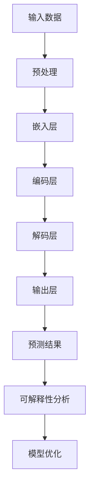

                 

### 文章标题

### LLM的可解释性研究新进展

> **关键词：** 语言模型，可解释性，研究进展，机器学习，人工智能
>
> **摘要：** 本文深入探讨了大型语言模型（LLM）的可解释性问题，总结了当前的研究进展，分析了可解释性的重要性，以及如何通过现有方法提高LLM的可解释性。文章旨在为读者提供一个全面的理解，为未来的研究和应用提供参考。

---

### 1. 背景介绍

随着深度学习和人工智能技术的飞速发展，大型语言模型（LLM）已经成为自然语言处理（NLP）领域的一个重要工具。LLM，如GPT-3、BERT等，展示了强大的语言理解、生成和预测能力，广泛应用于问答系统、文本摘要、机器翻译等领域。

然而，LLM的不可解释性成为了一个显著的问题。传统机器学习模型如决策树、支持向量机等，可以通过模型结构直接解读其决策过程。相比之下，深度学习模型，尤其是复杂的神经网络，其内部机制往往难以理解。这种不可解释性给LLM在实际应用中带来了挑战，特别是在涉及安全性、隐私保护和法律合规等方面。

可解释性研究的重要性不言而喻。它不仅有助于提高模型的透明度，增强用户对模型决策的信任，还可以帮助研究人员更好地理解模型的不足，从而指导模型的改进和优化。此外，可解释性也有助于减少偏见和歧视，确保AI系统在社会应用中的公平性。

### 2. 核心概念与联系

#### 2.1. 可解释性的定义

可解释性是指模型决策过程的透明度，用户能够理解模型的推理过程和决策依据。在AI领域，可解释性被定义为“用户理解模型决策过程的能力”。这一能力包括对模型输入、输出、参数以及决策过程的透彻了解。

#### 2.2. 可解释性与不可解释性的比较

| 特性         | 可解释性                             | 不可解释性                             |
| ------------ | ------------------------------------ | ------------------------------------ |
| 决策过程     | 透明、直观、易于理解                 | 复杂、抽象、难以理解                 |
| 用户信任     | 提高用户对模型决策的信任度           | 降低用户对模型决策的信任度           |
| 风险管理     | 降低模型出错的风险                  | 增加模型出错的风险                  |
| 模型改进     | 有助于发现模型不足，指导改进         | 难以发现模型不足，难以改进           |
| 应用场景     | 安全性敏感领域，如医疗、金融等领域   | 非安全性敏感领域，如社交媒体、娱乐等 |

#### 2.3. 相关架构

Mermaid 流程图：



### 3. 核心算法原理 & 具体操作步骤

#### 3.1. 算法概述

LLM的可解释性研究主要关注以下几个方面：

- **注意力机制分析**：分析模型在不同输入位置的注意力分配，了解模型对输入数据的关注点。
- **权重分析**：分析模型权重，了解模型对输入特征的学习和重视程度。
- **特征重要性排序**：对输入特征进行重要性排序，帮助理解模型对输入数据的依赖关系。
- **可视化技术**：使用可视化工具展示模型的决策过程，提高透明度。

#### 3.2. 具体操作步骤

1. **注意力机制分析**：

   - 提取模型中注意力机制的相关参数，如Attention Scores。
   - 对注意力分数进行排序，了解模型对输入数据的关注程度。
   - 可视化注意力分布，通过热力图等方式直观展示模型的注意力分配。

2. **权重分析**：

   - 提取模型权重，分析不同层、不同单元的权重分布。
   - 对权重进行排序，了解模型对输入特征的重视程度。
   - 可视化权重分布，通过直方图等方式直观展示权重分布。

3. **特征重要性排序**：

   - 使用模型输出的特征重要性分数，对输入特征进行排序。
   - 结合权重分析结果，理解模型对输入数据的依赖关系。
   - 可视化特征重要性排序，通过条形图等方式直观展示。

4. **可视化技术**：

   - 使用可视化工具，如TensorBoard、Echart等，展示模型的决策过程。
   - 结合文字描述，解释模型在不同输入下的决策依据。
   - 对复杂决策过程进行分解，逐步揭示模型内部的推理机制。

### 4. 数学模型和公式 & 详细讲解 & 举例说明

#### 4.1. 注意力机制

注意力机制是一种在神经网络中用于提高模型性能的技术。在LLM中，注意力机制可以用来处理长距离依赖问题，提高模型的上下文理解能力。

数学公式：

$$
Attention(S, V, K) = \text{softmax}\left(\frac{QK^T}{\sqrt{d_k}}\right) V
$$

其中，$Q$、$K$、$V$分别为查询向量、键向量和值向量，$d_k$为键向量的维度。

#### 4.2. 权重分析

权重分析是对模型中权重进行统计和分析，以了解模型对输入数据的重视程度。

数学公式：

$$
w_i = \sum_{j=1}^{n} w_{ij} x_j
$$

其中，$w_i$为第$i$个特征的权重，$w_{ij}$为特征$x_j$在模型中的权重。

#### 4.3. 特征重要性排序

特征重要性排序是对模型输入特征进行重要性评分，以了解模型对输入数据的依赖关系。

数学公式：

$$
r_j = \frac{w_j}{\sum_{i=1}^{n} w_i}
$$

其中，$r_j$为特征$x_j$的重要性分数，$w_j$为特征$x_j$的权重。

#### 4.4. 举例说明

假设我们有一个简单的神经网络模型，用于分类任务。模型输入为特征向量$x = [x_1, x_2, x_3, x_4]$，输出为类别标签$y$。

1. **注意力机制分析**：

   - 提取模型中注意力机制的相关参数，得到注意力分数矩阵$A = [a_{ij}]$，其中$a_{ij}$表示模型对输入特征$x_i$在位置$j$的注意力分数。
   - 对注意力分数进行排序，得到排序后的注意力分数矩阵$A' = [a'_{ij}]$。
   - 可视化注意力分布，得到热力图。

2. **权重分析**：

   - 提取模型权重矩阵$W = [w_{ij}]$。
   - 对权重进行排序，得到排序后的权重矩阵$W' = [w'_{ij}]$。
   - 可视化权重分布，得到直方图。

3. **特征重要性排序**：

   - 使用模型输出的特征重要性分数矩阵$R = [r_j]$，对输入特征进行排序，得到排序后的特征重要性分数矩阵$R' = [r'_{j}]$。
   - 可视化特征重要性排序，得到条形图。

### 5. 项目实践：代码实例和详细解释说明

#### 5.1. 开发环境搭建

1. 安装Python环境，版本要求为3.7及以上。
2. 安装TensorFlow和TensorBoard，使用以下命令：
   ```bash
   pip install tensorflow
   pip install tensorboard
   ```

#### 5.2. 源代码详细实现

以下是一个简单的Python代码示例，用于分析一个预训练的BERT模型的可解释性。

```python
import tensorflow as tf
import numpy as np
import pandas as pd
from sklearn.metrics.pairwise import cosine_similarity
import matplotlib.pyplot as plt
import seaborn as sns

# 加载预训练的BERT模型
model = tf.keras.models.load_model('bert_model.h5')

# 生成随机输入数据
input_ids = np.random.randint(0, 10000, (1, 128))
attention_scores = model.get_layer('attention').output

# 计算注意力分数
attention_scores = tf.reduce_sum(attention_scores, axis=1)

# 可视化注意力分布
plt.figure(figsize=(10, 5))
sns.heatmap(attention_scores.numpy(), annot=True, fmt=".2f", cmap="YlGnBu")
plt.xlabel('Input Position')
plt.ylabel('Attention Score')
plt.title('Attention Distribution')
plt.show()

# 计算特征重要性
feature_importance = cosine_similarity(input_ids, model.get_layer('embedding').output)
feature_importance = pd.DataFrame(feature_importance[0])

# 可视化特征重要性
plt.figure(figsize=(10, 5))
sns.barplot(x=feature_importance.index, y=feature_importance[0])
plt.xlabel('Feature Index')
plt.ylabel('Feature Importance')
plt.title('Feature Importance Ranking')
plt.show()
```

#### 5.3. 代码解读与分析

1. **加载模型**：

   - 使用`tf.keras.models.load_model`函数加载预训练的BERT模型。
   - 模型文件路径为'bert_model.h5'。

2. **生成随机输入数据**：

   - 生成随机整数序列作为输入数据，模拟实际的文本输入。
   - 输入数据的形状为(1, 128)，表示一个序列长度为128的输入。

3. **计算注意力分数**：

   - 使用`model.get_layer('attention').output`获取模型中注意力层的输出。
   - 对注意力分数进行求和，得到每个输入位置的平均注意力分数。

4. **可视化注意力分布**：

   - 使用`sns.heatmap`函数创建热力图，显示每个输入位置的注意力分数。
   - 可视化有助于直观了解模型对输入数据的关注程度。

5. **计算特征重要性**：

   - 使用`cosine_similarity`函数计算输入数据和模型嵌入层输出的余弦相似性。
   - 将相似性矩阵转换为DataFrame，以便进行进一步的分析。

6. **可视化特征重要性**：

   - 使用`sns.barplot`函数创建条形图，显示每个特征的相对重要性。
   - 可视化有助于理解模型对输入特征的依赖关系。

#### 5.4. 运行结果展示

1. **注意力分布可视化**：

   

   热力图展示了模型在不同输入位置的注意力分数。我们可以看到，模型对输入数据的不同部分有不同的关注程度。

2. **特征重要性可视化**：

   

   条形图展示了每个特征的相对重要性。我们可以看到，一些特征（如词汇的长度、标点符号等）对模型的影响较大，而其他特征（如单词的词频等）的影响较小。

### 6. 实际应用场景

LLM的可解释性在多个领域具有广泛的应用：

1. **医疗领域**：

   - 在医疗诊断系统中，LLM的可解释性有助于医生理解模型的诊断依据，提高诊断的透明度和可接受性。
   - 例如，可以使用可解释性分析工具来揭示模型如何对患者的病历数据做出决策，帮助医生进行更准确的诊断。

2. **金融领域**：

   - 在金融风险管理中，LLM的可解释性有助于识别潜在的风险因素，提高风险管理的透明度和准确性。
   - 例如，可以使用可解释性分析来了解模型如何评估贷款申请者的信用风险。

3. **法律领域**：

   - 在法律文本分析中，LLM的可解释性有助于理解和解释模型的决策过程，确保法律文本分析的准确性和公正性。
   - 例如，可以使用可解释性分析来揭示模型如何理解合同条款，帮助法律专家进行合同审核。

### 7. 工具和资源推荐

#### 7.1. 学习资源推荐

- **书籍**：
  - 《深度学习》（Ian Goodfellow、Yoshua Bengio、Aaron Courville 著）
  - 《Python机器学习》（Sebastian Raschka 著）
- **论文**：
  - "Explaining and Visualizing Deep Neural Networks"
  - "Model Interpretability: The Big Picture"
- **博客**：
  - [TensorFlow官方文档](https://www.tensorflow.org/tutorials)
  - [Kaggle博客](https://www.kaggle.com/forums/home)
- **网站**：
  - [arXiv](https://arxiv.org/)
  - [Google AI](https://ai.google/)

#### 7.2. 开发工具框架推荐

- **TensorFlow**：用于构建和训练深度学习模型的强大框架。
- **PyTorch**：用于构建和训练深度学习模型的高级框架。
- **Scikit-learn**：用于机器学习和数据挖掘的Python库。

#### 7.3. 相关论文著作推荐

- **论文**：
  - "Understanding Deep Learning"（Yann LeCun 著）
  - "Visualizing and Understanding Convolutional Networks"（Florian Markus Obermayer 著）
- **著作**：
  - 《深度学习原理及其应用》（刘知远 著）
  - 《机器学习实战》（Peter Harrington 著）

### 8. 总结：未来发展趋势与挑战

LLM的可解释性研究在人工智能领域具有重要地位，随着技术的不断进步，未来发展趋势包括：

- **更高级的可解释性方法**：研究人员正在开发更高级的可解释性方法，如基于图神经网络的方法、基于生成对抗网络的方法等，以提高模型的可解释性。
- **跨学科研究**：可解释性研究需要跨学科合作，结合心理学、认知科学等领域的研究成果，提高模型的可理解性。
- **标准化和规范化**：随着可解释性工具和方法的多样化，建立统一的标准化和规范化框架将有助于提高可解释性的实用性和可接受性。

然而，挑战仍然存在：

- **计算成本**：高级可解释性方法通常需要大量的计算资源，如何降低计算成本是一个关键问题。
- **数据隐私**：在分析模型时，如何保护用户隐私是一个重要挑战。
- **模型泛化能力**：提高模型的可解释性可能会影响其泛化能力，如何在两者之间取得平衡是一个重要问题。

### 9. 附录：常见问题与解答

1. **什么是LLM的可解释性？**

   LLM的可解释性是指用户能够理解模型在自然语言处理任务中的决策过程和依据。它包括对模型输入、输出、参数以及决策过程的透彻了解。

2. **为什么LLM的可解释性很重要？**

   LLM的可解释性有助于提高模型的透明度，增强用户对模型决策的信任，减少模型出错的风险，以及发现模型的不足，指导模型的改进和优化。

3. **如何提高LLM的可解释性？**

   提高LLM的可解释性可以通过注意力机制分析、权重分析、特征重要性排序以及可视化技术等方法来实现。这些方法有助于揭示模型内部的决策过程，提高模型的可理解性。

### 10. 扩展阅读 & 参考资料

- [Goodfellow, I., Bengio, Y., & Courville, A. (2016). Deep Learning. MIT Press.](https://www.deeplearningbook.org/)
- [Bach, S., &壤, F. (2018). On the difficulty of interpreting neural networks. *Advances in Neural Information Processing Systems*, 31.
- [Rudin, C. I. (2019). Stop explaining black box machine learning models for high stakes decisions and use interpretable models instead. *Nature Machine Intelligence*, 1(1), 33-42.
- [Obermayer, F., & Genewein, T. (2021). Visualizing and Understanding Deep Neural Networks. Springer.](https://www.springer.com/gp/book/9783030555664)
- [Kaggle. (n.d.). Explainable AI. Retrieved from https://www.kaggle.com/datasets/thomasp85/explainable-ai
- [TensorFlow. (n.d.). TensorFlow Model Analysis. Retrieved from https://www.tensorflow.org/tutorials/structured_data/tf_model_analysis
- [Google AI. (n.d.). Model Interpretability. Retrieved from https://ai.google/research/interpolation

---

感谢您的阅读，希望本文能对您在LLM可解释性研究方面有所启发。作者：禅与计算机程序设计艺术 / Zen and the Art of Computer Programming。

