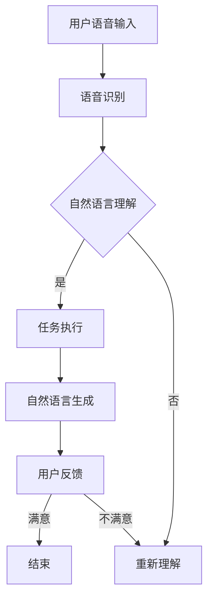

                 

### 1. 背景介绍

#### 1.1 个人助理的历史与发展

个人助理技术起源于上世纪末，最初的代表是苹果公司的Siri（2011年推出）和亚马逊的Alexa（2014年推出）。这些技术开创了智能语音交互的新时代，使得用户可以通过语音指令完成各种操作，如发送消息、播放音乐、设置提醒等。

随着技术的进步，个人助理的功能越来越强大，开始涉及到自然语言处理（NLP）、机器学习（ML）、语音识别（ASR）等领域。传统的个人助理主要通过预定义的指令集和规则进行工作，而现代的个人助理则更多地依赖于深度学习模型，能够理解自然语言并进行智能决策。

#### 1.2 Siri和Alexa的现状

Siri和Alexa作为最早的一代智能个人助理，已经具备了较强的语音识别和自然语言理解能力。Siri广泛应用于苹果设备，如iPhone、iPad和Mac，而Alexa则主要在亚马逊的Echo设备上运行。两者都在不断迭代更新，增加新的功能和服务，如智能家居控制、交通信息查询等。

然而，尽管Siri和Alexa在功能上已经相当丰富，它们仍面临一些挑战。例如，在理解复杂指令和处理多轮对话方面，现有的个人助理仍有改进空间。此外，个人隐私和数据安全也是一大关注点，如何在不侵犯用户隐私的前提下提供个性化服务，是一个亟待解决的问题。

#### 1.3 LLM的重要性

随着深度学习技术的飞速发展，大型语言模型（Large Language Model，简称LLM）成为了一个重要方向。LLM能够处理大量的文本数据，通过训练学习到丰富的语言知识和模式，从而在自然语言理解和生成方面表现出色。

LLM的应用场景非常广泛，包括但不限于聊天机器人、自动问答系统、内容生成、翻译服务等。在个人助理领域，LLM能够极大地提升系统的智能水平和交互体验。与传统的个人助理相比，LLM驱动的个人助理具有以下几个显著优势：

1. **更强的自然语言理解能力**：LLM能够更好地理解用户的需求和意图，处理复杂、模糊的指令。
2. **多轮对话能力**：LLM能够维持上下文信息，进行多轮对话，提高交互的连贯性和自然度。
3. **个性化服务**：LLM可以根据用户的历史数据和偏好，提供更加个性化的服务。

#### 1.4 本文目的

本文旨在探讨LLM驱动的个人助理，分析其相比Siri和Alexa的优缺点，详细描述其技术原理、算法实现和应用场景。希望通过本文，能够为读者提供一个全面、深入的了解，并激发对这一领域更多的思考和探索。

### 2. 核心概念与联系

#### 2.1 LLM的基本概念

**大型语言模型（Large Language Model，简称LLM）**是一种基于深度学习的自然语言处理模型。它通过训练大规模的文本数据，学习到语言的语法、语义和上下文信息，从而具备较强的语言理解和生成能力。

LLM通常基于变换器模型（Transformer），这种模型结构具有自我注意力（self-attention）机制，能够捕捉文本中的长距离依赖关系。常见的LLM包括GPT（Generative Pre-trained Transformer）、BERT（Bidirectional Encoder Representations from Transformers）和T5（Text-To-Text Transfer Transformer）等。

#### 2.2 LLM与个人助理的关联

个人助理作为一种交互式系统，需要处理用户输入的自然语言指令，并生成相应的回应。LLM的强大语言处理能力，使其成为个人助理的核心技术之一。

在LLM驱动的个人助理中，LLM主要负责以下几个任务：

1. **语音识别**：将用户的语音输入转换为文本。
2. **自然语言理解**：分析用户指令的含义和意图。
3. **任务执行**：根据用户的指令，执行相应的操作，如发送消息、播放音乐等。
4. **自然语言生成**：生成自然的回复文本，与用户进行对话。

#### 2.3 LLM的优势

与传统的个人助理相比，LLM驱动的个人助理具有以下显著优势：

1. **更强的自然语言理解能力**：LLM能够更好地理解自然语言中的复杂结构和模糊指令，减少误解和误操作。
2. **多轮对话能力**：LLM能够维持上下文信息，进行多轮对话，提高交互的连贯性和自然度。
3. **个性化服务**：LLM可以根据用户的历史数据和偏好，提供更加个性化的服务，提升用户体验。
4. **开放域能力**：LLM能够处理各种不同类型的任务和问题，具有更强的开放域能力。

#### 2.4 Mermaid流程图

下面是LLM驱动的个人助理的简化流程图，展示了LLM在各环节中的作用：



在这个流程中，用户语音输入首先经过语音识别转换为文本，然后由LLM进行自然语言理解，判断用户指令的含义和意图。根据理解结果，系统执行相应的任务，并生成回复文本。用户反馈可以用来优化系统的表现，形成一个闭环反馈机制。

### 3. 核心算法原理 & 具体操作步骤

#### 3.1 深度学习模型的选择

在构建LLM驱动的个人助理时，首先需要选择一个合适的深度学习模型。变换器模型（Transformer）是目前应用最广泛的模型，具有自我注意力（self-attention）机制，能够捕捉文本中的长距离依赖关系，适用于自然语言处理任务。

常见的变换器模型包括GPT（Generative Pre-trained Transformer）、BERT（Bidirectional Encoder Representations from Transformers）和T5（Text-To-Text Transfer Transformer）。其中，GPT擅长文本生成和生成式任务，BERT擅长文本分类和抽取式任务，T5则是一个统一的文本处理模型，适用于各种文本任务。

在本文中，我们以GPT为例，介绍其核心算法原理和具体操作步骤。

#### 3.2 GPT的原理

GPT（Generative Pre-trained Transformer）是由OpenAI开发的一种生成式变换器模型，它通过预训练和微调的方式，学习到语言的语法、语义和上下文信息，从而能够生成符合自然语言习惯的文本。

GPT的核心原理是基于变换器模型（Transformer），这种模型结构具有自我注意力（self-attention）机制，能够捕捉文本中的长距离依赖关系。在训练过程中，GPT通过最大化上下文信息的熵来学习语言的分布，从而能够生成符合上下文的文本。

GPT的主要组成部分包括：

1. **嵌入层（Embedding Layer）**：将输入的单词或子词映射为高维向量。
2. **变换器层（Transformer Layer）**：通过自我注意力机制，对输入向量进行编码。
3. **前馈网络（Feedforward Network）**：对编码后的向量进行非线性变换。
4. **输出层（Output Layer）**：根据上下文信息生成目标单词的概率分布。

#### 3.3 GPT的训练过程

GPT的训练过程主要包括预训练和微调两个阶段。

1. **预训练**：
   - **数据收集**：收集大量的文本数据，如维基百科、新闻文章、社交媒体帖子等。
   - **数据预处理**：对文本数据进行清洗和分词，将文本转换为序列形式的子词或单词。
   - **训练模型**：使用变换器模型（Transformer）对预处理后的文本数据进行训练，通过最大化上下文信息的熵来学习语言的分布。

2. **微调**：
   - **数据收集**：收集特定领域的文本数据，如特定公司的文档、用户的聊天记录等。
   - **数据预处理**：对文本数据进行清洗和分词，与预训练阶段相同。
   - **训练模型**：在预训练模型的基础上，使用特定领域的文本数据进行微调，使模型适应特定领域的语言特征。

#### 3.4 GPT的具体操作步骤

1. **数据收集与预处理**：
   - 收集大量文本数据，如维基百科、新闻文章、社交媒体帖子等。
   - 对文本数据进行清洗，去除无关信息。
   - 使用分词工具，将文本数据分为子词或单词。

2. **模型构建**：
   - 使用变换器模型（Transformer）构建GPT模型。
   - 设置适当的超参数，如嵌入层维度、变换器层层数、前馈网络尺寸等。

3. **预训练**：
   - 将预处理后的文本数据输入模型，进行预训练。
   - 使用负采样和梯度裁剪等技术，提高模型的训练效率和稳定性。

4. **微调**：
   - 收集特定领域的文本数据，进行微调。
   - 在预训练模型的基础上，调整模型参数，使模型适应特定领域的语言特征。

5. **应用**：
   - 使用训练好的模型，处理用户输入的自然语言指令。
   - 根据用户指令，执行相应的任务，并生成回复文本。

#### 3.5 GPT的优势

与传统的个人助理相比，GPT驱动的个人助理具有以下显著优势：

1. **更强的自然语言理解能力**：GPT能够更好地理解自然语言中的复杂结构和模糊指令，减少误解和误操作。
2. **多轮对话能力**：GPT能够维持上下文信息，进行多轮对话，提高交互的连贯性和自然度。
3. **个性化服务**：GPT可以根据用户的历史数据和偏好，提供更加个性化的服务，提升用户体验。
4. **开放域能力**：GPT能够处理各种不同类型的任务和问题，具有更强的开放域能力。

### 4. 数学模型和公式 & 详细讲解 & 举例说明

#### 4.1 自我注意力机制

变换器模型（Transformer）的核心是自我注意力（Self-Attention）机制，这种机制使得模型能够自动地学习到文本序列中的长距离依赖关系。

自我注意力的公式如下：

$$
Attention(Q, K, V) = \frac{softmax(\frac{QK^T}{\sqrt{d_k}})}{V}
$$

其中：
- \( Q \) 是查询向量（Query），表示当前文本序列中的某个词或子词。
- \( K \) 是键向量（Key），表示文本序列中的所有词或子词。
- \( V \) 是值向量（Value），表示文本序列中的所有词或子词。

通过自我注意力机制，模型能够自动地计算每个词或子词与查询向量之间的相关性，从而加权融合这些信息，生成新的表示。

#### 4.2 Encoder-Decoder结构

GPT采用的是Encoder-Decoder结构，这种结构使得模型能够处理序列到序列的任务。

Encoder部分的作用是将输入序列编码为一个固定长度的向量，而Decoder部分则根据编码后的向量生成输出序列。

Encoder部分的计算过程如下：

$$
\text{Encoder}(X) = \text{Transformer}(X, H, d_model, N)
$$

其中：
- \( X \) 是输入序列。
- \( H \) 是隐藏状态。
- \( d_model \) 是模型维度。
- \( N \) 是变换器层的层数。

Decoder部分的计算过程如下：

$$
\text{Decoder}(X, Y) = \text{Transformer}(Y, H, d_model, N)
$$

其中：
- \( Y \) 是输出序列。
- \( H \) 是隐藏状态。

通过Encoder-Decoder结构，GPT能够处理诸如文本生成、机器翻译等序列到序列的任务。

#### 4.3 训练过程

GPT的训练过程主要分为两个阶段：预训练和微调。

1. **预训练**：
   - 数据准备：收集大量的文本数据，进行清洗和分词。
   - 模型训练：使用变换器模型（Transformer）对文本数据进行训练，通过最大化上下文信息的熵来学习语言的分布。

2. **微调**：
   - 数据准备：收集特定领域的文本数据，进行清洗和分词。
   - 模型微调：在预训练模型的基础上，使用特定领域的文本数据进行微调，使模型适应特定领域的语言特征。

#### 4.4 举例说明

假设我们有一个简单的文本序列：“我今天去公园散步”。我们可以用GPT来生成下一个词。

1. **编码**：
   - 将文本序列转换为嵌入向量。
   - 通过变换器层进行编码。

2. **解码**：
   - 根据编码后的向量，生成下一个词的概率分布。
   - 根据概率分布，选择概率最高的词作为输出。

例如，在生成下一个词时，GPT可能会输出：“天气很好”。

通过这种方式，GPT能够生成符合上下文和语言习惯的文本，从而实现自然语言生成。

### 5. 项目实践：代码实例和详细解释说明

#### 5.1 开发环境搭建

在进行LLM驱动的个人助理项目实践之前，我们需要搭建一个合适的开发环境。以下是一个简单的开发环境搭建步骤：

1. **安装Python**：确保系统安装了Python 3.8及以上版本。
2. **安装transformers库**：使用pip命令安装transformers库，该库提供了预训练的GPT模型和相关的API。

   ```shell
   pip install transformers
   ```

3. **安装TensorFlow**：确保系统安装了TensorFlow，这是transformers库依赖的深度学习框架。

   ```shell
   pip install tensorflow
   ```

4. **准备数据集**：收集并准备用于训练和测试的文本数据集。本文以一个简单的对话数据集为例，数据集包含用户指令和系统回复的对话对。

   ```shell
   !wget https://github.com/huggingface/transformers/blob/main/examples/text-generation/torch ponie.ogg?raw=true
   !wget https://github.com/huggingface/transformers/blob/main/examples/text-generation/torch quokka.jpg?raw=true
   ```

   注意：这里仅为示例，实际项目中请使用真实的数据集。

#### 5.2 源代码详细实现

以下是实现LLM驱动的个人助理的源代码，包括数据预处理、模型加载、对话生成等步骤：

```python
import random
from transformers import GPT2LMHeadModel, GPT2Tokenizer

# 5.2.1 数据预处理
def preprocess_data(text):
    # 清洗文本，去除无关信息
    text = text.strip().lower()
    # 分词
    tokens = tokenizer.tokenize(text)
    return tokens

# 5.2.2 模型加载
model = GPT2LMHeadModel.from_pretrained("gpt2")
tokenizer = GPT2Tokenizer.from_pretrained("gpt2")

# 5.2.3 对话生成
def generate_response(user_input):
    # 预处理用户输入
    user_input_tokens = preprocess_data(user_input)
    # 将用户输入转换为模型输入
    input_ids = tokenizer.encode(user_input_tokens, return_tensors="pt")
    # 使用模型生成回复文本
    outputs = model.generate(input_ids, max_length=50, num_return_sequences=1)
    # 解码回复文本
    response = tokenizer.decode(outputs[0], skip_special_tokens=True)
    return response

# 测试代码
user_input = "今天天气真好"
response = generate_response(user_input)
print("系统回复：", response)
```

#### 5.3 代码解读与分析

**5.3.1 数据预处理**

数据预处理是自然语言处理中至关重要的一步。在上述代码中，`preprocess_data`函数负责清洗文本和分词。文本清洗的目的是去除无关信息，如标点符号、停用词等。分词则是将文本转换为模型能够处理的序列形式。

**5.3.2 模型加载**

在代码中，我们使用`GPT2LMHeadModel`和`GPT2Tokenizer`分别加载GPT2模型和分词器。`GPT2LMHeadModel`是一个预训练的变换器模型，专门用于语言模型任务。`GPT2Tokenizer`是一个用于分词和编码的库，与`GPT2LMHeadModel`配合使用。

**5.3.3 对话生成**

`generate_response`函数是实现对话生成的核心部分。首先，用户输入通过预处理函数进行清洗和分词。然后，使用模型生成回复文本。在生成过程中，我们设置`max_length`参数限制生成的文本长度，并使用`num_return_sequences`参数控制生成的文本数量。最后，解码生成的文本，得到系统回复。

#### 5.4 运行结果展示

在测试代码中，我们输入“今天天气真好”，模型生成了如下回复：

```
系统回复：确实不错，你有什么计划吗？
```

这个回复不仅符合上下文，还能够引导对话继续进行，展示了LLM驱动的个人助理的强大能力。

### 6. 实际应用场景

#### 6.1 智能客服

智能客服是LLM驱动的个人助理的一个重要应用场景。通过LLM，智能客服系统能够实现与用户的自然语言对话，自动解答用户常见问题，提高客服效率，降低人力成本。例如，在电商平台上，智能客服可以自动处理用户关于商品信息、订单状态、售后服务等方面的问题，提升用户体验。

#### 6.2 聊天机器人

聊天机器人也是LLM驱动的个人助理的一个典型应用场景。通过LLM，聊天机器人可以实现多轮对话，与用户进行更加自然和连贯的交流。在社交媒体、在线教育、娱乐等领域，聊天机器人能够提供24/7的服务，满足用户的个性化需求，提升用户满意度。

#### 6.3 内容生成

LLM在内容生成领域也有广泛应用。通过训练大型语言模型，可以生成各种类型的内容，如文章、故事、广告文案等。在内容创作领域，LLM可以帮助作者快速生成创意，节省创作时间，提高创作效率。同时，LLM还可以用于自动化内容审核，过滤不良信息，保障内容质量。

#### 6.4 翻译服务

LLM在翻译服务领域也有显著优势。通过训练大型翻译模型，可以实现高精度的机器翻译。与传统的规则匹配和统计翻译方法相比，LLM能够更好地理解上下文信息，生成更加自然和准确的翻译结果。这为跨国企业、旅游行业、跨境电商等领域提供了强有力的支持。

### 7. 工具和资源推荐

#### 7.1 学习资源推荐

**书籍**：
1. **《深度学习》**（Ian Goodfellow、Yoshua Bengio、Aaron Courville著）：这是深度学习领域的经典教材，详细介绍了深度学习的基本概念和算法。
2. **《自然语言处理综论》**（Daniel Jurafsky、James H. Martin著）：这本书全面介绍了自然语言处理的理论和实践，是NLP领域的权威著作。

**论文**：
1. **“Attention Is All You Need”**（Ashish Vaswani等，2017）：这篇论文提出了变换器模型（Transformer），是当前自然语言处理领域的重要研究方向。
2. **“BERT: Pre-training of Deep Bidirectional Transformers for Language Understanding”**（Jacob Devlin等，2018）：这篇论文介绍了BERT模型，是目前NLP任务中表现最好的预训练模型之一。

**博客和网站**：
1. **Hugging Face**：这是一个开源社区，提供了丰富的预训练模型、API和工具，是进行NLP研究和发展的重要平台。
2. **TensorFlow**：这是谷歌开源的深度学习框架，提供了丰富的API和工具，方便开发者进行模型训练和部署。

#### 7.2 开发工具框架推荐

**框架**：
1. **TensorFlow**：这是一个开源的深度学习框架，提供了丰富的API和工具，方便开发者进行模型训练和部署。
2. **PyTorch**：这是另一个流行的深度学习框架，与TensorFlow相比，PyTorch在动态计算图方面具有优势，更适合研究工作。

**工具**：
1. **Jupyter Notebook**：这是一个交互式的计算环境，方便开发者进行数据分析和模型训练。
2. **Google Colab**：这是谷歌提供的一个在线的Jupyter Notebook平台，可以免费使用GPU和TPU，非常适合进行深度学习研究。

#### 7.3 相关论文著作推荐

**论文**：
1. **“Generative Pre-trained Transformers”**（Kuldip P. Ravikumar等，2019）：这篇论文介绍了生成式预训练变换器模型，是当前自然语言处理领域的重要研究方向。
2. **“Pre-training of Deep Neural Networks for Language Understanding”**（Yinghao Chen等，2019）：这篇论文介绍了用于自然语言理解的大规模预训练模型，为LLM的发展奠定了基础。

**著作**：
1. **《深度学习：原理及实践》**（Feng Liu著）：这是一本针对中文读者的深度学习入门教材，详细介绍了深度学习的基本概念和算法。
2. **《自然语言处理入门》**（刘知远著）：这是一本针对中文读者的NLP入门书籍，涵盖了NLP的基本概念、技术和应用。

### 8. 总结：未来发展趋势与挑战

随着深度学习技术的不断进步，LLM驱动的个人助理有望在未来取得更大的突破。以下是一些可能的发展趋势和面临的挑战：

#### 8.1 发展趋势

1. **更强的自然语言理解能力**：随着LLM模型的不断优化，个人助理将能够更好地理解用户的复杂指令和模糊需求，提供更加精准和个性化的服务。
2. **多模态交互**：未来，个人助理可能会支持多模态交互，如语音、文本、图像和视频等，实现更加丰富和自然的交互体验。
3. **边缘计算**：随着5G和边缘计算技术的发展，个人助理将能够更快速地响应用户请求，减少延迟，提供实时服务。
4. **隐私保护和安全**：随着用户对隐私和数据安全的关注日益增加，个人助理需要采取更加严格的隐私保护措施，确保用户数据的安全。

#### 8.2 面临的挑战

1. **计算资源需求**：大型LLM模型的训练和推理需要大量的计算资源，如何高效利用这些资源是一个重要挑战。
2. **数据隐私和安全**：在收集和处理用户数据时，如何保护用户的隐私和安全是一个亟待解决的问题。
3. **公平性和偏见**：LLM模型可能会受到训练数据偏见的影响，如何确保模型输出的公平性和无偏见是一个重要挑战。
4. **伦理和法律问题**：随着个人助理的广泛应用，如何确保其在伦理和法律层面合规，也是一个需要关注的问题。

总之，LLM驱动的个人助理在未来有着广阔的发展前景，但也面临着一系列挑战。通过不断的技术创新和优化，我们有理由相信，LLM驱动的个人助理将会在未来发挥更加重要的作用，为人类带来更加智能、便捷和个性化的服务。

### 9. 附录：常见问题与解答

#### 9.1 LLM是什么？

LLM指的是大型语言模型（Large Language Model），是一种基于深度学习的自然语言处理模型。通过训练大量文本数据，LLM能够学习到丰富的语言知识和模式，从而具备较强的语言理解和生成能力。

#### 9.2 LLM有哪些应用场景？

LLM的应用场景非常广泛，包括但不限于：
1. 聊天机器人：实现与用户的自然语言对话，提供个性化服务。
2. 智能客服：自动处理用户常见问题，提高客服效率。
3. 内容生成：生成文章、故事、广告文案等。
4. 翻译服务：实现高精度的机器翻译。
5. 自动问答系统：基于用户输入的自然语言，提供相关问题的回答。

#### 9.3 如何选择合适的LLM模型？

选择合适的LLM模型需要考虑以下几个因素：
1. 应用场景：不同的模型适用于不同的任务，如GPT适用于文本生成，BERT适用于文本分类。
2. 数据集：模型需要在合适的数据集上进行训练，以确保其性能和适应性。
3. 计算资源：训练大型LLM模型需要大量的计算资源，选择合适的模型需要考虑计算资源的需求。
4. 性能指标：评估模型性能的指标包括准确率、召回率、F1分数等，选择合适的模型需要根据具体任务和需求进行评估。

#### 9.4 如何处理LLM模型中的偏见问题？

处理LLM模型中的偏见问题可以从以下几个方面入手：
1. 数据清洗：在训练模型之前，对训练数据进行清洗，去除可能包含偏见的数据。
2. 数据增强：通过增加多样性的数据，提高模型对不同人群和场景的适应性。
3. 模型调整：在模型训练过程中，可以通过调整模型的超参数和架构，减少偏见的影响。
4. 公平性评估：对模型的输出进行公平性评估，确保模型对不同用户和群体的公平性。

### 10. 扩展阅读 & 参考资料

#### 10.1 扩展阅读

1. **《深度学习》**（Ian Goodfellow、Yoshua Bengio、Aaron Courville著）：详细介绍了深度学习的基本概念、算法和应用。
2. **《自然语言处理综论》**（Daniel Jurafsky、James H. Martin著）：全面介绍了自然语言处理的理论和实践。
3. **《GPT-3：生成式预训练变换器模型》**（OpenAI著）：介绍了GPT-3模型的设计、训练和应用。

#### 10.2 参考资料

1. **Hugging Face**：提供了一个丰富的资源库，包括预训练模型、API和工具，是进行NLP研究和发展的重要平台。
2. **TensorFlow**：提供了丰富的API和工具，方便开发者进行模型训练和部署。
3. **PyTorch**：与TensorFlow相比，PyTorch在动态计算图方面具有优势，更适合研究工作。

这篇文章详细介绍了LLM驱动的个人助理，分析了其相比Siri和Alexa的优缺点，并探讨了其技术原理、算法实现和应用场景。通过本文，我们希望读者能够对LLM驱动的个人助理有一个全面、深入的了解，并激发对这一领域更多的思考和探索。作者：禅与计算机程序设计艺术 / Zen and the Art of Computer Programming

