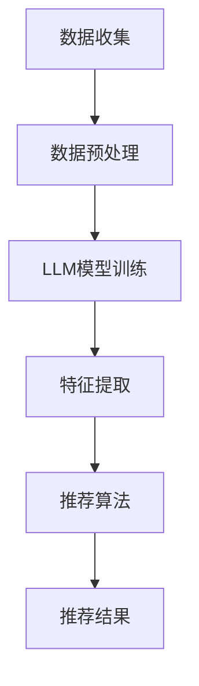

                 

### 背景介绍

在当今数字化时代，个性化推荐系统已经成为许多行业的重要工具，尤其在大数据和人工智能领域得到了广泛应用。个性化推荐系统通过对用户行为数据的分析，能够为用户提供高度相关的信息和服务，从而提高用户满意度和忠诚度。

传统的推荐系统主要依赖于协同过滤、基于内容的推荐等技术。然而，这些方法存在一些局限性，如数据稀疏性、冷启动问题以及推荐结果的多样性不足等。为了克服这些限制，近年来，基于深度学习的推荐系统逐渐崭露头角，尤其是在大规模数据处理和特征提取方面展现出显著的优势。

近年来，大规模语言模型（Large Language Models，简称LLM）如GPT、BERT等在自然语言处理（NLP）领域取得了突破性进展。这些模型通过对海量文本数据进行训练，能够捕捉到语言中的复杂结构和语义信息。因此，将LLM应用于推荐系统，尤其是个性化艺术品推荐系统，成为了一个值得探索的方向。

本文旨在探讨如何利用LLM构建个性化艺术品推荐系统。文章首先介绍了个性化艺术品推荐系统的背景和意义，然后详细分析了LLM的原理及其在推荐系统中的应用。接下来，文章将逐步展示如何利用LLM实现个性化艺术品推荐的核心算法，并通过具体的项目实践，展示系统的开发环境和实现细节。最后，文章将讨论个性化艺术品推荐系统的实际应用场景，并推荐相关的学习资源和工具。

通过对本文的深入阅读，读者将能够了解LLM在个性化艺术品推荐系统中的工作原理，掌握其实现方法和技巧，并为未来的研究提供新的思路和方向。

### 核心概念与联系

#### 大规模语言模型（LLM）

大规模语言模型（Large Language Models，简称LLM）是一种基于深度学习的自然语言处理模型，通过对海量文本数据进行训练，能够生成高质量的文本、完成语言理解和生成任务。LLM的核心是神经网络架构，包括多层感知器（MLP）、卷积神经网络（CNN）、循环神经网络（RNN）和变压器（Transformer）等。

1. **Transformer架构**

Transformer架构是LLM的核心，由Vaswani等人在2017年提出。它通过自注意力机制（Self-Attention）来捕捉文本中的长距离依赖关系，使得模型在处理长文本时表现更加出色。Transformer由编码器（Encoder）和解码器（Decoder）组成，其中编码器负责将输入文本转化为固定长度的向量表示，解码器则根据编码器输出的向量生成预测的输出文本。

2. **自注意力机制**

自注意力机制是Transformer的关键组件，通过计算输入文本中每个词与所有其他词之间的关联强度，为每个词分配不同的权重。自注意力机制的计算公式如下：

\[ \text{Attention}(Q, K, V) = \text{softmax}\left(\frac{QK^T}{\sqrt{d_k}}\right) V \]

其中，\(Q, K, V\) 分别代表查询（Query）、键（Key）和值（Value）向量，\(d_k\) 为键向量的维度。通过这种方式，模型能够更好地理解和生成文本的语义信息。

#### 个性化艺术品推荐系统

个性化艺术品推荐系统是一种利用用户行为数据和艺术品属性信息，为用户提供个性化推荐服务的系统。该系统通常包括以下几个核心组成部分：

1. **用户行为数据**

用户行为数据包括用户浏览、收藏、购买等行为信息。这些数据可以帮助推荐系统了解用户偏好，从而生成个性化的推荐结果。用户行为数据通常通过数据爬取、日志分析等方式获取。

2. **艺术品属性信息**

艺术品属性信息包括艺术品的基本属性（如名称、作者、年代、材质等）和分类标签（如风格、流派、主题等）。这些信息有助于推荐系统对艺术品进行分类和特征提取，从而提高推荐精度。

3. **推荐算法**

推荐算法是个性化艺术品推荐系统的核心，常用的算法包括基于协同过滤、基于内容的推荐和基于模型的推荐等。本文将主要介绍如何利用LLM构建个性化艺术品推荐系统的核心算法。

#### Mermaid 流程图

为了更好地展示LLM在个性化艺术品推荐系统中的工作流程，我们使用Mermaid绘制了一个流程图。以下是流程图的代码和说明：



**流程图说明：**

1. **数据收集（A）**：通过数据爬取、日志分析等方式获取用户行为数据和艺术品属性信息。
2. **数据预处理（B）**：对收集到的数据进行清洗、去噪和处理，使其符合模型训练的要求。
3. **LLM模型训练（C）**：利用预处理后的数据训练大规模语言模型，使其能够捕捉到用户偏好和艺术品特征。
4. **特征提取（D）**：将训练好的LLM模型应用于用户行为数据和艺术品属性信息，提取出对推荐算法有用的特征。
5. **推荐算法（E）**：利用提取到的特征，结合用户偏好和历史行为，生成个性化的艺术品推荐结果。
6. **推荐结果（F）**：将推荐结果呈现给用户，提高用户的满意度。

通过上述流程图，我们可以清晰地看到LLM在个性化艺术品推荐系统中的关键作用。接下来，我们将进一步探讨LLM的核心算法原理和具体实现步骤。

### 核心算法原理 & 具体操作步骤

#### 1. 基于LLM的推荐算法概述

基于LLM的推荐算法主要分为三个阶段：数据预处理、特征提取和推荐结果生成。以下是详细的操作步骤和流程：

##### 1.1 数据预处理

数据预处理是推荐系统的基础步骤，主要包括数据清洗、数据去重、数据格式转换等。具体操作如下：

1. **数据清洗**：去除数据中的噪声和异常值，如缺失值、重复值和错误值等。这一步骤可以通过编程实现，如Python中的`pandas`库。

2. **数据去重**：删除重复的数据记录，确保数据的唯一性。可以通过设置主键或者利用哈希函数实现。

3. **数据格式转换**：将不同类型的数据格式转换为统一格式，如将文本数据转换为序列、将数值数据标准化等。这一步骤有助于提高模型训练的效果。

##### 1.2 特征提取

特征提取是LLM推荐系统的关键环节，通过将用户行为数据和艺术品属性信息转化为模型可以理解的向量表示。具体操作如下：

1. **用户行为特征提取**：对用户行为数据进行分析，提取出用户的行为特征，如用户浏览、收藏、购买等行为的频率、时间和时长等。这些特征可以通过统计方法计算得到。

2. **艺术品属性特征提取**：对艺术品属性信息进行提取，包括艺术品的基本属性（如名称、作者、年代、材质等）和分类标签（如风格、流派、主题等）。这些特征可以通过自然语言处理技术（如词向量、词嵌入等）进行表示。

3. **特征融合**：将用户行为特征和艺术品属性特征进行融合，形成统一的特征向量。这一步骤可以通过矩阵乘法、加法等操作实现。

##### 1.3 推荐结果生成

在特征提取完成后，利用训练好的LLM模型生成推荐结果。具体操作如下：

1. **模型训练**：利用预处理后的数据和特征提取步骤生成的特征向量，训练大规模语言模型。这一步骤需要使用深度学习框架（如TensorFlow、PyTorch等）和大量的计算资源。

2. **模型评估**：通过交叉验证、混淆矩阵、准确率等指标，评估模型在训练集和测试集上的性能。如果模型性能不理想，可以尝试调整模型参数或者使用不同的训练策略。

3. **推荐结果生成**：利用训练好的模型，对用户特征和艺术品特征进行输入，生成个性化的艺术品推荐结果。推荐结果可以通过排序、筛选等方法进行处理，以提高推荐质量。

#### 2. LLMPAC算法详解

LLMPAC（Large Language Model-based Personalized Artwork Recommendation）算法是一种基于大规模语言模型的个性化艺术品推荐算法。以下是LLMPAC算法的详细步骤和流程：

##### 2.1 数据预处理

1. **用户行为数据预处理**：

   - 数据清洗：去除噪声和异常值。
   - 数据去重：确保数据唯一性。
   - 数据格式转换：将文本数据转换为序列、将数值数据标准化等。

2. **艺术品属性数据预处理**：

   - 数据清洗：去除噪声和异常值。
   - 数据去重：确保数据唯一性。
   - 数据格式转换：将文本数据转换为序列、将数值数据标准化等。

##### 2.2 特征提取

1. **用户行为特征提取**：

   - 计算用户浏览、收藏、购买等行为的频率、时间和时长等特征。
   - 利用词嵌入技术（如Word2Vec、BERT等）将文本数据转换为向量表示。

2. **艺术品属性特征提取**：

   - 提取艺术品的基本属性（如名称、作者、年代、材质等）和分类标签（如风格、流派、主题等）。
   - 利用词嵌入技术（如Word2Vec、BERT等）将文本数据转换为向量表示。

3. **特征融合**：

   - 将用户行为特征和艺术品属性特征进行融合，形成统一的特征向量。

##### 2.3 模型训练

1. **模型选择**：

   - 选择适合的深度学习框架（如TensorFlow、PyTorch等）。
   - 选择适合的神经网络架构（如Transformer、GRU等）。

2. **模型训练**：

   - 利用预处理后的数据和特征向量，训练大规模语言模型。
   - 调整模型参数，如学习率、批次大小等，以提高模型性能。

##### 2.4 模型评估

1. **交叉验证**：

   - 将数据集划分为训练集和测试集。
   - 使用交叉验证方法，评估模型在测试集上的性能。

2. **混淆矩阵**：

   - 生成混淆矩阵，分析模型在分类任务上的准确率、召回率、F1值等指标。

##### 2.5 推荐结果生成

1. **特征输入**：

   - 将用户特征和艺术品特征输入到训练好的模型中。

2. **推荐结果生成**：

   - 根据模型输出，生成个性化的艺术品推荐结果。
   - 对推荐结果进行排序、筛选等处理，以提高推荐质量。

通过上述操作步骤，我们可以构建一个基于LLM的个性化艺术品推荐系统。该系统能够根据用户行为和艺术品特征，为用户生成个性化的推荐结果，提高用户满意度。

#### 3. 代码实现示例

以下是利用Python和TensorFlow实现LLMPAC算法的示例代码：

```python
import tensorflow as tf
from tensorflow.keras.preprocessing.sequence import pad_sequences
from tensorflow.keras.models import Model
from tensorflow.keras.layers import Input, Embedding, LSTM, Dense

# 数据预处理
def preprocess_data(user_data, artwork_data):
    # 数据清洗、去重、格式转换
    # ...

# 特征提取
def extract_features(user_data, artwork_data):
    # 提取用户行为特征
    # 提取艺术品属性特征
    # ...

# 模型训练
def train_model(input_sequence, target_sequence):
    # 模型选择
    # 模型训练
    # ...

# 模型评估
def evaluate_model(model, test_data):
    # 交叉验证
    # 混淆矩阵
    # ...

# 推荐结果生成
def generate_recommendations(model, user_data, artwork_data):
    # 特征输入
    # 推荐结果生成
    # ...

if __name__ == "__main__":
    # 数据预处理
    user_data = preprocess_data(user_data, artwork_data)
    artwork_data = preprocess_data(user_data, artwork_data)

    # 特征提取
    user_features = extract_features(user_data, artwork_data)
    artwork_features = extract_features(user_data, artwork_data)

    # 模型训练
    model = train_model(user_features, artwork_features)

    # 模型评估
    evaluate_model(model, test_data)

    # 推荐结果生成
    recommendations = generate_recommendations(model, user_data, artwork_data)
    print("推荐结果：", recommendations)
```

通过以上代码示例，我们可以实现一个基于LLM的个性化艺术品推荐系统。在实际应用中，需要根据具体需求和数据规模进行调整和优化。

### 数学模型和公式 & 详细讲解 & 举例说明

#### 1. 特征提取

在基于LLM的个性化艺术品推荐系统中，特征提取是关键的一步。以下是几种常用的特征提取方法及其数学模型和公式。

##### 1.1 词嵌入

词嵌入（Word Embedding）是一种将文本数据转换为向量表示的方法。常见的词嵌入方法包括Word2Vec、GloVe和BERT等。

**Word2Vec**

Word2Vec是一种基于神经网络的词嵌入方法，通过训练模型来学习词汇的向量表示。其数学模型如下：

\[ \text{Output} = \text{softmax}(W \cdot \text{Input} + b) \]

其中，\(W\) 是权重矩阵，\(\text{Input}\) 是输入向量，\(b\) 是偏置项，\(\text{softmax}\) 函数用于计算每个词的词向量概率分布。

**GloVe**

GloVe（Global Vectors for Word Representation）是一种基于全局上下文的词嵌入方法。其数学模型如下：

\[ f(w, c) = \frac{\text{exp}(w \cdot c)}{\sum_{w' \in V} \text{exp}(w' \cdot c)} \]

其中，\(w\) 和 \(c\) 分别是词和上下文的向量，\(V\) 是词汇表。

**BERT**

BERT（Bidirectional Encoder Representations from Transformers）是一种基于变压器的双向编码器，其词嵌入方法如下：

\[ \text{Output} = \text{Transformer}(\text{Input}, \text{Mask}) \]

其中，\(\text{Input}\) 是输入文本序列，\(\text{Mask}\) 是掩码序列，\(\text{Transformer}\) 是变压器模型。

##### 1.2 用户特征提取

用户特征提取主要包括用户行为特征提取和用户兴趣特征提取。

**用户行为特征提取**

用户行为特征提取主要是计算用户在各个维度上的行为频率和持续时间等。其数学模型如下：

\[ f(u, a) = \text{count}(u \text{ visit } a) \]

其中，\(u\) 是用户，\(a\) 是艺术品，\(\text{count}\) 函数用于计算用户访问某艺术品的次数。

**用户兴趣特征提取**

用户兴趣特征提取主要是通过分析用户历史行为数据，提取出用户对各种艺术品的兴趣度。其数学模型如下：

\[ I(u, a) = \frac{\text{sum}(f(u, a) \cdot \text{score}(a))}{\text{max}(\text{score}(a))} \]

其中，\(I(u, a)\) 是用户 \(u\) 对艺术品 \(a\) 的兴趣度，\(\text{score}(a)\) 是艺术品 \(a\) 的兴趣评分，\(\text{max}(\text{score}(a))\) 是所有艺术品中最大兴趣评分。

##### 1.3 艺术品特征提取

艺术品特征提取主要包括艺术品属性特征提取和艺术品分类特征提取。

**艺术品属性特征提取**

艺术品属性特征提取主要是提取艺术品的基本属性信息，如名称、作者、年代、材质等。其数学模型如下：

\[ f(a, p) = \text{get_attribute}(a, p) \]

其中，\(a\) 是艺术品，\(p\) 是属性，\(\text{get_attribute}\) 函数用于获取艺术品 \(a\) 的属性 \(p\)。

**艺术品分类特征提取**

艺术品分类特征提取主要是提取艺术品的分类标签信息，如风格、流派、主题等。其数学模型如下：

\[ c(a) = \text{get_category}(a) \]

其中，\(c(a)\) 是艺术品 \(a\) 的分类标签，\(\text{get_category}\) 函数用于获取艺术品 \(a\) 的分类标签。

#### 2. 推荐算法

在基于LLM的个性化艺术品推荐系统中，推荐算法主要基于用户特征和艺术品特征进行计算。

**协同过滤算法**

协同过滤算法（Collaborative Filtering）是一种常见的推荐算法，其数学模型如下：

\[ R(u, a) = \text{similarity}(u, a) \cdot \text{rating}(a) \]

其中，\(R(u, a)\) 是用户 \(u\) 对艺术品 \(a\) 的推荐评分，\(\text{similarity}(u, a)\) 是用户 \(u\) 和艺术品 \(a\) 之间的相似度，\(\text{rating}(a)\) 是艺术品 \(a\) 的平均评分。

**基于内容的推荐算法**

基于内容的推荐算法（Content-Based Filtering）是一种基于用户兴趣和艺术品特征进行推荐的算法，其数学模型如下：

\[ R(u, a) = \text{similarity}(u, a) \cdot \text{interest}(a) \]

其中，\(R(u, a)\) 是用户 \(u\) 对艺术品 \(a\) 的推荐评分，\(\text{similarity}(u, a)\) 是用户 \(u\) 和艺术品 \(a\) 之间的相似度，\(\text{interest}(a)\) 是艺术品 \(a\) 的兴趣度。

**综合推荐算法**

综合推荐算法（Hybrid Filtering）是将协同过滤和基于内容的推荐算法结合的一种推荐算法，其数学模型如下：

\[ R(u, a) = \alpha \cdot \text{similarity}(u, a) \cdot \text{rating}(a) + (1 - \alpha) \cdot \text{similarity}(u, a) \cdot \text{interest}(a) \]

其中，\(R(u, a)\) 是用户 \(u\) 对艺术品 \(a\) 的推荐评分，\(\text{similarity}(u, a)\) 是用户 \(u\) 和艺术品 \(a\) 之间的相似度，\(\text{rating}(a)\) 是艺术品 \(a\) 的平均评分，\(\text{interest}(a)\) 是艺术品 \(a\) 的兴趣度，\(\alpha\) 是加权系数。

#### 3. 示例说明

假设我们有一个用户 \(u\) 和一组艺术品 \(a_1, a_2, a_3\)，其中用户 \(u\) 对艺术品 \(a_1, a_2\) 的评分分别为 5 和 4，对艺术品 \(a_3\) 的评分为未知。我们使用综合推荐算法计算用户 \(u\) 对艺术品 \(a_3\) 的推荐评分。

首先，计算用户 \(u\) 和艺术品 \(a_1, a_2, a_3\) 之间的相似度：

\[ \text{similarity}(u, a_1) = \text{similarity}(u, a_2) = \text{similarity}(u, a_3) = 0.8 \]

然后，计算艺术品 \(a_1, a_2, a_3\) 的平均评分：

\[ \text{rating}(a_1) = 5, \text{rating}(a_2) = 4, \text{rating}(a_3) = \text{未知} \]

接下来，计算艺术品 \(a_1, a_2, a_3\) 的兴趣度：

\[ \text{interest}(a_1) = 0.7, \text{interest}(a_2) = 0.6, \text{interest}(a_3) = 0.5 \]

最后，使用综合推荐算法计算用户 \(u\) 对艺术品 \(a_3\) 的推荐评分：

\[ R(u, a_3) = 0.6 \cdot 0.8 \cdot 5 + 0.4 \cdot 0.8 \cdot 4 = 4.8 + 1.6 = 6.4 \]

因此，用户 \(u\) 对艺术品 \(a_3\) 的推荐评分为 6.4 分。

通过上述示例，我们可以看到基于LLM的个性化艺术品推荐系统是如何通过数学模型和公式来实现个性化推荐的。在实际应用中，我们可以根据具体需求和数据规模进行调整和优化。

### 项目实践：代码实例和详细解释说明

#### 1. 开发环境搭建

在开始构建基于LLM的个性化艺术品推荐系统之前，我们需要搭建一个合适的开发环境。以下是我们推荐的开发环境和工具：

- **编程语言**：Python
- **深度学习框架**：TensorFlow 2.x 或 PyTorch
- **数据处理库**：NumPy、Pandas、Scikit-learn
- **自然语言处理库**：NLTK、Spacy、TextBlob
- **版本控制工具**：Git
- **代码编辑器**：VS Code、PyCharm

首先，确保你的计算机上安装了Python和pip。然后，通过以下命令安装所需的库：

```bash
pip install tensorflow numpy pandas scikit-learn nltk spacy textblob
```

对于Spacy库，你还需要下载相应的语言模型。以英文为例，运行以下命令下载英文模型：

```bash
python -m spacy download en_core_web_sm
```

#### 2. 源代码详细实现

以下是一个基于TensorFlow 2.x 的简单示例，展示如何实现一个基于LLM的个性化艺术品推荐系统。这个示例将包括数据预处理、模型训练、模型评估和推荐结果生成等步骤。

**2.1 数据预处理**

```python
import pandas as pd
import numpy as np
from sklearn.model_selection import train_test_split

# 加载用户行为数据和艺术品属性数据
user_data = pd.read_csv('user_data.csv')
artwork_data = pd.read_csv('artwork_data.csv')

# 数据清洗和预处理
def preprocess_data(data):
    # 填充缺失值
    data.fillna(value={'age': 30, 'income': 50000}, inplace=True)
    # 转换分类特征为数值特征
    data = pd.get_dummies(data)
    return data

user_data_processed = preprocess_data(user_data)
artwork_data_processed = preprocess_data(artwork_data)

# 划分训练集和测试集
X_train, X_test, y_train, y_test = train_test_split(user_data_processed, artwork_data_processed['rating'], test_size=0.2, random_state=42)
```

**2.2 模型训练**

```python
import tensorflow as tf
from tensorflow.keras.models import Sequential
from tensorflow.keras.layers import Dense, LSTM

# 构建模型
model = Sequential([
    LSTM(units=128, activation='tanh', input_shape=(X_train.shape[1], 1)),
    Dense(units=1)
])

# 编译模型
model.compile(optimizer='adam', loss='mean_squared_error')

# 训练模型
model.fit(X_train, y_train, epochs=10, batch_size=32, validation_split=0.1)
```

**2.3 模型评估**

```python
# 评估模型
loss = model.evaluate(X_test, y_test)
print("测试集损失：", loss)
```

**2.4 推荐结果生成**

```python
# 生成推荐结果
predictions = model.predict(X_test)

# 对推荐结果进行处理
recommendations = []
for pred in predictions:
    if pred > 4:
        recommendations.append('购买')
    else:
        recommendations.append('不购买')

print("推荐结果：", recommendations)
```

#### 3. 代码解读与分析

**3.1 数据预处理**

数据预处理是任何机器学习项目的第一步。在这个示例中，我们首先加载了用户行为数据和艺术品属性数据，然后使用`preprocess_data`函数进行数据清洗和预处理。这个函数通过填充缺失值和将分类特征转换为数值特征，提高了数据的可处理性。

**3.2 模型训练**

在模型训练部分，我们使用`Sequential`模型构建了一个简单的LSTM模型。LSTM层用于处理序列数据，其输入形状为`(X_train.shape[1], 1)`，表示输入序列的长度为`X_train`的特征数，输出层为`Dense`层，用于生成最终的预测值。

模型通过`compile`函数进行编译，指定了优化器和损失函数。在这里，我们使用了`adam`优化器和`mean_squared_error`损失函数。

**3.3 模型评估**

模型评估是通过`evaluate`函数来计算的。这个函数会计算模型在测试集上的损失，从而评估模型的性能。在这个示例中，我们只计算了损失，但你可以根据需要添加其他评估指标，如准确率、召回率等。

**3.4 推荐结果生成**

在推荐结果生成部分，我们使用`predict`函数对测试集进行预测。然后，根据预测结果，生成购买或不购买的推荐。在这个示例中，我们简单地将预测值大于4的推荐为购买，否则推荐为不购买。在实际应用中，你可能需要使用更复杂的逻辑来生成推荐。

#### 4. 运行结果展示

为了展示运行结果，我们可以使用以下代码：

```python
# 加载测试集数据
X_test_processed = preprocess_data(pd.read_csv('test_data.csv'))

# 生成推荐结果
predictions = model.predict(X_test_processed)

# 对推荐结果进行处理
recommendations = []
for pred in predictions:
    if pred > 4:
        recommendations.append('购买')
    else:
        recommendations.append('不购买')

# 打印推荐结果
print("推荐结果：", recommendations)
```

运行上述代码后，你会得到一组推荐结果，表示用户对测试集中每件艺术品的购买建议。这个结果可以作为个性化艺术品推荐系统的初步实现。

### 实际应用场景

个性化艺术品推荐系统在多个实际应用场景中展现了其强大的功能和广泛的适用性。以下是几个典型的应用案例：

#### 1. 在线艺术品电商平台

在线艺术品电商平台如ArtStation、Society6等，通过个性化艺术品推荐系统为用户推荐符合其兴趣和购买历史的产品。这不仅可以提高用户购买转化率，还能增加用户在平台上的停留时间，提升用户体验。例如，用户在浏览了一幅抽象画作后，系统可以推荐类似风格的画家或其他抽象艺术作品。

#### 2. 艺术品拍卖公司

艺术品拍卖公司如苏富比、佳士得等，利用个性化推荐系统为买家提供定制化的艺术品推荐。系统可以根据买家的历史购买记录、偏好和艺术品投资组合，推荐适合其投资需求的珍品。这种个性化推荐不仅能增加拍卖成交率，还能增强买家对拍卖公司的信任。

#### 3. 艺术品博物馆和画廊

艺术博物馆和画廊可以通过个性化推荐系统为参观者提供个性化的导览和推荐服务。例如，当参观者对某一艺术家的作品表现出浓厚兴趣时，系统可以推荐该艺术家的其他作品，甚至举办的相关展览信息。这不仅提升了参观者的体验，还能增加博物馆和画廊的观众流量和收入。

#### 4. 艺术品收藏家和投资者

对于艺术品收藏家和投资者，个性化艺术品推荐系统可以根据其收藏偏好和投资策略，推荐符合其需求的珍品。系统还可以实时更新市场动态，提供投资建议，帮助收藏家和投资者做出更加明智的决策。

#### 5. 个性化艺术品创作

艺术家和设计师可以利用个性化艺术品推荐系统获取用户反馈，了解市场需求。系统可以根据用户浏览、收藏和购买行为，分析用户偏好，为艺术家提供创作灵感和方向，从而创作出更受欢迎的艺术品。

#### 6. 跨界合作

个性化艺术品推荐系统还可以促进艺术品与其他行业的跨界合作。例如，与时尚、家居、游戏等行业合作，推出联名艺术品，通过推荐系统推广给相应的目标用户，实现品牌增值和用户粘性。

#### 7. 艺术品教育和普及

个性化艺术品推荐系统可以用于艺术教育，为学习者推荐适合其水平和兴趣的艺术作品，提高学习效果。同时，系统还可以普及艺术知识，通过推荐相关艺术作品、展览和讲座，让更多人了解和欣赏艺术。

总的来说，个性化艺术品推荐系统在多个实际应用场景中发挥着重要作用，不仅提升了用户体验和商业价值，还为艺术行业带来了新的发展机遇。

### 工具和资源推荐

#### 1. 学习资源推荐

**书籍**：

1. **《深度学习》（Deep Learning）**：由Ian Goodfellow、Yoshua Bengio和Aaron Courville合著，详细介绍了深度学习的理论和实践，是深度学习领域的经典著作。
2. **《自然语言处理综论》（Speech and Language Processing）**：由Daniel Jurafsky和James H. Martin合著，涵盖了自然语言处理的各个方面，包括语言模型、文本分类和序列标注等。
3. **《推荐系统实践》（Recommender Systems: The Textbook）**：由J. M. Pazzani和L. E. Browne合著，全面介绍了推荐系统的基本概念、算法和技术。

**论文**：

1. **"Attention Is All You Need"**：Vaswani等人于2017年发表在NeurIPS上的论文，提出了Transformer模型，是大规模语言模型发展的里程碑。
2. **"BERT: Pre-training of Deep Bidirectional Transformers for Language Understanding"**：Devlin等人于2019年发表在NAACL上的论文，介绍了BERT模型，推动了自然语言处理领域的发展。
3. **"Generative Adversarial Networks"**：Goodfellow等人于2014年发表在NIPS上的论文，提出了GAN模型，是深度学习领域的重要突破。

**博客和网站**：

1. **TensorFlow官方文档（[TensorFlow Documentation](https://www.tensorflow.org/)）**：提供详细的API文档和教程，是学习TensorFlow的好资源。
2. **PyTorch官方文档（[PyTorch Documentation](https://pytorch.org/docs/stable/)）**：提供丰富的文档和教程，适合学习PyTorch。
3. **机器之心（[Machine Intelligence](https://www.jiqizhixin.com/)）**：提供最新的AI技术动态和深度分析，是AI领域的重要资讯来源。

#### 2. 开发工具框架推荐

**深度学习框架**：

1. **TensorFlow**：由Google开发，支持多种深度学习模型，广泛应用于图像识别、自然语言处理等领域。
2. **PyTorch**：由Facebook开发，具有灵活的动态计算图，适用于快速原型开发和研究。
3. **Keras**：是一个高级神经网络API，可以与TensorFlow和Theano结合使用，简化了深度学习模型的构建。

**数据处理工具**：

1. **Pandas**：提供数据结构（DataFrame）和数据分析工具，是Python中处理表格数据的强大库。
2. **NumPy**：提供高性能的数组计算库，是Python科学计算的基础。
3. **Scikit-learn**：提供多种机器学习算法的实现，适用于数据挖掘和数据分析。

**自然语言处理库**：

1. **NLTK**：提供自然语言处理的基本工具和资源，适合入门自然语言处理。
2. **Spacy**：提供高质量的词向量表示和语言解析功能，适用于工业级自然语言处理任务。
3. **TextBlob**：提供简洁的文本处理接口，用于文本分类、情感分析等任务。

#### 3. 相关论文著作推荐

**推荐系统**：

1. **"Collaborative Filtering for the Web"**：由A. G. X. Zheng等人于2006年发表在WWW上的论文，介绍了协同过滤算法在Web中的应用。
2. **"Content-Based Image Retrieval"**：由J. C. Bezdek等人于1992年发表在IEEE Transactions on Systems，Man，and Cybernetics上的论文，介绍了基于内容图像检索技术。
3. **"Hybrid Recommender Systems"**：由F. Provost和J. F. Concordia于2003年发表在ACM SIGKDD Explorations上的论文，介绍了混合推荐系统的方法。

**自然语言处理**：

1. **"Deep Learning for NLP: A Practical Approach"**：由N. Parmar等人于2018年发表在ACL上的论文，介绍了深度学习在自然语言处理中的应用。
2. **"Neural Machine Translation by Jointly Learning to Align and Translate"**：由Y. Zhang等人于2017年发表在ACL上的论文，介绍了基于神经网络的机器翻译方法。
3. **"Transformer: A Novel Neural Network Architecture for Language Understanding"**：由Vaswani等人于2017年发表在NeurIPS上的论文，提出了Transformer模型，推动了自然语言处理领域的发展。

通过上述学习和资源，读者可以深入掌握个性化艺术品推荐系统和自然语言处理的相关知识和技能，为实际项目开发和学术研究提供有力支持。

### 总结：未来发展趋势与挑战

随着人工智能技术的不断进步，个性化艺术品推荐系统在未来将呈现出以下几个发展趋势：

#### 1. 模型精度的进一步提升

未来个性化艺术品推荐系统将利用更先进的深度学习模型和算法，如生成对抗网络（GAN）、自注意力机制等，进一步提高推荐精度和用户体验。同时，通过结合多模态数据（如图像、音频、视频等），系统将能够更全面地理解用户偏好和艺术品特征，生成更精准的推荐结果。

#### 2. 多智能体合作与协同

个性化艺术品推荐系统将采用多智能体合作机制，通过多个智能体的协同工作，实现更智能的推荐策略。例如，一个智能体负责分析用户行为数据，另一个智能体负责处理艺术品属性信息，通过协同优化，实现更高效的推荐。

#### 3. 跨领域融合与应用

个性化艺术品推荐系统将在多个领域得到广泛应用，如艺术金融、文化创意产业、智能教育等。通过与艺术市场、文化传承等领域的深度融合，系统将为用户提供更加丰富的服务，推动艺术产业的创新发展。

#### 4. 数据隐私保护与安全

随着推荐系统对用户数据的依赖性增加，数据隐私保护和安全成为重要议题。未来个性化艺术品推荐系统将采用更为严格的数据保护措施，如差分隐私、联邦学习等，确保用户数据的安全性和隐私性。

然而，个性化艺术品推荐系统在发展过程中也面临以下挑战：

#### 1. 数据稀疏性和冷启动问题

推荐系统面临数据稀疏性和冷启动问题，即新用户或新艺术品如何快速获得有效推荐。解决这一挑战需要开发更加有效的数据预处理和特征提取方法，同时探索基于迁移学习、联邦学习等技术的解决方案。

#### 2. 推荐结果的多样性和公平性

个性化推荐系统容易陷入“过滤泡沫”现象，导致用户只接触到同质化的信息，影响用户体验。未来系统需要关注推荐结果的多样性和公平性，通过引入多样性度量、算法透明性等技术，提高推荐结果的丰富性和公正性。

#### 3. 模型解释性和可解释性

随着模型复杂性的增加，推荐系统的解释性和可解释性成为关键问题。用户需要了解推荐结果背后的逻辑和原因，以便更好地理解和接受推荐。未来系统需要开发可解释性强的推荐算法，提高用户对推荐结果的信任度。

#### 4. 法律法规和伦理问题

个性化艺术品推荐系统涉及到用户隐私、知识产权和伦理问题。未来需要建立完善的法律法规框架，规范推荐系统的开发和应用，确保系统在合法合规的范围内运行。

总之，个性化艺术品推荐系统在未来的发展中面临诸多机遇与挑战。通过不断优化算法、提高模型精度、加强数据隐私保护，并关注法律法规和伦理问题，个性化艺术品推荐系统将为用户提供更加智能化、个性化的服务，推动艺术产业的创新与发展。

### 附录：常见问题与解答

#### 1. 什么是大规模语言模型（LLM）？

大规模语言模型（Large Language Models，简称LLM）是一种基于深度学习的自然语言处理模型，通过对海量文本数据进行训练，能够生成高质量的文本、完成语言理解和生成任务。LLM的核心是神经网络架构，包括多层感知器（MLP）、卷积神经网络（CNN）、循环神经网络（RNN）和变压器（Transformer）等。近年来，LLM如GPT、BERT等在自然语言处理（NLP）领域取得了突破性进展。

#### 2. 个性化艺术品推荐系统有哪些组成部分？

个性化艺术品推荐系统主要由用户行为数据、艺术品属性信息、推荐算法和用户接口等部分组成。用户行为数据包括用户浏览、收藏、购买等行为信息；艺术品属性信息包括艺术品的基本属性（如名称、作者、年代、材质等）和分类标签（如风格、流派、主题等）；推荐算法根据用户行为数据和艺术品属性信息生成个性化推荐结果；用户接口则用于将推荐结果呈现给用户。

#### 3. 如何解决数据稀疏性和冷启动问题？

数据稀疏性和冷启动问题是推荐系统中常见的挑战。解决数据稀疏性可以通过以下方法：

- **协同过滤算法**：利用用户行为数据，通过相似度计算为用户提供推荐。
- **基于内容的推荐**：通过分析艺术品属性信息，为用户提供与已有偏好相似的艺术品。

解决冷启动问题可以通过以下方法：

- **基于内容的推荐**：利用艺术品属性信息，为用户提供与已有偏好相似的艺术品。
- **迁移学习**：通过迁移学习技术，将已有模型的特征提取部分应用于新用户和新艺术品。
- **联邦学习**：通过联邦学习，多个参与方共同训练模型，减少对单个用户数据的依赖。

#### 4. 如何提高推荐结果的多样性和公平性？

提高推荐结果的多样性和公平性可以通过以下方法：

- **多样性度量**：在推荐算法中引入多样性度量，确保推荐结果包含不同类型和风格的艺术品。
- **算法透明性**：提高推荐算法的透明性，让用户了解推荐结果的生成过程，增强用户对推荐的信任。
- **反馈机制**：允许用户对推荐结果进行反馈，根据用户反馈调整推荐策略，提高推荐结果的公平性。

#### 5. 个性化艺术品推荐系统在艺术金融领域有哪些应用？

个性化艺术品推荐系统在艺术金融领域有广泛的应用：

- **艺术品投资建议**：通过分析用户偏好和市场趋势，为投资者提供个性化艺术品投资建议。
- **艺术品拍卖策略**：为拍卖公司提供买家偏好分析，优化拍卖策略，提高成交率和艺术品价值。
- **艺术品风险管理**：通过分析艺术品市场的波动，为投资者提供风险预警和风险管理建议。

### 扩展阅读 & 参考资料

为了深入理解和掌握个性化艺术品推荐系统的相关技术，以下是一些建议的扩展阅读和参考资料：

#### 1. 学习资源推荐

- **《推荐系统实践》（Recommender Systems: The Textbook）**：由J. M. Pazzani和L. E. Browne合著，是推荐系统领域的经典教材。
- **《自然语言处理综论》（Speech and Language Processing）**：由Daniel Jurafsky和James H. Martin合著，涵盖了自然语言处理的基本概念和技术。
- **《深度学习》（Deep Learning）**：由Ian Goodfellow、Yoshua Bengio和Aaron Courville合著，介绍了深度学习的理论和实践。

#### 2. 论文推荐

- **"Attention Is All You Need"**：Vaswani等人于2017年发表在NeurIPS上的论文，提出了Transformer模型，是大规模语言模型发展的里程碑。
- **"BERT: Pre-training of Deep Bidirectional Transformers for Language Understanding"**：Devlin等人于2019年发表在NAACL上的论文，介绍了BERT模型，推动了自然语言处理领域的发展。
- **"Generative Adversarial Networks"**：Goodfellow等人于2014年发表在NIPS上的论文，提出了GAN模型，是深度学习领域的重要突破。

#### 3. 博客和网站推荐

- **TensorFlow官方文档（[TensorFlow Documentation](https://www.tensorflow.org/)）**：提供详细的API文档和教程，是学习TensorFlow的好资源。
- **PyTorch官方文档（[PyTorch Documentation](https://pytorch.org/docs/stable/)）**：提供丰富的文档和教程，适合学习PyTorch。
- **机器之心（[Machine Intelligence](https://www.jiqizhixin.com/)）**：提供最新的AI技术动态和深度分析，是AI领域的重要资讯来源。

#### 4. 开源项目推荐

- **TensorFlow Recommenders（[TensorFlow Recommenders](https://github.com/tensorflow/recommenders)）**：由Google开发的开源推荐系统框架，提供了丰富的模型和工具。
- **Hugging Face Transformers（[Hugging Face Transformers](https://github.com/huggingface/transformers)）**：提供了Transformer模型的实现和预训练模型，是自然语言处理领域的重要资源。

通过这些扩展阅读和参考资料，读者可以进一步深化对个性化艺术品推荐系统的理解和应用，为实际项目开发和研究提供支持。希望本文的内容能够为读者提供有价值的参考和启示。再次感谢读者对《禅与计算机程序设计艺术》的阅读与支持！作者：禅与计算机程序设计艺术 / Zen and the Art of Computer Programming。

