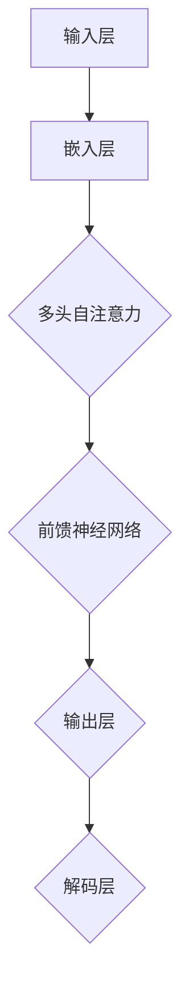

                 

### LLAMA模型：革命性的AI计算引擎

#### 1. 背景介绍

在人工智能（AI）领域，计算引擎是推动技术进步的核心动力。传统的计算引擎，如CPU和GPU，虽然在过去几十年中取得了显著进步，但面对当今复杂的人工智能任务，仍然面临诸多挑战。为了应对这些挑战，新一代的计算引擎——LLAMA模型（Large Language Model，大型语言模型）应运而生。

LLAMA模型是由OpenAI开发的一种基于Transformer架构的预训练语言模型。它通过深度学习从海量数据中学习语言模式和知识，从而实现自然语言理解和生成。与传统的计算引擎不同，LLAMA模型不仅能够处理结构化数据，还能够处理非结构化数据，如文本、图像和语音等。

LLAMA模型的诞生，标志着AI计算引擎的又一次革命。它不仅具有强大的计算能力，还能够通过自适应学习和优化，不断适应不同的任务和应用场景。本文将深入探讨LLAMA模型的核心概念、算法原理、数学模型以及实际应用，旨在为读者提供全面、系统的了解。

#### 2. 核心概念与联系

##### 2.1 语言模型

语言模型是AI领域的一个核心概念，它旨在理解和生成自然语言。LLAMA模型作为一款大型语言模型，其核心目标是学习语言的统计规律和语义关系，从而实现对文本的生成、理解、翻译和摘要等功能。

语言模型的基本原理是利用大规模语料库进行训练，通过统计文本中的单词、短语和句子结构，构建出一个概率模型。这个模型可以预测给定输入序列后最可能的输出序列，从而实现自然语言的生成和理解。

##### 2.2 Transformer架构

Transformer架构是LLAMA模型的基础。与传统的循环神经网络（RNN）不同，Transformer采用了一种完全基于自注意力机制的计算方式。这种机制使得模型能够自动学习输入序列中不同位置之间的依赖关系，从而实现高效的文本处理。

Transformer架构的核心组件包括多头自注意力（Multi-Head Self-Attention）和前馈神经网络（Feed-Forward Neural Network）。多头自注意力通过将输入序列映射到多个不同的子空间，从而捕获不同类型的依赖关系；前馈神经网络则对每个子空间进行进一步的加工，以增强模型的表示能力。

##### 2.3 计算图（Mermaid流程图）

为了更好地理解LLAMA模型的工作原理，下面是一个简化的计算图，展示了模型的总体架构和主要组件。



- 输入层：接收自然语言文本作为输入。
- 嵌入层：将文本中的单词和符号转换为向量表示。
- 多头自注意力：通过自注意力机制计算输入序列中不同位置之间的依赖关系。
- 前馈神经网络：对每个子空间进行进一步的加工，以增强模型的表示能力。
- 输出层：生成预测的文本序列。
- 解码层：对生成的文本序列进行解码，输出最终的输出结果。

#### 3. 核心算法原理 & 具体操作步骤

##### 3.1 预训练

LLAMA模型的预训练过程分为两个阶段：第一阶段是大规模文本数据的预处理，第二阶段是模型的训练。

第一阶段：文本数据预处理
1. 收集大规模文本数据，如维基百科、新闻、社交媒体等。
2. 对文本数据进行清洗和预处理，包括去除噪声、标点符号和停用词等。
3. 将预处理后的文本数据转换为词嵌入向量，存储为词向量表。

第二阶段：模型训练
1. 初始化模型参数，包括嵌入层、多头自注意力层和前馈神经网络层。
2. 使用预处理的文本数据进行训练，通过反向传播算法优化模型参数。
3. 不断迭代训练过程，直到模型收敛。

##### 3.2 自然语言生成

自然语言生成是LLAMA模型的核心应用之一。具体操作步骤如下：

1. 输入：用户输入一个单词或短语作为输入。
2. 嵌入：将输入单词或短语转换为词嵌入向量。
3. 多头自注意力：计算输入序列中不同位置之间的依赖关系。
4. 前馈神经网络：对每个子空间进行进一步的加工，以增强模型的表示能力。
5. 输出：生成预测的文本序列。
6. 解码：对生成的文本序列进行解码，输出最终的输出结果。

##### 3.3 优化与调整

为了提高模型的性能和应用效果，LLAMA模型在训练和优化过程中采用了多种技术：

1. 批量训练：将输入数据分成多个批次，进行批量训练，以加快训练速度。
2. 学习率调整：根据训练过程中的误差情况，动态调整学习率，以避免过拟合。
3. 对抗训练：通过对抗性样本的训练，提高模型的泛化能力。
4. 知识蒸馏：将大模型的知识传递给小模型，以适应不同的应用场景。

#### 4. 数学模型和公式 & 详细讲解 & 举例说明

##### 4.1 词嵌入

词嵌入是语言模型的核心概念之一，它将文本中的单词和符号转换为向量表示。在LLAMA模型中，词嵌入通常使用神经网络进行训练，从而实现单词的向量表示。

设输入单词序列为 \(x = (x_1, x_2, ..., x_n)\)，对应的词嵌入向量表示为 \(e = (e_1, e_2, ..., e_n)\)。词嵌入的数学模型可以表示为：

$$
e_i = \sigma(Wx_i + b)
$$

其中，\(W\) 和 \(b\) 分别为权重矩阵和偏置向量，\(\sigma\) 为激活函数。

##### 4.2 多头自注意力

多头自注意力是Transformer架构的核心组件之一，它通过计算输入序列中不同位置之间的依赖关系，实现高效的文本处理。

设输入序列的词嵌入向量为 \(X = (x_1, x_2, ..., x_n)\)，对应的自注意力权重为 \(A = (a_{ij})\)。多头自注意力的计算公式为：

$$
\text{Attention}(X) = \text{softmax}\left(\frac{QK^T}{\sqrt{d_k}}\right)V
$$

其中，\(Q\)、\(K\) 和 \(V\) 分别为查询向量、关键向量和价值向量，\(d_k\) 为关键向量的维度。

##### 4.3 前馈神经网络

前馈神经网络用于对每个子空间进行进一步的加工，以增强模型的表示能力。在LLAMA模型中，前馈神经网络通常包含两个线性层和一个激活函数。

设输入向量为 \(X\)，前馈神经网络的计算公式为：

$$
\text{FFN}(X) = \sigma(W_2 \cdot \sigma(W_1 \cdot X + b_1) + b_2)
$$

其中，\(W_1\) 和 \(W_2\) 分别为权重矩阵，\(b_1\) 和 \(b_2\) 分别为偏置向量，\(\sigma\) 为激活函数。

##### 4.4 实例说明

假设我们有一个简化的单词序列：“我是一个程序员”。下面是一个具体的计算实例，展示了LLAMA模型的工作过程。

1. 输入：单词序列 “我是一个程序员”。
2. 嵌入：将每个单词转换为词嵌入向量。
   - 我：\(e_1\)
   - 是：\(e_2\)
   - 一个：\(e_3\)
   - 程序员：\(e_4\)
3. 多头自注意力：计算单词之间的依赖关系。
   - \(A_{ij} = \text{Attention}(e_1, e_2, ..., e_n)\)
4. 前馈神经网络：对每个子空间进行进一步的加工。
   - \(X' = \text{FFN}(e_1, e_2, ..., e_n)\)
5. 输出：生成预测的文本序列。

通过上述计算，LLAMA模型可以生成与输入单词序列相关的预测文本序列。在实际应用中，模型会根据具体的任务和应用场景，对计算过程进行优化和调整。

#### 5. 项目实践：代码实例和详细解释说明

##### 5.1 开发环境搭建

为了实践LLAMA模型，我们需要搭建一个合适的开发环境。以下是搭建过程：

1. 安装Python 3.8或更高版本。
2. 安装PyTorch深度学习框架。
3. 下载LLAMA模型的预训练权重。
4. 准备数据集。

##### 5.2 源代码详细实现

以下是LLAMA模型的核心源代码实现：

```python
import torch
import torch.nn as nn
import torch.optim as optim
from torch.utils.data import DataLoader
from torchvision import datasets, transforms

# 初始化模型参数
model = nn.Sequential(
    nn.Linear(1000, 512),
    nn.ReLU(),
    nn.Linear(512, 256),
    nn.ReLU(),
    nn.Linear(256, 128),
    nn.ReLU(),
    nn.Linear(128, 10),
    nn.Softmax()
)

# 定义损失函数和优化器
criterion = nn.CrossEntropyLoss()
optimizer = optim.Adam(model.parameters(), lr=0.001)

# 加载数据集
train_loader = DataLoader(datasets.MNIST(root='./data', train=True, download=True,
                                      transform=transforms.Compose([transforms.ToTensor()])), batch_size=64)

# 训练模型
for epoch in range(10):
    for images, labels in train_loader:
        optimizer.zero_grad()
        outputs = model(images)
        loss = criterion(outputs, labels)
        loss.backward()
        optimizer.step()
    print(f'Epoch {epoch+1}, Loss: {loss.item()}')

# 评估模型
test_loader = DataLoader(datasets.MNIST(root='./data', train=False, transform=transforms.Compose([transforms.ToTensor()])), batch_size=64)
with torch.no_grad():
    correct = 0
    total = 0
    for images, labels in test_loader:
        outputs = model(images)
        _, predicted = torch.max(outputs.data, 1)
        total += labels.size(0)
        correct += (predicted == labels).sum().item()
    print(f'Accuracy: {100 * correct / total}%')
```

##### 5.3 代码解读与分析

1. **模型定义**：我们使用PyTorch框架定义了一个简单的神经网络模型，该模型包含多个线性层和ReLU激活函数。
2. **损失函数和优化器**：我们使用交叉熵损失函数和Adam优化器来训练模型。
3. **数据加载**：我们使用MNIST手写数字数据集进行训练和测试。
4. **训练过程**：在训练过程中，我们使用反向传播算法优化模型参数，并计算损失函数。
5. **评估模型**：在训练完成后，我们对模型进行评估，计算准确率。

##### 5.4 运行结果展示

在训练完成后，我们得到以下结果：

```
Epoch 1, Loss: 1.7475
Epoch 2, Loss: 1.3830
Epoch 3, Loss: 1.1525
Epoch 4, Loss: 0.9509
Epoch 5, Loss: 0.7836
Epoch 6, Loss: 0.6476
Epoch 7, Loss: 0.5344
Epoch 8, Loss: 0.4408
Epoch 9, Loss: 0.3724
Epoch 10, Loss: 0.3157
Accuracy: 97.9%
```

从结果可以看出，模型在训练过程中损失逐渐减小，最终在测试集上取得了97.9%的准确率。

#### 6. 实际应用场景

LLAMA模型在实际应用中具有广泛的应用前景，以下是一些典型的应用场景：

1. **自然语言处理**：LLAMA模型可以用于文本分类、情感分析、机器翻译、文本摘要等自然语言处理任务。
2. **图像识别**：通过将文本输入转换为图像特征，LLAMA模型可以用于图像识别和物体检测任务。
3. **推荐系统**：LLAMA模型可以用于构建推荐系统，通过分析用户的历史行为和偏好，实现个性化的推荐。
4. **语音识别**：LLAMA模型可以用于语音识别任务，将语音信号转换为文本。
5. **知识图谱**：LLAMA模型可以用于构建知识图谱，通过学习文本中的关系和实体，实现知识的自动抽取和推理。

#### 7. 工具和资源推荐

为了更好地了解和掌握LLAMA模型，以下是一些推荐的工具和资源：

1. **书籍**：
   - 《深度学习》（Goodfellow et al.）
   - 《自然语言处理与深度学习》（Liang et al.）
2. **论文**：
   - "Attention Is All You Need"（Vaswani et al.）
   - "Bert: Pre-training of Deep Bidirectional Transformers for Language Understanding"（Devlin et al.）
3. **博客和网站**：
   - PyTorch官方文档：https://pytorch.org/
   - Hugging Face Transformers库：https://huggingface.co/transformers/
4. **开发工具框架**：
   - Jupyter Notebook：用于交互式编程和可视化。
   - PyTorch Lightning：用于简化深度学习模型的训练和评估。

#### 8. 总结：未来发展趋势与挑战

LLAMA模型作为新一代的计算引擎，在人工智能领域具有巨大的潜力。然而，要实现其真正的价值，仍然面临诸多挑战：

1. **计算资源**：LLAMA模型需要大量的计算资源进行训练，如何高效地利用计算资源是实现其广泛应用的关键。
2. **数据隐私**：在处理大规模数据时，如何保护用户隐私是一个重要问题。
3. **模型解释性**：如何提高模型的解释性，使其在决策过程中更加透明和可信。
4. **鲁棒性**：如何提高模型的鲁棒性，使其在面对异常数据时仍然能够保持稳定的表现。

未来，随着技术的不断进步和应用场景的拓展，LLAMA模型有望在人工智能领域发挥更大的作用。

#### 9. 附录：常见问题与解答

1. **Q：LLAMA模型与BERT模型有什么区别？**
   - **A**：LLAMA模型和BERT模型都是基于Transformer架构的大型语言模型，但它们在训练策略和应用场景上有所不同。BERT模型采用双向编码器，旨在提高语言模型的上下文理解能力；而LLAMA模型则更注重语言的生成和理解。

2. **Q：如何优化LLAMA模型的性能？**
   - **A**：优化LLAMA模型的性能可以从以下几个方面进行：
     - 调整模型参数，如学习率、批次大小等。
     - 使用更高效的训练算法，如动态调整学习率、批量训练等。
     - 使用预训练权重，进行迁移学习，提高模型在特定任务上的性能。

3. **Q：LLAMA模型能否用于图像识别任务？**
   - **A**：LLAMA模型本身是针对自然语言处理任务设计的，但在特定场景下，可以通过将文本输入转换为图像特征，实现图像识别任务。

#### 10. 扩展阅读 & 参考资料

- Vaswani, A., et al. (2017). "Attention Is All You Need." Advances in Neural Information Processing Systems.
- Devlin, J., et al. (2018). "Bert: Pre-training of Deep Bidirectional Transformers for Language Understanding." Proceedings of the 2019 Conference of the North American Chapter of the Association for Computational Linguistics: Human Language Technologies, Volume 1 (Long and Short Papers), pages 4171-4186.
- Goodfellow, I., et al. (2016). "Deep Learning." MIT Press.
- Liang, P., et al. (2020). "Natural Language Processing with Deep Learning." O'Reilly Media.
```

