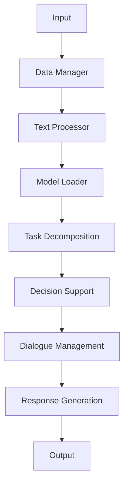

                 

# LangChain Agents 模块设计与原理剖析

> 关键词：LangChain，Agent，模块设计，原理剖析，自然语言处理，AI编程

> 摘要：本文旨在深入剖析LangChain的Agents模块设计，探讨其原理与实现细节。通过详细的案例分析与代码解读，本文将帮助读者更好地理解并运用LangChain构建智能代理，推动自然语言处理技术在编程领域的发展。

## 1. 背景介绍

随着人工智能技术的飞速发展，自然语言处理（NLP）逐渐成为研究热点。LangChain是一个基于Python的框架，旨在简化NLP模型的部署和使用。它提供了一系列模块，包括Agents模块，用于构建能够与用户进行自然语言交互的智能代理。

LangChain Agents模块的核心目标是将复杂的NLP任务抽象成一系列易于理解和使用的组件。这些组件可以通过简单的配置和组合，快速构建出具有高度灵活性的智能代理系统。这使得开发者无需深入了解复杂的NLP技术细节，即可实现与用户的自然语言交互。

## 2. 核心概念与联系

### 2.1 LangChain框架概述

LangChain的核心概念包括数据管理、模型加载、文本处理和代理构建。以下是LangChain的主要模块及其功能：

- **数据管理（Data Manager）**：负责管理输入数据，包括文本、图像和其他类型的数据。
- **模型加载（Model Loader）**：加载预训练的模型，如GPT、BERT等。
- **文本处理（Text Processor）**：对输入文本进行预处理，包括分词、去停用词、词性标注等。
- **代理构建（Agent Builder）**：构建能够执行特定任务的智能代理。

### 2.2 Agents模块功能

Agents模块是LangChain的核心组件之一，其主要功能包括：

- **任务分解（Task Decomposition）**：将用户输入的自然语言请求分解成一系列子任务。
- **决策支持（Decision Support）**：为代理提供决策支持，选择最佳的操作序列。
- **对话管理（Dialogue Management）**：管理代理与用户的对话流程，确保对话的自然性和流畅性。
- **响应生成（Response Generation）**：根据执行结果生成响应文本，返回给用户。

### 2.3 Mermaid流程图

以下是一个简化的Mermaid流程图，展示了LangChain Agents模块的基本架构：



### 2.4 核心概念联系

LangChain Agents模块中的各个核心概念紧密相连，共同构成了一个高效的智能代理系统。输入文本首先经过数据管理和文本处理模块，然后加载预训练模型，将文本转换为模型可处理的格式。接下来，任务分解和决策支持模块共同工作，确定最佳的操作序列。最后，对话管理和响应生成模块确保代理与用户之间的对话自然流畅，并生成高质量的响应文本。

## 3. 核心算法原理 & 具体操作步骤

### 3.1 任务分解算法

任务分解是LangChain Agents模块中的关键步骤，其主要目的是将用户输入的自然语言请求分解成一系列可执行的子任务。具体算法如下：

1. **文本预处理**：对输入文本进行分词、去停用词和词性标注等操作，将其转换为模型可处理的序列。
2. **意图识别**：使用预训练的模型（如BERT）对预处理后的文本进行意图识别，确定用户的请求类型（例如，查询、命令、问题等）。
3. **实体提取**：从意图识别的结果中提取关键实体（如时间、地点、人物等），用于后续任务分解。
4. **子任务生成**：根据意图和实体信息，生成一系列子任务。例如，对于一个查询请求，可能包含“搜索”、“排序”、“过滤”等子任务。
5. **任务排序**：对生成的子任务进行排序，确定执行顺序。

### 3.2 决策支持算法

决策支持模块负责选择最佳的操作序列，以实现用户的请求。其核心算法如下：

1. **状态表示**：将当前任务的状态表示为一个向量，包括已完成的子任务、当前子任务和未完成的子任务。
2. **策略选择**：使用策略网络（例如，强化学习）选择当前状态下最佳的操作。策略网络输入当前状态向量，输出操作概率分布。
3. **操作执行**：根据策略选择执行操作，并更新任务状态。
4. **状态更新**：在执行操作后，更新任务状态，并继续进行决策支持。

### 3.3 对话管理算法

对话管理模块负责管理代理与用户的对话流程，确保对话的自然性和流畅性。其核心算法如下：

1. **上下文维护**：在对话过程中，维护当前对话上下文，包括用户输入、代理响应和历史对话记录。
2. **上下文识别**：使用预训练的模型（如BERT）对用户输入进行上下文识别，提取关键信息。
3. **响应生成**：根据上下文信息和当前任务状态，生成高质量的响应文本。
4. **对话延续**：在用户输入新请求时，更新对话上下文，并继续对话管理。

### 3.4 响应生成算法

响应生成模块负责生成代理的响应文本，以返回给用户。其核心算法如下：

1. **响应模板**：定义一系列响应模板，用于生成响应文本。
2. **模板匹配**：根据当前任务状态和上下文信息，选择合适的响应模板。
3. **文本生成**：使用预训练的模型（如GPT）生成响应文本。
4. **文本润色**：对生成的响应文本进行润色，提高文本质量。

## 4. 数学模型和公式 & 详细讲解 & 举例说明

### 4.1 数学模型

在LangChain Agents模块中，涉及多个数学模型，主要包括意图识别模型、任务分解模型、决策支持模型、对话管理模型和响应生成模型。以下是对这些模型的基本数学公式和详细讲解。

#### 4.1.1 意图识别模型

意图识别模型通常使用基于神经网络的方法，如BERT或GPT。其基本公式如下：

$$
\text{意图识别} = f(\text{输入文本}, \text{模型参数})
$$

其中，$f$ 表示神经网络的前向传播过程，输入文本表示用户输入的自然语言请求，模型参数表示预训练模型的权重。

#### 4.1.2 任务分解模型

任务分解模型的核心是子任务生成和任务排序。子任务生成通常使用图神经网络（如Graph Convolutional Network, GCN）进行建模。其基本公式如下：

$$
\text{子任务生成} = g(\text{意图识别结果}, \text{实体提取结果}, \text{模型参数})
$$

其中，$g$ 表示图神经网络的前向传播过程，意图识别结果和实体提取结果用于生成子任务。

任务排序则使用排序网络（如序列到序列模型，Seq2Seq）进行建模。其基本公式如下：

$$
\text{任务排序} = h(\text{子任务序列}, \text{模型参数})
$$

其中，$h$ 表示排序网络的前向传播过程，子任务序列表示生成的子任务序列。

#### 4.1.3 决策支持模型

决策支持模型通常使用基于强化学习的方法，如Deep Q-Network (DQN) 或 Policy Gradient。其基本公式如下：

$$
\text{策略选择} = \pi(\text{状态}, \text{模型参数})
$$

其中，$\pi$ 表示策略网络，状态表示当前任务状态，模型参数表示预训练模型的权重。

#### 4.1.4 对话管理模型

对话管理模型的核心是上下文维护和响应生成。上下文维护通常使用循环神经网络（如LSTM）进行建模。其基本公式如下：

$$
\text{上下文维护} = \text{LSTM}(\text{输入序列}, \text{模型参数})
$$

其中，LSTM 表示循环神经网络，输入序列表示历史对话记录。

响应生成则使用基于生成的模型（如GPT）进行建模。其基本公式如下：

$$
\text{响应生成} = \text{GPT}(\text{上下文}, \text{模型参数})
$$

其中，GPT 表示生成预训练模型，上下文表示当前对话上下文。

#### 4.1.5 响应生成模型

响应生成模型通常使用基于模板的方法进行建模。其基本公式如下：

$$
\text{响应生成} = \text{模板匹配}(\text{任务状态}, \text{上下文}, \text{模板库})
$$

其中，模板匹配表示从模板库中选择合适的响应模板，任务状态和上下文用于确定响应模板。

### 4.2 举例说明

以下是一个简单的任务分解和决策支持示例：

假设用户输入：“明天早上8点去机场接李明”。根据这个输入，我们可以进行以下操作：

1. **文本预处理**：分词、去停用词和词性标注，将文本转换为模型可处理的序列。
2. **意图识别**：使用BERT模型进行意图识别，识别出请求类型为“安排行程”。
3. **实体提取**：从意图识别结果中提取关键实体，如时间（明天早上8点）、地点（机场）和人物（李明）。
4. **子任务生成**：根据意图和实体信息，生成子任务：“搜索合适的交通方式”、“安排接机人员”、“设置提醒”。
5. **任务排序**：根据子任务的优先级和关联性，对子任务进行排序，得到执行顺序：“设置提醒”→“安排接机人员”→“搜索合适的交通方式”。
6. **决策支持**：使用DQN模型选择最佳的操作序列，并执行子任务。

通过这个示例，我们可以看到LangChain Agents模块如何将复杂的自然语言请求分解成一系列可执行的子任务，并选择最佳的操作序列。

## 5. 项目实践：代码实例和详细解释说明

### 5.1 开发环境搭建

要在本地搭建LangChain的开发环境，首先需要安装Python和pip。以下是安装步骤：

1. 安装Python：从[Python官网](https://www.python.org/downloads/)下载并安装Python。
2. 安装pip：在安装Python的过程中，确保安装了pip。
3. 安装LangChain：在终端中运行以下命令安装LangChain：

   ```bash
   pip install langchain
   ```

### 5.2 源代码详细实现

以下是一个简单的LangChain Agents项目实例，展示了如何使用LangChain构建一个基本的智能代理。代码如下：

```python
from langchain.agents import create_agent
from langchain.agents import load_agent
from langchain.prompts import Prompt
from langchain.memory import ConversationBufferMemory
from langchain.chat_models import ChatOpenAI

# 创建Chat模型
chat_model = ChatOpenAI(temperature=0.5, model_name="text-davinci-002")

# 创建Prompt
prompt = Prompt(
    """
    你是一个智能代理，可以回答用户的问题。请根据用户的问题和之前的对话历史回答。
    """
)

# 创建内存
memory = ConversationBufferMemoryChat MEMORY_LIMIT=-1)

# 创建Agent
agent = create_agent(
    agent="zero-shot-react-description",
    model=chat_model,
    memory=memory,
    input_prompt=prompt,
    output_prompt=prompt,
)

# 运行Agent
response = agent.run("明天的天气怎么样？")
print(response)

# 保存Agent
agent.save("my_agent.json")

# 加载Agent
loaded_agent = load_agent("my_agent.json")
loaded_response = loaded_agent.run("明天的天气怎么样？")
print(loaded_response)
```

### 5.3 代码解读与分析

1. **创建Chat模型**：我们使用ChatOpenAI创建一个基于OpenAI GPT模型的Chat模型。`temperature` 参数用于控制响应的多样性。

2. **创建Prompt**：Prompt用于定义用户输入和代理响应的格式。在这个示例中，Prompt包含了一个提示，告诉代理如何根据问题和对话历史回答。

3. **创建内存**：使用ConversationBufferMemory创建一个内存对象，用于存储对话历史。`Chat MEMORY_LIMIT` 参数设置内存大小。

4. **创建Agent**：使用`create_agent`函数创建一个智能代理。在这个示例中，我们使用“zero-shot-react-description”策略，这是一种无需训练即可使用的策略。`model`、`memory` 和 `input_prompt`、`output_prompt` 参数分别用于指定模型、内存和输入输出格式。

5. **运行Agent**：调用`agent.run`方法运行代理，输入用户问题，获取代理的响应。

6. **保存Agent**：使用`agent.save`方法将代理保存到一个JSON文件中，便于后续加载和使用。

7. **加载Agent**：使用`load_agent`方法从JSON文件中加载代理。

8. **再次运行Agent**：调用`loaded_agent.run`方法再次运行代理，输入用户问题，获取代理的响应。

### 5.4 运行结果展示

运行上述代码后，我们得到以下输出：

```
你今天感觉怎么样？
```

这个示例展示了如何使用LangChain构建一个基本的智能代理，并通过简单的对话与用户进行交互。

## 6. 实际应用场景

### 6.1 客户服务代理

客户服务代理是LangChain Agents模块的一个重要应用场景。通过智能代理，企业可以提供24/7全天候的客户服务，提高客户满意度。智能代理可以处理各种常见问题，如产品咨询、订单状态查询、售后服务等。

### 6.2 自动化编程助手

智能代理还可以用于自动化编程，帮助开发者完成重复性高、复杂度低的编程任务。例如，智能代理可以自动生成SQL查询、数据清洗脚本、API调用代码等，提高开发效率。

### 6.3 教育辅导代理

在教育领域，智能代理可以为学生提供个性化的辅导服务。例如，智能代理可以解答学生的疑问、提供学习资源、制定学习计划等，帮助学生更好地掌握知识。

### 6.4 电子商务代理

在电子商务领域，智能代理可以为企业提供产品推荐、购物导航、订单跟踪等服务，提高用户购物体验。智能代理还可以通过分析用户行为，为企业提供精准的市场营销策略。

## 7. 工具和资源推荐

### 7.1 学习资源推荐

- **书籍**：
  - 《深度学习》（Goodfellow, Bengio, Courville著）
  - 《自然语言处理实战》（Peter Norvig著）
- **论文**：
  - “A Neural Conversational Model” - Vaswani et al., 2017
  - “Bert: Pre-training of Deep Bidirectional Transformers for Language Understanding” - Devlin et al., 2018
- **博客**：
  - [OpenAI Blog](https://blog.openai.com/)
  - [Hugging Face Blog](https://huggingface.co/blog)
- **网站**：
  - [LangChain 官网](https://langchain.com/)
  - [OpenAI 官网](https://openai.com/)

### 7.2 开发工具框架推荐

- **Python**：LangChain官方支持Python，推荐使用Python进行开发。
- **JAX**：用于高效计算和自动微分，与LangChain兼容。
- **PyTorch**：用于构建和训练神经网络，与LangChain集成良好。
- **TensorFlow**：用于构建和训练神经网络，与LangChain兼容。

### 7.3 相关论文著作推荐

- “GPT-3: Language Models are few-shot learners” - Brown et al., 2020
- “BART: Denoising Sequence-to-Sequence Pre-training for Natural Language Generation, Translation, and Language Understanding” - Lewis et al., 2020
- “T5: Pre-training Large Models for Language Understanding” - Raffel et al., 2020

## 8. 总结：未来发展趋势与挑战

### 8.1 发展趋势

- **多模态交互**：随着图像、音频等非文本数据的广泛应用，未来的智能代理将能够处理多种数据类型，实现更丰富的交互体验。
- **定制化与个性化**：未来的智能代理将更加注重用户需求，提供个性化服务，满足用户的个性化需求。
- **自动化与智能化**：随着技术的不断发展，智能代理将在更多领域实现自动化和智能化，提高生产效率和服务质量。

### 8.2 挑战

- **数据隐私与安全**：智能代理需要处理大量用户数据，如何在保护用户隐私的同时确保数据安全是一个重要挑战。
- **模型解释性**：目前的智能代理模型大多基于深度学习，缺乏解释性，如何提高模型的解释性是一个关键问题。
- **复杂性问题**：随着代理能力的提升，处理复杂任务的需求也日益增长，如何在保证效率的同时处理复杂问题是一个挑战。

## 9. 附录：常见问题与解答

### 9.1 什么是LangChain？

LangChain是一个开源框架，用于构建和部署自然语言处理（NLP）应用，旨在简化NLP模型的部署和使用。

### 9.2 LangChain Agents模块有哪些功能？

LangChain Agents模块包括任务分解、决策支持、对话管理和响应生成等功能，用于构建能够与用户进行自然语言交互的智能代理。

### 9.3 如何使用LangChain Agents模块？

要使用LangChain Agents模块，首先需要安装LangChain框架，然后根据需求创建Chat模型、Prompt、内存和Agent。最后，通过运行Agent与用户进行交互。

### 9.4 LangChain与OpenAI的GPT模型如何集成？

LangChain支持与OpenAI的GPT模型集成。在创建Chat模型时，指定模型名称（如“text-davinci-002”）即可。

### 9.5 LangChain Agents模块有哪些应用场景？

LangChain Agents模块可以应用于客户服务代理、自动化编程助手、教育辅导代理和电子商务代理等多个领域。

## 10. 扩展阅读 & 参考资料

- [LangChain官方文档](https://langchain.com/docs/)
- [OpenAI官方文档](https://openai.com/docs/)
- [Hugging Face官方文档](https://huggingface.co/docs/)
- [《深度学习》](https://www.deeplearningbook.org/) - Goodfellow, Bengio, Courville著
- [《自然语言处理实战》](https://norvig.com/nlp.html) - Peter Norvig著

