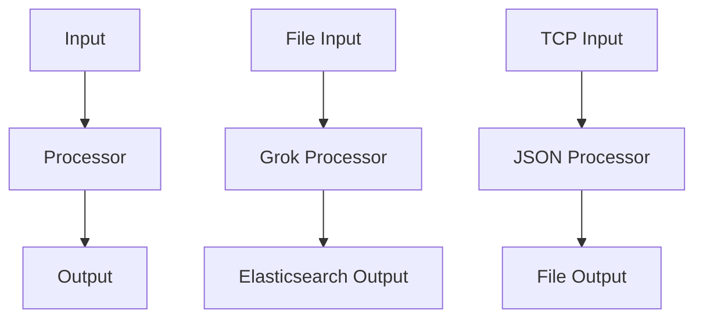

                 

### 文章标题

《Logstash原理与代码实例讲解》

> 关键词：Elasticsearch, 数据流处理, 日志管理, Logstash, 脚本化配置, 数据格式转换

> 摘要：本文将深入探讨Logstash的原理和实际应用，通过逐步分析其核心组件和配置流程，帮助读者理解如何高效地使用Logstash进行日志管理和数据流处理。文章将通过代码实例讲解，使读者能够动手实践，掌握Logstash的运用技巧。

### 1. 背景介绍

在现代信息技术环境中，日志管理是一项至关重要的任务。无论是软件开发、系统运维，还是网络安全，日志数据都提供了关键的监控和调试信息。随着日志数据的日益增长，如何高效地收集、处理和存储日志信息成为一个重要的挑战。

Elasticsearch是一个开源的分布式搜索引擎，它以其强大的全文搜索和分析能力著称。Logstash则是Elastic Stack中的数据流处理引擎，负责从各种数据源获取数据，进行转换和处理，然后将处理后的数据存储到Elasticsearch或其他数据存储中。

Logstash的设计目标是为了解决大规模日志数据的高效处理问题。它具有以下特点：

1. **可扩展性**：Logstash支持水平扩展，可以处理大规模的数据流。
2. **灵活性**：通过JSON格式配置，用户可以自定义数据流的处理逻辑。
3. **模块化**：Logstash包含多个插件，可以方便地集成到现有的系统中。

本文将详细讲解Logstash的原理和配置，通过具体的代码实例，帮助读者掌握如何使用Logstash进行日志管理和数据流处理。

### 2. 核心概念与联系

#### 2.1 Logstash核心组件

Logstash的核心组件包括输入器（Inputs）、处理器（Processors）和输出器（Outputs）。以下是各个组件的简单介绍：

- **输入器（Inputs）**：输入器负责从数据源获取数据，可以是文件、网络流、消息队列等。Logstash内置了多种输入插件，例如文件输入插件（file）、TCP输入插件（tcp）等。
- **处理器（Processors）**：处理器对输入的数据进行转换和过滤。处理器插件包括字段变换、过滤规则、数据格式转换等。Logstash支持多种数据处理插件，如Grok处理器、JSON处理器等。
- **输出器（Outputs）**：输出器负责将处理后的数据发送到目标存储系统，如Elasticsearch、MongoDB、Redis等。Logstash同样提供了多种输出插件，如Elasticsearch输出插件（elasticsearch）、File输出插件（file）等。

#### 2.2 Logstash配置文件

Logstash的配置文件通常以`.conf`为后缀，其基本结构如下：

```bash
input {
  # 定义输入器
  file {
    # 文件输入插件配置
  }
  tcp {
    # TCP输入插件配置
  }
}

filter {
  # 定义处理器
  if [type] == "mytype" {
    # 条件处理器配置
  }
}

output {
  # 定义输出器
  elasticsearch {
    # Elasticsearch输出插件配置
  }
  file {
    # 文件输出插件配置
  }
}
```

#### 2.3 Mermaid流程图

为了更直观地理解Logstash的组件和配置流程，以下是Logstash组件的Mermaid流程图：



### 3. 核心算法原理 & 具体操作步骤

#### 3.1 数据采集

Logstash的数据采集主要通过输入器完成。以文件输入为例，Logstash会监视指定路径下的文件，一旦文件发生变化（如新增或修改），Logstash会读取文件内容并将其发送到处理器。

```ruby
input {
  file {
    path => "/var/log/xxx/*.log"
    type => "mytype"
    start_position => "beginning"
  }
}
```

#### 3.2 数据处理

数据处理是Logstash的核心功能之一。处理器可以对输入的数据进行各种操作，如字段变换、过滤、正则表达式匹配等。

以下是一个使用Grok处理器的示例，它使用预定义的正则表达式模板来解析日志文件中的字段：

```ruby
filter {
  if [type] == "mytype" {
    grok {
      match => { "message" => "%{TIMESTAMP_ISO8601:timestamp} %{DATA:source} %{INT:port} %{DATA:destination}" }
    }
  }
}
```

#### 3.3 数据输出

处理后的数据需要发送到目标存储系统。以Elasticsearch输出为例，Logstash会将处理后的数据以JSON格式发送到Elasticsearch集群。

```ruby
output {
  elasticsearch {
    hosts => ["localhost:9200"]
    index => "my_index"
    document_type => "my_type"
  }
}
```

### 4. 数学模型和公式 & 详细讲解 & 举例说明

在Logstash中，数据处理过程常常涉及到复杂的字段变换和计算。以下是一个使用JavaScript处理器进行简单计算的示例：

```ruby
filter {
  if [type] == "mytype" {
    ruby {
      code => "event.set('result', event.get('value1').to_i + event.get('value2').to_i)"
    }
  }
}
```

在这个示例中，我们使用Ruby脚本将事件（event）中的`value1`和`value2`两个字段的整数值相加，并将结果存储在新的字段`result`中。

数学模型上，这个操作可以表示为：

$$
result = value1 + value2
$$

#### 4.1 举例说明

假设我们有两个日志事件，如下所示：

```json
{
  "value1": 10,
  "value2": 20
}
```

```json
{
  "value1": 30,
  "value2": 40
}
```

经过Ruby处理器处理后，事件将变为：

```json
{
  "value1": 10,
  "value2": 20,
  "result": 30
}
```

```json
{
  "value1": 30,
  "value2": 40,
  "result": 70
}
```

通过这个示例，我们可以看到Logstash如何通过处理器插件实现复杂的数据计算和变换。

### 5. 项目实践：代码实例和详细解释说明

#### 5.1 开发环境搭建

在开始使用Logstash之前，我们需要搭建一个基本的开发环境。以下是搭建Logstash开发环境的基本步骤：

1. 安装Elasticsearch：下载并安装Elasticsearch，配置Elasticsearch集群。
2. 安装Logstash：下载并安装Logstash，确保其版本与Elasticsearch兼容。
3. 配置Logstash：创建一个简单的Logstash配置文件，例如`logstash.conf`，其中包含输入器、处理器和输出器的配置。

以下是一个基本的Logstash配置文件示例：

```ruby
input {
  file {
    path => "/var/log/xxx/*.log"
    type => "mytype"
  }
}

filter {
  if [type] == "mytype" {
    grok {
      match => { "message" => "%{TIMESTAMP_ISO8601:timestamp} %{DATA:source} %{INT:port} %{DATA:destination}" }
    }
  }
}

output {
  elasticsearch {
    hosts => ["localhost:9200"]
    index => "my_index"
  }
}
```

#### 5.2 源代码详细实现

在本节中，我们将详细解释Logstash配置文件中的各个部分，并展示如何通过代码实例实现数据流处理。

##### 5.2.1 输入器（Inputs）

输入器负责从数据源读取数据。在上面的配置文件中，我们使用文件输入插件读取`/var/log/xxx/*.log`路径下的所有日志文件。

```ruby
input {
  file {
    path => "/var/log/xxx/*.log"
    type => "mytype"
  }
}
```

在这个配置中：

- `path`：指定要读取的日志文件路径。
- `type`：指定事件的类型，用于后续的处理器和输出器配置。

##### 5.2.2 处理器（Processors）

处理器负责对输入的数据进行处理。在上面的配置文件中，我们使用Grok处理器来解析日志文件中的字段。

```ruby
filter {
  if [type] == "mytype" {
    grok {
      match => { "message" => "%{TIMESTAMP_ISO8601:timestamp} %{DATA:source} %{INT:port} %{DATA:destination}" }
    }
  }
}
```

在这个配置中：

- `if [type] == "mytype"`：条件判断，只处理类型为`mytype`的事件。
- `grok`：Grok处理器，用于使用预定义的正则表达式模板解析日志字段。
- `match`：指定正则表达式模板，将匹配的字段存储为Logstash事件中的字段。

##### 5.2.3 输出器（Outputs）

输出器负责将处理后的数据发送到目标存储系统。在上面的配置文件中，我们使用Elasticsearch输出插件将数据发送到本地Elasticsearch集群。

```ruby
output {
  elasticsearch {
    hosts => ["localhost:9200"]
    index => "my_index"
  }
}
```

在这个配置中：

- `elasticsearch`：Elasticsearch输出插件。
- `hosts`：指定Elasticsearch集群的主机地址和端口。
- `index`：指定数据存储的索引名称。

#### 5.3 代码解读与分析

在上面的代码实例中，我们详细解读了Logstash配置文件中的输入器、处理器和输出器配置。接下来，我们将进一步分析Logstash的工作流程。

##### 5.3.1 Logstash工作流程

1. **启动Logstash**：启动Logstash进程，读取配置文件`logstash.conf`。
2. **读取日志文件**：Logstash使用文件输入插件监视`/var/log/xxx/*.log`路径下的所有日志文件。一旦日志文件发生变化，Logstash会读取文件内容。
3. **数据处理**：Logstash将读取的日志内容发送到处理器。在上面的示例中，我们使用Grok处理器解析日志字段，并将解析结果存储为Logstash事件中的字段。
4. **数据输出**：处理后的数据发送到Elasticsearch输出插件，存储到本地Elasticsearch集群的`my_index`索引中。

##### 5.3.2 Logstash性能优化

为了提高Logstash的性能，我们可以采取以下措施：

1. **多线程处理**：Logstash默认使用单线程处理数据。通过配置`-w`参数，可以指定Logstash的工作线程数，从而提高并发处理能力。
2. **批量处理**：Logstash支持批量处理数据。通过调整`pipeline.workers`和`pipeline.batch.size`参数，可以控制每个工作线程的批量处理能力和批量大小。
3. **缓存优化**：对于频繁使用的字段变换和过滤器，可以使用Logstash的缓存机制，从而减少计算和内存消耗。

#### 5.4 运行结果展示

在配置文件`logstash.conf`中指定了日志文件的路径和Elasticsearch集群的主机地址后，我们可以启动Logstash进程并观察运行结果。

```bash
$ bin/logstash -f logstash.conf
```

运行Logstash后，我们可以使用Elasticsearch的Kibana仪表板查看存储在`my_index`索引中的日志数据。Kibana提供了丰富的数据可视化工具，可以帮助我们轻松地分析日志数据。

### 6. 实际应用场景

#### 6.1 日志集中管理

Logstash的一个主要应用场景是日志集中管理。在现代分布式系统中，各个组件和服务的日志分散在不同的服务器和文件中。使用Logstash，我们可以将分散的日志集中到Elasticsearch中，从而实现统一的日志查询和分析。

#### 6.2 日志实时监控

通过结合Kibana，Logstash可以实现日志的实时监控。Kibana提供了丰富的图表和仪表板，可以帮助我们实时跟踪系统的运行状态和性能指标。例如，我们可以使用Kibana监控Web应用程序的响应时间、服务器负载和错误日志等。

#### 6.3 日志分析

Logstash处理后的日志数据存储在Elasticsearch中，我们可以使用Elasticsearch的强大搜索和分析功能对日志数据进行深入分析。例如，我们可以使用Elasticsearch的聚合功能统计每天的日志条数、分类日志的类型等。

### 7. 工具和资源推荐

#### 7.1 学习资源推荐

1. **官方文档**：Logstash的官方文档提供了全面的技术细节和配置指南，是学习Logstash的最佳资源。
2. **《Elastic Stack权威指南》**：这是一本关于Elastic Stack的权威指南，包括Logstash的深入讲解。
3. **GitHub上的示例项目**：在GitHub上有很多开源的Logstash示例项目，可以帮助我们更好地理解Logstash的用法。

#### 7.2 开发工具框架推荐

1. **Logstash插件开发框架**：Logstash插件开发框架可以帮助我们快速开发自定义Logstash插件。
2. **Kibana可视化工具**：Kibana提供了丰富的数据可视化功能，可以帮助我们更好地分析Logstash处理后的日志数据。

#### 7.3 相关论文著作推荐

1. **《Elastic Stack设计原理》**：该论文详细介绍了Elastic Stack的设计原理，包括Logstash的工作机制。
2. **《日志数据管理系统研究》**：该论文探讨了日志数据管理系统的设计和方法，包括日志收集、处理和存储。

### 8. 总结：未来发展趋势与挑战

随着大数据技术的不断发展，日志数据管理和分析变得越来越重要。Logstash作为Elastic Stack中的重要组件，将在未来继续发挥关键作用。然而，随着日志数据量的不断增长，Logstash也将面临性能优化和可扩展性的挑战。为了应对这些挑战，我们需要不断改进Logstash的算法和架构，提高其性能和可扩展性。

### 9. 附录：常见问题与解答

#### 9.1 如何处理大量日志数据？

对于大量日志数据的处理，我们可以通过以下方法提高Logstash的性能：

- 使用多线程处理。
- 批量处理数据。
- 使用高效的过滤器插件。
- 使用缓存机制。

#### 9.2 如何自定义Logstash插件？

自定义Logstash插件的基本步骤如下：

- 编写Ruby或Python插件代码。
- 创建插件目录结构。
- 编译和安装插件。
- 在配置文件中引用插件。

#### 9.3 如何监控Logstash的性能？

我们可以使用以下工具监控Logstash的性能：

- JMX监控：使用JMX监控Logstash的内部性能指标。
- Elasticsearch Head插件：使用Elasticsearch Head插件监控Elasticsearch和Logstash的性能。

### 10. 扩展阅读 & 参考资料

- [Logstash官方文档](https://www.elastic.co/guide/en/logstash/current/index.html)
- [Elastic Stack权威指南](https://www.elastic.co/guide/en/stack-get-started/current/index.html)
- [日志数据管理系统研究](https://www.researchgate.net/publication/324908605_Log_Database_System_Research)
- [Logstash插件开发框架](https://github.com/logstash-plugins/logstash-plugins)
- [Kibana官方文档](https://www.kibana.co/guide/en/kibana/current/index.html)

### 结语

本文详细讲解了Logstash的原理和应用，通过代码实例展示了如何使用Logstash进行日志管理和数据流处理。通过本文的学习，读者可以更好地掌握Logstash的使用方法，提高日志数据的处理和分析效率。在未来的工作中，Logstash将继续在日志管理和数据分析领域发挥重要作用，为现代分布式系统提供强大的支持。作者：禅与计算机程序设计艺术 / Zen and the Art of Computer Programming。

