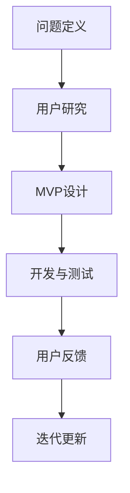

                 

### 文章标题

**MVP开发指南：快速验证创业idea的有效方法**

> **关键词**：MVP、产品开发、创业验证、快速迭代、精益创业
>
> **摘要**：本文将深入探讨MVP（最小可行产品）的开发过程，从背景介绍、核心概念、算法原理、数学模型、项目实践到实际应用场景，为读者提供一份系统而全面的MVP开发指南。通过本文，您将学会如何利用MVP快速验证创业idea，减少风险并提升成功的可能性。

---

### 1. 背景介绍

在现代商业环境中，创业已经成为越来越多人的选择。然而，创业并非易事，其中最大的挑战之一就是如何有效地将一个初创想法转化为可行的产品。传统的产品开发流程往往需要大量的时间和资源，这不仅仅是因为需要投入大量的人力物力，更重要的是，在产品开发到中后期，如果发现市场需求不足或者产品与用户需求不符，往往难以回头，造成巨大的损失。

这种情况下，MVP（Minimum Viable Product，最小可行产品）的概念应运而生。MVP的核心思想是通过开发一个具备基本功能的产品原型，以最小的投入来验证产品的市场需求和可行性。这种方法不仅能够大幅度减少开发和市场风险，还能够帮助创业团队更快速地响应市场变化，从而提高创业成功的概率。

本文将详细探讨MVP的开发过程，包括核心概念、算法原理、数学模型、项目实践和实际应用场景，旨在为创业者和产品开发者提供一套完整的MVP开发指南。

---

### 2. 核心概念与联系

#### 2.1 MVP的定义

MVP是指开发一个具备基本功能的产品原型，用以验证市场需求和产品可行性。这个原型可能不具备所有功能，但是必须能够展示产品的核心价值和潜在用户的使用场景。

#### 2.2 精益创业理念

精益创业（Lean Startup）是由埃里克·莱斯（Eric Ries）提出的一种创业方法论，强调通过快速迭代和用户反馈来验证和优化产品。MVP正是精益创业理念在产品开发中的具体应用。

#### 2.3 关联流程

MVP开发流程通常包括以下步骤：

1. **问题定义**：明确产品要解决的问题。
2. **用户研究**：了解目标用户的需求和行为。
3. **MVP设计**：确定MVP的核心功能和用户界面。
4. **开发与测试**：快速开发产品原型并进行测试。
5. **用户反馈**：收集用户反馈并用于优化产品。
6. **迭代更新**：根据用户反馈对产品进行迭代升级。

#### 2.4 Mermaid流程图



---

### 3. 核心算法原理 & 具体操作步骤

#### 3.1 问题定义

首先，创业团队需要明确产品要解决的问题。这一步骤是整个MVP开发流程的基础，直接决定了产品的方向和目标。

**操作步骤**：

1. **明确目标用户**：确定产品的目标用户群体，了解他们的需求和痛点。
2. **问题阐述**：用简洁明了的语言描述产品要解决的问题。

#### 3.2 用户研究

在问题定义的基础上，团队需要深入了解目标用户的需求和行为。

**操作步骤**：

1. **用户访谈**：通过与目标用户进行一对一访谈，了解他们的真实需求和反馈。
2. **用户画像**：基于访谈结果，创建用户画像，帮助团队更好地理解用户。
3. **竞品分析**：研究竞争对手的产品，找出他们的优点和不足。

#### 3.3 MVP设计

基于问题定义和用户研究，团队需要设计MVP的核心功能和用户界面。

**操作步骤**：

1. **功能确定**：确定MVP的核心功能，确保这些功能能够满足用户的主要需求。
2. **界面设计**：设计简洁直观的用户界面，确保用户能够轻松使用产品。

#### 3.4 开发与测试

MVP设计确定后，团队需要快速开发产品原型并进行测试。

**操作步骤**：

1. **选择开发工具**：根据项目需求选择合适的开发工具和框架。
2. **快速开发**：采用敏捷开发方法，快速开发MVP原型。
3. **用户测试**：邀请目标用户进行测试，收集他们的反馈。

#### 3.5 用户反馈

在用户测试阶段，团队需要仔细倾听用户的声音，以便对产品进行优化。

**操作步骤**：

1. **反馈收集**：建立反馈渠道，收集用户的意见和建议。
2. **数据分析**：对用户反馈进行分析，找出产品的优点和改进点。
3. **优化产品**：根据用户反馈对产品进行优化和迭代。

#### 3.6 迭代更新

基于用户反馈，团队需要对产品进行迭代升级，不断改进产品。

**操作步骤**：

1. **制定迭代计划**：根据用户反馈和产品改进需求，制定迭代计划。
2. **持续迭代**：持续进行产品迭代，不断优化产品。
3. **监测迭代效果**：监测迭代效果，确保每次迭代都能带来显著的改进。

---

### 4. 数学模型和公式 & 详细讲解 & 举例说明

MVP开发过程中，数学模型和公式可以帮助我们更准确地衡量产品的可行性和市场潜力。以下是几个常用的数学模型和公式。

#### 4.1 用户生命周期价值（LTV）

用户生命周期价值是指一个用户在其生命周期内为公司带来的总收益。计算公式如下：

\[ LTV = \text{平均订单价值} \times \text{订单频率} \times \text{客户生命周期} \]

**举例说明**：

假设某电子商务平台平均订单价值为100元，用户平均每周下订单一次，用户生命周期为2年。那么该用户的LTV为：

\[ LTV = 100 \times 1 \times 2 \times 52 = 10,400 \text{元} \]

通过LTV的计算，团队可以评估用户对产品的长期价值，从而决定是否投入更多资源进行开发。

#### 4.2 风险评估模型

MVP开发过程中的风险评估模型可以帮助团队识别和评估潜在的风险。常用的风险评估模型包括SWOT分析（优势、劣势、机会、威胁）和蒙特卡洛模拟。

**SWOT分析**

\[ \text{SWOT} = \text{S} + \text{W} + \text{O} + \text{T} \]

**举例说明**：

对于一个在线教育平台，SWOT分析可能如下：

- **S（优势）**：强大的师资力量、优质的学习资源
- **W（劣势）**：用户获取成本高、市场竞争激烈
- **O（机会）**：在线教育市场快速增长、新的用户需求不断涌现
- **T（威胁）**：竞争对手多、技术更新迭代快

通过SWOT分析，团队可以更全面地了解产品的优势和劣势，从而制定相应的策略。

**蒙特卡洛模拟**

蒙特卡洛模拟是一种通过随机抽样和模拟来评估系统性能和风险的方法。其基本公式如下：

\[ \text{风险概率} = \frac{\text{模拟结果中大于等于实际结果的情况数}}{\text{模拟次数}} \]

**举例说明**：

假设我们想要评估某电商平台的订单处理能力，我们可以通过蒙特卡洛模拟来模拟不同订单量的情况，然后计算订单处理失败的概率。

通过这些数学模型和公式，团队可以更科学地评估产品的可行性和市场潜力，从而更好地制定开发策略。

---

### 5. 项目实践：代码实例和详细解释说明

在本节中，我们将通过一个实际的MVP项目实例，展示如何进行MVP开发，并详细解释关键代码的实现和作用。

#### 5.1 开发环境搭建

首先，我们需要搭建一个适合MVP项目的开发环境。以下是所需的开发工具和框架：

- **编程语言**：Python
- **框架**：Flask
- **数据库**：SQLite
- **前端框架**：Bootstrap

#### 5.2 源代码详细实现

下面是一个简单的MVP项目示例，包括一个基于Flask的Web应用程序，用于用户注册和登录。

```python
# app.py

from flask import Flask, request, redirect, url_for, render_template

app = Flask(__name__)

# 假设的用户数据库
users = {
    "admin": "password123"
}

@app.route('/')
def home():
    return render_template('home.html')

@app.route('/register', methods=['GET', 'POST'])
def register():
    if request.method == 'POST':
        username = request.form['username']
        password = request.form['password']
        if username in users:
            return "用户已存在！"
        users[username] = password
        return redirect(url_for('home'))
    return render_template('register.html')

@app.route('/login', methods=['GET', 'POST'])
def login():
    if request.method == 'POST':
        username = request.form['username']
        password = request.form['password']
        if username not in users or users[username] != password:
            return "用户名或密码错误！"
        return redirect(url_for('home'))
    return render_template('login.html')

if __name__ == '__main__':
    app.run(debug=True)
```

#### 5.3 代码解读与分析

- **home.html**：主页面，用于展示欢迎信息。
- **register.html**：注册页面，收集用户名和密码。
- **login.html**：登录页面，收集用户名和密码。
- **app.py**：Flask应用程序，实现路由和业务逻辑。

**关键代码解释**：

1. **用户数据库**：我们使用一个简单的字典作为用户数据库，实际应用中应使用数据库存储用户信息。
2. **注册和登录功能**：通过路由和表单处理用户注册和登录请求，并验证用户名和密码。
3. **页面渲染**：使用Bootstrap框架渲染页面，确保页面简洁美观。

#### 5.4 运行结果展示

运行该应用程序后，用户可以通过浏览器访问以下链接进行操作：

- 主页面：`http://127.0.0.1:5000/`
- 注册页面：`http://127.0.0.1:5000/register`
- 登录页面：`http://127.0.0.1:5000/login`

通过这个简单的示例，我们可以看到如何快速构建一个具备基本功能的MVP项目，并进行进一步的优化和迭代。

---

### 6. 实际应用场景

MVP开发方法在多个实际应用场景中得到了广泛的应用，以下是一些典型的应用案例：

#### 6.1 互联网初创公司

互联网初创公司通常资金有限，需要快速验证产品的市场需求和可行性。通过MVP开发，初创公司可以在最小化成本的情况下，快速构建产品原型，并进行市场测试，从而降低失败风险。

#### 6.2 大公司新产品线

大公司在推出新产品线时，也会采用MVP方法进行初步验证。这样可以确保新产品能够满足市场需求，并避免在产品开发到中后期才发现市场需求不足，造成巨大的资源浪费。

#### 6.3 社交媒体应用

社交媒体应用通常需要大规模用户数据来验证产品的可行性和市场潜力。通过MVP开发，应用开发者可以在早期阶段就收集到大量用户数据，从而指导后续的产品开发和优化。

#### 6.4 硬件产品

对于硬件产品，MVP开发方法可以帮助团队在早期阶段验证产品的设计和技术可行性，减少研发成本和时间。

通过这些实际应用案例，我们可以看到MVP开发方法在各类产品开发中的应用前景和优势。

---

### 7. 工具和资源推荐

在MVP开发过程中，选择合适的工具和资源对于项目的成功至关重要。以下是一些推荐的工具和资源：

#### 7.1 学习资源推荐

- **书籍**：
  - 《精益创业》（The Lean Startup）- 埃里克·莱斯（Eric Ries）
  - 《MVP：精益创业方法论实战》（MVP: A Guide to Building the Minimum Viable Product）- 瑞安·弗雷瑟（Ryan Freas）
- **在线课程**：
  - Coursera上的“产品管理”（Product Management）课程
  - Udemy上的“精益创业实战”（Lean Startup Mastery）课程
- **博客和网站**：
  - Lean Startup官网（https://leanstack.com/）
  - StartupBlink（https://www.startupblink.com/）

#### 7.2 开发工具框架推荐

- **编程语言**：Python、JavaScript、Java等
- **Web框架**：Flask、Django、Spring Boot等
- **前端框架**：Bootstrap、React、Vue等
- **数据库**：SQLite、MySQL、PostgreSQL等
- **版本控制**：Git、GitHub、GitLab等

#### 7.3 相关论文著作推荐

- **论文**：
  - “The Lean Startup: How Today's Entrepreneurs Use Continuous Innovation to Create Radically Successful Businesses”（《精益创业》：今天的企业家如何通过持续创新创造成功企业）
  - “Building Minimum Viable Products: A Practical Guide”（构建最小可行产品：实用指南）
- **著作**：
  - 《精益创业方法论：从0到1打造成功企业》（Lean Startup: How Today's Entrepreneurs Use Continuous Innovation to Create Radically Successful Businesses）

通过这些工具和资源，创业者和产品开发者可以更有效地进行MVP开发，提高产品成功的概率。

---

### 8. 总结：未来发展趋势与挑战

随着技术的不断进步和商业环境的快速变化，MVP开发方法在未来将继续发挥重要作用。以下是未来MVP开发的发展趋势和面临的挑战：

#### 8.1 发展趋势

1. **自动化与智能化**：随着人工智能和自动化技术的发展，MVP开发过程将更加自动化和智能化，提高开发效率和产品质量。
2. **敏捷开发**：敏捷开发方法将更加普及，MVP开发流程将更加灵活和适应变化，更好地满足市场需求。
3. **云计算与大数据**：云计算和大数据技术的应用将帮助创业团队更快速地构建和优化MVP，从而降低成本和提高开发效率。

#### 8.2 面临的挑战

1. **数据隐私与安全**：在MVP开发过程中，如何保护用户数据隐私和安全将成为一个重要挑战。
2. **资源有限**：许多创业团队在资源有限的情况下进行MVP开发，如何最大化利用现有资源将成为一个重要问题。
3. **市场变化**：市场需求和竞争环境不断变化，如何快速响应市场变化并调整MVP策略也是一个挑战。

综上所述，未来MVP开发将在技术进步和市场变化的推动下不断发展，但同时也将面临一系列挑战。创业者和产品开发者需要持续学习和适应，才能在激烈的市场竞争中脱颖而出。

---

### 9. 附录：常见问题与解答

#### 9.1 什么是MVP？

MVP（Minimum Viable Product）是指最小可行产品，是一种以最小投入来验证产品市场需求和可行性的产品开发方法。

#### 9.2 MVP的核心原则是什么？

MVP的核心原则是快速迭代、最小投入、快速验证和持续优化。

#### 9.3 MVP开发有哪些好处？

MVP开发的好处包括：

- 降低市场风险：通过最小化产品功能，验证市场需求和可行性，降低失败风险。
- 提高开发效率：快速迭代和敏捷开发方法，提高开发效率和产品质量。
- 降低成本：通过最小投入，降低产品开发成本。
- 提高用户满意度：快速响应市场变化和用户需求，提高用户满意度。

#### 9.4 MVP开发中应该注意哪些事项？

在MVP开发中，应该注意以下事项：

- 明确目标：明确产品要解决的问题和目标用户。
- 用户研究：深入了解目标用户的需求和行为。
- 优化流程：采用敏捷开发和快速迭代的方法。
- 数据分析：收集用户反馈，进行数据分析和优化。
- 持续更新：根据用户反馈和市场变化，持续优化产品。

---

### 10. 扩展阅读 & 参考资料

为了帮助读者更深入地了解MVP开发和精益创业方法，以下是一些扩展阅读和参考资料：

- **书籍**：
  - 《精益创业》（The Lean Startup）- 埃里克·莱斯（Eric Ries）
  - 《MVP：精益创业方法论实战》（MVP: A Guide to Building the Minimum Viable Product）- 瑞安·弗雷瑟（Ryan Freas）
- **在线课程**：
  - Coursera上的“产品管理”（Product Management）课程
  - Udemy上的“精益创业实战”（Lean Startup Mastery）课程
- **博客和网站**：
  - Lean Startup官网（https://leanstack.com/）
  - StartupBlink（https://www.startupblink.com/）
- **论文和著作**：
  - “The Lean Startup: How Today's Entrepreneurs Use Continuous Innovation to Create Radically Successful Businesses”（《精益创业》：今天的企业家如何通过持续创新创造成功企业）
  - “Building Minimum Viable Products: A Practical Guide”（构建最小可行产品：实用指南）

通过这些扩展阅读和参考资料，读者可以更全面地了解MVP开发和精益创业方法，为创业和产品开发提供有益的指导。

---

**作者：禅与计算机程序设计艺术 / Zen and the Art of Computer Programming**

