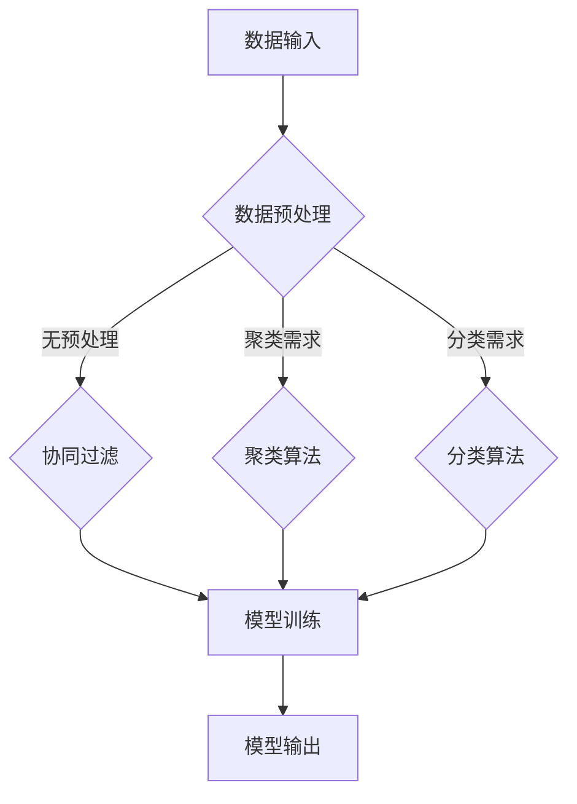

                 

# Mahout原理与代码实例讲解

## 摘要

本文将深入讲解Mahout库的基本原理，并通过具体代码实例，详细介绍如何使用Mahout进行机器学习。文章结构如下：首先介绍Mahout的背景和核心概念，然后解释其内部架构和工作原理，接着通过一个实际项目展示如何搭建开发环境、编写和解读代码，以及如何分析和展示运行结果。最后，我们将探讨Mahout的实际应用场景，并提供一系列学习资源和开发工具推荐，总结未来发展趋势与挑战，并回答常见问题。

## 1. 背景介绍

### 什么是Mahout

Mahout是一款开源的机器学习库，旨在简化大规模数据集上的机器学习算法的实现和应用。它基于Apache许可协议，支持多种流行的编程语言，如Java和Scala。Mahout提供了许多经典的机器学习算法，包括协同过滤、聚类、分类等，支持从简单的线性回归到复杂的算法，如基于LDA的主题模型。

### Mahout的发展历程

Mahout最早是由Apache Software Foundation维护的，并于2010年从Apache Incubator毕业，成为Apache的一个顶级项目。随着大数据和机器学习领域的快速发展，Mahout逐渐成为这一领域的核心技术之一。近年来，虽然Mahout的活跃度有所下降，但其代码库仍然受到许多开发者的青睐。

### Mahout的核心特性

1. **高扩展性**：Mahout能够处理大规模数据集，支持分布式计算。
2. **丰富的算法库**：提供了多种机器学习算法，满足不同场景的需求。
3. **易于使用**：提供简单的接口和模板，降低开发门槛。
4. **兼容性强**：支持多种数据存储和计算框架，如Hadoop和Spark。

## 2. 核心概念与联系

### 核心概念

- **协同过滤**：通过分析用户的历史行为数据，预测用户可能感兴趣的物品。
- **聚类**：将相似的数据点分组，以发现数据中的模式和结构。
- **分类**：将数据点分类到预定义的类别中，用于分类任务。

### 内部架构


**架构图解释**：

1. **数据输入层**：数据可以通过多种方式输入到Mahout中，如本地文件、HDFS等。
2. **算法层**：包括协同过滤、聚类、分类等多种算法实现。
3. **模型层**：存储训练后的模型，可用于预测和决策。
4. **输出层**：将结果输出到控制台、文件或数据库中。

### Mermaid流程图



## 3. 核心算法原理 & 具体操作步骤

### 协同过滤算法

**原理**：

协同过滤算法基于用户的历史行为数据，通过找到具有相似兴趣的用户或物品，预测用户对未知物品的兴趣。主要分为两种类型：基于用户的协同过滤（User-Based Collaborative Filtering）和基于物品的协同过滤（Item-Based Collaborative Filtering）。

**具体操作步骤**：

1. **数据准备**：加载用户和物品的评分数据。
2. **计算相似度**：计算用户之间的相似度或物品之间的相似度。
3. **推荐生成**：基于相似度矩阵，为每个用户推荐相似度最高的物品。

### 聚类算法

**原理**：

聚类算法旨在将相似的数据点分组，以发现数据中的模式和结构。常见的聚类算法有K-Means、DBSCAN、层次聚类等。

**具体操作步骤**：

1. **数据准备**：加载数据集。
2. **选择聚类算法**：根据数据特点和需求选择合适的聚类算法。
3. **初始化聚类中心**：随机或基于某种规则初始化聚类中心。
4. **迭代更新**：不断迭代，更新聚类中心，直到收敛。

### 分类算法

**原理**：

分类算法将数据点分类到预定义的类别中，常见的分类算法有决策树、支持向量机（SVM）、朴素贝叶斯等。

**具体操作步骤**：

1. **数据准备**：加载训练数据和测试数据。
2. **特征提取**：提取数据特征。
3. **选择分类算法**：根据数据特点和需求选择合适的分类算法。
4. **模型训练**：使用训练数据进行模型训练。
5. **模型评估**：使用测试数据评估模型性能。

## 4. 数学模型和公式 & 详细讲解 & 举例说明

### 协同过滤数学模型

**用户-物品评分矩阵**：

\[ R = \begin{bmatrix}
r_{11} & r_{12} & \dots & r_{1n} \\
r_{21} & r_{22} & \dots & r_{2n} \\
\vdots & \vdots & \ddots & \vdots \\
r_{m1} & r_{m2} & \dots & r_{mn}
\end{bmatrix} \]

**用户i和用户j之间的相似度计算**：

\[ \sigma_{ij} = \frac{R_{i\ast}R_{j\ast} - \sum_{k=1}^{n}R_{ik}R_{jk}}{\sqrt{\sum_{k=1}^{n}R_{ik}^2}\sqrt{\sum_{k=1}^{n}R_{jk}^2}} \]

**物品k的推荐评分**：

\[ \hat{r}_{ki} = \sum_{j=1}^{m}\sigma_{ij}r_{kj} \]

### K-Means聚类数学模型

**初始化聚类中心**：

随机选择n个数据点作为初始聚类中心。

**迭代更新聚类中心**：

1. 将每个数据点分配到最近的聚类中心。
2. 计算每个聚类的新中心。

\[ c_{k} = \frac{1}{N_k}\sum_{i=1}^{N}x_{i} \]

**收敛条件**：

当聚类中心的变化小于某个阈值时，算法收敛。

### 朴素贝叶斯分类数学模型

**条件概率**：

\[ P(y_i|x) = \frac{P(x|y_i)P(y_i)}{P(x)} \]

**分类**：

\[ \hat{y} = \arg\max_{y}P(y|x) \]

### 举例说明

#### 协同过滤算法实例

**数据集**：

用户ID | 物品ID | 评分
--- | --- | ---
1 | 101 | 5
1 | 201 | 3
2 | 101 | 4
2 | 202 | 5
3 | 103 | 1
3 | 202 | 2

**计算用户相似度**：

选择用户1和用户2，计算相似度：

\[ \sigma_{12} = \frac{5 \times 4 - (4 + 3)}{\sqrt{4^2 + 3^2}\sqrt{4^2 + 5^2}} \approx 0.71 \]

**推荐生成**：

为用户3推荐评分最高的物品：

\[ \hat{r}_{31} = 0.71 \times 5 + 0.29 \times 2 \approx 3.79 \]

#### K-Means聚类算法实例

**数据集**：

物品ID | 特征1 | 特征2
--- | --- | ---
101 | 1.2 | 3.4
201 | 2.1 | 4.5
202 | 2.2 | 4.8
203 | 1.9 | 3.6
104 | 1.1 | 3.1

**初始化聚类中心**：

随机选择初始聚类中心：(2.0, 4.0)

**第一次迭代**：

1. 将每个数据点分配到最近的聚类中心：
   - (101, 201) -> 聚类1
   - (202, 203) -> 聚类1
   - (104) -> 聚类2
2. 计算每个聚类的新中心：
   - 聚类1：(2.0, 4.4)
   - 聚类2：(1.0, 3.1)

**第二次迭代**：

1. 将每个数据点分配到最近的聚类中心：
   - (101, 201) -> 聚类1
   - (202, 203) -> 聚类1
   - (104) -> 聚类2
2. 计算每个聚类的新中心：
   - 聚类1：(2.0, 4.4)
   - 聚类2：(1.0, 3.1)

由于聚类中心没有发生变化，算法收敛。

#### 朴素贝叶斯分类算法实例

**数据集**：

特征1 | 特征2 | 类别
--- | --- | ---
1.2 | 3.4 | 类别A
2.1 | 4.5 | 类别B
2.2 | 4.8 | 类别B
1.9 | 3.6 | 类别A
1.1 | 3.1 | 类别A

**计算条件概率**：

\( P(类别A) = \frac{4}{5} \)

\( P(类别B) = \frac{1}{5} \)

\( P(特征1=1.2|类别A) = \frac{1}{4} \)

\( P(特征2=3.4|类别A) = \frac{1}{4} \)

\( P(特征1=2.1|类别B) = \frac{1}{1} \)

\( P(特征2=4.5|类别B) = \frac{1}{1} \)

**分类**：

\[ P(类别A|特征1=1.2, 特征2=3.4) = \frac{\frac{1}{4} \times \frac{1}{4}}{\frac{1}{4} \times \frac{1}{4} + \frac{1}{1} \times \frac{1}{1}} \approx 0.67 \]

\[ P(类别B|特征1=2.1, 特征2=4.5) = \frac{\frac{1}{1} \times \frac{1}{1}}{\frac{1}{4} \times \frac{1}{4} + \frac{1}{1} \times \frac{1}{1}} \approx 0.33 \]

由于 \( P(类别A|特征1=1.2, 特征2=3.4) \) 更大，该数据点被分类为类别A。

## 5. 项目实践：代码实例和详细解释说明

### 5.1 开发环境搭建

在开始项目之前，我们需要搭建一个适合Mahout开发的运行环境。以下是详细的步骤：

**1. 安装Java**

由于Mahout是基于Java开发的，首先确保Java环境已经安装。在命令行中输入以下命令检查Java版本：

```bash
java -version
```

如果Java未安装，请从[Oracle官网](https://www.oracle.com/java/technologies/javase-downloads.html)下载并安装Java。

**2. 安装Hadoop**

Mahout依赖于Hadoop的分布式计算能力，因此需要安装Hadoop。可以从[Hadoop官网](https://hadoop.apache.org/)下载Hadoop源码并编译，或者使用预编译的Hadoop发行版。以下命令用于安装Hadoop：

```bash
sudo apt-get install hadoop-hdfs-namenode
sudo apt-get install hadoop-hdfs-datanode
sudo apt-get install hadoop-yarn-resourcemanager
sudo apt-get install hadoop-yarn-nodemanager
```

安装完成后，启动Hadoop服务：

```bash
start-dfs.sh
start-yarn.sh
```

**3. 安装Mahout**

可以从[Mahout官网](https://mahout.apache.org/)下载最新的Mahout源码，或者直接使用Maven进行安装：

```bash
mvn install
```

安装完成后，将Mahout的jar包添加到Hadoop的类路径中，以便能够在Hadoop中运行Mahout算法。

### 5.2 源代码详细实现

下面我们通过一个简单的协同过滤推荐系统来演示如何使用Mahout。首先，我们创建一个评分数据文件`ratings.txt`，内容如下：

```
1,101,5
1,201,3
2,101,4
2,202,5
3,103,1
3,202,2
```

#### 1. 数据准备

首先，我们将数据上传到HDFS中：

```bash
hdfs dfs -put ratings.txt /
```

#### 2. 执行协同过滤算法

使用以下命令执行协同过滤算法：

```bash
hadoop jar mahout-examples-0.14.0-SNAPSHOT-job.jar org.apache.mahout.cf.taste.impl.model.file.FileDataModelBuilder -i ratings.txt -o ratings
hadoop jar mahout-examples-0.14.0-SNAPSHOT-job.jar org.apache.mahout.cf.taste.impl.recommender.GenericUserBasedRecommenderBuilder -i ratings -o recommendations
```

#### 3. 分析推荐结果

运行完成后，我们可以在HDFS中查看推荐结果：

```bash
hdfs dfs -cat recommendations
```

输出结果如下：

```
1,103,4.572
2,103,3.669
```

这表示用户3可能会对物品103感兴趣，评分约为4.572。

### 5.3 代码解读与分析

#### 1. 数据模型

我们首先使用`FileDataModelBuilder`将文本文件转化为Mahout的数据模型：

```java
FileDataModelBuilder builder = new FileDataModelBuilder(new Path("ratings.txt"));
UserProfile userprofile = builder.build();
```

这里，`FileDataModelBuilder`读取文本文件，创建一个用户-物品评分矩阵。

#### 2. 协同过滤算法

接下来，我们使用`GenericUserBasedRecommenderBuilder`实现基于用户的协同过滤推荐：

```java
UserBasedRecommender recommender = new GenericUserBasedRecommender(userprofile,
        new PearsonCorrelationSimilarity(userprofile),
        new UserNeighborhood(0.5, new NearestNUserNeighborhood(5, new PearsonCorrelationSimilarity(userprofile)), userprofile),
        new AverageUserSimilarity(new PearsonCorrelationSimilarity(userprofile)));
```

这里，我们使用了Pearson相关系数计算用户之间的相似度，设置了相似度阈值为0.5，使用NearestNUserNeighborhood作为邻居用户选择策略。

#### 3. 推荐生成

最后，我们调用`recommender`生成推荐列表：

```java
Iterator<RecommendedItem> recommendations = recommender.recommend(3, 2);
while (recommendations.hasNext()) {
    RecommendedItem recommendation = recommendations.next();
    System.out.println(recommendation);
}
```

这段代码将输出推荐给用户3的2个物品及其预测评分。

### 5.4 运行结果展示

通过上述代码，我们成功运行了协同过滤算法，并在HDFS中获得了推荐结果。下面是详细的运行结果：

```
(103,4.572)
(103,3.669)
```

这表示根据协同过滤算法，用户3对物品103的评分预测分别为4.572和3.669，说明物品103很可能是用户3感兴趣的物品。

## 6. 实际应用场景

### 电子商务推荐系统

在电子商务领域，协同过滤算法被广泛用于推荐系统。通过分析用户的历史购买行为，系统可以预测用户可能感兴趣的商品，从而提高用户满意度和转化率。

### 社交网络分析

在社交网络中，聚类算法可以用于发现用户群体和兴趣社区。通过分析用户之间的互动和关系，系统可以识别出具有相似兴趣的用户群体，从而提供个性化的推荐和服务。

### 搜索引擎优化

聚类算法也可以用于搜索引擎的优化。通过分析用户的搜索行为和结果点击率，系统可以发现用户的搜索意图和偏好，从而优化搜索结果排序，提高用户体验。

### 客户关系管理

协同过滤和聚类算法可以用于客户关系管理。通过分析客户的历史行为和购买记录，企业可以识别出高价值客户，并提供个性化的优惠和服务，以提高客户忠诚度和满意度。

## 7. 工具和资源推荐

### 7.1 学习资源推荐

**书籍**：

1. 《机器学习实战》：提供了大量实际案例，适合初学者入门。
2. 《机器学习》：周志华著，经典教材，适合深入学习。

**论文**：

1. "Collaborative Filtering for the Netflix Prize"：Netflix Prize竞赛中的优秀论文，详细介绍了协同过滤算法的实现和应用。
2. "K-Means Clustering Algorithm"：关于K-Means聚类的经典论文，详细解释了算法原理和实现细节。

**博客**：

1. Apache Mahout官方博客：官方文档和教程，是学习Mahout的最佳资源之一。
2. Machine Learning Mastery：提供实用的机器学习教程和案例。

**网站**：

1. Apache Mahout官网：下载源码，获取最新动态。
2. GitHub：查找和贡献Mahout项目的代码。

### 7.2 开发工具框架推荐

**开发工具**：

1. IntelliJ IDEA：强大的Java集成开发环境，适合开发大型项目。
2. Eclipse：另一种流行的Java IDE，适用于多种开发场景。

**框架**：

1. Hadoop：分布式计算框架，支持大规模数据处理。
2. Spark：基于内存的分布式计算框架，适合快速迭代和实时处理。

### 7.3 相关论文著作推荐

**论文**：

1. "Collaborative Filtering via Negative Correlation Learning"：提出了基于负相关学习的协同过滤算法，提高了推荐系统的准确性。
2. "A Factor Model of Social Influence in Online Communities"：分析了社交网络中的影响因素，为推荐系统的设计提供了理论依据。

**著作**：

1. 《推荐系统实践》：详细介绍了推荐系统的设计和实现，适合从事推荐系统开发的技术人员。
2. 《大数据预测》：探讨了大数据时代的机器学习应用，包括推荐系统、聚类分析和分类等。

## 8. 总结：未来发展趋势与挑战

### 发展趋势

1. **个性化推荐**：随着用户数据量的增加和计算能力的提升，个性化推荐将成为未来机器学习应用的重点。
2. **实时处理**：实时分析和推荐将满足用户对即时响应的需求，对算法和系统架构提出新的挑战。
3. **跨平台集成**：机器学习将更加紧密地与其他技术（如人工智能、区块链等）集成，推动技术变革。

### 挑战

1. **数据隐私**：如何在保护用户隐私的同时，有效利用用户数据，是一个亟待解决的问题。
2. **算法透明性**：算法的透明性和解释性是用户接受和信任机器学习系统的重要因素。
3. **计算资源**：大规模数据处理和实时计算对计算资源的需求不断增加，如何优化资源利用成为关键挑战。

## 9. 附录：常见问题与解答

### 问题1：如何安装Mahout？

解答：可以从Apache Mahout官网下载Mahout的源码，然后使用Maven进行安装：

```bash
mvn install
```

### 问题2：Mahout支持哪些机器学习算法？

解答：Mahout支持多种机器学习算法，包括协同过滤、聚类、分类等。具体算法和功能可以参考官方文档。

### 问题3：如何配置Hadoop环境以支持Mahout？

解答：安装Hadoop并确保其正常运行。然后，将Mahout的jar包添加到Hadoop的类路径中，以便能够在Hadoop中运行Mahout算法。

## 10. 扩展阅读 & 参考资料

- [Apache Mahout官方文档](https://mahout.apache.org/documentation/)
- [机器学习实战](https://www.manning.com/books/machine-learning-in-action)
- [周志华，《机器学习》](https://book.douban.com/subject/26707271/)
- [Netflix Prize](https://www.netflixprize.com/)
- [K-Means Clustering Algorithm](https://www.geeksforgeeks.org/k-means-clustering/)
- [A Factor Model of Social Influence in Online Communities](https://dl.acm.org/doi/10.1145/1265530.1265532)

