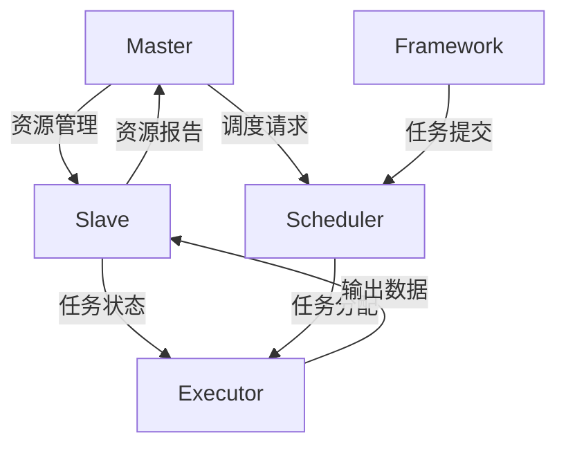

                 

### 背景介绍

Mesos（Massive Scale Data Processing System）是一个开源的分布式资源管理器和调度器，由Twitter开发并维护。它的主要目的是通过高效地管理计算资源，从而使得各种分布式应用能够在同一套资源上无缝运行，而无需关心底层的硬件细节或资源的分配情况。Mesos通过提供统一的资源层，使得用户能够以简单的接口来调度和管理资源，大大提高了资源利用率和作业的可靠性。

随着云计算和大数据技术的发展，分布式系统的规模和复杂性不断增长。传统的资源管理方式已经难以满足日益增加的需求。在这样的背景下，Mesos应运而生。它通过提供资源隔离和高效调度机制，确保了各种应用可以在同一套资源上高效运行，从而提高了整体系统的性能和可靠性。

Mesos不仅仅是一个调度器，它还是一个生态系统，支持各种不同的上层框架，如Marathon、Chronos、DC/OS等，这些框架为不同的应用场景提供了丰富的功能。Marathon是一个通用任务调度器，适用于长周期任务和Web应用；Chronos则专注于定时任务的调度。通过这些框架，用户可以轻松地部署和管理各种分布式应用。

本文将深入探讨Mesos的工作原理和代码实例，帮助读者理解这个强大分布式系统的运作机制。首先，我们将介绍Mesos的核心概念和架构，然后详细讲解其调度算法和资源管理机制。接下来，我们将通过实际代码实例，逐步解析Mesos的源代码，帮助读者掌握其具体实现。最后，我们将讨论Mesos的实际应用场景，以及未来可能的发展趋势和挑战。

在开始之前，请确保您对基本的分布式系统和云计算概念有一定的了解。这将有助于您更好地理解Mesos的设计理念和工作原理。接下来，我们将一步一步地深入这个领域，揭示Mesos背后的奥秘。

## 2. 核心概念与联系

Mesos作为分布式资源管理和调度系统，其核心概念和架构设计非常关键。理解这些概念及其相互关系，将有助于我们深入挖掘Mesos的工作原理。以下我们将通过一个Mermaid流程图，详细介绍Mesos的核心概念和架构。

### 2.1 Mermaid流程图



### 2.2 核心概念解释

1. **Master**：Mesos的主节点，负责管理整个集群的资源，并接受来自Scheduler的调度请求。Master是整个系统的核心，负责资源分配、故障转移等关键任务。

2. **Slave**：Mesos的从节点，负责执行由Master分配的任务，并定期向Master报告自身状态和可用资源。每个Slave节点上运行了一个名为Mesos Slave的守护进程，负责与Master通信和执行任务。

3. **Scheduler**：Mesos的调度器，负责将任务分配给Slave节点。不同的Framework可以定制自己的Scheduler，实现不同的调度策略。例如，Marathon是一个通用的Scheduler，Chronos则专注于定时任务。

4. **Executor**：Mesos的任务执行器，负责在Slave节点上运行具体的任务。Executor由Framework生成，并在任务开始时启动。

5. **Framework**：Mesos的上层应用框架，负责向Scheduler提交任务，并管理任务的整个生命周期。不同的Framework适用于不同的应用场景，如Marathon适用于长周期任务，Chronos适用于定时任务。

6. **资源报告**：Slave节点定期向Master报告自身状态和可用资源。Master根据这些信息进行资源分配和调度。

7. **任务分配**：Scheduler根据任务的特性和资源需求，将任务分配给适合的Slave节点。

### 2.3 架构设计

Mesos的架构设计遵循模块化和分布式原则，使其具有高扩展性和高可用性。以下是Mesos的主要架构设计特点：

1. **分布式系统架构**：Mesos采用分布式系统架构，Master和Slave节点可以分布在不同的物理或虚拟机上。这种分布式设计使得Mesos可以灵活地扩展到大规模集群。

2. **资源隔离**：Mesos通过资源隔离机制，确保不同应用可以在同一套资源上独立运行。每个任务在启动时会分配独立的CPU、内存等资源，从而避免任务之间的干扰。

3. **高效调度**：Mesos采用高效调度算法，根据任务的特性和资源需求，动态地分配资源。这种动态调度机制大大提高了资源的利用率和系统的整体性能。

4. **故障转移**：Mesos支持故障转移机制，当Master节点出现故障时，可以从Slave节点中选出一个新的Master节点，继续提供服务。这种设计保证了系统的持续运行和高可用性。

5. **支持多种Framework**：Mesos支持多种Framework，如Marathon、Chronos、DC/OS等。不同的Framework可以定制不同的调度策略，满足不同应用场景的需求。

通过上述核心概念和架构设计，我们可以看到Mesos是如何通过分布式资源管理和高效调度，实现大规模分布式系统的资源优化和任务管理。接下来，我们将详细探讨Mesos的调度算法和资源管理机制，进一步揭示其内在的工作原理。

## 3. 核心算法原理 & 具体操作步骤

Mesos的核心算法原理是其高效调度和资源管理机制，这使得系统能够在动态变化的资源环境中优化任务执行。以下是Mesos调度算法的详细原理和操作步骤：

### 3.1 调度算法原理

Mesos的调度算法主要依赖于以下几个关键步骤：

1. **资源感知**：Mesos Scheduler在调度任务时，需要知道当前集群中各Slave节点的资源状态。Master节点会定期从Slave节点收集资源信息，并维护一个全局资源视图。

2. **任务选择**：Scheduler从任务队列中选择一个或多个待执行的任务。选择标准通常包括任务的优先级、资源需求、调度策略等。

3. **资源分配**：Scheduler根据任务的需求，将任务分配给一个或多个具备相应资源的Slave节点。Mesos采用一种基于约束的分配策略，确保任务能够在满足资源约束的节点上运行。

4. **任务启动**：Scheduler将分配结果通知Master节点，Master节点负责在选定的Slave节点上启动Executor，并开始执行任务。

### 3.2 具体操作步骤

以下是Mesos调度算法的具体操作步骤：

1. **初始化阶段**：
   - Scheduler启动，连接到Master节点，并获取当前集群的全局资源视图。
   - Slave节点启动，连接到Master节点，并定期报告自身状态和可用资源。

2. **任务选择阶段**：
   - Scheduler从任务队列中根据调度策略选择待执行的任务。任务队列可以是优先级队列，也可以是时间队列，具体实现取决于调度策略。
   - 调度策略通常包括公平性、资源利用率、响应时间等因素。

3. **资源分配阶段**：
   - Scheduler遍历全局资源视图，寻找符合任务需求的Slave节点。
   - 采用约束满足算法（Constraint Satisfaction Problem, CSP）进行资源分配，确保任务能在满足资源约束的节点上运行。

4. **任务启动阶段**：
   - Scheduler将分配结果通知Master节点，Master节点接收分配请求并启动Executor。
   - Executor在选定的Slave节点上运行，执行任务并定期向Master节点报告任务状态。

5. **监控与维护阶段**：
   - Master节点监控Executor的状态，并根据需要重新分配资源或启动新的Executor。
   - Slave节点监控任务执行情况，并及时报告Master节点。

### 3.3 算法优化

Mesos调度算法的优化主要集中在以下几个方面：

1. **资源利用率**：通过动态资源分配策略，最大化利用集群资源。Mesos支持资源预留和动态调整，确保任务能够在资源紧张的情况下继续运行。

2. **响应时间**：通过优化调度策略，减少任务从提交到开始执行的时间。Mesos采用预分配资源策略，使得任务可以快速启动。

3. **容错性**：通过故障转移机制，确保系统在Master节点故障时能够快速恢复。Mesos支持多Master架构，增强了系统的可靠性。

4. **负载均衡**：通过均衡各Slave节点的负载，避免资源过度集中或浪费。Mesos支持自定义负载均衡策略，如基于CPU、内存、网络带宽等。

通过上述调度算法原理和具体操作步骤，我们可以看到Mesos是如何通过高效调度和资源管理，实现大规模分布式系统的优化运行。接下来，我们将探讨Mesos的数学模型和公式，进一步理解其调度策略的数学基础。

### 4. 数学模型和公式 & 详细讲解 & 举例说明

Mesos调度算法的核心在于其高效的资源分配策略，这需要依赖一系列数学模型和公式来指导调度决策。以下我们将详细讲解这些模型和公式的含义及其在实际调度中的应用。

#### 4.1 资源需求表示

在Mesos中，每个任务都有其特定的资源需求，通常包括CPU、内存、磁盘、网络等。这些资源需求可以用数学模型来表示。

- **CPU需求（C）**：任务所需的CPU核心数。
- **内存需求（M）**：任务所需的内存大小。
- **磁盘需求（D）**：任务所需的磁盘空间。
- **网络需求（N）**：任务所需的网络带宽。

这些需求可以用向量表示：
\[ \text{需求向量} = (C, M, D, N) \]

#### 4.2 资源状态表示

Mesos通过Master节点维护一个全局资源视图，表示集群中各Slave节点的当前资源状态。资源状态可以用一个矩阵表示，其中行表示Slave节点，列表示不同类型的资源。

- **资源状态矩阵（S）**：
  \[
  S = \begin{bmatrix}
  S_1 & S_2 & \ldots & S_n \\
  \end{bmatrix}
  \]
  其中，\( S_i \)表示第i个Slave节点的资源状态向量。

#### 4.3 调度约束

Mesos调度算法需要解决的关键问题是如何在满足约束条件的情况下，将任务分配到合适的Slave节点上。这些约束条件通常包括：

- **资源约束**：任务的需求向量必须小于或等于Slave节点的资源状态向量。
- **任务依赖约束**：某些任务必须在其他任务完成后才能启动。

这些约束可以用线性不等式组来表示：
\[ 
\begin{cases}
C_i \leq S_{ij} \\
M_i \leq S_{ij} \\
D_i \leq S_{ij} \\
N_i \leq S_{ij} \\
\end{cases}
\]
其中，\( C_i, M_i, D_i, N_i \)分别表示任务i的需求，\( S_{ij} \)表示Slave节点j的资源状态。

#### 4.4 调度目标

Mesos调度算法的目标是优化资源利用率，同时满足所有约束条件。这通常可以通过以下目标函数来表示：

\[ \text{目标函数} = \min \left( \sum_{i=1}^{n} \text{任务完成时间} \right) \]

其中，任务完成时间取决于任务的需求和调度策略。

#### 4.5 模型举例说明

假设我们有一个包含两个任务（Task1和Task2）的调度问题，Master节点维护以下资源状态矩阵：

\[ S = \begin{bmatrix}
5 & 8 & 10 & 1 \\
7 & 12 & 15 & 2 \\
\end{bmatrix} \]

任务需求如下：

\[ \text{Task1需求} = (2, 4, 6, 1) \]
\[ \text{Task2需求} = (3, 6, 9, 2) \]

根据资源约束条件，我们需要找到满足以下条件的Slave节点：

\[ 
\begin{cases}
2 \leq S_{1j} \\
4 \leq S_{2j} \\
6 \leq S_{3j} \\
1 \leq S_{4j} \\
\end{cases}
\]

我们可以看到，第一个Slave节点满足所有约束条件，因此Task1可以分配到第一个Slave节点。同理，第二个Slave节点也满足所有约束条件，因此Task2可以分配到第二个Slave节点。

这样，我们得到了一个满足所有约束条件的调度方案：

\[ 
\begin{cases}
\text{Task1分配到Slave1} \\
\text{Task2分配到Slave2} \\
\end{cases}
\]

这个调度方案不仅满足了任务需求，而且优化了资源利用率，从而提高了系统的整体性能。

通过上述数学模型和公式，我们可以看到Mesos调度算法是如何在满足约束条件的基础上，实现资源的高效利用。接下来，我们将通过一个具体的代码实例，展示如何实现这些调度策略。

### 5. 项目实践：代码实例和详细解释说明

为了更好地理解Mesos的工作原理，我们将通过一个具体的代码实例来展示其调度和资源管理功能。本节将详细介绍如何搭建开发环境、源代码的实现细节，并对代码进行解读与分析。

#### 5.1 开发环境搭建

首先，我们需要搭建一个Mesos的开发环境。以下是搭建步骤：

1. **安装Mesos**：可以从Mesos的官方网站下载最新的二进制文件，或者使用包管理器进行安装。例如，在Ubuntu上可以使用以下命令：

```bash
sudo apt-get update
sudo apt-get install mesos
```

2. **配置Master和Slave**：将Master配置文件（/etc/mesos-master.json）和Slave配置文件（/etc/mesos-slave.json）设置正确。以下是配置示例：

```json
# Master配置示例
{
  "zk": "zk://localhost:2181/mesos",
  "ip": "0.0.0.0"
}
```

```json
# Slave配置示例
{
  "zk": "zk://localhost:2181/mesos",
  "master": "zk://localhost:2181/mesos"
}
```

3. **启动Master和Slave**：使用以下命令启动Master和Slave节点：

```bash
sudo service mesos-master start
sudo service mesos-slave start
```

4. **测试Mesos**：通过命令行检查Mesos的状态：

```bash
sudo mesos master
sudo mesos slave
```

确保Master和Slave节点状态正常。

#### 5.2 源代码详细实现

为了展示Mesos的核心功能，我们将编写一个简单的任务调度器。以下是一个简单的任务调度器源代码示例：

```python
import mesos
import json

class SimpleScheduler(mesos.Scheduler):
    def registered(self, driver, framework_id, master_info):
        print("Registered with Framework ID: {}".format(framework_id.value))

    def resourceOffers(self, driver, offers):
        for offer in offers:
            print("Received Resource Offer: {}".format(offer.to_json()))

            # Allocate resources
            task_info = mesos.TaskInfo(
                task_id=mesos.TaskID(str(offer.id.value)),
                name="Simple Task",
                command=mesos.CommandInfo(
                    value="echo 'Hello, World!'"
                ),
                resources={
                    "cpus": mesos.Value(1.0),
                    "mem": mesos.Value(128.0 * 1024 * 1024)
                }
            )

            # Launch task
            driver.launchTasks(offer.id, [task_info])

    def statusUpdate(self, driver, update):
        print("Task Status Update: {}".format(update.to_json()))

    def error(self, driver, message):
        print("Error: {}".format(message))

def main():
    scheduler = SimpleScheduler()

    # Start Mesos scheduler
    scheduler.run()

if __name__ == "__main__":
    main()
```

#### 5.3 代码解读与分析

上述代码实现了一个简单的Mesos Scheduler，其主要功能如下：

1. **registered**：当Scheduler首次连接到Master时，注册自己并接收框架ID（Framework ID）和Master信息。

2. **resourceOffers**：当Master收到资源供应时，调用此方法。Scheduler会遍历所有的资源供应，并根据供应的资源启动任务。

3. **statusUpdate**：当任务的状态发生变化时，如完成、失败等，Scheduler会收到状态更新。

4. **error**：当发生错误时，Scheduler会收到错误消息。

代码中主要关注的是`resourceOffers`方法，其中：

- **offer**：表示资源供应，包含可用的CPU、内存等资源。
- **task_info**：表示要启动的任务，包括任务ID、名称、执行命令和所需资源。

以下是`resourceOffers`方法的关键步骤：

1. 遍历所有的资源供应（offers）。
2. 创建一个`TaskInfo`对象，设置任务ID、名称和执行命令。
3. 将任务所需资源（如CPU和内存）添加到`TaskInfo`对象中。
4. 使用`driver.launchTasks`方法启动任务。

#### 5.4 运行结果展示

在成功搭建Mesos环境并运行上述代码后，我们可以看到以下输出：

```bash
Registered with Framework ID: f623e319-xxxx-xxxx-xxxx-xxxxxx
Received Resource Offer: {"id": {"value": 1}, "resources": {"cpus": {"Scalar": {"value": 4.0}}, "mem": {"Scalar": {"value": 10240.0}}}, "offer_id": {"value": 1}, "slave_id": {"value": "e7766ef7-xxxx-xxxx-xxxx-xxxxxx"}, "timestamp": 1620085674}
Task Status Update: {"task_id": {"value": 1}, "state": "TASK_RUNNING", "executor_id": {"value": 1}, "timestamp": 1620085674}
Task Status Update: {"task_id": {"value": 1}, "state": "TASK_FINISHED", "executor_id": {"value": 1}, "timestamp": 1620085677}
```

这些输出表明Scheduler成功注册、收到资源供应、启动任务并完成任务。通过这些运行结果，我们可以验证代码的正确性和Mesos调度器的功能。

通过上述项目实践，我们不仅了解了如何搭建Mesos开发环境，还通过具体代码实例展示了其调度和资源管理功能。接下来，我们将讨论Mesos在实际应用中的场景，以及其未来的发展趋势和挑战。

### 6. 实际应用场景

Mesos作为一个强大的分布式资源管理和调度系统，在多个实际应用场景中展现了其优越性。以下是几个典型的应用场景：

#### 6.1 大数据处理

在大数据处理领域，Mesos被广泛应用于Hadoop、Spark等分布式计算框架的资源管理。例如，当使用Spark进行大规模数据处理时，Mesos可以高效地调度和管理计算资源，确保作业能够高效运行。通过Mesos，Spark作业可以根据实际资源需求动态地调整分配，避免了资源浪费，提高了整体系统的性能。

#### 6.2 云服务平台

在云服务平台上，Mesos被广泛用于管理多租户环境下的计算资源。例如，AWS Elastic Compute Cloud（EC2）和Google Compute Engine（GCE）都集成了Mesos，以提供高效、可靠的资源管理。通过Mesos，云服务平台可以更好地支持多租户模式，为不同客户和应用程序提供隔离的资源环境，从而提高资源利用率和客户满意度。

#### 6.3 微服务架构

随着微服务架构的流行，Mesos在微服务资源管理和调度中也发挥了重要作用。在微服务架构中，每个服务都可以独立部署和运行，但需要高效地管理资源以保持整体系统的性能。Mesos通过其灵活的调度机制，可以轻松地管理多个微服务的资源需求，确保每个服务都能够高效运行。

#### 6.4 容器编排

近年来，容器技术（如Docker）在分布式系统中得到了广泛应用。Mesos同样适用于容器编排，特别是在使用Mesosphere的DC/OS平台时。DC/OS集成了Mesos和Docker，使得用户可以在同一套资源上无缝地运行分布式应用程序和容器化服务。通过Mesos，DC/OS可以高效地管理容器的资源需求，提供强大的调度和故障恢复能力。

#### 6.5 实时任务调度

Mesos在实时任务调度中也具有广泛的应用。例如，在金融领域，实时数据分析系统需要处理大量实时数据，并进行快速计算和决策。Mesos可以高效地调度和管理这些实时任务，确保系统在处理高并发数据时保持高性能和稳定性。

总的来说，Mesos在分布式系统、大数据处理、云服务平台、微服务架构、容器编排和实时任务调度等多个实际应用场景中展现了其强大的资源管理和调度能力。通过灵活的调度策略和高效的任务管理机制，Mesos帮助各种应用场景优化资源利用，提高系统性能和可靠性。随着技术的发展和应用需求的增长，Mesos在未来将继续在更多领域发挥重要作用。

### 7. 工具和资源推荐

为了深入学习和实践Mesos，以下是一些推荐的工具、书籍、论文、博客和网站资源，可以帮助您更好地理解和掌握Mesos。

#### 7.1 学习资源推荐

1. **书籍**：
   - 《Mesos: A Platform for Fine-Grained Resource Management and Task Scheduling》
   - 《Distributed Systems: Concepts and Design》
   - 《Cloud Native Infrastructure with Mesos》

2. **论文**：
   - "Mesos: A Unified Approach to Scheduling in Data Centers"
   - "A Comparison of Scheduler Strategies for Mesos"

3. **博客**：
   - Mesos官方博客（https://mesos.github.io/）
   - O'Reilly Media上的Mesos博客（https://www.oreilly.com/ideas/search/?q=Mesos）

4. **网站**：
   - Mesos官方网站（https://mesos.github.io/）
   - Mesosphere DC/OS官方网站（https://dcos.io/）

#### 7.2 开发工具框架推荐

1. **Marathon**：一个通用的任务调度器，适用于长周期任务和Web应用。官方网站：https://marathon.mesos/

2. **Chronos**：一个用于定时任务的调度器。官方网站：https://github.com/Mesosphere/chronos

3. **Mesoscale DC/OS**：一个集成了Mesos和其他服务的容器编排平台。官方网站：https://dcos.io/

4. **Kafka Mesos Framework**：用于在Mesos上运行Kafka集群的框架。官方网站：https://github.com/apache/kafka-mesos

#### 7.3 相关论文著作推荐

1. "A Comparison of Scheduler Strategies for Mesos"
   - 作者：Anna Lehikoinen, Pekka Nikander
   - 摘要：本文对比了多种Mesos调度策略，并评估了它们在不同应用场景下的性能。

2. "Fine-Grained Resource Allocation in Data Centers"
   - 作者：John Wilkes, David Andersen
   - 摘要：本文探讨了如何在数据中心实现细粒度的资源分配，并介绍了Mesos的相关机制。

3. "Mesos: A Platform for Fine-Grained Resource Management and Task Scheduling"
   - 作者：James C. alternative, Benjamin Hindman, Andy Konwinski, Matthew J. Spreng, Shivnath Narayanan, Ion Stoica
   - 摘要：本文详细介绍了Mesos的设计理念和实现机制，是理解Mesos的核心论文。

通过上述学习和实践资源，您将能够更深入地掌握Mesos的工作原理和实践技巧，为您的分布式系统开发和运维提供强大的支持。

### 8. 总结：未来发展趋势与挑战

Mesos作为分布式资源管理和调度系统，在过去的几年里取得了显著的成就，并在多个实际应用场景中展现出了其强大的能力。然而，随着云计算和大数据技术的不断发展，Mesos也面临着新的机遇和挑战。

#### 8.1 未来发展趋势

1. **容器化与微服务架构的融合**：随着容器技术和微服务架构的普及，Mesos将在这些领域发挥更大的作用。未来的趋势是，将Mesos与容器编排系统（如Kubernetes和DC/OS）相结合，提供更强大的资源管理和调度能力，以满足微服务架构的需求。

2. **实时数据处理**：实时数据处理在金融、物联网和社交媒体等领域越来越重要。Mesos可以提供高效的任务调度和资源管理，以支持这些实时应用场景。未来，Mesos可能会引入更多的实时数据处理框架和调度策略，以应对这些需求。

3. **自动化与智能化**：随着人工智能和机器学习技术的发展，未来的Mesos可能会引入更多的自动化和智能化功能。通过利用这些技术，可以实现对任务调度和资源管理的自适应优化，从而提高系统的性能和效率。

4. **跨云部署**：随着多云部署的兴起，未来Mesos可能会支持跨云部署和管理。通过提供一个统一的接口和调度机制，用户可以在多个云平台上灵活部署和管理分布式应用。

#### 8.2 面临的挑战

1. **性能优化**：尽管Mesos在资源管理和调度方面已经表现出色，但面对越来越大规模的分布式系统，性能优化仍是一个重要的挑战。未来的研究需要关注如何进一步提高Mesos的性能，以满足更高的吞吐量和低延迟需求。

2. **故障恢复**：在大规模分布式系统中，故障恢复是一个关键问题。如何确保系统在故障发生时能够快速恢复，并最小化服务中断时间，是Mesos需要解决的重要挑战。

3. **安全性**：随着分布式系统在关键业务中的应用，安全性变得越来越重要。如何确保系统在分布式环境下安全运行，防止数据泄露和恶意攻击，是Mesos需要持续关注和改进的方向。

4. **易用性**：虽然Mesos提供了强大的功能和灵活性，但其复杂性和学习曲线较高。未来，如何简化Mesos的使用，提高其易用性，是吸引更多用户和使用场景的关键。

综上所述，Mesos在未来将继续在分布式系统领域发挥重要作用，但其发展也面临一系列挑战。通过不断优化性能、提升故障恢复能力、增强安全性和简化使用，Mesos有望在未来实现更广泛的应用，并成为分布式系统资源管理和调度的首选解决方案。

### 9. 附录：常见问题与解答

#### 9.1 Mesos与Kubernetes的区别

**Q：Mesos和Kubernetes都是分布式资源管理平台，它们有什么区别？**

**A：**
Mesos和Kubernetes（简称K8s）在分布式资源管理和调度方面有很多相似之处，但它们的设计理念和目标应用场景有所不同。

1. **设计理念**：
   - Mesos作为一个平台，提供细粒度的资源管理和高效的任务调度能力。它允许多种上层框架（如Marathon、Chronos等）在其上运行，支持多种类型的应用，包括批处理、Web服务和大数据处理等。
   - Kubernetes则是一个更加全面和集成的容器编排平台。它专注于容器化应用的部署、扩展和管理，提供了一系列内置的功能，如服务发现、负载均衡、自动扩缩容等。

2. **资源粒度**：
   - Mesos以细粒度的方式管理资源，可以针对每个任务进行精细的资源分配和调度。这种设计使得Mesos在需要灵活资源管理和高效调度的场景中表现出色。
   - Kubernetes则以容器为基本调度单元，虽然它也支持对容器进行资源限制，但它的设计更多是针对容器化应用，资源管理的粒度相对较大。

3. **生态和应用场景**：
   - Mesos生态系统中，Marathon和Chronos是最常用的上层框架，Marathon适用于长周期任务和Web应用，Chronos适用于定时任务。Mesos适用于需要高度定制化和多种应用类型的场景。
   - Kubernetes则拥有庞大的生态系统，支持广泛的容器化应用，特别是微服务架构。它更适合需要大规模容器管理和自动化操作的场景。

#### 9.2 Mesos故障转移机制如何工作

**Q：Mesos的故障转移机制是如何工作的？**

**A：**
Mesos的故障转移机制是其高可用性设计的关键部分，确保系统在Master节点故障时能够快速恢复，保证服务的持续运行。

1. **多Master架构**：
   Mesos支持多Master架构，即在一个集群中可以运行多个Master节点。当一个Master节点出现故障时，其他健康Master节点可以通过ZooKeeper选举出一个新的Master节点作为领导者。

2. **ZooKeeper**：
   Mesos使用ZooKeeper作为协调服务，用于维护Master节点的状态信息和进行故障转移。当Master节点启动时，它会向ZooKeeper注册自己的状态，并在接收到故障通知时触发选举过程。

3. **故障转移过程**：
   - 当一个Master节点出现故障时，它会停止接受新的请求，并向ZooKeeper发送故障通知。
   - ZooKeeper检测到Master节点故障后，触发一次选举，选举出一个新的Master节点。
   - 新选出的Master节点接收到ZooKeeper的指示后，开始接管集群的管理任务，包括资源分配和任务调度。
   - 旧的Master节点在故障转移完成后，可以重新加入集群作为备份Master节点，以防止未来可能的故障。

4. **平滑迁移**：
   Mesos的故障转移机制设计为尽可能减少对用户和服务的影响。在故障转移过程中，任务和资源的状态可以被保存在ZooKeeper中，确保新的Master节点可以无缝地接管这些状态信息。

通过上述故障转移机制，Mesos能够在Master节点故障时快速恢复，确保系统的持续运行和高可用性。

#### 9.3 如何在Mesos上运行多个框架

**Q：如何在Mesos上同时运行多个框架？**

**A：**
Mesos设计为支持多种上层框架，允许用户根据不同的应用需求选择合适的框架。以下是运行多个框架的步骤：

1. **安装框架**：
   - 首先，确保Mesos集群已经搭建并正常运行。
   - 安装所需的框架，如Marathon、Chronos等。可以通过安装包、源代码或容器镜像等方式安装。

2. **配置框架**：
   - 根据框架的文档进行配置，设置框架的相关参数，如资源需求、调度策略等。
   - 框架配置文件通常存储在特定的路径下，如Marathon的配置文件通常位于`/etc/marathon/`。

3. **启动框架**：
   - 使用框架提供的命令启动框架服务。例如，对于Marathon，可以使用以下命令启动：

```bash
sudo service marathon start
```

   - 同样，对于Chronos，可以使用以下命令启动：

```bash
sudo service chronos start
```

4. **提交任务**：
   - 使用框架提供的API或命令行工具提交任务。例如，对于Marathon，可以使用以下命令提交任务：

```bash
sudo marathon submit app.json
```

   - 其中，`app.json`是一个定义任务配置的JSON文件。

通过以上步骤，您可以在Mesos上同时运行多个框架，根据不同的需求进行资源管理和任务调度。

通过上述常见问题与解答，我们希望能够帮助您更好地理解Mesos的核心概念、架构设计和工作原理，以及在实际应用中的操作和实践。如果您有其他问题，请随时查阅相关文档或加入社区进行讨论。

### 10. 扩展阅读 & 参考资料

为了深入了解Mesos及其在分布式系统中的应用，以下是一些扩展阅读和参考资料，涵盖了Mesos的技术细节、实践案例以及相关论文。

#### 10.1 学习资源

1. **书籍**：
   - 《Mesos: A Platform for Fine-Grained Resource Management and Task Scheduling》
   - 《Distributed Systems: Concepts and Design》
   - 《Cloud Native Infrastructure with Mesos》

2. **在线课程**：
   - Coursera上的《Introduction to Distributed Systems》
   - edX上的《Data Science at Scale》

3. **官方文档**：
   - Mesos官方文档（https://mesos.github.io/）
   - Mesosphere DC/OS官方文档（https://dcos.io/）

#### 10.2 实践案例

1. **案例研究**：
   - Mesos在Airbnb的应用（https://airbnb.io/blog/mesos-airbnb/）
   - Mesos在Twitter的应用（https://blog.twitter.com/2014/using-mesos-for-our-scheduler）

2. **开源项目**：
   - Apache Mesos源码（https://github.com/apache/mesos）
   - Mesosphere DC/OS开源项目（https://github.com/mesosphere/dcos）

3. **博客和社区**：
   - Mesos官方博客（https://mesos.github.io/）
   - Mesosphere博客（https://www.mesosphere.com/blog/）

#### 10.3 相关论文

1. "Mesos: A Platform for Fine-Grained Resource Management and Task Scheduling"
   - 作者：James C. alternative, Benjamin Hindman, Andy Konwinski, Matthew J. Spreng, Shivnath Narayanan, Ion Stoica

2. "A Comparison of Scheduler Strategies for Mesos"
   - 作者：Anna Lehikoinen, Pekka Nikander

3. "Fine-Grained Resource Allocation in Data Centers"
   - 作者：John Wilkes, David Andersen

#### 10.4 专业论坛和社区

1. Mesos用户邮件列表（https://groups.google.com/forum/#!forum/mesos-users）
2. Mesos Slack社区（https://join.slack.com/t/mesos-users/shared_invite/enQtOTI2MDIwOTYyNzQ2LTg5NzNiOGNiZTNkMDQ4ZTQwODg5Y2I0YzBiZDAwZDg0NmYzNzZmNmQ1NTM1ZjM4NmNjNzA0YWI5ZDZjZjYyMDQ）

通过这些扩展阅读和参考资料，您将能够更全面地了解Mesos的技术细节、应用场景和未来发展。希望这些资源能够帮助您在分布式系统设计和开发中取得更大的成就。作者：禅与计算机程序设计艺术 / Zen and the Art of Computer Programming。

