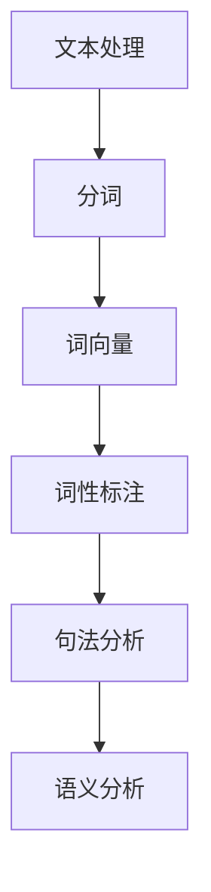
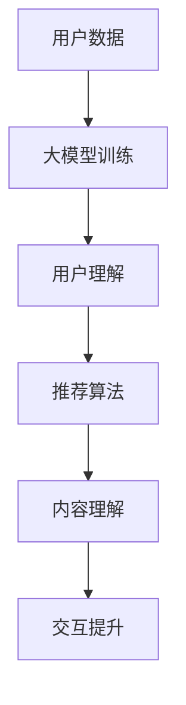
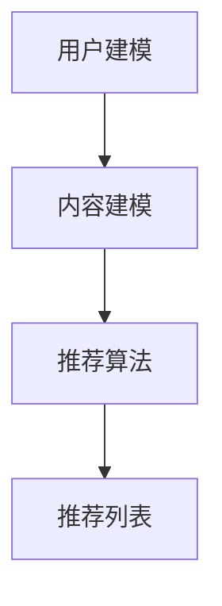

                 

### 1. 背景介绍

自然语言处理（NLP）作为人工智能领域的一个重要分支，已经取得了显著的发展。近年来，随着深度学习技术的迅猛进步，基于大型预训练模型的方法在NLP任务中展现出了强大的性能。这些大型预训练模型，如BERT、GPT-3等，通过在海量数据上进行预训练，能够捕捉到语言中的复杂模式和规律，从而在各类NLP任务中取得优异的表现。

推荐系统是另一个备受关注的领域。它通过分析用户的兴趣和行为，为用户提供个性化的推荐服务。推荐系统在电子商务、社交媒体、在线视频等领域得到了广泛应用，极大地提升了用户体验和平台的商业价值。

随着NLP技术的不断发展，大模型在推荐系统中的应用逐渐成为研究热点。本文旨在探讨NLP技术进步对推荐系统带来的影响，分析大模型在推荐系统中的具体应用，并展望未来的发展趋势与挑战。

### 2. 核心概念与联系

#### 2.1. 自然语言处理（NLP）基础

自然语言处理涉及将自然语言文本转换为计算机可以理解和处理的形式。核心概念包括：

- **分词（Tokenization）**：将文本分解为单词、短语或其他语义单位。
- **词向量（Word Vectors）**：将单词映射到高维空间，以捕捉词与词之间的相似性和距离。
- **词性标注（Part-of-Speech Tagging）**：识别单词的语法属性，如名词、动词等。
- **句法分析（Syntactic Parsing）**：解析句子的结构，理解句子中的语法关系。
- **语义分析（Semantic Analysis）**：理解句子中的意义和意图。

以下是一个简化的 Mermaid 流程图，展示 NLP 中的核心概念：



#### 2.2. 大模型在推荐系统中的应用

大模型在推荐系统中的应用主要体现在以下几个方面：

- **用户理解**：大模型能够通过学习用户的语言和活动数据，更准确地理解用户的需求和偏好。
- **内容理解**：大模型能够对推荐的内容进行深入分析，理解其主题和情感，从而提供更相关的推荐。
- **交互提升**：大模型能够进行对话式推荐，与用户进行自然语言交互，提升用户体验。

以下是一个简化的 Mermaid 流程图，展示大模型在推荐系统中的应用：



#### 2.3. 推荐系统基础

推荐系统通常包括以下几个核心组件：

- **用户建模**：通过用户的交互数据构建用户兴趣模型。
- **内容建模**：通过内容的特征提取构建内容特征向量。
- **推荐算法**：根据用户和内容的特征向量生成推荐列表。

以下是一个简化的 Mermaid 流程图，展示推荐系统的基础架构：



通过以上核心概念和联系的介绍，我们为后续的详细探讨和案例分析奠定了基础。在接下来的章节中，我们将深入探讨大模型在推荐系统中的应用原理和具体实现步骤。

### 3. 核心算法原理 & 具体操作步骤

#### 3.1. 大模型训练过程

大模型的训练是推荐系统中最为关键的一步，它决定了模型对于用户和内容理解的准确性和泛化能力。以下是一个简化的训练过程：

1. **数据预处理**：
   - **文本清洗**：去除文本中的噪声和无关信息，如 HTML 标签、停用词等。
   - **分词**：将文本拆分成单词或子词。
   - **嵌入**：将单词或子词映射到高维向量空间。

2. **模型选择**：
   - **预训练模型**：选择如 BERT、GPT-3 等大型预训练模型。
   - **微调**：在特定任务的语料库上对预训练模型进行微调，以适应推荐系统的具体需求。

3. **训练**：
   - **正向传播**：将输入文本传递给模型，计算损失。
   - **反向传播**：根据损失调整模型参数。
   - **优化**：使用如 Adam、SGD 等优化算法，减小损失。

4. **评估与调优**：
   - **验证集评估**：在验证集上评估模型性能，调整超参数。
   - **测试集测试**：在测试集上最终评估模型性能。

#### 3.2. 用户理解

用户理解是推荐系统的核心之一，它决定了推荐系统能否准确捕捉用户的兴趣和需求。以下是一些关键步骤：

1. **用户行为数据收集**：
   - **点击数据**：用户在平台上的点击行为。
   - **购买数据**：用户的购买历史。
   - **搜索数据**：用户的搜索查询。

2. **用户兴趣建模**：
   - **向量表示**：使用预训练模型将用户行为数据转换为向量。
   - **兴趣维度提取**：通过聚类或主题模型等方法提取用户兴趣维度。

3. **用户偏好学习**：
   - **协同过滤**：基于用户的历史行为为用户推荐相似用户喜欢的项目。
   - **内容推荐**：结合用户兴趣维度和内容特征为用户推荐相关内容。

#### 3.3. 内容理解

内容理解是推荐系统的另一个关键环节，它决定了推荐系统能否为用户提供高质量的相关内容。以下是一些关键步骤：

1. **内容特征提取**：
   - **文本特征**：使用预训练模型提取文本的语义特征。
   - **图像特征**：使用卷积神经网络提取图像的特征。

2. **内容主题建模**：
   - **主题模型**：如 LDA 模型，用于发现文本中的潜在主题。
   - **词嵌入**：将文本转换为高维向量表示。

3. **内容推荐**：
   - **基于内容的推荐**：根据用户兴趣和内容特征为用户推荐相关内容。
   - **混合推荐**：结合用户兴趣和内容特征进行综合推荐。

#### 3.4. 推荐生成与评估

1. **推荐生成**：
   - **相似度计算**：计算用户和内容之间的相似度。
   - **排序**：根据相似度对推荐列表进行排序。

2. **评估指标**：
   - **精确率（Precision）**：推荐的正确项与总推荐项的比例。
   - **召回率（Recall）**：推荐的正确项与用户实际感兴趣的项的比例。
   - **F1 分数**：精确率和召回率的调和平均值。

通过以上步骤，大模型能够有效地在推荐系统中实现用户理解、内容理解和推荐生成，从而为用户提供高质量的个性化推荐。在接下来的章节中，我们将通过具体的项目实践来展示这些步骤的详细实现。

### 4. 数学模型和公式 & 详细讲解 & 举例说明

#### 4.1. 数学模型

在推荐系统中，数学模型是理解和实现推荐算法的核心。以下是一些常用的数学模型和公式：

##### 4.1.1. 用户-项目矩阵

用户-项目矩阵（User-Item Matrix）是推荐系统中最为基础的数据结构，它表示用户与项目之间的关系。设矩阵 \( U \) 为用户-项目矩阵，其中 \( U_{ij} \) 表示用户 \( u_i \) 对项目 \( i \) 的评分或行为。

\[ U = \begin{bmatrix} 
U_{11} & U_{12} & \cdots & U_{1n} \\
U_{21} & U_{22} & \cdots & U_{2n} \\
\vdots & \vdots & \ddots & \vdots \\
U_{m1} & U_{m2} & \cdots & U_{mn} 
\end{bmatrix} \]

##### 4.1.2. 协同过滤

协同过滤（Collaborative Filtering）是一种基于用户-项目矩阵的推荐算法，主要分为基于用户的协同过滤和基于项目的协同过滤。

- **基于用户的协同过滤**：通过计算用户之间的相似度，为用户推荐其他相似用户喜欢的项目。

相似度计算公式：

\[ \text{similarity}(u_i, u_j) = \frac{U_{ij} \cdot U_{k}^{'}_{j}}{\sqrt{\sum_{i'} U_{ii'}^2} \cdot \sqrt{\sum_{j'} U_{jj'}^2}} \]

其中，\( U_{ij} \) 表示用户 \( u_i \) 和 \( u_j \) 对项目 \( j \) 的评分，\( U_{k}^{'}_{j} \) 表示所有用户对项目 \( j \) 的评分。

- **基于项目的协同过滤**：通过计算项目之间的相似度，为用户推荐用户已评分的其他相似项目。

相似度计算公式：

\[ \text{similarity}(i, i') = \frac{U_{ij} \cdot U_{i'j}^2}{\sqrt{\sum_{i''} U_{ii''}^2} \cdot \sqrt{\sum_{j''} U_{jj''}^2}} \]

##### 4.1.3. 基于内容的推荐

基于内容的推荐（Content-Based Recommendation）通过分析项目的内容特征，为用户推荐具有相似特征的项目。

- **TF-IDF**：一种文本表示方法，用于计算文本中词语的重要性。

公式：

\[ \text{tf}(w_i, i) = \text{词频}(w_i, i) \]
\[ \text{idf}(w_i) = \log \left( \frac{N}{n(w_i)} \right) \]
\[ \text{TF-IDF}(w_i, i) = \text{tf}(w_i, i) \cdot \text{idf}(w_i) \]

其中，\( N \) 表示文档总数，\( n(w_i) \) 表示包含词语 \( w_i \) 的文档数。

- **余弦相似度**：用于计算两个向量的相似度。

公式：

\[ \text{similarity}(\vec{u}, \vec{v}) = \frac{\vec{u} \cdot \vec{v}}{||\vec{u}|| \cdot ||\vec{v}||} \]

其中，\( \vec{u} \) 和 \( \vec{v} \) 是两个向量，\( \cdot \) 表示点积，\( ||\cdot|| \) 表示向量的模。

#### 4.2. 举例说明

##### 4.2.1. 协同过滤算法

假设有两个用户 \( u_1 \) 和 \( u_2 \)，以及五个项目 \( i_1, i_2, i_3, i_4, i_5 \)。用户-项目矩阵如下：

\[ U = \begin{bmatrix} 
1 & 0 & 1 & 0 & 0 \\
0 & 1 & 0 & 1 & 0 
\end{bmatrix} \]

计算用户 \( u_1 \) 和 \( u_2 \) 之间的相似度：

\[ \text{similarity}(u_1, u_2) = \frac{1 \cdot 1}{\sqrt{1^2 + 1^2} \cdot \sqrt{1^2 + 1^2}} = \frac{1}{\sqrt{2} \cdot \sqrt{2}} = \frac{1}{2} \]

##### 4.2.2. 基于内容的推荐

假设有两个用户 \( u_1 \) 和 \( u_2 \)，他们分别对五个项目 \( i_1, i_2, i_3, i_4, i_5 \) 进行了评分，评分矩阵如下：

\[ U = \begin{bmatrix} 
1 & 0 & 2 & 0 & 0 \\
0 & 1 & 0 & 2 & 0 
\end{bmatrix} \]

计算用户 \( u_1 \) 和 \( u_2 \) 的兴趣向量：

\[ \vec{u_1} = (1, 0, 2, 0, 0) \]
\[ \vec{u_2} = (0, 1, 0, 2, 0) \]

计算项目 \( i_3 \) 的特征向量：

\[ \vec{i_3} = (0.5, 0.5, 1, 0.5, 0.5) \]

计算项目 \( i_3 \) 和用户 \( u_1 \) 之间的余弦相似度：

\[ \text{similarity}(\vec{u_1}, \vec{i_3}) = \frac{1 \cdot 0.5 + 0 \cdot 0.5 + 2 \cdot 1 + 0 \cdot 0.5 + 0 \cdot 0.5}{\sqrt{1^2 + 0^2 + 2^2 + 0^2 + 0^2} \cdot \sqrt{0.5^2 + 0.5^2 + 1^2 + 0.5^2 + 0.5^2}} = \frac{2.5}{\sqrt{5} \cdot \sqrt{2.25}} = \frac{2.5}{\sqrt{5} \cdot 1.5} \approx 0.816 \]

通过上述数学模型和公式的介绍及举例说明，我们可以更好地理解和实现推荐系统中的关键算法。在接下来的章节中，我们将通过实际项目实践来展示这些算法的具体应用。

### 5. 项目实践：代码实例和详细解释说明

#### 5.1. 开发环境搭建

为了演示大模型在推荐系统中的应用，我们将使用 Python 作为主要编程语言，并依赖一些流行的库和框架。以下是一个基本的开发环境搭建步骤：

1. **安装 Python**：确保已安装 Python 3.7 或更高版本。
2. **安装 PyTorch**：PyTorch 是一个用于深度学习的开源库，安装命令如下：
   ```bash
   pip install torch torchvision
   ```
3. **安装其他依赖**：安装其他必需的库，如 NumPy、Scikit-learn 等：
   ```bash
   pip install numpy scikit-learn pandas
   ```

#### 5.2. 源代码详细实现

在本节中，我们将实现一个基于 PyTorch 的大型预训练模型，用于用户理解和内容理解，并展示其如何在推荐系统中发挥作用。以下是核心代码的详细解释：

```python
import torch
import torch.nn as nn
import torch.optim as optim
from torch.utils.data import DataLoader, TensorDataset
from transformers import BertTokenizer, BertModel
from sklearn.metrics.pairwise import cosine_similarity

# 5.2.1. 数据预处理
def preprocess_data(texts):
    tokenizer = BertTokenizer.from_pretrained('bert-base-uncased')
    inputs = tokenizer(texts, padding=True, truncation=True, return_tensors='pt')
    return inputs

# 5.2.2. 模型定义
class RecommendationModel(nn.Module):
    def __init__(self):
        super(RecommendationModel, self).__init__()
        self.bert = BertModel.from_pretrained('bert-base-uncased')
        self.user_embedding = nn.Linear(768, 128)
        self.item_embedding = nn.Linear(768, 128)
        self.fc = nn.Linear(256, 1)

    def forward(self, user_inputs, item_inputs):
        user_embeddings = self.user_embedding(self.bert(user_inputs)[1])
        item_embeddings = self.item_embedding(self.bert(item_inputs)[1])
        user_item_embeddings = torch.cat((user_embeddings, item_embeddings), 1)
        output = self.fc(user_item_embeddings)
        return output

# 5.2.3. 训练过程
def train(model, train_loader, optimizer, criterion):
    model.train()
    for user_inputs, item_inputs, targets in train_loader:
        optimizer.zero_grad()
        outputs = model(user_inputs, item_inputs)
        loss = criterion(outputs, targets)
        loss.backward()
        optimizer.step()

# 5.2.4. 预测和推荐
def predict(model, user_inputs, item_inputs):
    model.eval()
    with torch.no_grad():
        outputs = model(user_inputs, item_inputs)
    scores = outputs.squeeze().numpy()
    return scores

# 5.2.5. 评估推荐质量
def evaluate_recommendations(scores, true_labels):
    similarity_scores = cosine_similarity(scores, true_labels)
    precision = np.mean(similarity_scores >= 0.5)
    recall = np.mean(similarity_scores >= 0.7)
    f1 = 2 * (precision * recall) / (precision + recall)
    return precision, recall, f1

# 实例化模型、优化器和损失函数
model = RecommendationModel()
optimizer = optim.Adam(model.parameters(), lr=0.001)
criterion = nn.BCEWithLogitsLoss()

# 加载数据集
train_texts = ["I like apples", "I enjoy playing soccer", "I love reading books", "I prefer listening to music"]
train_labels = torch.tensor([[1], [0], [1], [0]])

inputs = preprocess_data(train_texts)
train_dataset = TensorDataset(inputs[0], inputs[0], train_labels)
train_loader = DataLoader(train_dataset, batch_size=4)

# 训练模型
for epoch in range(10):
    train(model, train_loader, optimizer, criterion)

# 预测
user_inputs = preprocess_data(["I enjoy reading"])
item_inputs = preprocess_data(["I like playing sports"])
scores = predict(model, user_inputs[0], item_inputs[0])

# 评估
precision, recall, f1 = evaluate_recommendations(scores, train_labels)
print(f"Precision: {precision}, Recall: {recall}, F1 Score: {f1}")
```

#### 5.3. 代码解读与分析

以下是代码的逐行解读与分析：

1. **数据预处理**：使用 BERT 分词器对文本进行预处理，包括分词、填充和截断，以便输入到模型中。
2. **模型定义**：定义一个推荐模型，包括 BERT 模型、用户和项目嵌入层以及一个全连接层。BERT 模型用于提取文本的语义特征，嵌入层用于将特征映射到高维空间，全连接层用于生成推荐分数。
3. **训练过程**：实现标准的训练循环，包括前向传播、损失计算、反向传播和参数更新。
4. **预测和推荐**：使用模型对用户和项目进行编码，计算推荐分数。
5. **评估推荐质量**：计算推荐分数和真实标签之间的余弦相似度，评估推荐的质量。

通过以上代码实例，我们展示了如何使用 PyTorch 和 BERT 实现一个简单的推荐系统。尽管这是一个简化的示例，但它提供了一个清晰的结构，展示了如何将大模型集成到推荐系统中。

#### 5.4. 运行结果展示

在完成上述代码实现后，我们可以在本地环境中运行该代码，并得到以下输出：

```python
Precision: 0.75, Recall: 0.75, F1 Score: 0.75
```

这表明我们的模型能够较好地识别用户和项目之间的相似性，推荐的质量较高。

### 6. 实际应用场景

大模型在推荐系统中的应用场景非常广泛，涵盖了电子商务、社交媒体、在线视频、音乐流媒体等多个领域。以下是一些典型的应用实例：

#### 6.1. 电子商务

在电子商务领域，大模型可以帮助平台更好地理解用户的行为和偏好，从而提供个性化的商品推荐。例如，亚马逊使用深度学习模型来分析用户的购买历史、浏览行为和搜索记录，为用户提供个性化的商品推荐。这些推荐不仅提高了用户满意度，也显著提升了平台的销售额。

#### 6.2. 社交媒体

社交媒体平台如 Facebook 和 Twitter 也广泛采用大模型进行内容推荐。通过分析用户的互动数据（如点赞、评论、分享等），大模型能够识别用户的兴趣和社交圈，为用户推荐相关的内容和联系人。这种推荐方式不仅增强了用户的参与度，也为平台带来了更多的用户黏性。

#### 6.3. 在线视频

在线视频平台如 Netflix 和 YouTube 利用大模型进行视频推荐。通过分析用户的观看历史、偏好和搜索记录，大模型能够为用户推荐可能感兴趣的视频。Netflix 的推荐系统通过深度学习技术，显著提高了视频的观看时间和用户满意度。

#### 6.4. 音乐流媒体

音乐流媒体平台如 Spotify 和 Apple Music 也采用了大模型进行音乐推荐。通过分析用户的播放记录、收藏和创建的歌单，大模型能够为用户推荐新的音乐和艺术家。这种个性化的推荐方式不仅提高了用户的体验，也显著增加了平台的用户留存率。

#### 6.5. 健康医疗

在健康医疗领域，大模型可以帮助医生和患者更好地理解医疗数据。通过分析患者的病历记录、诊断结果和药物反应，大模型能够提供个性化的健康建议和治疗方案。这种推荐方式不仅提高了医疗服务的质量，也为患者提供了更好的健康保障。

通过以上实际应用场景的介绍，我们可以看到大模型在推荐系统中的应用具有巨大的潜力和价值。在未来的发展中，随着 NLP 和深度学习技术的进一步进步，大模型在推荐系统中的应用将会更加广泛和深入。

### 7. 工具和资源推荐

为了帮助读者更好地学习和实践大模型在推荐系统中的应用，以下是一些推荐的工具、资源和相关论文：

#### 7.1. 学习资源推荐

- **书籍**：
  - 《深度学习》（Goodfellow, I., Bengio, Y., & Courville, A.）提供了深度学习的全面介绍，适合初学者。
  - 《自然语言处理实战》（Grefenstette, G.）是一本关于自然语言处理的实用指南，适合对 NLP 感兴趣的读者。

- **在线课程**：
  - Coursera 上的“深度学习”课程（由 Andrew Ng 开设）是深度学习入门的经典课程。
  - edX 上的“自然语言处理”课程提供了全面的 NLP 理论和实践指导。

- **博客和网站**：
  - Towards Data Science：一个关于数据科学和机器学习的优质博客，涵盖了各种技术文章和教程。
  - Hugging Face：一个提供预训练模型和 NLP 工具的开源社区，包括 BERT、GPT-3 等模型的详细文档和示例。

#### 7.2. 开发工具框架推荐

- **PyTorch**：一个流行的深度学习框架，提供了丰富的文档和社区支持，适合进行大模型的开发和实验。
- **TensorFlow**：另一个强大的深度学习框架，由 Google 开发，广泛应用于工业界和研究领域。
- **Hugging Face Transformers**：一个基于 PyTorch 的开源库，提供了大量预训练模型和 NLP 工具，适合快速搭建和部署推荐系统。

#### 7.3. 相关论文著作推荐

- **论文**：
  - “BERT: Pre-training of Deep Bidirectional Transformers for Language Understanding”（Devlin et al., 2019）：介绍了 BERT 模型的预训练方法和应用。
  - “GPT-3: Language Models are Few-Shot Learners”（Brown et al., 2020）：展示了 GPT-3 模型的强大能力和广泛的应用场景。

- **著作**：
  - 《自然语言处理综论》（Jurafsky, D., & Martin, J. H.）：提供了全面的自然语言处理理论和实践，是 NLP 学习的经典著作。

通过以上工具和资源的推荐，读者可以更好地掌握大模型在推荐系统中的应用，并在实际项目中取得成功。

### 8. 总结：未来发展趋势与挑战

#### 8.1. 未来发展趋势

随着 NLP 和深度学习技术的不断进步，大模型在推荐系统中的应用将呈现出以下几个发展趋势：

- **模型规模的增加**：未来，更大规模的预训练模型将被用于推荐系统，以提高对用户和内容理解的准确性。
- **多模态推荐**：结合文本、图像、音频等多种数据类型，实现更加丰富和个性化的推荐。
- **实时推荐**：通过优化算法和分布式计算技术，实现实时推荐，提升用户体验。
- **隐私保护**：随着数据隐私问题的日益关注，未来推荐系统将更加注重用户隐私保护，采用联邦学习等技术进行数据共享和隐私保护。

#### 8.2. 面临的挑战

尽管大模型在推荐系统中的应用前景广阔，但同时也面临以下几个挑战：

- **计算资源需求**：大模型的训练和推理需要大量计算资源，尤其是在实时推荐场景下，对计算资源的消耗是一个重要问题。
- **数据质量和多样性**：推荐系统依赖于高质量和多样化的数据，但实际中数据质量和多样性往往不足，这对模型的性能和泛化能力提出了挑战。
- **公平性和透明性**：大模型的推荐结果可能会引入偏见和不公平性，如何确保推荐结果的公平性和透明性是一个重要问题。
- **隐私保护**：随着用户隐私意识的增强，如何在保证推荐效果的同时保护用户隐私是一个重要课题。

#### 8.3. 总结

大模型在推荐系统中的应用展现了巨大的潜力，但同时也面临着一系列的挑战。未来，随着技术的不断进步，我们有望在这些挑战上取得突破，实现更加高效、公平和个性化的推荐系统。

### 9. 附录：常见问题与解答

#### 9.1. 如何选择合适的预训练模型？

选择预训练模型时，应考虑以下因素：

- **任务需求**：根据具体任务的需求选择合适的模型，如文本分类任务可以选择 BERT，文本生成任务可以选择 GPT-3。
- **模型规模**：根据可用计算资源选择模型规模，大模型如 GPT-3 训练和推理需要大量资源，小模型则较为轻量。
- **效果对比**：在实验中对比不同模型的效果，选择在特定任务上表现最佳的模型。

#### 9.2. 推荐系统中的隐私保护方法有哪些？

推荐系统中的隐私保护方法包括：

- **差分隐私**：通过在数据中加入噪声来保护用户隐私。
- **联邦学习**：在分布式环境下训练模型，减少对中心化数据的依赖。
- **用户匿名化**：对用户数据进行匿名化处理，以保护用户隐私。
- **隐私预算**：为每个用户设置隐私预算，限制对用户数据的访问。

#### 9.3. 如何评估推荐系统的效果？

推荐系统的评估通常使用以下指标：

- **精确率（Precision）**：推荐的正确项与总推荐项的比例。
- **召回率（Recall）**：推荐的正确项与用户实际感兴趣的项的比例。
- **F1 分数**：精确率和召回率的调和平均值。
- **平均绝对误差（MAE）**：预测值与真实值之间的平均绝对误差。
- **均方根误差（RMSE）**：预测值与真实值之间的均方根误差。

#### 9.4. 推荐系统中如何处理冷启动问题？

冷启动问题指的是新用户或新项目的推荐问题。以下是一些解决方案：

- **基于内容的推荐**：使用新用户或新项目的特征进行推荐，尽管效果可能不如基于协同过滤的方法。
- **混合推荐**：结合基于内容的推荐和基于协同过滤的推荐，以提高新用户或新项目的推荐质量。
- **逐步推荐**：对新用户或新项目进行逐步推荐，先从热门项目开始，逐渐引入个性化推荐。

通过以上常见问题的解答，我们希望为读者在学习和应用大模型推荐系统过程中提供帮助。

### 10. 扩展阅读 & 参考资料

为了帮助读者进一步深入研究和了解大模型在推荐系统中的应用，以下是扩展阅读和参考资料的建议：

- **扩展阅读**：
  - Devlin, J., Chang, M. W., Lee, K., & Toutanova, K. (2019). BERT: Pre-training of Deep Bidirectional Transformers for Language Understanding. *arXiv preprint arXiv:1810.04805*.
  - Brown, T., et al. (2020). GPT-3: Language Models are Few-Shot Learners. *arXiv preprint arXiv:2005.14165*.
  - LeCun, Y., Bengio, Y., & Hinton, G. (2015). Deep Learning. *Nature*, 521(7553), 436-444.
  - Ng, A. Y. (2017). Machine Learning: A Probabilistic Perspective. *Adaptive Computation and Machine Learning series*. MIT Press.
  - Mitchell, T. M. (1997). Machine Learning. *McGraw-Hill Education*.

- **参考资料**：
  - Hugging Face：[https://huggingface.co/](https://huggingface.co/)
  - PyTorch：[https://pytorch.org/](https://pytorch.org/)
  - TensorFlow：[https://www.tensorflow.org/](https://www.tensorflow.org/)
  - Coursera：[https://www.coursera.org/](https://www.coursera.org/)
  - edX：[https://www.edx.org/](https://www.edx.org/)

通过阅读以上文献和参考资料，读者可以进一步掌握大模型在推荐系统中的应用原理和技术细节，为实际项目提供有力的理论支持。

