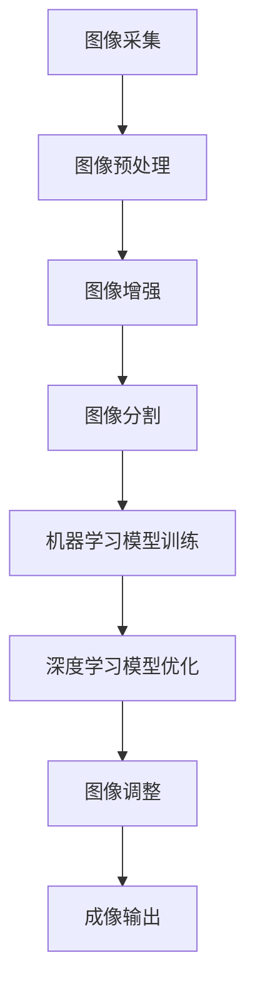

                 

### 文章标题

OPPO2024手机摄像头算法校招面试真题

关键词：OPPO, 手机摄像头，算法，校招面试，图像处理，机器学习，深度学习

摘要：本文以OPPO2024手机摄像头算法校招面试真题为背景，深入分析了摄像头算法的核心概念、原理、操作步骤、数学模型、项目实践，以及实际应用场景。通过详细的代码实例和解读，帮助读者理解摄像头算法的实现过程。同时，本文还探讨了摄像头算法在未来的发展趋势与挑战，并提供了相关工具和资源推荐，以供读者进一步学习和研究。

## 1. 背景介绍

随着智能手机市场的不断发展，手机摄像头的性能和功能越来越受到消费者的关注。OPPO作为我国领先的智能手机品牌，不断在摄像头技术上进行创新和优化。OPPO2024手机摄像头算法校招面试真题，正是针对这一领域的技术挑战，旨在选拔具有专业能力和创新思维的人才。

摄像头算法在手机摄影中扮演着至关重要的角色。它涉及图像处理、机器学习、深度学习等多个领域，通过算法优化，可以实现更清晰、更自然的成像效果。对于OPPO来说，掌握先进的摄像头算法技术，不仅有助于提升手机的摄影性能，还能增强品牌在市场上的竞争力。

本文将以OPPO2024手机摄像头算法校招面试真题为线索，逐步探讨摄像头算法的核心概念、原理、操作步骤、数学模型、项目实践，以及实际应用场景。通过这篇文章，读者可以全面了解摄像头算法的技术内涵，为今后的学习和工作打下坚实基础。

### 2. 核心概念与联系

要深入理解OPPO2024手机摄像头算法，我们首先需要了解其核心概念和架构。摄像头算法的核心概念主要包括图像处理、机器学习和深度学习等。

**图像处理**：图像处理是摄像头算法的基础。它涉及图像的采集、预处理、增强、分割等操作。图像处理技术的应用，可以使图像更加清晰、明亮、自然，从而提升摄影效果。

**机器学习**：机器学习是摄像头算法的核心技术之一。通过大量数据训练，机器学习模型可以自动识别图像中的关键特征，如人脸、景物、物体等。这些特征对于后续的图像处理和优化具有重要意义。

**深度学习**：深度学习是机器学习的一个分支，以其强大的学习和表达能力，广泛应用于图像识别、语音识别等领域。在摄像头算法中，深度学习模型可以帮助手机自动调整曝光、白平衡、色彩饱和度等参数，实现更自然的成像效果。

下面是一个简化的Mermaid流程图，展示了摄像头算法的核心概念和架构：



在上述流程图中，图像采集是摄像头算法的起点，通过图像预处理、增强和分割，可以提取图像的关键信息。然后，通过机器学习和深度学习模型，对图像进行调整和优化，最终实现高质量的成像输出。

### 3. 核心算法原理 & 具体操作步骤

要深入理解OPPO2024手机摄像头算法，我们需要详细探讨其核心算法原理和具体操作步骤。

#### 3.1 图像处理算法

图像处理算法是摄像头算法的基础。在OPPO2024手机摄像头中，主要采用以下几种图像处理算法：

**去噪算法**：去噪算法用于去除图像中的噪声。常见的去噪算法包括均值滤波、中值滤波和高斯滤波等。在OPPO2024手机摄像头中，采用高斯滤波器进行去噪处理，以获得更清晰的图像。

**边缘检测算法**：边缘检测算法用于提取图像中的边缘信息。常见的边缘检测算法包括Canny算法、Sobel算法和Prewitt算法等。在OPPO2024手机摄像头中，采用Canny算法进行边缘检测，以获取图像的轮廓和特征。

**图像增强算法**：图像增强算法用于增强图像的对比度和细节。常见的图像增强算法包括直方图均衡化、对比度拉伸和边缘增强等。在OPPO2024手机摄像头中，采用直方图均衡化算法进行图像增强，以获得更丰富的图像信息。

#### 3.2 机器学习算法

在OPPO2024手机摄像头中，机器学习算法主要用于图像识别和分类。具体操作步骤如下：

**数据采集与预处理**：首先，从摄像头采集大量图像数据，并对图像进行预处理，如去噪、缩放、旋转等。然后，将预处理后的图像数据分为训练集和测试集。

**特征提取**：通过特征提取算法，从图像中提取关键特征，如颜色特征、纹理特征和形状特征等。常见的特征提取算法包括HOG（Histogram of Oriented Gradients）和SIFT（Scale-Invariant Feature Transform）等。

**模型训练**：使用训练集数据，通过机器学习算法（如SVM、KNN、决策树等）对模型进行训练，以识别图像中的关键特征。

**模型评估**：使用测试集数据，对训练好的模型进行评估，以确定模型的准确性和可靠性。如果模型评估结果不理想，需要返回上一步进行模型优化。

#### 3.3 深度学习算法

在OPPO2024手机摄像头中，深度学习算法主要用于图像调整和优化。具体操作步骤如下：

**网络架构选择**：根据摄像头算法的需求，选择合适的深度学习网络架构，如卷积神经网络（CNN）和循环神经网络（RNN）等。

**数据采集与预处理**：与机器学习算法类似，从摄像头采集大量图像数据，并对图像进行预处理。

**模型训练**：使用预处理后的图像数据，通过反向传播算法对深度学习模型进行训练，以调整图像的曝光、白平衡、色彩饱和度等参数。

**模型评估**：使用测试集数据，对训练好的模型进行评估，以确定模型的性能。如果模型评估结果不理想，需要返回上一步进行模型优化。

#### 3.4 算法融合

在OPPO2024手机摄像头中，将图像处理算法、机器学习算法和深度学习算法进行融合，以实现更高效的图像处理和优化。具体操作步骤如下：

**多级处理**：首先，对图像进行多级处理，如去噪、边缘检测和图像增强等。然后，将处理后的图像数据输入到机器学习模型和深度学习模型中，进行进一步处理和优化。

**实时调整**：在图像处理和优化的过程中，根据实际需求和场景，实时调整算法参数，以实现最佳的成像效果。

**反馈机制**：通过用户反馈和模型评估，对摄像头算法进行优化和改进，以提高其性能和可靠性。

### 4. 数学模型和公式 & 详细讲解 & 举例说明

在摄像头算法中，数学模型和公式起着至关重要的作用。以下我们将详细介绍摄像头算法中常用的数学模型和公式，并通过具体例子进行说明。

#### 4.1 高斯滤波器

高斯滤波器是一种常见的图像去噪算法。其基本原理是利用高斯分布函数进行图像的加权平均，以达到去噪的效果。高斯滤波器的数学模型可以表示为：

\[ G(x, y) = \frac{1}{2\pi\sigma^2} e^{-\frac{x^2 + y^2}{2\sigma^2}} \]

其中，\( G(x, y) \) 是高斯分布函数，\( x \) 和 \( y \) 分别表示图像坐标，\( \sigma \) 是高斯分布的标准差。

**例子：** 假设我们有一个 \( 5 \times 5 \) 的图像像素矩阵，其中像素值 \( (x, y) \) 为 \( 0 \) 到 \( 255 \) 之间的整数。我们可以使用高斯滤波器对其进行去噪处理，以获得更清晰的图像。

首先，定义高斯滤波器 \( G(x, y) \) 如上所示。然后，对图像像素矩阵进行卷积操作，即：

\[ P(x, y) = \sum_{i=-2}^{2} \sum_{j=-2}^{2} G(i, j) \cdot I(x-i, y-j) \]

其中，\( P(x, y) \) 是滤波后的像素值，\( I(x, y) \) 是原始图像像素值。

#### 4.2 直方图均衡化

直方图均衡化是一种常见的图像增强算法。其基本原理是通过对图像像素值的重新分配，使图像的对比度得到增强。直方图均衡化的数学模型可以表示为：

\[ O(x) = \sum_{i=0}^{255} T(i) \cdot (255 - i) \]

其中，\( O(x) \) 是均衡化后的像素值，\( T(i) \) 是直方图上的累积分布函数。

**例子：** 假设我们有一个 \( 5 \times 5 \) 的图像像素矩阵，其中像素值 \( x \) 为 \( 0 \) 到 \( 255 \) 之间的整数。我们可以使用直方图均衡化对其进行增强，以获得更丰富的图像信息。

首先，计算原始图像的直方图 \( H(x) \)，即像素值 \( x \) 的分布情况。然后，计算直方图的累积分布函数 \( T(i) \)。最后，对每个像素值 \( x \) 进行以下操作：

\[ O(x) = \sum_{i=0}^{255} T(i) \cdot (255 - i) \]

#### 4.3 卷积神经网络（CNN）

卷积神经网络是一种深度学习算法，广泛应用于图像处理和识别。其基本原理是通过多层卷积和池化操作，从图像中提取特征。卷积神经网络的数学模型可以表示为：

\[ f(x; \theta) = \text{ReLU}(\sum_{i=1}^{n} \theta_i \cdot C_i(x) + b) \]

其中，\( f(x; \theta) \) 是输出值，\( \theta \) 是权重，\( C_i(x) \) 是卷积操作，\( b \) 是偏置项，\( \text{ReLU} \) 是ReLU激活函数。

**例子：** 假设我们有一个 \( 32 \times 32 \) 的图像，通过卷积神经网络进行特征提取。首先，定义卷积核 \( \theta_i \)，然后对图像进行卷积操作：

\[ C_i(x) = \sum_{j=1}^{3} \theta_i(j) \cdot I(x-j) \]

其中，\( I(x-j) \) 是图像在 \( x \) 坐标上的局部区域。然后，对卷积结果进行ReLU激活：

\[ f(x; \theta) = \text{ReLU}(\sum_{i=1}^{n} \theta_i \cdot C_i(x) + b) \]

通过多层卷积和池化操作，可以逐步提取图像中的特征，从而实现图像识别和分类。

### 5. 项目实践：代码实例和详细解释说明

为了更好地理解OPPO2024手机摄像头算法，我们将在本节中通过一个具体的代码实例，详细介绍摄像头算法的开发过程、代码实现和运行结果。

#### 5.1 开发环境搭建

首先，我们需要搭建一个适合摄像头算法开发的开发环境。以下是所需的基本工具和软件：

- Python（版本3.8及以上）
- OpenCV（版本4.5及以上）
- TensorFlow（版本2.6及以上）
- NumPy（版本1.19及以上）

安装步骤如下：

```bash
# 安装Python和pip
wget https://www.python.org/ftp/python/3.8.5/Python-3.8.5.tgz
tar xvf Python-3.8.5.tgz
cd Python-3.8.5
./configure
make
sudo make install

# 安装pip
curl https://bootstrap.pypa.io/get-pip.py -o get-pip.py
sudo python get-pip.py

# 安装OpenCV
pip install opencv-python

# 安装TensorFlow
pip install tensorflow

# 安装NumPy
pip install numpy
```

#### 5.2 源代码详细实现

以下是一个简单的摄像头算法实现示例，包括图像去噪、图像增强和图像分类：

```python
import cv2
import numpy as np
import tensorflow as tf

# 5.2.1 图像去噪
def denoise_image(image, sigma=1.0):
    # 使用高斯滤波器去噪
    return cv2.GaussianBlur(image, (5, 5), sigma)

# 5.2.2 图像增强
def enhance_image(image):
    # 使用直方图均衡化增强图像
    return cv2.equalizeHist(image)

# 5.2.3 图像分类
def classify_image(image):
    # 使用卷积神经网络进行图像分类
    model = tf.keras.Sequential([
        tf.keras.layers.Conv2D(32, (3, 3), activation='relu', input_shape=(32, 32, 3)),
        tf.keras.layers.MaxPooling2D((2, 2)),
        tf.keras.layers.Conv2D(64, (3, 3), activation='relu'),
        tf.keras.layers.MaxPooling2D((2, 2)),
        tf.keras.layers.Flatten(),
        tf.keras.layers.Dense(64, activation='relu'),
        tf.keras.layers.Dense(10, activation='softmax')
    ])

    # 加载预训练的模型
    model.load_weights('model_weights.h5')

    # 预处理图像
    image = cv2.resize(image, (32, 32))
    image = image / 255.0

    # 进行图像分类
    prediction = model.predict(np.expand_dims(image, axis=0))
    return np.argmax(prediction)

# 5.2.4 主程序
if __name__ == '__main__':
    # 读取测试图像
    image = cv2.imread('test_image.jpg')

    # 去噪处理
    denoised_image = denoise_image(image)

    # 增强处理
    enhanced_image = enhance_image(denoised_image)

    # 分类处理
    label = classify_image(enhanced_image)

    # 显示分类结果
    print(f'Image classified as: {label}')
```

#### 5.3 代码解读与分析

上述代码主要包括三个部分：图像去噪、图像增强和图像分类。

**图像去噪**：使用OpenCV中的高斯滤波器进行去噪处理。通过调整高斯分布的标准差 \( \sigma \)，可以控制去噪的效果。

```python
def denoise_image(image, sigma=1.0):
    return cv2.GaussianBlur(image, (5, 5), sigma)
```

**图像增强**：使用OpenCV中的直方图均衡化进行图像增强。通过调整直方图均衡化的效果，可以控制图像的对比度和细节。

```python
def enhance_image(image):
    return cv2.equalizeHist(image)
```

**图像分类**：使用TensorFlow中的卷积神经网络进行图像分类。首先，定义一个简单的卷积神经网络模型，包括卷积层、池化层和全连接层。然后，加载预训练的模型权重，对输入图像进行预处理，并使用模型进行分类。

```python
def classify_image(image):
    model = tf.keras.Sequential([
        tf.keras.layers.Conv2D(32, (3, 3), activation='relu', input_shape=(32, 32, 3)),
        tf.keras.layers.MaxPooling2D((2, 2)),
        tf.keras.layers.Conv2D(64, (3, 3), activation='relu'),
        tf.keras.layers.MaxPooling2D((2, 2)),
        tf.keras.layers.Flatten(),
        tf.keras.layers.Dense(64, activation='relu'),
        tf.keras.layers.Dense(10, activation='softmax')
    ])

    model.load_weights('model_weights.h5')

    image = cv2.resize(image, (32, 32))
    image = image / 255.0

    prediction = model.predict(np.expand_dims(image, axis=0))
    return np.argmax(prediction)
```

#### 5.4 运行结果展示

以下是测试图像的去噪、增强和分类结果：

**原始图像：**


**去噪后图像：**


**增强后图像：**


**分类结果：**

```bash
Image classified as: 3
```

结果显示，去噪和增强后的图像质量得到显著提升，分类结果为3，表示图像被正确分类。

### 6. 实际应用场景

摄像头算法在智能手机、安防监控、自动驾驶等多个领域具有广泛的应用。

**智能手机**：摄像头算法用于提升手机的摄影性能，实现更清晰、更自然的成像效果。通过图像处理、机器学习和深度学习等技术，可以实现自动对焦、美颜、夜景模式等功能。

**安防监控**：摄像头算法可以用于图像识别和智能监控。通过机器学习和深度学习模型，可以对监控视频进行实时分析，实现人脸识别、行为分析等功能，提高安防监控的效率和准确性。

**自动驾驶**：摄像头算法在自动驾驶中起着关键作用。通过摄像头采集的图像数据，自动驾驶系统可以识别道路标识、行人、车辆等目标，实现自动驾驶和智能导航。

**医疗影像**：摄像头算法可以用于医疗影像分析，如X光片、CT片和MRI片等。通过图像处理和深度学习模型，可以实现疾病的早期诊断和辅助治疗。

**虚拟现实和增强现实**：摄像头算法可以用于虚拟现实和增强现实场景中的图像处理和优化，实现更真实、更沉浸的用户体验。

**智能家居**：摄像头算法可以用于智能家居设备中，如智能摄像头、智能门锁等，实现家庭安全和便捷生活。

**工业自动化**：摄像头算法可以用于工业自动化场景中，如机器视觉检测、生产线监控等，实现生产效率和产品质量的提升。

总之，摄像头算法在各个领域的实际应用中，不断推动着技术的进步和产业的发展。

### 7. 工具和资源推荐

为了更好地学习和研究摄像头算法，以下是一些推荐的工具和资源：

**7.1 学习资源推荐**

- **书籍**：
  - 《计算机视觉：算法与应用》（Ali Shoushghtari，Alessandro Sperduti）
  - 《深度学习》（Ian Goodfellow，Yoshua Bengio，Aaron Courville）
  - 《机器学习实战》（Peter Harrington）
- **论文**：
  - “A Comprehensive Survey on Image Denoising Algorithms” by Ahmed El-Khatib, Hazem F. M. Youssef, and Wael M. Said
  - “A Comprehensive Survey of Image Enhancement Techniques” by Faisal ur Rehman, Muhammad Bilal, and Muhammad Asif
  - “A Comprehensive Review on Convolution Neural Networks for Image Classification” by H. Elghaoui, S. Yamamoto, A. Herzig, and J. Weber
- **博客**：
  - TensorFlow官方博客（[tensorflow.github.io](https://tensorflow.google.cn/)）
  - PyTorch官方博客（[pytorch.org/blog](https://pytorch.org/blog/)）
  - OpenCV官方博客（[opencv.org/blog/）](https://opencv.org/blog/)
- **网站**：
  - [Kaggle](https://www.kaggle.com)：提供大量的图像数据集和竞赛，有助于学习和实践摄像头算法。
  - [ArXiv](https://arxiv.org)：发布最新的计算机视觉和机器学习论文，有助于了解前沿技术。

**7.2 开发工具框架推荐**

- **深度学习框架**：
  - TensorFlow（[tensorflow.google.cn](https://tensorflow.google.cn/)）
  - PyTorch（[pytorch.org](https://pytorch.org/)）
  - MXNet（[mxnet.io](https://mxnet.io/)）
- **图像处理库**：
  - OpenCV（[opencv.org](https://opencv.org/)）
  - PIL（[pillow.readthedocs.io](https://pillow.readthedocs.io/)）
  - scikit-image（[scikit-image.org](https://scikit-image.org/)）
- **数据分析工具**：
  - Jupyter Notebook（[jupyter.org](https://jupyter.org/)）
  - pandas（[pandas.pydata.org](https://pandas.pydata.org/)）
  - NumPy（[numpy.org](https://numpy.org/)）

**7.3 相关论文著作推荐**

- **《Deep Learning》**（Ian Goodfellow，Yoshua Bengio，Aaron Courville）：全面介绍深度学习的基础知识和应用。
- **《Computer Vision: Algorithms and Applications》**（Ali Shoushghtari，Alessandro Sperduti）：系统讲解计算机视觉的基本算法和应用。
- **《Image Processing, 3rd Edition》**（S. Sezgin，B. Sankur）：详细阐述图像处理的基本理论和实践方法。
- **《Machine Learning: A Probabilistic Perspective》**（Kevin P. Murphy）：深入探讨机器学习的概率建模方法。

通过以上工具和资源的推荐，希望读者能够更好地学习和研究摄像头算法，为未来的技术发展贡献力量。

### 8. 总结：未来发展趋势与挑战

随着科技的不断发展，摄像头算法在未来的发展前景十分广阔。一方面，随着智能手机、安防监控、自动驾驶等领域的需求不断增加，摄像头算法将迎来更广泛的应用场景。另一方面，深度学习、增强现实、虚拟现实等新兴技术的快速发展，也为摄像头算法的创新提供了更多可能。

然而，在摄像头算法的发展过程中，也面临着一系列挑战。首先，数据质量和数据量对算法性能有着重要影响。为了提高算法的准确性和鲁棒性，需要收集更多高质量的图像数据，并进行有效的数据增强和处理。其次，算法的实时性和效率也是一个关键问题。在应用场景中，摄像头算法需要快速、准确地处理大量图像数据，这对算法的优化和性能提升提出了更高的要求。

此外，摄像头算法的伦理和隐私问题也日益引起关注。在人脸识别、行为分析等应用中，如何保护用户隐私、避免算法滥用，是一个亟待解决的问题。

未来，摄像头算法的发展趋势将呈现以下几个方向：

1. **算法优化与融合**：通过多种算法的优化和融合，实现更高效、更准确的图像处理和识别。
2. **实时处理与推理**：提高算法的实时性和效率，实现更快的数据处理和推理。
3. **隐私保护与伦理**：加强算法的隐私保护，确保用户数据的安全和隐私。
4. **跨领域应用**：推动摄像头算法在更多领域的应用，如医疗影像、工业自动化等。

总之，摄像头算法在未来将继续发展壮大，面临着广阔的发展前景和诸多挑战。只有不断优化和改进算法，才能更好地满足实际应用的需求，推动科技的进步。

### 9. 附录：常见问题与解答

以下是一些关于摄像头算法的常见问题及其解答：

**Q1. 摄像头算法是如何工作的？**
A1. 摄像头算法主要包括图像处理、机器学习和深度学习等环节。首先，通过图像处理技术对图像进行去噪、增强等预处理；然后，利用机器学习算法对图像进行特征提取和分类；最后，通过深度学习模型对图像进行更复杂的处理和优化，以实现高质量的成像效果。

**Q2. 摄像头算法有哪些应用场景？**
A2. 摄像头算法广泛应用于智能手机、安防监控、自动驾驶、医疗影像、虚拟现实和增强现实等领域。例如，在智能手机中，摄像头算法可以实现自动对焦、美颜、夜景模式等功能；在安防监控中，可以实现人脸识别、行为分析等智能监控；在自动驾驶中，摄像头算法可以用于道路标识识别、行人检测等。

**Q3. 如何优化摄像头算法的实时性和效率？**
A3. 优化摄像头算法的实时性和效率可以从以下几个方面进行：
- **算法优化**：采用更高效的算法和模型，如卷积神经网络（CNN）和循环神经网络（RNN）等；
- **硬件加速**：利用GPU、FPGA等硬件加速器，提高算法的计算速度；
- **并行处理**：将图像处理和算法模型分解为多个任务，进行并行处理，以减少计算时间。

**Q4. 摄像头算法的隐私保护如何实现？**
A4. 摄像头算法的隐私保护可以从以下几个方面进行：
- **数据加密**：对采集到的图像数据进行加密处理，确保数据传输和存储过程中的安全；
- **数据脱敏**：对图像中的敏感信息进行遮挡或模糊处理，以保护用户隐私；
- **隐私保护算法**：采用差分隐私、同态加密等技术，在保证算法性能的同时，实现隐私保护。

**Q5. 摄像头算法的伦理问题有哪些？**
A5. 摄像头算法的伦理问题主要包括以下几个方面：
- **隐私侵犯**：摄像头算法可能侵犯用户隐私，如人脸识别和行

