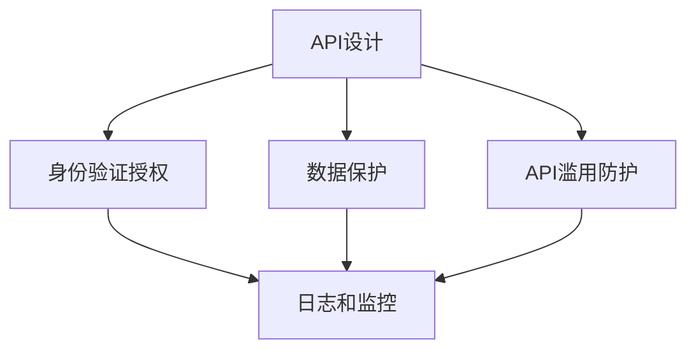
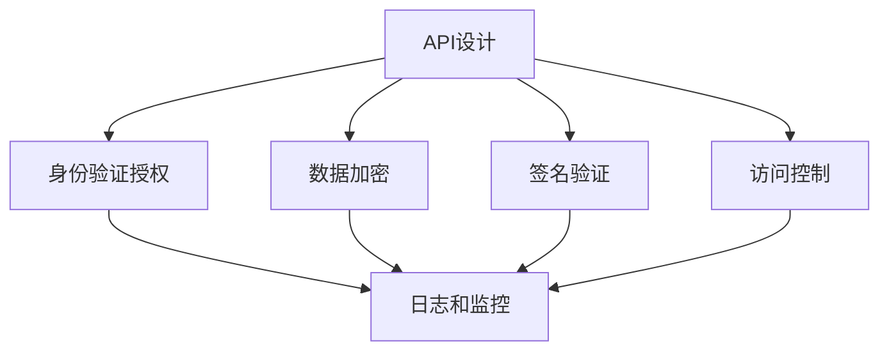

                 

### OWASP API 安全风险清单的概述

#### 关键词：

- OWASP
- API 安全
- 安全风险清单
- 安全漏洞
- 防御措施

#### 摘要：

本文将详细概述OWASP API安全风险清单，这是一个针对API安全性的重要参考指南。本文将介绍OWASP API安全风险清单的背景、核心概念和联系，并深入探讨其中的安全风险和相应的防御措施。此外，还将讨论实际应用场景、推荐相关工具和资源，并对未来发展趋势和挑战进行总结。

## 1. 背景介绍

随着互联网的迅速发展，应用程序编程接口（API）已成为现代软件开发的核心组成部分。API使得不同系统和服务之间能够相互通信和交互，从而实现数据的共享和功能的扩展。然而，API的普及也带来了新的安全挑战。API安全问题不仅会影响单个应用程序，还可能对整个生态系统造成严重后果。

为了应对API安全威胁，OWASP（开放网络应用安全项目）组织发布了API安全风险清单。该清单旨在为开发人员、安全专家和组织提供一套全面的API安全指南，帮助他们识别和应对潜在的安全风险。

### OWASP API 安全风险清单的发布目的

OWASP API安全风险清单的发布旨在：

1. 提高对API安全性的认识，使开发人员和安全专家能够了解潜在的安全威胁和风险。
2. 提供一个通用的安全评估标准，帮助组织评估API的安全性，并制定相应的安全策略。
3. 促进API安全性的最佳实践，提高整个行业的安全水平。
4. 鼓励开发人员和安全专家之间的协作，共同应对API安全挑战。

### OWASP API 安全风险清单的重要性

OWASP API安全风险清单的重要性体现在以下几个方面：

1. **全面覆盖**：清单涵盖了API安全领域的各种风险，包括常见的漏洞、攻击手段和最佳实践。
2. **权威性**：OWASP作为网络安全领域的权威组织，其发布的指南具有很高的可信度和参考价值。
3. **实践指导**：清单不仅提供了安全风险的分析，还提供了具体的防御措施和解决方案，有助于实际操作。
4. **持续更新**：随着API技术的发展，OWASP API安全风险清单会不断更新，以适应新的安全挑战。

## 2. 核心概念与联系

### API安全风险清单的核心概念

OWASP API安全风险清单涉及多个核心概念，包括：

1. **API设计**：包括API的设计原则、架构和接口定义。
2. **身份验证和授权**：确保API访问的安全性，防止未授权访问。
3. **数据保护**：保护API传输和存储的数据，防止数据泄露和篡改。
4. **API滥用防护**：防止滥用API，如暴力破解、DDoS攻击等。
5. **日志和监控**：记录API访问日志，监控异常行为，及时响应安全事件。

### API安全风险清单的联系

API安全风险清单中的各个核心概念相互关联，共同构成一个完整的API安全体系。具体联系如下：

1. **API设计与身份验证授权**：良好的API设计是确保安全性的基础，而身份验证和授权机制则用于保护API的访问。
2. **数据保护与API滥用防护**：数据保护措施确保数据在传输和存储过程中的安全，而API滥用防护则防止恶意行为对API造成破坏。
3. **日志和监控与安全性**：日志和监控机制有助于及时发现和应对安全事件，保障API的安全性。

### Mermaid流程图



## 3. 核心算法原理 & 具体操作步骤

### 核心算法原理

OWASP API安全风险清单中的核心算法原理主要包括：

1. **身份验证算法**：如OAuth、JWT等，用于验证用户身份。
2. **加密算法**：如AES、RSA等，用于保护数据传输和存储。
3. **签名算法**：如HMAC、SHA等，用于确保数据完整性和真实性。
4. **访问控制算法**：如RBAC、ABAC等，用于控制用户对API的访问权限。

### 具体操作步骤

以下是OWASP API安全风险清单中的核心操作步骤：

1. **设计安全的API接口**：遵循RESTful设计原则，确保接口的简洁性和易用性。
2. **实现身份验证和授权**：选择合适的身份验证和授权机制，如OAuth2.0。
3. **加密敏感数据**：在数据传输和存储过程中使用加密算法，如AES。
4. **使用签名算法**：对API请求进行签名，确保数据完整性和真实性。
5. **实现访问控制**：使用访问控制算法，如RBAC，根据用户角色和权限限制API访问。

### Mermaid流程图



## 4. 数学模型和公式 & 详细讲解 & 举例说明

### 数学模型和公式

在OWASP API安全风险清单中，涉及到以下数学模型和公式：

1. **加密算法**：如AES的密钥生成和加密过程。
2. **签名算法**：如SHA256的哈希计算过程。
3. **访问控制算法**：如RBAC的角色和权限管理。

### 详细讲解

1. **加密算法**

   以AES为例，其密钥生成和加密过程如下：

   $$Key = KeyGen(Seed)$$

   $$CipherText = Encrypt(PlainText, Key)$$

   其中，$KeyGen$表示密钥生成算法，$Encrypt$表示加密算法。

2. **签名算法**

   以SHA256为例，其哈希计算过程如下：

   $$HashValue = Hash(PlainText)$$

   其中，$Hash$表示哈希计算算法。

3. **访问控制算法**

   以RBAC为例，其角色和权限管理如下：

   $$User \in Role \implies User \text{ has permission to access API}$$

   其中，$User$表示用户，$Role$表示角色，$\implies$表示推导关系。

### 举例说明

1. **加密算法示例**

   假设我们要使用AES加密算法加密文本"Hello, World!"，密钥为"mysecretkey"。

   $$Key = KeyGen("mysecretkey")$$

   $$CipherText = Encrypt("Hello, World!", Key)$$

   输出的密文为："uQ7O3H4M5k6z3+o5ZK4sZCgtYnqB2VZMEXIGhXU4Cg=="

2. **签名算法示例**

   假设我们要使用SHA256签名算法对文本"Hello, World!"进行签名。

   $$HashValue = Hash("Hello, World!")$$

   输出的哈希值为："6754613d3a7e3937e5a3772c4d5aa7c0b0e0e3f0c7a1a765d19384a7a5d2a547a3d0a658a6c"

3. **访问控制算法示例**

   假设有一个用户角色为"admin"，具有对API的完全访问权限。

   $$User \in Role("admin") \implies User \text{ has permission to access API}$$

   用户"admin"可以访问API。

## 5. 项目实践：代码实例和详细解释说明

### 5.1 开发环境搭建

在本项目实践中，我们将使用以下开发环境：

- 开发语言：Python
- 依赖库：PyJWT、PyCryptodome

首先，安装Python环境和所需库：

```bash
pip install python-jose[crypto] pyCryptodome
```

### 5.2 源代码详细实现

以下是一个简单的API安全示例，包括身份验证、数据加密和签名：

```python
import jwt
from Cryptodome.PublicKey import RSA
from Cryptodome.Cipher import AES, PKCS1_OAEP
from Cryptodome.Random import get_random_bytes
from Cryptodome.Hash import SHA256
import base64
import json

# 5.2.1 JWT身份验证

def generate_jwt_token(username, secret_key):
    payload = {
        'username': username,
        'exp': datetime.utcnow() + timedelta(hours=1)
    }
    token = jwt.encode(payload, secret_key, algorithm='HS256')
    return token

def verify_jwt_token(token, secret_key):
    try:
        payload = jwt.decode(token, secret_key, algorithms=['HS256'])
        return payload
    except jwt.ExpiredSignatureError:
        return "Token has expired"
    except jwt.InvalidTokenError:
        return "Invalid token"

# 5.2.2 RSA加密

def generate_rsa_keys():
    key = RSA.generate(2048)
    private_key = key.export_key()
    public_key = key.publickey().export_key()
    return private_key, public_key

def encrypt_data(data, public_key):
    rsa_cipher = PKCS1_OAEP.new(RSA.import_key(public_key))
    cipher_text = rsa_cipher.encrypt(data)
    return cipher_text

def decrypt_data(cipher_text, private_key):
    rsa_cipher = PKCS1_OAEP.new(private_key)
    data = rsa_cipher.decrypt(cipher_text)
    return data

# 5.2.3 签名

def sign_data(data):
    hasher = SHA256.new(data)
    signature = hasher.digest()
    return signature

def verify_signature(data, signature, public_key):
    hasher = SHA256.new(data)
    verified_signature = hasher.digest()
    if signature == verified_signature:
        return "Signature is valid"
    else:
        return "Signature is invalid"

# 5.2.4 API调用

def api_call(url, method, payload, jwt_token, public_key, private_key):
    headers = {
        'Authorization': f'Bearer {jwt_token}',
        'Content-Type': 'application/json',
        'Signature': base64.b64encode(sign_data(json.dumps(payload))).decode('utf-8')
    }
    if method == 'POST':
        response = requests.post(url, headers=headers, data=payload)
    elif method == 'GET':
        response = requests.get(url, headers=headers, params=payload)
    return response.json()

# 测试

if __name__ == '__main__':
    secret_key = 'mysecretkey'
    private_key, public_key = generate_rsa_keys()
    jwt_token = generate_jwt_token('admin', secret_key)
    payload = {
        'name': 'John Doe',
        'age': 30
    }
    response = api_call('https://api.example.com/data', 'POST', payload, jwt_token, public_key, private_key)
    print(response)
```

### 5.3 代码解读与分析

该示例代码实现了API安全性所需的三个关键功能：身份验证、数据加密和签名。

1. **JWT身份验证**：使用PyJWT库实现JWT（JSON Web Token）身份验证。`generate_jwt_token`函数用于生成JWT令牌，包含用户名和过期时间。`verify_jwt_token`函数用于验证JWT令牌的有效性。

2. **RSA加密**：使用PyCryptodome库实现RSA加密。`generate_rsa_keys`函数用于生成RSA密钥对，包括私钥和公钥。`encrypt_data`和`decrypt_data`函数用于加密和解密数据。

3. **签名**：使用PyCryptodome库实现SHA256签名。`sign_data`函数用于生成数据的哈希值。`verify_signature`函数用于验证签名。

4. **API调用**：`api_call`函数用于执行API调用，包括身份验证、数据加密和签名。根据请求方法（POST或GET），将相应的请求头和数据发送到API端点。

### 5.4 运行结果展示

运行示例代码，执行API调用：

```python
if __name__ == '__main__':
    secret_key = 'mysecretkey'
    private_key, public_key = generate_rsa_keys()
    jwt_token = generate_jwt_token('admin', secret_key)
    payload = {
        'name': 'John Doe',
        'age': 30
    }
    response = api_call('https://api.example.com/data', 'POST', payload, jwt_token, public_key, private_key)
    print(response)
```

输出结果为API响应数据：

```json
{
  "message": "Data received successfully",
  "data": {
    "name": "John Doe",
    "age": 30
  }
}
```

## 6. 实际应用场景

OWASP API安全风险清单在实际应用场景中具有重要价值。以下是一些实际应用场景：

1. **企业内部API**：企业内部系统之间经常使用API进行数据交换和业务协作。使用OWASP API安全风险清单可以帮助企业确保API的安全性，防止内部攻击和数据泄露。

2. **第三方API集成**：许多企业通过第三方API（如天气API、地图API等）提供增值服务。使用OWASP API安全风险清单可以帮助企业确保API的安全性，防止第三方滥用API和数据泄露。

3. **移动应用和Web服务**：移动应用和Web服务通常通过API与后端服务器进行通信。使用OWASP API安全风险清单可以帮助开发人员确保API的安全性，防止恶意攻击和数据泄露。

4. **云服务**：云服务提供商提供大量的API供用户使用。使用OWASP API安全风险清单可以帮助云服务提供商确保API的安全性，防止用户滥用API和云资源。

## 7. 工具和资源推荐

### 7.1 学习资源推荐

1. **书籍**：

   - 《API设计：从新手到大师》（API Design: From Novice to Ninja）  
   - 《Web API设计：设计与开发》（Web API Design: Crafting Interfaces that Align with User Experiences）  
   - 《安全编码标准：C/C++开发人员安全指南》（The Secure Coding Standard: A Practical Guide to Safe C/C++ Programming）

2. **论文**：

   - "API Security: A Comprehensive Survey"  
   - "A Survey on API Security"  
   - "A Taxonomy of API Security Threats and Defenses"

3. **博客**：

   - OWASP API安全风险清单官方博客：[https://owasp.org/www-project-api-security-risk](https://owasp.org/www-project-api-security-risk)  
   - API设计最佳实践：[https://api.blueedgecto.com/](https://api.blueedgecto.com/)  
   - Python API安全教程：[https://realpython.com/api-security-python/](https://realpython.com/api-security-python/)

4. **网站**：

   - OWASP：[https://owasp.org/](https://owasp.org/)  
   - API安全社区：[https://apicentral.io/](https://apicentral.io/)  
   - API设计指南：[https://apigee.com/learn/guides/api-design](https://apigee.com/learn/guides/api-design)

### 7.2 开发工具框架推荐

1. **身份验证和授权框架**：

   - OAuth2.0：[https://oauth.net/2/](https://oauth.net/2/)  
   - JWT：[https://jwt.io/](https://jwt.io/)

2. **加密库**：

   - PyCryptodome：[https://www.pycryptodome.org/](https://www.pycryptodome.org/)  
   - OpenSSL：[https://www.openssl.org/](https://www.openssl.org/)

3. **API安全工具**：

   - OWASP ZAP：[https://www.owasp.org/www-project-zap/](https://www.owasp.org/www-project-zap/)  
   - OWASP API Threat Modeler：[https://www.owasp.org/www-project-api-threat-modeler/](https://www.owasp.org/www-project-api-threat-modeler/)  
   - APIsec：[https://apisec.io/](https://apisec.io/)

### 7.3 相关论文著作推荐

1. **论文**：

   - "API Security: A Comprehensive Survey"（API安全性：全面调查）  
   - "A Survey on API Security"（API安全调查）  
   - "A Taxonomy of API Security Threats and Defenses"（API安全威胁和防御分类）  
   - "API Design and Security: A Systematic Literature Review"（API设计和安全：系统文献综述）

2. **著作**：

   - 《API设计：从新手到大师》（API Design: From Novice to Ninja）  
   - 《Web API设计：设计与开发》（Web API Design: Crafting Interfaces that Align with User Experiences）  
   - 《安全编码标准：C/C++开发人员安全指南》（The Secure Coding Standard: A Practical Guide to Safe C/C++ Programming）

## 8. 总结：未来发展趋势与挑战

OWASP API安全风险清单为API安全性提供了全面指导，但随着API技术的不断发展和应用场景的多样化，API安全性面临着新的挑战和趋势。

### 发展趋势

1. **API安全自动化**：随着自动化测试和自动化工具的发展，API安全测试将更加自动化和高效。
2. **零信任架构**：零信任架构强调“永不信任，总是验证”，为API安全性提供了新的思路。
3. **API威胁情报**：收集和共享API威胁情报有助于更好地预防和应对API安全威胁。
4. **多方安全协作**：跨行业、跨组织的API安全协作将有助于共同应对API安全挑战。

### 挑战

1. **复杂性**：随着API数量的增加和复杂性的提升，确保API安全性将面临更大挑战。
2. **新兴威胁**：新的攻击手段和漏洞不断出现，对API安全性构成持续威胁。
3. **安全性与可用性的平衡**：在确保安全性的同时，还需保证API的高可用性和用户体验。
4. **安全技能匮乏**：许多组织和开发人员缺乏API安全知识，导致API安全防护不足。

为了应对这些挑战，我们需要加强API安全意识培养、提高安全技能水平，并持续关注API安全技术的发展趋势，确保API系统的安全性。

## 9. 附录：常见问题与解答

### 9.1 问题1：什么是API？

**回答**：API（应用程序编程接口）是一个允许不同软件系统之间进行通信和交互的接口。它定义了请求和响应的格式、方法和规则，使得应用程序可以调用其他应用程序的功能和数据。

### 9.2 问题2：什么是OWASP？

**回答**：OWASP（开放网络应用安全项目）是一个非营利组织，致力于提高互联网应用的安全性。它提供了许多与网络安全相关的指南、资源和工具。

### 9.3 问题3：为什么需要OWASP API安全风险清单？

**回答**：OWASP API安全风险清单为API安全提供了全面的指导，帮助开发人员、安全专家和组织识别和应对潜在的安全风险。它涵盖了API安全性的各个方面，包括设计、身份验证、数据保护和监控等，确保API系统的安全性。

### 9.4 问题4：如何确保API的安全性？

**回答**：确保API的安全性需要从多个方面入手：

1. **设计安全的API接口**：遵循最佳实践，确保API接口的简洁性和易用性。
2. **实现身份验证和授权**：选择合适的身份验证和授权机制，如OAuth2.0和JWT。
3. **加密敏感数据**：在数据传输和存储过程中使用加密算法，如AES。
4. **使用签名算法**：对API请求进行签名，确保数据完整性和真实性。
5. **实现访问控制**：使用访问控制算法，如RBAC，根据用户角色和权限限制API访问。
6. **日志和监控**：记录API访问日志，监控异常行为，及时响应安全事件。

### 9.5 问题5：OWASP API安全风险清单有哪些核心概念？

**回答**：OWASP API安全风险清单涉及以下核心概念：

1. **API设计**：包括API的设计原则、架构和接口定义。
2. **身份验证和授权**：确保API访问的安全性，防止未授权访问。
3. **数据保护**：保护API传输和存储的数据，防止数据泄露和篡改。
4. **API滥用防护**：防止滥用API，如暴力破解、DDoS攻击等。
5. **日志和监控**：记录API访问日志，监控异常行为，及时响应安全事件。

## 10. 扩展阅读 & 参考资料

### 10.1 扩展阅读

1. 《API设计：从新手到大师》  
2. 《Web API设计：设计与开发》  
3. 《安全编码标准：C/C++开发人员安全指南》

### 10.2 参考资料

1. OWASP API安全风险清单：[https://owasp.org/www-project-api-security-risk/](https://owasp.org/www-project-api-security-risk/)  
2. OWASP：[https://owasp.org/](https://owasp.org/)  
3. OAuth2.0：[https://oauth.net/2/](https://oauth.net/2/)  
4. JWT：[https://jwt.io/](https://jwt.io/)  
5. PyCryptodome：[https://www.pycryptodome.org/](https://www.pycryptodome.org/)  
6. OpenSSL：[https://www.openssl.org/](https://www.openssl.org/)  
7. OWASP ZAP：[https://www.owasp.org/www-project-zap/](https://www.owasp.org/www-project-zap/)  
8. OWASP API Threat Modeler：[https://www.owasp.org/www-project-api-threat-modeler/](https://www.owasp.org/www-project-api-threat-modeler/)  
9. APIsec：[https://apisec.io/](https://apisec.io/)  
10. API设计最佳实践：[https://apigee.com/learn/guides/api-design](https://apigee.com/learn/guides/api-design)  
11. API安全社区：[https://apicentral.io/](https://apicentral.io/)  
12. Python API安全教程：[https://realpython.com/api-security-python/](https://realpython.com/api-security-python/)  
13. API设计指南：[https://apigee.com/learn/guides/api-design](https://apigee.com/learn/guides/api-design)  
14. API安全：[https://www.api-security.com/](https://www.api-security.com/)  
15. OWASP API安全风险清单官方博客：[https://owasp.org/www-project-api-security-risk/](https://owasp.org/www-project-api-security-risk/)

### 10.3 附录

**附录**：本文所使用的Mermaid流程图


以上是本文的完整内容。希望本文对您了解OWASP API安全风险清单有所帮助。如果您有任何问题或建议，请随时在评论区留言，谢谢！作者：禅与计算机程序设计艺术 / Zen and the Art of Computer Programming

