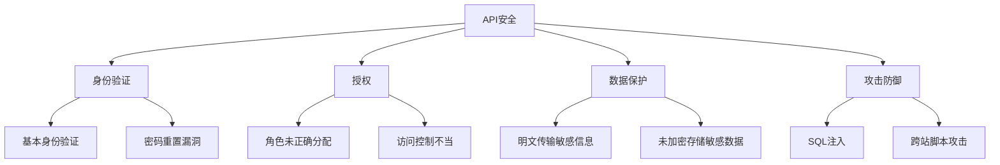

                 

### 文章标题

### OWASP API 安全风险清单的重要性

> 关键词：OWASP，API 安全，风险清单，网络安全，应用程序安全
>
> 摘要：本文将深入探讨OWASP API安全风险清单的重要性，解析其在网络安全中的应用，并详细介绍核心概念、算法原理、实际应用场景和未来发展趋势。

### 1. 背景介绍

随着互联网和移动设备的普及，API（应用程序编程接口）成为了现代软件系统的重要组成部分。API使得不同的应用程序、服务和设备能够相互通信和共享数据，促进了软件开发的敏捷性和创新性。然而，API的广泛应用也带来了新的安全挑战。

OWASP（开放式网络应用安全项目）是一个全球性的非营利组织，致力于提高网络安全水平。OWASP API安全风险清单是OWASP社区的一项重要成果，旨在帮助开发者识别和防范API安全风险。

本文将围绕OWASP API安全风险清单展开讨论，从背景介绍、核心概念与联系、核心算法原理、数学模型和公式、项目实践、实际应用场景、工具和资源推荐等多个角度，全面剖析API安全的重要性及其应对策略。

### 2. 核心概念与联系

#### 2.1 API安全的基本概念

API安全是指确保API在设计和实现过程中遵循安全原则，防止恶意攻击、数据泄露和非法访问等安全威胁。以下是一些API安全的基本概念：

- **身份验证**：确保只有授权用户才能访问API。
- **授权**：限制用户对API操作的权限。
- **数据保护**：确保API传输和存储的数据的安全性。
- **攻击防御**：防范常见的API攻击，如SQL注入、跨站脚本攻击等。

#### 2.2 OWASP API安全风险清单

OWASP API安全风险清单列出了常见且严重的API安全风险，包括但不限于：

- **身份验证漏洞**：如基本身份验证、密码重置漏洞等。
- **授权漏洞**：如角色未正确分配、访问控制不当等。
- **敏感数据泄露**：如明文传输敏感信息、未加密存储敏感数据等。
- **API暴露**：如API文档泄露、未受保护的API路径等。

#### 2.3 核心概念与联系的Mermaid流程图



### 3. 核心算法原理 & 具体操作步骤

#### 3.1 身份验证算法原理

身份验证是API安全的核心之一，常见的身份验证算法包括：

- **基本身份验证**：使用基础认证方式，将用户名和密码以明文形式发送给服务器。
- **OAuth 2.0**：一种开放标准授权协议，允许第三方应用程序访问用户资源，而无需将用户密码暴露给第三方。

#### 3.2 授权算法原理

授权算法确保只有授权用户才能访问特定API。常见的授权算法包括：

- **基于角色的访问控制（RBAC）**：通过用户的角色来限制其访问权限。
- **基于属性的访问控制（ABAC）**：通过用户的属性来限制其访问权限。

#### 3.3 数据保护算法原理

数据保护算法包括数据加密、数据掩码等。以下是具体操作步骤：

- **数据加密**：使用加密算法对敏感数据进行加密，确保数据在传输和存储过程中不会被泄露。
- **数据掩码**：对部分敏感数据进行掩码处理，只显示部分信息，防止敏感信息泄露。

#### 3.4 攻击防御算法原理

攻击防御算法包括：

- **输入验证**：确保输入数据的合法性和安全性。
- **缓存攻击防御**：防止缓存中的敏感数据被攻击者获取。

### 4. 数学模型和公式 & 详细讲解 & 举例说明

#### 4.1 数据加密数学模型

数据加密通常使用加密算法，如AES（高级加密标准）。以下是AES加密的数学模型：

$$
C = E(K, P)
$$

其中，$C$ 表示加密后的数据，$K$ 表示密钥，$P$ 表示明文数据。

#### 4.2 身份验证数学模型

身份验证过程中，可以使用哈希函数对用户输入的密码进行加密，并与数据库中的密码哈希值进行比对。以下是一个简单的身份验证数学模型：

$$
H(P) = H(S)
$$

其中，$H$ 表示哈希函数，$P$ 表示用户输入的密码，$S$ 表示数据库中的密码哈希值。

#### 4.3 举例说明

假设用户名为“user1”，密码为“password123”，使用SHA-256哈希函数进行加密，并与数据库中的密码哈希值进行比对。

- 用户输入密码：`password123`
- 计算哈希值：`d41d8cd98f00b204e9800998ecf8427e`
- 数据库中的密码哈希值：`d41d8cd98f00b204e9800998ecf8427e`

由于用户输入的密码哈希值与数据库中的密码哈希值相同，身份验证成功。

### 5. 项目实践：代码实例和详细解释说明

#### 5.1 开发环境搭建

为了演示API安全风险清单中的身份验证漏洞，我们使用Python编写一个简单的API服务。

- 安装Python：确保Python版本在3.6及以上。
- 安装Flask：使用pip命令安装Flask框架。

```bash
pip install Flask
```

#### 5.2 源代码详细实现

以下是实现一个简单的API服务的代码，其中包含身份验证漏洞：

```python
from flask import Flask, request, jsonify

app = Flask(__name__)

# 用户名和密码存储在字典中
users = {
    "user1": "password123"
}

# 基本身份验证
def authenticate(username, password):
    return users.get(username) == password

@app.route('/api/data', methods=['GET'])
def get_data():
    # 漏洞：未进行身份验证
    username = request.args.get('username')
    password = request.args.get('password')
    
    if authenticate(username, password):
        return jsonify({'data': 'Sensitive data'})
    else:
        return jsonify({'error': 'Unauthorized'})

if __name__ == '__main__':
    app.run()
```

#### 5.3 代码解读与分析

在上面的代码中，我们创建了一个简单的Flask应用，定义了一个`/api/data`的API接口。该接口未进行身份验证，任何用户都可以访问并获取敏感数据。

#### 5.4 运行结果展示

运行上述代码，启动Flask应用。然后，可以使用以下URL访问API接口：

```
http://127.0.0.1:5000/api/data?username=user1&password=password123
```

正确输入用户名和密码后，会返回敏感数据。如果输入错误或未输入用户名和密码，则会返回“Unauthorized”错误。

### 6. 实际应用场景

#### 6.1 在企业级应用中的API安全

企业级应用通常包含多个API接口，涉及不同的业务模块和数据。OWASP API安全风险清单可以帮助企业识别和防范API安全风险，确保数据的安全性和完整性。

#### 6.2 在第三方服务中的API安全

第三方服务通常通过API与外部系统进行集成。OWASP API安全风险清单可以帮助第三方服务提供商确保其API的安全，保护用户数据不受侵害。

#### 6.3 在移动应用中的API安全

随着移动应用的普及，API安全已成为移动应用开发的重要环节。OWASP API安全风险清单可以帮助移动应用开发者识别和防范API安全风险，保护用户隐私和数据安全。

### 7. 工具和资源推荐

#### 7.1 学习资源推荐

- 《API设计：创建用户友好的API》
- 《API安全：设计与实现》
- OWASP API安全项目官方文档

#### 7.2 开发工具框架推荐

- Flask：用于构建Web应用程序的Python微框架。
- Django：用于快速开发Web应用程序的Python框架。

#### 7.3 相关论文著作推荐

- “API Security: Threats and Countermeasures”
- “Secure API Design: What to Do, What to Avoid”

### 8. 总结：未来发展趋势与挑战

随着API在各个领域的广泛应用，API安全将成为网络安全的重要组成部分。未来，API安全发展趋势包括：

- **自动化安全测试**：使用自动化工具进行API安全测试，提高安全防护能力。
- **安全编程实践**：推广安全编程实践，确保API在设计、开发和运维过程中遵循安全原则。
- **云原生API安全**：随着云原生技术的发展，云原生API安全将成为重要研究方向。

然而，API安全也面临诸多挑战，如：

- **日益复杂的攻击手段**：攻击者不断尝试新的攻击方式，安全防护需要不断更新。
- **快速迭代的产品开发**：在快速迭代的产品开发过程中，安全防护需要与产品开发同步进行。

### 9. 附录：常见问题与解答

#### 9.1 API安全与网络安全有何区别？

API安全是网络安全的一个子领域，主要关注API层面的安全问题。而网络安全则是一个更广泛的概念，包括网络基础设施、系统、应用程序等多个层面的安全。

#### 9.2 如何评估API的安全性？

可以通过以下方法评估API的安全性：

- **安全审计**：对API进行安全审计，检查是否存在已知的安全漏洞。
- **渗透测试**：使用渗透测试工具模拟攻击者行为，测试API的脆弱性。
- **代码审查**：对API的源代码进行审查，确保代码遵循安全编程实践。

### 10. 扩展阅读 & 参考资料

- [OWASP API Security Project](https://owasp.org/www-project-api-security/)
- [Flask API Development](https://flask.palletsprojects.com/)
- [Django API Development](https://www.djangoproject.com/)
- [API Security: Threats and Countermeasures](https://www.ibm.com/docs/en/security/api-security/2.0.0?topic=api-threats-countermeasures)

