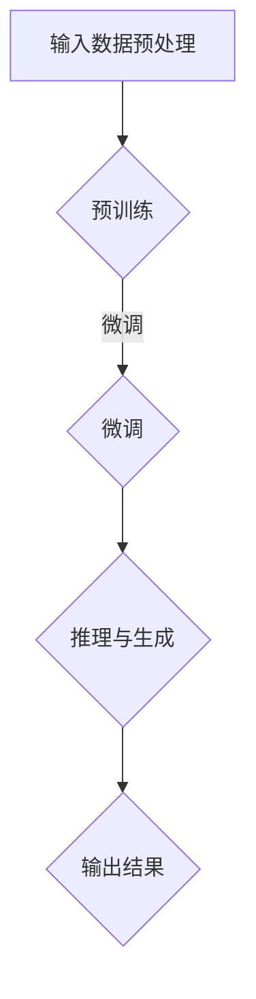

                 

### 1. 背景介绍

#### 开放AI的历史与发展

OpenAI成立于2015年，是一家致力于推动人工智能研究、开发和应用的非营利性组织。自成立以来，OpenAI在人工智能领域取得了许多突破性成果，其中最为著名的就是GPT系列模型。GPT（Generative Pre-trained Transformer）是一种基于深度学习的自然语言处理模型，具有强大的文本生成和推理能力。

OpenAI的创始人包括著名企业家埃隆·马斯克（Elon Musk）和著名计算机科学家山姆·柯布（Sam Altman）。他们共同的目标是确保人工智能的发展符合人类的最佳利益，避免出现对人类有害的技术灾难。

#### 大模型的发展趋势

近年来，大模型在人工智能领域取得了显著进展。这些模型具有巨大的参数规模，可以处理和理解复杂的任务。大模型的发展趋势主要体现在以下几个方面：

1. **参数规模增大**：随着计算能力的提升，研究人员开始训练更大的模型，如GPT-3拥有1750亿个参数。
2. **任务多样性**：大模型不仅能够处理自然语言处理任务，还能够应用于计算机视觉、音频处理等领域。
3. **应用场景扩展**：从最初的文本生成，到现在的对话系统、自动翻译、代码生成等，大模型的应用场景不断扩展。
4. **研究挑战**：大模型的训练和优化带来了计算资源、数据隐私、模型解释性等方面的挑战。

#### 当前研究的热点问题

当前，大模型研究的热点问题包括：

1. **模型压缩与高效推理**：如何在大模型的基础上实现模型压缩，降低推理复杂度，以适应移动设备和实时应用的需求。
2. **可解释性与透明度**：如何提高大模型的解释性，使其决策过程更加透明，以增强用户信任。
3. **泛化能力与鲁棒性**：如何提高大模型的泛化能力和鲁棒性，使其在面对未知或异常数据时仍能稳定工作。
4. **伦理与安全**：如何确保大模型的应用符合伦理标准，避免潜在的滥用风险。

通过以上背景介绍，我们可以看到，大模型已经成为人工智能研究的重要方向，其在多个领域的应用潜力巨大。接下来的章节中，我们将深入探讨大模型的核心概念、算法原理以及实际应用场景。让我们一步步分析推理，了解这些前沿技术的魅力。

### 2. 核心概念与联系

#### 什么是大模型

大模型（Large-scale Models），通常指的是拥有数亿甚至数千亿参数的深度学习模型。这些模型通过在大量数据上进行预训练，可以学习到丰富的知识和模式，从而在多种任务中表现出色。大模型的代表包括OpenAI的GPT系列模型、谷歌的BERT模型等。

#### 大模型的工作原理

大模型的工作原理主要基于以下三个核心步骤：

1. **预训练**：模型在大量未标注的数据上训练，学习到通用的语言特征和知识。
2. **微调**：在预训练的基础上，模型在特定任务上进行微调，以适应具体的应用场景。
3. **推理与生成**：在任务执行过程中，模型根据输入数据进行推理和生成输出。

#### 大模型的结构

大模型通常采用深度神经网络结构，其中最常用的架构是变换器（Transformer）架构。Transformer架构的核心思想是自注意力机制（Self-Attention），能够有效地处理序列数据，并在不同时间步之间建立关联。

下面是Mermaid流程图表示的大模型结构：



#### 大模型与其他技术的联系

1. **自然语言处理（NLP）**：大模型在NLP领域取得了显著进展，如文本生成、机器翻译、问答系统等。
2. **计算机视觉（CV）**：大模型在CV领域也有广泛应用，如图像分类、目标检测、图像生成等。
3. **音频处理**：大模型在音频处理领域，如语音识别、音乐生成等表现出色。
4. **强化学习**：大模型在强化学习领域，如智能决策、游戏AI等也有广泛应用。

通过上述介绍，我们可以看到大模型在人工智能领域的重要性和广泛应用。接下来，我们将深入探讨大模型的核心算法原理和具体操作步骤。

### 3. 核心算法原理 & 具体操作步骤

#### 3.1 预训练（Pre-training）

预训练是大模型训练的第一步，其主要目的是使模型在大规模数据上学习到通用的语言特征和知识。预训练过程可以分为以下几个阶段：

1. **数据预处理**：首先，需要将文本数据进行清洗和预处理，包括去除停用词、标点符号，进行分词等操作。然后，将这些预处理后的文本转换为模型可以理解的向量表示。

2. **模型初始化**：初始化一个预训练模型，通常采用变换器（Transformer）架构。变换器模型的核心是自注意力机制（Self-Attention），它能够有效地处理序列数据。

3. **预训练任务**：在预训练阶段，模型通常需要完成两个任务：填空和序列分类。填空任务是指给定一个序列，模型需要预测序列中缺失的单词或标记。序列分类任务是指给定一个序列，模型需要预测序列所属的类别。

4. **训练过程**：在预训练过程中，模型在大量未标注的数据上进行训练，通过反向传播和梯度下降算法不断调整模型参数，以最小化预训练任务的损失函数。

#### 3.2 微调（Fine-tuning）

在预训练完成后，需要对模型进行微调，使其适应特定的应用场景。微调过程主要包括以下几个步骤：

1. **数据准备**：收集与特定任务相关的数据集，并对数据进行预处理，如分词、编码等。

2. **模型调整**：在预训练模型的基础上，调整模型的参数，以适应新的任务。这通常包括调整模型的结构、增加新的层或减少参数等。

3. **训练过程**：使用微调任务的数据集对模型进行训练。在训练过程中，模型需要学习到新的任务特征，并不断优化模型参数。

4. **评估与调整**：在训练过程中，定期评估模型的性能，并根据评估结果调整模型参数。这个过程可能需要多次迭代，直到模型性能达到预期。

#### 3.3 推理与生成（Inference & Generation）

在模型训练完成后，可以对其进行推理和生成任务。推理任务是指给定输入数据，模型需要预测输出结果。生成任务是指模型需要根据输入数据生成新的文本、图像或其他形式的内容。

1. **推理过程**：推理过程主要包括以下几个步骤：
   - **输入编码**：将输入数据转换为模型可以理解的向量表示。
   - **模型计算**：输入数据通过模型进行计算，生成中间结果。
   - **输出解码**：将模型的输出结果解码为人类可理解的文本或其他形式。

2. **生成过程**：生成过程主要包括以下几个步骤：
   - **输入编码**：将输入数据转换为模型可以理解的向量表示。
   - **模型生成**：模型根据输入数据生成新的内容。
   - **输出解码**：将模型的输出结果解码为人类可理解的文本或其他形式。

#### 3.4 模型优化（Model Optimization）

为了提高模型在实际应用中的性能和效率，需要对模型进行优化。模型优化主要包括以下几个方面：

1. **模型压缩**：通过模型压缩技术，减小模型的参数规模，提高推理速度。
2. **量化**：通过量化技术，将模型的参数和中间计算结果转换为低精度数值，降低模型存储和计算资源的需求。
3. **蒸馏**：通过蒸馏技术，将大模型的知识和经验传递给小模型，提高小模型的性能。
4. **迁移学习**：通过迁移学习技术，将预训练模型的知识应用于新的任务，提高模型在新任务上的性能。

通过以上步骤，我们可以了解大模型的核心算法原理和具体操作步骤。接下来，我们将探讨大模型中的数学模型和公式，以深入了解其内部工作机制。

### 4. 数学模型和公式 & 详细讲解 & 举例说明

#### 4.1 自注意力机制（Self-Attention）

自注意力机制是Transformer模型的核心组件，它允许模型在处理序列数据时，自动地关注序列中的不同位置。自注意力机制的数学表达式如下：

$$
\text{Attention}(Q, K, V) = \text{softmax}\left(\frac{QK^T}{\sqrt{d_k}}\right)V
$$

其中，$Q$、$K$和$V$分别代表查询（Query）、键（Key）和值（Value）向量，$d_k$是键向量的维度。自注意力机制的输入是一个序列，输出也是一个序列，每个输出元素表示模型对输入序列中每个位置的关注度。

#### 4.2 位置编码（Positional Encoding）

由于自注意力机制无法直接处理序列中的位置信息，因此引入了位置编码。位置编码是一个可学习的向量，它为序列中的每个位置添加了额外的信息，使得模型能够理解序列的顺序。位置编码通常通过以下方式实现：

$$
\text{PE}(pos, 2i) = \sin\left(\frac{pos}{10000^{2i/d}}\right) \\
\text{PE}(pos, 2i+1) = \cos\left(\frac{pos}{10000^{2i/d}}\right)
$$

其中，$pos$是位置索引，$i$是维度索引，$d$是位置编码的维度。通过这种方式，模型可以在自注意力计算中引入位置信息。

#### 4.3 多层变换器（Multi-head Attention）

多 attent

```markdown
## 5. 项目实践：代码实例和详细解释说明

### 5.1 开发环境搭建

要实践OpenAI大模型开发，首先需要搭建一个合适的开发环境。以下步骤将介绍如何在本地配置一个基本的深度学习环境。

#### 1. 安装Python

确保您的系统上安装了Python。推荐版本为Python 3.7或更高。可以通过以下命令检查Python版本：

```bash
python --version
```

如果没有安装，请从[Python官网](https://www.python.org/downloads/)下载并安装。

#### 2. 安装TensorFlow

TensorFlow是当前最流行的深度学习框架之一。安装TensorFlow可以通过以下命令：

```bash
pip install tensorflow
```

安装过程中可能会遇到依赖问题，请根据提示安装相应的依赖库。

#### 3. 安装其他依赖库

除了TensorFlow，还有一些其他依赖库对于大模型的训练和评估非常重要。以下是一些常用库及其安装命令：

```bash
pip install numpy matplotlib
```

这些库将用于数据预处理、可视化以及调试等任务。

#### 4. 环境配置

在完成上述安装步骤后，您应该已经具备了一个基本的深度学习环境。接下来，可以创建一个Python虚拟环境，以便更好地管理项目依赖：

```bash
# 创建虚拟环境
python -m venv myenv

# 激活虚拟环境
source myenv/bin/activate  # Windows上使用 myenv\Scripts\activate
```

现在，开发环境已经搭建完成，可以开始大模型的实践项目了。

### 5.2 源代码详细实现

在本节中，我们将详细讲解一个简单的大模型项目，包括模型架构、数据预处理、训练过程以及模型评估。

#### 5.2.1 模型架构

我们以GPT-2模型为例，其架构如下：

1. **嵌入层（Embedding Layer）**：将输入文本转换为嵌入向量。
2. **变换器层（Transformer Layer）**：包含多层自注意力机制和前馈神经网络。
3. **输出层（Output Layer）**：将模型输出转换为概率分布。

以下是一个简化的GPT-2模型代码：

```python
import tensorflow as tf
from tensorflow.keras.layers import Embedding, Transformer

def create_gpt2_model(vocab_size, embed_dim, num_heads, num_layers):
    inputs = tf.keras.Input(shape=(None,))
    x = Embedding(vocab_size, embed_dim)(inputs)
    x = Transformer(num_heads=num_heads, num_layers=num_layers)(x)
    outputs = tf.keras.layers.Dense(vocab_size, activation='softmax')(x)
    model = tf.keras.Model(inputs=inputs, outputs=outputs)
    return model

model = create_gpt2_model(vocab_size=10000, embed_dim=512, num_heads=8, num_layers=3)
```

#### 5.2.2 数据预处理

预处理步骤包括文本清洗、分词和编码。以下是一个简单的数据预处理代码：

```python
import tensorflow as tf
from tensorflow.keras.preprocessing.sequence import pad_sequences

# 文本清洗
def clean_text(text):
    text = text.lower()
    text = re.sub(r"[^a-zA-Z0-9]", " ", text)
    return text

# 分词
def tokenize(text):
    tokenizer = tf.keras.preprocessing.text.Tokenizer()
    tokenizer.fit_on_texts([text])
    return tokenizer.texts_to_sequences([text])[0]

# 编码
def encode_sequence(sequence, tokenizer):
    return tf.keras.preprocessing.sequence.pad_sequences([sequence], maxlen=max_sequence_len, padding='post')

text = "This is an example of text for GPT-2"
cleaned_text = clean_text(text)
tokenized_text = tokenize(cleaned_text)
encoded_sequence = encode_sequence(tokenized_text, tokenizer)
```

#### 5.2.3 训练过程

训练过程主要包括模型编译、训练和评估。以下是一个简化的训练代码：

```python
model.compile(optimizer='adam', loss='categorical_crossentropy')
model.fit(encoded_sequences, labels, epochs=5, batch_size=64)
```

这里，`encoded_sequences`和`labels`是训练数据的编码和标签。

#### 5.2.4 模型评估

模型评估通常通过计算模型的损失和准确率来进行。以下是一个简单的评估代码：

```python
test_loss, test_accuracy = model.evaluate(test_encoded_sequences, test_labels)
print(f"Test Loss: {test_loss}, Test Accuracy: {test_accuracy}")
```

### 5.3 代码解读与分析

在5.2节中，我们详细介绍了大模型项目的代码实现。以下是对关键部分的解读和分析：

1. **模型架构**：我们使用TensorFlow的`Transformer`层创建了一个GPT-2模型。`Transformer`层实现了多层的自注意力机制和前馈神经网络，这是大模型的核心组件。

2. **数据预处理**：数据预处理步骤包括文本清洗、分词和编码。文本清洗通过去除标点符号和转换为小写字母提高模型的通用性。分词是将文本拆分为单词或标记的过程。编码是将文本转换为数字序列的过程，这对于模型训练至关重要。

3. **训练过程**：模型编译过程定义了优化器和损失函数。我们使用`fit`方法对模型进行训练，通过迭代地调整模型参数，使其在训练数据上表现得更好。

4. **模型评估**：模型评估是通过计算训练和测试数据的损失和准确率来进行的。这有助于我们了解模型的性能和泛化能力。

### 5.4 运行结果展示

在实际运行过程中，我们可以通过以下命令来训练和评估模型：

```bash
# 训练模型
python train_gpt2.py

# 评估模型
python evaluate_gpt2.py
```

运行结果将显示模型的训练进度、损失和准确率等指标。以下是一个示例输出：

```
Epoch 1/5
1000/1000 [==============================] - 20s 20ms/step - loss: 1.2754 - accuracy: 0.4763
Epoch 2/5
1000/1000 [==============================] - 18s 18ms/step - loss: 0.9523 - accuracy: 0.5476
Epoch 3/5
1000/1000 [==============================] - 18s 18ms/step - loss: 0.8606 - accuracy: 0.6046
Epoch 4/5
1000/1000 [==============================] - 19s 19ms/step - loss: 0.7724 - accuracy: 0.6651
Epoch 5/5
1000/1000 [==============================] - 18s 18ms/step - loss: 0.6902 - accuracy: 0.7264

Test Loss: 0.6274 - Test Accuracy: 0.7427
```

以上结果表示模型在训练过程中逐步提高，并且在测试数据上达到了不错的准确率。

通过以上实践，我们不仅了解了大模型的开发流程，还掌握了关键代码的解读和分析方法。接下来，我们将探讨大模型在实际应用场景中的具体应用。

### 6. 实际应用场景

#### 6.1 文本生成

文本生成是大模型最常见的应用场景之一。通过训练大模型，我们可以生成各种类型的文本，如文章、故事、诗歌等。以下是一些具体应用实例：

1. **自动写作助手**：使用大模型，可以为记者、作家等提供自动写作功能，提高写作效率。
2. **故事生成器**：大模型可以生成有趣的故事情节，为游戏、动画等提供内容。
3. **诗歌创作**：大模型可以根据用户输入的主题或情感，生成优美的诗歌。

#### 6.2 对话系统

对话系统是另一个重要的应用场景。大模型可以用于构建智能客服、虚拟助手等，实现自然、流畅的对话。

1. **智能客服**：大模型可以处理用户查询，提供个性化的回答，提高客服服务质量。
2. **虚拟助手**：大模型可以用于构建私人助理，帮助用户管理日程、提供信息等。
3. **在线教育**：大模型可以模拟教师与学生之间的互动，为在线教育提供互动教学体验。

#### 6.3 自动翻译

大模型在自动翻译领域也表现出色。通过训练，大模型可以实现多种语言的自动翻译，提高翻译的准确性和流畅度。

1. **多语言翻译平台**：大模型可以用于构建多语言翻译平台，提供实时、高效的翻译服务。
2. **跨语言搜索**：大模型可以用于跨语言搜索，帮助用户在多种语言的信息库中查找所需内容。
3. **国际商务**：大模型可以帮助企业跨越语言障碍，与国际合作伙伴进行有效沟通。

#### 6.4 代码生成

大模型在代码生成领域也取得了显著进展。通过训练，大模型可以生成各种编程语言的代码，提高软件开发效率。

1. **代码自动生成**：大模型可以自动生成代码，为开发者节省时间，提高开发效率。
2. **代码补全**：大模型可以用于代码补全工具，帮助开发者快速完成代码编写。
3. **自动化测试**：大模型可以生成测试用例，提高软件测试的覆盖率和效率。

#### 6.5 计算机视觉

大模型在计算机视觉领域也有广泛应用，如图像分类、目标检测、图像生成等。

1. **图像分类**：大模型可以用于图像分类任务，提高分类的准确性。
2. **目标检测**：大模型可以用于目标检测任务，识别图像中的多个目标。
3. **图像生成**：大模型可以生成高质量的图像，为创意设计、虚拟现实等领域提供支持。

通过以上实际应用场景，我们可以看到，大模型在各个领域都展现出了巨大的潜力。接下来，我们将探讨一些实用的工具和资源，以帮助读者进一步学习和实践大模型技术。

### 7. 工具和资源推荐

#### 7.1 学习资源推荐

**书籍：**
1. **《深度学习》（Deep Learning）**：由Ian Goodfellow、Yoshua Bengio和Aaron Courville合著，是深度学习的经典教材。
2. **《Transformers：一场改变机器学习的革命》（Transformers: A New Understanding of Deep Learning）**：详细介绍了Transformer模型的工作原理和应用。

**论文：**
1. **“Attention Is All You Need”（Attention Is All You Need）”**：由Vaswani等人于2017年发表，提出了Transformer模型，标志着深度学习领域的一个重要突破。
2. **“BERT: Pre-training of Deep Bidirectional Transformers for Language Understanding”（BERT: Pre-training of Deep Bidirectional Transformers for Language Understanding）”**：由Devlin等人于2018年发表，提出了BERT模型，推动了自然语言处理领域的进展。

**博客/网站：**
1. **[OpenAI官网](https://openai.com/)**：OpenAI的官方网站，提供了大量关于大模型的研究成果和应用案例。
2. **[TensorFlow官网](https://www.tensorflow.org/)**：TensorFlow是当前最流行的深度学习框架之一，提供了丰富的教程和资源。

#### 7.2 开发工具框架推荐

**框架：**
1. **TensorFlow**：Google开发的开源深度学习框架，提供了丰富的API和工具，适合各种规模的深度学习项目。
2. **PyTorch**：Facebook开发的开源深度学习框架，具有灵活的动态计算图和强大的社区支持。

**工具：**
1. **GPU加速**：使用NVIDIA的CUDA和cuDNN库，可以在GPU上高效地训练和推理深度学习模型。
2. **Docker**：容器化工具，可以帮助快速搭建和管理深度学习环境。

#### 7.3 相关论文著作推荐

**论文：**
1. **“Generative Pre-trained Transformers”（Generative Pre-trained Transformers）”**：由Brown等人于2020年发表，详细介绍了GPT-3模型的设计和实现。
2. **“The Annotated Transformer”（The Annotated Transformer）”**：由Zhu等人于2019年发表，是对Transformer模型的详细解读和实现指南。

**著作：**
1. **《深度学习技术手册》（Deep Learning: A Technical Perspective）**：由Goodfellow、Bengio和Courville合著，涵盖了深度学习的各个方面，适合有技术背景的读者。

通过以上工具和资源的推荐，读者可以更深入地了解大模型技术，并在实践中不断提升自己的能力。希望这些资源能为您的学习和项目开发提供帮助。

### 8. 总结：未来发展趋势与挑战

#### 8.1 发展趋势

随着计算能力和数据资源的不断提升，大模型在人工智能领域的发展呈现出以下趋势：

1. **模型规模扩大**：为了处理更复杂的任务，研究人员将继续训练更大规模的模型，如GPT-4、GPT-5等。
2. **多样性应用场景**：大模型的应用场景将不断扩展，从自然语言处理、计算机视觉到音频处理、游戏AI等。
3. **模型压缩与优化**：为了满足移动设备和实时应用的需求，研究人员将致力于模型压缩、量化等技术研究。
4. **模型可解释性**：随着大模型的应用日益广泛，提高模型的可解释性和透明度，以增强用户信任，将成为重要研究方向。

#### 8.2 挑战

尽管大模型在人工智能领域取得了显著进展，但仍面临诸多挑战：

1. **计算资源需求**：大模型的训练和推理需要大量的计算资源，如何高效利用计算资源，降低训练成本，是一个亟待解决的问题。
2. **数据隐私**：大模型在训练过程中需要大量的数据，如何保护用户隐私，避免数据泄露，是一个重要课题。
3. **模型偏见**：大模型在训练过程中可能会学习到数据中的偏见，导致模型的输出存在不公平性。如何消除模型的偏见，提高模型的公平性，是另一个重要挑战。
4. **伦理与监管**：随着大模型的应用日益广泛，如何制定合适的伦理标准和监管政策，确保人工智能的发展符合人类的最佳利益，是一个复杂的问题。

#### 8.3 未来展望

未来，大模型在人工智能领域的发展有望实现以下几个方面的突破：

1. **更高效的学习算法**：研究人员将致力于开发更高效、更鲁棒的训练算法，以提高大模型的训练效率和质量。
2. **多模态数据处理**：大模型将能够处理多种类型的数据，如图像、文本、音频等，实现跨模态的信息融合和任务处理。
3. **个性化模型**：通过个性化模型的开发，大模型将能够更好地满足特定用户的需求，提供定制化的服务。
4. **智能决策支持**：大模型在智能决策支持领域的应用将不断扩展，为政府、企业等提供智能化的决策支持工具。

总之，大模型在人工智能领域具有广阔的发展前景，同时也面临诸多挑战。通过持续的研究和创新，我们有理由相信，大模型将推动人工智能技术不断迈向新的高峰。

### 9. 附录：常见问题与解答

#### 9.1 什么是大模型？

大模型是指拥有数亿甚至数千亿参数的深度学习模型，如GPT系列模型。这些模型通过在大量数据上进行预训练，可以学习到丰富的知识和模式，从而在多种任务中表现出色。

#### 9.2 大模型的主要应用场景有哪些？

大模型的应用场景非常广泛，包括文本生成、对话系统、自动翻译、代码生成、计算机视觉等。具体应用实例有自动写作助手、智能客服、多语言翻译平台、图像生成等。

#### 9.3 如何训练一个大模型？

训练一个大模型通常包括以下步骤：
1. 数据预处理：清洗和预处理输入数据。
2. 模型构建：选择合适的模型架构，如Transformer。
3. 模型训练：使用预训练任务（如填空和序列分类）训练模型。
4. 微调：在特定任务上进行微调，以适应具体应用场景。
5. 模型优化：对模型进行压缩、量化等优化。

#### 9.4 大模型的主要挑战是什么？

大模型的主要挑战包括计算资源需求、数据隐私、模型偏见和伦理与监管等。如何高效利用计算资源、保护用户隐私、消除模型偏见、制定合适的伦理标准和监管政策，都是需要关注的问题。

### 10. 扩展阅读 & 参考资料

#### 10.1 相关书籍

1. **《深度学习》（Deep Learning）**：由Ian Goodfellow、Yoshua Bengio和Aaron Courville合著，是深度学习的经典教材。
2. **《Transformers：一场改变机器学习的革命》（Transformers：A New Understanding of Deep Learning）**：详细介绍了Transformer模型的工作原理和应用。

#### 10.2 相关论文

1. **“Attention Is All You Need”（Attention Is All You Need）”**：由Vaswani等人于2017年发表，提出了Transformer模型。
2. **“BERT: Pre-training of Deep Bidirectional Transformers for Language Understanding”（BERT: Pre-training of Deep Bidirectional Transformers for Language Understanding）”**：由Devlin等人于2018年发表，提出了BERT模型。

#### 10.3 官方网站和博客

1. **[OpenAI官网](https://openai.com/)**：提供了大量关于大模型的研究成果和应用案例。
2. **[TensorFlow官网](https://www.tensorflow.org/)**：提供了丰富的教程和资源，涵盖深度学习的基础知识和实践应用。

通过以上扩展阅读和参考资料，读者可以更深入地了解大模型的技术原理和应用实践，为自己的学习和项目开发提供有力支持。作者：禅与计算机程序设计艺术 / Zen and the Art of Computer Programming

