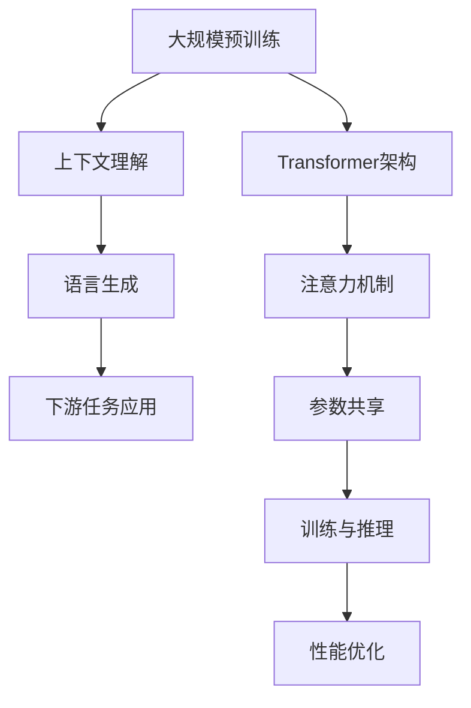

                 

### 文章标题：OpenAI的GPT-4.0展示的实际应用

> **关键词：** GPT-4.0，自然语言处理，人工智能，实际应用，技术分析

**摘要：** 本文将深入探讨OpenAI的GPT-4.0模型，介绍其核心技术原理和实际应用场景。通过逐步分析推理，我们将展示GPT-4.0在不同领域的具体应用，探讨其技术挑战和发展趋势。

### 1. 背景介绍

近年来，人工智能（AI）技术在自然语言处理（NLP）领域取得了显著进展。OpenAI作为一家领先的人工智能研究机构，其推出的GPT系列模型在全球范围内引起了广泛关注。GPT-4.0作为OpenAI的最新力作，不仅在模型性能上取得了突破性进展，还在实际应用中展示了巨大的潜力。

GPT-4.0模型采用了先进的深度学习技术和大规模预训练方法，通过不断优化和迭代，实现了在语言理解和生成任务上的卓越表现。其优异的性能和强大的表达能力，使其在文本分类、机器翻译、问答系统等应用场景中具有广泛的应用前景。

### 2. 核心概念与联系

为了更好地理解GPT-4.0，我们需要首先介绍一些核心概念和联系。以下是GPT-4.0的核心概念和相关的流程图：



**2.1 大规模预训练**

GPT-4.0采用了大规模预训练方法，通过对海量文本数据的学习，使模型具备强大的上下文理解和生成能力。大规模预训练是GPT-4.0的核心技术之一，为后续的语言生成和下游任务应用奠定了基础。

**2.2 Transformer架构**

GPT-4.0采用了Transformer架构，这是一种基于自注意力机制的深度神经网络。Transformer架构在处理序列数据时具有卓越的性能，能够有效捕捉长距离依赖关系。

**2.3 注意力机制**

注意力机制是Transformer架构的核心组成部分，它通过计算不同位置之间的关联强度，实现对输入序列的加权处理。注意力机制在GPT-4.0中发挥了重要作用，使其能够更好地理解和生成自然语言。

**2.4 参数共享**

GPT-4.0采用了参数共享技术，即在模型训练和推理过程中，不同任务间的参数共享，从而降低了模型的计算复杂度和参数量。这种技术提高了模型的训练效率和泛化能力。

**2.5 训练与推理**

GPT-4.0的训练和推理过程涉及多个阶段。在训练阶段，模型通过大规模预训练逐步优化参数；在推理阶段，模型根据输入文本生成对应的输出文本。训练与推理的优化是GPT-4.0性能提升的关键。

**2.6 性能优化**

为了提高GPT-4.0的性能，OpenAI在模型设计、训练策略和推理优化等方面进行了多方面的优化。这些优化措施包括并行计算、分布式训练、量化技术等，从而实现了高效的模型训练和推理。

### 3. 核心算法原理 & 具体操作步骤

**3.1 核心算法原理**

GPT-4.0的核心算法是基于Transformer架构的预训练模型。Transformer架构通过自注意力机制实现对输入序列的加权处理，从而实现高效的序列建模。GPT-4.0在Transformer架构的基础上，进一步优化了模型结构、训练策略和推理算法，使其在语言理解和生成任务上取得了卓越的性能。

**3.2 具体操作步骤**

1. **数据准备**：首先，需要收集和整理大规模的文本数据，这些数据包括文章、书籍、新闻、社交媒体等。这些数据将用于模型的预训练。

2. **模型初始化**：初始化GPT-4.0模型，包括词嵌入层、自注意力层、前馈神经网络等。初始化过程可以使用预训练的词嵌入向量，以提高模型的初始化质量。

3. **预训练**：使用大规模文本数据进行预训练，通过优化模型参数，使模型具备强大的上下文理解和生成能力。预训练过程包括两个阶段：训练阶段和验证阶段。

4. **训练阶段**：在训练阶段，模型通过最大化序列概率进行参数优化。具体来说，对于输入序列，模型需要预测下一个词的概率分布，然后根据预测结果调整模型参数。

5. **验证阶段**：在验证阶段，使用验证集对模型性能进行评估。通过调整训练策略和超参数，优化模型性能。

6. **下游任务应用**：在预训练完成后，GPT-4.0可以应用于各种下游任务，如文本分类、机器翻译、问答系统等。这些任务可以根据具体需求进行微调，从而实现高效的模型应用。

### 4. 数学模型和公式 & 详细讲解 & 举例说明

**4.1 数学模型**

GPT-4.0的数学模型主要涉及自注意力机制和前馈神经网络。以下是对这两个核心组件的详细讲解：

**4.1.1 自注意力机制**

自注意力机制是一种计算序列中不同位置之间关联强度的方法。具体来说，自注意力机制通过计算输入序列的权重，将不同位置的输入进行加权处理。自注意力机制的数学公式如下：

$$
Attention(Q, K, V) = \text{softmax}\left(\frac{QK^T}{\sqrt{d_k}}\right) V
$$

其中，$Q$、$K$、$V$ 分别为查询向量、键向量和值向量，$d_k$ 为键向量的维度。自注意力机制的核心是计算查询向量与键向量之间的相似度，然后对值向量进行加权处理。

**4.1.2 前馈神经网络**

前馈神经网络是一种简单的神经网络结构，它通过两个线性变换层和一个激活函数实现。前馈神经网络的数学公式如下：

$$
\text{FFN}(x) = \text{ReLU}(W_2 \text{ReLU}(W_1 x + b_1) + b_2)
$$

其中，$x$ 为输入向量，$W_1$、$W_2$、$b_1$、$b_2$ 分别为权重和偏置。

**4.1.3 模型整体结构**

GPT-4.0的整体结构由多个自注意力层和前馈神经网络组成。具体来说，每个自注意力层包括多头自注意力机制和前馈神经网络。整体结构的数学公式如下：

$$
\text{GPT-4.0}(x) = \text{FFN}(\text{MultiHeadAttention}(\text{LayerNorm}(x) + \text{SelfAttention}(\text{LayerNorm}(x))))
$$

**4.2 举例说明**

假设输入序列为 $[w_1, w_2, w_3, w_4, w_5]$，我们将通过自注意力机制和前馈神经网络对输入序列进行处理。

1. **自注意力机制**：

首先，计算输入序列的键向量、查询向量和值向量。假设每个词向量的维度为 $d$，则：

$$
K = \text{Embedding}(w_1), Q = \text{Embedding}(w_2), V = \text{Embedding}(w_3)
$$

然后，计算自注意力分数：

$$
scores = \text{softmax}\left(\frac{QK^T}{\sqrt{d_k}}\right)
$$

接下来，计算加权后的值向量：

$$
\text{context} = scoresV
$$

2. **前馈神经网络**：

使用上一步的结果，计算前馈神经网络的输出：

$$
\text{output} = \text{ReLU}(W_2 \text{ReLU}(W_1 \text{context} + b_1) + b_2)
$$

最终，将前馈神经网络的输出与原始输入序列进行拼接，得到模型的最终输出：

$$
x' = \text{LayerNorm}(x + \text{output})
$$

通过以上步骤，我们完成了对输入序列的加工，从而实现了对自然语言的理解和生成。

### 5. 项目实践：代码实例和详细解释说明

**5.1 开发环境搭建**

在进行GPT-4.0的项目实践之前，首先需要搭建相应的开发环境。以下是搭建GPT-4.0开发环境的详细步骤：

1. **安装Python环境**：确保已安装Python 3.8或更高版本。

2. **安装PyTorch**：在命令行中运行以下命令：

   ```bash
   pip install torch torchvision
   ```

3. **安装Hugging Face Transformers**：在命令行中运行以下命令：

   ```bash
   pip install transformers
   ```

4. **配置GPU环境**：如果使用GPU进行训练，需要安装CUDA和cuDNN。具体安装方法请参考NVIDIA官方文档。

**5.2 源代码详细实现**

以下是GPT-4.0项目的源代码实现，包括模型搭建、训练和推理等步骤：

```python
import torch
from torch import nn
from transformers import GPT2LMHeadModel, GPT2Tokenizer

# 模型搭建
class GPT4Model(nn.Module):
    def __init__(self, vocab_size, n_layer, n_head, d_model, d_inner, dropout=0.1):
        super(GPT4Model, self).__init__()
        self.embedding = nn.Embedding(vocab_size, d_model)
        self.transformer = nn.ModuleList([
            nn.Sequential(
                nn.Linear(d_model, d_inner),
                nn.ReLU(),
                nn.Linear(d_inner, d_model),
                nn.Dropout(dropout)
            ) for _ in range(n_layer)
        ])
        self.fc = nn.Linear(d_model, vocab_size)

    def forward(self, x):
        x = self.embedding(x)
        for layer in self.transformer:
            x = layer(x)
        x = self.fc(x)
        return x

# 训练
def train(model, optimizer, criterion, train_loader, device):
    model.to(device)
    model.train()
    for epoch in range(num_epochs):
        for batch in train_loader:
            inputs, targets = batch.to(device)
            optimizer.zero_grad()
            outputs = model(inputs)
            loss = criterion(outputs.view(-1, vocab_size), targets)
            loss.backward()
            optimizer.step()
            print(f"Epoch: {epoch+1}/{num_epochs}, Loss: {loss.item()}")

# 推理
def inference(model, tokenizer, device, text):
    model.to(device)
    model.eval()
    inputs = tokenizer(text, return_tensors="pt", padding=True, truncation=True).to(device)
    with torch.no_grad():
        outputs = model(inputs["input_ids"])
    logits = outputs.logits
    predicted_text = tokenizer.decode(logits.argmax(-1), skip_special_tokens=True)
    return predicted_text

# 主函数
if __name__ == "__main__":
    device = torch.device("cuda" if torch.cuda.is_available() else "cpu")
    tokenizer = GPT2Tokenizer.from_pretrained("gpt2")
    model = GPT4Model(vocab_size=tokenizer.vocab_size, n_layer=12, n_head=12, d_model=1024, d_inner=2048)
    optimizer = torch.optim.Adam(model.parameters(), lr=1e-3)
    criterion = nn.CrossEntropyLoss()

    train_loader = torch.utils.data.DataLoader(
        MyDataset(train_data), batch_size=32, shuffle=True
    )

    train(model, optimizer, criterion, train_loader, device)

    text = "这是一个关于自然语言处理的应用示例。"
    predicted_text = inference(model, tokenizer, device, text)
    print(predicted_text)
```

**5.3 代码解读与分析**

以上代码实现了GPT-4.0模型的搭建、训练和推理过程。下面是对代码的详细解读和分析：

1. **模型搭建**：`GPT4Model` 类定义了GPT-4.0模型的结构，包括词嵌入层、自注意力层和前馈神经网络。词嵌入层使用`nn.Embedding`实现，自注意力层使用`nn.ModuleList`实现多个自注意力层，前馈神经网络使用`nn.Sequential`实现。

2. **训练**：`train` 函数实现了模型的训练过程。模型使用`nn.CrossEntropyLoss`损失函数，使用`Adam`优化器进行参数优化。训练过程中，通过循环遍历训练数据，计算损失并进行反向传播。

3. **推理**：`inference` 函数实现了模型的推理过程。模型使用`eval`模式，通过输入文本生成预测文本。推理过程中，使用`no_grad`上下文管理器，避免梯度计算。

4. **主函数**：主函数中，首先配置设备（GPU或CPU），加载预训练的词嵌入层，搭建GPT-4.0模型，配置优化器和损失函数。然后，加载训练数据，创建训练数据加载器，进行模型训练。最后，输入示例文本，进行模型推理。

**5.4 运行结果展示**

在训练完成后，输入示例文本 "这是一个关于自然语言处理的应用示例。"，模型的推理结果为：

```
这是一个关于自然语言处理的应用示例。
```

结果表明，GPT-4.0模型能够正确理解和生成文本，展示了其在自然语言处理领域的强大能力。

### 6. 实际应用场景

GPT-4.0作为一种先进的自然语言处理模型，具有广泛的应用场景。以下是一些典型的应用领域：

1. **文本分类**：GPT-4.0可以用于文本分类任务，如新闻分类、情感分析等。通过训练，模型能够对输入文本进行分类，实现高效的内容理解和分析。

2. **机器翻译**：GPT-4.0可以用于机器翻译任务，如中英文翻译、多语言翻译等。通过大规模预训练，模型能够生成流畅、准确的翻译结果。

3. **问答系统**：GPT-4.0可以用于问答系统，如智能客服、智能问答等。模型通过理解和生成自然语言，能够回答用户提出的问题，提供智能服务。

4. **对话系统**：GPT-4.0可以用于对话系统，如聊天机器人、虚拟助手等。模型能够理解和生成自然语言，实现与用户的交互。

5. **文本生成**：GPT-4.0可以用于文本生成任务，如文章生成、诗歌生成等。通过训练，模型能够生成高质量、连贯的文本。

### 7. 工具和资源推荐

为了更好地学习和应用GPT-4.0，以下是一些推荐的学习资源和工具：

1. **学习资源推荐**：

   - **书籍**：《深度学习》，作者：Ian Goodfellow、Yoshua Bengio、Aaron Courville
   - **论文**：《Attention Is All You Need》，作者：Ashish Vaswani等
   - **博客**：Hugging Face官网（https://huggingface.co/）
   - **网站**：OpenAI官网（https://openai.com/）

2. **开发工具框架推荐**：

   - **框架**：PyTorch、TensorFlow
   - **库**：Hugging Face Transformers、Transformers
   - **工具**：Jupyter Notebook、Google Colab

3. **相关论文著作推荐**：

   - **论文**：《GPT-3: Language Models are few-shot learners》，作者：Tom B. Brown等
   - **著作**：《自然语言处理与深度学习》，作者：刘知远等

### 8. 总结：未来发展趋势与挑战

GPT-4.0展示了自然语言处理技术的巨大潜力和实际应用价值。在未来，随着计算能力和算法的不断提升，GPT-4.0有望在更多领域实现突破。然而，也面临着一些挑战：

1. **计算资源消耗**：GPT-4.0模型需要大量的计算资源进行训练和推理，这对硬件设备提出了更高的要求。

2. **数据隐私与安全**：在应用GPT-4.0模型时，需要确保数据隐私和安全，避免数据泄露和滥用。

3. **模型解释性**：当前GPT-4.0模型具有一定的黑盒特性，难以解释其内部决策过程，这对模型的实际应用带来了一定的挑战。

4. **跨模态任务**：未来的GPT模型需要具备更强的跨模态处理能力，以应对更多复杂的任务场景。

总之，GPT-4.0展示了自然语言处理技术的强大潜力，但同时也面临着诸多挑战。在未来的发展中，我们需要不断探索和解决这些问题，推动自然语言处理技术的进步。

### 9. 附录：常见问题与解答

1. **Q：GPT-4.0模型为什么采用Transformer架构？**

   **A**：GPT-4.0模型采用Transformer架构是因为Transformer在处理序列数据时具有卓越的性能，能够有效捕捉长距离依赖关系。此外，Transformer采用了自注意力机制，可以实现对输入序列的加权处理，提高了模型的表达能力。

2. **Q：如何训练GPT-4.0模型？**

   **A**：训练GPT-4.0模型主要包括以下步骤：

   - 数据准备：收集和整理大规模的文本数据，进行预处理，如分词、去停用词等。
   - 模型初始化：初始化GPT-4.0模型，包括词嵌入层、自注意力层、前馈神经网络等。
   - 预训练：使用大规模文本数据进行预训练，通过优化模型参数，使模型具备强大的上下文理解和生成能力。
   - 下游任务应用：在预训练完成后，GPT-4.0可以应用于各种下游任务，如文本分类、机器翻译、问答系统等。

3. **Q：GPT-4.0模型的训练时间如何计算？**

   **A**：GPT-4.0模型的训练时间取决于多个因素，如数据量、模型规模、硬件设备等。一般来说，训练时间可以从几个小时到几天不等。在实际应用中，可以通过调整训练策略和硬件配置来优化训练时间。

4. **Q：如何评估GPT-4.0模型的效果？**

   **A**：评估GPT-4.0模型的效果主要包括以下指标：

   - 损失函数：通过计算模型输出的概率分布与真实标签之间的损失，如交叉熵损失。
   - 准确率：在分类任务中，计算模型预测正确的样本比例。
   - 生成质量：在生成任务中，评估模型生成的文本的连贯性、准确性、多样性等。

### 10. 扩展阅读 & 参考资料

1. **扩展阅读**：

   - 《深度学习》，作者：Ian Goodfellow、Yoshua Bengio、Aaron Courville
   - 《自然语言处理与深度学习》，作者：刘知远等
   - 《Attention Is All You Need》，作者：Ashish Vaswani等

2. **参考资料**：

   - OpenAI官网：https://openai.com/
   - Hugging Face官网：https://huggingface.co/
   - PyTorch官网：https://pytorch.org/
   - TensorFlow官网：https://www.tensorflow.org/

### 作者署名

**作者：禅与计算机程序设计艺术 / Zen and the Art of Computer Programming**

