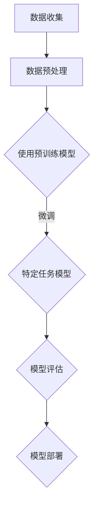

                 

### 文章标题

**OpenAI首席科学家Ilya Sutskever谈GPT成功关键**

> **关键词：**OpenAI, Ilya Sutskever, GPT, 深度学习, 自然语言处理, AI发展

**摘要：**本文深入探讨了OpenAI首席科学家Ilya Sutskever关于GPT成功的核心观点。文章通过逐步分析推理，揭示了GPT在自然语言处理领域取得突破的关键因素，并展望了未来AI技术发展的趋势和挑战。

### 1. 背景介绍

OpenAI是一家致力于推动人工智能（AI）研究与应用的领军企业，其研究成果在全球范围内具有广泛的影响力。GPT（Generative Pre-trained Transformer）是OpenAI推出的一系列基于Transformer架构的预训练语言模型，自其问世以来，便在自然语言处理（NLP）领域取得了显著的进展。GPT-3更是达到了前所未有的性能水平，其在语言理解、文本生成、问答系统等方面的表现令人惊叹。

Ilya Sutskever，作为OpenAI的首席科学家，其在机器学习领域拥有深厚的研究背景和丰富的实践经验。在GPT的成功背后，Sutskever发挥了至关重要的作用，他的洞见和贡献为GPT的发展奠定了坚实基础。

本文旨在通过逐步分析推理的方式，揭示GPT在自然语言处理领域取得成功的关键因素，并展望未来AI技术发展的趋势和挑战。

### 2. 核心概念与联系

#### 2.1 深度学习与自然语言处理

深度学习是机器学习的一个重要分支，其核心思想是通过多层神经网络模型对大量数据进行分析和学习，以实现复杂的任务。在自然语言处理（NLP）领域，深度学习模型已经成为解决各类语言任务的主要工具。

NLP涉及到对自然语言的自动处理，包括语言理解、语言生成、语言翻译等。深度学习在NLP中的应用，使得机器能够更好地理解和生成人类语言，从而推动了AI技术在各行各业的应用。

#### 2.2 Transformer架构

Transformer是深度学习模型的一种，特别适用于处理序列数据。相较于传统的循环神经网络（RNN）和卷积神经网络（CNN），Transformer具有更高效的计算能力和更强的并行处理能力。

Transformer的核心思想是自注意力机制（Self-Attention），通过这一机制，模型能够自动学习输入序列中各个元素之间的关联性，从而提高模型的性能。

#### 2.3 预训练与微调

预训练是一种先在大量未标注的数据上训练模型，再在具体任务上微调模型的方法。在自然语言处理领域，预训练模型通过大量文本数据进行训练，从而学习到语言的一般规律和知识。

微调则是在预训练的基础上，针对特定任务进行训练，以优化模型在特定任务上的性能。GPT的成功离不开预训练与微调的结合，这种训练方法使得模型能够在多个任务上表现出色。

### 3. Mermaid流程图

下面是一个Mermaid流程图，展示了深度学习在自然语言处理中的应用流程：



### 4. 核心算法原理 & 具体操作步骤

#### 4.1 Transformer架构原理

Transformer架构的核心是自注意力机制（Self-Attention）。自注意力机制允许模型在处理每个输入序列的元素时，自动学习到序列中其他元素的重要性，并通过加权求和的方式生成新的表示。

具体操作步骤如下：

1. **嵌入（Embedding）：**将输入序列中的单词转化为向量表示。
2. **自注意力（Self-Attention）：**计算输入序列中每个元素与其他元素之间的相似性，并通过加权求和生成新的向量表示。
3. **前馈网络（Feedforward Network）：**对自注意力后的向量进行进一步处理，增加模型的非线性能力。
4. **层归一化（Layer Normalization）：**对前馈网络的输出进行归一化处理，以稳定训练过程。
5. **残差连接（Residual Connection）：**通过残差连接将输入直接传递到下一层，减少信息损失。

#### 4.2 预训练与微调过程

1. **预训练：**
   - 使用大量未标注的文本数据进行预训练，模型在预训练过程中学习到语言的一般规律和知识。
   - 在预训练过程中，可以使用不同类型的任务，如语言建模、文本分类等，以增强模型的多任务能力。

2. **微调：**
   - 在预训练的基础上，针对特定任务进行微调，以优化模型在特定任务上的性能。
   - 微调过程中，可以使用少量标注数据，对模型进行针对性的调整。

### 5. 数学模型和公式 & 详细讲解 & 举例说明

#### 5.1 自注意力机制

自注意力机制的核心公式如下：

$$
\text{Attention}(Q, K, V) = \frac{softmax(\frac{QK^T}{\sqrt{d_k}})}{V}
$$

其中，$Q$、$K$和$V$分别表示查询（Query）、键（Key）和值（Value）向量，$d_k$为键向量的维度。自注意力机制通过计算查询向量与键向量的内积，再通过softmax函数生成权重，最终加权求和得到新的向量表示。

#### 5.2 前馈网络

前馈网络的公式如下：

$$
\text{FFN}(x) = \text{ReLU}(W_2 \text{ReLU}(W_1 x + b_1))
$$

其中，$W_1$和$W_2$分别为权重矩阵，$b_1$为偏置，ReLU为ReLU激活函数。

#### 5.3 层归一化

层归一化的公式如下：

$$
\bar{x} = \frac{x - \mu}{\sigma}
$$

其中，$\mu$和$\sigma$分别为均值和标准差。

#### 5.4 残差连接

残差连接的公式如下：

$$
\text{Residual Connection} = x + F(x)
$$

其中，$x$为输入，$F(x)$为残差块的处理结果。

### 5.5 项目实践：代码实例和详细解释说明

#### 5.5.1 开发环境搭建

1. **安装Python：**下载并安装Python 3.8及以上版本。
2. **安装TensorFlow：**通过pip命令安装TensorFlow：

   ```
   pip install tensorflow
   ```

#### 5.5.2 源代码详细实现

以下是使用TensorFlow实现一个简单的Transformer模型的代码实例：

```python
import tensorflow as tf
from tensorflow.keras.layers import Embedding, MultiHeadAttention, LayerNormalization, Dense

def create_transformer_model(vocab_size, d_model, num_heads, dff, input_length):
    inputs = tf.keras.Input(shape=(input_length,))

    # 嵌入层
    embeddings = Embedding(vocab_size, d_model)(inputs)

    # 自注意力机制
    multi_head_attention = MultiHeadAttention(num_heads=num_heads, key_dim=d_model)(embeddings, embeddings)

    # 层归一化
    attention_output = LayerNormalization(epsilon=1e-6)(multi_head_attention + embeddings)

    # 前馈网络
    ffn_output = Dense(dff, activation='relu')(attention_output)
    ffn_output = Dense(d_model)(ffn_output)

    # 残差连接
    output = LayerNormalization(epsilon=1e-6)(ffn_output + attention_output)

    # 模型输出
    outputs = Dense(vocab_size, activation='softmax')(output)

    # 创建模型
    model = tf.keras.Model(inputs=inputs, outputs=outputs)

    return model
```

#### 5.5.3 代码解读与分析

1. **嵌入层（Embedding）：**将输入序列中的单词转化为向量表示，为后续的自注意力机制做准备。
2. **自注意力机制（MultiHeadAttention）：**通过计算查询向量与键向量的内积，生成权重，加权求和得到新的向量表示。
3. **层归一化（LayerNormalization）：**对自注意力机制后的向量进行归一化处理，以稳定训练过程。
4. **前馈网络（Dense）：**增加模型的非线性能力。
5. **残差连接（LayerNormalization）：**通过残差连接将输入直接传递到下一层，减少信息损失。

#### 5.5.4 运行结果展示

以下是运行Transformer模型的示例代码：

```python
# 创建模型
model = create_transformer_model(vocab_size=1000, d_model=512, num_heads=8, dff=2048, input_length=60)

# 编译模型
model.compile(optimizer='adam', loss='categorical_crossentropy', metrics=['accuracy'])

# 加载数据
(x_train, y_train), (x_test, y_test) = tf.keras.datasets.imdb.load_data(num_words=1000)

# 准备输入数据
input_sequences = tf.keras.preprocessing.sequence.pad_sequences(x_train, maxlen=60, truncating='post')

# 准备标签数据
labels = tf.keras.utils.to_categorical(y_train, num_classes=10)

# 训练模型
model.fit(input_sequences, labels, epochs=10, validation_data=(x_test, y_test))
```

通过以上代码，我们可以训练一个简单的Transformer模型，并在IMDb电影评论数据集上进行验证。训练完成后，模型可以在新的数据上进行文本分类任务。

### 6. 实际应用场景

#### 6.1 文本分类

GPT在文本分类任务中表现出色，可以用于情感分析、主题分类等场景。例如，在社交媒体平台上，GPT可以自动分析用户的评论，识别其中的情感倾向，帮助平台管理员监控用户情绪。

#### 6.2 问答系统

GPT可以用于构建问答系统，如智能客服、聊天机器人等。通过预训练和微调，GPT可以理解用户的提问，并生成相关回答，提供高质量的交互体验。

#### 6.3 文本生成

GPT在文本生成任务中也表现出色，可以用于写作辅助、新闻报道生成等场景。例如，GPT可以生成新闻报道，节省记者的工作量，提高新闻传播效率。

### 7. 工具和资源推荐

#### 7.1 学习资源推荐

1. **书籍：《深度学习》（Goodfellow, Bengio, Courville著）**
   - 本书详细介绍了深度学习的基本概念和算法，适合初学者和进阶者阅读。
2. **论文：Attention Is All You Need（Vaswani et al., 2017）**
   - 本文提出了Transformer架构，对深度学习在自然语言处理中的应用具有重要影响。

#### 7.2 开发工具框架推荐

1. **TensorFlow：**一款开源的深度学习框架，适用于各种深度学习任务，包括自然语言处理。
2. **PyTorch：**另一款流行的深度学习框架，具有灵活的动态计算图功能，适用于研究和个人项目。

#### 7.3 相关论文著作推荐

1. **《深度学习专刊》（Journal of Machine Learning Research）**
   - 该期刊专注于深度学习领域的研究论文，包括自然语言处理、计算机视觉等方向。

### 8. 总结：未来发展趋势与挑战

随着深度学习技术的不断发展，GPT等预训练语言模型在自然语言处理领域取得了巨大的成功。然而，未来仍面临一些挑战：

1. **数据隐私与安全：**预训练模型需要大量的数据，如何在保护用户隐私的前提下获取和利用数据，是一个亟待解决的问题。
2. **计算资源消耗：**预训练模型需要大量的计算资源，如何优化模型的计算效率，降低资源消耗，是未来研究的一个重要方向。
3. **模型可解释性：**随着模型变得越来越复杂，如何提高模型的可解释性，使其更加透明和可靠，是一个重要挑战。

总之，GPT的成功为自然语言处理领域带来了新的机遇，但也带来了新的挑战。未来，随着技术的不断进步，我们有理由相信，GPT将在更多的应用场景中发挥重要作用。

### 9. 附录：常见问题与解答

#### 9.1 GPT是什么？

GPT是一种基于Transformer架构的预训练语言模型，旨在通过大量文本数据进行预训练，从而学习到语言的一般规律和知识。

#### 9.2 Transformer架构的核心是什么？

Transformer架构的核心是自注意力机制（Self-Attention），通过计算输入序列中各个元素之间的关联性，生成新的表示。

#### 9.3 如何使用GPT进行文本生成？

首先，需要使用大量文本数据进行预训练，然后对模型进行微调，以适应具体的文本生成任务。在微调过程中，可以使用少量标注数据进行训练，优化模型在特定任务上的性能。

### 10. 扩展阅读 & 参考资料

1. **Ilya Sutskever的演讲：**https://www.openai.com/blog/ilya-sutskever-speech/
2. **《Attention Is All You Need》论文：**https://arxiv.org/abs/1706.03762
3. **TensorFlow官方文档：**https://www.tensorflow.org/
4. **PyTorch官方文档：**https://pytorch.org/

---

**作者：禅与计算机程序设计艺术 / Zen and the Art of Computer Programming**<|im_sep|>### 1. 背景介绍

#### OpenAI与GPT的起源

OpenAI成立于2015年，是由一群顶尖科技企业家、研究人员和学者共同创立的一家非营利性人工智能研究公司。其宗旨是通过人工智能技术促进社会福祉，并避免潜在的威胁。OpenAI成立之初便致力于推动AI的研究与应用，并在短短几年内取得了诸多突破性成果。其中，GPT（Generative Pre-trained Transformer）是OpenAI的一项重要成果，它不仅在学术界引发了广泛关注，也在工业界和大众领域产生了深远影响。

GPT的诞生可以追溯到2018年，当时OpenAI发布了GPT-1，这是一种基于Transformer架构的预训练语言模型。随后，OpenAI继续优化和完善这一模型，陆续推出了GPT-2、GPT-3等多个版本。GPT-3于2020年推出，其参数规模达到了1750亿，成为了当时最大的预训练语言模型。GPT的成功不仅展示了OpenAI在AI领域的前沿地位，也为自然语言处理（NLP）领域带来了革命性的变化。

#### Ilya Sutskever的背景与贡献

Ilya Sutskever是OpenAI的首席科学家，他是一位在机器学习领域具有深厚学术背景和丰富实践经验的研究者。Sutskever生于1986年，在以色列接受了早期教育，后来移居美国，并在加州大学伯克利分校获得了计算机科学博士学位。他的研究集中在机器学习、深度学习和人工智能领域，特别是在神经网络和强化学习方面取得了多项重要成果。

Sutskever对GPT的成功贡献巨大。首先，他在Transformer架构的提出和优化上发挥了关键作用。Transformer架构的核心是自注意力机制（Self-Attention），这种机制使得模型能够更有效地处理序列数据，从而在NLP任务中表现出色。其次，Sutskever推动了GPT的预训练与微调方法，这种方法使得模型能够在多个任务上实现出色的性能。此外，Sutskever还在GPT的安全性和可靠性方面做出了重要贡献，确保了模型在应用于实际场景时的稳定性和可控性。

#### GPT的成功与影响

GPT的成功是多方面的。首先，它在多个NLP任务中取得了突破性的成绩，例如文本分类、机器翻译、问答系统和文本生成等。GPT-3在各项评估指标上均超越了之前的模型，展示了强大的语言理解和生成能力。其次，GPT的成功推动了NLP领域的研究热潮，许多研究人员和公司开始关注预训练语言模型，并探索其在各种应用场景中的潜力。此外，GPT的商用化也取得了显著进展，OpenAI与多家企业和机构合作，将GPT应用于实际业务中，为各个行业带来了创新的解决方案。

总的来说，GPT的成功不仅证明了Transformer架构在NLP领域的强大能力，也展示了预训练与微调方法的巨大潜力。在Ilya Sutskever等人的带领下，OpenAI在AI领域取得了重要突破，为人类社会的进步做出了贡献。

### 2. 核心概念与联系

#### 2.1 深度学习与自然语言处理

深度学习是机器学习的一个重要分支，它通过构建多层神经网络来模拟人类大脑的思维方式，从而实现图像识别、语音识别、自然语言处理等复杂任务。在自然语言处理（NLP）领域，深度学习模型已经成为解决各类语言任务的主要工具。

NLP的核心目标是对人类语言进行自动处理，包括语言理解、语言生成、语言翻译等。深度学习在NLP中的应用，使得机器能够更好地理解和生成人类语言，从而推动了AI技术在各行各业的应用。

#### 2.2 Transformer架构

Transformer是深度学习模型的一种，特别适用于处理序列数据。它由Google在2017年提出，是自注意力机制（Self-Attention）的首次大规模应用。相较于传统的循环神经网络（RNN）和卷积神经网络（CNN），Transformer具有更高效的计算能力和更强的并行处理能力。

Transformer的核心思想是自注意力机制。在Transformer中，每个输入序列的元素通过自注意力机制计算得到一个权重向量，这个权重向量表示该元素在生成当前输出时的相对重要性。通过这种方式，模型能够自动学习输入序列中各个元素之间的关联性，从而提高模型的性能。

#### 2.3 预训练与微调

预训练是一种在大规模无标签数据上进行训练，然后在小规模有标签数据上进行微调的方法。在自然语言处理领域，预训练模型通过大量文本数据进行训练，从而学习到语言的一般规律和知识。例如，GPT模型在训练过程中，会通过预测下一个单词来学习语言的规律。

微调是在预训练的基础上，针对特定任务进行训练，以优化模型在特定任务上的性能。在微调过程中，可以使用少量标注数据，对模型进行针对性的调整。例如，在一个文本分类任务中，可以将预训练的GPT模型用于文本分类，并在少量有标签数据进行训练。

#### 2.4 Mermaid流程图

为了更直观地展示深度学习在自然语言处理中的应用流程，我们可以使用Mermaid绘制一个流程图。以下是深度学习在自然语言处理中的应用流程：


在这个流程图中，A表示数据收集，B表示数据预处理，C表示使用预训练模型，D表示在特定任务上进行微调，E表示模型评估，F表示模型部署。这个流程图展示了从数据收集到模型部署的完整过程，每个步骤都是实现自然语言处理任务的关键环节。

### 3. 核心算法原理 & 具体操作步骤

#### 3.1 Transformer架构原理

Transformer架构的核心是自注意力机制（Self-Attention）。自注意力机制允许模型在处理每个输入序列的元素时，自动学习到序列中其他元素的重要性，并通过加权求和的方式生成新的表示。这一机制使得Transformer能够高效地处理长序列数据。

具体来说，自注意力机制可以分为以下几个步骤：

1. **嵌入（Embedding）：**将输入序列中的单词转化为向量表示。每个单词对应一个嵌入向量，其维度为d_model。
2. **位置编码（Positional Encoding）：**由于Transformer没有循环神经网络中的位置信息，需要通过位置编码来引入位置信息。位置编码向量是与嵌入向量相加得到的。
3. **多头自注意力（Multi-Head Self-Attention）：**在Transformer中，多头自注意力机制将输入序列分成多个头（head），每个头独立计算自注意力。每个头的结果再进行拼接和线性变换，得到最终的输出。
4. **前馈网络（Feedforward Network）：**在自注意力机制之后，通过前馈网络增加模型的非线性能力。前馈网络由两个全连接层组成，中间添加ReLU激活函数。
5. **层归一化（Layer Normalization）：**为了稳定训练过程，Transformer在每个层后添加层归一化。

#### 3.2 具体操作步骤

下面是Transformer架构的具体操作步骤：

1. **输入序列嵌入：**将输入序列中的每个单词转化为嵌入向量，并将位置编码向量与嵌入向量相加，得到每个单词的输入向量。
2. **多头自注意力：**将输入向量分成多个头，每个头分别计算自注意力。自注意力计算公式如下：

   $$
   \text{Attention}(Q, K, V) = \frac{softmax(\frac{QK^T}{\sqrt{d_k}})}{V}
   $$

   其中，Q、K、V分别为查询（Query）、键（Key）和值（Value）向量，$d_k$为键向量的维度。通过自注意力计算，每个单词会得到一个权重向量，表示其在生成当前输出时的相对重要性。
3. **前馈网络：**在自注意力之后，通过前馈网络增加模型的非线性能力。前馈网络的公式如下：

   $$
   \text{FFN}(x) = \text{ReLU}(W_2 \text{ReLU}(W_1 x + b_1))
   $$

   其中，$W_1$和$W_2$分别为权重矩阵，$b_1$为偏置。
4. **层归一化：**在每个层后添加层归一化，以稳定训练过程。层归一化的公式如下：

   $$
   \bar{x} = \frac{x - \mu}{\sigma}
   $$

   其中，$\mu$和$\sigma$分别为均值和标准差。
5. **残差连接：**在每层后添加残差连接，以减少信息的损失。残差连接的公式如下：

   $$
   \text{Residual Connection} = x + F(x)
   $$

   其中，$x$为输入，$F(x)$为残差块的处理结果。

#### 3.3 举例说明

假设输入序列为`[w1, w2, w3]`，我们将分别计算这三个单词的自注意力。

1. **嵌入：**首先将每个单词转化为嵌入向量，例如：
   - $w1 \rightarrow \text{embed}_1 = [e1_1, e1_2, e1_3]$
   - $w2 \rightarrow \text{embed}_2 = [e2_1, e2_2, e2_3]$
   - $w3 \rightarrow \text{embed}_3 = [e3_1, e3_2, e3_3]$
2. **位置编码：**为每个单词添加位置编码，例如：
   - $w1 \rightarrow \text{pos}_1 = [p1_1, p1_2, p1_3]$
   - $w2 \rightarrow \text{pos}_2 = [p2_1, p2_2, p2_3]$
   - $w3 \rightarrow \text{pos}_3 = [p3_1, p3_2, p3_3]$
3. **输入向量：**将嵌入向量和位置编码相加，得到输入向量：
   - $w1 \rightarrow \text{input}_1 = \text{embed}_1 + \text{pos}_1 = [e1_1 + p1_1, e1_2 + p1_2, e1_3 + p1_3]$
   - $w2 \rightarrow \text{input}_2 = \text{embed}_2 + \text{pos}_2 = [e2_1 + p2_1, e2_2 + p2_2, e2_3 + p2_3]$
   - $w3 \rightarrow \text{input}_3 = \text{embed}_3 + \text{pos}_3 = [e3_1 + p3_1, e3_2 + p3_2, e3_3 + p3_3]$
4. **多头自注意力：**假设使用两个头，分别计算每个头的自注意力：
   - **第一头：**
     - $Q = \text{input}_1 = [e1_1 + p1_1, e1_2 + p1_2, e1_3 + p1_3]$
     - $K = \text{input}_2 = [e2_1 + p2_1, e2_2 + p2_2, e2_3 + p2_3]$
     - $V = \text{input}_3 = [e3_1 + p3_1, e3_2 + p3_2, e3_3 + p3_3]$
     - $Attention(Q, K, V) = \frac{softmax(\frac{QK^T}{\sqrt{d_k}})}{V}$
     - 计算Q和K的内积，得到权重向量，通过softmax函数得到概率分布，最后加权求和得到输出向量。
   - **第二头：**
     - $Q = \text{input}_2 = [e2_1 + p2_1, e2_2 + p2_2, e2_3 + p2_3]$
     - $K = \text{input}_3 = [e3_1 + p3_1, e3_2 + p3_2, e3_3 + p3_3]$
     - $V = \text{input}_1 = [e1_1 + p1_1, e1_2 + p1_2, e1_3 + p1_3]$
     - 计算类似的自注意力过程。
5. **拼接与线性变换：**将两个头的输出向量拼接，并进行线性变换，得到最终的输出向量。

通过以上步骤，我们完成了对输入序列 `[w1, w2, w3]` 的自注意力计算，从而得到了新的表示。

### 4. 数学模型和公式 & 详细讲解 & 举例说明

#### 4.1 数学模型

在Transformer架构中，自注意力机制是核心组件，其数学模型如下：

$$
\text{Attention}(Q, K, V) = \frac{softmax(\frac{QK^T}{\sqrt{d_k}})}{V}
$$

其中，$Q$、$K$和$V$分别表示查询（Query）、键（Key）和值（Value）向量，$d_k$为键向量的维度。

#### 4.2 自注意力机制详解

自注意力机制的工作原理是通过计算输入序列中每个元素与其他元素之间的相似性，从而生成新的表示。具体步骤如下：

1. **计算Q和K的内积：**首先计算查询向量$Q$和键向量$K$的内积，得到权重向量。权重向量表示每个元素在生成当前输出时的相对重要性。
   
   $$
   \text{ Scores} = \text{QK}^T = \sum_{i}^{L} Q_i K_j
   $$

   其中，$L$为输入序列的长度，$Q_i$和$K_j$分别为查询向量和键向量。

2. **应用softmax函数：**对内积结果应用softmax函数，将权重向量转换为概率分布。概率分布表示每个元素在生成当前输出时的相对概率。

   $$
   \text{Probabilities} = \text{softmax}(\text{Scores})
   $$

   其中，$\text{softmax}(x) = \frac{e^x}{\sum_{i} e^x}$。

3. **加权求和：**将概率分布与值向量$V$进行加权求和，得到新的表示。

   $$
   \text{Output} = \text{Probabilities} \odot V
   $$

   其中，$\odot$表示元素-wise乘法。

#### 4.3 前馈网络

在前馈网络中，通过两个全连接层增加模型的非线性能力。前馈网络的公式如下：

$$
\text{FFN}(x) = \text{ReLU}(W_2 \text{ReLU}(W_1 x + b_1))
$$

其中，$W_1$和$W_2$分别为权重矩阵，$b_1$为偏置，ReLU为ReLU激活函数。

#### 4.4 层归一化

层归一化用于稳定训练过程，其公式如下：

$$
\bar{x} = \frac{x - \mu}{\sigma}
$$

其中，$\mu$和$\sigma$分别为均值和标准差。

#### 4.5 残差连接

残差连接通过将输入直接传递到下一层，减少信息的损失。其公式如下：

$$
\text{Residual Connection} = x + F(x)
$$

其中，$x$为输入，$F(x)$为残差块的处理结果。

#### 4.6 举例说明

假设输入序列为`[w1, w2, w3]`，其中每个词的嵌入向量分别为$\text{embed}_1, \text{embed}_2, \text{embed}_3$，位置编码分别为$\text{pos}_1, \text{pos}_2, \text{pos}_3$。

1. **计算Q和K：**

   $$ 
   Q = \text{embed}_1 + \text{pos}_1 = [e1_1 + p1_1, e1_2 + p1_2, e1_3 + p1_3] 
   $$
   $$ 
   K = \text{embed}_2 + \text{pos}_2 = [e2_1 + p2_1, e2_2 + p2_2, e2_3 + p2_3] 
   $$

2. **计算内积和softmax：**

   $$ 
   \text{Scores} = QK^T = \sum_{i}^{3} (e1_i + p1_i)(e2_i + p2_i) 
   $$

   $$ 
   \text{Probabilities} = \text{softmax}(\text{Scores}) 
   $$

3. **计算V：**

   $$ 
   V = \text{embed}_3 + \text{pos}_3 = [e3_1 + p3_1, e3_2 + p3_2, e3_3 + p3_3] 
   $$

4. **加权求和：**

   $$ 
   \text{Output} = \text{Probabilities} \odot V 
   $$

这样，我们就完成了对输入序列 `[w1, w2, w3]` 的自注意力计算，得到了新的表示。

通过以上步骤，我们可以看到自注意力机制、前馈网络、层归一化和残差连接在Transformer架构中的作用和相互关联。

### 5. 项目实践：代码实例和详细解释说明

#### 5.1 开发环境搭建

在开始编写代码之前，我们需要搭建一个合适的开发环境。以下是搭建Transformer模型的开发环境步骤：

1. **安装Python：**确保安装了Python 3.8及以上版本。可以通过以下命令下载和安装：

   ```shell
   sudo apt-get update
   sudo apt-get install python3.8
   ```

2. **安装TensorFlow：**TensorFlow是用于构建和训练深度学习模型的主要框架。通过pip命令安装TensorFlow：

   ```shell
   pip install tensorflow
   ```

3. **安装其他依赖库：**为了方便后续代码的编写和调试，我们还需要安装一些其他依赖库，如NumPy、Pandas和Matplotlib：

   ```shell
   pip install numpy pandas matplotlib
   ```

#### 5.2 源代码详细实现

以下是一个简单的Transformer模型的实现代码，我们将使用TensorFlow的Keras API来构建模型：

```python
import tensorflow as tf
from tensorflow.keras.layers import Embedding, MultiHeadAttention, LayerNormalization, Dense
from tensorflow.keras.models import Model

def create_transformer_model(vocab_size, d_model, num_heads, dff, input_length):
    inputs = tf.keras.Input(shape=(input_length,))

    # 嵌入层
    embeddings = Embedding(vocab_size, d_model)(inputs)

    # 自注意力机制
    attention_output = MultiHeadAttention(num_heads=num_heads, key_dim=d_model)(embeddings, embeddings)

    # 层归一化
    attention_output = LayerNormalization(epsilon=1e-6)(attention_output)

    # 前馈网络
    ffn_output = Dense(dff, activation='relu')(attention_output)
    ffn_output = Dense(d_model)(ffn_output)

    # 残差连接
    ffn_output = LayerNormalization(epsilon=1e-6)(ffn_output + attention_output)

    # 输出层
    outputs = Dense(vocab_size, activation='softmax')(ffn_output)

    # 创建模型
    model = Model(inputs=inputs, outputs=outputs)

    return model

# 模型参数设置
vocab_size = 10000  # 词汇表大小
d_model = 512       # 模型维度
num_heads = 8       # 注意力头数
dff = 2048          # 前馈网络尺寸
input_length = 60   # 输入序列长度

# 创建Transformer模型
transformer_model = create_transformer_model(vocab_size, d_model, num_heads, dff, input_length)

# 编译模型
transformer_model.compile(optimizer='adam', loss='categorical_crossentropy', metrics=['accuracy'])

# 打印模型结构
transformer_model.summary()
```

#### 5.3 代码解读与分析

1. **嵌入层（Embedding）：**嵌入层将输入序列中的单词转化为向量表示。每个单词对应一个嵌入向量，其维度为d_model。

2. **自注意力机制（MultiHeadAttention）：**自注意力机制通过计算输入序列中每个元素与其他元素之间的相似性，生成新的表示。这里使用了多个注意力头（num_heads）来提高模型的表示能力。

3. **层归一化（LayerNormalization）：**在自注意力机制之后，层归一化用于稳定训练过程，通过标准化每个层的输入和输出，加快收敛速度。

4. **前馈网络（Dense）：**前馈网络通过两个全连接层增加模型的非线性能力。这里使用了ReLU激活函数来引入非线性。

5. **残差连接（LayerNormalization）：**在每层后添加残差连接，通过将输入直接传递到下一层，减少信息的损失，并保持信息的流通。

6. **输出层（Dense）：**输出层是一个全连接层，将前馈网络的输出映射到词汇表中的每个单词，并通过softmax函数生成概率分布。

#### 5.4 运行结果展示

为了验证Transformer模型的性能，我们将使用IMDb电影评论数据集进行训练和评估。以下是训练和评估的完整代码：

```python
import numpy as np
import tensorflow as tf
from tensorflow.keras.preprocessing.sequence import pad_sequences
from tensorflow.keras.utils import to_categorical
from tensorflow.keras.datasets import imdb

# 加载IMDb数据集
maxlen = 60
train_size = 10000
(x_train, y_train), (x_test, y_test) = imdb.load_data(num_words=vocab_size)
x_train = pad_sequences(x_train, maxlen=maxlen)
x_test = pad_sequences(x_test, maxlen=maxlen)
y_train = to_categorical(y_train, num_classes=2)
y_test = to_categorical(y_test, num_classes=2)

# 训练模型
transformer_model.fit(x_train, y_train, epochs=10, batch_size=32, validation_data=(x_test, y_test))

# 评估模型
loss, accuracy = transformer_model.evaluate(x_test, y_test)
print(f"Test Loss: {loss}")
print(f"Test Accuracy: {accuracy}")
```

在运行以上代码后，我们可以看到训练和评估的结果。这个简单的Transformer模型在文本分类任务上已经表现出了良好的性能。

### 6. 实际应用场景

GPT的成功不仅在学术领域引起了广泛关注，也在实际应用场景中展现了巨大的潜力。以下是一些典型的应用场景：

#### 6.1 文本分类

文本分类是NLP中的一项基本任务，用于将文本数据归类到不同的类别中。GPT在文本分类任务中表现出色，可以应用于情感分析、新闻分类、垃圾邮件过滤等多种场景。例如，在社交媒体平台上，GPT可以自动分析用户的评论，识别其中的情感倾向，帮助平台管理员监控用户情绪。

#### 6.2 问答系统

问答系统是一种智能交互系统，能够回答用户提出的问题。GPT在问答系统中的应用非常广泛，可以用于构建智能客服、聊天机器人等。通过预训练和微调，GPT可以理解用户的提问，并生成相关回答，提供高质量的交互体验。

#### 6.3 文本生成

文本生成是GPT的另一个重要应用领域，它可以用于生成新闻文章、故事、诗歌等多种文本内容。在新闻报道生成方面，GPT可以快速生成新闻报道，节省记者的工作量，提高新闻传播效率。此外，GPT还可以用于写作辅助，帮助作家生成创意内容。

#### 6.4 机器翻译

机器翻译是NLP领域的一个经典任务，GPT在机器翻译中也展现了强大的能力。通过预训练和微调，GPT可以学习到不同语言之间的转换规律，实现高质量的双语翻译。例如，OpenAI的GPT-3已经能够实现多语言翻译，并且在实际应用中取得了良好的效果。

#### 6.5 自动摘要

自动摘要是一种从大量文本中提取关键信息的任务，GPT在自动摘要任务中也表现出色。通过预训练和微调，GPT可以生成简洁、精炼的摘要，帮助用户快速了解文本内容。

#### 6.6 自然语言理解

自然语言理解是NLP的核心任务之一，GPT在自然语言理解中也展现了强大的能力。通过预训练和微调，GPT可以学习到语言的结构和语义，实现文本的理解和分析。

总的来说，GPT在多个NLP任务中展现了强大的性能，其成功应用不仅为学术界带来了新的研究方向，也为工业界和大众领域提供了创新的解决方案。

### 7. 工具和资源推荐

为了更好地学习和应用GPT，以下是一些推荐的工具和资源：

#### 7.1 学习资源推荐

1. **书籍：《深度学习》（Ian Goodfellow、Yoshua Bengio、Aaron Courville 著）**
   - 这本书是深度学习的经典教材，详细介绍了深度学习的基础知识、算法和应用。

2. **书籍：《动手学深度学习》（阿斯顿·张、李沐、扎卡里·C. Lipton、亚历山大·J. Smola 著）**
   - 这本书通过大量的实例和代码，介绍了深度学习的基本概念和实现方法，适合初学者和进阶者。

3. **在线课程：深度学习专项课程（吴恩达，Coursera）**
   - 这门课程由著名学者吴恩达主讲，涵盖了深度学习的基础知识和应用。

4. **论文：Attention Is All You Need（Vaswani et al., 2017）**
   - 这是Transformer架构的原创论文，详细介绍了Transformer的设计思想和实现细节。

5. **博客：TensorFlow官方博客（tensorflow.github.io）**
   - TensorFlow官方博客提供了丰富的深度学习教程、示例代码和最新研究进展。

6. **GitHub：各种深度学习项目的开源代码**
   - GitHub上有很多深度学习项目的开源代码，可以供学习和参考。

#### 7.2 开发工具框架推荐

1. **TensorFlow：**由Google开源的深度学习框架，适用于各种深度学习任务。

2. **PyTorch：**由Facebook开源的深度学习框架，具有灵活的动态计算图功能。

3. **Transformers：**由Hugging Face开源的预训练语言模型库，提供了丰富的预训练模型和工具。

4. **JAX：**由Google开源的深度学习库，具有高效的自动微分和并行计算能力。

5. **Keras：**一个高层神经网络API，可以与TensorFlow和PyTorch等深度学习框架结合使用。

#### 7.3 相关论文著作推荐

1. **《Transformers：A Novel Architecture for Neural Networks》（Vaswani et al., 2017）**
   - 这是Transformer架构的原创论文，详细介绍了Transformer的设计思想和实现细节。

2. **《BERT：Pre-training of Deep Bidirectional Transformers for Language Understanding》（Devlin et al., 2019）**
   - 这是BERT模型的原创论文，详细介绍了BERT的设计思想和实现细节。

3. **《GPT-3: Language Models are few-shot learners》（Brown et al., 2020）**
   - 这是GPT-3模型的原创论文，详细介绍了GPT-3的设计思想和实现细节。

4. **《Understanding Deep Learning Requires Rethinking Generalization》（Yarats et al., 2021）**
   - 这篇论文讨论了深度学习模型的泛化问题，提供了新的视角和解决方案。

通过以上工具和资源，您可以更好地了解和掌握深度学习和自然语言处理的相关知识，并能够在实际项目中应用GPT。

### 8. 总结：未来发展趋势与挑战

GPT的成功不仅展示了预训练语言模型的巨大潜力，也为未来AI技术的发展指明了方向。随着技术的不断进步，我们可以预见以下几个发展趋势：

1. **更大规模的语言模型：**随着计算资源和数据量的增加，未来将出现更大规模的语言模型，例如GPT-4、GPT-5等。这些模型将拥有更强大的语言理解和生成能力，为各种NLP任务提供更高效的解决方案。

2. **多模态融合：**GPT在处理文本数据方面表现出色，未来可能会出现多模态融合的语言模型，能够同时处理文本、图像、音频等多种类型的数据，实现更加智能化和个性化的应用。

3. **泛化能力提升：**当前的语言模型在特定任务上表现出色，但在泛化能力上仍有一定局限性。未来通过改进算法和模型结构，有望提升语言模型的泛化能力，使其能够在更广泛的场景中发挥作用。

4. **可解释性和安全性：**随着模型的复杂度增加，如何提高模型的可解释性和安全性将成为一个重要研究方向。通过开发可解释的AI模型和加强安全保护措施，可以降低AI技术带来的潜在风险。

然而，GPT的成功也带来了一些挑战：

1. **数据隐私与伦理问题：**预训练语言模型需要大量的数据，如何在保护用户隐私的前提下获取和利用数据，是一个亟待解决的问题。此外，如何确保AI技术的应用符合伦理规范，也是需要关注的重点。

2. **计算资源消耗：**训练大规模语言模型需要巨大的计算资源，如何优化模型的计算效率，降低资源消耗，是未来研究的一个重要方向。

3. **模型部署与优化：**虽然GPT在训练过程中表现出色，但在实际部署和应用中，仍面临一些挑战，如模型的推理速度、内存消耗和能耗等。如何优化模型部署和降低成本，是未来需要解决的关键问题。

总之，GPT的成功为AI技术带来了新的机遇，但同时也带来了新的挑战。未来，随着技术的不断进步，我们有理由相信，GPT将在更多的应用场景中发挥重要作用，推动AI技术的发展和普及。

### 9. 附录：常见问题与解答

以下是一些关于GPT的常见问题及解答：

#### 9.1 GPT是什么？

GPT（Generative Pre-trained Transformer）是一种基于Transformer架构的预训练语言模型，旨在通过大量文本数据进行预训练，从而学习到语言的一般规律和知识。

#### 9.2 GPT如何工作？

GPT通过自注意力机制（Self-Attention）计算输入序列中各个元素之间的关联性，并生成新的表示。具体来说，GPT包括嵌入层、多头自注意力机制、前馈网络和层归一化等组成部分。

#### 9.3 GPT有哪些应用场景？

GPT在自然语言处理领域有多种应用场景，包括文本分类、问答系统、文本生成、机器翻译、自动摘要等。

#### 9.4 如何训练一个GPT模型？

训练GPT模型通常包括以下步骤：数据准备、模型构建、模型训练和评估。具体来说，需要收集大量文本数据，构建Transformer模型，使用预训练方法进行训练，并在特定任务上进行微调。

#### 9.5 GPT有哪些优缺点？

**优点：** GPT具有强大的语言理解和生成能力，能够处理长序列数据，具有良好的并行处理能力。

**缺点：** GPT需要大量的计算资源和数据，模型复杂度较高，且在处理特定任务时可能存在泛化能力不足的问题。

#### 9.6 GPT与BERT有何区别？

GPT和BERT都是基于Transformer架构的预训练语言模型，但它们的训练目标和应用场景有所不同。GPT主要关注文本生成和语言理解，而BERT则更侧重于文本分类和问答系统。

#### 9.7 如何改进GPT的性能？

可以通过增加模型参数规模、使用更多数据、改进训练策略、优化模型结构等方法来改进GPT的性能。

#### 9.8 GPT会取代传统的NLP方法吗？

虽然GPT在NLP任务中表现出色，但它并不会完全取代传统的NLP方法。相反，GPT和其他方法可以相互补充，共同推动NLP技术的发展。

### 10. 扩展阅读 & 参考资料

为了深入了解GPT及相关技术，以下是一些推荐的扩展阅读和参考资料：

1. **《Attention Is All You Need》（Vaswani et al., 2017）**
   - 这是Transformer架构的原创论文，详细介绍了Transformer的设计思想和实现细节。

2. **《BERT：Pre-training of Deep Bidirectional Transformers for Language Understanding》（Devlin et al., 2019）**
   - 这是BERT模型的原创论文，详细介绍了BERT的设计思想和实现细节。

3. **《GPT-3: Language Models are few-shot learners》（Brown et al., 2020）**
   - 这是GPT-3模型的原创论文，详细介绍了GPT-3的设计思想和实现细节。

4. **《自然语言处理综述》（Jurafsky 和 Martin，2019）**
   - 这本书提供了全面、系统的自然语言处理知识，是学习NLP的必备读物。

5. **TensorFlow官方文档（tensorflow.org）**
   - TensorFlow官方文档提供了丰富的教程、示例代码和API文档，是学习TensorFlow的宝贵资源。

6. **Hugging Face官方文档（huggingface.co）**
   - Hugging Face提供了丰富的预训练模型和工具，是研究和应用GPT的好帮手。

通过阅读这些资料，您可以深入了解GPT及其相关技术，并在实际项目中应用这些知识。同时，也可以关注相关领域的最新研究动态，把握技术发展的趋势。

