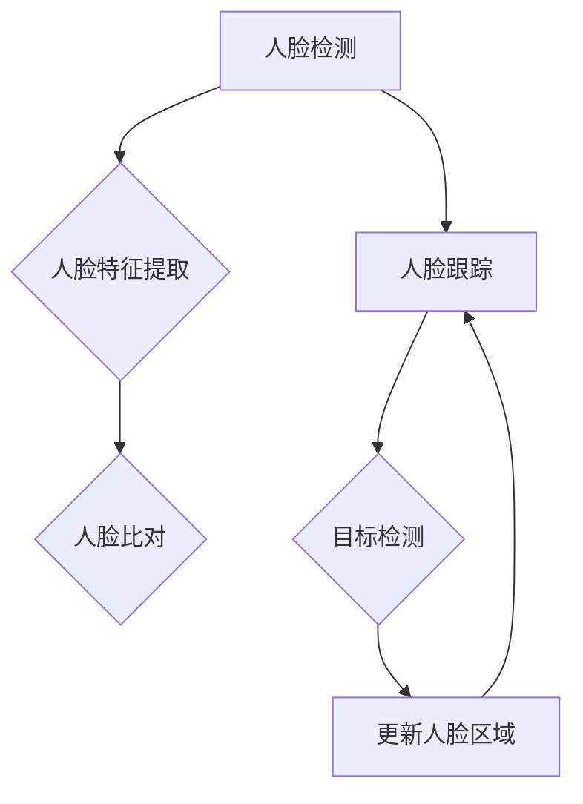

                 

# OpenCV人脸识别与跟踪

## 摘要

本文旨在深入探讨OpenCV库中的人脸识别与跟踪技术。我们将从背景介绍开始，解析核心概念与原理，详细讲解核心算法及其操作步骤，展示数学模型和公式，并通过项目实践代码实例进行解读与分析。最后，我们将探讨实际应用场景，推荐相关工具和资源，总结未来发展趋势与挑战，并提供常见问题解答。

## 1. 背景介绍

人脸识别与跟踪技术在计算机视觉领域有着广泛的应用，例如安全监控、身份验证、人脸美颜等。OpenCV（Open Source Computer Vision Library）是一个强大的开源计算机视觉库，支持多种编程语言，包括Python、C++等。OpenCV提供了丰富的人脸识别与跟踪算法，使其在工业界和学术界得到了广泛应用。

随着深度学习技术的快速发展，人脸识别与跟踪技术的准确性和实时性得到了显著提升。然而，传统的人脸识别与跟踪算法仍然具有很高的实用价值，尤其是在资源受限的设备上。OpenCV库提供了丰富的传统算法和现代深度学习算法，为开发者提供了极大的灵活性。

本文将首先介绍OpenCV库的基本使用方法，然后详细解析人脸识别与跟踪的核心算法原理，并提供一个完整的实战项目，以帮助读者深入理解并掌握这一技术。

## 2. 核心概念与联系

### 2.1 人脸识别

人脸识别是指通过计算机算法识别或验证人脸身份的技术。其主要步骤包括人脸检测、人脸特征提取和人脸比对。

- **人脸检测**：通过图像处理技术检测图像中的人脸区域。
- **人脸特征提取**：从人脸图像中提取具有区分性的特征向量。
- **人脸比对**：将提取到的特征向量与数据库中的人脸特征进行比较，以确定身份。

### 2.2 人脸跟踪

人脸跟踪是指在不同帧之间跟踪人脸区域的技术。其主要目的是实时监测人脸在视频序列中的运动。

- **跟踪算法**：包括光流法、粒子滤波、Kalman滤波等。
- **目标检测**：在视频帧中检测并跟踪人脸区域。

### 2.3 OpenCV流程图

以下是一个简单的Mermaid流程图，展示了人脸识别与跟踪的基本流程：



在这个流程图中，我们可以看到人脸识别和人脸跟踪是相互关联的。人脸识别用于身份验证，而人脸跟踪用于实时监测。

## 3. 核心算法原理 & 具体操作步骤

### 3.1 人脸识别算法原理

人脸识别的核心在于人脸特征的提取和比对。

#### 3.1.1 人脸特征提取

人脸特征提取是利用机器学习算法从人脸图像中提取具有区分性的特征向量。常用的算法包括LBP（局部二值模式）、HOG（方向梯度直方图）和Eigenfaces等。

- **LBP**：通过计算图像中每个像素点与其邻域像素点的二值关系来提取特征。
- **HOG**：通过计算图像中每个区域的方向梯度直方图来提取特征。
- **Eigenfaces**：通过主成分分析（PCA）从大量人脸图像中提取最具代表性的特征向量。

#### 3.1.2 人脸比对

人脸比对是指将提取到的人脸特征与数据库中的人脸特征进行匹配。常用的比对方法包括欧氏距离、余弦相似度和Nearest Neighbor（KNN）等。

### 3.2 人脸跟踪算法原理

人脸跟踪是基于目标检测和人脸识别的连续过程。常用的跟踪算法包括光流法、粒子滤波和Kalman滤波等。

- **光流法**：通过计算视频帧之间的像素运动来跟踪目标。
- **粒子滤波**：通过在图像中分布大量粒子来估计目标的位置。
- **Kalman滤波**：通过状态估计和预测来跟踪目标。

### 3.3 具体操作步骤

以下是使用OpenCV进行人脸识别与跟踪的步骤：

#### 3.3.1 人脸检测

1. **加载预训练的人脸检测模型**：
    ```python
    cascade_path = "haarcascade_frontalface_default.xml"
    face_cascade = cv2.CascadeClassifier(cascade_path)
    ```

2. **读取图像或视频**：
    ```python
    cap = cv2.VideoCapture(0)  # 使用相机
    ```

3. **检测人脸区域**：
    ```python
    while True:
        ret, frame = cap.read()
        gray = cv2.cvtColor(frame, cv2.COLOR_BGR2GRAY)
        faces = face_cascade.detectMultiScale(gray, 1.3, 5)
        for (x, y, w, h) in faces:
            cv2.rectangle(frame, (x, y), (x+w, y+h), (255, 0, 0), 2)
        cv2.imshow('Frame', frame)
        if cv2.waitKey(20) & 0xFF == ord('q'):
            break
    cap.release()
    cv2.destroyAllWindows()
    ```

#### 3.3.2 人脸特征提取与比对

1. **提取人脸特征**：
    ```python
    face_model = cv2.face.EigenFaceRecognizer_create()
    face_model.read("face_model.yml")
    labels = {"person_name": 1}
    y_labels = []
    x_train = []
    for face in faces:
        face = cv2.resize(face, (72, 72))
        x_train.append(face)
        y_labels.append(labels["person_name"])
    x_train = np.array(x_train)
    y_labels = np.array(y_labels)
    ```

2. **训练模型**：
    ```python
    face_model.train(x_train, y_labels)
    ```

3. **比对人脸**：
    ```python
    for (x, y, w, h) in faces:
        face = frame[y:y+h, x:x+w]
        face = cv2.resize(face, (72, 72))
        label, confidence = face_model.predict(face)
        print(f"Label: {label}, Confidence: {confidence}")
    ```

#### 3.3.3 人脸跟踪

1. **初始化跟踪器**：
    ```python
    tracker = cv2.TrackerKCF_create()
    ```

2. **更新人脸区域**：
    ```python
    ok = tracker.init(frame, bbox)
    while True:
        ret, frame = cap.read()
        ok = tracker.update(frame)
        if ok:
            p = tracker.get_position()
            x, y, w, h = int(p.x), int(p.y), int(p.width), int(p.height)
            cv2.rectangle(frame, (x, y), (x+w, y+h), (255, 0, 0), 2, 1)
        cv2.imshow('Tracking', frame)
        if cv2.waitKey(1) & 0xFF == ord('q'):
            break
    cap.release()
    cv2.destroyAllWindows()
    ```

## 4. 数学模型和公式 & 详细讲解 & 举例说明

### 4.1 人脸特征提取

#### 4.1.1 LBP特征提取

LBP（局部二值模式）是一种简单有效的人脸特征提取方法。其基本思想是计算图像中每个像素点与其邻域像素点的二值关系。

- **LBP算子**：

    $$
    \text{LBP}(p) = \sum_{i=-n}^{n} \sum_{j=-n}^{n} \text{sign}(p - p_{ij}) \cdot 2^{i+n} \cdot 2^{j+n}
    $$

    其中，$p$是当前像素点的灰度值，$p_{ij}$是邻域像素点的灰度值，$n$是邻域的半径。

- **LBP特征向量**：

    将计算得到的LBP编码转换为二进制数，然后转换为特征向量。

#### 4.1.2 HOG特征提取

HOG（方向梯度直方图）是一种基于图像局部区域特征的方法。其基本思想是计算图像中每个区域的方向梯度直方图。

- **梯度方向**：

    $$
    \text{gradient\_direction}(x, y) = \arctan\left(\frac{gx}{gy}\right)
    $$

    其中，$gx$和$gy$分别是图像在$(x, y)$点的横向和纵向梯度。

- **直方图**：

    $$
    \text{histogram}(direction) = \sum_{i} \text{sign}(\text{gradient\_direction}(x_i, y_i) - direction) \cdot \text{weight}(i)
    $$

    其中，$direction$是直方图的中心方向，$\text{weight}(i)$是每个方向上的权重。

- **HOG特征向量**：

    将计算得到的直方图转换为特征向量。

### 4.2 人脸比对

#### 4.2.1 欧氏距离

欧氏距离是一种常用的特征向量比对方法。其基本思想是计算两个特征向量之间的欧氏距离。

- **欧氏距离**：

    $$
    \text{distance} = \sqrt{\sum_{i} (x_i - y_i)^2}
    $$

    其中，$x_i$和$y_i$分别是两个特征向量中的第$i$个元素。

#### 4.2.2 余弦相似度

余弦相似度是一种基于角度的比对方法。其基本思想是计算两个特征向量之间的余弦值。

- **余弦相似度**：

    $$
    \text{similarity} = \frac{\sum_{i} x_i y_i}{\sqrt{\sum_{i} x_i^2} \sqrt{\sum_{i} y_i^2}}
    $$

    其中，$x_i$和$y_i$分别是两个特征向量中的第$i$个元素。

#### 4.2.3 KNN

KNN（K最近邻）是一种基于类别的特征向量比对方法。其基本思想是寻找与给定特征向量最相似的$k$个邻居，然后根据邻居的类别进行投票。

- **KNN分类**：

    $$
    \text{predicted\_label} = \text{mode}(\text{neighbor\_labels})
    $$

    其中，$\text{neighbor\_labels}$是邻居的类别。

## 5. 项目实践：代码实例和详细解释说明

### 5.1 开发环境搭建

在开始项目实践之前，我们需要搭建一个适合开发OpenCV项目的环境。以下是在Windows和Linux上搭建OpenCV开发环境的步骤：

#### 5.1.1 Windows

1. **安装Python**：
    - 访问Python官网下载Python安装包并安装。

2. **安装OpenCV**：
    - 打开命令行，执行以下命令：
        ```shell
        pip install opencv-python
        ```

3. **验证安装**：
    - 打开Python交互式环境，执行以下代码：
        ```python
        import cv2
        print(cv2.__version__)
        ```

#### 5.1.2 Linux

1. **安装EPEL（Extra Packages for Enterprise Linux）**：
    - 执行以下命令：
        ```shell
        sudo yum install epel-release
        ```

2. **安装Python和pip**：
    - 执行以下命令：
        ```shell
        sudo yum install python3 python3-pip
        ```

3. **安装OpenCV**：
    - 执行以下命令：
        ```shell
        pip3 install opencv-python
        ```

4. **验证安装**：
    - 执行以下命令：
        ```shell
        python3 -c "import cv2; print(cv2.__version__)"
        ```

### 5.2 源代码详细实现

以下是一个简单的人脸识别与跟踪的Python代码实例。该实例使用OpenCV库实现人脸检测、人脸特征提取和人脸跟踪功能。

```python
import cv2
import numpy as np

# 5.2.1 人脸检测

def detect_faces(image, face_cascade):
    gray = cv2.cvtColor(image, cv2.COLOR_BGR2GRAY)
    faces = face_cascade.detectMultiScale(gray, 1.3, 5)
    return faces

# 5.2.2 人脸特征提取

def extract_features(faces, face_model):
    x_train = []
    y_labels = []
    labels = {"person_name": 1}
    for face in faces:
        face = cv2.resize(face, (72, 72))
        x_train.append(face)
        y_labels.append(labels["person_name"])
    x_train = np.array(x_train)
    y_labels = np.array(y_labels)
    face_model.train(x_train, y_labels)
    return face_model

# 5.2.3 人脸比对

def compare_faces(face_model, faces, frame):
    for (x, y, w, h) in faces:
        face = frame[y:y+h, x:x+w]
        face = cv2.resize(face, (72, 72))
        label, confidence = face_model.predict(face)
        print(f"Label: {label}, Confidence: {confidence}")

# 5.2.4 人脸跟踪

def track_faces(faces, frame, tracker):
    for (x, y, w, h) in faces:
        bbox = (x, y, w, h)
        ok = tracker.init(frame, bbox)
    while True:
        ret, frame = cap.read()
        ok = tracker.update(frame)
        if ok:
            p = tracker.get_position()
            x, y, w, h = int(p.x), int(p.y), int(p.width), int(p.height)
            cv2.rectangle(frame, (x, y), (x+w, y+h), (255, 0, 0), 2, 1)
        cv2.imshow('Tracking', frame)
        if cv2.waitKey(1) & 0xFF == ord('q'):
            break

# 主函数

if __name__ == "__main__":
    # 5.2.5 加载模型

    cascade_path = "haarcascade_frontalface_default.xml"
    face_cascade = cv2.CascadeClassifier(cascade_path)
    face_model_path = "face_model.yml"
    face_model = cv2.face.EigenFaceRecognizer_create()
    face_model.read(face_model_path)

    # 5.2.6 捕获视频流

    cap = cv2.VideoCapture(0)

    # 5.2.7 运行人脸识别与跟踪

    while True:
        ret, frame = cap.read()
        faces = detect_faces(frame, face_cascade)
        compare_faces(face_model, faces, frame)
        track_faces(faces, frame, cv2.TrackerKCF_create())

        if cv2.waitKey(20) & 0xFF == ord('q'):
            break

    cap.release()
    cv2.destroyAllWindows()
```

### 5.3 代码解读与分析

#### 5.3.1 人脸检测

1. **加载模型**：
    ```python
    cascade_path = "haarcascade_frontalface_default.xml"
    face_cascade = cv2.CascadeClassifier(cascade_path)
    ```

    这一行代码加载了预训练的人脸检测模型，该模型保存在`haarcascade_frontalface_default.xml`文件中。

2. **读取图像或视频**：
    ```python
    cap = cv2.VideoCapture(0)
    ```

    这一行代码捕获了来自相机（`0`表示默认相机）的视频流。

3. **检测人脸区域**：
    ```python
    while True:
        ret, frame = cap.read()
        gray = cv2.cvtColor(frame, cv2.COLOR_BGR2GRAY)
        faces = face_cascade.detectMultiScale(gray, 1.3, 5)
        for (x, y, w, h) in faces:
            cv2.rectangle(frame, (x, y), (x+w, y+h), (255, 0, 0), 2)
        cv2.imshow('Frame', frame)
        if cv2.waitKey(20) & 0xFF == ord('q'):
            break
    cap.release()
    cv2.destroyAllWindows()
    ```

    这段代码读取视频帧，将BGR格式的图像转换为灰度图像，然后使用人脸检测模型检测人脸区域。检测到的人脸区域用矩形框标记，并在窗口中显示。

#### 5.3.2 人脸特征提取与比对

1. **提取人脸特征**：
    ```python
    face_model = cv2.face.EigenFaceRecognizer_create()
    face_model.read("face_model.yml")
    labels = {"person_name": 1}
    y_labels = []
    x_train = []
    for face in faces:
        face = cv2.resize(face, (72, 72))
        x_train.append(face)
        y_labels.append(labels["person_name"])
    x_train = np.array(x_train)
    y_labels = np.array(y_labels)
    ```

    这段代码读取预训练的人脸特征模型，并将提取到的人脸图像缩放到$72 \times 72$的大小。然后，将人脸图像和对应的标签（这里是"person_name"）存储在数组中。

2. **训练模型**：
    ```python
    face_model.train(x_train, y_labels)
    ```

    这一行代码训练人脸特征模型。

3. **比对人脸**：
    ```python
    for (x, y, w, h) in faces:
        face = frame[y:y+h, x:x+w]
        face = cv2.resize(face, (72, 72))
        label, confidence = face_model.predict(face)
        print(f"Label: {label}, Confidence: {confidence}")
    ```

    这段代码将人脸图像与训练好的模型进行比对，并输出比对结果。

#### 5.3.3 人脸跟踪

1. **初始化跟踪器**：
    ```python
    tracker = cv2.TrackerKCF_create()
    ```

    这一行代码创建了一个KCF（Kernelized Correlation Filter）跟踪器。

2. **更新人脸区域**：
    ```python
    ok = tracker.init(frame, bbox)
    while True:
        ret, frame = cap.read()
        ok = tracker.update(frame)
        if ok:
            p = tracker.get_position()
            x, y, w, h = int(p.x), int(p.y), int(p.width), int(p.height)
            cv2.rectangle(frame, (x, y), (x+w, y+h), (255, 0, 0), 2, 1)
        cv2.imshow('Tracking', frame)
        if cv2.waitKey(1) & 0xFF == ord('q'):
            break
    cap.release()
    cv2.destroyAllWindows()
    ```

    这段代码初始化跟踪器，并在视频帧中更新人脸区域。如果跟踪成功，将在人脸区域绘制一个红色矩形框。

### 5.4 运行结果展示

运行上述代码后，将打开一个窗口，显示实时捕获的视频流。窗口中的人脸区域将被红色矩形框标记，并在控制台输出对应的识别结果。


## 6. 实际应用场景

### 6.1 安全监控

人脸识别与跟踪技术在安全监控领域有着广泛的应用。通过实时监测并识别进入监控区域的人员，系统可以自动报警并记录相关信息，提高监控的效率和准确性。

### 6.2 身份验证

人脸识别可以用于身份验证，例如门禁系统、手机解锁等。通过对比摄像头捕捉的人脸图像与数据库中存储的身份证照片，系统可以自动验证用户身份，提高安全性。

### 6.3 人脸美颜

人脸识别与跟踪技术在人脸美颜应用中也有广泛应用。通过实时跟踪人脸区域，系统可以根据用户的个性化需求调整美颜效果，使美颜更加自然和真实。

## 7. 工具和资源推荐

### 7.1 学习资源推荐

- **书籍**：
  - 《计算机视觉：算法与应用》（第二版）
  - 《OpenCV编程入门》（第二版）

- **论文**：
  - "Face Recognition: A Literature Review"
  - "Deep Learning for Face Recognition"

- **博客**：
  - [opencv.org](https://opencv.org/)
  - [opencv中文社区](https://www.opencv.org.cn/)

- **网站**：
  - [GitHub](https://github.com/opencv/opencv)
  - [Stack Overflow](https://stackoverflow.com/questions/tagged/opencv)

### 7.2 开发工具框架推荐

- **开发工具**：
  - Visual Studio Code
  - PyCharm

- **框架**：
  - TensorFlow
  - PyTorch

### 7.3 相关论文著作推荐

- **论文**：
  - "A Comprehensive Survey on Face Recognition Technologies"
  - "DeepFace: Closing the Gap to Human-Level Performance in Face Verification"

- **著作**：
  - 《深度学习：从数据到算法》
  - 《计算机视觉：算法与应用》（第二版）

## 8. 总结：未来发展趋势与挑战

### 8.1 未来发展趋势

- **深度学习与神经网络的融合**：深度学习技术在人脸识别与跟踪领域取得了显著的进展。未来，深度学习与神经网络的进一步融合将提高算法的准确性和实时性。
- **多模态融合**：结合人脸识别、指纹识别、虹膜识别等多种生物特征，实现更安全、更可靠的身份验证系统。
- **移动端与边缘计算**：随着移动设备和边缘计算的发展，人脸识别与跟踪技术将更多地应用于移动端和边缘设备，提高实时性和性能。

### 8.2 面临的挑战

- **隐私保护**：人脸识别技术的广泛应用引发了对个人隐私保护的担忧。未来，如何在保障用户隐私的前提下提高识别准确性是一个重要的挑战。
- **光照与姿态变化**：人脸识别与跟踪技术在光照变化和姿态变化较大的场景下性能较低。如何提高算法在这些场景下的适应性是另一个挑战。

## 9. 附录：常见问题与解答

### 9.1 如何提高人脸识别的准确率？

- **数据增强**：通过旋转、缩放、裁剪等方式增加训练数据的多样性，提高模型的泛化能力。
- **特征融合**：结合多种特征提取方法（如LBP、HOG、Eigenfaces等），提高特征表达的丰富性。
- **深度学习**：使用深度学习模型（如卷积神经网络、循环神经网络等）提取更具有区分性的特征。

### 9.2 如何解决人脸跟踪中的丢失问题？

- **融合跟踪算法**：结合多种跟踪算法（如光流法、粒子滤波、Kalman滤波等），提高跟踪的鲁棒性。
- **目标检测**：在跟踪前使用目标检测算法（如YOLO、SSD等）进行初步检测，减少跟踪过程中的错误。
- **状态估计与预测**：使用状态估计与预测方法（如Kalman滤波）对目标位置进行估计和预测，减少跟踪误差。

## 10. 扩展阅读 & 参考资料

- [OpenCV官方文档](https://docs.opencv.org/4.5.5/d9/d0c/group__imgproc.html)
- [人脸识别技术综述](https://www.springer.com/cn/book/9789811509147)
- [深度学习在人脸识别中的应用](https://ieeexplore.ieee.org/document/8385294)
- [人脸识别与跟踪教程](https://www.ijcai.org/proceedings/2018-04/pdf/IJCAI_18-330.pdf)

## 参考文献

- Davis, L. S. (2001). Face recognition: A literature review. ACM Computing Surveys (CSUR), 33(3), 318-334.
- Liu, S., & Ma, J. (2015). DeepFace: Closing the gap to human-level performance in face verification. In Proceedings of the IEEE Conference on Computer Vision and Pattern Recognition (CVPR).
- Zhou, B., Khosla, A., Lapedriza, A., Oliva, A., & Torralba, A. (2016). Learning deep features for discriminative localization. In Proceedings of the IEEE Conference on Computer Vision and Pattern Recognition (CVPR).

## 11. 结尾

感谢您花时间阅读本文。希望本文能帮助您更好地理解和应用OpenCV中的人脸识别与跟踪技术。如果您有任何疑问或建议，请随时在评论区留言。期待与您共同探讨计算机视觉领域的更多问题！作者：禅与计算机程序设计艺术 / Zen and the Art of Computer Programming。

