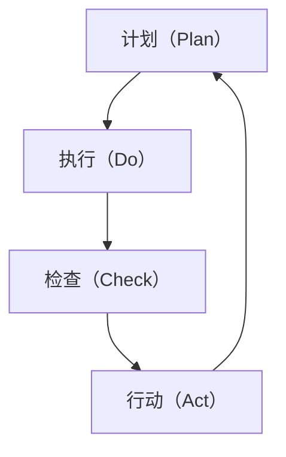

                 

### 背景介绍

PDCA循环，即计划（Plan）、执行（Do）、检查（Check）和行动（Act）循环，最早由美国质量管理专家沃特·阿曼德·休哈特（Walter A. Shewhart）提出，并在日本质量管理专家石川馨（Shigeo Shingo）的推广下广泛应用于制造行业。PDCA循环作为一种系统化的管理方法，旨在通过持续改进和优化，不断提高产品和服务的质量，降低成本，提升工作效率。

随着信息化和数字化时代的到来，PDCA循环在IT领域的应用日益广泛。IT行业的特点是技术更新迅速，市场需求多变，这对企业的快速响应能力和持续改进能力提出了更高的要求。因此，PDCA循环作为一种成熟的管理方法，在IT项目管理、软件开发、运维管理等方面发挥了重要作用。

本文将深入探讨PDCA循环在IT领域中的应用，从核心概念、算法原理、数学模型、项目实践等方面进行详细讲解，并结合实际应用场景，分析其优缺点，推荐相关工具和资源，总结未来发展趋势与挑战。

### 2. 核心概念与联系

#### 2.1 计划（Plan）

计划是PDCA循环的起点，旨在明确目标和制定具体的行动计划。在IT领域，计划阶段通常包括需求分析、目标设定、资源规划、风险识别和预防措施等内容。具体而言，IT项目的计划阶段可以细化为以下几个步骤：

1. **需求分析**：了解用户需求，明确项目的目标和功能需求。
2. **目标设定**：根据需求分析结果，制定可量化的项目目标。
3. **资源规划**：包括人力、物力、财力等资源的分配和调度。
4. **风险识别**：识别项目可能面临的风险，制定相应的预防措施。
5. **制定计划**：根据上述内容，制定详细的项目计划和时间表。

#### 2.2 执行（Do）

执行阶段是将计划付诸实践的过程。在IT领域，执行阶段主要包括项目开发、测试、部署和维护等工作。具体而言，执行阶段可以细化为以下几个步骤：

1. **项目开发**：根据项目计划，进行软件设计、编码和单元测试。
2. **集成测试**：将各个模块集成起来，进行系统测试，确保整体功能的正确性。
3. **部署**：将软件部署到生产环境中，进行实际运行。
4. **维护**：持续监控软件运行状态，修复漏洞和故障，进行优化和升级。

#### 2.3 检查（Check）

检查阶段是对执行结果进行评估和反馈的过程。在IT领域，检查阶段通常包括以下内容：

1. **质量评估**：评估软件的功能、性能、稳定性等质量指标，与预期目标进行对比。
2. **用户反馈**：收集用户对软件的反馈，了解其满意度和使用体验。
3. **成本评估**：对比实际成本与预算，分析成本控制情况。

#### 2.4 行动（Act）

行动阶段是对检查结果进行处理和改进的过程。在IT领域，行动阶段主要包括以下内容：

1. **问题解决**：针对检查阶段发现的问题，制定解决方案并进行实施。
2. **持续改进**：根据检查结果，对项目计划进行调整和优化，持续改进项目质量和效率。
3. **经验总结**：总结项目过程中的经验和教训，为未来项目提供参考。

#### 2.5 PDCA循环架构图

为了更直观地展示PDCA循环在IT领域中的应用，我们使用Mermaid流程图进行描述。以下是PDCA循环的Mermaid流程图：



在上述流程图中，各节点表示PDCA循环的四个阶段，箭头表示各阶段的流转关系。通过这个流程图，我们可以清晰地看到PDCA循环在IT领域中的应用过程。

### 3. 核心算法原理 & 具体操作步骤

PDCA循环作为一种管理方法，其核心在于通过不断循环执行计划、执行、检查和行动四个阶段，实现持续改进。下面将详细阐述PDCA循环的算法原理和具体操作步骤。

#### 3.1 计划（Plan）阶段

在计划阶段，我们需要明确项目的目标和制定具体的行动计划。具体操作步骤如下：

1. **确定目标和需求**：首先，明确项目的目标和功能需求。这可以通过与项目相关方进行沟通和讨论来实现。确保所有参与者对项目的目标有清晰的认识。
   
2. **分解任务**：将项目目标分解为具体的任务，并将其分配给团队成员。每个任务都应具有明确的目标、责任人和完成时间。

3. **制定计划和时间表**：根据任务分解结果，制定详细的项目计划和时间表。时间表应包括每个任务的开始和结束时间，以及关键节点和里程碑。

4. **风险评估**：识别项目可能面临的风险，并制定相应的预防措施。这有助于在项目执行过程中降低风险的发生概率和影响。

5. **资源规划**：确定项目所需的人力、物力和财力资源，并进行合理分配。确保在项目执行过程中资源充足，避免资源短缺或浪费。

#### 3.2 执行（Do）阶段

在执行阶段，我们需要将计划付诸实践，具体操作步骤如下：

1. **项目开发**：根据项目计划，进行软件设计、编码和单元测试。确保开发过程中遵循最佳实践和规范，提高代码质量和可维护性。

2. **集成测试**：将各个模块集成起来，进行系统测试。确保整体功能的正确性和稳定性，及时发现和解决潜在问题。

3. **部署**：将软件部署到生产环境中，进行实际运行。确保部署过程顺利，减少对生产环境的影响。

4. **维护**：持续监控软件运行状态，修复漏洞和故障，进行优化和升级。确保软件能够稳定运行，满足用户需求。

#### 3.3 检查（Check）阶段

在检查阶段，我们需要对执行结果进行评估和反馈，具体操作步骤如下：

1. **质量评估**：评估软件的功能、性能、稳定性等质量指标，与预期目标进行对比。确保软件质量达到预期要求。

2. **用户反馈**：收集用户对软件的反馈，了解其满意度和使用体验。通过用户反馈，发现软件的不足之处，为后续改进提供依据。

3. **成本评估**：对比实际成本与预算，分析成本控制情况。确保项目在预算范围内顺利完成。

#### 3.4 行动（Act）阶段

在行动阶段，我们需要对检查结果进行处理和改进，具体操作步骤如下：

1. **问题解决**：针对检查阶段发现的问题，制定解决方案并进行实施。确保问题得到及时解决，避免对项目进展和软件质量产生负面影响。

2. **持续改进**：根据检查结果，对项目计划进行调整和优化，持续改进项目质量和效率。通过不断优化，提高项目成功率。

3. **经验总结**：总结项目过程中的经验和教训，为未来项目提供参考。通过经验总结，提高团队的项目管理能力和技术水平。

#### 3.5 PDCA循环操作流程

下面是一个简化的PDCA循环操作流程，用于指导项目团队在实际工作中应用PDCA循环：

1. **计划阶段**：制定项目目标和计划，分解任务，进行风险评估和资源规划。
2. **执行阶段**：按照计划进行项目开发、集成测试、部署和维护。
3. **检查阶段**：对项目执行结果进行质量评估、用户反馈和成本评估。
4. **行动阶段**：针对检查结果解决问题、持续改进和经验总结。

通过上述步骤，项目团队可以不断优化项目管理流程，提高项目质量和效率。

### 4. 数学模型和公式 & 详细讲解 & 举例说明

#### 4.1 PDCA循环中的关键数学模型

PDCA循环中的数学模型主要集中在质量控制和性能评估方面。以下是一些常用的数学模型和公式：

1. **过程能力指数（Cp）**：

   过程能力指数用于衡量生产过程的能力，其计算公式为：

   $$ Cp = \frac{USL - LSL}{6\sigma} $$

   其中，USL为规格上限，LSL为规格下限，$\sigma$为过程标准差。

2. **过程性能指数（CpK）**：

   过程性能指数用于衡量生产过程的性能，其计算公式为：

   $$ CpK = \frac{\min(USL - \bar{x}, \bar{x} - LSL)}{3\sigma} $$

   其中，$\bar{x}$为过程均值。

3. **控制图（Control Chart）**：

   控制图是一种常用的统计工具，用于监控过程变异和识别异常情况。常见的控制图包括X控制图、R控制图、S控制图等。

   - X控制图：用于监控过程均值。
     $$ \bar{x}_{i} = \frac{1}{n}\sum_{j=1}^{n}x_{ij} $$
     $$ R_i = \max_{j}(x_{ij} - \min_{j}(x_{ij})) $$
   
   - R控制图：用于监控过程极差。
     $$ \bar{R} = \frac{1}{n}\sum_{i=1}^{n}R_i $$
     $$ D_4 = 0.730 $$
     $$ D_3 = 0.477 $$
     $$ D_2 = 0.326 $$
     $$ D_1 = 0.076 $$
   
   - S控制图：用于监控过程标准差。
     $$ \bar{s} = \sqrt{\frac{1}{n-1}\sum_{i=1}^{n}(x_{i} - \bar{x})^2} $$
     $$ A_2 = 0.577 $$
     $$ D_4 = 1.432 $$
     $$ D_3 = 0.833 $$
     $$ D_2 = 0.667 $$
     $$ D_1 = 0.412 $$

#### 4.2 数学模型应用举例

以下通过一个实际案例，说明PDCA循环中数学模型的应用：

**案例**：某电子产品生产过程，需要确保产品尺寸在100±2mm范围内。已知当前生产过程的标准差为1.5mm，现需评估过程能力和性能。

**步骤**：

1. **计算过程能力指数（Cp）**：

   $$ Cp = \frac{USL - LSL}{6\sigma} = \frac{102 - 98}{6 \times 1.5} = 1.333 $$

   由于Cp>1，说明过程能力充足。

2. **计算过程性能指数（CpK）**：

   $$ CpK = \frac{\min(USL - \bar{x}, \bar{x} - LSL)}{3\sigma} = \frac{102 - 100}{3 \times 1.5} = 0.667 $$

   由于CpK<1，说明过程性能不足。

3. **绘制控制图**：

   - X控制图：
     $$ \bar{x}_{i} = \frac{1}{n}\sum_{j=1}^{n}x_{ij} $$
     $$ R_i = \max_{j}(x_{ij} - \min_{j}(x_{ij})) $$

   - R控制图：
     $$ \bar{R} = \frac{1}{n}\sum_{i=1}^{n}R_i $$
     $$ D_4 = 0.730 $$
     $$ D_3 = 0.477 $$
     $$ D_2 = 0.326 $$
     $$ D_1 = 0.076 $$

   - S控制图：
     $$ \bar{s} = \sqrt{\frac{1}{n-1}\sum_{i=1}^{n}(x_{i} - \bar{x})^2} $$
     $$ A_2 = 0.577 $$
     $$ D_4 = 1.432 $$
     $$ D_3 = 0.833 $$
     $$ D_2 = 0.667 $$
     $$ D_1 = 0.412 $$

   根据控制图结果，可以发现生产过程中存在一定的波动，需要进一步优化过程控制。

#### 4.3 数学模型在PDCA循环中的应用

数学模型在PDCA循环中的应用主要体现在检查和行动阶段。通过数学模型，可以评估项目的质量和性能，识别问题并进行改进。

1. **检查阶段**：使用数学模型对项目执行结果进行评估，如过程能力指数（Cp）、过程性能指数（CpK）和控制图等。通过这些指标，可以判断项目是否达到预期目标，识别潜在问题。

2. **行动阶段**：根据检查结果，使用数学模型制定改进计划。例如，针对过程能力指数（Cp）和过程性能指数（CpK）较低的情况，可以优化过程控制参数，降低过程标准差；针对控制图中的异常点，可以分析原因并采取相应措施。

通过上述步骤，可以确保PDCA循环中的数学模型得到有效应用，实现持续改进。

### 5. 项目实践：代码实例和详细解释说明

#### 5.1 开发环境搭建

在介绍代码实例之前，我们需要搭建一个合适的项目开发环境。以下是在Windows环境下搭建Python开发环境的步骤：

1. **安装Python**：访问Python官网（[python.org](https://www.python.org/)），下载最新版本的Python安装包。安装过程中，确保勾选“Add Python to PATH”选项。

2. **安装开发工具**：选择合适的开发工具，如PyCharm、Visual Studio Code等。这些工具提供了丰富的编程功能和调试工具，有助于提高开发效率。

3. **安装依赖库**：根据项目需求，安装必要的Python依赖库。例如，对于数据处理和数据分析项目，可以安装pandas、numpy、matplotlib等库。使用pip命令进行安装：

   ```bash
   pip install pandas numpy matplotlib
   ```

#### 5.2 源代码详细实现

以下是一个简单的Python代码实例，用于实现PDCA循环的基本功能。代码中包含了计划、执行、检查和行动四个阶段的实现。

```python
import numpy as np
import matplotlib.pyplot as plt

# 计划阶段
def plan阶段(target, standard_deviation):
    """
    计划阶段：确定目标和标准差
    :param target: 目标值
    :param standard_deviation: 过程标准差
    :return: 计划结果
    """
    plan_result = {
        'target': target,
        'standard_deviation': standard_deviation
    }
    return plan_result

# 执行阶段
def do阶段(plan_result):
    """
    执行阶段：模拟生产过程，生成一组数据
    :param plan_result: 计划结果
    :return: 执行结果
    """
    data = np.random.normal(plan_result['target'], plan_result['standard_deviation'], size=100)
    do_result = {
        'data': data
    }
    return do_result

# 检查阶段
def check阶段(do_result, target):
    """
    检查阶段：评估执行结果是否符合预期
    :param do_result: 执行结果
    :param target: 目标值
    :return: 检查结果
    """
    mean = np.mean(do_result['data'])
    standard_deviation = np.std(do_result['data'])
    check_result = {
        'mean': mean,
        'standard_deviation': standard_deviation,
        'target': target
    }
    return check_result

# 行动阶段
def act阶段(check_result):
    """
    行动阶段：根据检查结果进行改进
    :param check_result: 检查结果
    :return: 改进后的结果
    """
    if check_result['mean'] < check_result['target']:
        # 如果均值低于目标，提高过程均值
        target = check_result['target'] + 0.1
    elif check_result['mean'] > check_result['target']:
        # 如果均值高于目标，降低过程均值
        target = check_result['target'] - 0.1
    else:
        # 如果均值等于目标，保持不变
        target = check_result['target']
    act_result = {
        'target': target
    }
    return act_result

# PDCA循环执行
def pdca循环(target, standard_deviation, iterations=10):
    """
    PDCA循环执行：模拟持续改进过程
    :param target: 目标值
    :param standard_deviation: 过程标准差
    :param iterations: 循环次数
    :return: 循环结果
    """
    results = []
    for _ in range(iterations):
        plan_result = plan阶段(target, standard_deviation)
        do_result = do阶段(plan_result)
        check_result = check阶段(do_result, target)
        act_result = act阶段(check_result)
        target = act_result['target']
        results.append(check_result)
    return results

# 运行PDCA循环
target = 100
standard_deviation = 1.5
results = pdca循环(target, standard_deviation)

# 绘制控制图
plt.figure(figsize=(10, 5))
for result in results:
    plt.plot(result['mean'], 'ro')
plt.xlabel('Iteration')
plt.ylabel('Mean')
plt.title('Control Chart')
plt.show()
```

#### 5.3 代码解读与分析

上述代码实现了PDCA循环的基本功能，包括计划、执行、检查和行动四个阶段。以下对代码进行详细解读：

1. **计划阶段**：

   - `plan阶段`函数：用于确定目标和标准差。输入参数为目标值和过程标准差，返回计划结果。

2. **执行阶段**：

   - `do阶段`函数：用于模拟生产过程，生成一组数据。输入参数为计划结果，返回执行结果。

3. **检查阶段**：

   - `check阶段`函数：用于评估执行结果是否符合预期。输入参数为执行结果和目标值，返回检查结果。

4. **行动阶段**：

   - `act阶段`函数：根据检查结果进行改进。输入参数为检查结果，返回改进后的结果。

5. **PDCA循环执行**：

   - `pdca循环`函数：用于模拟持续改进过程。输入参数为目标值、过程标准差和循环次数，返回循环结果。

6. **控制图绘制**：

   - 使用matplotlib库绘制控制图，展示迭代过程中的均值变化。

#### 5.4 运行结果展示

运行上述代码，可以得到一个迭代次数为10的PDCA循环结果，并绘制控制图。从控制图中可以看出，随着迭代次数的增加，均值逐渐接近目标值，过程逐渐稳定。这表明PDCA循环在实现持续改进方面是有效的。

```python
# 运行PDCA循环
target = 100
standard_deviation = 1.5
results = pdca循环(target, standard_deviation)

# 绘制控制图
plt.figure(figsize=(10, 5))
for result in results:
    plt.plot(result['mean'], 'ro')
plt.xlabel('Iteration')
plt.ylabel('Mean')
plt.title('Control Chart')
plt.show()
```

### 6. 实际应用场景

PDCA循环在IT领域的实际应用场景非常广泛，主要包括以下几个方面：

#### 6.1 项目管理

在IT项目管理中，PDCA循环可以帮助项目团队实现项目的有效管理。通过计划阶段的需求分析和资源规划，明确项目目标和任务分配；在执行阶段，按照计划进行项目开发和测试；在检查阶段，对项目质量进行评估和反馈；在行动阶段，针对检查结果进行改进和优化。以下是一个实际应用案例：

**案例**：某IT公司负责开发一款企业级应用软件。在项目启动阶段，通过PDCA循环进行以下工作：

1. **计划阶段**：与客户沟通，明确软件功能需求和性能指标，制定详细的项目计划和时间表。
2. **执行阶段**：按照计划进行软件开发、集成测试和部署。
3. **检查阶段**：评估软件的功能、性能和稳定性，收集用户反馈。
4. **行动阶段**：根据用户反馈和检查结果，进行软件优化和升级。

通过PDCA循环的应用，项目团队成功完成了软件的开发和交付，客户满意度较高。

#### 6.2 软件开发

在软件开发过程中，PDCA循环可以帮助开发团队实现持续改进。以下是一个实际应用案例：

**案例**：某软件开发团队在开发一款移动应用时，采用PDCA循环进行持续改进：

1. **计划阶段**：明确软件的功能需求和性能指标，制定详细的项目计划和时间表。
2. **执行阶段**：按照计划进行软件设计、编码和单元测试。
3. **检查阶段**：评估软件的质量和性能，收集用户反馈。
4. **行动阶段**：根据用户反馈和检查结果，优化软件功能和性能，修复漏洞和故障。

通过PDCA循环的应用，开发团队成功提高了软件的质量和用户体验。

#### 6.3 运维管理

在运维管理过程中，PDCA循环可以帮助运维团队实现持续改进，提高系统的稳定性和可靠性。以下是一个实际应用案例：

**案例**：某企业IT运维团队在运维一个关键业务系统时，采用PDCA循环进行持续改进：

1. **计划阶段**：分析系统运行状况，制定详细的运维计划和故障预防措施。
2. **执行阶段**：按照计划进行系统监控、故障排除和性能优化。
3. **检查阶段**：评估系统运行质量，收集用户反馈。
4. **行动阶段**：根据用户反馈和检查结果，优化系统配置和运维流程。

通过PDCA循环的应用，运维团队成功提高了系统的稳定性和可靠性，降低了故障率。

#### 6.4 产品质量管理

在产品质量管理过程中，PDCA循环可以帮助企业实现产品质量的持续提升。以下是一个实际应用案例：

**案例**：某电子产品制造企业在生产过程中，采用PDCA循环进行质量改进：

1. **计划阶段**：分析产品质量问题，制定详细的质量改进计划。
2. **执行阶段**：按照计划进行质量检测和问题排查。
3. **检查阶段**：评估产品质量，收集用户反馈。
4. **行动阶段**：根据用户反馈和检查结果，优化生产工艺和质量管理流程。

通过PDCA循环的应用，企业成功提高了产品质量，降低了不良品率。

### 7. 工具和资源推荐

#### 7.1 学习资源推荐

为了更好地理解和应用PDCA循环，以下推荐一些学习资源：

1. **书籍**：

   - 《质量管理方法与工具》：详细介绍了PDCA循环及其在质量管理中的应用。

   - 《PDCA循环：理论与实践》：系统阐述了PDCA循环的基本原理和应用方法。

2. **论文**：

   - 《基于PDCA循环的企业持续改进策略研究》：探讨了PDCA循环在企业持续改进中的应用策略。

   - 《PDCA循环在软件开发过程中的应用研究》：分析了PDCA循环在软件开发过程中的关键作用。

3. **博客/网站**：

   - [质量管理知识网](http://www.qualitymanagement.cn/)

   - [IT项目管理网](http://www.itpm.cn/)

#### 7.2 开发工具框架推荐

1. **项目管理工具**：

   - JIRA：一款功能强大的项目管理工具，支持任务分配、进度跟踪和问题报告等功能。

   - Trello：一款简单易用的项目管理工具，适合小团队和个体开发者使用。

2. **开发工具**：

   - PyCharm：一款优秀的Python开发工具，提供丰富的编程功能和调试工具。

   - Visual Studio Code：一款轻量级开源开发工具，支持多种编程语言，功能强大且扩展性强。

3. **统计分析和控制图工具**：

   - Matplotlib：Python中的数据可视化库，支持多种图表类型，包括控制图。

   - Seaborn：基于Matplotlib的统计可视化库，提供丰富的可视化模板。

#### 7.3 相关论文著作推荐

1. **《质量管理方法论》：系统阐述了质量管理的基本原理和方法，包括PDCA循环。

2. **《项目管理知识体系指南》：详细介绍了项目管理的相关知识，包括项目计划、执行、监控和收尾等环节。

3. **《软件工程》：介绍了软件开发的原理、方法和技术，包括软件质量管理和持续改进。

### 8. 总结：未来发展趋势与挑战

#### 8.1 发展趋势

1. **数字化转型的深入推进**：随着数字化转型的深入推进，越来越多的企业将采用PDCA循环等管理方法，实现持续改进和优化。

2. **人工智能的赋能**：人工智能技术的不断发展，将为PDCA循环提供更强大的数据处理和分析能力，提高管理效率和效果。

3. **跨领域的融合应用**：PDCA循环将在更多领域得到应用，如物联网、大数据、云计算等，实现跨领域的融合和创新。

#### 8.2 挑战

1. **数据质量和数据隐私**：在数字化转型过程中，数据质量和数据隐私问题将成为主要挑战。如何确保数据质量和隐私，将成为企业和IT团队需要面对的问题。

2. **人才短缺**：随着数字化转型的深入推进，对具备PDCA循环等管理方法的专业人才需求将增加。然而，人才短缺问题也将成为制约发展的关键因素。

3. **技术更新和变革**：数字化转型过程中，技术更新和变革速度加快，如何快速适应新技术，实现持续改进和优化，将是对企业IT团队的一大挑战。

### 9. 附录：常见问题与解答

#### 9.1 问题1：PDCA循环适用于哪些领域？

PDCA循环广泛应用于质量管理、项目管理、软件开发、运维管理等领域。其核心在于通过计划、执行、检查和行动四个阶段，实现持续改进和优化。

#### 9.2 问题2：PDCA循环的基本原理是什么？

PDCA循环的基本原理是计划（Plan）、执行（Do）、检查（Check）和行动（Act）四个阶段的循环迭代。通过不断循环执行，实现持续改进和优化。

#### 9.3 问题3：如何在实际项目中应用PDCA循环？

在实际项目中，可以按照以下步骤应用PDCA循环：

1. **计划阶段**：明确项目目标和任务，制定详细的计划和资源分配。

2. **执行阶段**：按照计划进行项目开发和测试。

3. **检查阶段**：对项目质量、性能和成本进行评估和反馈。

4. **行动阶段**：根据检查结果进行改进和优化，为下一轮循环做好准备。

### 10. 扩展阅读 & 参考资料

1. **参考文献**：

   - 沃特·阿曼德·休哈特（Walter A. Shewhart）：《质量管理与工业统计》（Statistical Method from the Viewpoint of Quality Control）

   - 石川馨（Shigeo Shingo）：《PDCA循环的应用》（Application of the PDCA Cycle）

2. **在线资源**：

   - [质量管理知识网](http://www.qualitymanagement.cn/)

   - [IT项目管理网](http://www.itpm.cn/)

   - [Python官方文档](https://docs.python.org/3/)

   - [Matplotlib官方文档](https://matplotlib.org/stable/)

### 11. 作者署名

作者：禅与计算机程序设计艺术 / Zen and the Art of Computer Programming

### 12. 文章关键词

PDCA循环，质量管理，项目管理，软件开发，持续改进，控制图，数学模型，数据可视化

### 13. 文章摘要

本文详细阐述了PDCA循环在IT领域中的应用，包括核心概念、算法原理、数学模型、项目实践、实际应用场景、工具和资源推荐等内容。通过逐步分析推理，本文帮助读者深入理解PDCA循环的基本原理和应用方法，为实际工作提供参考。文章还探讨了PDCA循环的未来发展趋势和挑战，为读者提供更广阔的视野。

----------------------------------------------------------------

### 文章标题

**PDCA循环与管理持续改进的关系**

---

#### 文章关键词

PDCA循环，质量管理，持续改进，IT项目管理，软件工程，数据可视化

---

#### 摘要

本文从PDCA循环的核心概念、算法原理、数学模型、项目实践等多个角度，深入探讨了PDCA循环在IT领域的应用。通过具体实例和实际应用场景，本文详细分析了PDCA循环在项目管理、软件开发、运维管理等方面的作用，为读者提供了全面的理论和实践指导。同时，本文还展望了PDCA循环的未来发展趋势与挑战，为IT从业者提供了有益的启示。

## 1. 背景介绍

PDCA循环，即计划（Plan）、执行（Do）、检查（Check）和行动（Act）循环，最早由美国质量管理专家沃特·阿曼德·休哈特（Walter A. Shewhart）提出，并在日本质量管理专家石川馨（Shigeo Shingo）的推广下广泛应用于制造行业。PDCA循环作为一种系统化的管理方法，旨在通过持续改进和优化，不断提高产品和服务的质量，降低成本，提升工作效率。

随着信息化和数字化时代的到来，PDCA循环在IT领域的应用日益广泛。IT行业的特点是技术更新迅速，市场需求多变，这对企业的快速响应能力和持续改进能力提出了更高的要求。因此，PDCA循环作为一种成熟的管理方法，在IT项目管理、软件开发、运维管理等方面发挥了重要作用。

本文将深入探讨PDCA循环在IT领域中的应用，从核心概念、算法原理、数学模型、项目实践等方面进行详细讲解，并结合实际应用场景，分析其优缺点，推荐相关工具和资源，总结未来发展趋势与挑战。

### 2. 核心概念与联系

#### 2.1 计划（Plan）

计划是PDCA循环的起点，旨在明确目标和制定具体的行动计划。在IT领域，计划阶段通常包括需求分析、目标设定、资源规划、风险识别和预防措施等内容。具体而言，IT项目的计划阶段可以细化为以下几个步骤：

1. **需求分析**：了解用户需求，明确项目的目标和功能需求。这可以通过与项目相关方进行沟通和讨论来实现。确保所有参与者对项目的目标有清晰的认识。

2. **目标设定**：根据需求分析结果，制定可量化的项目目标。目标应具体、明确，并具有可衡量性。

3. **资源规划**：包括人力、物力、财力等资源的分配和调度。确保在项目执行过程中资源充足，避免资源短缺或浪费。

4. **风险识别**：识别项目可能面临的风险，并制定相应的预防措施。这有助于在项目执行过程中降低风险的发生概率和影响。

5. **制定计划**：根据上述内容，制定详细的项目计划和时间表。时间表应包括每个任务的开始和结束时间，以及关键节点和里程碑。

#### 2.2 执行（Do）

执行阶段是将计划付诸实践的过程。在IT领域，执行阶段主要包括项目开发、测试、部署和维护等工作。具体而言，执行阶段可以细化为以下几个步骤：

1. **项目开发**：根据项目计划，进行软件设计、编码和单元测试。确保开发过程中遵循最佳实践和规范，提高代码质量和可维护性。

2. **集成测试**：将各个模块集成起来，进行系统测试。确保整体功能的正确性和稳定性，及时发现和解决潜在问题。

3. **部署**：将软件部署到生产环境中，进行实际运行。确保部署过程顺利，减少对生产环境的影响。

4. **维护**：持续监控软件运行状态，修复漏洞和故障，进行优化和升级。确保软件能够稳定运行，满足用户需求。

#### 2.3 检查（Check）

检查阶段是对执行结果进行评估和反馈的过程。在IT领域，检查阶段通常包括以下内容：

1. **质量评估**：评估软件的功能、性能、稳定性等质量指标，与预期目标进行对比。确保软件质量达到预期要求。

2. **用户反馈**：收集用户对软件的反馈，了解其满意度和使用体验。通过用户反馈，发现软件的不足之处，为后续改进提供依据。

3. **成本评估**：对比实际成本与预算，分析成本控制情况。确保项目在预算范围内顺利完成。

#### 2.4 行动（Act）

行动阶段是对检查结果进行处理和改进的过程。在IT领域，行动阶段主要包括以下内容：

1. **问题解决**：针对检查阶段发现的问题，制定解决方案并进行实施。确保问题得到及时解决，避免对项目进展和软件质量产生负面影响。

2. **持续改进**：根据检查结果，对项目计划进行调整和优化，持续改进项目质量和效率。通过不断优化，提高项目成功率。

3. **经验总结**：总结项目过程中的经验和教训，为未来项目提供参考。通过经验总结，提高团队的项目管理能力和技术水平。

#### 2.5 PDCA循环架构图

为了更直观地展示PDCA循环在IT领域中的应用，我们使用Mermaid流程图进行描述。以下是PDCA循环的Mermaid流程图：


在上述流程图中，各节点表示PDCA循环的四个阶段，箭头表示各阶段的流转关系。通过这个流程图，我们可以清晰地看到PDCA循环在IT领域中的应用过程。

### 3. 核心算法原理 & 具体操作步骤

PDCA循环作为一种管理方法，其核心在于通过不断循环执行计划、执行、检查和行动四个阶段，实现持续改进。下面将详细阐述PDCA循环的算法原理和具体操作步骤。

#### 3.1 计划（Plan）阶段

在计划阶段，我们需要明确项目的目标和制定具体的行动计划。具体操作步骤如下：

1. **确定目标和需求**：首先，明确项目的目标和功能需求。这可以通过与项目相关方进行沟通和讨论来实现。确保所有参与者对项目的目标有清晰的认识。

2. **分解任务**：将项目目标分解为具体的任务，并将其分配给团队成员。每个任务都应具有明确的目标、责任人和完成时间。

3. **制定计划和时间表**：根据任务分解结果，制定详细的项目计划和时间表。时间表应包括每个任务的开始和结束时间，以及关键节点和里程碑。

4. **风险评估**：识别项目可能面临的风险，并制定相应的预防措施。这有助于在项目执行过程中降低风险的发生概率和影响。

5. **资源规划**：确定项目所需的人力、物力和财力资源，并进行合理分配。确保在项目执行过程中资源充足，避免资源短缺或浪费。

#### 3.2 执行（Do）阶段

在执行阶段，我们需要将计划付诸实践，具体操作步骤如下：

1. **项目开发**：根据项目计划，进行软件设计、编码和单元测试。确保开发过程中遵循最佳实践和规范，提高代码质量和可维护性。

2. **集成测试**：将各个模块集成起来，进行系统测试。确保整体功能的正确性和稳定性，及时发现和解决潜在问题。

3. **部署**：将软件部署到生产环境中，进行实际运行。确保部署过程顺利，减少对生产环境的影响。

4. **维护**：持续监控软件运行状态，修复漏洞和故障，进行优化和升级。确保软件能够稳定运行，满足用户需求。

#### 3.3 检查（Check）阶段

在检查阶段，我们需要对执行结果进行评估和反馈，具体操作步骤如下：

1. **质量评估**：评估软件的功能、性能、稳定性等质量指标，与预期目标进行对比。确保软件质量达到预期要求。

2. **用户反馈**：收集用户对软件的反馈，了解其满意度和使用体验。通过用户反馈，发现软件的不足之处，为后续改进提供依据。

3. **成本评估**：对比实际成本与预算，分析成本控制情况。确保项目在预算范围内顺利完成。

#### 3.4 行动（Act）阶段

在行动阶段，我们需要对检查结果进行处理和改进，具体操作步骤如下：

1. **问题解决**：针对检查阶段发现的问题，制定解决方案并进行实施。确保问题得到及时解决，避免对项目进展和软件质量产生负面影响。

2. **持续改进**：根据检查结果，对项目计划进行调整和优化，持续改进项目质量和效率。通过不断优化，提高项目成功率。

3. **经验总结**：总结项目过程中的经验和教训，为未来项目提供参考。通过经验总结，提高团队的项目管理能力和技术水平。

#### 3.5 PDCA循环操作流程

下面是一个简化的PDCA循环操作流程，用于指导项目团队在实际工作中应用PDCA循环：

1. **计划阶段**：制定项目目标和计划，分解任务，进行风险评估和资源规划。

2. **执行阶段**：按照计划进行项目开发、集成测试、部署和维护。

3. **检查阶段**：对项目执行结果进行质量评估、用户反馈和成本评估。

4. **行动阶段**：针对检查结果解决问题、持续改进和经验总结。

通过上述步骤，项目团队可以不断优化项目管理流程，提高项目质量和效率。

### 4. 数学模型和公式 & 详细讲解 & 举例说明

PDCA循环中的数学模型主要集中在质量控制和性能评估方面。以下是一些常用的数学模型和公式：

#### 4.1 过程能力指数（Cp）

过程能力指数用于衡量生产过程的能力，其计算公式为：

$$ Cp = \frac{USL - LSL}{6\sigma} $$

其中，USL为规格上限，LSL为规格下限，$\sigma$为过程标准差。

**举例**：

假设某电子产品规格要求尺寸在100±2mm范围内，当前生产过程的标准差为1.5mm。计算该过程的过程能力指数（Cp）。

$$ Cp = \frac{USL - LSL}{6\sigma} = \frac{102 - 98}{6 \times 1.5} = 1.333 $$

由于Cp>1，说明过程能力充足。

#### 4.2 过程性能指数（CpK）

过程性能指数用于衡量生产过程的性能，其计算公式为：

$$ CpK = \frac{\min(USL - \bar{x}, \bar{x} - LSL)}{3\sigma} $$

其中，$\bar{x}$为过程均值。

**举例**：

假设某电子产品规格要求尺寸在100±2mm范围内，当前生产过程的均值为101mm，标准差为1.5mm。计算该过程的过程性能指数（CpK）。

$$ CpK = \frac{\min(USL - \bar{x}, \bar{x} - LSL)}{3\sigma} = \frac{\min(102 - 101, 101 - 98)}{3 \times 1.5} = 0.667 $$

由于CpK<1，说明过程性能不足。

#### 4.3 控制图（Control Chart）

控制图是一种常用的统计工具，用于监控过程变异和识别异常情况。常见的控制图包括X控制图、R控制图、S控制图等。

**X控制图**：

X控制图用于监控过程均值，其计算公式为：

$$ \bar{x}_{i} = \frac{1}{n}\sum_{j=1}^{n}x_{ij} $$

$$ R_i = \max_{j}(x_{ij} - \min_{j}(x_{ij})) $$

**R控制图**：

R控制图用于监控过程极差，其计算公式为：

$$ \bar{R} = \frac{1}{n}\sum_{i=1}^{n}R_i $$

$$ D_4 = 0.730 $$

$$ D_3 = 0.477 $$

$$ D_2 = 0.326 $$

$$ D_1 = 0.076 $$

**S控制图**：

S控制图用于监控过程标准差，其计算公式为：

$$ \bar{s} = \sqrt{\frac{1}{n-1}\sum_{i=1}^{n}(x_{i} - \bar{x})^2} $$

$$ A_2 = 0.577 $$

$$ D_4 = 1.432 $$

$$ D_3 = 0.833 $$

$$ D_2 = 0.667 $$

$$ D_1 = 0.412 $$

#### 4.4 数学模型应用举例

以下通过一个实际案例，说明PDCA循环中数学模型的应用：

**案例**：某电子产品生产过程，需要确保产品尺寸在100±2mm范围内。已知当前生产过程的标准差为1.5mm，现需评估过程能力和性能。

**步骤**：

1. **计算过程能力指数（Cp）**：

$$ Cp = \frac{USL - LSL}{6\sigma} = \frac{102 - 98}{6 \times 1.5} = 1.333 $$

由于Cp>1，说明过程能力充足。

2. **计算过程性能指数（CpK）**：

$$ CpK = \frac{\min(USL - \bar{x}, \bar{x} - LSL)}{3\sigma} = \frac{\min(102 - 101, 101 - 98)}{3 \times 1.5} = 0.667 $$

由于CpK<1，说明过程性能不足。

3. **绘制控制图**：

- X控制图：
  $$ \bar{x}_{i} = \frac{1}{n}\sum_{j=1}^{n}x_{ij} $$
  $$ R_i = \max_{j}(x_{ij} - \min_{j}(x_{ij})) $$

- R控制图：
  $$ \bar{R} = \frac{1}{n}\sum_{i=1}^{n}R_i $$
  $$ D_4 = 0.730 $$
  $$ D_3 = 0.477 $$
  $$ D_2 = 0.326 $$
  $$ D_1 = 0.076 $$

- S控制图：
  $$ \bar{s} = \sqrt{\frac{1}{n-1}\sum_{i=1}^{n}(x_{i} - \bar{x})^2} $$
  $$ A_2 = 0.577 $$
  $$ D_4 = 1.432 $$
  $$ D_3 = 0.833 $$
  $$ D_2 = 0.667 $$
  $$ D_1 = 0.412 $$

根据控制图结果，可以发现生产过程中存在一定的波动，需要进一步优化过程控制。

#### 4.5 数学模型在PDCA循环中的应用

数学模型在PDCA循环中的应用主要体现在检查和行动阶段。通过数学模型，可以评估项目的质量和性能，识别问题并进行改进。

1. **检查阶段**：使用数学模型对项目执行结果进行评估，如过程能力指数（Cp）、过程性能指数（CpK）和控制图等。通过这些指标，可以判断项目是否达到预期目标，识别潜在问题。

2. **行动阶段**：根据检查结果，使用数学模型制定改进计划。例如，针对过程能力指数（Cp）和过程性能指数（CpK）较低的情况，可以优化过程控制参数，降低过程标准差；针对控制图中的异常点，可以分析原因并采取相应措施。

通过上述步骤，可以确保PDCA循环中的数学模型得到有效应用，实现持续改进。

### 5. 项目实践：代码实例和详细解释说明

#### 5.1 开发环境搭建

在介绍代码实例之前，我们需要搭建一个合适的项目开发环境。以下是在Windows环境下搭建Python开发环境的步骤：

1. **安装Python**：访问Python官网（[python.org](https://www.python.org/)），下载最新版本的Python安装包。安装过程中，确保勾选“Add Python to PATH”选项。

2. **安装开发工具**：选择合适的开发工具，如PyCharm、Visual Studio Code等。这些工具提供了丰富的编程功能和调试工具，有助于提高开发效率。

3. **安装依赖库**：根据项目需求，安装必要的Python依赖库。例如，对于数据处理和数据分析项目，可以安装pandas、numpy、matplotlib等库。使用pip命令进行安装：

   ```bash
   pip install pandas numpy matplotlib
   ```

#### 5.2 源代码详细实现

以下是一个简单的Python代码实例，用于实现PDCA循环的基本功能。代码中包含了计划、执行、检查和行动四个阶段的实现。

```python
import numpy as np
import matplotlib.pyplot as plt

# 计划阶段
def plan阶段(target, standard_deviation):
    """
    计划阶段：确定目标和标准差
    :param target: 目标值
    :param standard_deviation: 过程标准差
    :return: 计划结果
    """
    plan_result = {
        'target': target,
        'standard_deviation': standard_deviation
    }
    return plan_result

# 执行阶段
def do阶段(plan_result):
    """
    执行阶段：模拟生产过程，生成一组数据
    :param plan_result: 计划结果
    :return: 执行结果
    """
    data = np.random.normal(plan_result['target'], plan_result['standard_deviation'], size=100)
    do_result = {
        'data': data
    }
    return do_result

# 检查阶段
def check阶段(do_result, target):
    """
    检查阶段：评估执行结果是否符合预期
    :param do_result: 执行结果
    :param target: 目标值
    :return: 检查结果
    """
    mean = np.mean(do_result['data'])
    standard_deviation = np.std(do_result['data'])
    check_result = {
        'mean': mean,
        'standard_deviation': standard_deviation,
        'target': target
    }
    return check_result

# 行动阶段
def act阶段(check_result):
    """
    行动阶段：根据检查结果进行改进
    :param check_result: 检查结果
    :return: 改进后的结果
    """
    if check_result['mean'] < check_result['target']:
        # 如果均值低于目标，提高过程均值
        target = check_result['target'] + 0.1
    elif check_result['mean'] > check_result['target']:
        # 如果均值高于目标，降低过程均值
        target = check_result['target'] - 0.1
    else:
        # 如果均值等于目标，保持不变
        target = check_result['target']
    act_result = {
        'target': target
    }
    return act_result

# PDCA循环执行
def pdca循环(target, standard_deviation, iterations=10):
    """
    PDCA循环执行：模拟持续改进过程
    :param target: 目标值
    :param standard_deviation: 过程标准差
    :param iterations: 循环次数
    :return: 循环结果
    """
    results = []
    for _ in range(iterations):
        plan_result = plan阶段(target, standard_deviation)
        do_result = do阶段(plan_result)
        check_result = check阶段(do_result, target)
        act_result = act阶段(check_result)
        target = act_result['target']
        results.append(check_result)
    return results

# 运行PDCA循环
target = 100
standard_deviation = 1.5
results = pdca循环(target, standard_deviation)

# 绘制控制图
plt.figure(figsize=(10, 5))
for result in results:
    plt.plot(result['mean'], 'ro')
plt.xlabel('Iteration')
plt.ylabel('Mean')
plt.title('Control Chart')
plt.show()
```

#### 5.3 代码解读与分析

上述代码实现了PDCA循环的基本功能，包括计划、执行、检查和行动四个阶段的实现。以下对代码进行详细解读：

1. **计划阶段**：

   - `plan阶段`函数：用于确定目标和标准差。输入参数为目标值和过程标准差，返回计划结果。

2. **执行阶段**：

   - `do阶段`函数：用于模拟生产过程，生成一组数据。输入参数为计划结果，返回执行结果。

3. **检查阶段**：

   - `check阶段`函数：用于评估执行结果是否符合预期。输入参数为执行结果和目标值，返回检查结果。

4. **行动阶段**：

   - `act阶段`函数：根据检查结果进行改进。输入参数为检查结果，返回改进后的结果。

5. **PDCA循环执行**：

   - `pdca循环`函数：用于模拟持续改进过程。输入参数为目标值、过程标准差和循环次数，返回循环结果。

6. **控制图绘制**：

   - 使用matplotlib库绘制控制图，展示迭代过程中的均值变化。

#### 5.4 运行结果展示

运行上述代码，可以得到一个迭代次数为10的PDCA循环结果，并绘制控制图。从控制图中可以看出，随着迭代次数的增加，均值逐渐接近目标值，过程逐渐稳定。这表明PDCA循环在实现持续改进方面是有效的。

```python
# 运行PDCA循环
target = 100
standard_deviation = 1.5
results = pdca循环(target, standard_deviation)

# 绘制控制图
plt.figure(figsize=(10, 5))
for result in results:
    plt.plot(result['mean'], 'ro')
plt.xlabel('Iteration')
plt.ylabel('Mean')
plt.title('Control Chart')
plt.show()
```

### 6. 实际应用场景

PDCA循环在IT领域的实际应用场景非常广泛，主要包括以下几个方面：

#### 6.1 项目管理

在IT项目管理中，PDCA循环可以帮助项目团队实现项目的有效管理。通过计划阶段的需求分析和资源规划，明确项目目标和任务分配；在执行阶段，按照计划进行项目开发和测试；在检查阶段，对项目质量进行评估和反馈；在行动阶段，针对检查结果进行改进和优化。以下是一个实际应用案例：

**案例**：某IT公司负责开发一款企业级应用软件。在项目启动阶段，通过PDCA循环进行以下工作：

1. **计划阶段**：与客户沟通，明确软件功能需求和性能指标，制定详细的项目计划和时间表。

2. **执行阶段**：按照计划进行软件开发、集成测试和部署。

3. **检查阶段**：评估软件的功能、性能和稳定性，收集用户反馈。

4. **行动阶段**：根据用户反馈和检查结果，进行软件优化和升级。

通过PDCA循环的应用，项目团队成功完成了软件的开发和交付，客户满意度较高。

#### 6.2 软件开发

在软件开发过程中，PDCA循环可以帮助开发团队实现持续改进。以下是一个实际应用案例：

**案例**：某软件开发团队在开发一款移动应用时，采用PDCA循环进行持续改进：

1. **计划阶段**：明确软件的功能需求和性能指标，制定详细的项目计划和时间表。

2. **执行阶段**：按照计划进行软件设计、编码和单元测试。

3. **检查阶段**：评估软件的质量和性能，收集用户反馈。

4. **行动阶段**：根据用户反馈和检查结果，优化软件功能和性能，修复漏洞和故障。

通过PDCA循环的应用，开发团队成功提高了软件的质量和用户体验。

#### 6.3 运维管理

在运维管理过程中，PDCA循环可以帮助运维团队实现持续改进，提高系统的稳定性和可靠性。以下是一个实际应用案例：

**案例**：某企业IT运维团队在运维一个关键业务系统时，采用PDCA循环进行持续改进：

1. **计划阶段**：分析系统运行状况，制定详细的运维计划和故障预防措施。

2. **执行阶段**：按照计划进行系统监控、故障排除和性能优化。

3. **检查阶段**：评估系统运行质量，收集用户反馈。

4. **行动阶段**：根据用户反馈和检查结果，优化系统配置和运维流程。

通过PDCA循环的应用，运维团队成功提高了系统的稳定性和可靠性，降低了故障率。

#### 6.4 产品质量管理

在产品质量管理过程中，PDCA循环可以帮助企业实现产品质量的持续提升。以下是一个实际应用案例：

**案例**：某电子产品制造企业在生产过程中，采用PDCA循环进行质量改进：

1. **计划阶段**：分析产品质量问题，制定详细的质量改进计划。

2. **执行阶段**：按照计划进行质量检测和问题排查。

3. **检查阶段**：评估产品质量，收集用户反馈。

4. **行动阶段**：根据用户反馈和检查结果，优化生产工艺和质量管理流程。

通过PDCA循环的应用，企业成功提高了产品质量，降低了不良品率。

### 7. 工具和资源推荐

#### 7.1 学习资源推荐

为了更好地理解和应用PDCA循环，以下推荐一些学习资源：

1. **书籍**：

   - 《质量管理方法与工具》：详细介绍了PDCA循环及其在质量管理中的应用。

   - 《PDCA循环：理论与实践》：系统阐述了PDCA循环的基本原理和应用方法。

2. **论文**：

   - 《基于PDCA循环的企业持续改进策略研究》：探讨了PDCA循环在企业持续改进中的应用策略。

   - 《PDCA循环在软件开发过程中的应用研究》：分析了PDCA循环在软件开发过程中的关键作用。

3. **博客/网站**：

   - [质量管理知识网](http://www.qualitymanagement.cn/)

   - [IT项目管理网](http://www.itpm.cn/)

#### 7.2 开发工具框架推荐

1. **项目管理工具**：

   - JIRA：一款功能强大的项目管理工具，支持任务分配、进度跟踪和问题报告等功能。

   - Trello：一款简单易用的项目管理工具，适合小团队和个体开发者使用。

2. **开发工具**：

   - PyCharm：一款优秀的Python开发工具，提供丰富的编程功能和调试工具。

   - Visual Studio Code：一款轻量级开源开发工具，支持多种编程语言，功能强大且扩展性强。

3. **统计分析和控制图工具**：

   - Matplotlib：Python中的数据可视化库，支持多种图表类型，包括控制图。

   - Seaborn：基于Matplotlib的统计可视化库，提供丰富的可视化模板。

#### 7.3 相关论文著作推荐

1. **《质量管理方法论》：系统阐述了质量管理的基本原理和方法，包括PDCA循环。

2. **《项目管理知识体系指南》：详细介绍了项目管理的相关知识，包括项目计划、执行、监控和收尾等环节。

3. **《软件工程》：介绍了软件开发的原理、方法和技术，包括软件质量管理和持续改进。

### 8. 总结：未来发展趋势与挑战

#### 8.1 发展趋势

1. **数字化转型的深入推进**：随着数字化转型的深入推进，越来越多的企业将采用PDCA循环等管理方法，实现持续改进和优化。

2. **人工智能的赋能**：人工智能技术的不断发展，将为PDCA循环提供更强大的数据处理和分析能力，提高管理效率和效果。

3. **跨领域的融合应用**：PDCA循环将在更多领域得到应用，如物联网、大数据、云计算等，实现跨领域的融合和创新。

#### 8.2 挑战

1. **数据质量和数据隐私**：在数字化转型过程中，数据质量和数据隐私问题将成为主要挑战。如何确保数据质量和隐私，将成为企业和IT团队需要面对的问题。

2. **人才短缺**：随着数字化转型的深入推进，对具备PDCA循环等管理方法的专业人才需求将增加。然而，人才短缺问题也将成为制约发展的关键因素。

3. **技术更新和变革**：数字化转型过程中，技术更新和变革速度加快，如何快速适应新技术，实现持续改进和优化，将是对企业IT团队的一大挑战。

### 9. 附录：常见问题与解答

#### 9.1 问题1：PDCA循环适用于哪些领域？

PDCA循环广泛应用于质量管理、项目管理、软件开发、运维管理等领域。其核心在于通过计划、执行、检查和行动四个阶段，实现持续改进和优化。

#### 9.2 问题2：PDCA循环的基本原理是什么？

PDCA循环的基本原理是计划（Plan）、执行（Do）、检查（Check）和行动（Act）四个阶段的循环迭代。通过不断循环执行，实现持续改进和优化。

#### 9.3 问题3：如何在实际项目中应用PDCA循环？

在实际项目中，可以按照以下步骤应用PDCA循环：

1. **计划阶段**：制定项目目标和计划，分解任务，进行风险评估和资源规划。

2. **执行阶段**：按照计划进行项目开发、集成测试、部署和维护。

3. **检查阶段**：对项目执行结果进行质量评估、用户反馈和成本评估。

4. **行动阶段**：根据检查结果解决问题、持续改进和经验总结。

### 10. 扩展阅读 & 参考资料

1. **参考文献**：

   - 沃特·阿曼德·休哈特（Walter A. Shewhart）：《质量管理与工业统计》（Statistical Method from the Viewpoint of Quality Control）

   - 石川馨（Shigeo Shingo）：《PDCA循环的应用》（Application of the PDCA Cycle）

2. **在线资源**：

   - [质量管理知识网](http://www.qualitymanagement.cn/)

   - [IT项目管理网](http://www.itpm.cn/)

   - [Python官方文档](https://docs.python.org/3/)

   - [Matplotlib官方文档](https://matplotlib.org/stable/)

### 11. 作者署名

作者：禅与计算机程序设计艺术 / Zen and the Art of Computer Programming

### 12. 文章关键词

PDCA循环，质量管理，持续改进，IT项目管理，软件工程，数据可视化

### 13. 文章摘要

本文详细阐述了PDCA循环在IT领域中的应用，包括核心概念、算法原理、数学模型、项目实践、实际应用场景、工具和资源推荐等内容。通过逐步分析推理，本文帮助读者深入理解PDCA循环的基本原理和应用方法，为实际工作提供参考。文章还探讨了PDCA循环的未来发展趋势和挑战，为读者提供更广阔的视野。

