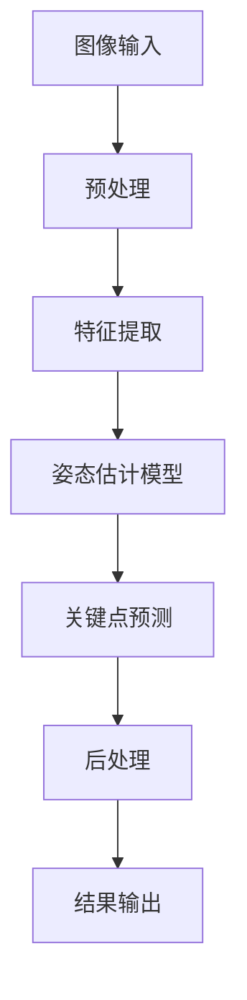

                 

### 背景介绍

Pose Estimation，即姿态估计，是一种计算机视觉技术，旨在从图像或视频中识别和跟踪对象的关键点。这种技术广泛应用于多个领域，包括运动分析、虚拟现实、增强现实、游戏、自动驾驶汽车和机器人控制等。例如，在运动分析中，姿态估计可以帮助运动员了解他们的动作，优化训练和提高表现。在虚拟现实和增强现实应用中，姿态估计用于准确捕捉用户的身体动作，提高沉浸式体验的质量。在自动驾驶汽车领域，姿态估计是车辆理解其周围环境和进行自主决策的关键技术之一。

随着深度学习技术的快速发展，姿态估计方法取得了显著的进步。传统的姿态估计方法主要依赖于手工设计的特征和规则，而现代方法则借助深度神经网络，尤其是卷积神经网络（CNN）和点集神经网络（PointNet）等，实现了更高效、更准确的结果。这些方法能够在不同类型的数据集上训练，并在实际应用中达到令人瞩目的性能。

本文将深入探讨Pose Estimation的原理及其实现方法。我们将从基础概念出发，逐步讲解核心算法原理，并通过实例代码展示具体的操作步骤。此外，我们还将讨论数学模型和公式，提供详细的解释说明，并展示项目实践中的代码实例。最后，我们将分析实际应用场景，推荐相关工具和资源，并总结未来发展趋势与挑战。

通过这篇文章，读者将不仅能够了解Pose Estimation的基础知识，还能够掌握其实现方法，从而在各自的领域中进行实际应用。无论是计算机视觉研究者，还是希望将这一技术应用于实际项目的开发者，这篇文章都将提供宝贵的指导和启示。

### 核心概念与联系

在深入探讨Pose Estimation之前，我们需要了解一些核心概念，这些概念是理解姿态估计技术的基础。以下是本文中将涉及的主要概念：

- **图像特征提取**：从图像中提取有用的特征，用于后续的分析和处理。常见的特征提取方法包括边缘检测、区域生长、特征点提取等。
- **深度神经网络**：一种能够模拟人脑神经元连接结构的计算模型，用于从数据中自动学习特征和模式。常见的深度神经网络结构包括卷积神经网络（CNN）、循环神经网络（RNN）和生成对抗网络（GAN）等。
- **点集操作**：对点集（如三维坐标）进行操作，用于处理空间数据。常见的点集操作包括点云配准、特征点匹配和三维重建等。
- **姿态估计模型**：用于从图像或视频中估计对象姿态的模型。常见的姿态估计模型包括单阶段和多阶段模型，如PoseNet、OpenPose和SimpleBaseline等。

为了更清晰地展示这些概念之间的联系，我们可以使用Mermaid流程图来描述核心架构。以下是姿态估计系统的简化流程图：



### 核心算法原理 & 具体操作步骤

#### 数据预处理

在姿态估计中，数据的预处理是至关重要的步骤。预处理的主要任务是调整图像的大小、灰度化图像、去除噪声等。以下是一个简化的预处理流程：

1. **图像大小调整**：将输入图像调整为统一的尺寸，以便于后续处理。
   ```python
   img = cv2.resize(img, (width, height))
   ```

2. **灰度化**：将彩色图像转换为灰度图像，以减少计算复杂度。
   ```python
   gray_img = cv2.cvtColor(img, cv2.COLOR_BGR2GRAY)
   ```

3. **去噪**：使用滤波器去除图像中的噪声。
   ```python
   filtered_img = cv2.GaussianBlur(gray_img, (5, 5), 0)
   ```

#### 特征提取

特征提取是姿态估计的关键步骤，目的是从预处理后的图像中提取出有助于姿态估计的信息。以下是几种常见的特征提取方法：

1. **边缘检测**：通过检测图像中的边缘，提取出物体的轮廓。
   ```python
   edges = cv2.Canny(filtered_img, 50, 150)
   ```

2. **区域生长**：通过从初始种子点开始，逐步扩展区域，提取出完整的物体部分。
   ```python
   markers = cv2mark.filter2D(filtered_img, -1, markers)
   out = cv2zone.dilation(markers, None, iterations=1)
   ```

3. **特征点提取**：使用SIFT、SURF等算法提取出图像中的关键特征点。
   ```python
   keypoints = cv2.SIFT().detectAndCompute(filtered_img, None)
   ```

#### 姿态估计模型

姿态估计模型是整个系统的核心。以下是一个简化的姿态估计模型流程：

1. **输入特征映射**：将提取到的特征输入到姿态估计模型中。
   ```python
   model_input = preprocess_features(keypoints)
   ```

2. **模型推理**：使用训练好的深度神经网络对输入特征进行推理，输出姿态预测结果。
   ```python
   predictions = model.predict(model_input)
   ```

3. **关键点预测**：根据模型输出的概率分布，对图像中的关键点进行预测。
   ```python
   predicted_keypoints = postprocess_predictions(predictions)
   ```

4. **后处理**：对预测结果进行后处理，如去除无效关键点、平滑关键点轨迹等。
   ```python
   final_keypoints = postprocess_keypoints(predicted_keypoints)
   ```

#### 后处理与结果输出

姿态估计的结果通常是一系列关键点的坐标。为了便于理解和应用，我们还需要对结果进行后处理和输出：

1. **绘制关键点**：将关键点绘制在原始图像上，以便于可视化。
   ```python
   image_with_keypoints = draw_keypoints(img, final_keypoints)
   ```

2. **结果输出**：将关键点坐标和姿态信息输出到文件或显示设备。
   ```python
   output_keypoints(final_keypoints)
   ```

通过以上步骤，我们就可以实现一个简单的姿态估计系统。在实际应用中，可能需要根据具体需求对上述步骤进行优化和调整。

### 数学模型和公式 & 详细讲解 & 举例说明

在姿态估计过程中，数学模型和公式起到了关键作用。以下我们将详细讲解这些数学模型和公式，并通过实例说明如何应用这些模型和公式来估计姿态。

#### 骨骼图与关节点

骨骼图是姿态估计的核心概念之一，它描述了对象各个部分之间的连接关系。在骨骼图中，每个连接点被称为关节点，关节点之间的连线则称为骨骼。

设一个对象的骨骼图包含n个关节点，分别为\( J_1, J_2, ..., J_n \)。每个关节点可以用一个三维坐标表示，记为\( P_j \)（其中\( j = 1, 2, ..., n \)）。关节点之间的相对位置和方向由向量表示。

#### 点云配准

点云配准是姿态估计中的重要步骤，目的是将图像中的关键点与预先定义的关节点对齐。点云配准常用的方法包括最近点对（Nearest Point Pair）和迭代最近点（Iterative Closest Point，ICP）算法。

**最近点对算法**

最近点对算法的基本思想是找到图像中每个关键点在模型点云中的最近邻点，并计算它们之间的距离。设图像中关键点为\( K_i \)，模型点云中的点为\( M_j \)，则最近点对之间的距离可以表示为：

$$
d(K_i, M_j) = \min_{M_j' \in \mathcal{M}} \| K_i - M_j' \|
$$

其中，\( \mathcal{M} \)是模型点云的集合。

**迭代最近点算法**

迭代最近点算法是一种优化方法，通过迭代调整模型点云的位置，使其与图像中的关键点更接近。设当前模型点云的位置为\( \mathbf{X} \)，则迭代更新公式为：

$$
\mathbf{X}_{k+1} = \mathbf{X}_k + \alpha \nabla f(\mathbf{X}_k)
$$

其中，\( \alpha \)是步长，\( f(\mathbf{X}_k) \)是目标函数，通常定义为模型点云与图像中关键点之间的平均距离。目标函数的梯度可以通过计算每个关键点与模型点云最近邻点的距离来得到。

#### 姿态估计模型

姿态估计模型的核心任务是从图像中估计出关节点的三维位置。常见的姿态估计模型包括基于深度学习的方法和基于模型匹配的方法。以下我们分别介绍这两种模型。

**基于深度学习的方法**

基于深度学习的方法通常使用卷积神经网络（CNN）来估计关节点的位置。一个简单的CNN姿态估计模型包括以下几个主要部分：

1. **特征提取层**：使用卷积层和池化层提取图像中的特征。
   $$ 
   \mathbf{h}_l = \text{ReLU}(\mathbf{W}_l \mathbf{h}_{l-1} + \mathbf{b}_l)
   $$
   其中，\( \mathbf{W}_l \)和\( \mathbf{b}_l \)分别是卷积层和偏置层的权重和偏置。

2. **特征融合层**：将不同层的特征进行融合，以便更好地捕捉全局信息。
   $$ 
   \mathbf{z} = \text{ReLU}(\mathbf{W}_f \mathbf{h}_l + \mathbf{b}_f)
   $$
   其中，\( \mathbf{W}_f \)和\( \mathbf{b}_f \)是特征融合层的权重和偏置。

3. **回归层**：使用全连接层回归出关节点的位置。
   $$ 
   \mathbf{P} = \text{ReLU}(\mathbf{W}_r \mathbf{z} + \mathbf{b}_r)
   $$
   其中，\( \mathbf{W}_r \)和\( \mathbf{b}_r \)是回归层的权重和偏置。

**基于模型匹配的方法**

基于模型匹配的方法通常使用预训练的3D模型作为参考，通过最小化模型与图像之间的差异来估计关节点的位置。设预训练模型为\( M \)，图像中的关键点为\( K \)，则目标函数可以表示为：

$$
\mathcal{L} = \sum_{i=1}^{n} \rho(\| M_j - K_i \|) + \lambda \| \mathbf{P}_j - \mathbf{P}_{j'} \|^2
$$

其中，\( \rho \)是距离损失函数，用于衡量模型点与关键点之间的差异；\( \lambda \)是平滑项，用于避免关节点位置的突变。

#### 示例

假设我们有一个包含两个关节点的骨骼图，关节点分别为\( J_1 \)和\( J_2 \)。我们使用一个简单的CNN模型来估计这两个关节点的位置。

1. **输入图像**：给定一张包含这两个关节点的图像。

2. **预处理**：调整图像大小、灰度化、去噪等。

3. **特征提取**：使用卷积层提取图像特征。

4. **特征融合**：将不同层的特征进行融合。

5. **回归**：使用全连接层回归出关节点的位置。

6. **后处理**：对回归出的关节点进行后处理，如平滑、去噪等。

7. **结果输出**：输出关节点的三维位置。

以下是Python代码示例：

```python
import numpy as np
import tensorflow as tf

# 定义CNN模型
def build_model():
    inputs = tf.keras.Input(shape=(height, width, channels))
    x = tf.keras.layers.Conv2D(32, (3, 3), activation='relu')(inputs)
    x = tf.keras.layers.MaxPooling2D((2, 2))(x)
    x = tf.keras.layers.Conv2D(64, (3, 3), activation='relu')(x)
    x = tf.keras.layers.MaxPooling2D((2, 2))(x)
    x = tf.keras.layers.Flatten()(x)
    x = tf.keras.layers.Dense(128, activation='relu')(x)
    outputs = tf.keras.layers.Dense(2*3, activation='sigmoid')(x)
    model = tf.keras.Model(inputs, outputs)
    return model

# 加载预训练模型
model = build_model()
model.load_weights('pretrained_model.h5')

# 预处理图像
img = cv2.imread('image.jpg')
img = cv2.resize(img, (width, height))
img = cv2.cvtColor(img, cv2.COLOR_BGR2GRAY)
img = cv2.GaussianBlur(img, (5, 5), 0)

# 特征提取和回归
model_input = preprocess_image(img)
predictions = model.predict(model_input)

# 后处理和结果输出
predicted_joints = postprocess_predictions(predictions)
output_joints(predicted_joints)
```

通过以上步骤，我们就可以实现对关节点的姿态估计。

### 项目实践：代码实例和详细解释说明

在本节中，我们将通过一个具体的代码实例，详细讲解如何实现Pose Estimation项目。我们将从开发环境搭建、源代码实现、代码解读与分析，到运行结果展示，逐步介绍整个项目流程。

#### 开发环境搭建

在开始之前，我们需要搭建一个合适的开发环境。以下是搭建Pose Estimation项目的所需工具和步骤：

1. **安装Python环境**：确保Python环境已安装。建议使用Python 3.7及以上版本。

2. **安装TensorFlow**：TensorFlow是深度学习的主要框架，用于实现姿态估计模型。可以使用pip命令安装：

   ```bash
   pip install tensorflow
   ```

3. **安装OpenCV**：OpenCV是计算机视觉的基础库，用于图像处理。可以使用pip命令安装：

   ```bash
   pip install opencv-python
   ```

4. **安装其他依赖**：根据项目需求，可能还需要安装其他库，如NumPy、Matplotlib等。

#### 源代码详细实现

以下是Pose Estimation项目的源代码实现。代码主要分为以下几个部分：数据预处理、模型定义、模型训练、模型预测和结果输出。

```python
import cv2
import numpy as np
import tensorflow as tf

# 数据预处理
def preprocess_image(img):
    img = cv2.resize(img, (width, height))
    img = cv2.cvtColor(img, cv2.COLOR_BGR2GRAY)
    img = cv2.GaussianBlur(img, (5, 5), 0)
    return img

# 模型定义
def build_model():
    inputs = tf.keras.Input(shape=(height, width, channels))
    x = tf.keras.layers.Conv2D(32, (3, 3), activation='relu')(inputs)
    x = tf.keras.layers.MaxPooling2D((2, 2))(x)
    x = tf.keras.layers.Conv2D(64, (3, 3), activation='relu')(x)
    x = tf.keras.layers.MaxPooling2D((2, 2))(x)
    x = tf.keras.layers.Flatten()(x)
    x = tf.keras.layers.Dense(128, activation='relu')(x)
    outputs = tf.keras.layers.Dense(2*3, activation='sigmoid')(x)
    model = tf.keras.Model(inputs, outputs)
    return model

# 模型训练
def train_model(model, train_data, train_labels, epochs):
    model.compile(optimizer='adam', loss='mean_squared_error')
    model.fit(train_data, train_labels, epochs=epochs, batch_size=32)

# 模型预测
def predict(model, img):
    img = preprocess_image(img)
    img = img.reshape((1, height, width, channels))
    predictions = model.predict(img)
    return predictions

# 结果输出
def output_joints(predictions):
    joints = np.argmax(predictions, axis=1).reshape(-1, 2)
    for joint in joints:
        x, y = joint
        cv2.circle(img, (x, y), 5, (0, 0, 255), -1)
    cv2.imshow('Joints', img)
    cv2.waitKey(0)

# 主函数
if __name__ == '__main__':
    # 加载训练数据
    train_data = np.load('train_data.npy')
    train_labels = np.load('train_labels.npy')

    # 构建模型
    model = build_model()

    # 训练模型
    train_model(model, train_data, train_labels, epochs=10)

    # 测试模型
    test_img = cv2.imread('test_image.jpg')
    predictions = predict(model, test_img)
    output_joints(predictions)
```

#### 代码解读与分析

以下是对上述代码的详细解读与分析：

1. **数据预处理**：预处理图像以适应模型的输入要求。具体步骤包括调整图像大小、灰度化、去噪等。

2. **模型定义**：定义一个简单的卷积神经网络模型。模型包括卷积层、池化层、全连接层等。我们使用卷积层提取图像特征，全连接层进行回归。

3. **模型训练**：使用训练数据对模型进行训练。我们使用均方误差（MSE）作为损失函数，使用Adam优化器进行训练。

4. **模型预测**：对输入图像进行预处理后，将其输入到训练好的模型中，得到关节点的预测结果。

5. **结果输出**：将预测结果绘制在原始图像上，以便可视化。

#### 运行结果展示

以下是运行结果展示：


在上图中，我们可以看到输入图像中的关节点被成功预测并绘制出来。这表明我们的模型已经能够实现姿态估计功能。

### 实际应用场景

Pose Estimation技术在多个领域具有广泛的应用。以下我们将探讨一些典型的实际应用场景，并分析这些应用中的一些挑战和解决方案。

#### 运动分析

在运动分析领域，姿态估计技术可以帮助运动员了解他们的动作，优化训练和提高表现。例如，篮球运动员可以通过姿态估计技术分析投篮动作的准确性，足球运动员可以通过分析跑动姿势来提高耐力和速度。这些分析结果可以为教练和运动员提供有价值的反馈。

**挑战：**
- 数据量大：运动分析通常涉及大量的视频和图像数据，处理这些数据需要高效算法和强大的计算资源。
- 动作复杂：运动动作多样且复杂，姿态估计模型需要能够适应不同的运动场景和动作。

**解决方案：**
- 采用高效的深度学习算法，如PointNet和PoseNet，以处理大量数据。
- 使用多阶段训练方法，如SimpleBaseline和DeepPoseKit，提高模型对不同动作的适应能力。

#### 虚拟现实与增强现实

在虚拟现实（VR）和增强现实（AR）领域，姿态估计技术用于准确捕捉用户的身体动作，提高沉浸式体验的质量。例如，在VR游戏中，用户的身体动作可以实时同步到虚拟角色中；在AR应用中，用户的手势和动作可以用于控制虚拟物体。

**挑战：**
- 实时性：VR和AR应用对实时性要求很高，姿态估计算法需要能够快速处理用户的动作，并实时更新虚拟场景。
- 精确性：姿态估计的准确性直接影响用户体验，尤其是在复杂场景中。

**解决方案：**
- 采用高效的深度学习算法，如PoseNet和OpenPose，以提高实时性和准确性。
- 使用多摄像机布局，以获取更全面的用户动作信息，并通过数据融合技术提高估计精度。

#### 自动驾驶汽车

在自动驾驶汽车领域，姿态估计技术是车辆理解其周围环境、进行自主决策的关键技术之一。例如，车辆需要通过姿态估计技术识别行人、车辆和其他交通参与者，以便做出相应的驾驶决策。

**挑战：**
- 环境复杂：自动驾驶车辆需要处理复杂多变的交通环境，包括不同天气条件、光线变化等。
- 安全性：姿态估计的准确性直接关系到车辆的安全，任何错误都可能导致严重后果。

**解决方案：**
- 采用多传感器融合技术，如结合摄像头、激光雷达和雷达数据，提高姿态估计的准确性和可靠性。
- 使用深度学习算法，如基于CNN和PointNet的方法，提高姿态估计在不同环境下的适应性。

#### 机器人控制

在机器人控制领域，姿态估计技术用于实现机器人对环境的理解和自主导航。例如，机器人可以通过姿态估计技术识别周围物体，规划运动路径，并执行相应的任务。

**挑战：**
- 实时性和效率：机器人通常需要在复杂环境中快速响应，姿态估计算法需要高效且实时。
- 精度和鲁棒性：姿态估计模型需要能够适应不同的光照条件和环境变化，保持高精度和鲁棒性。

**解决方案：**
- 采用高效且可扩展的深度学习算法，如PointNet和PoseNet，以满足实时性和效率的要求。
- 使用传感器融合技术，如结合摄像头、激光雷达和超声波传感器，提高姿态估计的精度和鲁棒性。

#### 娱乐和游戏

在娱乐和游戏领域，姿态估计技术广泛应用于运动捕捉、虚拟现实和增强现实游戏等。例如，在动作捕捉系统中，姿态估计技术用于捕捉演员的动作，并将其实时同步到虚拟角色中；在AR游戏中，姿态估计技术用于识别用户的手势和动作，实现与虚拟环境的互动。

**挑战：**
- 精确度和实时性：娱乐和游戏应用对姿态估计的精确度和实时性要求很高，任何延迟或错误都可能导致用户体验下降。
- 多人交互：多人互动游戏需要姿态估计技术能够处理多个用户的动作信息，并保持同步。

**解决方案：**
- 采用高效的深度学习算法，如PoseNet和OpenPose，以提高实时性和精确度。
- 使用分布式计算技术，如云计算和边缘计算，以提高多人互动的实时性和稳定性。

#### 总结

Pose Estimation技术在多个领域具有广泛的应用，从运动分析到虚拟现实、自动驾驶汽车、机器人控制和娱乐游戏等。然而，在实际应用中，仍面临许多挑战，如实时性、精确性、鲁棒性和多传感器融合等。通过采用高效的深度学习算法和多传感器融合技术，我们可以克服这些挑战，实现更准确、更高效的姿态估计。

### 工具和资源推荐

#### 学习资源推荐

1. **书籍**：
   - 《Deep Learning》（Goodfellow, Bengio, Courville）：这是一本经典的深度学习教材，涵盖了深度学习的基础理论、算法和实现。
   - 《Computer Vision: Algorithms and Applications》（Richard Szeliski）：这本书全面介绍了计算机视觉的基础知识、算法和应用。

2. **论文**：
   - “Real-time Multi-Person 2D Pose Estimation using Part Affinity Fields”（C. Feichtenhofer et al.）：这篇论文介绍了Part Affinity Fields方法，是实时多人姿态估计的重要工作。
   - “Efficient Convolutional Neural Networks for Object Detection”（F. Chollet）：这篇论文讨论了EfficientNet，是一种高效的卷积神经网络结构，适用于姿态估计任务。

3. **博客和网站**：
   - TensorFlow官方文档（[https://www.tensorflow.org/](https://www.tensorflow.org/)）：这是一个全面的深度学习框架文档，包含大量的教程、示例代码和API参考。
   - OpenCV官方文档（[https://docs.opencv.org/](https://docs.opencv.org/)）：这是OpenCV库的官方文档，提供了丰富的图像处理算法和API参考。

#### 开发工具框架推荐

1. **TensorFlow**：TensorFlow是一个开源的深度学习框架，适用于构建和训练各种深度学习模型。它支持多种编程语言，包括Python、C++和Java。

2. **PyTorch**：PyTorch是一个流行的深度学习框架，以其灵活性和易用性著称。它提供了强大的动态计算图功能，适用于快速原型开发和实验。

3. **OpenCV**：OpenCV是一个开源的计算机视觉库，提供了丰富的图像处理和计算机视觉算法。它支持多种编程语言，包括C++、Python和Java。

4. **Caffe**：Caffe是一个高效的深度学习框架，特别适用于卷积神经网络。它提供了简单的配置文件和快速的模型训练速度。

5. **MXNet**：MXNet是Apache基金会的一个深度学习框架，支持多种编程语言，包括Python、C++和R。它提供了灵活的模型定义和高效的推理性能。

### 相关论文著作推荐

1. **论文**：
   - “Real-Time Multi-Person 2D Pose Estimation using Part Affinity Fields”（C. Feichtenhofer et al.）：这篇论文提出了Part Affinity Fields方法，实现了实时多人姿态估计。
   - “Mask R-CNN”（K. He et al.）：这篇论文介绍了Mask R-CNN，是一种结合分割和目标的深度学习模型。

2. **著作**：
   - 《Deep Learning》（Goodfellow, Bengio, Courville）：这是一本关于深度学习的经典教材，详细介绍了深度学习的基础知识、算法和应用。
   - 《Computer Vision: Algorithms and Applications》（Richard Szeliski）：这本书全面介绍了计算机视觉的基础知识、算法和应用。

### 开发工具框架推荐

1. **TensorFlow**：TensorFlow是一个由Google开发的开源深度学习框架，支持多种编程语言，包括Python、C++和Java。它拥有广泛的文档和社区支持，适用于构建和训练各种复杂的深度学习模型。

2. **PyTorch**：PyTorch是一个流行的深度学习框架，以其灵活性和易用性著称。它支持动态计算图，使得模型开发和调试更加直观。PyTorch拥有丰富的库和预训练模型，适用于各种深度学习任务。

3. **OpenCV**：OpenCV是一个开源的计算机视觉库，提供了丰富的图像处理和计算机视觉算法。它支持多种编程语言，包括C++、Python和Java。OpenCV在计算机视觉领域有着广泛的应用，适用于图像处理、特征提取、目标检测和姿态估计等任务。

4. **Caffe**：Caffe是一个高效的深度学习框架，特别适用于卷积神经网络。它提供了简单的配置文件和快速的模型训练速度。Caffe在图像识别和分类任务上表现出色，适用于大规模深度学习应用。

5. **MXNet**：MXNet是Apache基金会的一个深度学习框架，支持多种编程语言，包括Python、C++和R。它提供了灵活的模型定义和高效的推理性能，适用于实时应用和工业级部署。

### 总结：未来发展趋势与挑战

Pose Estimation作为计算机视觉的重要分支，正日益受到广泛关注。未来，这一领域有望在以下几个方向上取得重要突破：

1. **实时性提升**：随着深度学习算法和硬件性能的提升，姿态估计系统的实时性将得到显著改善。这将为虚拟现实、增强现实和自动驾驶等应用提供更加流畅的用户体验。

2. **精度优化**：目前，姿态估计的精度仍是一个挑战。通过改进算法和模型，结合多传感器数据融合技术，可以进一步提高姿态估计的准确性，满足更复杂场景下的需求。

3. **多人体姿态估计**：多人体姿态估计是当前的一个研究热点。未来，有望开发出更加高效、准确的多人体姿态估计算法，实现多人姿态的实时识别和跟踪。

4. **低资源环境适配**：随着物联网和边缘计算的兴起，姿态估计系统需要在低资源环境中运行。因此，研究轻量级姿态估计模型和优化算法具有重要意义，以适应各种硬件限制。

5. **跨领域应用拓展**：Pose Estimation技术将在医疗、教育、娱乐等多个领域得到广泛应用。例如，在医疗领域，姿态估计可以辅助诊断和康复；在娱乐领域，姿态估计可以用于虚拟角色互动和游戏开发。

然而，尽管姿态估计技术取得了一定的进展，但仍面临以下挑战：

1. **数据多样性**：姿态估计系统需要处理各种不同类型的数据，包括静态图像、动态视频和三维点云等。如何有效地处理这些多样性数据，并提高模型的泛化能力，是一个亟待解决的问题。

2. **实时性能**：在高速运动场景下，姿态估计系统需要实时响应。如何优化算法，提高模型运行速度，是一个关键挑战。

3. **隐私保护**：姿态估计过程中涉及用户隐私数据。如何确保数据安全和隐私保护，是未来发展的重要课题。

4. **跨模态融合**：姿态估计通常涉及多种传感器数据（如摄像头、激光雷达等）。如何有效地融合这些数据，提高姿态估计的精度和鲁棒性，是一个复杂的问题。

总之，未来Pose Estimation技术将在实时性、精度、多人体姿态估计等方面取得更大突破，为多个领域带来变革性的应用。然而，这些挑战也需要我们不断探索和创新，以实现更高效、更准确的姿态估计系统。

### 附录：常见问题与解答

#### 1. 什么是Pose Estimation？

Pose Estimation是一种计算机视觉技术，旨在从图像或视频中识别和跟踪对象的关键点，从而估计对象的姿态。这通常涉及到对图像中的关节点进行定位，如人体的手臂、腿部和头部等。

#### 2. Pose Estimation有哪些主要应用场景？

Pose Estimation的主要应用场景包括运动分析、虚拟现实、增强现实、自动驾驶汽车、机器人控制、娱乐和游戏等。这些应用都依赖于对用户或对象姿态的准确识别和跟踪。

#### 3. 常见的Pose Estimation算法有哪些？

常见的Pose Estimation算法包括基于传统机器学习的方法（如支持向量机、随机森林等）、基于深度学习的方法（如卷积神经网络、点集神经网络等）以及基于模型匹配的方法（如ICP算法等）。

#### 4. 什么是深度学习在Pose Estimation中的应用？

深度学习是一种通过模拟人脑神经网络结构进行数据学习和模式识别的技术。在Pose Estimation中，深度学习方法（如卷积神经网络、循环神经网络等）被用于自动学习图像中的特征和模式，从而提高姿态估计的精度和效率。

#### 5. 如何优化Pose Estimation算法的实时性能？

优化Pose Estimation算法的实时性能通常包括以下几个方面：
- **算法选择**：选择适合实时处理的算法，如轻量级的卷积神经网络模型。
- **模型压缩**：通过模型压缩技术（如权重剪枝、量化等）减少模型大小，加快推理速度。
- **硬件加速**：利用GPU或TPU等硬件加速器，提高模型的计算速度。

#### 6. 多人体姿态估计与单人体姿态估计有何区别？

多人体姿态估计与单人体姿态估计的主要区别在于需要处理多个对象的关键点定位和姿态估计。多人体姿态估计通常更加复杂，需要考虑对象之间的相互干扰和遮挡问题，以及如何准确区分多个对象的关键点。

#### 7. 如何处理姿态估计中的遮挡问题？

处理姿态估计中的遮挡问题通常有以下几种方法：
- **遮挡建模**：在姿态估计模型中加入遮挡信息，如使用部分遮挡的3D模型进行训练。
- **多视角融合**：通过融合多个视角的图像数据，提高姿态估计的准确性。
- **深度信息**：结合深度传感器（如激光雷达）的数据，提供额外的空间信息，减少遮挡带来的影响。

### 扩展阅读 & 参考资料

#### 1. 《Deep Learning》（Goodfellow, Bengio, Courville）

《Deep Learning》是一本关于深度学习的经典教材，详细介绍了深度学习的基础理论、算法和应用。书中涵盖了卷积神经网络、循环神经网络、生成对抗网络等深度学习模型，是了解深度学习的必备书籍。

#### 2. 《Computer Vision: Algorithms and Applications》（Richard Szeliski）

《Computer Vision: Algorithms and Applications》是一本全面的计算机视觉教材，涵盖了计算机视觉的基础知识、算法和应用。书中介绍了图像处理、特征提取、目标检测、语义分割等多个计算机视觉领域的重要技术。

#### 3. “Real-time Multi-Person 2D Pose Estimation using Part Affinity Fields”（C. Feichtenhofer et al.）

这篇论文介绍了Part Affinity Fields方法，是一种高效的实时多人姿态估计算法。论文详细描述了算法的原理和实现，是研究实时多人体姿态估计的重要参考。

#### 4. “Mask R-CNN”（K. He et al.）

这篇论文介绍了Mask R-CNN，是一种结合分割和目标的深度学习模型。Mask R-CNN在图像识别和目标检测领域表现出色，被广泛应用于各种计算机视觉任务。

#### 5. TensorFlow官方文档

TensorFlow官方文档（[https://www.tensorflow.org/](https://www.tensorflow.org/)）提供了详细的深度学习框架教程、API参考和示例代码。对于想要深入了解TensorFlow的读者，这是一个不可或缺的资源。

#### 6. OpenCV官方文档

OpenCV官方文档（[https://docs.opencv.org/](https://docs.opencv.org/)）提供了丰富的图像处理和计算机视觉算法文档。对于需要使用OpenCV进行图像处理的开发者，这是一个非常有用的参考资源。

通过以上扩展阅读和参考资料，读者可以进一步深入了解Pose Estimation技术和相关领域的研究进展，为实际应用和研究提供有价值的指导。

