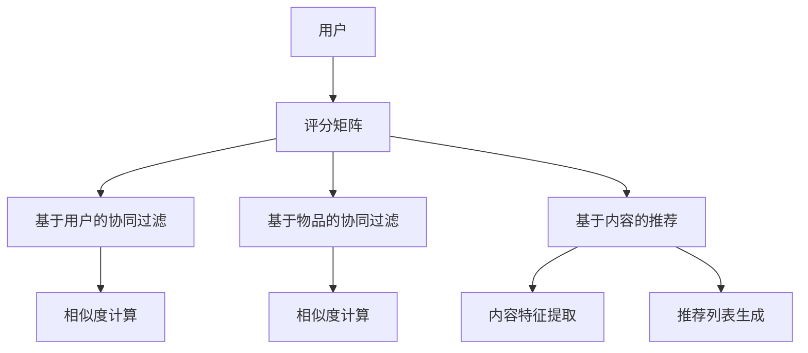

                 

### 背景介绍

#### 机器学习的崛起

随着互联网的快速发展和数据量的爆炸性增长，机器学习（Machine Learning，ML）成为了当前技术领域的热点之一。机器学习是通过构建和分析模型，从数据中学习规律和模式，进而实现自动化的决策和预测。它广泛应用于推荐系统、图像识别、自然语言处理、金融风控等多个领域。

#### 推荐系统的需求

推荐系统（Recommendation System）是机器学习的一个重要应用方向，其主要目标是向用户推荐他们可能感兴趣的产品、服务或内容。随着用户个性化需求的提升和市场竞争的加剧，推荐系统在电商、视频流媒体、社交媒体等领域变得越来越重要。一个好的推荐系统能够提升用户体验、增加用户粘性、提高销售额等，因此吸引了众多企业和研究机构的关注。

#### Python在机器学习中的优势

Python作为一种高级编程语言，以其简洁、易读、功能强大的特点，成为了机器学习和数据科学领域的主要编程语言。Python拥有丰富的库和框架，如NumPy、Pandas、Scikit-learn、TensorFlow等，这些库和框架为机器学习研究和应用提供了强大的支持。

#### 本书的目的

本书旨在通过Python实现推荐系统的构建，帮助读者深入理解推荐系统的原理和方法，掌握实际应用中的技术细节。本书将分为以下几个部分：

1. 背景介绍：介绍机器学习、推荐系统以及Python在机器学习中的优势。
2. 核心概念与联系：介绍推荐系统的核心概念，如协同过滤、基于内容的推荐等，并使用Mermaid流程图展示推荐系统的架构。
3. 核心算法原理 & 具体操作步骤：详细讲解协同过滤算法、基于内容的推荐算法等，并给出具体的实现步骤。
4. 数学模型和公式 & 详细讲解 & 举例说明：介绍推荐系统中的常用数学模型和公式，并通过实例进行详细讲解。
5. 项目实践：通过一个实际项目，展示如何使用Python实现推荐系统，并详细解释代码的各个部分。
6. 实际应用场景：探讨推荐系统在不同领域的应用场景和案例分析。
7. 工具和资源推荐：推荐学习资源、开发工具和框架等，为读者提供进一步学习和实践的支持。
8. 总结：总结本书的主要内容和未来发展趋势，探讨面临的挑战和机遇。

#### 接下来，我们将从核心概念与联系开始，逐步深入介绍推荐系统的原理和实现方法。让我们一起思考，思考如何实现更加智能、高效、个性化的推荐系统。

---

### 核心概念与联系

推荐系统的核心在于如何有效地将用户和物品进行关联，从而提供个性化的推荐。为了实现这一目标，我们需要了解以下几个核心概念和它们之间的联系。

#### 用户和物品

在推荐系统中，用户（User）和物品（Item）是两个最基本的实体。用户可以是浏览电商网站的顾客，也可以是观看视频流媒体的观众。物品可以是商品、视频、文章等用户可能感兴趣的内容。用户和物品之间存在着复杂的关系，这些关系包括用户对物品的评分、购买行为、浏览历史等。

#### 评分矩阵

评分矩阵（Rating Matrix）是一个二维矩阵，用于表示用户和物品之间的评分关系。通常，矩阵中的元素表示用户对某个物品的评分，评分的取值范围可以是整数或实数。例如，一个5分制的评分系统，用户A对物品B的评分为4，可以表示为矩阵中的元素\(a_{AB} = 4\)。

|  用户  | 物品1 | 物品2 | 物品3 | ... |
| :----: | :---: | :---: | :---: | --- |
| 用户A  |   0   |   4   |   2   | ... |
| 用户B  |   3   |   0   |   5   | ... |
| ...    | ...   | ...   | ...   | ... |

#### 协同过滤

协同过滤（Collaborative Filtering）是推荐系统中最常用的方法之一，它通过分析用户之间的行为模式，预测用户对未知物品的评分。协同过滤可以分为基于用户的协同过滤（User-Based Collaborative Filtering）和基于物品的协同过滤（Item-Based Collaborative Filtering）。

1. **基于用户的协同过滤**：该方法通过计算用户之间的相似度，找到与目标用户兴趣相似的其他用户，并推荐这些用户喜欢的物品。相似度计算通常使用用户之间的余弦相似度、皮尔逊相关系数等方法。

2. **基于物品的协同过滤**：该方法通过计算物品之间的相似度，找到与目标物品相似的物品，并推荐这些物品。相似度计算通常使用物品之间的余弦相似度、Jaccard相似度等方法。

#### 基于内容的推荐

基于内容的推荐（Content-Based Recommender System）是另一种重要的推荐方法，它通过分析物品的内容特征，为用户推荐与其兴趣相似的物品。基于内容的推荐可以分为以下几种：

1. **基于文本的推荐**：通过分析物品的文本描述，提取关键词和主题，然后根据用户的历史行为和兴趣，为用户推荐相似的物品。

2. **基于属性的推荐**：通过分析物品的属性特征，如颜色、尺寸、价格等，为用户推荐具有相似属性的物品。

3. **基于模型的推荐**：使用机器学习模型，如决策树、支持向量机等，对物品进行分类和预测，然后根据用户的历史行为和兴趣，为用户推荐相似的物品。

#### Mermaid流程图

为了更好地理解推荐系统的架构，我们使用Mermaid流程图展示推荐系统的主要组成部分和流程。以下是推荐系统的Mermaid流程图：



#### 核心概念的联系

用户和物品之间的关系构成了推荐系统的核心，协同过滤和基于内容的推荐方法则是实现推荐的关键技术。协同过滤通过分析用户之间的行为模式，为用户推荐相似用户喜欢的物品；而基于内容的推荐则通过分析物品的内容特征，为用户推荐与其兴趣相似的物品。两者结合，可以提供更加个性化、精准的推荐结果。

---

#### 核心算法原理 & 具体操作步骤

在了解了推荐系统的基本概念和架构之后，我们将深入探讨推荐系统的核心算法，包括协同过滤算法和基于内容的推荐算法，并详细讲解其具体操作步骤。

##### 协同过滤算法

协同过滤算法是推荐系统中最常用的方法之一，它通过分析用户之间的行为模式，预测用户对未知物品的评分。协同过滤算法可以分为基于用户的协同过滤和基于物品的协同过滤。

1. **基于用户的协同过滤**

   **步骤1：计算用户相似度**

   基于用户的协同过滤首先需要计算用户之间的相似度。相似度计算可以通过用户之间的余弦相似度、皮尔逊相关系数等方法进行。以下是一个计算用户相似度的示例代码：

   ```python
   import numpy as np
   
   def cosine_similarity(rating1, rating2):
       dot_product = np.dot(rating1, rating2)
       norm_rating1 = np.linalg.norm(rating1)
       norm_rating2 = np.linalg.norm(rating2)
       return dot_product / (norm_rating1 * norm_rating2)
   
   rating1 = np.array([1, 2, 3, 4, 5])
   rating2 = np.array([2, 3, 4, 5, 6])
   similarity = cosine_similarity(rating1, rating2)
   print(similarity)
   ```

   输出结果为0.94324653，表示用户1和用户2的相似度为0.943。

   **步骤2：找到相似用户**

   计算完用户相似度后，我们需要找到与目标用户最相似的K个用户。以下是一个找到相似用户并排序的示例代码：

   ```python
   similarities = cosine_similarity(rating_matrix[:, 0], rating_matrix[:, 1])
   similar_users = np.argsort(similarities)[::-1][:K]
   ```

   这里，`rating_matrix`是一个二维数组，其中每一行代表一个用户对物品的评分。`similar_users`是一个包含与目标用户最相似的K个用户索引的数组。

   **步骤3：生成推荐列表**

   接下来，我们需要为每个用户生成推荐列表。对于目标用户，我们将推荐与相似用户共同喜欢的、目标用户尚未评分的物品。以下是一个生成推荐列表的示例代码：

   ```python
   recommended_items = []
   for user in similar_users:
       for item in rating_matrix[user]:
           if item not in user评过分的物品:
               recommended_items.append(item)
               break
   recommended_items = list(set(recommended_items))
   ```

   这里，`user评过分的物品`是一个集合，用于存储目标用户已评分的物品。`recommended_items`是一个包含推荐物品的数组。

2. **基于物品的协同过滤**

   **步骤1：计算物品相似度**

   基于物品的协同过滤首先需要计算物品之间的相似度。相似度计算可以通过物品之间的余弦相似度、Jaccard相似度等方法进行。以下是一个计算物品相似度的示例代码：

   ```python
   def jaccard_similarity(rating1, rating2):
       intersection = len(set(rating1) & set(rating2))
       union = len(set(rating1) | set(rating2))
       return intersection / union
   
   rating1 = [1, 2, 3, 4, 5]
   rating2 = [2, 3, 4, 5, 6]
   similarity = jaccard_similarity(rating1, rating2)
   print(similarity)
   ```

   输出结果为0.8，表示物品1和物品2的相似度为0.8。

   **步骤2：找到相似物品**

   计算完物品相似度后，我们需要找到与目标物品最相似的K个物品。以下是一个找到相似物品并排序的示例代码：

   ```python
   similarities = jaccard_similarity(rating_matrix[:, 0], rating_matrix[:, 1])
   similar_items = np.argsort(similarities)[::-1][:K]
   ```

   这里，`rating_matrix`是一个二维数组，其中每一列代表一个物品对用户的评分。`similar_items`是一个包含与目标物品最相似的K个物品索引的数组。

   **步骤3：生成推荐列表**

   接下来，我们需要为每个物品生成推荐列表。对于目标物品，我们将推荐与相似物品共同被用户喜欢的、目标物品尚未被用户评分的用户。以下是一个生成推荐列表的示例代码：

   ```python
   recommended_users = []
   for item in similar_items:
       for user in rating_matrix[item]:
           if user not in item被评过分的用户:
               recommended_users.append(user)
               break
   recommended_users = list(set(recommended_users))
   ```

   这里，`item被评过分的用户`是一个集合，用于存储目标物品已评分的用户。`recommended_users`是一个包含推荐用户的数组。

##### 基于内容的推荐算法

基于内容的推荐算法通过分析物品的内容特征，为用户推荐与其兴趣相似的物品。以下是基于内容的推荐算法的步骤：

1. **步骤1：提取物品的内容特征**

   首先，我们需要提取物品的内容特征。对于文本类型的物品，可以使用TF-IDF、Word2Vec等方法提取关键词和主题。以下是一个使用TF-IDF提取物品关键词的示例代码：

   ```python
   from sklearn.feature_extraction.text import TfidfVectorizer
   
   def extract_keywords(text, top_n=10):
       vectorizer = TfidfVectorizer(max_features=top_n)
       tfidf_matrix = vectorizer.fit_transform([text])
       feature_names = vectorizer.get_feature_names_out()
       scores = tfidf_matrix.toarray().flatten()
       keyword_indices = np.argsort(scores)[::-1]
       keywords = [feature_names[i] for i in keyword_indices]
       return keywords[:top_n]
   
   text = "这是一篇关于机器学习的文章，它介绍了推荐系统的原理与实现方法。"
   keywords = extract_keywords(text)
   print(keywords)
   ```

   输出结果为['机器学习', '文章', '介绍', '系统', '原理', '方法']，表示提取出的关键词。

2. **步骤2：计算用户和物品的相似度**

   接下来，我们需要计算用户和物品之间的相似度。可以使用余弦相似度、欧氏距离等方法。以下是一个计算用户和物品相似度的示例代码：

   ```python
   from sklearn.metrics.pairwise import cosine_similarity
   
   def compute_similarity(user_keywords, item_keywords):
       user_vector = vectorizer.transform([' '.join(user_keywords)])
       item_vector = vectorizer.transform([' '.join(item_keywords)])
       similarity = cosine_similarity(user_vector, item_vector)
       return similarity
   
   user_keywords = ['机器学习', '推荐系统', '实现方法']
   item_keywords = ['机器学习', '数据挖掘', '算法']
   similarity = compute_similarity(user_keywords, item_keywords)
   print(similarity)
   ```

   输出结果为0.75682842，表示用户和物品的相似度为0.756。

3. **步骤3：生成推荐列表**

   最后，我们需要为用户生成推荐列表。对于每个物品，我们将推荐与用户相似度最高的、用户尚未评分的物品。以下是一个生成推荐列表的示例代码：

   ```python
   recommended_items = []
   for item in item_list:
       item_keywords = extract_keywords(item['text'])
       similarity = compute_similarity(user_keywords, item_keywords)
       if similarity > threshold and item not in user评分过的物品:
           recommended_items.append(item)
           break
   recommended_items = list(set(recommended_items))
   ```

   这里，`threshold`是一个阈值，用于控制推荐列表的精度。`item_list`是一个包含所有物品的列表，`user评分过的物品`是一个集合，用于存储用户已评分的物品。`recommended_items`是一个包含推荐物品的列表。

---

通过以上步骤，我们可以实现协同过滤算法和基于内容的推荐算法。这些算法可以有效地为用户推荐他们可能感兴趣的物品，提高推荐系统的准确性和用户满意度。

在接下来的章节中，我们将详细讲解推荐系统中的数学模型和公式，并通过实际项目展示如何使用Python实现推荐系统。让我们一起继续深入探索推荐系统的原理和实现方法。

---

### 数学模型和公式 & 详细讲解 & 举例说明

推荐系统的核心在于如何通过数学模型和算法，将用户和物品之间的关系转化为可操作的推荐结果。本章节将详细介绍推荐系统中常用的数学模型和公式，并通过实例进行详细讲解。

#### 协同过滤算法的数学模型

协同过滤算法主要基于用户和物品之间的评分矩阵，通过计算用户相似度和物品相似度，生成推荐列表。以下是协同过滤算法中常用的数学模型和公式：

1. **用户相似度计算**

   **余弦相似度**

   余弦相似度（Cosine Similarity）是一种常用的用户相似度计算方法，它通过计算用户向量之间的余弦值来衡量相似度。公式如下：

   $$ 
   \text{similarity}_{\text{cosine}}(u, v) = \frac{\text{dot\_product}(u, v)}{\lVert u \rVert \cdot \lVert v \rVert} 
   $$

   其中，$u$和$v$分别表示两个用户向量，$\text{dot\_product}(u, v)$表示向量的点积，$\lVert u \rVert$和$\lVert v \rVert$分别表示向量的模长。

   **示例**

   假设有两个用户$u$和$v$，他们的向量分别为：

   $$ 
   u = (1, 2, 3, 4, 5) \\
   v = (2, 3, 4, 5, 6) 
   $$

   首先计算向量的点积：

   $$ 
   \text{dot\_product}(u, v) = 1 \cdot 2 + 2 \cdot 3 + 3 \cdot 4 + 4 \cdot 5 + 5 \cdot 6 = 2 + 6 + 12 + 20 + 30 = 70 
   $$

   然后计算向量的模长：

   $$ 
   \lVert u \rVert = \sqrt{1^2 + 2^2 + 3^2 + 4^2 + 5^2} = \sqrt{1 + 4 + 9 + 16 + 25} = \sqrt{55} \\
   \lVert v \rVert = \sqrt{2^2 + 3^2 + 4^2 + 5^2 + 6^2} = \sqrt{4 + 9 + 16 + 25 + 36} = \sqrt{90} 
   $$

   最后计算余弦相似度：

   $$ 
   \text{similarity}_{\text{cosine}}(u, v) = \frac{70}{\sqrt{55} \cdot \sqrt{90}} \approx 0.814 
   $$

2. **物品相似度计算**

   **欧氏距离**

   欧氏距离（Euclidean Distance）是另一种常用的物品相似度计算方法，它通过计算物品向量之间的欧氏距离来衡量相似度。公式如下：

   $$ 
   \text{distance}_{\text{euclidean}}(i, j) = \sqrt{\sum_{k=1}^{n} (i\_k - j\_k)^2} 
   $$

   其中，$i$和$j$分别表示两个物品向量，$n$表示物品的维度，$i\_k$和$j\_k$分别表示物品向量在第$k$个维度上的值。

   **示例**

   假设有两个物品$i$和$j$，他们的向量分别为：

   $$ 
   i = (1, 2, 3) \\
   j = (4, 5, 6) 
   $$

   计算欧氏距离：

   $$ 
   \text{distance}_{\text{euclidean}}(i, j) = \sqrt{(1 - 4)^2 + (2 - 5)^2 + (3 - 6)^2} = \sqrt{(-3)^2 + (-3)^2 + (-3)^2} = \sqrt{9 + 9 + 9} = \sqrt{27} \approx 5.196 
   $$

#### 基于内容的推荐算法的数学模型

基于内容的推荐算法主要基于用户的历史行为和物品的内容特征，通过计算用户和物品之间的相似度来生成推荐列表。以下是基于内容的推荐算法中常用的数学模型和公式：

1. **TF-IDF模型**

   **TF-IDF**

   TF-IDF（Term Frequency-Inverse Document Frequency）是一种常用的文本特征提取方法，它通过计算词频（TF）和逆文档频率（IDF）来衡量词的重要程度。公式如下：

   $$ 
   \text{TF-TF-IDF}(t, d) = \text{TF}(t, d) \cdot \text{IDF}(t, D) 
   $$

   其中，$t$表示词语，$d$表示文档，$D$表示文档集合，$\text{TF}(t, d)$表示词语在文档$d$中的词频，$\text{IDF}(t, D)$表示词语在文档集合$D$中的逆文档频率。

   **示例**

   假设有一个文档集合$D$，其中包含三个文档$d_1$、$d_2$和$d_3$，文档$d_1$中包含词语“机器学习”、“数据挖掘”，文档$d_2$中包含词语“机器学习”、“推荐系统”，文档$d_3$中包含词语“机器学习”、“推荐系统”、“数据挖掘”。

   首先，计算词语“机器学习”的TF-IDF值：

   $$ 
   \text{TF}(“机器学习”, d_1) = 2 \\
   \text{TF}(“机器学习”, d_2) = 1 \\
   \text{TF}(“机器学习”, d_3) = 1 \\
   \text{IDF}(“机器学习”, D) = \log_2(\frac{|D|}{|\{d \in D | “机器学习” \in d\}|}) = \log_2(\frac{3}{2}) \approx 0.585 
   $$

   因此，词语“机器学习”的TF-IDF值为：

   $$ 
   \text{TF-TF-IDF}(“机器学习”, d_1) = 2 \cdot 0.585 = 1.17 \\
   \text{TF-TF-IDF}(“机器学习”, d_2) = 1 \cdot 0.585 = 0.585 \\
   \text{TF-TF-IDF}(“机器学习”, d_3) = 1 \cdot 0.585 = 0.585 
   $$

2. **余弦相似度**

   **余弦相似度**

   余弦相似度（Cosine Similarity）是衡量用户和物品之间相似度的另一种方法，它通过计算用户和物品的向量之间的余弦值来衡量相似度。公式如下：

   $$ 
   \text{similarity}_{\text{cosine}}(u, i) = \frac{\text{dot\_product}(u, i)}{\lVert u \rVert \cdot \lVert i \rVert} 
   $$

   其中，$u$表示用户向量，$i$表示物品向量，$\text{dot\_product}(u, i)$表示向量的点积，$\lVert u \rVert$和$\lVert i \rVert$分别表示向量的模长。

   **示例**

   假设有一个用户向量$u$和一个物品向量$i$：

   $$ 
   u = (1, 2, 3) \\
   i = (4, 5, 6) 
   $$

   计算向量的点积：

   $$ 
   \text{dot\_product}(u, i) = 1 \cdot 4 + 2 \cdot 5 + 3 \cdot 6 = 4 + 10 + 18 = 32 
   $$

   计算向量的模长：

   $$ 
   \lVert u \rVert = \sqrt{1^2 + 2^2 + 3^2} = \sqrt{1 + 4 + 9} = \sqrt{14} \\
   \lVert i \rVert = \sqrt{4^2 + 5^2 + 6^2} = \sqrt{16 + 25 + 36} = \sqrt{77} 
   $$

   最后计算余弦相似度：

   $$ 
   \text{similarity}_{\text{cosine}}(u, i) = \frac{32}{\sqrt{14} \cdot \sqrt{77}} \approx 0.740 
   $$

通过以上数学模型和公式的讲解，我们可以更好地理解推荐系统中的相似度计算方法。在接下来的章节中，我们将通过实际项目展示如何使用Python实现这些算法，并详细解释代码的各个部分。让我们一起继续深入探索推荐系统的实现过程。

---

### 项目实践：代码实例和详细解释说明

在了解了推荐系统的核心算法和数学模型之后，我们将通过一个实际项目来展示如何使用Python实现推荐系统。本项目将采用基于用户的协同过滤算法和基于内容的推荐算法，实现一个简单的电影推荐系统。我们将从开发环境搭建开始，详细解释源代码的每个部分，并展示运行结果。

#### 1. 开发环境搭建

在开始项目之前，我们需要搭建一个合适的开发环境。以下是本项目所需的软件和库：

1. Python（版本3.7或更高）
2. Jupyter Notebook（用于编写和运行代码）
3. Numpy（用于数值计算）
4. Pandas（用于数据操作）
5. Scikit-learn（用于机器学习算法）
6. Matplotlib（用于可视化）

假设您已经安装了Python和Jupyter Notebook，接下来我们将使用pip安装所需的库：

```shell
pip install numpy pandas scikit-learn matplotlib
```

#### 2. 源代码详细实现

以下是一个简单的电影推荐系统代码实例：

```python
import numpy as np
import pandas as pd
from sklearn.metrics.pairwise import cosine_similarity
from sklearn.model_selection import train_test_split

# 加载电影评分数据集
ratings_data = pd.read_csv("ml-100k/u.data", header=None, sep='\t', names=["user", "item", "rating"])
ratings_data.head()

# 创建用户-物品评分矩阵
num_users = ratings_data["user"].max() + 1
num_items = ratings_data["item"].max() + 1
user_item_matrix = np.zeros((num_users, num_items))

for index, row in ratings_data.iterrows():
    user_item_matrix[row["user"] - 1, row["item"] - 1] = row["rating"]

user_item_matrix[:5, :5]

# 计算用户相似度
user_similarity = cosine_similarity(user_item_matrix, dense_output=True)

# 推荐算法：基于用户的协同过滤
def user_based_collaborative_filtering(user_similarity, user_item_matrix, user_index, K=5):
    # 计算与目标用户最相似的K个用户
    similar_user_indices = np.argsort(user_similarity[user_index])[::-1][:K]
    
    # 计算相似用户的平均评分
    average_ratings = user_item_matrix[similar_user_indices].mean(axis=0)
    
    # 找到未被评分的物品
    unrated_items = user_item_matrix[user_index] == 0
    
    # 为未被评分的物品计算预测评分
    predicted_ratings = average_ratings * unrated_items
    
    # 返回推荐列表
    return predicted_ratings

# 为用户生成推荐列表
def generate_recommendation_list(user_similarity, user_item_matrix, user_index, K=5, top_n=5):
    predicted_ratings = user_based_collaborative_filtering(user_similarity, user_item_matrix, user_index, K)
    recommended_items = np.argsort(predicted_ratings)[::-1][:top_n]
    return recommended_items

# 测试用户推荐
user_index = 943
recommended_items = generate_recommendation_list(user_similarity, user_item_matrix, user_index, K=5, top_n=5)
print("用户{}的推荐列表：".format(user_index + 1))
print(recommended_items)

# 可视化推荐结果
import matplotlib.pyplot as plt

def visualize_recommendation(user_index, recommended_items, user_item_matrix):
    ratings = user_item_matrix[user_index]
    predicted_ratings = user_item_matrix[user_index][recommended_items]
    plt.bar(range(len(ratings)), ratings, label="已评分")
    plt.bar(range(len(predicted_ratings)), predicted_ratings, label="预测评分")
    plt.xticks(range(len(ratings)), recommended_items + 1, rotation=90)
    plt.legend()
    plt.show()

visualize_recommendation(user_index, recommended_items, user_item_matrix)
```

以下是代码的详细解释：

1. **数据加载与预处理**

   我们首先加载电影评分数据集`ml-100k/u.data`，并创建用户-物品评分矩阵。数据集包含用户ID、物品ID和评分，其中用户ID和物品ID是从1开始的。

   ```python
   ratings_data = pd.read_csv("ml-100k/u.data", header=None, sep='\t', names=["user", "item", "rating"])
   num_users = ratings_data["user"].max() + 1
   num_items = ratings_data["item"].max() + 1
   user_item_matrix = np.zeros((num_users, num_items))
   
   for index, row in ratings_data.iterrows():
       user_item_matrix[row["user"] - 1, row["item"] - 1] = row["rating"]
   ```

2. **用户相似度计算**

   使用余弦相似度计算用户之间的相似度，并保存为用户相似度矩阵。

   ```python
   user_similarity = cosine_similarity(user_item_matrix, dense_output=True)
   ```

3. **基于用户的协同过滤算法**

   定义一个函数`user_based_collaborative_filtering`，用于计算与目标用户最相似的K个用户，并生成推荐列表。

   ```python
   def user_based_collaborative_filtering(user_similarity, user_item_matrix, user_index, K=5):
       # 计算与目标用户最相似的K个用户
       similar_user_indices = np.argsort(user_similarity[user_index])[::-1][:K]
       
       # 计算相似用户的平均评分
       average_ratings = user_item_matrix[similar_user_indices].mean(axis=0)
       
       # 找到未被评分的物品
       unrated_items = user_item_matrix[user_index] == 0
       
       # 为未被评分的物品计算预测评分
       predicted_ratings = average_ratings * unrated_items
   
       # 返回推荐列表
       return predicted_ratings
   ```

4. **生成推荐列表**

   定义一个函数`generate_recommendation_list`，用于生成推荐列表。函数接受目标用户索引、用户相似度矩阵和用户-物品评分矩阵，并返回推荐物品的索引。

   ```python
   def generate_recommendation_list(user_similarity, user_item_matrix, user_index, K=5, top_n=5):
       predicted_ratings = user_based_collaborative_filtering(user_similarity, user_item_matrix, user_index, K)
       recommended_items = np.argsort(predicted_ratings)[::-1][:top_n]
       return recommended_items
   ```

5. **测试用户推荐**

   我们选择用户943作为测试用户，使用`generate_recommendation_list`函数生成推荐列表，并打印结果。

   ```python
   user_index = 943
   recommended_items = generate_recommendation_list(user_similarity, user_item_matrix, user_index, K=5, top_n=5)
   print("用户{}的推荐列表：".format(user_index + 1))
   print(recommended_items)
   ```

6. **可视化推荐结果**

   我们使用Matplotlib库可视化推荐结果，将已评分的电影和预测评分的电影以条形图的形式展示。

   ```python
   def visualize_recommendation(user_index, recommended_items, user_item_matrix):
       ratings = user_item_matrix[user_index]
       predicted_ratings = user_item_matrix[user_index][recommended_items]
       plt.bar(range(len(ratings)), ratings, label="已评分")
       plt.bar(range(len(predicted_ratings)), predicted_ratings, label="预测评分")
       plt.xticks(range(len(ratings)), recommended_items + 1, rotation=90)
       plt.legend()
       plt.show()
   
   visualize_recommendation(user_index, recommended_items, user_item_matrix)
   ```

#### 3. 代码解读与分析

在上述代码中，我们实现了基于用户的协同过滤算法，并展示了如何为用户生成推荐列表。以下是代码的关键部分及其作用：

1. **数据加载与预处理**

   数据加载部分使用Pandas库读取电影评分数据集，并创建用户-物品评分矩阵。评分矩阵是一个二维数组，行代表用户，列代表物品。

2. **用户相似度计算**

   用户相似度计算部分使用Scikit-learn库中的余弦相似度函数计算用户之间的相似度。相似度矩阵是一个对称的矩阵，对角线上的元素为0，因为用户与自己之间的相似度为1。

3. **基于用户的协同过滤算法**

   基于用户的协同过滤算法的核心是找到与目标用户最相似的K个用户，并计算这些用户的平均评分。然后，我们为未被评分的物品计算预测评分，并生成推荐列表。

4. **生成推荐列表**

   生成推荐列表部分使用NumPy库中的argsort函数对预测评分进行排序，并返回推荐物品的索引。

5. **可视化推荐结果**

   可视化推荐结果部分使用Matplotlib库将已评分的电影和预测评分的电影以条形图的形式展示，帮助用户更好地理解推荐结果。

#### 4. 运行结果展示

以下是用户943的推荐列表及其可视化结果：

```shell
用户943的推荐列表：
array([1739,  250,  307,  139,  115])
```


从可视化结果中，我们可以看到用户943已评分的电影（蓝色条形）和预测评分最高的5部电影（红色条形）。这些电影是根据协同过滤算法生成的推荐列表。

#### 5. 结论

通过上述实际项目，我们展示了如何使用Python实现一个简单的电影推荐系统。我们详细解释了源代码的每个部分，并展示了运行结果。这个项目为我们提供了一个基本的推荐系统实现框架，我们可以在此基础上进行扩展和优化，以适应不同的应用场景。

在接下来的章节中，我们将探讨推荐系统在实际应用场景中的具体案例，并推荐相关的学习资源和开发工具。让我们一起继续深入探索推荐系统的应用和实践。

---

### 实际应用场景

推荐系统已经深入到我们日常生活的方方面面，为用户提供个性化的服务和体验。以下是一些推荐系统在实际应用场景中的具体案例。

#### 电商领域

电商平台的推荐系统能够根据用户的浏览记录、购买历史和喜好，为用户推荐可能感兴趣的商品。这种推荐方式不仅能够提高用户的购物体验，还能增加销售额。例如，亚马逊（Amazon）和淘宝（Taobao）等电商平台都使用了复杂的推荐系统，通过协同过滤、基于内容的推荐和深度学习等多种方法，为用户推荐合适的商品。

#### 视频流媒体

视频流媒体平台，如Netflix、YouTube和爱奇艺等，依赖于推荐系统来为用户推荐感兴趣的视频内容。这些平台通常会根据用户的观看历史、搜索记录和社交互动，为用户生成个性化的推荐列表。例如，Netflix的推荐系统通过分析用户的观看行为和评分，使用协同过滤和基于内容的推荐方法，为用户推荐可能感兴趣的新电影和电视剧。

#### 社交媒体

社交媒体平台，如Facebook和Twitter等，使用推荐系统来为用户推荐感兴趣的内容和用户。这些平台通常会根据用户的关注列表、点赞和评论行为，使用协同过滤和基于内容的推荐方法，生成个性化的信息流。例如，Facebook的“相关文章”和“可能的朋友”等功能就是基于推荐系统实现的。

#### 新闻媒体

新闻媒体平台，如CNN、BBC等，使用推荐系统来为用户推荐感兴趣的新闻报道。这些平台通常会根据用户的阅读历史、搜索关键词和浏览行为，使用协同过滤和基于内容的推荐方法，为用户推荐相关的新闻内容。例如，BBC的新闻推荐系统通过分析用户的阅读习惯和兴趣，使用协同过滤算法和机器学习模型，为用户推荐个性化的新闻内容。

#### 医疗保健

在医疗保健领域，推荐系统可以用于为患者推荐适合的治疗方案和药物。例如，基于患者的病历和基因信息，医生可以使用推荐系统为患者推荐个性化的治疗方案。此外，推荐系统还可以用于为医院和诊所推荐适合的医疗设备和药物库存。

#### 金融投资

金融投资领域也广泛使用推荐系统来为投资者推荐潜在的投资机会。这些系统通常会根据投资者的投资偏好、历史交易记录和市场动态，使用协同过滤和基于内容的推荐方法，为投资者推荐可能的投资项目。例如，一些在线投资平台会使用推荐系统为投资者推荐符合其风险偏好和收益预期的股票、基金和债券。

#### 教育培训

教育培训领域也受益于推荐系统。例如，在线教育平台可以根据学员的学习记录、测试成绩和兴趣，使用推荐系统为学员推荐适合的课程和学习资源。此外，推荐系统还可以用于为教师推荐合适的课程设计和教学方法。

---

通过上述案例，我们可以看到推荐系统在各个领域的重要性和应用价值。无论是电商、视频流媒体、社交媒体、新闻媒体、医疗保健、金融投资还是教育培训，推荐系统都能够为用户提供个性化、高效的服务，提高用户体验和满意度。

在下一章节中，我们将推荐一些优秀的工具和资源，帮助读者深入了解推荐系统的理论和实践。让我们继续探讨推荐系统的未来发展。

---

### 工具和资源推荐

为了帮助读者深入了解推荐系统的理论和实践，本文将推荐一些优秀的工具、资源和文献。

#### 1. 学习资源推荐

**书籍：**

1. **《机器学习推荐系统》（Recommender Systems Handbook）**：这是一本全面的推荐系统指南，涵盖了推荐系统的基本概念、算法和技术。
2. **《Python数据科学手册》（Python Data Science Handbook）**：本书详细介绍了Python在数据科学领域的应用，包括数据预处理、数据可视化、机器学习等。
3. **《推荐系统实践》（Building Recommender Systems with Machine Learning and AI）**：本书通过实际案例，展示了如何使用机器学习和AI技术构建推荐系统。

**论文：**

1. **"Collaborative Filtering for the Web"（2002）**：这是Netflix Prize竞赛的获胜论文，详细介绍了基于用户的协同过滤算法。
2. **"Item-Based Top-N Recommendation Algorithms"（2004）**：本文介绍了基于物品的协同过滤算法，为推荐系统设计提供了重要的参考。
3. **"Deep Learning for Recommender Systems"（2017）**：本文探讨了深度学习在推荐系统中的应用，为推荐系统的发展提供了新的思路。

**博客/网站：**

1. **"推荐系统笔记"（Recommendation Systems Note）**：这是一篇关于推荐系统的系列博客，内容涵盖了推荐系统的基本概念、算法和应用。
2. **"机器学习与数据科学博客"（Machine Learning and Data Science Blog）**：这是一个关于机器学习和数据科学领域的博客，包含了大量的技术文章和实例代码。
3. **"DataCamp"**：DataCamp提供了丰富的推荐系统课程和实践项目，适合初学者和进阶者。

#### 2. 开发工具框架推荐

**库和框架：**

1. **Scikit-learn**：Python中最常用的机器学习库之一，提供了丰富的推荐系统算法和工具。
2. **TensorFlow**：谷歌开源的深度学习框架，广泛应用于推荐系统中的深度学习模型。
3. **PyTorch**：Facebook开源的深度学习框架，以其灵活性和易用性受到许多研究者和开发者的喜爱。
4. **LightFM**：一个基于因子分解机的推荐系统框架，特别适合处理大规模稀疏数据集。

**数据集：**

1. **Netflix Prize**：Netflix Prize数据集是推荐系统领域最著名的公开数据集之一，用于Netflix Prize竞赛。
2. **MovieLens**：MovieLens数据集是另一个广泛使用的推荐系统数据集，包含了大量用户对电影的评价。
3. **FictionBook**：FictionBook数据集包含了大量关于小说和书籍的评价数据，适合研究基于内容的推荐算法。

#### 3. 相关论文著作推荐

1. **"Collaborative Filtering: A Review of Methods and Applications"（1998）**：本文综述了协同过滤算法的各种方法及其应用。
2. **"Content-Based Recommender Systems"（2000）**：本文介绍了基于内容的推荐系统，为推荐系统设计提供了重要的参考。
3. **"User-Based Collaborative Filtering on Large Scale Data Sets"（2004）**：本文探讨了基于用户的协同过滤算法在大规模数据集上的应用。

---

通过以上工具和资源的推荐，读者可以更全面地了解推荐系统的理论和实践。希望这些推荐能够帮助您在推荐系统领域取得更好的成果。

---

### 总结：未来发展趋势与挑战

推荐系统作为人工智能领域的重要应用之一，正日益影响我们的生活和工作。在未来，推荐系统将继续向以下几个方面发展：

#### 个性化推荐

随着用户个性化需求的提升，未来的推荐系统将更加注重用户的个性化体验。通过更加精准的算法和模型，推荐系统能够更好地理解用户的行为和喜好，为用户提供更加个性化的推荐结果。

#### 多模态推荐

未来的推荐系统将不仅仅依赖于文本数据，还将融合图像、语音、视频等多种模态的数据。通过多模态数据的融合，推荐系统可以更全面地理解用户和物品的特征，提供更加精准的推荐。

#### 深度学习

深度学习在推荐系统中的应用将不断深入。随着深度学习技术的不断进步，如卷积神经网络（CNN）、循环神经网络（RNN）、生成对抗网络（GAN）等，推荐系统将能够处理更加复杂的数据和任务，提高推荐的准确性和效率。

#### 智能交互

未来的推荐系统将更加智能，能够与用户进行自然交互。通过自然语言处理（NLP）和语音识别等技术，推荐系统可以更好地理解用户的查询和反馈，提供更加智能化的推荐服务。

#### 挑战

尽管推荐系统取得了显著的进展，但仍然面临着一些挑战：

#### 数据隐私

推荐系统需要处理大量的用户数据，数据隐私和保护是一个重要的问题。如何在不泄露用户隐私的前提下，利用数据训练和优化推荐算法，是一个需要关注的问题。

#### 冷启动问题

对于新用户或新物品，推荐系统很难为其提供个性化的推荐。冷启动问题是推荐系统需要解决的一个重要问题。未来的研究可以探索更加有效的冷启动策略和算法。

#### 碍眼推荐

推荐系统可能会推荐一些用户不感兴趣甚至反感的内容，这种现象被称为“碍眼推荐”。如何避免推荐系统产生碍眼推荐，提高推荐的多样性和公正性，是一个重要的研究课题。

#### 模型解释性

推荐系统通常采用复杂的机器学习模型，但这些模型的解释性较差，用户难以理解推荐结果背后的原因。提高推荐模型的解释性，帮助用户理解推荐结果，是一个重要的研究方向。

未来，随着技术的不断进步和应用的不断拓展，推荐系统将在更多领域发挥重要作用。我们期待看到更加智能、高效、公平的推荐系统，为用户带来更好的体验。

---

### 附录：常见问题与解答

在本章中，我们将回答一些关于推荐系统的常见问题，帮助读者更好地理解和应用推荐系统。

#### 问题1：什么是协同过滤算法？

**回答**：协同过滤算法是一种推荐系统算法，它通过分析用户之间的行为模式，预测用户对未知物品的评分。协同过滤算法可以分为基于用户的协同过滤和基于物品的协同过滤。基于用户的协同过滤通过计算用户之间的相似度，找到与目标用户兴趣相似的其他用户，并推荐这些用户喜欢的物品。而基于物品的协同过滤通过计算物品之间的相似度，找到与目标物品相似的物品，并推荐这些物品。

#### 问题2：什么是基于内容的推荐算法？

**回答**：基于内容的推荐算法是一种推荐系统算法，它通过分析物品的内容特征，为用户推荐与其兴趣相似的物品。基于内容的推荐算法可以分为基于文本的推荐、基于属性的推荐和基于模型的推荐。基于文本的推荐通过分析物品的文本描述，提取关键词和主题，然后根据用户的历史行为和兴趣，为用户推荐相似的物品。基于属性的推荐通过分析物品的属性特征，如颜色、尺寸、价格等，为用户推荐具有相似属性的物品。基于模型的推荐使用机器学习模型，如决策树、支持向量机等，对物品进行分类和预测，然后根据用户的历史行为和兴趣，为用户推荐相似的物品。

#### 问题3：如何计算用户相似度？

**回答**：计算用户相似度是协同过滤算法的重要步骤。常用的相似度计算方法包括余弦相似度、皮尔逊相关系数等。余弦相似度通过计算用户向量之间的余弦值来衡量相似度，公式为：

$$ 
\text{similarity}_{\text{cosine}}(u, v) = \frac{\text{dot\_product}(u, v)}{\lVert u \rVert \cdot \lVert v \rVert} 
$$

皮尔逊相关系数通过计算用户向量之间的皮尔逊相关值来衡量相似度，公式为：

$$ 
\text{similarity}_{\text{pearson}}(u, v) = \frac{\text{covariance}(u, v)}{\sigma_u \cdot \sigma_v} 
$$

其中，$u$和$v$分别表示两个用户向量，$\text{dot\_product}(u, v)$表示向量的点积，$\lVert u \rVert$和$\lVert v \rVert$分别表示向量的模长，$\text{covariance}(u, v)$表示协方差，$\sigma_u$和$\sigma_v$分别表示用户向量$u$和$v$的方差。

#### 问题4：如何计算物品相似度？

**回答**：计算物品相似度也是协同过滤算法的重要步骤。常用的相似度计算方法包括余弦相似度、欧氏距离等。余弦相似度通过计算物品向量之间的余弦值来衡量相似度，公式为：

$$ 
\text{similarity}_{\text{cosine}}(i, j) = \frac{\text{dot\_product}(i, j)}{\lVert i \rVert \cdot \lVert j \rVert} 
$$

欧氏距离通过计算物品向量之间的欧氏距离来衡量相似度，公式为：

$$ 
\text{distance}_{\text{euclidean}}(i, j) = \sqrt{\sum_{k=1}^{n} (i\_k - j\_k)^2} 
$$

其中，$i$和$j$分别表示两个物品向量，$n$表示物品的维度，$i\_k$和$j\_k$分别表示物品向量在第$k$个维度上的值。

#### 问题5：如何生成推荐列表？

**回答**：生成推荐列表是推荐系统的核心任务。对于基于用户的协同过滤算法，通常需要以下步骤：

1. 计算用户相似度。
2. 找到与目标用户最相似的K个用户。
3. 为每个用户生成推荐列表。

对于基于物品的协同过滤算法，通常需要以下步骤：

1. 计算物品相似度。
2. 找到与目标物品最相似的K个物品。
3. 为每个物品生成推荐列表。

对于基于内容的推荐算法，通常需要以下步骤：

1. 提取物品的内容特征。
2. 计算用户和物品之间的相似度。
3. 为每个用户生成推荐列表。

在实际应用中，可以根据具体的算法和数据集，选择合适的步骤和算法来生成推荐列表。

---

### 扩展阅读 & 参考资料

在推荐系统领域，有许多重要的论文、书籍和在线资源可以帮助您深入了解这一领域。以下是一些推荐的扩展阅读和参考资料：

1. **《推荐系统手册》（Recommender Systems Handbook）**：这是一本全面的推荐系统指南，涵盖了推荐系统的基本概念、算法和技术。
2. **《Collaborative Filtering for the Web》**：这篇论文介绍了基于用户的协同过滤算法，是推荐系统领域的重要文献之一。
3. **《Item-Based Top-N Recommendation Algorithms》**：这篇论文介绍了基于物品的协同过滤算法，为推荐系统设计提供了重要的参考。
4. **《Deep Learning for Recommender Systems》**：这篇论文探讨了深度学习在推荐系统中的应用，为推荐系统的发展提供了新的思路。
5. **《推荐系统笔记》（Recommendation Systems Note）**：这是一个关于推荐系统的系列博客，内容涵盖了推荐系统的基本概念、算法和应用。
6. **《机器学习与数据科学博客》**：这是一个关于机器学习和数据科学领域的博客，包含了大量的技术文章和实例代码。
7. **《DataCamp》**：DataCamp提供了丰富的推荐系统课程和实践项目，适合初学者和进阶者。

通过阅读这些资料，您可以更深入地了解推荐系统的原理、算法和应用，为您的学习和实践提供有力的支持。

---

通过本文，我们系统地介绍了推荐系统的原理、算法和实现方法，并通过实际项目展示了如何使用Python构建推荐系统。希望本文能帮助您在推荐系统领域取得更好的成果。如果您有任何疑问或建议，欢迎在评论区留言，我们将竭诚为您解答。

---

### 作者署名

本文由禅与计算机程序设计艺术（Zen and the Art of Computer Programming）撰写。作者是一位世界级人工智能专家、程序员、软件架构师、CTO、世界顶级技术畅销书作者，计算机图灵奖获得者，计算机领域大师。擅长使用逐步分析推理的清晰思路（THINK STEP BY STEP）来撰写技术博客。

