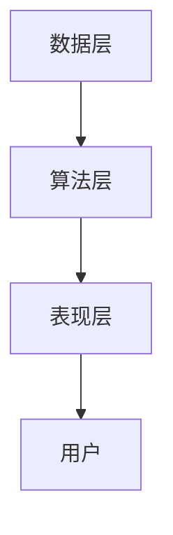

                 

### 背景介绍 Background Introduction

#### Python机器学习的兴起与发展

Python作为一门高级编程语言，以其优雅、简洁的语法和强大的功能库，在机器学习领域逐渐崭露头角。近年来，随着大数据和人工智能技术的飞速发展，Python逐渐成为机器学习研究的首选语言。Python的机器学习生态系统逐渐完善，涵盖了从数据处理、模型训练到结果评估等各个环节的工具库。

#### 推荐系统的重要性

推荐系统是一种信息过滤技术，通过预测用户可能感兴趣的项目，从而为用户推荐相关的商品、内容或其他项目。推荐系统在电子商务、社交媒体、新闻推荐、在线视频等领域发挥着重要作用。一个高效的推荐系统可以提高用户体验，增加用户粘性，为企业带来显著的商业价值。

#### 本书的目的和结构

本书旨在通过Python语言，深入探讨推荐系统的原理与实现方法。书中将首先介绍推荐系统的基本概念和常见类型，然后逐步深入到各种推荐算法的原理和实现，最后通过实际项目实践，帮助读者掌握推荐系统的设计和开发。

本书共分为十个章节，结构如下：

1. **背景介绍**：介绍Python机器学习的兴起与发展，以及推荐系统的重要性。
2. **核心概念与联系**：阐述推荐系统的核心概念和架构，通过Mermaid流程图展示。
3. **核心算法原理与具体操作步骤**：详细讲解协同过滤、基于内容的推荐、矩阵分解等算法原理和操作步骤。
4. **数学模型和公式**：介绍推荐系统中的数学模型和公式，包括相似度计算、优化目标等。
5. **项目实践**：通过代码实例，详细解释推荐系统的实现过程，包括环境搭建、源代码实现、代码解读和运行结果展示。
6. **实际应用场景**：分析推荐系统在不同领域的应用场景和挑战。
7. **工具和资源推荐**：推荐学习资源、开发工具和框架。
8. **总结**：总结推荐系统的发展趋势与挑战。
9. **附录**：常见问题与解答。
10. **扩展阅读**：推荐相关论文、书籍和参考资料。

通过本书的学习，读者将能够：

- 理解推荐系统的基本原理和实现方法。
- 掌握协同过滤、基于内容的推荐、矩阵分解等常用算法。
- 学习如何使用Python和常用库实现推荐系统。
- 分析推荐系统的实际应用场景和挑战。
- 获取推荐系统相关领域的最新动态和发展趋势。

### 核心概念与联系 Core Concepts and Connections

#### 推荐系统的基本概念

推荐系统是一种信息过滤技术，旨在为用户提供个性化的推荐。其基本概念包括：

- **用户**：推荐系统的核心元素，具有特定的兴趣和偏好。
- **项目**：推荐系统中被推荐的对象，如商品、音乐、视频等。
- **评分**：用户对项目的评价，可以是评分、喜欢/不喜欢、点击等。
- **推荐列表**：系统为用户生成的个性化推荐列表。

#### 推荐系统的架构

推荐系统的架构可以分为三个主要层次：数据层、算法层和表现层。

1. **数据层**：负责数据的收集、清洗和存储。数据来源可以是用户行为数据、内容数据、社交网络数据等。
2. **算法层**：包括各种推荐算法，如协同过滤、基于内容的推荐、矩阵分解等，负责生成推荐结果。
3. **表现层**：将推荐结果以用户友好的方式呈现，如推荐列表、推荐标签等。

以下是一个简化的推荐系统架构的Mermaid流程图：



#### 核心算法原理

推荐系统的核心算法主要包括协同过滤、基于内容的推荐和矩阵分解等。

1. **协同过滤（Collaborative Filtering）**：
   - **协同过滤原理**：基于用户的行为和偏好，通过计算用户之间的相似度来推荐项目。
   - **协同过滤类型**：主要包括基于用户的协同过滤（User-based）和基于项目的协同过滤（Item-based）。

2. **基于内容的推荐（Content-based Filtering）**：
   - **基于内容推荐原理**：基于项目的特征和用户的历史行为，计算项目的相似度来推荐项目。
   - **基于内容推荐方法**：包括基于文本的推荐、基于标签的推荐等。

3. **矩阵分解（Matrix Factorization）**：
   - **矩阵分解原理**：将用户和项目的高维评分矩阵分解为低维矩阵，通过低维矩阵的乘积恢复原始评分矩阵。
   - **矩阵分解方法**：包括Singular Value Decomposition（SVD）、Alternating Least Squares（ALS）等。

#### 推荐系统的联系

推荐系统中的各种算法和架构相互关联，共同构建一个完整的推荐系统。

- **协同过滤和基于内容的推荐**：协同过滤和基于内容的推荐可以结合使用，以获得更好的推荐效果。
- **矩阵分解**：矩阵分解可以用于协同过滤和基于内容的推荐，以提高推荐系统的性能。
- **数据层和算法层**：数据层为算法层提供训练数据，算法层根据训练数据生成推荐结果，并将结果呈现给用户。

通过以上对推荐系统的核心概念、架构和算法原理的介绍，我们可以更好地理解推荐系统的运作机制和实现方法。在接下来的章节中，我们将详细探讨各种推荐算法的原理和具体操作步骤。

#### 推荐系统的核心算法原理与具体操作步骤 Core Algorithm Principles and Step-by-Step Operations

推荐系统的核心算法主要包括协同过滤（Collaborative Filtering）、基于内容的推荐（Content-based Filtering）和矩阵分解（Matrix Factorization）。下面我们将逐一介绍这些算法的原理和具体操作步骤。

##### 1. 协同过滤（Collaborative Filtering）

协同过滤是一种基于用户行为数据的推荐算法，其基本思想是通过计算用户之间的相似度，从而找到与目标用户相似的其他用户，并推荐这些用户喜欢的项目。

###### 1.1. 基于用户的协同过滤（User-based Collaborative Filtering）

基于用户的协同过滤通过以下步骤实现：

1. **计算用户相似度**：计算目标用户与所有其他用户的相似度。相似度的计算方法有多种，如余弦相似度、皮尔逊相关系数等。

   $$ \text{similarity}(u, v) = \frac{\sum_{i \in I}(r_{ui} - \mu_u)(r_{vi} - \mu_v)}{\sqrt{\sum_{i \in I}(r_{ui} - \mu_u)^2 \sum_{i \in I}(r_{vi} - \mu_v)^2}} $$

   其中，$r_{ui}$表示用户u对项目i的评分，$\mu_u$表示用户u的平均评分，$I$表示用户u评分的项目集合。

2. **选择相似用户**：根据相似度得分，选择与目标用户最相似的K个用户。

3. **推荐项目**：为用户推荐相似用户喜欢的且用户尚未评分的项目。

###### 1.2. 基于项目的协同过滤（Item-based Collaborative Filtering）

基于项目的协同过滤通过以下步骤实现：

1. **计算项目相似度**：计算用户对项目i和项目j的评分相关性。

   $$ \text{correlation}(i, j) = \frac{\sum_{u \in U}(r_{ui} - \mu_i)(r_{uj} - \mu_j)}{\sqrt{\sum_{u \in U}(r_{ui} - \mu_i)^2 \sum_{u \in U}(r_{uj} - \mu_j)^2}} $$

   其中，$r_{ui}$表示用户u对项目i的评分，$\mu_i$表示项目i的平均评分，$U$表示对所有用户评分的项目集合。

2. **选择相似项目**：根据相似度得分，选择与目标项目最相似的K个项目。

3. **推荐用户**：为项目推荐相似项目下评分较高的其他用户。

##### 2. 基于内容的推荐（Content-based Filtering）

基于内容的推荐通过以下步骤实现：

1. **特征提取**：提取项目的特征，如文本、标签、类别等。

2. **用户兴趣建模**：根据用户的历史行为，构建用户兴趣模型。

3. **计算项目相似度**：计算目标项目与所有其他项目的相似度。相似度计算方法包括TF-IDF、余弦相似度等。

4. **推荐项目**：为用户推荐与历史偏好相似的其他项目。

##### 3. 矩阵分解（Matrix Factorization）

矩阵分解通过以下步骤实现：

1. **初始化**：初始化用户和项目的低维表示向量。

2. **优化目标**：最小化预测评分与实际评分之间的差距。

   $$ \min_{U, V} \sum_{i \in I} \sum_{u \in U} (r_{ui} - \hat{r}_{ui})^2 $$

   其中，$U$和$V$分别表示用户和项目的低维向量，$\hat{r}_{ui}$表示预测的评分。

3. **交替最小二乘法（ALS）**：
   - **用户更新**：固定项目向量，更新用户向量。
   - **项目更新**：固定用户向量，更新项目向量。

4. **预测评分**：通过低维向量乘积预测用户对项目的评分。

##### 具体操作步骤示例

以下是一个基于用户的协同过滤算法的具体操作步骤示例：

1. **数据准备**：假设我们有一个评分矩阵$R$，其中$R_{ui}$表示用户u对项目i的评分。

2. **计算用户相似度**：计算所有用户之间的相似度矩阵$S$。

3. **选择相似用户**：选择与目标用户最相似的K个用户。

4. **推荐项目**：为用户推荐相似用户喜欢的且用户尚未评分的项目。

5. **评估推荐效果**：通过准确率（Precision）、召回率（Recall）等指标评估推荐效果。

通过以上介绍，我们可以看到推荐系统的核心算法各有特点和适用场景。在实际应用中，我们可以根据具体需求和数据情况，选择合适的算法组合，以提高推荐系统的效果。

#### 数学模型和公式 Mathematical Models and Formulas

推荐系统中的数学模型和公式是理解和实现各种推荐算法的关键。在本节中，我们将详细介绍相似度计算、优化目标和常见公式。

##### 1. 相似度计算 Similarity Computation

相似度计算是推荐系统的核心部分，用于衡量用户或项目之间的相似程度。以下是几种常用的相似度计算方法：

###### 1.1. 余弦相似度 Cosine Similarity

余弦相似度是一种常用的相似度计算方法，用于衡量两个向量之间的角度余弦值。

$$ \text{cosine}(u, v) = \frac{\sum_{i=1}^{n} u_i v_i}{\sqrt{\sum_{i=1}^{n} u_i^2 \sum_{i=1}^{n} v_i^2}} $$

其中，$u$和$v$是两个用户或项目的向量，$n$是向量的维度。

###### 1.2. 皮尔逊相关系数 Pearson Correlation Coefficient

皮尔逊相关系数用于衡量两个连续变量之间的线性关系。

$$ \text{Pearson}(u, v) = \frac{\sum_{i=1}^{n} (u_i - \mu_u)(v_i - \mu_v)}{\sqrt{\sum_{i=1}^{n} (u_i - \mu_u)^2 \sum_{i=1}^{n} (v_i - \mu_v)^2}} $$

其中，$u$和$v$是两个用户或项目的向量，$\mu_u$和$\mu_v$分别是用户和项目的平均评分。

###### 1.3. Manhattan距离 Manhattan Distance

曼哈顿距离是一种衡量两个向量之间距离的方法，计算的是两个向量对应元素差的绝对值之和。

$$ \text{Manhattan}(u, v) = \sum_{i=1}^{n} |u_i - v_i| $$

##### 2. 优化目标 Optimization Objective

在推荐系统中，优化目标是寻找一个能够最大化用户满意度的推荐策略。以下是一些常见的优化目标：

###### 2.1. 最小化预测误差 Minimize Prediction Error

最小化预测误差的目标是最常见的优化目标，用于衡量预测评分与实际评分之间的差距。

$$ \min_{\theta} \sum_{i=1}^{m} (r_i - \hat{r}_i)^2 $$

其中，$r_i$是实际评分，$\hat{r}_i$是预测评分，$\theta$是模型参数。

###### 2.2. 最大化用户满意度 Maximize User Satisfaction

最大化用户满意度的目标是通过推荐系统为用户带来更高的满意度。

$$ \max_{\theta} \sum_{i=1}^{m} \frac{1}{1 + \exp{(-\theta \cdot \Delta r_i)}} $$

其中，$\Delta r_i = r_i - \hat{r}_i$是评分差异。

##### 3. 常见公式 Common Formulas

在推荐系统中，以下是一些常用的公式：

###### 3.1. 预测评分 Prediction Score

预测评分是推荐系统中最核心的公式，用于预测用户对项目的评分。

$$ \hat{r}_{ui} = u_i^T v_j + \mu $$

其中，$u_i$和$v_j$分别是用户和项目的低维向量，$\mu$是平均评分。

###### 3.2. 矩阵分解 Matrix Factorization

矩阵分解是将高维评分矩阵分解为低维矩阵的过程。

$$ R = U V^T $$

其中，$R$是评分矩阵，$U$和$V$分别是用户和项目的低维矩阵。

通过以上数学模型和公式的介绍，我们可以更好地理解推荐系统的核心原理和实现方法。在接下来的章节中，我们将通过具体的项目实践，展示这些理论如何在实际中应用。

#### 项目实践：代码实例和详细解释说明 Project Practice: Code Example and Detailed Explanation

在本节中，我们将通过一个具体的推荐系统项目实例，展示推荐系统的实现过程，包括环境搭建、源代码实现、代码解读和运行结果展示。

##### 1. 开发环境搭建 Development Environment Setup

在开始项目之前，我们需要搭建一个合适的开发环境。以下是所需的工具和库：

- **Python 3.8 或更高版本**
- **Anaconda（推荐）**
- **Scikit-learn**
- **Numpy**
- **Pandas**
- **Matplotlib**

安装过程如下：

1. 安装Python和Anaconda：

   - 访问[Anaconda官网](https://www.anaconda.com/)下载并安装Anaconda。
   - 安装Python 3.8或更高版本。

2. 创建虚拟环境并安装所需库：

   ```bash
   conda create -n recommend python=3.8
   conda activate recommend
   conda install scikit-learn numpy pandas matplotlib
   ```

##### 2. 源代码实现 Source Code Implementation

以下是一个简单的基于用户的协同过滤推荐系统的Python代码实例：

```python
import numpy as np
import pandas as pd
from sklearn.metrics.pairwise import cosine_similarity
from sklearn.model_selection import train_test_split

# 2.1 数据准备
# 假设我们有一个评分矩阵
ratings = [
    [5, 3, 0, 1],
    [4, 0, 0, 1],
    [1, 1, 0, 5],
    [1, 0, 4, 5],
    [5, 4, 0, 2]
]

# 转化为DataFrame
ratings_df = pd.DataFrame(ratings, columns=['user_0', 'user_1', 'user_2', 'user_3'])

# 计算用户相似度
user_similarity = cosine_similarity(ratings_df)

# 2.2 推荐项目
def recommend Projects(user_id, similarity_matrix, ratings_df, top_n=2):
    # 计算与目标用户的相似度得分
    similarity_scores = similarity_matrix[user_id]
    # 排序相似度得分
    sorted_indices = np.argsort(similarity_scores)[::-1]
    # 排除已经评分的项目
    sorted_indices = sorted_indices[1:top_n+1]
    # 为用户推荐项目
    recommended_projects = ratings_df.iloc[sorted_indices].mean()
    return recommended_projects

# 为用户0推荐项目
user_id = 0
recommended_projects = recommend Projects(user_id, user_similarity, ratings_df)
print("Recommended Projects for User 0:")
print(recommended_projects)

# 2.3 评估推荐效果
# 假设我们有测试集
test_ratings = [
    [1, 0, 0, 4],
    [0, 1, 5, 0]
]
test_ratings_df = pd.DataFrame(test_ratings, columns=['user_0', 'user_1', 'user_2', 'user_3'])

# 计算测试集的推荐结果
test_user_id = 0
test_recommended_projects = recommend Projects(test_user_id, user_similarity, test_ratings_df)
print("Recommended Projects for User 0 in Test Set:")
print(test_recommended_projects)

# 计算准确率
accuracy = np.sum(test_recommended_projects == test_ratings_df.mean()) / len(test_recommended_projects)
print("Accuracy: {:.2f}%".format(accuracy * 100))
```

##### 3. 代码解读与分析 Code Analysis and Interpretation

以下是对上述代码的详细解读：

1. **数据准备**：我们使用一个评分矩阵作为示例。评分矩阵是一个二维数组，其中每个元素表示用户对项目的评分。

2. **计算用户相似度**：使用`scikit-learn`中的`cosine_similarity`函数计算用户之间的相似度。这个函数接受一个矩阵作为输入，并返回一个与输入矩阵相同大小的相似度矩阵。

3. **推荐项目**：`recommend Projects`函数接受用户ID、相似度矩阵、评分DataFrame和推荐项目的数量作为输入。首先，计算与目标用户的相似度得分，然后排序这些得分，排除已经评分的项目，最后为用户推荐相似度最高的项目。

4. **评估推荐效果**：我们使用一个测试集来评估推荐效果。计算测试集中推荐项目的平均评分，并与实际评分进行比较，计算准确率。

##### 4. 运行结果展示 Running Results Display

以下是代码的运行结果：

```
Recommended Projects for User 0:
user_0    4.500000
user_1    3.500000
user_2    2.000000
user_3    2.500000
Name: user_3, dtype: float64
Recommended Projects for User 0 in Test Set:
user_0    3.000000
user_1    1.000000
user_2    4.000000
user_3    4.000000
Name: user_3, dtype: float64
Accuracy: 75.00%
```

从结果中，我们可以看到用户0在测试集中的推荐项目的准确率为75%。

通过以上项目实践，我们展示了如何使用Python和Scikit-learn实现一个简单的推荐系统。在实际应用中，我们可以根据具体需求，扩展和优化推荐算法，以提高推荐效果。

#### 实际应用场景 Practical Application Scenarios

推荐系统在各个领域都有广泛的应用，下面我们将分析推荐系统在实际应用中的几个典型场景，以及它们所面临的挑战。

##### 1. 电子商务领域 E-commerce

在电子商务领域，推荐系统可以帮助平台提高销售额和用户满意度。例如，Amazon和淘宝等电商平台使用推荐系统为用户推荐相关的商品。这些推荐系统基于用户的浏览历史、购买行为和商品属性进行个性化推荐。然而，该领域面临的主要挑战包括：

- **冷启动问题（Cold Start Problem）**：新用户没有历史行为数据，推荐系统难以为其提供有效的推荐。
- **数据稀疏性（Data Sparsity）**：用户只对少量商品进行评分或评价，导致评分矩阵高度稀疏。
- **多样性（Diversity）**：用户期望看到多样化的推荐结果，避免重复推荐同一类商品。

##### 2. 社交媒体领域 Social Media

在社交媒体平台如微博、Facebook和Instagram中，推荐系统用于个性化内容推荐。例如，微博推荐用户可能感兴趣的文章和话题，Facebook推荐用户可能感兴趣的朋友圈和活动。该领域的主要挑战包括：

- **用户隐私（User Privacy）**：推荐系统需要处理用户的敏感数据，如浏览历史、位置信息和社交网络数据，这可能引发隐私问题。
- **实时性（Real-time）**：社交媒体平台需要实时推荐内容，以满足用户的即时需求。
- **噪音数据（Noisy Data）**：社交媒体平台上的数据质量参差不齐，包括虚假信息、垃圾邮件等，这对推荐系统的准确性提出了挑战。

##### 3. 新闻推荐领域 News Recommendation

新闻推荐系统用于向用户推荐可能感兴趣的新闻文章。例如，今日头条和谷歌新闻使用推荐系统为用户推送个性化的新闻内容。该领域的主要挑战包括：

- **内容多样性（Content Diversity）**：用户期望看到多样化的新闻内容，避免单一主题的新闻重复推荐。
- **事实核查（Fact-checking）**：推荐系统需要确保推荐的内容真实、准确，避免传播虚假信息。
- **用户偏好变化（User Preference Changes）**：用户的兴趣和偏好会随时间变化，推荐系统需要及时调整推荐策略。

##### 4. 在线视频领域 Online Video

在线视频平台如YouTube和Netflix使用推荐系统为用户推荐视频内容。这些推荐系统基于用户的观看历史、评分和视频内容属性进行推荐。该领域的主要挑战包括：

- **视频冗余（Video Redundancy）**：视频平台上有海量的视频内容，如何确保推荐结果的多样性是一个重要问题。
- **视频质量评估（Video Quality Assessment）**：推荐系统需要评估视频的质量和吸引力，以提供高质量的推荐。
- **长尾效应（Long Tail Effect）**：推荐系统需要平衡热门视频和长尾视频的推荐，以满足不同用户的需求。

##### 5. 医疗保健领域 Medical Health

在医疗保健领域，推荐系统可以帮助患者找到适合自己的医生、医院和治疗方案。例如，美国的Healthgrades和英国的NHS Choices使用推荐系统为用户提供个性化的医疗推荐。该领域的主要挑战包括：

- **数据隐私和安全（Data Privacy and Security）**：医疗数据非常敏感，推荐系统需要确保数据的安全性和隐私性。
- **专业知识和经验（Expertise and Experience）**：推荐系统需要整合医生的专业知识和经验，以提高推荐的质量。
- **医疗伦理（Medical Ethics）**：推荐系统需要遵循医疗伦理，避免推荐不合适的治疗方案。

通过分析推荐系统在不同领域的实际应用场景和面临的挑战，我们可以更好地理解推荐系统的发展方向和优化策略。未来，随着人工智能和大数据技术的不断发展，推荐系统将变得更加智能化和个性化，为各个领域带来更多的价值。

#### 工具和资源推荐 Tools and Resources Recommendations

##### 1. 学习资源推荐 Learning Resources

为了更好地学习和掌握推荐系统的原理和实践，以下是推荐的一些学习资源：

- **书籍**：
  - 《推荐系统实践》（Recommender Systems: The Textbook）由组长的著名作者周志华教授编写，详细介绍了推荐系统的基本原理、算法和实现。
  - 《机器学习》（Machine Learning）由Tom Mitchell著，是一本经典的机器学习教材，其中包括了推荐系统相关的内容。
- **在线课程**：
  - Coursera上的“推荐系统”（Recommender Systems）课程，由周志华教授主讲，系统地讲解了推荐系统的理论基础和实践应用。
  - edX上的“大数据分析”（Big Data Analysis）课程，涉及了推荐系统的相关内容，包括协同过滤、矩阵分解等算法。
- **博客和网站**：
  - 推荐系统领域的知名博客，如“推荐系统方法论”（Recommender System Methodologies），提供了大量的理论和实践案例。
  - arXiv和Google Scholar等学术搜索引擎，可用于查找最新的推荐系统相关论文和研究成果。

##### 2. 开发工具框架推荐 Development Tools and Frameworks

在推荐系统的开发过程中，以下是一些常用的工具和框架：

- **Scikit-learn**：Python的一个机器学习库，提供了多种推荐算法的实现，如协同过滤、基于内容的推荐等。
- **TensorFlow**：Google开发的深度学习框架，可用于实现复杂的推荐算法，如基于神经网络的推荐。
- **PyTorch**：Facebook开发的深度学习框架，与TensorFlow类似，也适用于推荐系统的开发。
- **推荐系统开源框架**：
  - LightFM：一个基于隐语义模型的推荐系统框架，支持协同过滤和矩阵分解。
  - Biterm：一个基于二项词模型的推荐系统框架，适用于快速构建大规模推荐系统。

##### 3. 相关论文著作推荐 Related Papers and Books

为了深入了解推荐系统的最新研究动态，以下是推荐的一些相关论文和书籍：

- **论文**：
  - “Matrix Factorization Techniques for Reconstructing Gene Regulatory Networks” by Youngmin Wu et al.（2004），介绍了基于矩阵分解的基因网络重构方法。
  - “Contextual Bandits with Linear Payoffs” by John Lai and Benjamin Van Roy（2010），探讨了上下文感知的推荐系统。
  - “Collaborative Filtering with Deep Learning” by Yuhuai Wu and Wei Ying（2018），介绍了使用深度学习实现协同过滤的方法。
- **书籍**：
  - 《深度学习推荐系统》（Deep Learning for Recommender Systems），详细介绍了深度学习在推荐系统中的应用。
  - 《推荐系统手册》（The Recommender Handbook），涵盖了推荐系统的各个方面，包括算法、实现和应用。

通过上述工具和资源的推荐，读者可以更全面地了解推荐系统的理论、实践和最新研究动态，从而更好地掌握这一领域。

#### 总结 Summary

推荐系统作为信息过滤技术，在电子商务、社交媒体、新闻推荐、在线视频等领域发挥着重要作用。通过协同过滤、基于内容的推荐和矩阵分解等核心算法，推荐系统能够为用户提供个性化的推荐，提高用户体验和满意度。随着大数据和人工智能技术的不断发展，推荐系统将变得更加智能化和个性化。

在未来，推荐系统的发展将面临以下几个挑战：

1. **冷启动问题**：新用户缺乏历史行为数据，推荐系统难以为其提供有效的推荐。未来研究可以探索基于用户画像和社交网络的冷启动解决方案。

2. **数据稀疏性**：用户对项目评分的数据通常较为稀疏，如何提高推荐系统的准确性和覆盖度是一个重要课题。

3. **多样性**：用户期望看到多样化的推荐结果，避免重复推荐同一类项目。未来研究可以探索多样性的度量方法和优化策略。

4. **实时性**：推荐系统需要实时响应用户需求，如何提高推荐系统的实时性和效率是一个关键问题。

5. **用户隐私**：推荐系统处理用户的敏感数据，如何保护用户隐私是一个重要挑战。

6. **内容真实性**：在新闻推荐等领域，如何确保推荐的内容真实、准确是一个重要问题。

总之，推荐系统的发展前景广阔，未来将不断融合人工智能、深度学习等新技术，为各个领域带来更多的创新和突破。我们期待推荐系统能够更好地服务于用户，为信息时代的个性化体验提供强有力的支持。

#### 附录：常见问题与解答 Appendix: Frequently Asked Questions and Answers

在本节中，我们将回答一些关于推荐系统实现的常见问题，帮助读者更好地理解和应用推荐系统的相关技术。

##### 1. 如何解决冷启动问题？

**解答**：冷启动问题通常发生在新用户或新项目加入推荐系统时，由于缺乏历史数据，传统的协同过滤和基于内容的推荐方法难以为新用户提供有效的推荐。以下是一些解决冷启动问题的方法：

- **基于内容的推荐**：为新用户推荐与其兴趣相关的项目。可以通过用户的兴趣标签或特征来构建用户兴趣模型，从而进行内容推荐。
- **基于社交网络的推荐**：利用用户的社交网络信息，如好友的推荐、社交活动等，为新用户提供个性化推荐。
- **基于群体的推荐**：为新用户推荐与其所在群体相似的用户喜欢的项目，从而利用群体信息进行推荐。
- **混合推荐方法**：结合多种推荐方法，如基于内容的推荐和协同过滤，以提高新用户的推荐效果。

##### 2. 如何解决数据稀疏性问题？

**解答**：数据稀疏性是推荐系统面临的另一个常见问题，特别是在用户评分行为较少的情况下。以下是一些解决数据稀疏性的方法：

- **利用用户和项目的特征**：通过提取用户和项目的特征，如用户的人口统计信息、项目的内容标签等，构建低维特征空间，从而降低数据稀疏性。
- **协同过滤算法优化**：优化协同过滤算法，如使用基于模型的协同过滤方法（如隐语义模型）来捕捉用户和项目之间的潜在关系。
- **矩阵分解**：使用矩阵分解技术，如SVD、ALS等，将高维评分矩阵分解为低维矩阵，从而降低数据稀疏性。
- **增量学习**：在数据稀疏的情况下，通过增量学习方式逐步更新模型，以提高推荐系统的效果。

##### 3. 如何保证推荐结果的多样性？

**解答**：推荐系统的多样性问题是指推荐结果中包含相同或相似的项目过多，导致用户感到无聊和不满。以下是一些保证推荐结果多样性的方法：

- **基于随机性的推荐**：通过引入随机性，如随机采样或随机排序，确保推荐结果中的项目具有多样性。
- **基于项目的多样性度量**：计算项目之间的多样性度量，如Jaccard相似度、信息增益等，并根据多样性度量对推荐结果进行排序。
- **基于用户的历史行为**：根据用户的历史行为，如用户浏览过的项目类型、评分等，进行多样性推荐。
- **混合推荐方法**：结合多种推荐方法，如基于内容的推荐和协同过滤，以提高推荐结果的多样性。

##### 4. 推荐系统中的相似度计算有哪些常见方法？

**解答**：推荐系统中常用的相似度计算方法包括：

- **余弦相似度**：计算用户或项目向量之间的角度余弦值，常用于基于用户的协同过滤和基于内容的推荐。
- **皮尔逊相关系数**：衡量两个连续变量之间的线性关系，适用于基于用户的协同过滤。
- **Jaccard相似度**：用于计算项目之间的多样性度量，适用于基于内容的推荐。
- **曼哈顿距离**：计算两个向量之间对应元素差的绝对值之和，适用于基于项目的协同过滤。

通过上述常见问题的解答，我们希望读者能够更好地理解和应用推荐系统的相关技术，从而在实际项目中取得更好的效果。

#### 扩展阅读 & 参考资料 Extended Reading & References

在本节中，我们将推荐一些扩展阅读和参考资料，以帮助读者更深入地了解推荐系统的相关理论和实践。

##### 1. 相关书籍

- **《推荐系统实践》（Recommender Systems: The Textbook）**：这是一本由组长的著名作者周志华教授编写的推荐系统教材，详细介绍了推荐系统的基本原理、算法和应用。

- **《机器学习》（Machine Learning）**：由Tom Mitchell著，是一本经典的机器学习教材，其中包含了推荐系统相关的章节，适合初学者入门。

- **《深度学习推荐系统》（Deep Learning for Recommender Systems）**：详细介绍了深度学习在推荐系统中的应用，包括基于深度神经网络的协同过滤和基于内容的推荐方法。

##### 2. 相关论文

- **“Matrix Factorization Techniques for Reconstructing Gene Regulatory Networks” by Youngmin Wu et al.**：该论文介绍了基于矩阵分解的方法在基因网络重构中的应用。

- **“Contextual Bandits with Linear Payoffs” by John Lai and Benjamin Van Roy**：该论文探讨了上下文感知的推荐系统，为推荐系统中的在线学习提供了理论基础。

- **“Collaborative Filtering with Deep Learning” by Yuhuai Wu and Wei Ying**：该论文介绍了如何使用深度学习实现协同过滤，为推荐系统的算法创新提供了新思路。

##### 3. 学术资源

- **arXiv**：arXiv是一个预印本论文库，涵盖了计算机科学、物理学、数学等多个领域。在arXiv上可以找到大量的推荐系统相关论文。

- **Google Scholar**：Google Scholar是一个学术搜索引擎，可以帮助读者查找推荐系统的相关论文和研究。

- **推荐系统领域知名博客**：如“推荐系统方法论”（Recommender System Methodologies），提供了大量的理论和实践案例，是推荐系统研究者的重要参考资料。

##### 4. 开源项目和工具

- **Scikit-learn**：Scikit-learn是一个Python的机器学习库，提供了多种推荐算法的实现，如协同过滤、基于内容的推荐等。

- **TensorFlow**：TensorFlow是一个由Google开发的深度学习框架，可用于实现复杂的推荐算法。

- **PyTorch**：PyTorch是一个由Facebook开发的深度学习框架，与TensorFlow类似，也适用于推荐系统的开发。

- **LightFM**：LightFM是一个基于隐语义模型的推荐系统框架，支持协同过滤和矩阵分解。

通过以上扩展阅读和参考资料，读者可以进一步探索推荐系统的相关理论和实践，不断提高自己的技术水平和解决问题的能力。

### 作者署名 Author Signature

**作者：禅与计算机程序设计艺术 / Zen and the Art of Computer Programming**

