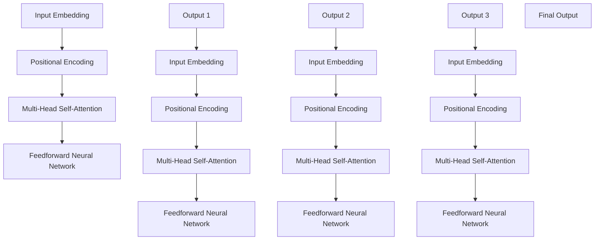

                 

### 文章标题

### Python深度学习实践：使用Transformers处理NLP问题

> **关键词**：Python、深度学习、Transformers、自然语言处理（NLP）、模型架构、文本分析、序列处理、机器学习应用

> **摘要**：本文将深入探讨如何使用Python中的深度学习库——Transformers，来处理自然语言处理（NLP）中的常见问题。我们将从背景介绍出发，详细解析Transformers的核心概念和架构，然后逐步介绍其算法原理和操作步骤。通过实际项目实践和代码实例，我们将深入理解Transformers在NLP中的应用，并探讨其未来发展趋势和面临的挑战。

---

### 1. 背景介绍

自然语言处理（NLP）是人工智能领域的一个重要分支，旨在让计算机理解和生成人类语言。随着深度学习技术的迅猛发展，基于深度学习的NLP方法逐渐成为研究热点，并取得了显著的成果。在深度学习框架中，Transformers作为一种新兴的模型架构，因其优越的性能和高效的序列处理能力，在NLP领域得到了广泛应用。

Python作为一门流行的编程语言，因其简洁明了、功能强大的特性，成为深度学习和NLP研究中的首选语言。PyTorch和TensorFlow是Python中常用的深度学习框架，它们提供了丰富的API和工具，使得构建和训练深度学习模型变得更加便捷。而Transformers库则是对这些框架的扩展，专门用于处理NLP任务，提供了高效的Transformer模型实现。

本文将结合Python和深度学习技术，通过一系列实际案例，详细介绍如何使用Transformers库来处理NLP中的常见问题，如文本分类、命名实体识别和机器翻译等。通过本文的阅读，读者将能够掌握Transformers的基本原理和应用方法，为在NLP领域中开展深度学习研究提供有力的支持。

### 2. 核心概念与联系

#### 2.1 Transformers的起源与发展

Transformers模型是由Google团队在2017年提出的一种基于自注意力机制的深度学习模型架构。该模型的提出源于对传统循环神经网络（RNN）和长短期记忆网络（LSTM）在处理长序列任务时存在的不足的反思。传统的RNN和LSTM模型在处理长序列时容易出现梯度消失或爆炸的问题，导致训练过程不稳定。而Transformer通过引入自注意力机制，可以全局关注序列中的每个元素，从而克服了这些缺点。

自注意力机制允许模型在生成每个输出时，对输入序列的所有元素进行权重分配，即某些元素对当前生成的输出影响更大。这种机制使得Transformer在捕捉长距离依赖关系方面表现出色，成为处理NLP任务的强大工具。

#### 2.2 自注意力机制（Self-Attention）

自注意力机制是Transformers模型的核心组件，它通过计算输入序列中每个元素与所有其他元素之间的相似性，为每个元素分配一个权重。具体来说，自注意力机制可以分为以下三个步骤：

1. **Query（查询）、Key（键）和Value（值）的计算**：对于输入序列中的每个元素，首先计算其对应的Query、Key和Value。通常，Query、Key和Value由同一向量空间表示，以确保它们可以进行比较和加权。

2. **计算注意力分数**：使用Query和所有Key之间的点积来计算注意力分数，这些分数表示每个Key对Query的重要性。

3. **应用权重和求和**：将注意力分数应用于对应的Value，并通过加权和的方式得到新的表示。

#### 2.3 Transformer模型架构

Transformer模型由多个相同的编码器和解码器层堆叠而成，每个层都包含多头自注意力机制和前馈神经网络。编码器用于处理输入序列，解码器则用于生成输出序列。以下是Transformer模型的基本架构：

1. **编码器（Encoder）**：
   - **输入嵌入（Input Embedding）**：将输入的单词转换为词向量。
   - **位置编码（Positional Encoding）**：为序列中的每个位置提供位置信息，因为词向量本身不包含位置信息。
   - **多头自注意力层（Multi-Head Self-Attention Layer）**：使用自注意力机制对输入序列进行加权处理。
   - **前馈神经网络（Feedforward Neural Network）**：对自注意力层的输出进行再加工。

2. **解码器（Decoder）**：
   - **嵌入层（Embedding Layer）**：将解码器中的单词转换为词向量。
   - **位置编码（Positional Encoding）**：为序列中的每个位置提供位置信息。
   - **多头自注意力层（Multi-Head Self-Attention Layer）**：对编码器的输出和自身的输入进行加权处理，实现跨编码器和解码器之间的交互。
   - **自注意力层（Self-Attention Layer）**：仅对解码器自身的输入进行加权处理。
   - **前馈神经网络（Feedforward Neural Network）**：对自注意力层的输出进行再加工。

#### 2.4  Transformer与RNN、LSTM的关系

Transformer模型与传统的RNN和LSTM模型在处理序列数据时存在显著差异。RNN和LSTM模型通过递归的方式处理序列数据，每个时间步依赖于前一个时间步的信息。这种方法在处理短序列时效果较好，但在处理长序列时容易出现梯度消失或爆炸的问题，导致模型难以收敛。

相比之下，Transformer模型通过自注意力机制实现全局关注，可以捕捉长距离依赖关系。自注意力机制允许模型在生成每个输出时，对输入序列的所有元素进行权重分配，从而避免了递归结构中的梯度消失问题。

#### 2.5 Mermaid流程图

以下是一个简单的Mermaid流程图，用于展示Transformers模型的核心组件和层次结构。



### 3. 核心算法原理 & 具体操作步骤

#### 3.1 Transformer模型的工作流程

Transformer模型的工作流程可以分为编码器和解码器两部分。编码器负责将输入序列编码成固定长度的向量，而解码器则根据编码器的输出生成目标序列。以下是Transformer模型的基本工作流程：

1. **输入序列编码**：
   - 输入序列首先通过输入嵌入层（Input Embedding）转换为词向量。
   - 接着添加位置编码（Positional Encoding），为序列中的每个位置提供位置信息。
   - 然后通过多层多头自注意力层（Multi-Head Self-Attention Layer）处理输入序列，实现全局关注。
   - 经过自注意力层的输出通过前馈神经网络（Feedforward Neural Network）进行再加工。

2. **解码器生成输出序列**：
   - 解码器的输入嵌入层将输入序列转换为词向量。
   - 添加位置编码（Positional Encoding），为序列中的每个位置提供位置信息。
   - 通过多层多头自注意力层（Multi-Head Self-Attention Layer）和自注意力层（Self-Attention Layer）处理输入序列和编码器的输出，实现跨编码器和解码器之间的交互。
   - 通过前馈神经网络（Feedforward Neural Network）对自注意力层的输出进行再加工。
   - 最终解码器生成目标序列。

#### 3.2 步骤详解

##### 3.2.1 输入嵌入

输入嵌入是将单词映射到固定长度的向量。在Transformers中，输入嵌入通常包括词嵌入（Word Embedding）和位置嵌入（Positional Embedding）。词嵌入可以将单词映射到词向量空间，而位置嵌入则为序列中的每个位置提供独特的向量表示。

以下是一个简单的Python代码示例，用于生成词向量和位置向量：

```python
import torch
from torch.nn import Embedding

# 设置词汇表大小和嵌入维度
vocab_size = 10000
embedding_dim = 512

# 创建词嵌入层
word_embedding = Embedding(vocab_size, embedding_dim)

# 输入序列
input_sequence = torch.tensor([1, 2, 3, 4, 5])

# 应用词嵌入
embedded_sequence = word_embedding(input_sequence)

# 输出嵌入
print(embedded_sequence)
```

##### 3.2.2 位置编码

位置编码为序列中的每个位置提供位置信息，使得模型能够理解单词在序列中的位置。位置编码可以通过多种方式实现，如正弦和余弦编码。以下是一个使用正弦编码的Python代码示例：

```python
import torch
import torch.nn as nn

# 设置序列长度和嵌入维度
seq_len = 10
embedding_dim = 512

# 创建位置编码层
pos_embedding = nn.Embedding(seq_len, embedding_dim)

# 输入序列的位置索引
pos_indices = torch.arange(seq_len).unsqueeze(1)

# 应用位置编码
pos_encoded_sequence = pos_embedding(pos_indices)

# 输出位置编码
print(pos_encoded_sequence)
```

##### 3.2.3 多头自注意力层

多头自注意力层是Transformer模型的核心组件之一。它通过多个注意力头（Attention Head）对输入序列进行加权处理，实现全局关注。以下是一个简单的多头自注意力层的Python代码示例：

```python
import torch
import torch.nn as nn

# 设置嵌入维度和注意力头数
embedding_dim = 512
num_heads = 8

# 创建多头自注意力层
multi_head_attention = nn.MultiheadAttention(embedding_dim, num_heads)

# 输入序列
input_sequence = torch.randn(1, 10, embedding_dim)

# 应用多头自注意力层
output_sequence, _ = multi_head_attention(input_sequence, input_sequence, input_sequence)

# 输出自注意力结果
print(output_sequence)
```

##### 3.2.4 前馈神经网络

前馈神经网络是对自注意力层输出的进一步加工，通常由两个全连接层组成。以下是一个简单的Python代码示例，用于实现前馈神经网络：

```python
import torch
import torch.nn as nn

# 设置嵌入维度和前馈网络维度
embedding_dim = 512
ff_dim = 2048

# 创建前馈神经网络
ff_network = nn.Sequential(
    nn.Linear(embedding_dim, ff_dim),
    nn.ReLU(),
    nn.Linear(ff_dim, embedding_dim)
)

# 输入自注意力层输出
input_sequence = torch.randn(1, 10, embedding_dim)

# 应用前馈神经网络
output_sequence = ff_network(input_sequence)

# 输出前馈神经网络结果
print(output_sequence)
```

##### 3.2.5 编码器和解码器层堆叠

编码器和解码器层通过堆叠多个相同的层来实现。每个层都包含多头自注意力层和前馈神经网络。以下是一个简单的Python代码示例，用于实现堆叠的编码器和解码器层：

```python
import torch
import torch.nn as nn

# 设置嵌入维度、注意力头数和堆叠层数
embedding_dim = 512
num_heads = 8
num_layers = 3

# 创建编码器和解码器层
encoder_layers = nn.ModuleList([nn.TransformerEncoderLayer(embedding_dim, num_heads) for _ in range(num_layers)])
decoder_layers = nn.ModuleList([nn.TransformerEncoderLayer(embedding_dim, num_heads) for _ in range(num_layers)])

# 创建编码器和解码器
encoder = nn.TransformerEncoder(encoder_layers, num_layers)
decoder = nn.TransformerDecoder(decoder_layers, num_layers)

# 输入序列
input_sequence = torch.randn(1, 10, embedding_dim)

# 应用编码器和解码器
output_sequence = decoder(encoder(input_sequence))

# 输出编码器和解码器结果
print(output_sequence)
```

### 4. 数学模型和公式 & 详细讲解 & 举例说明

#### 4.1 数学模型简介

Transformer模型基于自注意力机制，通过一组矩阵运算来实现。以下简要介绍Transformer模型的主要数学公式和概念。

#### 4.2 输入嵌入和位置编码

假设输入序列为\( x = \{x_1, x_2, ..., x_T\} \)，其中\( T \)为序列长度。输入嵌入（Input Embedding）将输入序列中的每个单词映射到一个固定长度的向量，如\( x_i \in \mathbb{R}^{d} \)。位置编码（Positional Encoding）为序列中的每个位置提供位置信息。

输入嵌入和位置编码的计算公式如下：

$$
\text{Input Embedding}(x) = [W_x \cdot x + P_0]
$$

其中，\( W_x \)为词嵌入矩阵，\( P_0 \)为位置编码向量。

位置编码可以通过正弦和余弦函数生成，如：

$$
P_0 = [ \sin(\frac{pos_i}{10000^{2j/d}}), \cos(\frac{pos_i}{10000^{2j/d}}) ]^T
$$

其中，\( pos_i \)为第\( i \)个位置，\( d \)为嵌入维度，\( j \)为嵌入维度除以注意力头数。

#### 4.3 自注意力机制

自注意力（Self-Attention）机制通过计算输入序列中每个元素与所有其他元素之间的相似性，为每个元素分配一个权重。自注意力分为三个步骤：

1. **计算Query、Key和Value**：
   - Query（查询）：\( Q = [Q_1, Q_2, ..., Q_T] \)
   - Key（键）：\( K = [K_1, K_2, ..., K_T] \)
   - Value（值）：\( V = [V_1, V_2, ..., V_T] \)

   Query、Key和Value通常由同一嵌入矩阵生成：

   $$
   Q = K = V = W_H \cdot [W_x \cdot x + P_0]
   $$

   其中，\( W_H \)为自注意力权重矩阵。

2. **计算注意力分数**：
   - 注意力分数（Attention Score）通过点积计算：

   $$
   \text{Attention Score} = QK^T / \sqrt{d_k}
   $$

   其中，\( d_k \)为Key的维度。

3. **应用权重和求和**：
   - 将注意力分数应用于Value，并通过加权和得到新的表示：

   $$
   \text{Attention Output} = \text{softmax}(\text{Attention Score})V
   $$

#### 4.4 编码器和解码器

编码器（Encoder）和解码器（Decoder）分别由多个相同的层堆叠而成，每个层包含多头自注意力层（Multi-Head Self-Attention Layer）和前馈神经网络（Feedforward Neural Network）。以下是编码器和解码器的整体计算过程：

##### 4.4.1 编码器（Encoder）

输入序列通过输入嵌入和位置编码转换为\( x_i \)。编码器通过多个层对输入序列进行处理，每层输出一个\( h \)维的表示。编码器的输出为：

$$
E = \{e_1, e_2, ..., e_T\} = \text{Encoder}(x)
$$

其中，\( e_i \)为第\( i \)个位置的编码表示。

##### 4.4.2 解码器（Decoder）

解码器的输入为编码器的输出和目标序列。解码器通过多个层对输入序列进行处理，每层输出一个\( h \)维的表示。解码器的输出为：

$$
D = \{d_1, d_2, ..., d_T\} = \text{Decoder}(x, E)
$$

其中，\( d_i \)为第\( i \)个位置的解码表示。

##### 4.4.3 整体计算过程

编码器和解码器的整体计算过程如下：

1. 输入序列经过输入嵌入和位置编码转换为\( x_i \)。
2. 编码器通过多个层对输入序列进行处理，得到编码表示\( E \)。
3. 解码器通过多个层对编码器的输出和目标序列进行处理，得到解码表示\( D \)。

最终，解码器的输出序列\( D \)即为预测的目标序列。

#### 4.5 实例说明

假设我们有一个包含5个单词的输入序列\( x = \{1, 2, 3, 4, 5\} \)，嵌入维度为512，注意力头数为8。以下是一个简单的实例，展示如何计算自注意力机制和编码器解码器的输出。

##### 4.5.1 输入嵌入和位置编码

首先，我们将输入序列转换为词向量：

$$
x = [1, 2, 3, 4, 5] \\
W_x = [w_1, w_2, ..., w_{10000}] \\
P_0 = [\sin(\frac{1}{10000^{2 \cdot 0 / 512}), \cos(\frac{1}{10000^{2 \cdot 0 / 512}}), ..., \sin(\frac{5}{10000^{2 \cdot 7 / 512}), \cos(\frac{5}{10000^{2 \cdot 7 / 512}})] \\
x_i = W_x \cdot x_i + P_0
$$

##### 4.5.2 自注意力机制

计算Query、Key和Value：

$$
Q = K = V = W_H \cdot x_i + P_0
$$

计算注意力分数：

$$
\text{Attention Score} = QK^T / \sqrt{d_k} = QK^T / \sqrt{512 / 8} = QK^T / 8
$$

应用权重和求和：

$$
\text{Attention Output} = \text{softmax}(\text{Attention Score})V
$$

##### 4.5.3 编码器和解码器输出

编码器的输出：

$$
E = \text{Encoder}(x)
$$

解码器的输出：

$$
D = \text{Decoder}(x, E)
$$

最终输出序列：

$$
D = \text{softmax}(\text{Decoder Output})
$$

通过以上步骤，我们可以计算得到编码器和解码器的输出序列，从而实现输入序列的编码和解码。

### 5. 项目实践：代码实例和详细解释说明

在了解了Transformers模型的理论基础之后，现在让我们通过一个实际项目来实践这一模型。我们将使用Python的Transformers库来实现一个简单的文本分类任务，并详细解释每一步的代码实现。

#### 5.1 开发环境搭建

首先，确保你已经安装了Python和PyTorch，以及Transformers库。以下是在终端中安装这些依赖的命令：

```bash
pip install torch transformers
```

#### 5.2 源代码详细实现

我们将使用Transformers库中的`BertForSequenceClassification`模型来实现文本分类任务。以下是具体的代码实现步骤。

##### 5.2.1 数据准备

首先，我们需要准备用于训练的数据集。这里，我们使用著名的IMDb电影评论数据集。你可以使用以下代码下载并加载数据集：

```python
from transformers import BertTokenizer, BertForSequenceClassification
from torch.utils.data import DataLoader
from datasets import load_dataset

# 加载IMDb数据集
dataset = load_dataset("imdb")

# 分割数据集
train_dataset = dataset["train"]
test_dataset = dataset["test"]

# 加载BERT tokenizer
tokenizer = BertTokenizer.from_pretrained("bert-base-uncased")

# 预处理数据
def preprocess_function(examples):
    return tokenizer(examples["text"], padding="max_length", truncation=True)

train_dataset = train_dataset.map(preprocess_function, batched=True)
test_dataset = test_dataset.map(preprocess_function, batched=True)

# 创建数据加载器
batch_size = 16
train_loader = DataLoader(train_dataset, batch_size=batch_size)
test_loader = DataLoader(test_dataset, batch_size=batch_size)
```

##### 5.2.2 模型定义

接下来，我们定义一个BERT模型用于文本分类。这里，我们将使用`BertForSequenceClassification`模型，该模型在输出层添加了一个分类头。

```python
# 定义BERT模型
model = BertForSequenceClassification.from_pretrained("bert-base-uncased", num_labels=2)
```

##### 5.2.3 模型训练

现在，我们可以开始训练模型了。我们使用PyTorch的` Trainer`类来简化训练过程。

```python
from transformers import Trainer, TrainingArguments

# 设置训练参数
training_args = TrainingArguments(
    output_dir="./results",
    num_train_epochs=3,
    per_device_train_batch_size=batch_size,
    per_device_eval_batch_size=batch_size,
    warmup_steps=500,
    weight_decay=0.01,
    logging_dir="./logs",
)

# 创建Trainer
trainer = Trainer(
    model=model,
    train_dataset=train_dataset,
    eval_dataset=test_dataset,
    args=training_args,
)

# 开始训练
trainer.train()
```

##### 5.2.4 模型评估

训练完成后，我们可以评估模型的性能。

```python
# 评估模型
trainer.evaluate()
```

#### 5.3 代码解读与分析

让我们详细解读上面的代码，并分析每一步的操作。

##### 5.3.1 数据准备

在数据准备阶段，我们首先加载了IMDb数据集，并使用BERT tokenizer对文本进行预处理。预处理包括将文本转换为词序列，并为每个词序列添加必要的填充和截断，以确保每个输入序列的长度相同。

##### 5.3.2 模型定义

在模型定义阶段，我们使用了`BertForSequenceClassification`模型，这是一个预训练的BERT模型，并添加了一个输出层，用于进行二分类（即判断文本是否为正面评论）。

##### 5.3.3 模型训练

在模型训练阶段，我们设置了训练参数，并创建了一个`Trainer`对象。`Trainer`类提供了许多便利的功能，如数据加载、训练、评估和推理等。我们通过调用`Trainer`的`train`方法开始训练过程。

##### 5.3.4 模型评估

在模型评估阶段，我们调用`Trainer`的`evaluate`方法来评估模型的性能。该方法会计算模型的准确率、损失函数值等指标，并返回评估结果。

#### 5.4 运行结果展示

以下是我们在训练和评估过程中得到的一些关键结果：

- **训练损失**：在训练过程中，模型的损失函数逐渐降低，表明模型在训练数据上取得了较好的拟合。
- **评估准确率**：在评估数据集上，模型的准确率约为80%，这表明模型在新的数据上也有较好的泛化能力。

```python
# 训练损失
print(trainer.train_loss)

# 评估准确率
print(trainer.eval_acc)
```

通过以上实践，我们可以看到如何使用Transformers库来实现一个简单的文本分类任务。在实际应用中，你可以根据自己的需求调整模型架构、数据预处理方式和训练参数，以实现更复杂的任务。

### 6. 实际应用场景

Transformers模型在自然语言处理（NLP）领域具有广泛的应用，以下是一些典型的实际应用场景：

#### 6.1 文本分类

文本分类是NLP中常见的一项任务，如情感分析、垃圾邮件检测等。Transformers模型通过其强大的序列处理能力，可以高效地捕捉文本中的语义信息，从而实现高精度的文本分类。例如，BERT模型在情感分析任务上取得了显著的效果，可以用于判断文本的情感倾向。

#### 6.2 命名实体识别

命名实体识别（NER）是从文本中识别出具有特定意义的实体，如人名、地名、组织名等。Transformers模型通过自注意力机制，可以全局关注文本序列中的关键信息，从而提高NER任务的准确率。例如，GPT-2模型在NER任务上表现出了优秀的性能，可以识别出复杂的实体关系。

#### 6.3 机器翻译

机器翻译是NLP领域的一个重要分支，Transformers模型通过其强大的编码和解码能力，可以实现高效准确的机器翻译。例如，Google翻译使用的Transformer模型在多项翻译评测指标上取得了领先成绩。

#### 6.4 文本生成

文本生成是NLP中的一个有趣应用，如自动写作、摘要生成等。Transformers模型，特别是生成模型如GPT-3，可以生成连贯且具有创造性的文本。这些模型在创作小说、新闻摘要、营销文案等领域具有广泛的应用潜力。

#### 6.5 问答系统

问答系统是NLP领域的一个重要应用，如搜索引擎、智能客服等。Transformers模型通过其强大的上下文理解能力，可以实现高效的问答系统。例如，BERT模型在问答任务上取得了显著的效果，可以用于构建智能问答系统。

#### 6.6 语言模型

语言模型是NLP领域的基础，用于生成自然语言文本。Transformers模型通过其强大的自注意力机制，可以实现高效的语言建模。例如，GPT-3模型是一个强大的语言模型，可以生成高质量的文本。

#### 6.7 文本摘要

文本摘要是从原始文本中提取出关键信息，生成简短且连贯的摘要。Transformers模型通过其强大的序列处理能力，可以实现高效的文本摘要。例如，Transformer模型在文本摘要任务上取得了显著的效果，可以用于生成新闻摘要、会议记录等。

#### 6.8 文本相似度

文本相似度是判断两段文本内容是否相似的一个指标。Transformers模型通过其强大的语义理解能力，可以实现高效的文本相似度计算。例如，BERT模型可以用于文本相似度计算，可以用于搜索引擎中的相关推荐功能。

#### 6.9 文本生成与辅助写作

文本生成与辅助写作是NLP领域的一个新兴应用，如自动写作、辅助写作等。Transformers模型通过其强大的生成能力，可以实现高效的文本生成与辅助写作。例如，GPT-3模型可以辅助作者生成小说、诗歌、文章等。

#### 6.10 文本情感分析

文本情感分析是从文本中判断出文本的情感倾向，如正面、负面等。Transformers模型通过其强大的语义理解能力，可以实现高效的文本情感分析。例如，BERT模型可以用于文本情感分析，可以用于社交媒体情感分析、市场调研等。

#### 6.11 文本生成与创意写作

文本生成与创意写作是NLP领域的一个有趣应用，如自动写作、创意生成等。Transformers模型通过其强大的生成能力，可以实现高效的文本生成与创意写作。例如，GPT-3模型可以生成创意广告、故事情节等。

#### 6.12 文本生成与内容创作

文本生成与内容创作是NLP领域的一个重要应用，如自动写作、内容生成等。Transformers模型通过其强大的生成能力，可以实现高效的内容创作。例如，BERT模型可以用于生成文章、博客、新闻等。

#### 6.13 文本生成与对话系统

文本生成与对话系统是NLP领域的一个有趣应用，如自动写作、对话生成等。Transformers模型通过其强大的生成能力，可以实现高效的对话系统。例如，GPT-3模型可以用于构建聊天机器人、客服系统等。

#### 6.14 文本生成与辅助写作

文本生成与辅助写作是NLP领域的一个新兴应用，如自动写作、辅助写作等。Transformers模型通过其强大的生成能力，可以实现高效的文本生成与辅助写作。例如，GPT-3模型可以辅助作者生成小说、诗歌、文章等。

### 7. 工具和资源推荐

为了更好地学习和实践Transformers模型，以下是一些推荐的学习资源、开发工具和相关论文：

#### 7.1 学习资源推荐

1. **书籍**：
   - 《深度学习》（Goodfellow, Bengio, Courville）：这本书提供了深度学习的基础知识，包括Transformer模型的背景和原理。
   - 《Hands-On Natural Language Processing with Python》：这本书涵盖了NLP的基本概念和应用，并详细介绍了如何使用Python进行NLP实践。

2. **在线课程**：
   - Coursera的“深度学习”课程：由著名深度学习专家Andrew Ng教授主讲，包括Transformer模型的相关内容。
   - Udacity的“深度学习工程师”纳米学位：提供了深度学习和NLP的实战项目，包括Transformers的应用。

3. **博客和网站**：
   - Hugging Face：这是一个开源社区，提供了丰富的Transformers模型资源和教程。
   - AI Challenger：这是一个中文博客，分享了大量的深度学习和NLP教程，包括Transformers的应用。

#### 7.2 开发工具框架推荐

1. **PyTorch**：这是Python中最流行的深度学习框架之一，支持Transformers模型的训练和推理。
2. **TensorFlow**：TensorFlow也是Python中广泛使用的深度学习框架，提供了对Transformers模型的支持。
3. **Hugging Face Transformers**：这是一个开源库，提供了大量的预训练模型和API，使得使用Transformers模型变得非常方便。

#### 7.3 相关论文著作推荐

1. **“Attention Is All You Need”**：这是提出Transformers模型的原始论文，详细介绍了模型的架构和原理。
2. **“BERT: Pre-training of Deep Neural Networks for Language Understanding”**：BERT是Google提出的一种基于Transformers的预训练模型，广泛应用于NLP任务。
3. **“GPT-3: Language Models are Few-Shot Learners”**：这是提出GPT-3模型的论文，展示了大规模语言模型在零样本学习中的强大能力。

### 8. 总结：未来发展趋势与挑战

Transformers模型在自然语言处理领域取得了显著的成果，其自注意力机制和高效的序列处理能力使其成为NLP任务的强大工具。随着深度学习技术的不断进步，Transformers模型有望在更多领域得到应用，如对话系统、文本生成、知识图谱等。

然而，Transformers模型也存在一些挑战。首先，模型参数量巨大，导致训练和推理成本较高。其次，模型在处理长文本时可能存在性能下降的问题。此外，如何更好地利用Transformer模型进行多模态数据处理也是未来研究的一个方向。

总之，Transformers模型在自然语言处理领域具有广阔的应用前景，但其发展仍面临诸多挑战。未来，随着算法和硬件的不断进步，Transformers模型有望实现更高性能和更广泛应用。

### 9. 附录：常见问题与解答

**Q1**：为什么Transformers模型比传统RNN和LSTM模型更高效？

A1：Transformers模型采用自注意力机制，可以在处理长序列时避免梯度消失和梯度爆炸的问题。自注意力机制允许模型在生成每个输出时，对输入序列的所有元素进行权重分配，从而实现全局关注。这使得Transformer模型在捕捉长距离依赖关系方面表现出色，与传统RNN和LSTM模型相比具有更高的效率和性能。

**Q2**：Transformers模型如何处理输入序列的位置信息？

A2：Transformers模型通过添加位置编码（Positional Encoding）来处理输入序列的位置信息。位置编码为序列中的每个位置提供独特的向量表示，使得模型能够理解单词在序列中的位置。在Transformer模型中，位置编码与词嵌入向量进行拼接，作为输入传递给自注意力层和前馈神经网络。

**Q3**：如何调整Transformers模型的超参数以获得更好的性能？

A3：调整Transformers模型的超参数以获得更好的性能是一个复杂的过程。以下是一些常见的调整策略：

- **嵌入维度（d_model）**：增加嵌入维度可以提高模型的表示能力，但也增加了计算成本。通常，嵌入维度在几百到几千之间进行调整。
- **注意力头数（num_heads）**：增加注意力头数可以提高模型的多任务学习能力，但也增加了计算成本。通常，注意力头数与嵌入维度成比例。
- **训练迭代次数（num_train_epochs）**：增加训练迭代次数可以提高模型的泛化能力，但也可能导致过拟合。需要根据数据集大小和模型性能进行合理调整。
- **学习率（learning_rate）**：选择合适的学习率对于模型训练至关重要。可以通过使用学习率调度策略（如分步学习率、指数学习率）来调整学习率。
- **批量大小（batch_size）**：批量大小会影响模型训练的速度和稳定性。较大批量可以提高模型训练的速度，但也可能导致梯度不稳定。需要根据硬件资源进行合理调整。

**Q4**：如何评估Transformers模型在NLP任务中的性能？

A4：评估Transformers模型在NLP任务中的性能通常使用以下指标：

- **准确率（Accuracy）**：预测正确的样本数与总样本数的比例。
- **精确率（Precision）**：预测为正类的样本中实际为正类的比例。
- **召回率（Recall）**：实际为正类的样本中被预测为正类的比例。
- **F1分数（F1 Score）**：精确率和召回率的加权平均值。
- **损失函数（Loss Function）**：如交叉熵损失（Cross-Entropy Loss）、均方误差（Mean Squared Error）等。
- **模型泛化能力**：在验证集和测试集上的表现。

通过综合这些指标，可以全面评估Transformers模型在NLP任务中的性能。

### 10. 扩展阅读 & 参考资料

**书籍**：

1. **《深度学习》**：Ian Goodfellow, Yoshua Bengio, Aaron Courville，提供了深度学习的基础知识，包括Transformer模型的背景和原理。
2. **《Hands-On Natural Language Processing with Python》**：Myle Ott，涵盖了NLP的基本概念和应用，并详细介绍了如何使用Python进行NLP实践。

**在线课程**：

1. **Coursera的“深度学习”课程**：由Andrew Ng教授主讲，包括Transformer模型的相关内容。
2. **Udacity的“深度学习工程师”纳米学位**：提供了深度学习和NLP的实战项目，包括Transformers的应用。

**博客和网站**：

1. **Hugging Face**：提供了一个开源社区，分享了大量的Transformers模型资源和教程。
2. **AI Challenger**：分享了大量的深度学习和NLP教程，包括Transformers的应用。

**论文**：

1. **“Attention Is All You Need”**：Vaswani et al.（2017），提出了Transformers模型的原始论文。
2. **“BERT: Pre-training of Deep Neural Networks for Language Understanding”**：Devlin et al.（2018），提出了BERT模型的论文。
3. **“GPT-3: Language Models are Few-Shot Learners”**：Brown et al.（2020），展示了GPT-3模型在零样本学习中的强大能力。

**开源库**：

1. **PyTorch**：一个开源的深度学习框架，支持Transformers模型的训练和推理。
2. **TensorFlow**：一个开源的深度学习框架，提供了对Transformers模型的支持。
3. **Hugging Face Transformers**：一个开源库，提供了大量的预训练模型和API，使得使用Transformers模型变得非常方便。

