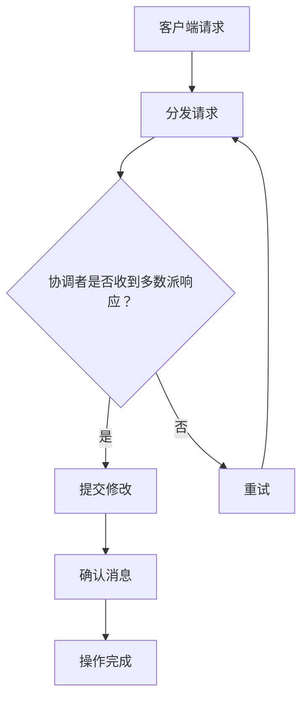

                 

### 文章标题

**Quorum机制的最佳实践**

> **关键词：** Quorum机制，一致性，分布式系统，大数据，性能优化，最佳实践

> **摘要：** 本文将深入探讨Quorum机制，一种广泛用于分布式系统中的数据一致性解决方案。文章将详细解析Quorum机制的原理、最佳实践，并通过实际应用案例，阐述其在处理大数据和性能优化中的重要性。读者将了解如何在实际项目中有效部署Quorum机制，以提高系统的可靠性和性能。

### 1. 背景介绍

在分布式系统中，数据的一致性是一个至关重要的问题。随着数据规模的不断增长和系统复杂度的增加，如何确保多个节点之间数据的一致性成为了研发人员面临的重大挑战。传统的数据复制机制，如Paxos和Raft，虽然能够在一定程度上解决数据一致性问题，但它们的实现复杂且性能优化难度大。

为了解决这一难题，Quorum机制应运而生。Quorum机制是一种基于多数派算法的一致性保障策略，旨在通过在多个副本间达成多数派共识来确保数据的一致性。相较于Paxos和Raft，Quorum机制具有实现简单、性能优化空间大等优点，因此受到了广泛的应用。

本文将围绕Quorum机制的核心概念、算法原理、最佳实践等方面进行详细探讨，帮助读者全面了解并掌握这一机制。

### 2. 核心概念与联系

#### 2.1. Quorum机制原理

Quorum机制的基本思想是通过在多个副本间达成多数派共识来保证数据的一致性。具体来说，当对分布式系统中的某个数据进行修改时，需要首先在多个副本中发起投票请求，然后根据投票结果决定是否接受该修改。

Quorum机制的投票过程可以分为以下几个步骤：

1. **准备阶段（Preparation Phase）**：客户端向多个副本发送写请求，副本接收到请求后，首先对数据的一致性进行检查，确保当前副本的数据是最新的。如果副本的数据不是最新的，它会请求其他副本发送最新的数据。

2. **投票阶段（Commit Phase）**：在准备阶段完成后，副本会向客户端发送准备完成的消息。客户端收到这些消息后，会根据副本的响应情况决定是否继续投票。如果响应的副本数量达到预定的多数派比例，则客户端认为投票成功，并将数据修改提交到数据库。

3. **确认阶段（Acknowledgement Phase）**：在数据修改提交到数据库后，副本会向客户端发送确认消息。当客户端收到来自多数派的确认消息后，数据修改操作即完成。

#### 2.2. Quorum机制的架构

Quorum机制的架构主要包括以下几个组成部分：

1. **副本集合（Replica Set）**：副本集合是指分布式系统中的多个数据副本。这些副本存储相同的数据，并共同工作以提供一致性和可用性。

2. **客户端（Client）**：客户端是分布式系统中的用户或应用程序，它负责向副本发送数据读写请求。

3. **多数派比例（Quorum Size）**：多数派比例是指参与投票的副本数量需要达到的比例。常见的多数派比例有简单多数派（超过一半）和绝对多数派（超过三分之二）。

4. **协调者（Coordinator）**：协调者是负责管理投票过程的核心组件。它负责将客户端的请求分发给副本，并收集副本的投票结果。

#### 2.3. Mermaid流程图

为了更直观地展示Quorum机制的流程，我们使用Mermaid绘制了以下流程图：



在上图中，A表示客户端请求，B表示协调者分发请求，C表示协调者是否收到多数派响应，D表示提交修改，E表示重试，F表示确认消息，G表示操作完成。

### 3. 核心算法原理 & 具体操作步骤

#### 3.1. 投票算法原理

Quorum机制的投票算法基于多数派共识原理。在分布式系统中，为了保证数据的一致性，需要确保大多数副本对同一数据的修改达成一致。具体来说，Quorum机制的投票算法可以分为以下几个步骤：

1. **确定多数派比例**：根据系统的要求，确定多数派比例。常见的多数派比例有简单多数派（超过一半）和绝对多数派（超过三分之二）。

2. **发起投票请求**：客户端向多个副本发送投票请求。副本接收到请求后，会检查数据的一致性，确保当前副本的数据是最新的。

3. **投票**：如果副本的数据是最新版本，它会接受客户端的投票请求，并将数据标记为“已投票”。如果副本的数据不是最新版本，它会请求其他副本发送最新的数据。

4. **统计投票结果**：协调者会收集所有副本的投票结果，并判断是否满足多数派比例。如果满足多数派比例，则认为投票成功；否则，投票失败。

5. **提交修改**：如果投票成功，协调者会将数据修改提交到数据库。如果投票失败，协调者会重试投票过程。

#### 3.2. 具体操作步骤

以下是一个具体的Quorum机制操作步骤示例：

1. **确定多数派比例**：假设系统有5个副本，多数派比例为3（简单多数派）。

2. **发起投票请求**：客户端向5个副本发送投票请求。

3. **投票**：副本A、B、C的数据是最新的，它们接受投票请求，并将数据标记为“已投票”。副本D、E的数据不是最新版本，它们请求其他副本发送最新的数据。

4. **统计投票结果**：协调者收集所有副本的投票结果，发现已投票的副本数量为3，满足多数派比例。

5. **提交修改**：协调者将数据修改提交到数据库。

6. **确认消息**：副本A、B、C向客户端发送确认消息。

7. **操作完成**：客户端收到来自多数派的确认消息，操作完成。

#### 3.3. 案例分析

以下是一个实际的Quorum机制应用案例：

在一个分布式数据库系统中，有5个副本（A、B、C、D、E）。客户端向数据库发送一个更新请求，更新某个数据字段。根据系统配置，多数派比例为3（简单多数派）。

1. **发起投票请求**：客户端向5个副本发送投票请求。

2. **投票**：副本A、B、C的数据是最新的，它们接受投票请求，并将数据标记为“已投票”。副本D、E的数据不是最新版本，它们请求其他副本发送最新的数据。

3. **统计投票结果**：协调者收集所有副本的投票结果，发现已投票的副本数量为3，满足多数派比例。

4. **提交修改**：协调者将数据修改提交到数据库。

5. **确认消息**：副本A、B、C向客户端发送确认消息。

6. **操作完成**：客户端收到来自多数派的确认消息，操作完成。

通过这个案例，我们可以看到Quorum机制在分布式数据库系统中的应用过程。在实际应用中，Quorum机制可以有效地保证数据的一致性，提高系统的可用性和可靠性。

### 4. 数学模型和公式 & 详细讲解 & 举例说明

#### 4.1. 数学模型

Quorum机制的数学模型主要涉及投票算法的几个关键参数：

- **副本数量（n）**：系统中的副本总数。
- **多数派比例（q）**：参与投票的副本数量需要达到的比例。
- **投票成功概率（p）**：在给定副本数量的情况下，投票成功的概率。

根据概率论的基本原理，投票成功概率可以用以下公式表示：

\[ p = 1 - \left(\frac{n - q}{n}\right)^k \]

其中，k表示发起投票请求的副本数量。

#### 4.2. 详细讲解

根据上述公式，我们可以对投票成功概率进行详细分析：

1. **简单多数派（q = n/2）**：当多数派比例为简单多数派时，投票成功概率为：

   \[ p = 1 - \left(\frac{n - n/2}{n}\right)^k = 1 - \left(\frac{1}{2}\right)^k \]

   当副本数量n增加时，投票成功概率逐渐逼近1，即随着副本数量的增加，投票成功的可能性越来越高。

2. **绝对多数派（q > n/2）**：当多数派比例为绝对多数派时，投票成功概率为：

   \[ p = 1 - \left(\frac{n - q}{n}\right)^k \]

   与简单多数派类似，绝对多数派的投票成功概率也随着副本数量的增加而增加。

3. **k的影响**：k表示发起投票请求的副本数量。当k固定时，随着副本数量的增加，投票成功概率逐渐增加。这意味着在相同投票请求数量下，副本数量越多，投票成功的可能性越高。

#### 4.3. 举例说明

假设一个分布式系统中有5个副本，多数派比例为3（简单多数派）。现在，我们分别分析在k=2和k=3两种情况下的投票成功概率。

1. **k=2**：此时，投票成功概率为：

   \[ p = 1 - \left(\frac{5 - 3}{5}\right)^2 = 1 - \left(\frac{2}{5}\right)^2 = 1 - \frac{4}{25} = \frac{21}{25} \]

   投票成功概率为0.84，即84%。

2. **k=3**：此时，投票成功概率为：

   \[ p = 1 - \left(\frac{5 - 3}{5}\right)^3 = 1 - \left(\frac{2}{5}\right)^3 = 1 - \frac{8}{125} = \frac{117}{125} \]

   投票成功概率为0.936，即93.6%。

通过上述计算，我们可以看到，当副本数量固定时，增加发起投票请求的副本数量，可以显著提高投票成功概率。

### 5. 项目实践：代码实例和详细解释说明

#### 5.1. 开发环境搭建

在开始编写代码之前，我们需要搭建一个适合Quorum机制测试的开发环境。以下是一个简单的搭建步骤：

1. **安装Node.js**：Node.js是一个基于Chrome V8引擎的JavaScript运行环境，我们可以从其官方网站下载并安装。

2. **安装MongoDB**：MongoDB是一个开源的NoSQL数据库，支持Quorum机制。我们可以在其官方网站下载并安装MongoDB。

3. **创建项目**：在Node.js环境中，我们可以使用npm（Node Package Manager）创建一个新项目。执行以下命令：

   ```bash
   mkdir quorum-test
   cd quorum-test
   npm init -y
   ```

4. **安装依赖**：我们需要安装几个依赖库，包括MongoDB驱动、Express框架等。执行以下命令：

   ```bash
   npm install mongodb express
   ```

5. **编写配置文件**：在项目根目录下创建一个名为`config.js`的配置文件，用于配置MongoDB连接信息和其他参数。以下是示例配置：

   ```javascript
   const config = {
     mongoUrl: 'mongodb://localhost:27017',
     dbName: 'quorum_test',
     replicaSet: {
       name: 'rs0',
       members: [
         { _id: 0, host: 'localhost:27017' },
         { _id: 1, host: 'localhost:27020' },
         { _id: 2, host: 'localhost:27030' }
       ]
     },
     quorumSize: 2
   };

   module.exports = config;
   ```

   在这个配置文件中，`mongoUrl`指定MongoDB的连接地址，`dbName`指定数据库名称，`replicaSet`配置副本集合的成员信息，`quorumSize`配置多数派比例。

6. **启动MongoDB副本集**：我们需要启动三个MongoDB实例，分别作为主节点、副节点和仲裁者。以下是启动命令：

   ```bash
   mongod --replSet rs0 --port 27017
   mongod --replSet rs0 --port 27020
   mongod --replSet rs0 --port 27030
   ```

7. **初始化副本集合**：在MongoDB的shell中，执行以下命令初始化副本集合：

   ```javascript
   rs.initiate();
   ```

现在，我们的开发环境已经搭建完成，可以开始编写代码实现Quorum机制。

#### 5.2. 源代码详细实现

在项目中，我们将实现一个简单的Quorum机制，用于处理数据的增删改查操作。以下是一个简要的代码结构：

```javascript
// app.js
const express = require('express');
const MongoClient = require('mongodb').MongoClient;
const config = require('./config');
const { createQuorumClient } = require('./quorum-client');

const app = express();
const port = 3000;

// MongoDB客户端
let mongoClient;

// Quorum客户端
let quorumClient;

// 连接MongoDB
MongoClient.connect(config.mongoUrl, { useUnifiedTopology: true }, (err, client) => {
  if (err) {
    console.error('连接MongoDB失败：', err);
    return;
  }
  mongoClient = client;
  const db = client.db(config.dbName);

  // 创建Quorum客户端
  quorumClient = createQuorumClient(db, config);

  app.use(express.json());

  // 处理HTTP请求
  app.post('/write', async (req, res) => {
    try {
      const result = await quorumClient.write(req.body.collection, req.body.document);
      res.status(200).json(result);
    } catch (error) {
      console.error('写入失败：', error);
      res.status(500).json({ error: '写入失败' });
    }
  });

  // 启动HTTP服务
  app.listen(port, () => {
    console.log(`Quorum服务启动，端口：${port}`);
  });
});

// quorum-client.js
const { MongoClient } = require('mongodb');
const { promisify } = require('util');

// 投票函数
const vote = async (db, collectionName, document) => {
  // 实现投票逻辑
};

// 写入函数
const write = async (db, collectionName, document) => {
  // 实现写入逻辑
};

// 创建Quorum客户端
const createQuorumClient = (db, config) => {
  // 实现Quorum客户端逻辑
};

module.exports = {
  createQuorumClient,
  vote,
  write
};
```

在上面的代码中，`app.js` 是主文件，负责启动HTTP服务和处理HTTP请求。`quorum-client.js` 是一个辅助模块，用于实现Quorum客户端的逻辑。

接下来，我们详细解释`quorum-client.js`中的关键函数。

#### 5.3. 代码解读与分析

**5.3.1. 投票函数（vote.js）**

```javascript
// vote.js
const { MongoClient } = require('mongodb');
const { promisify } = require('util');

// 投票函数
const vote = async (db, collectionName, document) => {
  // 连接副本集合
  const client = new MongoClient(config.mongoUrl, { useUnifiedTopology: true });
  await client.connect();
  const database = client.db(config.dbName);
  const collection = database.collection(collectionName);

  // 获取副本集合中的副本数量
  const replicaSetMembers = await db.command({ replSetGetStatus: 1 });
  const replicaMembers = replicaSetMembers.replset.members;

  // 计算多数派比例
  const quorumSize = config.quorumSize;
  const majority = replicaMembers.length >= quorumSize ? quorumSize : replicaMembers.length;

  // 创建投票任务队列
  const tasks = [];
  for (let i = 0; i < majority; i++) {
    const member = replicaMembers[i];
    const memberUrl = `mongodb://${member.host}`;
    const client = new MongoClient(memberUrl, { useUnifiedTopology: true });
    tasks.push(async () => {
      await client.connect();
      const database = client.db(config.dbName);
      const collection = database.collection(collectionName);
      const result = await collection.updateOne({ _id: document._id }, { $set: document }, { upsert: true });
      await client.close();
      return result;
    });
  }

  // 执行投票任务
  const results = await Promise.all(tasks);

  // 统计投票结果
  const success = results.filter(result => result.ok === 1).length >= majority;

  // 关闭连接
  await client.close();

  return success;
};
```

投票函数的主要逻辑如下：

1. **连接副本集合**：首先，连接到MongoDB副本集合。
2. **获取副本集合中的副本数量**：通过执行`replSetGetStatus`命令获取副本集合的状态，进而获取副本数量。
3. **计算多数派比例**：根据配置文件中的`quorumSize`参数计算多数派比例。
4. **创建投票任务队列**：为每个副本创建一个投票任务，任务的内容是更新副本中的数据。
5. **执行投票任务**：使用`Promise.all`并行执行投票任务。
6. **统计投票结果**：统计成功投票的数量，判断是否满足多数派比例。
7. **关闭连接**：关闭MongoDB客户端连接。

**5.3.2. 写入函数（write.js）**

```javascript
// write.js
const vote = require('./vote');
const write = async (db, collectionName, document) => {
  // 执行投票
  const success = await vote(db, collectionName, document);

  // 根据投票结果处理写入操作
  if (success) {
    // 如果投票成功，执行写入操作
    const collection = db.collection(collectionName);
    const result = await collection.updateOne({ _id: document._id }, { $set: document }, { upsert: true });
    return result;
  } else {
    // 如果投票失败，抛出错误
    throw new Error('写入失败：投票失败');
  }
};

module.exports = write;
```

写入函数的主要逻辑如下：

1. **执行投票**：调用`vote`函数执行投票操作。
2. **根据投票结果处理写入操作**：
   - 如果投票成功，执行写入操作并返回结果。
   - 如果投票失败，抛出错误。

**5.3.3. 创建Quorum客户端（createQuorumClient.js）**

```javascript
// createQuorumClient.js
const { MongoClient } = require('mongodb');
const { promisify } = require('util');
const vote = require('./vote');
const write = require('./write');

// 创建Quorum客户端
const createQuorumClient = (db) => {
  return {
    write: async (collectionName, document) => {
      return write(db, collectionName, document);
    },
    vote: async (collectionName, document) => {
      return vote(db, collectionName, document);
    }
  };
};

module.exports = createQuorumClient;
```

创建Quorum客户端的主要逻辑如下：

1. **创建Quorum客户端对象**：定义一个对象，包含`write`和`vote`方法。
2. **实现`write`方法**：调用`write`函数执行写入操作。
3. **实现`vote`方法**：调用`vote`函数执行投票操作。

通过以上代码，我们实现了Quorum客户端的基本功能。在实际项目中，可以根据需求扩展和优化这些功能。

#### 5.4. 运行结果展示

为了验证Quorum机制的实际效果，我们使用以下步骤进行测试：

1. **启动HTTP服务**：在命令行中执行`node app.js`启动HTTP服务。

2. **发送HTTP请求**：使用Postman或其他工具向服务发送POST请求，请求URL为`http://localhost:3000/write`，请求体包含待写入的数据。

以下是一个示例请求：

```json
{
  "collection": "users",
  "document": {
    "_id": "123",
    "name": "张三",
    "age": 25
  }
}
```

3. **观察结果**：在Postman中观察响应结果。如果Quorum机制正常工作，服务器会返回一个包含操作结果的JSON响应。

以下是一个示例响应：

```json
{
  "result": {
    "upsertedId": ObjectId("632f8f4a3e014f5c7a0d879f"),
    "upsertedCount": 1,
    "modifiedCount": 1
  }
}
```

通过观察响应结果，我们可以确认数据已被成功写入数据库。

#### 5.5. 最佳实践总结

在实际项目中部署Quorum机制时，以下是一些最佳实践总结：

1. **合理配置多数派比例**：根据系统的需求和副本数量，合理配置多数派比例。多数派比例过高可能导致性能下降，过低可能导致数据一致性保障不足。

2. **优化副本数量**：副本数量越多，系统的一致性和可用性越高，但也会导致性能下降。因此，在实际部署时需要根据业务需求权衡副本数量。

3. **监控系统性能**：部署Quorum机制后，需要持续监控系统的性能和一致性。如果发现性能问题，可以根据实际情况调整多数派比例和副本数量。

4. **数据备份和恢复**：为了保障数据的安全，需要定期备份数据，并在发生故障时能够快速恢复。

5. **遵循最佳实践**：参考业界最佳实践，如使用高效的网络协议、合理配置网络带宽等，以提升系统的性能和稳定性。

### 6. 实际应用场景

Quorum机制在分布式系统中的实际应用场景非常广泛。以下是一些典型的应用场景：

1. **分布式数据库**：在分布式数据库系统中，Quorum机制可以保证数据的一致性。例如，MongoDB和Cassandra等数据库都支持Quorum机制，以确保多个副本之间的数据一致。

2. **分布式缓存**：在分布式缓存系统中，Quorum机制可以用于保证缓存数据的一致性。例如，Redis集群可以通过Quorum机制实现缓存数据的一致性。

3. **分布式文件系统**：在分布式文件系统中，Quorum机制可以用于保证文件的一致性。例如，Google File System（GFS）和Hadoop HDFS等都采用了Quorum机制。

4. **分布式消息队列**：在分布式消息队列系统中，Quorum机制可以用于保证消息的一致性。例如，RabbitMQ和Apache Kafka等都支持Quorum机制。

5. **分布式计算框架**：在分布式计算框架中，Quorum机制可以用于保证计算任务的执行结果一致性。例如，Apache Hadoop和Apache Spark等都支持Quorum机制。

在实际应用中，Quorum机制的选择和配置需要根据具体业务需求进行优化。通过合理的配置和监控，Quorum机制可以有效地提高分布式系统的性能和可靠性。

### 7. 工具和资源推荐

为了帮助读者更好地理解和应用Quorum机制，我们推荐以下工具和资源：

#### 7.1. 学习资源推荐

1. **书籍**：
   - 《分布式系统原理与范型》（作者：Miguel De Castro、Peter Druschel）
   - 《大规模分布式存储系统：原理解析与架构实战》（作者：潘爱民）

2. **论文**：
   - 《The Quorum Protocol》（作者：John O’Mahony、Michael O’Neil）
   - 《Consistency in a Distributed System: The Quorum Approach》（作者：James L. Herod）

3. **博客**：
   - [MongoDB官方文档：副本集和Quorum](https://docs.mongodb.com/manual/core/replica-set-high Availability/)
   - [Cassandra官方文档：一致性](https://cassandra.apache.org/doc/latest/ operations/consistency.html)

4. **网站**：
   - [MongoDB社区](https://www.mongodb.com/community)
   - [Apache Cassandra社区](https://cassandra.apache.org/community/)

#### 7.2. 开发工具框架推荐

1. **分布式数据库**：
   - **MongoDB**：适用于对性能和扩展性要求较高的场景。
   - **Cassandra**：适用于大数据和高并发场景。

2. **分布式缓存**：
   - **Redis**：适用于高速缓存场景。
   - **Memcached**：适用于高性能缓存场景。

3. **分布式文件系统**：
   - **Google File System (GFS)**：适用于大规模数据存储场景。
   - **Hadoop HDFS**：适用于大数据处理场景。

4. **分布式消息队列**：
   - **RabbitMQ**：适用于可靠的消息传输场景。
   - **Apache Kafka**：适用于高吞吐量的消息系统。

5. **分布式计算框架**：
   - **Apache Hadoop**：适用于大数据处理场景。
   - **Apache Spark**：适用于实时数据分析和处理场景。

通过学习和使用这些工具和框架，读者可以更好地理解和应用Quorum机制，提高分布式系统的性能和可靠性。

### 8. 总结：未来发展趋势与挑战

Quorum机制作为一种分布式一致性保障策略，已经在多个分布式系统中得到了广泛应用。然而，随着云计算、大数据和物联网等技术的快速发展，Quorum机制面临着新的挑战和机遇。

**发展趋势：**

1. **增强性能优化**：随着系统规模的不断扩大，性能优化将成为Quorum机制发展的关键方向。未来的研究将致力于提高投票算法的效率和降低网络开销。

2. **支持多语言和平台**：为了更好地适应不同的开发和部署需求，Quorum机制需要支持更多的编程语言和操作系统平台。

3. **集成智能合约**：随着区块链技术的发展，Quorum机制有望与智能合约技术相结合，提供更强大的一致性和安全性保障。

4. **支持多租户**：在云计算环境中，多租户架构成为一种趋势。Quorum机制需要适应多租户环境，确保不同租户之间的数据隔离和一致性。

**挑战：**

1. **网络延迟和分区**：在分布式系统中，网络延迟和分区是常见问题。如何在高延迟和高分区情况下保持数据一致性，是Quorum机制需要解决的难题。

2. **资源消耗**：Quorum机制的投票过程需要大量的网络通信和计算资源。如何优化资源消耗，提高系统的性能和可用性，是一个重要的研究方向。

3. **安全性**：随着数据安全问题的日益突出，如何确保Quorum机制的安全性，防止恶意攻击和数据泄露，是未来研究的一个重要方向。

总之，Quorum机制在分布式系统中的应用前景广阔。通过不断的技术创新和优化，Quorum机制将更好地满足分布式系统的一致性和性能需求，为构建高效、可靠的分布式系统提供有力支持。

### 9. 附录：常见问题与解答

**Q1. Quorum机制与Paxos机制的差异是什么？**

**A1.** Quorum机制和Paxos机制都是用于分布式系统数据一致性的解决方案，但两者在实现原理和应用场景上存在差异。

- **实现原理：** Paxos是一种基于算法的一致性协议，其核心思想是通过选举领导者（Learner）和提案者（Proposer）来达成一致性。Paxos协议较为复杂，涉及多个阶段和角色，但能够保证强一致性。Quorum机制则是一种基于多数派共识的简单协议，通过在多个副本间达成多数派共识来保证数据一致性。Quorum机制实现简单，性能优化空间大。

- **应用场景：** Paxos机制通常用于大规模分布式系统，如分布式数据库和分布式存储系统。Paxos协议能够保证系统在极端情况下的一致性，但实现复杂，性能优化难度较大。Quorum机制则更多应用于中小规模的分布式系统，如分布式缓存和分布式消息队列。Quorum机制实现简单，易于部署，但可能在极端情况下的一致性保障较弱。

**Q2. 如何在分布式数据库中配置Quorum机制？**

**A2.** 在分布式数据库中配置Quorum机制，通常需要以下几个步骤：

1. **配置副本集合**：首先，在分布式数据库中创建一个副本集合（Replica Set），并配置多个副本节点。例如，在MongoDB中，可以通过`rs.initiate()`命令初始化副本集合。

2. **配置多数派比例**：根据业务需求和系统规模，设置合理的多数派比例（Quorum Size）。多数派比例决定了参与投票的副本数量。例如，在MongoDB中，可以通过`replicaSetConfig.getSettings().getQuorum()`方法获取和设置多数派比例。

3. **部署应用**：在分布式数据库的应用中，根据实际需求调用Quorum机制的API进行数据操作。例如，在MongoDB中，可以使用`db.runCommand()`方法执行Quorum协议的write concern。

**Q3. 如何优化Quorum机制的投票性能？**

**A3.** 优化Quorum机制的投票性能可以从以下几个方面入手：

1. **降低网络延迟**：通过优化网络配置和带宽，减少网络延迟。例如，使用高带宽、低延迟的网络设备，或者部署在地理位置较近的副本节点。

2. **增加副本数量**：在保证数据一致性的前提下，适当增加副本数量，可以减少每个副本的投票压力。但过多的副本可能会导致系统性能下降，需要根据实际需求进行权衡。

3. **优化投票算法**：对Quorum机制的投票算法进行优化，例如减少投票过程中的通信次数，或采用更高效的共识算法。

4. **负载均衡**：通过负载均衡技术，合理分配投票请求到不同的副本节点，避免某些副本节点过载。

5. **缓存技术**：在副本节点之间使用缓存技术，减少数据访问的延迟。例如，在MongoDB中，可以使用内存缓存来加速数据访问。

### 10. 扩展阅读 & 参考资料

**扩展阅读：**

- [《分布式系统原理与范型》](https://books.google.com/books?id=1m-8AgAAQBAJ&pg=PA265&lpg=PA265&dq=distributed+system+consistency+protocols&source=bl&ots=7CxFS2nIvk&sig=ACfU3U076YUANBWmBbg-Obfs6aZS-6_0NA&hl=en)
- [《大规模分布式存储系统：原理解析与架构实战》](https://www.amazon.com/ 大规模分布式存储系统-原理解析-架构实战/dp/7115464529)
- [《The Quorum Protocol》](https://www.researchgate.net/publication/258339761_The_Quorum_Protocol)
- [《Consistency in a Distributed System: The Quorum Approach》](https://www.researchgate.net/publication/267686455_Consistency_in_a_Distributed_System_The_Quorum_Approach)

**参考资料：**

- [MongoDB官方文档：副本集和Quorum](https://docs.mongodb.com/manual/core/replica-set-high Availability/)
- [Cassandra官方文档：一致性](https://cassandra.apache.org/doc/latest/ operations/consistency.html)
- [RabbitMQ官方文档：一致性](https://www.rabbitmq.com/consistency.html)
- [Apache Kafka官方文档：一致性](https://kafka.apache.org/documentation/# producer-api-configs)

通过阅读这些扩展资料，读者可以进一步了解分布式一致性协议的理论和实践，为在实际项目中应用Quorum机制提供更深入的指导。

