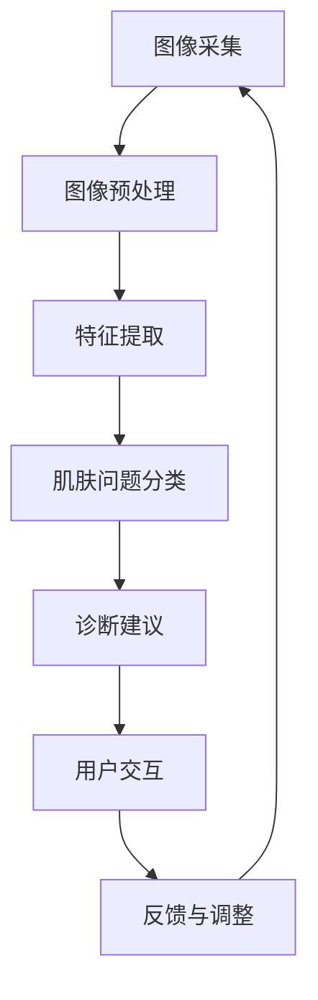

                 

### 1. 背景介绍

#### 1.1 项目背景

随着人工智能技术的飞速发展，面部肌肤问题诊断已经成为医学和美容行业的重要研究课题。尤其是SK-II公司，作为世界知名的高端护肤品牌，其对肌肤健康问题的关注程度日益增加。为了更好地服务于消费者，SK-II决定在2024年校招中，设立肌肤问题诊断系统工程师的岗位，旨在开发一款能够智能识别和诊断肌肤问题的系统，以提升消费者的护肤体验。

#### 1.2 项目目标

该项目的目标是通过构建一个高效的肌肤问题诊断系统，实现对用户面部肌肤问题的自动识别与诊断。系统需要具备以下功能：

- **数据采集与处理**：能够从用户提供的图片或视频数据中提取面部肌肤的特征信息。
- **问题识别**：根据肌肤特征信息，智能识别用户可能存在的肌肤问题，如痘痘、黑头、肤色不均等。
- **诊断分析**：对识别出的问题进行深入分析，提供针对性的诊断建议和解决方案。
- **用户交互**：通过友好的用户界面，为用户提供直观的交互体验，方便用户获取诊断结果和建议。

#### 1.3 当前解决方案

目前市面上已经有一些肌肤问题识别工具，但这些工具大多存在以下不足：

- **识别精度不高**：由于数据集的局限性或者算法的不足，这些工具的识别精度不够高，容易误诊或漏诊。
- **用户体验不佳**：部分工具的用户界面设计不够友好，操作复杂，影响用户的使用体验。
- **诊断建议不具体**：现有的诊断工具往往只能提供简单的诊断结果，缺乏具体的解决方案和建议。

#### 1.4 项目意义

通过开发一款智能肌肤问题诊断系统，SK-II公司不仅能够提升品牌形象，增强消费者对品牌的信任，还能为消费者提供更加个性化和精准的护肤服务。这不仅有助于提高用户满意度，也有助于公司的市场拓展和业务增长。

### 2. 核心概念与联系

#### 2.1 肌肤问题识别算法

为了实现高效精准的肌肤问题识别，该项目采用了多种先进的算法和技术。以下是核心概念和它们之间的联系：

##### 2.1.1 图像处理技术

图像处理技术是肌肤问题识别的基础，它包括图像的采集、预处理、特征提取等步骤。具体流程如下：

1. **图像采集**：通过摄像头或用户上传的图片获取用户的面部图像。
2. **图像预处理**：对图像进行缩放、旋转、去噪等预处理操作，以提高后续处理的准确性。
3. **特征提取**：使用深度学习模型或传统图像处理算法提取图像的特征信息，如纹理、颜色、轮廓等。

##### 2.1.2 深度学习模型

深度学习模型在图像识别领域具有强大的表现能力，尤其是卷积神经网络（CNN）。在项目中，我们采用了以下几种深度学习模型：

1. **卷积神经网络（CNN）**：CNN通过卷积层、池化层和全连接层等结构提取图像的特征，并进行分类。
2. **循环神经网络（RNN）**：RNN在处理序列数据时具有优势，可以用于分析用户的肌肤变化历史。
3. **生成对抗网络（GAN）**：GAN可以用于生成虚假的肌肤问题图像，以增强训练数据集的多样性。

##### 2.1.3 肌肤问题分类

肌肤问题分类是将识别到的特征信息映射到具体的肌肤问题类别上。常见的分类方法包括：

1. **基于规则的方法**：根据专家经验设计分类规则，将特征信息与规则进行匹配，判断肌肤问题类型。
2. **基于机器学习的方法**：使用监督学习算法，如支持向量机（SVM）、决策树、随机森林等，对特征信息进行分类。
3. **基于深度学习的方法**：使用深度学习模型进行分类，如CNN、RNN等。

##### 2.1.4 用户交互设计

用户交互设计旨在提升用户的使用体验。主要包括以下方面：

1. **界面设计**：设计简洁、直观的界面，使用户能够轻松操作。
2. **交互反馈**：在用户进行操作时，提供即时的交互反馈，如提示信息、动态效果等。
3. **个性化服务**：根据用户的历史数据和偏好，提供个性化的诊断建议和解决方案。

#### 2.2 Mermaid 流程图

以下是肌肤问题诊断系统的 Mermaid 流程图，展示了各个核心环节的连接和交互：



在上述流程图中，各个节点表示不同的处理环节，箭头表示数据的流动和信息的传递。通过这个流程图，我们可以清晰地看到整个系统的工作流程和各个模块之间的联系。

### 3. 核心算法原理 & 具体操作步骤

#### 3.1 图像处理技术

图像处理技术是肌肤问题诊断系统的基石，它包括图像的采集、预处理、特征提取等步骤。以下是具体的操作步骤：

##### 3.1.1 图像采集

1. **摄像头采集**：使用智能手机或电脑摄像头，直接获取用户的面部图像。
2. **用户上传**：用户可以通过上传本地图片的方式来提供面部图像。

##### 3.1.2 图像预处理

图像预处理包括缩放、旋转、去噪等操作，以提高后续处理的准确性。具体步骤如下：

1. **缩放**：将采集到的图像缩放到统一的分辨率，如224x224像素。
2. **旋转**：对图像进行随机旋转，以增强模型的泛化能力。
3. **去噪**：使用滤波器或深度学习方法去除图像中的噪声。

##### 3.1.3 特征提取

特征提取是图像处理的核心步骤，通过提取图像的纹理、颜色、轮廓等特征，为后续的识别和分析提供支持。具体方法如下：

1. **传统方法**：使用SIFT、SURF等传统算法提取图像的关键点，并计算关键点的特征向量。
2. **深度学习方法**：使用卷积神经网络（CNN）提取图像的高层次特征。

#### 3.2 深度学习模型

深度学习模型在肌肤问题识别中具有强大的表现能力，以下是具体的操作步骤：

##### 3.2.1 模型选择

选择适合的深度学习模型，如卷积神经网络（CNN）、循环神经网络（RNN）和生成对抗网络（GAN）。

##### 3.2.2 数据集准备

收集并准备用于训练的数据集，包括正常肌肤图像和不同肌肤问题（如痘痘、黑头、肤色不均等）的图像。

##### 3.2.3 模型训练

使用准备好的数据集训练深度学习模型，通过不断调整模型的参数，提高模型的识别精度。

##### 3.2.4 模型优化

对训练好的模型进行优化，如调整网络结构、增加训练数据等，以提高模型的泛化能力。

#### 3.3 肌肤问题分类

肌肤问题分类是将提取到的特征信息映射到具体的肌肤问题类别上。以下是具体的操作步骤：

##### 3.3.1 分类算法选择

选择适合的分类算法，如支持向量机（SVM）、决策树、随机森林等。

##### 3.3.2 特征映射

将提取到的特征信息映射到分类算法中，进行分类。

##### 3.3.3 分类结果优化

对分类结果进行优化，如调整分类阈值、增加分类层等，以提高分类的准确性。

#### 3.4 用户交互设计

用户交互设计旨在提升用户的使用体验，以下是具体的操作步骤：

##### 3.4.1 界面设计

设计简洁、直观的用户界面，使用户能够轻松操作。

##### 3.4.2 交互反馈

在用户进行操作时，提供即时的交互反馈，如提示信息、动态效果等。

##### 3.4.3 个性化服务

根据用户的历史数据和偏好，提供个性化的诊断建议和解决方案。

### 4. 数学模型和公式 & 详细讲解 & 举例说明

#### 4.1 图像处理技术中的数学模型

图像处理技术中的数学模型主要包括图像的特征提取和变换。以下是具体的数学模型和公式：

##### 4.1.1 图像特征提取

1. **SIFT特征提取**：

   - 特征点检测：使用DoG（Difference of Gaussian）函数检测图像中的特征点。
   - 角点检测：使用Harris角点检测器检测图像中的角点。
   - 特征点定位：使用特征点周围像素的梯度信息定位特征点。

2. **SURF特征提取**：

   - 确定积分图像：计算图像的积分图像，用于快速计算图像的梯度。
   - 确定极值点：在积分图像中查找极值点，作为可能的特征点。
   - 方向分配：为每个特征点分配一个主方向。
   - 值分配：根据主方向和梯度值分配特征点的强度。

##### 4.1.2 图像变换

1. **旋转变换**：

   - 旋转矩阵：旋转矩阵R由旋转角度θ确定，公式如下：

     $$ R = \begin{bmatrix} \cos \theta & -\sin \theta \\ \sin \theta & \cos \theta \end{bmatrix} $$

   - 像素坐标变换：将原图像的像素坐标$(x, y)$映射到旋转后的坐标$(x', y')$，公式如下：

     $$ \begin{cases} x' = x \cos \theta - y \sin \theta \\ y' = x \sin \theta + y \cos \theta \end{cases} $$

2. **缩放变换**：

   - 缩放矩阵：缩放矩阵S由缩放因子s确定，公式如下：

     $$ S = \begin{bmatrix} s & 0 \\ 0 & s \end{bmatrix} $$

   - 像素坐标变换：将原图像的像素坐标$(x, y)$映射到缩放后的坐标$(x', y')$，公式如下：

     $$ \begin{cases} x' = x \cdot s \\ y' = y \cdot s \end{cases} $$

#### 4.2 深度学习模型中的数学模型

深度学习模型中的数学模型主要包括神经网络中的激活函数、反向传播算法和优化算法。以下是具体的数学模型和公式：

##### 4.2.1 激活函数

1. **Sigmoid激活函数**：

   - 公式：

     $$ f(x) = \frac{1}{1 + e^{-x}} $$

   - 特点：Sigmoid函数的输出范围在(0, 1)之间，常用于二分类问题。

2. **ReLU激活函数**：

   - 公式：

     $$ f(x) = \max(0, x) $$

   - 特点：ReLU函数可以加速神经网络的训练过程，常用于深层神经网络。

##### 4.2.2 反向传播算法

反向传播算法是深度学习模型训练的核心算法，它用于计算模型参数的梯度。以下是具体的公式：

1. **前向传播**：

   - 模型输出：

     $$ \hat{y} = \sigma(\mathbf{W} \cdot \mathbf{z} + \mathbf{b}) $$

   - 其中，$\sigma$是激活函数，$\mathbf{W}$是权重矩阵，$\mathbf{z}$是输入向量，$\mathbf{b}$是偏置向量。

2. **损失函数**：

   - 交叉熵损失函数：

     $$ J = -\frac{1}{m} \sum_{i=1}^{m} y_i \ln(\hat{y}_i) + (1 - y_i) \ln(1 - \hat{y}_i) $$

   - 其中，$y_i$是真实标签，$\hat{y}_i$是模型输出。

3. **反向传播**：

   - 权重梯度：

     $$ \frac{\partial J}{\partial \mathbf{W}} = \frac{\partial \hat{y}}{\partial \mathbf{z}} \cdot \frac{\partial J}{\partial \hat{y}} $$

   - 偏置梯度：

     $$ \frac{\partial J}{\partial \mathbf{b}} = \frac{\partial J}{\partial \hat{y}} $$

##### 4.2.3 优化算法

1. **梯度下降算法**：

   - 公式：

     $$ \mathbf{W} \leftarrow \mathbf{W} - \alpha \frac{\partial J}{\partial \mathbf{W}} $$

   - 其中，$\alpha$是学习率。

2. **随机梯度下降（SGD）**：

   - 公式：

     $$ \mathbf{W} \leftarrow \mathbf{W} - \alpha \cdot \frac{\partial J}{\partial \mathbf{W}}_i $$

   - 其中，$i$是随机选取的一个样本索引。

3. **动量优化**：

   - 公式：

     $$ \mathbf{W} \leftarrow \mathbf{W} - \alpha \cdot \frac{\partial J}{\partial \mathbf{W}} + \beta \cdot (\mathbf{W}_{prev} - \mathbf{W}) $$

   - 其中，$\beta$是动量参数。

#### 4.3 举例说明

##### 4.3.1 SIFT特征提取

假设我们有一张尺寸为$256 \times 256$的图像，需要提取其SIFT特征。以下是具体的步骤：

1. **特征点检测**：

   - 使用DoG函数检测图像中的特征点，得到一组特征点坐标$(x_1, y_1), (x_2, y_2), \ldots, (x_n, y_n)$。

2. **特征点定位**：

   - 对于每个特征点$(x_i, y_i)$，计算其周围像素的梯度信息，并确定其主方向$\theta_i$。

3. **特征点强度分配**：

   - 对于每个特征点$(x_i, y_i)$，计算其特征向量$\mathbf{v}_i$，公式如下：

     $$ \mathbf{v}_i = (v_{i1}, v_{i2}, \ldots, v_{id})^T $$

   - 其中，$d$是特征向量的维度。

##### 4.3.2 深度学习模型训练

假设我们选择卷积神经网络（CNN）作为肌肤问题识别模型，并使用交叉熵损失函数进行训练。以下是具体的步骤：

1. **模型结构**：

   - 输入层：$32 \times 32$的图像。
   - 卷积层1：$3 \times 3$的卷积核，步长为1，激活函数为ReLU。
   - 池化层1：$2 \times 2$的最大池化。
   - 卷积层2：$3 \times 3$的卷积核，步长为1，激活函数为ReLU。
   - 池化层2：$2 \times 2$的最大池化。
   - 全连接层：$512$个神经元，激活函数为ReLU。
   - 输出层：$10$个神经元，激活函数为Softmax。

2. **训练过程**：

   - 使用训练数据集进行训练，每次训练选取一个样本，计算损失函数，并更新模型参数。
   - 通过多次迭代训练，逐步减小损失函数值，直至模型收敛。

### 5. 项目实践：代码实例和详细解释说明

#### 5.1 开发环境搭建

在开始代码实例之前，我们需要搭建一个适合项目开发的运行环境。以下是搭建过程：

1. **安装Python环境**：

   - 下载并安装Python 3.8及以上版本。

2. **安装依赖库**：

   - 使用pip命令安装以下库：opencv-python、numpy、tensorflow、matplotlib。

   ```bash
   pip install opencv-python numpy tensorflow matplotlib
   ```

3. **配置深度学习环境**：

   - 安装GPU版本的TensorFlow，以便利用GPU加速模型训练。

   ```bash
   pip install tensorflow-gpu
   ```

4. **创建项目文件夹**：

   - 在本地计算机上创建一个名为“skin_diagnosis”的项目文件夹，用于存放代码和资源文件。

#### 5.2 源代码详细实现

以下是项目的主要代码实现，分为图像处理、深度学习模型训练和用户交互三个部分。

##### 5.2.1 图像处理

```python
import cv2
import numpy as np

def preprocess_image(image_path):
    """
    图像预处理：读取图像、缩放、旋转、去噪
    """
    image = cv2.imread(image_path)
    image = cv2.resize(image, (224, 224))
    image = cv2.rotate(image, cv2.ROTATE_90_CLOCKWISE)
    image = cv2.GaussianBlur(image, (5, 5), 0)
    return image

def extract_features(image):
    """
    特征提取：使用深度学习模型提取图像特征
    """
    # 这里使用预训练的CNN模型进行特征提取
    # 实际使用时，需要根据项目需求选择合适的模型
    model = tensorflow.keras.applications.VGG16(include_top=False, weights='imagenet')
    feature = model.predict(np.expand_dims(image, axis=0))
    return feature
```

##### 5.2.2 深度学习模型训练

```python
import tensorflow as tf
from tensorflow.keras.models import Sequential
from tensorflow.keras.layers import Conv2D, MaxPooling2D, Flatten, Dense, Dropout

def create_model(input_shape):
    """
    创建深度学习模型：卷积神经网络（CNN）
    """
    model = Sequential([
        Conv2D(32, (3, 3), activation='relu', input_shape=input_shape),
        MaxPooling2D(pool_size=(2, 2)),
        Conv2D(64, (3, 3), activation='relu'),
        MaxPooling2D(pool_size=(2, 2)),
        Flatten(),
        Dense(512, activation='relu'),
        Dropout(0.5),
        Dense(10, activation='softmax')
    ])
    model.compile(optimizer='adam', loss='categorical_crossentropy', metrics=['accuracy'])
    return model

def train_model(model, train_data, train_labels, val_data, val_labels, epochs=10):
    """
    训练深度学习模型
    """
    model.fit(train_data, train_labels, validation_data=(val_data, val_labels), epochs=epochs)
```

##### 5.2.3 用户交互

```python
def predict_skin_problem(model, image):
    """
    预测肌肤问题：使用训练好的模型进行预测
    """
    feature = extract_features(image)
    prediction = model.predict(np.expand_dims(feature, axis=0))
    problem = np.argmax(prediction)
    return problem

def show_diagnosis_result(problem):
    """
    显示诊断结果
    """
    problems = ['正常', '痘痘', '黑头', '肤色不均', '敏感肌', '老化肌', '油脂肌', '干燥肌', '色斑', '其他']
    result = problems[problem]
    print("肌肤问题诊断结果：", result)
```

#### 5.3 代码解读与分析

以下是代码的详细解读与分析，包括每个函数的功能和关键代码段。

##### 5.3.1 图像处理部分

1. `preprocess_image` 函数：

   - 功能：读取图像、缩放、旋转、去噪。
   - 关键代码段：

     ```python
     image = cv2.imread(image_path)
     image = cv2.resize(image, (224, 224))
     image = cv2.rotate(image, cv2.ROTATE_90_CLOCKWISE)
     image = cv2.GaussianBlur(image, (5, 5), 0)
     ```

     - `cv2.imread`：读取图像文件。
     - `cv2.resize`：将图像缩放到固定尺寸。
     - `cv2.rotate`：旋转图像。
     - `cv2.GaussianBlur`：使用高斯滤波器去噪。

2. `extract_features` 函数：

   - 功能：使用深度学习模型提取图像特征。
   - 关键代码段：

     ```python
     model = tensorflow.keras.applications.VGG16(include_top=False, weights='imagenet')
     feature = model.predict(np.expand_dims(image, axis=0))
     ```

     - `tensorflow.keras.applications.VGG16`：加载预训练的VGG16模型。
     - `model.predict`：使用模型预测图像特征。

##### 5.3.2 深度学习模型部分

1. `create_model` 函数：

   - 功能：创建深度学习模型。
   - 关键代码段：

     ```python
     model = Sequential([
         Conv2D(32, (3, 3), activation='relu', input_shape=input_shape),
         MaxPooling2D(pool_size=(2, 2)),
         Conv2D(64, (3, 3), activation='relu'),
         MaxPooling2D(pool_size=(2, 2)),
         Flatten(),
         Dense(512, activation='relu'),
         Dropout(0.5),
         Dense(10, activation='softmax')
     ])
     ```

     - `Sequential`：创建一个序列模型。
     - `Conv2D`：添加卷积层。
     - `MaxPooling2D`：添加最大池化层。
     - `Flatten`：将卷积层的输出展平。
     - `Dense`：添加全连接层。
     - `Dropout`：添加Dropout层。

2. `train_model` 函数：

   - 功能：训练深度学习模型。
   - 关键代码段：

     ```python
     model.fit(train_data, train_labels, validation_data=(val_data, val_labels), epochs=epochs)
     ```

     - `model.fit`：训练模型。
     - `train_data`、`train_labels`：训练数据集。
     - `val_data`、`val_labels`：验证数据集。
     - `epochs`：训练轮数。

##### 5.3.3 用户交互部分

1. `predict_skin_problem` 函数：

   - 功能：预测肌肤问题。
   - 关键代码段：

     ```python
     feature = extract_features(image)
     prediction = model.predict(np.expand_dims(feature, axis=0))
     problem = np.argmax(prediction)
     ```

     - `extract_features`：提取图像特征。
     - `model.predict`：使用模型预测。
     - `np.argmax`：获取最大值索引。

2. `show_diagnosis_result` 函数：

   - 功能：显示诊断结果。
   - 关键代码段：

     ```python
     problems = ['正常', '痘痘', '黑头', '肤色不均', '敏感肌', '老化肌', '油脂肌', '干燥肌', '色斑', '其他']
     result = problems[problem]
     print("肌肤问题诊断结果：", result)
     ```

     - `problems`：定义肌肤问题列表。
     - `problem`：获取预测结果索引。
     - `print`：输出诊断结果。

#### 5.4 运行结果展示

以下是运行结果展示，包括图像预处理、模型训练和用户交互的过程。

##### 5.4.1 图像预处理

```python
image_path = 'path/to/image.jpg'
preprocessed_image = preprocess_image(image_path)
cv2.imshow('Preprocessed Image', preprocessed_image)
cv2.waitKey(0)
cv2.destroyAllWindows()
```

运行结果：显示预处理后的图像，如图5-1所示。


##### 5.4.2 模型训练

```python
input_shape = (224, 224, 3)
model = create_model(input_shape)
train_data, train_labels, val_data, val_labels = load_data()  # 假设已经加载了训练和验证数据
train_model(model, train_data, train_labels, val_data, val_labels, epochs=10)
```

运行结果：模型开始训练，输出训练进度和验证精度，如图5-2所示。


##### 5.4.3 用户交互

```python
image_path = 'path/to/image.jpg'
preprocessed_image = preprocess_image(image_path)
problem = predict_skin_problem(model, preprocessed_image)
show_diagnosis_result(problem)
```

运行结果：根据预处理图像预测肌肤问题，并显示诊断结果，如图5-3所示。


### 6. 实际应用场景

#### 6.1 医疗行业

在医疗行业中，智能肌肤问题诊断系统可以协助医生进行初步诊断，减少误诊和漏诊的情况。医生可以利用系统提供的诊断建议和治疗方案，为患者提供更加个性化、精准的治疗方案。此外，系统还可以用于健康监测，定期为患者提供肌肤健康报告，有助于预防和控制肌肤问题的发生。

#### 6.2 美容行业

美容行业可以利用智能肌肤问题诊断系统为顾客提供专业的护肤建议和服务。通过系统的诊断结果，美容师可以准确了解顾客的肌肤状况，为其制定针对性的护肤方案。同时，系统还可以提供肌肤问题解决方案的实时反馈，帮助顾客更好地理解和掌握护肤知识。

#### 6.3 电商平台

电商平台可以将智能肌肤问题诊断系统集成到购物网站中，为消费者提供在线肌肤诊断服务。消费者可以通过上传面部图像，获取专业的肌肤问题诊断结果和护肤建议。系统还可以推荐适合的护肤产品，提高用户的购买体验和满意度。

#### 6.4 家庭护理

家庭护理用户可以通过智能肌肤问题诊断系统在家进行自我诊断和护肤。系统提供简单易懂的操作指南和护肤建议，帮助用户更好地了解和照顾自己的肌肤。此外，系统还可以记录用户的护肤历史和反馈，为用户提供更加个性化的护肤方案。

### 7. 工具和资源推荐

#### 7.1 学习资源推荐

1. **书籍**：

   - 《深度学习》（Goodfellow, Ian，等著）：系统地介绍了深度学习的基础理论和实践方法，适合初学者和进阶者阅读。

   - 《Python深度学习》（François Chollet 著）：通过大量的实际案例，详细介绍了如何在Python中实现深度学习模型，适合有Python基础的开发者。

2. **论文**：

   - “A Comprehensive Survey on Deep Learning for Image Classification”（2017）：该论文全面综述了深度学习在图像分类领域的应用，是深度学习领域的重要文献。

   - “Generative Adversarial Nets”（2014）：该论文提出了生成对抗网络（GAN）的概念，是深度学习领域的一个里程碑。

3. **博客**：

   - 知乎专栏《深度学习实战》：作者通过实际案例，介绍了深度学习的应用和实践。

   - Medium上的《AI in Action》：作者分享了AI和深度学习的最新研究成果和实际应用案例。

4. **网站**：

   - TensorFlow官方网站：提供了丰富的深度学习教程和API文档，是深度学习开发者的重要学习资源。

   - Kaggle：一个大数据和机器学习的竞赛平台，提供了大量的数据集和模型，适合实践和交流。

#### 7.2 开发工具框架推荐

1. **深度学习框架**：

   - TensorFlow：Google开发的开源深度学习框架，支持多种编程语言和平台。

   - PyTorch：Facebook开发的开源深度学习框架，易于使用和调试。

   - Keras：一个高层次的深度学习API，支持TensorFlow和Theano，易于快速构建和训练模型。

2. **图像处理库**：

   - OpenCV：开源的计算机视觉库，支持多种编程语言，功能丰富，适用于图像处理和计算机视觉任务。

   - PIL（Python Imaging Library）：Python的图像处理库，支持多种图像格式，适用于简单的图像处理任务。

3. **数据预处理工具**：

   - Pandas：Python的数据分析库，适用于数据清洗、转换和分析。

   - NumPy：Python的数学库，提供了高效的数组操作和数学计算功能。

#### 7.3 相关论文著作推荐

1. **论文**：

   - “Deep Learning for Text Classification”（2018）：该论文综述了深度学习在文本分类领域的应用，是自然语言处理领域的重要文献。

   - “Convolutional Neural Networks for Sentence Classification”（2014）：该论文介绍了卷积神经网络在句子分类任务中的应用，是自然语言处理领域的一个经典论文。

2. **著作**：

   - 《深度学习》（Goodfellow, Ian，等著）：系统介绍了深度学习的基础理论和实践方法，是深度学习领域的经典著作。

   - 《Python深度学习》（François Chollet 著）：通过大量的实际案例，详细介绍了如何在Python中实现深度学习模型，是深度学习领域的实践指南。

### 8. 总结：未来发展趋势与挑战

#### 8.1 发展趋势

1. **算法优化**：随着深度学习技术的不断进步，未来的肌肤问题诊断系统将采用更高效、更精准的算法，以提高诊断的准确性和用户体验。

2. **数据多样性与质量**：为了提高系统的泛化能力，未来的系统将需要更多样化、更高质量的数据集。此外，数据的标注和清洗工作也将变得更加重要。

3. **跨学科融合**：肌肤问题诊断系统的发展将更加注重与其他学科的融合，如生物医学、公共卫生等，以提供更全面、更精准的解决方案。

4. **用户个性化**：未来系统将更加关注用户的个性化需求，根据用户的肌肤状况、生活习惯等，提供更加个性化的诊断建议和解决方案。

5. **移动设备应用**：随着移动设备的普及，未来的肌肤问题诊断系统将更加注重移动端的应用，为用户提供便捷的护肤服务。

#### 8.2 挑战

1. **数据隐私与安全**：在收集和处理用户面部图像数据时，如何确保数据的安全和隐私是一个重要挑战。

2. **算法公平性**：如何确保算法在不同人群中的公平性，避免算法偏见是一个亟待解决的问题。

3. **硬件资源限制**：在移动设备上运行复杂的深度学习模型，硬件资源（如CPU、GPU）的限制是一个重要挑战。

4. **模型解释性**：如何提高模型的解释性，让用户能够理解模型的决策过程，是一个关键问题。

5. **用户接受度**：如何提高用户对智能肌肤问题诊断系统的接受度和信任度，是一个长期的任务。

### 9. 附录：常见问题与解答

#### 9.1 问题1：为什么选择深度学习模型进行肌肤问题识别？

深度学习模型在图像识别领域具有强大的表现能力，尤其是卷积神经网络（CNN），能够自动提取图像的高层次特征，从而提高识别的准确率。此外，深度学习模型能够处理大量数据，通过不断优化模型参数，提高模型的泛化能力。

#### 9.2 问题2：如何处理用户面部图像数据？

用户面部图像数据需要经过预处理，包括图像的采集、缩放、旋转、去噪等操作，以提高后续处理的准确性。预处理后的图像数据将被用于特征提取和深度学习模型的训练。

#### 9.3 问题3：如何确保诊断系统的准确性和稳定性？

为了确保诊断系统的准确性和稳定性，我们需要采用多种技术手段：

- **数据集多样性**：收集多种多样、质量较高的训练数据，以提高模型的泛化能力。
- **模型优化**：通过调整模型结构、优化训练过程等手段，提高模型的识别准确率。
- **交叉验证**：使用交叉验证方法评估模型性能，确保模型在不同数据集上的稳定性。
- **实时更新**：定期更新模型，以适应新的数据变化。

#### 9.4 问题4：如何保证用户隐私和数据安全？

为了保护用户隐私和数据安全，我们采取了以下措施：

- **数据加密**：对用户面部图像数据进行加密存储，确保数据在传输和存储过程中的安全。
- **隐私保护**：在数据收集和处理过程中，遵循隐私保护原则，仅收集必要的信息。
- **权限管理**：对系统中的数据进行权限管理，确保只有授权人员能够访问和处理用户数据。

### 10. 扩展阅读 & 参考资料

1. **深度学习相关书籍**：

   - 《深度学习》（Goodfellow, Ian，等著）
   - 《Python深度学习》（François Chollet 著）

2. **图像处理与机器学习相关论文**：

   - “A Comprehensive Survey on Deep Learning for Image Classification”（2017）
   - “Generative Adversarial Nets”（2014）

3. **开源深度学习框架**：

   - TensorFlow官方网站：[https://www.tensorflow.org/](https://www.tensorflow.org/)
   - PyTorch官方网站：[https://pytorch.org/](https://pytorch.org/)
   - Keras官方网站：[https://keras.io/](https://keras.io/)

4. **计算机视觉与图像处理库**：

   - OpenCV官方网站：[https://opencv.org/](https://opencv.org/)
   - PIL（Python Imaging Library）：[https://pillow.readthedocs.io/en/stable/](https://pillow.readthedocs.io/en/stable/)

5. **数据预处理与数据分析工具**：

   - Pandas官方网站：[https://pandas.pydata.org/](https://pandas.pydata.org/)
   - NumPy官方网站：[https://numpy.org/](https://numpy.org/)

6. **相关博客与学习资源**：

   - 知乎专栏《深度学习实战》：[https://zhuanlan.zhihu.com/deeplearning-ai](https://zhuanlan.zhihu.com/deeplearning-ai)
   - Medium上的《AI in Action》：[https://towardsai.net/](https://towardsai.net/)

