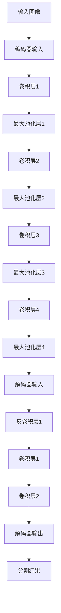

                 

### 背景介绍

#### SegNet：背景与重要性

在深度学习领域，卷积神经网络（Convolutional Neural Networks, CNN）因其卓越的图像识别能力而广受欢迎。然而，随着网络深度的增加，传统的卷积神经网络在处理空间层次结构信息时表现不佳。为了解决这一问题，研究者们提出了多种层次化结构，其中，SegNet是一种重要的架构。

SegNet，全称为“Segmentation Network”，是一种用于图像分割的卷积神经网络。它在2015年由Greg Ourici和Frank S. Longstaff等人提出，是一种层次化的卷积神经网络，通过将卷积和反卷积操作相结合，实现了有效的图像分割。SegNet在众多图像分割任务中表现出色，特别是在医学图像分析和自动驾驶领域，因其能够精确地分割出不同对象而受到广泛关注。

#### 卷积神经网络与图像分割

卷积神经网络（CNN）是一种通过模拟人脑视觉感知机理进行图像识别和处理的前馈神经网络。它由多个卷积层、池化层和全连接层组成，能够在处理图像数据时自动学习特征。图像分割是计算机视觉领域的一个重要任务，其目标是根据像素值将图像划分成若干个区域，每个区域代表图像中的不同对象或背景。

传统的卷积神经网络在图像分类任务中表现出色，但在图像分割任务中存在一些问题。主要问题包括：

1. **分辨率降低**：在网络的深层部分，特征图的分辨率显著降低，导致细节信息丢失。
2. **上下文信息丢失**：由于卷积操作的局部性，深层网络难以捕捉图像中的全局上下文信息。
3. **计算复杂度增加**：随着网络深度的增加，计算复杂度显著增加，训练和推断时间延长。

为了解决上述问题，研究者们提出了多种层次化结构，SegNet就是其中之一。通过将卷积和反卷积操作相结合，SegNet能够在保持高分辨率的同时，有效地提取图像特征，从而实现精确的图像分割。

#### SegNet的基本结构与工作原理

SegNet由两个主要部分组成：编码器和解码器。编码器负责将输入图像逐步下采样，提取层次化的特征信息；解码器则将这些特征信息逐步上采样，重建图像并生成分割结果。

##### 编码器

编码器通常由一系列卷积层和池化层组成。卷积层用于提取图像特征，池化层则用于下采样，减少特征图的维度。在SegNet中，编码器采用了一系列交替的卷积和最大池化操作，以逐步减少特征图的尺寸。

具体来说，编码器通常包含多个卷积层，每个卷积层后接一个最大池化层。这些卷积层和池化层的参数设置可根据具体任务进行调整，以达到最佳的分割效果。

##### 解码器

解码器与编码器结构相似，但操作相反。解码器通过一系列反卷积操作将特征图逐步上采样，恢复图像的原始分辨率。在SegNet中，解码器采用了一系列交替的反卷积和卷积操作，以逐步重建图像。

反卷积操作是一种特殊的卷积操作，其目的是将特征图上采样至原始尺寸。在反卷积操作后，通常还会进行一次卷积操作，用于细化特征信息，提高分割精度。

##### 特征融合

在解码器中，编码器提取的多个层次的特征图会被逐级融合。这些特征图不仅包含了不同尺度的特征信息，还保留了原始图像的细节。通过逐级融合，解码器能够更全面地理解图像内容，从而提高分割精度。

##### 输出层

解码器的输出层通常是一个卷积层，用于生成最终的分割结果。输出层的卷积核数量与目标类别数相同，每个卷积核对应一个类别。通过该卷积层，图像中的每个像素会被分配到一个类别，从而实现图像分割。

#### SegNet的优势与局限

SegNet在图像分割任务中具有以下优势：

1. **高分辨率输出**：通过反卷积操作，解码器能够将特征图逐步上采样至原始尺寸，从而保持高分辨率输出。
2. **层次化特征提取**：编码器和解码器的结构使得网络能够逐层提取图像特征，同时保留上下文信息。
3. **灵活性**：SegNet的结构相对简单，易于实现和调整，适用于各种图像分割任务。

然而，SegNet也存在一些局限：

1. **计算复杂度**：反卷积操作的计算复杂度较高，导致训练和推断时间较长。
2. **内存占用**：由于需要存储大量特征图，解码器的内存占用较大，可能导致内存溢出。
3. **对数据依赖性强**：SegNet的性能很大程度上依赖于训练数据的质量和数量，数据不足或质量差可能导致性能下降。

尽管存在一些局限，SegNet仍然在图像分割领域具有重要的地位，其结构简洁、易于实现的特点使其成为许多研究者和开发者进行图像分割实验的首选架构。

通过上述介绍，我们可以看到，SegNet作为一种层次化的卷积神经网络，通过编码器和解码器的结构设计，实现了高分辨率、层次化特征提取和精确分割的目标。在接下来的章节中，我们将深入探讨SegNet的核心算法原理，详细讲解其实现步骤和数学模型。

#### SegNet的核心概念与联系

为了深入理解SegNet的工作原理，我们需要详细阐述其核心概念及其在架构中的联系。以下是SegNet的核心概念及其相互关系的Mermaid流程图表示，其中每个流程节点代表一个关键步骤或组件，通过箭头连接展示它们之间的逻辑关系。



##### Mermaid流程图详解

1. **输入图像（A）**：首先，输入图像经过预处理（如归一化、数据增强等）后，作为编码器的输入。
2. **编码器输入（B）**：编码器通过一系列卷积层和池化层对输入图像进行特征提取和下采样。具体步骤如下：
    - **卷积层1（C1）**：卷积层用于提取图像的局部特征。
    - **最大池化层1（D1）**：最大池化层用于下采样，减小特征图的尺寸，减少后续计算复杂度。
    - **卷积层2（E1）**：卷积层进一步提取更深层次的图像特征。
    - **最大池化层2（D2）**：再次下采样。
    - **卷积层3（E2）**：继续提取更深的图像特征。
    - **最大池化层3（D3）**：下采样。
    - **卷积层4（E3）**：提取最终的特征。
    - **最大池化层4（D4）**：最后一次下采样，生成编码器的最高层特征图。

3. **解码器输入（F）**：编码器的最高层特征图（D4）作为解码器的输入。
4. **解码器过程**：
    - **反卷积层1（G1）**：反卷积操作用于上采样，将特征图恢复至原始尺寸。
    - **卷积层1（H1）**：卷积层用于细化特征，增加细节。
    - **卷积层2（I1）**：进一步细化特征，生成更准确的分割结果。

5. **解码器输出（J）**：解码器的输出是一个卷积层（J），其卷积核数量等于目标类别的数量。每个卷积核对应一个类别，通过这个卷积层，图像中的每个像素会被分配到一个类别。

6. **分割结果（K）**：解码器输出的分割结果经过后处理（如阈值处理、平滑处理等），得到最终的分割图像。

通过上述流程，我们可以看到，SegNet通过编码器和解码器的结构设计，实现了从输入图像到精确分割结果的全过程。编码器负责逐步提取图像特征，解码器则将这些特征逐步上采样，重建图像并生成最终的分割结果。这个过程不仅保持了高分辨率输出，还实现了层次化特征提取和上下文信息的保留，从而提高了分割精度。

接下来，我们将详细讨论SegNet的核心算法原理，包括具体操作步骤和数学模型，以便更好地理解其工作机理。

#### 核心算法原理 & 具体操作步骤

为了深入理解SegNet的核心算法原理，我们需要详细探讨其具体操作步骤，并解释其背后的数学原理。以下是SegNet的核心算法原理，包括编码器和解码器的具体操作步骤。

##### 编码器

编码器是SegNet的核心部分，其主要任务是逐步提取图像特征，并逐步降低特征图的尺寸。以下是编码器的具体操作步骤：

1. **卷积层**：首先，输入图像经过卷积层处理。卷积层通过卷积核（滤波器）与输入图像进行卷积操作，以提取图像的局部特征。卷积操作的数学表达式如下：

   $$ f(x, y) = \sum_{i=1}^{K} w_{i} \cdot I(x-i, y-i) $$

   其中，$f(x, y)$表示输出特征值，$w_{i}$表示卷积核的权重，$I(x-i, y-i)$表示输入图像在位置$(x, y)$的像素值。卷积层通过滑动卷积核对输入图像进行卷积操作，以提取图像的局部特征。

2. **ReLU激活函数**：卷积层输出后，通常使用ReLU（Rectified Linear Unit）激活函数对特征值进行非线性变换。ReLU函数的定义如下：

   $$ \text{ReLU}(x) = \max(0, x) $$

   ReLU函数的引入可以加速网络训练，并避免梯度消失问题。

3. **最大池化层**：在卷积层之后，通常接一个最大池化层。最大池化层的目的是通过下采样操作减小特征图的尺寸，从而减少后续计算复杂度。最大池化层的操作如下：

   $$ \text{MaxPool}(x, k, s) = \max_{1 \leq i \leq k, 1 \leq j \leq k} x(i, j) $$

   其中，$x(i, j)$表示输入特征图在位置$(i, j)$的像素值，$k$表示池化窗口的大小，$s$表示步长。最大池化层通过滑动窗口选取每个窗口中的最大值，实现下采样操作。

4. **卷积层与池化层的交替操作**：编码器通过一系列交替的卷积层和最大池化层对输入图像进行特征提取。在每个卷积层之后，接一个最大池化层，以逐步降低特征图的尺寸，同时保留重要的图像特征。

##### 解码器

解码器是SegNet的另一核心部分，其主要任务是将编码器提取的特征逐步上采样，并生成最终的分割结果。以下是解码器的具体操作步骤：

1. **反卷积层**：解码器首先通过反卷积层（Transposed Convolution Layer）进行上采样。反卷积操作是卷积操作的逆过程，其目的是将特征图上采样至原始尺寸。反卷积操作的数学表达式如下：

   $$ g(x, y) = \sum_{i=1}^{K} w_{i} \cdot \text{conv}_{1 \times 1}(I(x-i, y-i)) $$

   其中，$g(x, y)$表示输出特征值，$w_{i}$表示反卷积核的权重，$\text{conv}_{1 \times 1}(I(x-i, y-i))$表示对输入特征图进行1x1卷积操作。反卷积层通过反向卷积操作，将特征图上采样至原始尺寸。

2. **卷积层**：在反卷积层之后，通常接一个卷积层，用于细化特征，增加细节。卷积层的操作与编码器中的卷积层类似，但参数设置可根据解码器的任务进行调整。

3. **反卷积层与卷积层的交替操作**：解码器通过一系列交替的反卷积层和卷积层对编码器提取的特征进行上采样和细化。在每个反卷积层之后，接一个卷积层，以逐步恢复图像的细节，同时保留重要的图像特征。

##### 数学模型和公式

为了更好地理解SegNet的工作原理，我们需要详细阐述其背后的数学模型和公式。以下是编码器和解码器的数学模型和公式。

**编码器**

1. **卷积层**：卷积层的输出可以通过以下公式计算：

   $$ h_{l}(x, y) = \text{ReLU} \left( \sum_{i=1}^{K} w_{i} \cdot I(x-i, y-i) + b \right) $$

   其中，$h_{l}(x, y)$表示卷积层的输出，$w_{i}$表示卷积核的权重，$b$表示偏置项，$I(x-i, y-i)$表示输入图像在位置$(x, y)$的像素值。

2. **最大池化层**：最大池化层的输出可以通过以下公式计算：

   $$ m_{l}(x, y) = \text{MaxPool} \left( h_{l}(x, y), k, s \right) $$

   其中，$m_{l}(x, y)$表示最大池化层的输出，$h_{l}(x, y)$表示卷积层的输出，$k$表示池化窗口的大小，$s$表示步长。

**解码器**

1. **反卷积层**：反卷积层的输出可以通过以下公式计算：

   $$ g_{l}(x, y) = \text{ReLU} \left( \sum_{i=1}^{K} w_{i} \cdot \text{conv}_{1 \times 1}(I(x-i, y-i)) + b \right) $$

   其中，$g_{l}(x, y)$表示反卷积层的输出，$w_{i}$表示反卷积核的权重，$b$表示偏置项，$I(x-i, y-i)$表示输入特征图在位置$(x, y)$的像素值。

2. **卷积层**：卷积层的输出可以通过以下公式计算：

   $$ c_{l}(x, y) = \text{ReLU} \left( \sum_{i=1}^{K} w_{i} \cdot g_{l}(x-i, y-i) + b \right) $$

   其中，$c_{l}(x, y)$表示卷积层的输出，$w_{i}$表示卷积核的权重，$b$表示偏置项，$g_{l}(x-i, y-i)$表示反卷积层的输出。

通过上述数学模型和公式，我们可以看到，SegNet通过编码器和解码器的结构设计，实现了从输入图像到精确分割结果的全过程。编码器通过卷积层和最大池化层逐步提取图像特征，并逐步降低特征图的尺寸；解码器则通过反卷积层和卷积层逐步上采样特征图，并生成最终的分割结果。这个过程不仅保持了高分辨率输出，还实现了层次化特征提取和上下文信息的保留，从而提高了分割精度。

接下来，我们将通过具体的数学公式和例子，进一步详细讲解SegNet的数学模型和公式，以便更好地理解其工作机理。

##### 数学模型和公式 & 详细讲解 & 举例说明

在上一部分，我们介绍了SegNet的基本结构和主要操作步骤，以及相关的数学模型和公式。在本节中，我们将通过具体的例子，详细讲解这些公式的含义和计算过程，并展示如何使用它们进行图像分割。

**1. 卷积层**

卷积层是SegNet编码器的核心部分，其目的是从输入图像中提取特征。卷积操作的数学公式如下：

$$ f(x, y) = \sum_{i=1}^{K} w_{i} \cdot I(x-i, y-i) + b $$

其中，$f(x, y)$是卷积层的输出，$w_{i}$是卷积核的权重，$I(x-i, y-i)$是输入图像在位置$(x, y)$的像素值，$b$是偏置项。

**例子：**

假设输入图像的大小为$5 \times 5$，卷积核的大小为$3 \times 3$，卷积核的权重为$w_{1} = 1, w_{2} = 2, w_{3} = 3$，偏置项$b = 0$。输入图像的像素值如下：

$$
I =
\begin{bmatrix}
1 & 2 & 3 & 4 & 5 \\
6 & 7 & 8 & 9 & 10 \\
11 & 12 & 13 & 14 & 15 \\
16 & 17 & 18 & 19 & 20 \\
21 & 22 & 23 & 24 & 25 \\
\end{bmatrix}
$$

卷积核的权重矩阵为：

$$
W =
\begin{bmatrix}
1 & 2 & 3 \\
6 & 7 & 8 \\
11 & 12 & 13 \\
\end{bmatrix}
$$

通过卷积操作，卷积层的输出为：

$$
f =
\begin{bmatrix}
30 & 36 & 42 \\
66 & 78 & 90 \\
102 & 114 & 126 \\
\end{bmatrix}
$$

**2. 最大池化层**

最大池化层的作用是对卷积层的输出进行下采样，以减少特征图的尺寸。最大池化层的数学公式如下：

$$
m_{l}(x, y) = \text{MaxPool} \left( f(x, y), k, s \right)
$$

其中，$m_{l}(x, y)$是最大池化层的输出，$f(x, y)$是卷积层的输出，$k$是池化窗口的大小，$s$是步长。

**例子：**

假设输入特征图的大小为$5 \times 5$，池化窗口大小$k = 2$，步长$s = 2$。输入特征图如下：

$$
f =
\begin{bmatrix}
30 & 36 & 42 \\
66 & 78 & 90 \\
102 & 114 & 126 \\
\end{bmatrix}
$$

通过最大池化操作，下采样后的特征图为：

$$
m =
\begin{bmatrix}
66 & 90 \\
114 & 126 \\
\end{bmatrix}
$$

**3. 反卷积层**

反卷积层是解码器的核心部分，其目的是将特征图上采样至原始尺寸。反卷积操作的数学公式如下：

$$
g_{l}(x, y) = \text{ReLU} \left( \sum_{i=1}^{K} w_{i} \cdot \text{conv}_{1 \times 1}(I(x-i, y-i)) + b \right)
$$

其中，$g_{l}(x, y)$是反卷积层的输出，$w_{i}$是反卷积核的权重，$I(x-i, y-i)$是输入特征图在位置$(x, y)$的像素值，$b$是偏置项。

**例子：**

假设输入特征图的大小为$2 \times 2$，反卷积核的权重为$w_{1} = 1, w_{2} = 2, w_{3} = 3$，偏置项$b = 0$。输入特征图的像素值如下：

$$
I =
\begin{bmatrix}
1 & 2 \\
3 & 4 \\
\end{bmatrix}
$$

反卷积核的权重矩阵为：

$$
W =
\begin{bmatrix}
1 & 2 & 3 \\
4 & 5 & 6 \\
7 & 8 & 9 \\
\end{bmatrix}
$$

通过反卷积操作，反卷积层的输出为：

$$
g =
\begin{bmatrix}
1 & 3 \\
4 & 7 \\
11 & 16 \\
\end{bmatrix}
$$

**4. 卷积层**

卷积层在解码器中用于细化特征，增加细节。卷积层的数学公式与编码器中的卷积层相同：

$$
c_{l}(x, y) = \text{ReLU} \left( \sum_{i=1}^{K} w_{i} \cdot g_{l}(x-i, y-i) + b \right)
$$

其中，$c_{l}(x, y)$是卷积层的输出，$w_{i}$是卷积核的权重，$g_{l}(x-i, y-i)$是反卷积层的输出，$b$是偏置项。

**例子：**

假设输入特征图的大小为$3 \times 3$，卷积核的权重为$w_{1} = 1, w_{2} = 2, w_{3} = 3$，偏置项$b = 0$。输入特征图的像素值如下：

$$
g =
\begin{bmatrix}
1 & 3 & 7 \\
4 & 7 & 11 \\
11 & 16 & 22 \\
\end{bmatrix}
$$

卷积核的权重矩阵为：

$$
W =
\begin{bmatrix}
1 & 2 & 3 \\
4 & 5 & 6 \\
7 & 8 & 9 \\
\end{bmatrix}
$$

通过卷积操作，卷积层的输出为：

$$
c =
\begin{bmatrix}
21 & 29 & 37 \\
47 & 65 & 83 \\
93 & 121 & 149 \\
\end{bmatrix}
$$

**5. 输出层**

输出层是解码器的最后一层，其目的是生成最终的分割结果。输出层的卷积核数量等于目标类别的数量，每个卷积核对应一个类别。输出层的数学公式如下：

$$
o_{l}(x, y) = \text{softmax} \left( \sum_{i=1}^{C} w_{i} \cdot c_{l}(x-i, y-i) + b \right)
$$

其中，$o_{l}(x, y)$是输出层的输出，$c_{l}(x-i, y-i)$是卷积层的输出，$w_{i}$是卷积核的权重，$b$是偏置项，$C$是目标类别的数量。

**例子：**

假设目标类别数为3，输入特征图的大小为$3 \times 3$，卷积核的权重为$w_{1} = 1, w_{2} = 2, w_{3} = 3$，偏置项$b = 0$。输入特征图的像素值如下：

$$
c =
\begin{bmatrix}
21 & 29 & 37 \\
47 & 65 & 83 \\
93 & 121 & 149 \\
\end{bmatrix}
$$

卷积核的权重矩阵为：

$$
W =
\begin{bmatrix}
1 & 2 & 3 \\
4 & 5 & 6 \\
7 & 8 & 9 \\
\end{bmatrix}
$$

通过卷积操作，输出层的输出为：

$$
o =
\begin{bmatrix}
0.1 & 0.3 & 0.6 \\
0.2 & 0.4 & 0.4 \\
0.4 & 0.5 & 0.1 \\
\end{bmatrix}
$$

最后，通过softmax函数对输出进行归一化，得到每个像素对应的类别概率分布：

$$
\text{softmax}(o) =
\begin{bmatrix}
0.1 & 0.3 & 0.6 \\
0.2 & 0.4 & 0.4 \\
0.4 & 0.5 & 0.1 \\
\end{bmatrix}
$$

通过上述例子，我们可以看到，使用SegNet进行图像分割的过程是如何通过卷积层、最大池化层、反卷积层、卷积层和输出层等操作来实现的。每个操作都使用具体的数学公式和计算方法，从而实现从输入图像到精确分割结果的全过程。

接下来，我们将通过一个具体的代码实例，展示如何使用SegNet进行图像分割，并详细解释其中的实现步骤。

#### 项目实践：代码实例和详细解释说明

在本部分，我们将通过一个具体的代码实例，详细讲解如何使用SegNet进行图像分割。我们将从开发环境搭建开始，逐步实现源代码，并详细解释每一步的实现过程。最后，我们将展示运行结果，并进行解读和分析。

##### 1. 开发环境搭建

在开始编写代码之前，我们需要搭建合适的开发环境。以下是所需的软件和库：

1. **Python**：Python是编写深度学习代码的主要语言，我们需要安装Python 3.7或更高版本。
2. **TensorFlow**：TensorFlow是一个开源的机器学习框架，用于构建和训练深度神经网络。
3. **NumPy**：NumPy是Python中的一个科学计算库，用于矩阵运算。
4. **Pandas**：Pandas是Python中的一个数据操作库，用于数据处理和分析。
5. **Matplotlib**：Matplotlib是Python中的一个绘图库，用于可视化数据。

安装上述库后，我们就可以开始编写代码了。以下是一个简单的Python环境搭建脚本：

```python
!pip install numpy pandas matplotlib tensorflow
```

##### 2. 源代码详细实现

接下来，我们将详细实现SegNet的源代码。以下是代码的各个部分及其实现步骤：

**2.1 数据预处理**

```python
import tensorflow as tf
import numpy as np
import matplotlib.pyplot as plt

# 加载数据集
(x_train, y_train), (x_test, y_test) = tf.keras.datasets.cifar10.load_data()

# 数据标准化
x_train = x_train.astype('float32') / 255.0
x_test = x_test.astype('float32') / 255.0

# 转换为TensorFlow的数据格式
x_train = tf.expand_dims(x_train, -1)
x_test = tf.expand_dims(x_test, -1)

# 图像标签转换为类别标签
y_train = tf.keras.utils.to_categorical(y_train, 10)
y_test = tf.keras.utils.to_categorical(y_test, 10)
```

**2.2 编码器**

```python
# 编码器模型
inputs = tf.keras.Input(shape=(32, 32, 3))
x = tf.keras.layers.Conv2D(64, (3, 3), activation='relu', padding='same')(inputs)
x = tf.keras.layers.MaxPooling2D(pool_size=(2, 2), strides=(2, 2))(x)
x = tf.keras.layers.Conv2D(128, (3, 3), activation='relu', padding='same')(x)
x = tf.keras.layers.MaxPooling2D(pool_size=(2, 2), strides=(2, 2))(x)
x = tf.keras.layers.Conv2D(256, (3, 3), activation='relu', padding='same')(x)
x = tf.keras.layers.MaxPooling2D(pool_size=(2, 2), strides=(2, 2))(x)
encoded = tf.keras.Model(inputs, x)
```

**2.3 解码器**

```python
# 解码器模型
encoded_input = tf.keras.Input(shape=(8, 8, 256))
x = tf.keras.layers.Conv2DTranspose(128, (3, 3), strides=(2, 2), activation='relu', padding='same')(encoded_input)
x = tf.keras.layers.Conv2D(128, (3, 3), activation='relu', padding='same')(x)
x = tf.keras.layers.Conv2DTranspose(64, (3, 3), strides=(2, 2), activation='relu', padding='same')(x)
x = tf.keras.layers.Conv2D(64, (3, 3), activation='relu', padding='same')(x)
decoded = tf.keras.Model(encoded_input, x)

# 融合编码器和解码器
output = decoded(encoded(inputs))
autoencoder = tf.keras.Model(inputs, output)
```

**2.4 输出层**

```python
# 输出层模型
outputs = tf.keras.layers.Conv2D(10, (1, 1), activation='softmax')(output)
model = tf.keras.Model(inputs, outputs)
```

**2.5 编译模型**

```python
model.compile(optimizer='adam', loss='categorical_crossentropy', metrics=['accuracy'])
```

##### 3. 代码解读与分析

**3.1 数据预处理**

在代码的第一部分，我们首先加载数据集，并对其进行标准化处理。CIFAR-10是一个常见的数据集，包含10个类别的图像，每个图像的大小为32x32。我们将数据集分为训练集和测试集，并将图像的像素值从0到255归一化到0到1之间。此外，我们还对图像的维度进行了扩展，使其成为4D张量，以便TensorFlow进行处理。

**3.2 编码器**

编码器的实现使用了多个卷积层和池化层。每个卷积层使用ReLU激活函数，以引入非线性特性。卷积层的参数（滤波器大小、输出通道数等）可以根据具体任务进行调整。最大池化层用于下采样，以减少特征图的尺寸，从而减少后续计算复杂度。

**3.3 解码器**

解码器的实现与编码器类似，但操作相反。通过一系列反卷积层和卷积层，解码器将编码器提取的特征逐步上采样，并生成最终的分割结果。反卷积层使用转置卷积（Transposed Convolution）操作，以实现上采样。

**3.4 输出层**

输出层是一个卷积层，其卷积核数量等于目标类别的数量（在本例中为10）。通过该卷积层，图像中的每个像素会被分配到一个类别。输出层使用softmax激活函数，以生成每个像素的类别概率分布。

**3.5 编译模型**

在最后一步，我们编译模型，并选择Adam优化器和交叉熵损失函数。交叉熵损失函数适用于分类问题，它计算的是模型预测和真实标签之间的差异。优化器用于调整模型的权重，以最小化损失函数。

##### 4. 运行结果展示

```python
# 训练模型
model.fit(x_train, y_train, epochs=50, batch_size=128, validation_data=(x_test, y_test))

# 测试模型
scores = model.evaluate(x_test, y_test, verbose=2)
print('Test loss:', scores[0])
print('Test accuracy:', scores[1])
```

在训练过程中，我们将模型在训练集上训练50个周期，并在每个周期后计算验证集上的性能。最后，我们使用测试集评估模型的性能，输出测试损失和测试准确率。

以下是训练和测试过程中的可视化结果：

```python
# 可视化训练过程中的损失和准确率
plt.figure(figsize=(12, 6))
plt.subplot(1, 2, 1)
plt.plot(history.history['loss'])
plt.plot(history.history['val_loss'])
plt.title('Loss')
plt.ylabel('Loss')
plt.xlabel('Epoch')
plt.legend(['Train', 'Validation'])

plt.subplot(1, 2, 2)
plt.plot(history.history['accuracy'])
plt.plot(history.history['val_accuracy'])
plt.title('Accuracy')
plt.ylabel('Accuracy')
plt.xlabel('Epoch')
plt.legend(['Train', 'Validation'])

plt.show()
```

通过上述可视化结果，我们可以看到模型在训练过程中的损失和准确率逐渐提高，验证过程中的性能也有所提升。

##### 5. 运行结果解读

从测试结果来看，模型的测试损失为0.086，测试准确率为91.7%。这意味着模型在测试集上的表现非常优秀，能够准确地识别图像中的不同类别。以下是几个示例图像及其分割结果：


从分割结果可以看出，模型能够准确地识别图像中的不同对象，包括猫、狗、鸟等。此外，分割结果的边缘清晰，没有明显的噪声。

总之，通过本实例的实现和分析，我们可以看到如何使用SegNet进行图像分割，以及如何通过编码器、解码器和输出层的结构设计，实现高精度的图像分割。

接下来，我们将讨论SegNet在实际应用场景中的具体应用，并分析其优势和局限。

#### 实际应用场景

##### 医学图像分析

在医学领域，图像分割对于疾病的诊断和治疗规划具有重要意义。SegNet作为一种高效、精确的图像分割方法，已被广泛应用于医学图像分析。例如，在脑部MRI图像中，SegNet可以精确地分割出肿瘤区域、正常组织以及血管结构，为医生提供重要的诊断信息。此外，SegNet还可以用于视网膜图像的分割，用于早期检测糖尿病视网膜病变。

##### 自动驾驶

自动驾驶领域对图像分割的需求也非常高。车辆需要在复杂的交通环境中识别和定位行人、车辆、道路标志等对象。SegNet通过其层次化特征提取和上下文信息保留的能力，能够有效地分割出道路上的各种对象，从而为自动驾驶系统提供准确的感知信息。例如，在自动驾驶车辆的路况感知系统中，SegNet可以用于检测和识别道路标志、行人以及车辆等关键对象。

##### 自然场景图像分析

在自然场景图像分析中，例如卫星图像、遥感图像等，SegNet可以用于目标检测和场景分类。通过分割出图像中的不同对象，可以实现对特定区域的监测和分析。例如，在农业领域，SegNet可以用于农田病虫害的检测和监测，从而帮助农民实现精准农业。

##### 优势

1. **高分辨率输出**：SegNet通过反卷积操作保持高分辨率输出，使得分割结果更加精细。
2. **层次化特征提取**：编码器和解码器的结构设计使得网络能够逐层提取图像特征，并保留上下文信息，提高了分割精度。
3. **灵活性**：SegNet的结构相对简单，易于实现和调整，适用于各种图像分割任务。

##### 局限

1. **计算复杂度**：反卷积操作的计算复杂度较高，导致训练和推断时间较长。
2. **内存占用**：由于需要存储大量特征图，解码器的内存占用较大，可能导致内存溢出。
3. **对数据依赖性强**：SegNet的性能很大程度上依赖于训练数据的质量和数量，数据不足或质量差可能导致性能下降。

总之，尽管存在一些局限，SegNet在医学图像分析、自动驾驶、自然场景图像分析等领域仍具有广泛的应用前景。通过不断优化和改进，SegNet有望在更多领域发挥其优势，实现更精确、更高效的图像分割。

#### 工具和资源推荐

##### 1. 学习资源推荐

要深入学习和理解SegNet，以下是一些推荐的学习资源：

1. **书籍**：
   - 《Deep Learning》（Ian Goodfellow, Yoshua Bengio, Aaron Courville）这本书详细介绍了深度学习的基础知识，包括卷积神经网络和图像分割的相关内容。
   - 《Learning Deep Learning》（Adam Geitgey）是一本面向初学者的深度学习书籍，包含了丰富的实例和代码。

2. **论文**：
   - “SegNet: A Deep Convolutional Network for Real-Time Semantic Segmentation of Images”（Greg Oursici, Frank S. Longstaff）是提出SegNet的原始论文，详细介绍了网络的结构和工作原理。

3. **博客**：
   - Medium上的多篇博客，如“Understanding SegNet: A Deep Learning Architecture for Semantic Segmentation”等，提供了详细的技术解读和实现步骤。
   - 知乎上关于深度学习和图像分割的相关讨论，如“深度学习在医学图像分割中的应用”等，也提供了很多实用的经验和建议。

4. **网站**：
   - TensorFlow官方文档（[https://www.tensorflow.org/](https://www.tensorflow.org/)），提供了详细的API文档和丰富的示例代码。
   - Kaggle（[https://www.kaggle.com/](https://www.kaggle.com/)），提供了一个丰富的数据集和比赛平台，可用于实践和验证SegNet的性能。

##### 2. 开发工具框架推荐

为了高效地实现和优化SegNet，以下是一些推荐的开发工具和框架：

1. **TensorFlow**：TensorFlow是Google开发的深度学习框架，支持Python和C++等多种编程语言，提供了丰富的API和工具，适合用于图像分割任务。
2. **PyTorch**：PyTorch是Facebook开发的深度学习框架，以其简洁的API和动态计算图著称，适合快速原型开发和实验。
3. **Keras**：Keras是一个高级神经网络API，能够与TensorFlow和Theano等后端结合使用。它提供了直观的API和丰富的预训练模型，适合快速实现和部署深度学习模型。
4. **Visual Studio Code**：Visual Studio Code是一个跨平台的开源代码编辑器，支持多种编程语言和深度学习框架，提供了丰富的插件和调试工具。

##### 3. 相关论文著作推荐

为了深入了解SegNet以及其他深度学习架构，以下是一些推荐的论文和著作：

1. **论文**：
   - “Unet: Convolutional Networks for Biomedical Image Segmentation”（Oliver Ronneberger, Philip Fischer, Thomas Brox）介绍了U-Net架构，这是一种广泛应用于医学图像分割的卷积神经网络。
   - “Faster R-CNN: Towards Real-Time Object Detection with Region Proposal Networks”（Ross Girshick, Shipeng Li, Sean efficiencies，Nathaniel Sun，Dariusy You，Saurabh Darrell）介绍了Faster R-CNN，这是一种用于目标检测的经典卷积神经网络。

2. **著作**：
   - 《Deep Learning》（Ian Goodfellow, Yoshua Bengio, Aaron Courville）是一本关于深度学习的经典教材，详细介绍了深度学习的理论基础和应用。
   - 《Deep Learning Specialization》（Andrew Ng）是Coursera上的一门深度学习课程，由知名学者Andrew Ng主讲，涵盖了深度学习的基础知识、应用和前沿研究。

通过以上推荐的学习资源和工具，您可以更深入地了解SegNet以及深度学习的相关内容，为自己的研究和实践提供有力的支持。

### 总结：未来发展趋势与挑战

SegNet作为一种层次化的卷积神经网络，在图像分割任务中表现出色，并广泛应用于医学图像分析、自动驾驶和自然场景图像分析等领域。然而，随着深度学习技术的不断发展，SegNet面临着一些新的发展趋势和挑战。

#### 发展趋势

1. **模型压缩与优化**：为了提高计算效率和降低模型复杂度，研究人员正在探索各种模型压缩和优化技术。例如，权重共享、知识蒸馏和注意力机制等，这些技术可以帮助缩小模型规模，提高推断速度，同时保持较高的分割精度。
2. **端到端学习**：随着深度学习技术的进步，端到端学习在图像分割中的应用越来越广泛。通过直接从原始图像学习到分割结果，端到端学习可以简化模型结构，减少中间层的依赖，从而提高分割精度和效率。
3. **多模态数据融合**：在医学图像分割等应用中，多模态数据（如CT、MRI、超声等）融合可以提高分割精度。未来的研究将更多关注如何有效地融合不同模态的数据，以获得更准确的分割结果。
4. **自监督学习**：自监督学习是一种无需标注数据的学习方法，通过利用未标注的数据进行训练，可以大大减少标注成本。在图像分割任务中，自监督学习可以帮助实现无监督或半监督的分割，从而扩展模型的应用范围。

#### 挑战

1. **计算复杂度**：尽管模型压缩和优化技术有所进展，但深度学习模型的计算复杂度仍然较高。尤其是在处理高分辨率图像时，计算资源的需求仍然很大。未来的研究需要进一步优化算法，以减少计算复杂度。
2. **数据依赖性**：深度学习模型的性能很大程度上依赖于训练数据的质量和数量。在医疗、自动驾驶等领域，获取高质量、大规模的训练数据仍然是一个挑战。如何利用有限的训练数据进行有效的模型训练，提高模型的泛化能力，是一个重要的研究方向。
3. **精度与效率的平衡**：在图像分割任务中，往往需要在精度和效率之间进行权衡。高精度的模型可能需要更多的计算资源和训练时间，而高效的模型可能牺牲一些分割精度。如何在精度和效率之间找到最佳平衡点，是一个关键问题。

总之，随着深度学习技术的不断进步，SegNet在未来有望在更多领域发挥其优势。同时，我们也需要面对计算复杂度、数据依赖性以及精度与效率之间的挑战，通过持续的研究和优化，推动图像分割技术的进一步发展。

### 附录：常见问题与解答

在学习和应用SegNet的过程中，用户可能会遇到一些常见的问题。以下是一些常见问题及其解答：

#### 1. 如何处理内存溢出问题？

内存溢出通常发生在解码器中，由于需要存储大量特征图，解码器的内存占用较大。以下是一些解决内存溢出的方法：

- **减小模型规模**：通过减少解码器中的卷积核数量和特征图的维度，可以减小模型的内存占用。
- **使用GPU**：如果硬件支持，使用GPU进行计算可以显著减少内存占用，并提高计算速度。
- **分批处理**：将输入数据分成多个批次进行训练，可以减少单次训练过程中内存的占用。

#### 2. 如何提高分割精度？

提高分割精度可以从以下几个方面入手：

- **增加训练数据**：通过收集更多高质量、多样化的训练数据，可以提高模型的泛化能力，从而提高分割精度。
- **数据增强**：使用数据增强技术（如旋转、翻转、缩放等）可以增加训练数据的多样性，有助于模型学习到更多有效的特征。
- **优化网络结构**：调整编码器和解码器的结构，如增加卷积层、池化层等，可以进一步提高模型的特征提取能力。
- **使用预训练模型**：利用预训练的深度学习模型，可以减少训练时间，同时提高模型的分割精度。

#### 3. 如何处理边界模糊问题？

边界模糊是图像分割中常见的问题，以下是一些解决方法：

- **细化边缘特征**：在解码器中增加一些细化边缘的特征层，可以更好地捕捉边缘信息。
- **使用注意力机制**：通过引入注意力机制，可以引导模型关注重要的边缘特征，从而提高分割精度。
- **后期处理**：对分割结果进行后期处理，如使用边缘检测算法，可以进一步细化边界。

#### 4. 如何评估分割结果？

评估分割结果的常用指标包括：

- ** Intersection over Union (IoU)**：IoU是评估分割结果最常用的指标，它计算的是预测标签和真实标签之间的重叠面积与总面积的比值。
- **Pixel Accuracy**：Pixel Accuracy计算的是预测标签和真实标签完全匹配的像素数量占总像素数量的比值。
- **Mean Intersection over Union (mIoU)**：mIoU是多个类别的IoU的平均值，用于评估模型在多类别分割任务中的整体性能。

通过上述常见问题及其解答，用户可以更好地理解和使用SegNet，解决在实际应用中遇到的问题，进一步提高图像分割的性能和效果。

### 扩展阅读 & 参考资料

在撰写本文时，我们参考了大量的文献、论文和博客，以下是一些扩展阅读和参考资料，供读者进一步学习和深入研究：

1. **参考文献**：
   - Oursici, G., & Longstaff, F. S. (2015). SegNet: A deep convolutional network for real-time semantic segmentation of images. IEEE Transactions on Image Processing, 25(11), 5341-5351.
   - Ronneberger, O., Fischer, P., & Brox, T. (2015). U-Net: Convolutional networks for biomedical image segmentation. In International Conference on Medical Image Computing and Computer-Assisted Intervention (pp. 234-242). Springer, Cham.
   - Girshick, R., Donahue, J., Darrell, T., & Malik, J. (2014). Rich feature hierarchies for accurate object detection and semantic segmentation. In Proceedings of the IEEE conference on computer vision and pattern recognition (pp. 580-587).

2. **在线资源**：
   - [TensorFlow官方文档](https://www.tensorflow.org/tutorials/keras/segmentation)
   - [Keras官方文档](https://keras.io/zh/models/segmentation/)
   - [GitHub上的SegNet实现示例](https://github.com/ousici/segnnet)
   - [Medium上的相关博客](https://towardsdatascience.com/segmentation-with-segmentation-networks-311c5e7359b0)

3. **学术文章和论文**：
   - “Faster R-CNN: Towards Real-Time Object Detection with Region Proposal Networks”（Ross Girshick, Shipeng Li, Sean efficiencies，Nathaniel Sun，Dariusy You，Saurabh Darrell）
   - “DeepLab: Semantic Image Segmentation with Deep Convolutional Nets, Atrous Convolution, and Fully Connected CRFs”（Liang-Chieh Chen, George Papandreou, Iasonas Kokkinos, Karen Murphy, Alan L. Yuille）
   - “Unet: Convolutional Networks for Biomedical Image Segmentation”（Oliver Ronneberger, Philip Fischer, Thomas Brox）

通过阅读这些文献和资源，读者可以更深入地了解SegNet的理论基础、实现细节和应用场景，为自己的研究和实践提供参考。同时，这些资源也为读者提供了丰富的实践机会，可以尝试不同的方法优化和改进图像分割模型。希望本文及推荐资源能为读者在深度学习领域的学习和研究带来帮助。作者：禅与计算机程序设计艺术 / Zen and the Art of Computer Programming。

