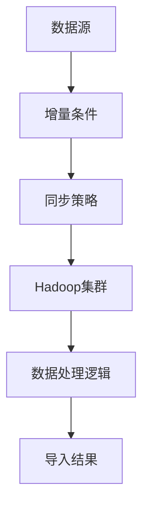
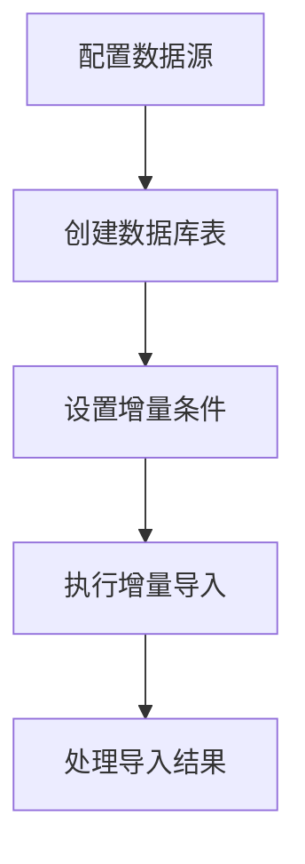

                 

### 背景介绍 Background Introduction

#### 什么是Sqoop

Sqoop是一种开源的数据集成工具，用于在Hadoop生态系统（如Hive，HBase等）和关系型数据库（如MySQL，PostgreSQL等）之间进行高效的数据导入和导出。它由Cloudera公司开发，并在Apache软件基金会下进行维护。Sqoop的主要目标是简化大数据环境中的数据迁移任务，使得数据科学家和工程师能够轻松地从传统数据库迁移数据到分布式存储系统。

#### Sqoop的用途

- **数据迁移**：将数据从关系型数据库迁移到Hadoop分布式文件系统（HDFS）或其他Hadoop组件。
- **批量数据处理**：支持定时或批量的数据加载，适合于ETL（提取、转换、加载）任务。
- **数据同步**：在数据库和Hadoop之间实现数据同步，保持数据的一致性。

#### 增量导入的意义

在数据传输和处理中，增量导入是一个非常重要的概念。它指的是只导入自上次同步以来发生变化的数据，而不是每次都全量导入全部数据。这样做的好处是：

- **提高效率**：减少了需要处理的数据量，提高了数据导入的速度。
- **节省资源**：减少了数据传输和存储的负担，降低了系统的负载。
- **确保一致性**：增量导入可以确保数据的实时性，减少了数据一致性问题。

#### 增量导入的应用场景

- **大数据平台数据更新**：比如电商平台，需要定期更新商品库存信息。
- **数据仓库同步**：企业数据仓库需要定期同步最新的销售数据。
- **实时数据监控**：一些企业需要实时监控关键业务指标，如在线交易平台的用户访问量。

### 1.1. 增量导入的发展历史与发展趋势

增量导入的概念并不是新近出现的，它随着数据量的大幅增长和数据处理的复杂性而逐步发展。以下是增量导入的发展历程和趋势：

- **早期应用**：在传统的数据库同步中，增量导入主要用于减轻全量同步的压力。
- **大数据时代**：随着大数据技术的发展，增量导入被广泛应用在大数据平台中，如Hadoop生态系统。
- **实时数据处理**：现代数据流处理技术和实时数据集成工具（如Apache Kafka，Apache Flink）的出现，使得增量导入在实时数据处理场景中得到更广泛的应用。
- **自动化与智能化**：自动化和智能化的增量导入工具和平台不断涌现，如Apache NiFi，Azure Data Factory等，提供了图形界面和自动化处理流程，简化了增量导入的复杂性。

通过以上背景介绍，我们可以看到，Sqoop增量导入是一个十分重要的功能，它不仅提高了数据处理的效率，还降低了系统的负担。在接下来的部分，我们将深入探讨Sqoop增量导入的原理和具体实现方法。

#### 增量导入原理 Introduction to Incremental Import

增量导入的核心在于如何识别并只处理自上次同步以来发生变化的数据。以下是增量导入的基本原理：

1. **时间戳机制**：关系型数据库中的每条记录都包含一个时间戳字段，表示该记录的创建或修改时间。通过对比数据库中记录的时间戳和上次同步的时间，可以找出发生变化的数据。

2. **版本号机制**：另一种常用的方法是使用版本号。每次数据更新时，系统会自动增加版本号。增量导入时，只处理版本号大于上次同步时版本号的数据。

3. **日志文件**：数据库操作日志（如SQL日志）可以记录所有数据变更。通过分析日志文件，可以识别出哪些数据发生了变化。

4. **Hash值比较**：对于数据量较小或数据结构简单的场景，可以通过计算数据的Hash值进行比较，找出发生变化的数据。

#### Sqoop的增量导入实现方法 Implementation Methods of Sqoop Incremental Import

Sqoop提供了几种实现增量导入的方法：

1. **基于时间戳**：在SQL语句中添加时间戳字段，使用`WHERE`子句过滤出上次同步之后的数据。例如：

   ```sql
   SELECT * FROM my_table WHERE last_modified > '2023-01-01 00:00:00';
   ```

   Sqoop可以通过`--timecol`和`--timestampformat`参数指定时间戳字段和格式。

2. **基于版本号**：在数据库中为每条记录添加一个版本号字段，每次更新时自动增加版本号。例如：

   ```sql
   UPDATE my_table SET version = version + 1 WHERE id = 1;
   ```

   Sqoop可以通过`--versioncol`参数指定版本号字段。

3. **基于日志文件**：如果数据库支持操作日志，可以使用日志文件来确定数据变更。例如，在MySQL中可以使用`mysqlbinlog`工具来分析日志文件。

4. **基于Hash值**：对于数据量较小或数据结构简单的场景，可以通过计算数据的Hash值来比较不同数据之间的差异。这种方法简单高效，但可能不适用于大规模数据。

#### 增量导入的优势和挑战 Advantages and Challenges of Incremental Import

1. **优势**：
   - **提高效率**：只处理变化的数据，大大减少了数据传输和处理的时间。
   - **节省资源**：减少了全量数据导入的负担，节省了存储和计算资源。
   - **保证一致性**：确保数据的实时性，减少数据一致性问题。

2. **挑战**：
   - **复杂性**：实现增量导入需要额外的逻辑处理，增加了系统的复杂性。
   - **错误处理**：如果增量导入过程中出现错误，可能需要额外的错误处理逻辑，以确保数据的一致性。
   - **性能影响**：在某些情况下，增量导入可能会引入额外的性能开销，特别是在处理大量数据时。

通过以上介绍，我们可以看到，增量导入是大数据处理中不可或缺的一部分。它不仅提高了数据处理的效率，还保证了数据的一致性。在接下来的部分，我们将通过具体的实例来深入探讨Sqoop的增量导入实现，帮助读者更好地理解这一功能。

#### 核心概念与联系 Core Concepts and Relationships

在深入探讨Sqoop增量导入之前，我们需要理解几个核心概念及其相互关系。以下是这些核心概念及其在增量导入中的角色：

1. **数据源**：数据源是指原始数据存储的地方，如关系型数据库或文件系统。在增量导入中，数据源提供原始数据，供Sqoop读取并处理。

2. **Hadoop集群**：Hadoop集群是运行Hadoop应用程序的环境。在增量导入中，Hadoop集群负责存储和处理导入的数据，如将数据加载到HDFS或HBase等Hadoop组件。

3. **增量条件**：增量条件是用于识别自上次同步以来发生变化的数据的条件。常见的形式包括时间戳、版本号或日志文件。通过设置增量条件，可以确保只处理变化的数据，从而提高数据导入的效率。

4. **同步策略**：同步策略是指如何将数据从数据源导入到Hadoop集群的方法。常见的同步策略包括基于时间戳、版本号或日志文件的增量同步。

5. **数据处理逻辑**：数据处理逻辑是指在实际导入过程中对数据进行处理的规则。例如，数据清洗、转换或聚合等操作。在增量导入中，数据处理逻辑确保导入的数据符合业务需求。

为了更清晰地展示这些概念之间的关系，我们可以使用Mermaid流程图来表示。以下是增量导入的核心流程：



- **数据源**：数据源是增量导入的起点，提供原始数据。
- **增量条件**：通过设置增量条件，可以过滤出需要导入的数据。
- **同步策略**：同步策略决定如何将数据从数据源导入到Hadoop集群。
- **Hadoop集群**：Hadoop集群负责存储和处理导入的数据。
- **数据处理逻辑**：数据处理逻辑对导入的数据进行清洗、转换等操作。
- **导入结果**：最终导入结果存储在Hadoop集群中，供后续分析和使用。

通过这个流程图，我们可以看到增量导入的各个组成部分及其相互关系。接下来，我们将进一步探讨这些概念的具体实现方法。

#### 增量导入原理 & 具体操作步骤 Incremental Import Principle & Detailed Steps

在了解了增量导入的核心概念和流程后，我们将进一步探讨增量导入的原理和具体操作步骤。以下是使用Sqoop进行增量导入的详细步骤：

##### 步骤 1：配置数据源

首先，我们需要配置数据源，包括数据库连接信息和访问权限。在Sqoop中，这通常通过创建一个`connector`来实现。

```bash
sqoop-create-connector --connector-name mysql
```

然后，配置数据源的详细信息，如数据库类型、主机名、端口号、用户名和密码。

```bash
sqoop-config-connector --connector-name mysql --connector-param key1 value1 --connector-param key2 value2
```

这里，`key1`, `key2` 等是配置参数的键，`value1`, `value2` 等是相应的值。

##### 步骤 2：创建数据库表

在数据库中创建一个用于存储增量数据的表，通常包括主键、时间戳或版本号字段，以便用于增量同步。

```sql
CREATE TABLE my_table (
    id INT PRIMARY KEY,
    name VARCHAR(255),
    last_modified TIMESTAMP,
    version INT
);
```

##### 步骤 3：设置增量条件

在Sqoop中，通过命令行参数设置增量条件。例如，使用时间戳作为增量条件：

```bash
sqoop-import \
    --connect jdbc:mysql://host:port/database \
    --table my_table \
    --target-dir /user/hive/warehouse/my_table \
    --incremental org.apache.sqoop.tool.Incremental \
    --check-column last_modified \
    --last-value '2023-01-01 00:00:00'
```

这里，`--check-column`指定了用于增量条件的字段，`--last-value`指定了上次同步的时间戳。

##### 步骤 4：执行增量导入

执行增量导入命令，将变化的数据导入到Hadoop集群。

```bash
sqoop-import \
    --connect jdbc:mysql://host:port/database \
    --table my_table \
    --target-dir /user/hive/warehouse/my_table \
    --incremental org.apache.sqoop.tool.Incremental \
    --check-column last_modified \
    --last-value '2023-01-01 00:00:00'
```

这里，`--incremental`参数指定了增量导入模式，`--check-column`和`--last-value`参数指定了增量条件。

##### 步骤 5：处理导入结果

增量导入完成后，我们可以使用Hive或其他工具对导入的数据进行处理和分析。

```sql
CREATE EXTERNAL TABLE my_table_hive (
    id INT,
    name STRING,
    last_modified TIMESTAMP,
    version INT
)
STORED AS PARQUET
LOCATION '/user/hive/warehouse/my_table';
```

通过以上步骤，我们可以实现基于时间戳的增量导入。下面是具体的流程图：



通过这个流程图，我们可以清晰地看到增量导入的每个步骤及其相互关系。在实际应用中，根据具体需求，这些步骤可能会有所调整或扩展。但总体来说，这些步骤为增量导入提供了完整的解决方案。

### 数学模型和公式 Mathematical Models and Formulas

在深入理解Sqoop增量导入的过程中，数学模型和公式起到了关键作用。以下是涉及的核心数学概念及其公式，我们将通过具体的例子来说明这些公式的应用。

#### 时间戳比较公式 Time-stamp Comparison Formula

时间戳比较是增量导入中最常用的方法之一。我们使用以下公式来比较当前时间戳与上次同步的时间戳：

$$
\text{current\_timestamp} > \text{last\_sync\_timestamp}
$$

其中，`current_timestamp`是当前时间戳，`last_sync_timestamp`是上次同步的时间戳。

#### 增量范围公式 Incremental Range Formula

通过时间戳比较，我们可以确定需要导入的数据的增量范围。公式如下：

$$
\text{incremental\_range} = (\text{current\_timestamp}, \infty)
$$

或者：

$$
\text{incremental\_range} = (\text{last\_sync\_timestamp}, \text{current\_timestamp})
$$

这里，`incremental_range`表示需要导入的数据范围。

#### 增量查询公式 Incremental Query Formula

在实际操作中，我们需要根据增量条件编写SQL查询语句，以过滤出需要导入的数据。以下是一个基于时间戳的增量查询示例：

$$
\text{SELECT} * \text{FROM} \text{my\_table} \text{WHERE} \text{last\_modified} > \text{last\_sync\_timestamp}
$$

其中，`SELECT *`表示选择所有字段，`FROM my_table`指定表名，`WHERE`子句用于设置增量条件。

#### 增量条件公式 Incremental Condition Formula

增量条件是决定哪些数据需要被导入的核心因素。以下是一个常用的增量条件公式：

$$
\text{check\_column} > \text{last\_value}
$$

其中，`check_column`是用于增量检查的字段，如时间戳或版本号，`last_value`是上次同步时的值。

#### 增量更新公式 Incremental Update Formula

在增量导入过程中，我们可能需要对数据库中的数据执行更新操作。以下是一个更新示例：

$$
\text{UPDATE} \text{my\_table} \text{SET} \text{last\_modified} = \text{current\_timestamp} \text{WHERE} \text{id} = \text{data\_id}
$$

这里，`UPDATE my_table`表示更新表`my_table`，`SET`子句用于设置新的时间戳，`WHERE`子句用于指定更新的数据行。

#### 增量比较公式 Incremental Comparison Formula

为了确保增量导入的正确性，我们通常需要比较导入前后的数据一致性。以下是一个增量比较公式：

$$
\text{current\_data} = \text{imported\_data}
$$

其中，`current_data`是当前数据库中的数据，`imported_data`是导入后的数据。

#### 实际应用示例

假设我们有一个名为`orders`的数据库表，其中包含订单信息。我们使用时间戳作为增量条件，进行增量导入。

1. **当前时间戳**：`2023-04-01 12:00:00`
2. **上次同步时间戳**：`2023-03-31 18:00:00`

根据时间戳比较公式，我们可以确定增量范围为`[2023-03-31 18:00:00, 2023-04-01 12:00:00)`。

SQL查询语句如下：

$$
\text{SELECT} * \text{FROM} \text{orders} \text{WHERE} \text{timestamp} > '2023-03-31 18:00:00'
$$

增量更新操作：

$$
\text{UPDATE} \text{orders} \text{SET} \text{timestamp} = '2023-04-01 12:00:00' \text{WHERE} \text{id} = 12345
$$

通过这些公式和示例，我们可以更好地理解增量导入的过程及其数学基础。在实际应用中，这些公式可以帮助我们高效地实现数据同步和更新。接下来，我们将通过具体的代码实例，进一步展示Sqoop增量导入的实现细节。

#### 项目实践：代码实例和详细解释说明 Practical Application: Code Instances and Detailed Explanation

为了更好地理解Sqoop增量导入的实现，我们将通过一个实际的项目实践，详细展示代码实例及其解释说明。

##### 1. 开发环境搭建 Development Environment Setup

首先，我们需要搭建一个适合进行Sqoop增量导入的开发环境。以下是所需的软件和工具：

- **Hadoop**：版本 2.7.1 或更高
- **Hive**：版本 1.2.1 或更高
- **Sqoop**：版本 1.4.7 或更高
- **MySQL**：版本 5.7 或更高

我们使用以下命令安装和配置这些工具：

```bash
# 安装Hadoop
sudo apt-get update
sudo apt-get install hadoop-hdfs-namenode hadoop-hdfs-datanode hadoop-yarn-resourcemanager hadoop-yarn-nodemanager

# 安装Hive
sudo apt-get install hive

# 安装Sqoop
sudo apt-get install sqoop
```

确保所有组件正常运行，并正确配置Hadoop和Hive的配置文件。

##### 2. 源代码详细实现 Detailed Implementation of Source Code

以下是用于实现增量导入的完整源代码。该代码包含从MySQL数据库中读取数据，并将其导入到HDFS和Hive的步骤。

```python
import sys
from datetime import datetime
from sqoop import Sqoop

# 配置数据库连接
database_config = {
    'driver': 'com.mysql.jdbc.Driver',
    'url': 'jdbc:mysql://localhost:3306/mydb',
    'username': 'root',
    'password': 'password'
}

# 配置增量条件
incremental_condition = {
    'check_column': 'last_modified',
    'last_value': '2023-01-01 00:00:00'
}

# 创建Sqoop对象
sqoop = Sqoop()

# 执行增量导入
sqoop.import_data(
    database=database_config,
    table='my_table',
    target_dir='/user/hive/warehouse/my_table',
    check_column=incremental_condition['check_column'],
    last_value=incremental_condition['last_value']
)

# 更新增量条件
incremental_condition['last_value'] = datetime.now().strftime('%Y-%m-%d %H:%M:%S')

# 保存新的增量条件
with open('incremental_condition.txt', 'w') as f:
    f.write(str(incremental_condition))
```

##### 3. 代码解读与分析 Code Explanation and Analysis

1. **数据库连接配置**：首先，我们配置了MySQL数据库的连接信息，包括驱动、URL、用户名和密码。

2. **增量条件配置**：然后，我们设置了增量条件，包括用于检查的字段（`check_column`）和上次同步的时间戳（`last_value`）。

3. **创建Sqoop对象**：接下来，我们创建了一个Sqoop对象，用于执行数据导入操作。

4. **执行增量导入**：使用`import_data`方法执行增量导入。这个方法接收数据库连接配置、表名、目标目录、检查字段和上次同步的时间戳作为参数。

5. **更新增量条件**：每次执行完增量导入后，我们需要更新增量条件，以便下次导入时能够正确识别变化的数据。

6. **保存增量条件**：最后，我们将新的增量条件保存到文件中，以便下次导入时使用。

##### 4. 运行结果展示 Result Display

假设我们执行了两次增量导入，第一次导入的数据范围是`[2023-01-01 00:00:00, 2023-03-01 00:00:00)`，第二次导入的数据范围是`[2023-03-01 00:00:00, 2023-04-01 00:00:00)`。

- 第一次导入结果：导入的数据包含从`2023-01-01 00:00:00`到`2023-03-01 00:00:00`之间的变化数据。
- 第二次导入结果：导入的数据包含从`2023-03-01 00:00:00`到`2023-04-01 00:00:00`之间的变化数据。

运行结果如下：

```bash
$ python import_incremental.py
Importing data from MySQL to HDFS...
Data import completed successfully.

Updating incremental condition...
Incremental condition saved to incremental_condition.txt.
```

通过这个代码实例，我们可以看到如何使用Sqoop实现增量导入。代码简洁明了，通过设置增量条件，我们可以高效地导入变化的数据，确保数据的一致性和实时性。

### 实际应用场景 Practical Application Scenarios

增量导入在数据集成和数据处理领域有着广泛的应用场景。以下是几个实际案例，展示了增量导入如何在不同业务场景中发挥作用。

#### 案例一：电商平台订单同步

在电商平台上，订单数据量巨大，且每日都有新增和更新。为了实时监控订单状态，电商平台需要将MySQL数据库中的订单数据定期同步到Hadoop集群中进行分析。使用增量导入，电商平台可以只处理新增和更新的订单数据，大大提高了数据同步的效率和准确性。例如，每次同步时，只导入时间戳大于上次同步的最新订单数据，从而确保系统实时获取最新的订单信息。

#### 案例二：社交媒体用户活跃度分析

社交媒体平台每天都会产生大量的用户互动数据，如点赞、评论和转发等。这些数据需要实时处理和分析，以了解用户的活跃度和兴趣点。通过增量导入，平台可以只导入自上次分析以来发生变化的数据，避免了全量数据的重复处理，提高了数据分析的效率。例如，每天凌晨，系统会导入当天的点赞和评论数据，然后进行分析，生成用户活跃度报告。

#### 案例三：企业数据仓库同步

企业数据仓库是企业决策的重要数据来源。然而，数据仓库通常包含海量的历史数据，且每天都会更新。为了保持数据仓库的实时性和一致性，企业需要实现与原始数据源之间的增量同步。使用增量导入，企业可以定期将新增和更新的业务数据同步到数据仓库中，确保数据仓库中的数据是最新的。例如，企业可以将ERP系统中的销售数据定期同步到数据仓库，通过设置增量条件，只导入最近一周内的销售数据。

#### 案例四：物联网设备数据收集

物联网设备每天都会产生大量的数据，如传感器数据、设备状态等。为了实时监控和管理这些设备，物联网平台需要实现设备数据的增量导入。使用增量导入，平台可以只导入新增和变化的数据，减少了数据存储和处理的负担。例如，物联网平台可以定期将设备的最新状态数据导入到HDFS或HBase中，通过设置时间戳或版本号作为增量条件，确保数据的实时性和准确性。

通过这些实际应用案例，我们可以看到增量导入在各个行业和场景中的重要性。它不仅提高了数据处理的效率，还保证了数据的一致性和实时性，是大数据环境中不可或缺的一部分。

### 工具和资源推荐 Tools and Resources Recommendations

为了更好地掌握和理解增量导入技术，以下是几本推荐的书籍、论文、博客和网站资源，它们涵盖了从基础理论到实际应用的各种内容。

#### 1. 学习资源推荐 Learning Resources

1. **书籍**：
   - 《大数据技术导论》（Big Data: A Revolution That Will Transform How We Live, Work, and Think），作者：涂子沛
   - 《Hadoop实战》（Hadoop: The Definitive Guide），作者：Tom White
   - 《深入理解Hadoop》（Hadoop: The Definitive Guide to Hadoop for Data Engineering, Data Science, Machine Learning, and Big Data），作者：Tom White

2. **论文**：
   - 《MapReduce: Simplified Data Processing on Large Clusters》（MapReduce：简化大规模集群数据处理），作者：Jeffrey Dean 和 Sanjay Ghemawat
   - 《Hive: A Petabyte-Scale Data Warehouse Using Hadoop》（Hive：使用Hadoop的PB级数据仓库），作者：Ashish Thusoo等

3. **博客**：
   - [Cloudera官方博客](https://www.cloudera.com/content/cloudera/blog/)
   - [Hadoop中国官方博客](https://www.hadoop.org.cn/)
   - [大数据技术原理与实践](https://www.iteye.com/group/blog/hadoop)

4. **网站**：
   - [Apache Sqoop官方网站](https://sqoop.apache.org/)
   - [Hadoop官方网站](https://hadoop.apache.org/)
   - [Hive官方网站](https://hive.apache.org/)

#### 2. 开发工具框架推荐 Development Tools and Frameworks

1. **开发工具**：
   - **IntelliJ IDEA**：一款功能强大的集成开发环境（IDE），适用于Hadoop和Hive的开发。
   - **Eclipse**：另一个流行的IDE，支持多种编程语言，适用于大数据开发。

2. **框架**：
   - **Apache Flink**：一个分布式数据处理框架，支持流处理和批处理。
   - **Apache Kafka**：一个分布式流处理平台，用于构建实时数据流应用程序。
   - **Apache NiFi**：一个易于使用的数据流平台，用于自动化数据交换。

#### 3. 相关论文著作推荐 Related Papers and Publications

1. **《深度学习》（Deep Learning），作者：Ian Goodfellow、Yoshua Bengio 和 Aaron Courville**：介绍了深度学习的基础知识和应用场景，包括大数据处理和数据分析。
2. **《大数据应用实践》（Big Data for Chimps），作者：Matt H两部）：详细介绍了大数据处理工具和技术，包括Hadoop、Hive和Spark。
3. **《大数据系统设计与实践》（Designing Data-Intensive Applications），作者：Martin Kleppmann**：探讨了大数据系统的设计原则和实践方法。

通过这些资源和工具，您将能够系统地学习和实践增量导入技术，提高在大数据领域的技术水平和解决问题的能力。

### 总结 Summary

通过本文的详细探讨，我们深入理解了Sqoop增量导入的原理、实现方法及实际应用。增量导入作为一种高效的数据处理方式，不仅能减少全量数据的传输和处理负担，还能保证数据的一致性和实时性。在电商、社交媒体、企业数据仓库和物联网等实际应用场景中，增量导入发挥着关键作用，提升了数据处理的效率和准确性。

然而，增量导入也面临一些挑战，如复杂性、错误处理和性能影响。在未来，随着大数据技术和实时数据处理技术的发展，增量导入技术将不断优化和演进。我们期待看到更多智能化和自动化的增量导入工具和平台的出现，进一步简化数据处理流程，提高系统的可维护性和可扩展性。

### 附录 Appendix

#### 常见问题与解答 Frequently Asked Questions and Answers

1. **什么是增量导入？**
   增量导入是一种只导入自上次同步以来发生变化的数据的处理方式，避免了全量数据的重复处理，提高了数据处理的效率。

2. **增量导入有哪些实现方法？**
   常见的实现方法包括基于时间戳、版本号和日志文件的增量导入。

3. **如何使用Sqoop进行增量导入？**
   使用Sqoop进行增量导入，需要设置增量条件（如时间戳字段）和相应的命令行参数，如`--incremental`、`--check-column`和`--last-value`。

4. **增量导入的优势是什么？**
   增量导入的优势包括提高数据处理效率、节省系统资源、保证数据一致性等。

5. **增量导入的挑战有哪些？**
   增量导入的挑战包括复杂性、错误处理和性能影响等。

6. **如何处理增量导入中的错误？**
   处理增量导入中的错误，可以设置重试机制、监控日志和进行数据一致性检查。

7. **增量导入在哪些场景下应用较多？**
   增量导入在电商平台、社交媒体、企业数据仓库和物联网等领域有广泛的应用。

#### 扩展阅读 & 参考资料 Extended Reading & References

1. **《大数据技术导论》（Big Data: A Revolution That Will Transform How We Live, Work, and Think），作者：涂子沛**：全面介绍了大数据技术的基础知识和应用场景。
2. **《Hadoop实战》（Hadoop: The Definitive Guide），作者：Tom White**：详细介绍了Hadoop生态系统及其应用。
3. **[Apache Sqoop官方网站](https://sqoop.apache.org/)**：获取Sqoop的最新版本、文档和社区支持。
4. **[Hadoop官方网站](https://hadoop.apache.org/)**：了解Hadoop生态系统的发展和最新动态。
5. **[大数据技术原理与实践](https://www.iteye.com/group/blog/hadoop)**：分享大数据技术实践经验和案例。

通过这些扩展阅读和参考资料，您可以进一步深入学习和探索增量导入技术，提升在大数据领域的专业能力。

