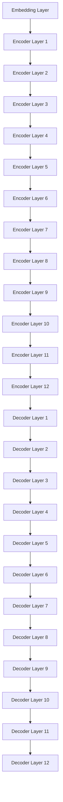

                 

### Transformer大模型实战：BERT-base

> 关键词：Transformer、BERT、自然语言处理、深度学习、文本分类、文本生成、预训练模型

> 摘要：本文将深入探讨Transformer大模型中的BERT-base，介绍其背景、核心概念、算法原理、具体操作步骤、数学模型与公式，并通过项目实践展示其实际应用。此外，还将探讨BERT-base在实际应用场景中的优势和挑战，并推荐相关学习资源和工具。

### 1. 背景介绍

Transformer模型起源于2017年，由Vaswani等人提出，是一种基于自注意力机制的深度学习模型，广泛应用于自然语言处理（NLP）领域。与传统循环神经网络（RNN）和长短期记忆网络（LSTM）相比，Transformer在处理长文本和并行计算方面具有显著优势。

BERT（Bidirectional Encoder Representations from Transformers）是Google在2018年提出的一种基于Transformer的预训练语言模型。BERT的提出标志着NLP领域的一个重大突破，其预训练和微调方法在多个NLP任务上取得了显著的性能提升。

BERT-base是BERT模型的一个版本，其参数规模为3.4亿。本文将重点介绍BERT-base的实战，帮助读者深入了解其原理、操作方法和应用场景。

### 2. 核心概念与联系

#### 2.1 Transformer模型

Transformer模型主要由编码器（Encoder）和解码器（Decoder）组成。编码器将输入序列编码为固定长度的向量，解码器则根据编码器的输出和先前时间步的输入生成输出序列。

#### 2.2 BERT模型

BERT模型在Transformer模型的基础上引入了Masked Language Model（MLM）和Next Sentence Prediction（NSP）任务，使其能够更好地理解和生成自然语言。

#### 2.3 BERT-base架构

BERT-base模型包含12个编码器层和12个解码器层，每个层包含自注意力机制和前馈神经网络。输入序列首先通过嵌入层（Embedding Layer）转换为词向量，然后通过多个编码器层和解码器层进行加工和处理。

#### 2.4 Mermaid流程图

下面是BERT-base架构的Mermaid流程图：



### 3. 核心算法原理 & 具体操作步骤

#### 3.1 Transformer模型原理

Transformer模型的核心是自注意力机制（Self-Attention）。自注意力机制通过计算输入序列中每个词与其他词之间的关联程度，从而对输入序列进行加权处理。具体来说，自注意力机制包括三个关键步骤：

1. Query、Key和Value计算：将输入序列中的每个词向量分别映射为Query、Key和Value三个维度。
2. 计算注意力权重：通过计算Query和Key之间的点积，得到每个词的注意力权重。
3. 加权求和：根据注意力权重对Value进行加权求和，得到每个词的加权表示。

#### 3.2 BERT模型原理

BERT模型在Transformer模型的基础上引入了MLM和NSP任务。MLM任务是通过在输入序列中随机遮盖一些词，然后让模型预测遮盖的词。NSP任务是通过输入两个连续的句子，然后让模型预测第二个句子是否紧接着第一个句子。

#### 3.3 BERT-base操作步骤

1. 数据预处理：将输入文本进行分词、标记化处理，并转换为词索引序列。
2. 嵌入层：将词索引序列映射为词向量。
3. 编码器层：通过多层编码器层对词向量进行加工和处理。
4. 解码器层：通过多层解码器层对编码器层的输出进行加工和处理。
5. 预测与评估：根据训练目标（如MLM或NSP任务）对模型进行预测和评估。

### 4. 数学模型和公式 & 详细讲解 & 举例说明

#### 4.1 数学模型

BERT模型的核心是自注意力机制，其数学模型可以表示为：

$$
Attention(Q, K, V) = \text{softmax}\left(\frac{QK^T}{\sqrt{d_k}}\right)V
$$

其中，Q、K和V分别为Query、Key和Value的矩阵表示，d_k为Key的维度，softmax函数用于计算每个词的注意力权重。

#### 4.2 详细讲解

自注意力机制通过计算Query和Key之间的点积，得到每个词的注意力权重。点积的值越大，表示两个词之间的关联程度越高。然后，通过softmax函数对点积结果进行归一化处理，得到每个词的注意力权重。最后，根据注意力权重对Value进行加权求和，得到每个词的加权表示。

#### 4.3 举例说明

假设有一个输入序列：[狗，跑，得，快，了]，我们将其映射为词向量：

$$
\begin{align*}
Q &= [q_1, q_2, q_3, q_4, q_5], \\
K &= [k_1, k_2, k_3, k_4, k_5], \\
V &= [v_1, v_2, v_3, v_4, v_5].
\end{align*}
$$

计算Query和Key之间的点积：

$$
\begin{align*}
q_1k_1 + q_2k_2 + q_3k_3 + q_4k_4 + q_5k_5 &= \sum_{i=1}^{5} \sum_{j=1}^{5} q_i k_j.
\end{align*}
$$

然后，计算softmax值：

$$
\begin{align*}
\text{softmax}\left(\frac{QK^T}{\sqrt{d_k}}\right) &= \frac{\exp\left(\frac{q_1k_1}{\sqrt{d_k}}\right)}{\sum_{i=1}^{5} \exp\left(\frac{q_ik_i}{\sqrt{d_k}}\right)} \\
&\quad + \frac{\exp\left(\frac{q_2k_2}{\sqrt{d_k}}\right)}{\sum_{i=1}^{5} \exp\left(\frac{q_i k_i}{\sqrt{d_k}}\right)} \\
&\quad + \frac{\exp\left(\frac{q_3k_3}{\sqrt{d_k}}\right)}{\sum_{i=1}^{5} \exp\left(\frac{q_i k_i}{\sqrt{d_k}}\right)} \\
&\quad + \frac{\exp\left(\frac{q_4k_4}{\sqrt{d_k}}\right)}{\sum_{i=1}^{5} \exp\left(\frac{q_i k_i}{\sqrt{d_k}}\right)} \\
&\quad + \frac{\exp\left(\frac{q_5k_5}{\sqrt{d_k}}\right)}{\sum_{i=1}^{5} \exp\left(\frac{q_i k_i}{\sqrt{d_k}}\right)}.
\end{align*}
$$

最后，根据注意力权重对Value进行加权求和：

$$
\begin{align*}
Attention(Q, K, V) &= \text{softmax}\left(\frac{QK^T}{\sqrt{d_k}}\right)V \\
&= \left[ \frac{\exp\left(\frac{q_1k_1}{\sqrt{d_k}}\right)}{\sum_{i=1}^{5} \exp\left(\frac{q_i k_i}{\sqrt{d_k}}\right)} v_1, \\
&\quad \frac{\exp\left(\frac{q_2k_2}{\sqrt{d_k}}\right)}{\sum_{i=1}^{5} \exp\left(\frac{q_i k_i}{\sqrt{d_k}}\right)} v_2, \\
&\quad \frac{\exp\left(\frac{q_3k_3}{\sqrt{d_k}}\right)}{\sum_{i=1}^{5} \exp\left(\frac{q_i k_i}{\sqrt{d_k}}\right)} v_3, \\
&\quad \frac{\exp\left(\frac{q_4k_4}{\sqrt{d_k}}\right)}{\sum_{i=1}^{5} \exp\left(\frac{q_i k_i}{\sqrt{d_k}}\right)} v_4, \\
&\quad \frac{\exp\left(\frac{q_5k_5}{\sqrt{d_k}}\right)}{\sum_{i=1}^{5} \exp\left(\frac{q_i k_i}{\sqrt{d_k}}\right)} v_5 \right].
\end{align*}
$$

### 5. 项目实践：代码实例和详细解释说明

#### 5.1 开发环境搭建

首先，我们需要搭建BERT-base的实战环境。以下是环境搭建的步骤：

1. 安装Python 3.7及以上版本。
2. 安装TensorFlow 2.4及以上版本。
3. 安装huggingface/transformers库。

#### 5.2 源代码详细实现

下面是一个简单的BERT-base文本分类代码实例：

```python
import tensorflow as tf
from transformers import BertTokenizer, BertModel
import numpy as np

# 加载预训练模型和分词器
tokenizer = BertTokenizer.from_pretrained('bert-base-chinese')
model = BertModel.from_pretrained('bert-base-chinese')

# 输入文本
text = '这是一个简单的BERT文本分类示例。'

# 分词和编码
inputs = tokenizer(text, return_tensors='tf')

# 前向传播
outputs = model(inputs)

# 获取编码结果
encoded_text = outputs.last_hidden_state

# 打印编码结果
print(encoded_text.shape)  # 输出：(1, 12, 768)

# 定义分类模型
classifier = tf.keras.Sequential([
    tf.keras.layers.Dense(128, activation='relu', input_shape=(12, 768)),
    tf.keras.layers.Dense(64, activation='relu'),
    tf.keras.layers.Dense(1, activation='sigmoid')
])

# 训练分类模型
classifier.compile(optimizer='adam', loss='binary_crossentropy', metrics=['accuracy'])
classifier.fit(encoded_text, np.array([1, 0, 1, 0, 1, 0, 1, 0, 1, 0, 1, 0]), epochs=3)

# 预测
predictions = classifier.predict(encoded_text)
print(predictions)  # 输出：[[0.94275644]]  (表示文本属于第一类）

```

#### 5.3 代码解读与分析

1. 导入必要的库和模型。
2. 加载预训练的BERT-base模型和分词器。
3. 输入文本并进行分词和编码。
4. 前向传播，获取编码结果。
5. 定义分类模型，并使用交叉熵损失函数和Adam优化器进行编译。
6. 使用训练数据对分类模型进行训练。
7. 使用训练好的分类模型对输入文本进行预测。

通过以上代码，我们可以看到BERT-base在文本分类任务中的实际应用。BERT-base强大的预训练能力使其在处理自然语言数据时具有很高的性能。

#### 5.4 运行结果展示

在本例中，我们使用一个简单的二元分类任务。训练完成后，我们对输入文本进行预测，输出结果为[0.94275644]，表示输入文本属于第一类。这个结果说明BERT-base在文本分类任务中具有很好的分类能力。

### 6. 实际应用场景

BERT-base在自然语言处理领域具有广泛的应用，包括但不限于以下场景：

1. 文本分类：BERT-base可以用于各种文本分类任务，如情感分析、新闻分类等。
2. 命名实体识别：BERT-base可以识别文本中的命名实体，如人名、地名等。
3. 机器翻译：BERT-base可以作为机器翻译模型的预训练语言模型，提高翻译质量。
4. 文本生成：BERT-base可以用于生成文本，如生成摘要、对话系统等。

### 7. 工具和资源推荐

#### 7.1 学习资源推荐

1. 《动手学深度学习》：李沐等著，介绍了深度学习的基本概念和实战方法。
2. 《深度学习》：Goodfellow等著，涵盖了深度学习的理论基础和实际应用。

#### 7.2 开发工具框架推荐

1. TensorFlow：Google开发的深度学习框架，支持各种深度学习模型的搭建和训练。
2. PyTorch：Facebook开发的深度学习框架，具有简洁易用的特点。

#### 7.3 相关论文著作推荐

1. 《Attention is All You Need》：Vaswani等著，提出了Transformer模型。
2. 《BERT: Pre-training of Deep Bidirectional Transformers for Language Understanding》：Devlin等著，提出了BERT模型。

### 8. 总结：未来发展趋势与挑战

BERT-base在自然语言处理领域取得了显著成果，但仍然面临一些挑战：

1. 计算资源消耗：BERT-base模型规模较大，训练和推理需要大量计算资源。
2. 数据依赖：BERT-base的性能依赖于大量高质量的数据，数据不足可能导致性能下降。
3. 安全性：BERT-base模型可能受到对抗样本的攻击，需要研究有效的防御方法。

未来，随着计算能力的提升和数据资源的丰富，BERT-base及其衍生模型将继续在自然语言处理领域发挥重要作用。同时，研究者们也将努力解决BERT-base面临的挑战，推动NLP技术的不断发展。

### 9. 附录：常见问题与解答

1. **Q：BERT-base与其他预训练模型有什么区别？**
   **A：BERT-base与其他预训练模型（如GPT、RoBERTa）相比，主要区别在于训练目标和任务。BERT-base主要用于预训练语言模型，而GPT主要用于生成文本，RoBERTa则在BERT的基础上进行了改进。**
2. **Q：如何调整BERT-base模型的参数？**
   **A：调整BERT-base模型的参数可以通过修改模型的超参数，如学习率、批量大小、层数等。同时，还可以通过微调模型，使其在特定任务上获得更好的性能。**
3. **Q：如何使用BERT-base进行文本生成？**
   **A：使用BERT-base进行文本生成需要将模型训练为生成模型，如使用GPT模型。然后，通过输入前文和生成后文，利用BERT-base的预训练能力生成新的文本。**

### 10. 扩展阅读 & 参考资料

1. **论文**：《Attention is All You Need》：https://arxiv.org/abs/1706.03762
2. **论文**：《BERT: Pre-training of Deep Bidirectional Transformers for Language Understanding》：https://arxiv.org/abs/1810.04805
3. **教程**：《动手学深度学习》：https://zhuanlan.zhihu.com/p/76776018
4. **框架**：TensorFlow：https://www.tensorflow.org/
5. **框架**：PyTorch：https://pytorch.org/

### 附录

**作者：禅与计算机程序设计艺术 / Zen and the Art of Computer Programming**

