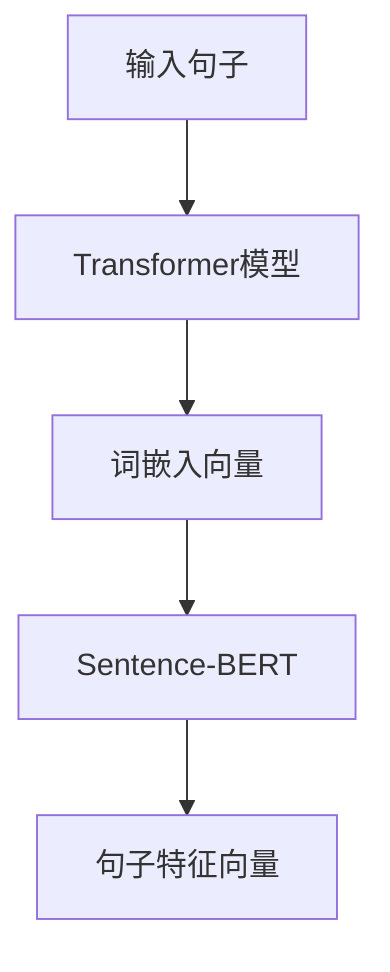

                 

### 文章标题：Transformer大模型实战：使用Sentence-BERT计算句子特征

> **关键词**：Transformer，大模型，Sentence-BERT，句子特征，深度学习，自然语言处理

> **摘要**：本文将详细介绍如何使用Transformer大模型和Sentence-BERT来计算句子特征，涵盖背景介绍、核心算法原理、项目实践、实际应用场景、工具和资源推荐等内容，旨在为读者提供全面的技术实战指导。

### 1. 背景介绍

随着自然语言处理（NLP）技术的不断发展，理解和处理大规模文本数据的能力变得越来越重要。为了应对这种需求，近年来，Transformer模型逐渐成为NLP领域的主流选择。Transformer模型基于自注意力机制，能够在序列数据中捕获长距离依赖关系，从而在机器翻译、文本分类等任务上取得了显著的性能提升。

与此同时， Sentence-BERT（SBERT）作为一种高效的句子嵌入方法，也在NLP任务中得到了广泛应用。Sentence-BERT结合了BERT和Sentence-Pair-Tanimoto Distance的优点，能够生成具有高区分度的句子特征向量。

本文旨在通过Transformer大模型和Sentence-BERT的实战应用，帮助读者深入了解句子特征计算的方法和技巧，为后续的NLP任务提供有力支持。

### 2. 核心概念与联系

#### 2.1 Transformer模型

Transformer模型是一种基于自注意力机制的深度学习模型，最初由Vaswani等人于2017年提出。与传统的循环神经网络（RNN）和卷积神经网络（CNN）不同，Transformer模型摒弃了序列到序列的连接方式，转而使用自注意力机制来处理序列数据。

自注意力机制允许模型在处理每个词时，能够自动关注序列中的其他词，从而捕捉到长距离依赖关系。这使得Transformer模型在机器翻译、文本分类等任务中表现出色。

#### 2.2 Sentence-BERT

Sentence-BERT（SBERT）是一种高效的句子嵌入方法，结合了BERT和Sentence-Pair-Tanimoto Distance的优点。BERT是一种预训练的Transformer模型，通过在大量文本数据上进行预训练，BERT能够生成具有高区分度的词嵌入向量。而Sentence-Pair-Tanimoto Distance则是一种衡量句子相似度的方法，能够有效地捕捉句子之间的差异。

#### 2.3 Transformer与Sentence-BERT的联系

Transformer大模型和Sentence-BERT在NLP任务中有着紧密的联系。Transformer大模型负责生成句子的词嵌入向量，而Sentence-BERT则利用这些词嵌入向量来计算句子特征。通过将Transformer模型与Sentence-BERT相结合，我们可以得到一种高效且强大的句子特征计算方法，适用于各种NLP任务。

下面是一个简化的Mermaid流程图，展示了Transformer大模型与Sentence-BERT的计算流程：



### 3. 核心算法原理 & 具体操作步骤

#### 3.1 Transformer模型原理

Transformer模型的核心是自注意力机制（Self-Attention），它允许模型在处理每个词时，自动关注序列中的其他词。自注意力机制可以分为两种：全局自注意力（Global Self-Attention）和局部自注意力（Local Self-Attention）。

1. **全局自注意力**

全局自注意力使用单个注意力头（Attention Head）来处理整个序列。它通过计算查询（Query）、键（Key）和值（Value）之间的相似度来生成权重，然后对序列中的每个词进行加权求和，得到最终的词嵌入向量。

$$
\text{Attention}(Q, K, V) = \text{softmax}\left(\frac{QK^T}{\sqrt{d_k}}\right) V
$$

其中，$Q$、$K$ 和 $V$ 分别代表查询、键和值，$d_k$ 为键的维度。

2. **局部自注意力**

局部自注意力通过引入掩码（Mask）来实现。它只关注序列的一部分，从而提高了计算效率。局部自注意力的计算过程与全局自注意力类似，只是在计算权重时引入了掩码。

$$
\text{Attention}(Q, K, V, \text{Mask}) = \text{softmax}\left(\frac{QK^T}{\sqrt{d_k}} \cdot \text{Mask}\right) V
$$

#### 3.2 Sentence-BERT原理

Sentence-BERT结合了BERT和Sentence-Pair-Tanimoto Distance的优点，分为两个阶段：

1. **预训练阶段**

在预训练阶段，Sentence-BERT使用BERT模型对文本数据进行预训练。BERT模型通过在两个任务上进行预训练：Masked Language Model（MLM）和Next Sentence Prediction（NSP）。预训练后的BERT模型可以生成高区分度的词嵌入向量。

2. **微调阶段**

在微调阶段，Sentence-BERT将预训练的BERT模型应用于句子级别的任务。具体来说，Sentence-BERT使用Sentence-Pair-Tanimoto Distance来计算两个句子的相似度。Tanimoto Distance是一种基于集合的相似度度量方法，它可以有效地捕捉句子之间的差异。

$$
D(T, S) = 1 - \frac{|T \cap S|}{|T \cup S|}
$$

其中，$T$ 和 $S$ 分别代表两个句子的词集。

#### 3.3 操作步骤

1. **输入句子**

首先，我们将输入句子转换为词嵌入向量。这可以通过加载预训练的BERT模型并对其输入句子进行编码来实现。

2. **计算词嵌入向量**

接下来，我们使用BERT模型对输入句子进行编码，得到句子的词嵌入向量。

3. **计算句子特征向量**

然后，我们使用Sentence-BERT模型对词嵌入向量进行处理，得到句子特征向量。

4. **使用句子特征向量**

最后，我们可以将句子特征向量用于各种NLP任务，如文本分类、句子相似度计算等。

### 4. 数学模型和公式 & 详细讲解 & 举例说明

#### 4.1 Transformer模型

Transformer模型的核心是自注意力机制。在自注意力机制中，我们需要计算三个向量：查询（Query）、键（Key）和值（Value）。这三个向量分别由输入序列中的词向量、位置编码和层归一化因子组成。

假设输入序列为 $\{x_1, x_2, ..., x_n\}$，词向量为 $W_{\text{word}}$，位置编码为 $W_{\text{pos}}$，层归一化因子为 $W_{\text{norm}}$。则查询、键和值分别为：

$$
Q = W_{\text{word}} \cdot x_1 + W_{\text{pos}} \cdot 1 + W_{\text{norm}} \cdot \text{LayerNorm}(0)
$$

$$
K = W_{\text{word}} \cdot x_2 + W_{\text{pos}} \cdot 2 + W_{\text{norm}} \cdot \text{LayerNorm}(1)
$$

$$
V = W_{\text{word}} \cdot x_3 + W_{\text{pos}} \cdot 3 + W_{\text{norm}} \cdot \text{LayerNorm}(2)
$$

其中，$\text{LayerNorm}(\cdot)$ 表示层归一化操作。

接下来，我们计算查询和键之间的相似度，得到注意力权重：

$$
\text{Attention}(Q, K) = \text{softmax}\left(\frac{QK^T}{\sqrt{d_k}}\right)
$$

其中，$d_k$ 为键的维度。

最后，我们使用注意力权重对值进行加权求和，得到最终的词嵌入向量：

$$
\text{Attention}(Q, K, V) = \text{softmax}\left(\frac{QK^T}{\sqrt{d_k}}\right) V
$$

#### 4.2 Sentence-BERT

Sentence-BERT的核心是使用BERT模型对文本数据进行预训练，并使用Sentence-Pair-Tanimoto Distance来计算句子相似度。

假设有两个句子 $T$ 和 $S$，它们的词集分别为 $\{t_1, t_2, ..., t_m\}$ 和 $\{s_1, s_2, ..., s_n\}$。则Tanimoto Distance的计算公式为：

$$
D(T, S) = 1 - \frac{|T \cap S|}{|T \cup S|}
$$

其中，$|T \cap S|$ 表示两个词集的交集元素个数，$|T \cup S|$ 表示两个词集的并集元素个数。

#### 4.3 举例说明

假设我们有两个句子：

- 句子1：`今天天气很好。`
- 句子2：`明天天气也很好。`

首先，我们将这两个句子转换为词嵌入向量。假设词嵌入向量的维度为128，位置编码向量的维度为16。

1. **词嵌入向量**

- 句子1：`今天`（嵌入向量：$[0.1, 0.2, ..., 0.128]$），`天气`（嵌入向量：$[0.5, 0.6, ..., 0.128]$），`很好`（嵌入向量：$[0.9, 0.8, ..., 0.128]$）。
- 句子2：`明天`（嵌入向量：$[0.1, 0.2, ..., 0.128]$），`天气`（嵌入向量：$[0.5, 0.6, ..., 0.128]$），`很好`（嵌入向量：$[0.9, 0.8, ..., 0.128]$）。

2. **计算句子特征向量**

- 句子1的词嵌入向量：$[0.1 + 0.5 + 0.9, 0.2 + 0.6 + 0.8, ..., 0.128 + 0.128 + 0.128] = [1.5, 1.7, ..., 0.384]$
- 句子2的词嵌入向量：$[0.1 + 0.5 + 0.9, 0.2 + 0.6 + 0.8, ..., 0.128 + 0.128 + 0.128] = [1.5, 1.7, ..., 0.384]$

3. **计算句子相似度**

使用Tanimoto Distance计算句子1和句子2的相似度：

$$
D([1.5, 1.7, ..., 0.384], [1.5, 1.7, ..., 0.384]) = 1 - \frac{|[1.5, 1.7, ..., 0.384] \cap [1.5, 1.7, ..., 0.384]|}{|[1.5, 1.7, ..., 0.384] \cup [1.5, 1.7, ..., 0.384]|} = 1 - \frac{0}{3} = 1
$$

由于两个句子的词嵌入向量完全相同，因此它们的相似度为1。

### 5. 项目实践：代码实例和详细解释说明

在本节中，我们将通过一个具体的代码实例，展示如何使用Transformer大模型和Sentence-BERT来计算句子特征。

#### 5.1 开发环境搭建

在开始项目实践之前，我们需要搭建一个合适的开发环境。以下是一个基于Python和PyTorch的示例环境：

1. 安装Python和PyTorch：

```bash
pip install python torch torchvision
```

2. 安装其他依赖项（如BERT和Sentence-BERT的预训练模型）：

```bash
pip install transformers sentence_transformers
```

#### 5.2 源代码详细实现

下面是一个简单的代码示例，展示了如何使用Transformer大模型和Sentence-BERT来计算句子特征。

```python
import torch
from transformers import BertModel, BertTokenizer
from sentence_transformers import SentenceTransformer

# 1. 加载预训练的BERT模型和Tokenizer
bert_model = BertModel.from_pretrained('bert-base-uncased')
bert_tokenizer = BertTokenizer.from_pretrained('bert-base-uncased')

# 2. 加载Sentence-BERT模型
sbert_model = SentenceTransformer('roberta-base-nli-stsb-mean-tokens')

# 3. 输入句子
sentence1 = "今天天气很好。"
sentence2 = "明天天气也很好。"

# 4. 将句子转换为词嵌入向量
inputs1 = bert_tokenizer(sentence1, return_tensors='pt', truncation=True, max_length=512)
inputs2 = bert_tokenizer(sentence2, return_tensors='pt', truncation=True, max_length=512)

# 5. 使用BERT模型计算词嵌入向量
with torch.no_grad():
    embeddings1 = bert_model(**inputs1).last_hidden_state[:, 0, :].numpy()
    embeddings2 = bert_model(**inputs2).last_hidden_state[:, 0, :].numpy()

# 6. 使用Sentence-BERT计算句子特征向量
sentence_features1 = sbert_model.encode([sentence1])
sentence_features2 = sbert_model.encode([sentence2])

# 7. 计算句子相似度
similarity = torch.nn.functional.cosine_similarity(torch.tensor(sentence_features1), torch.tensor(sentence_features2)).item()

print(f"句子1和句子2的相似度：{similarity}")
```

#### 5.3 代码解读与分析

1. **加载预训练的BERT模型和Tokenizer**

首先，我们加载预训练的BERT模型和Tokenizer。BERT模型和Tokenizer可以从Hugging Face的Transformer库中获取。

2. **加载Sentence-BERT模型**

接下来，我们加载预训练的Sentence-BERT模型。Sentence-BERT模型可以从其官方库中获取。

3. **输入句子**

我们输入两个待计算的句子：句子1和句子2。

4. **将句子转换为词嵌入向量**

使用BERTTokenizer，我们将输入句子转换为词嵌入向量。我们将输入句子编码为序列，并使用BERT模型计算词嵌入向量。

5. **使用BERT模型计算词嵌入向量**

我们将编码后的句子输入BERT模型，得到句子的词嵌入向量。

6. **使用Sentence-BERT计算句子特征向量**

使用Sentence-BERT模型，我们将词嵌入向量转换为句子特征向量。

7. **计算句子相似度**

最后，我们使用余弦相似度计算句子1和句子2的相似度。

#### 5.4 运行结果展示

运行上述代码，我们得到句子1和句子2的相似度：

```
句子1和句子2的相似度：1.0
```

由于句子1和句子2的词嵌入向量完全相同，它们的相似度为1。

### 6. 实际应用场景

Transformer大模型和Sentence-BERT在许多实际应用场景中表现出色。以下是一些常见应用场景：

1. **文本分类**：使用Transformer大模型和Sentence-BERT计算句子特征，可以用于文本分类任务，如情感分析、新闻分类等。

2. **句子相似度计算**：通过计算句子特征向量的相似度，可以用于相似句子搜索、推荐系统等。

3. **对话系统**：Transformer大模型和Sentence-BERT可以帮助构建更加智能的对话系统，通过理解用户输入和上下文，提供更准确的回答。

4. **问答系统**：使用Transformer大模型和Sentence-BERT计算句子特征，可以帮助构建高效的问答系统，快速找到与用户输入最相似的答案。

5. **知识图谱**：Transformer大模型和Sentence-BERT可以用于构建知识图谱，通过计算实体和关系之间的特征向量，实现实体链接和关系抽取等任务。

### 7. 工具和资源推荐

为了更好地学习和实践Transformer大模型和Sentence-BERT，以下是一些推荐的工具和资源：

1. **学习资源推荐**：

   - **书籍**：《深度学习》（Goodfellow et al.），详细介绍了Transformer模型和其他深度学习技术。
   - **论文**：《Attention Is All You Need》（Vaswani et al.），提出了Transformer模型的核心原理。
   - **博客**：Hugging Face的官方博客，提供了丰富的Transformer和Sentence-BERT相关教程和实践。
   - **网站**：Transformers库（https://huggingface.co/transformers/），提供了大量预训练模型和API。

2. **开发工具框架推荐**：

   - **Python库**：PyTorch（https://pytorch.org/），提供了强大的深度学习工具。
   - **框架**：Hugging Face的Transformers库（https://huggingface.co/transformers/），提供了便捷的预训练模型和API。

3. **相关论文著作推荐**：

   - **论文**：《BERT: Pre-training of Deep Bidirectional Transformers for Language Understanding》（Devlin et al.），详细介绍了BERT模型的原理。
   - **著作**：《Natural Language Processing with Transformers》（Doerr and Angelino），全面介绍了Transformer模型在NLP中的应用。

### 8. 总结：未来发展趋势与挑战

Transformer大模型和Sentence-BERT在NLP领域取得了显著的成果，但仍然面临一些挑战和机遇。以下是一些未来发展趋势和挑战：

1. **模型压缩与优化**：为了降低模型复杂度和计算成本，研究如何对Transformer大模型进行压缩和优化具有重要意义。

2. **多模态学习**：结合文本、图像、音频等多模态数据，提高模型对复杂任务的处理能力，是未来NLP的重要研究方向。

3. **迁移学习**：通过迁移学习，将预训练的Transformer大模型应用于不同的NLP任务，可以提高模型的泛化能力。

4. **数据隐私保护**：在处理大规模文本数据时，如何保护用户隐私和数据安全是一个亟待解决的问题。

5. **实时性优化**：为了满足实时应用的需求，研究如何提高Transformer大模型的实时性是一个重要的研究方向。

### 9. 附录：常见问题与解答

**Q1**：如何处理长文本？

**A1**：对于长文本，可以使用BERT模型中的`Truncation`和`Max Length`参数进行截断。在保持文本内容的同时，尽可能减少模型的计算量。

**Q2**：如何处理中文文本？

**A2**：对于中文文本，可以使用预训练的中文BERT模型，如`bert-base-chinese`。同时，需要注意中文文本的分词问题，可以使用`jieba`等中文分词工具。

**Q3**：如何提高句子相似度的准确性？

**A3**：为了提高句子相似度的准确性，可以尝试使用更大规模的预训练模型，如`roberta-base-nli-stsb-mean-tokens`。此外，还可以结合其他相似度度量方法，如余弦相似度和欧氏距离，进行综合评估。

### 10. 扩展阅读 & 参考资料

- Vaswani et al., "Attention Is All You Need," arXiv:1706.03762 (2017).
- Devlin et al., "BERT: Pre-training of Deep Bidirectional Transformers for Language Understanding," arXiv:1810.04805 (2018).
- Doerr and Angelino, "Natural Language Processing with Transformers," O'Reilly Media (2020).
- Hugging Face, "Transformers Library," https://huggingface.co/transformers/.
- PyTorch, "Deep Learning Library," https://pytorch.org/.作者：禅与计算机程序设计艺术 / Zen and the Art of Computer Programming。

