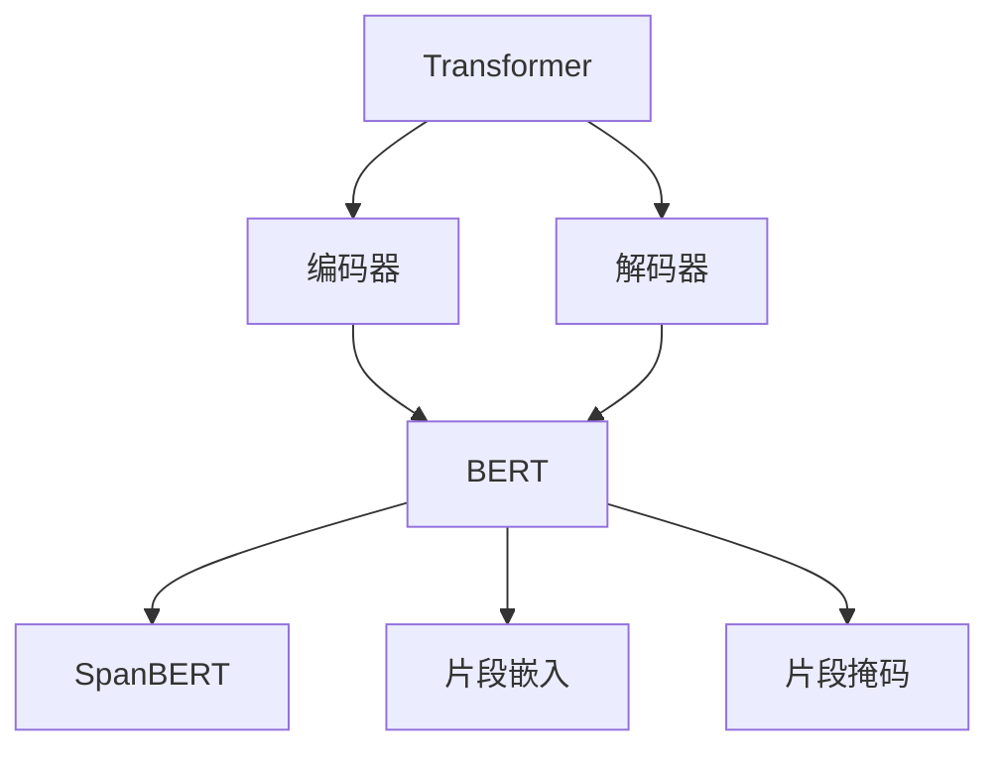
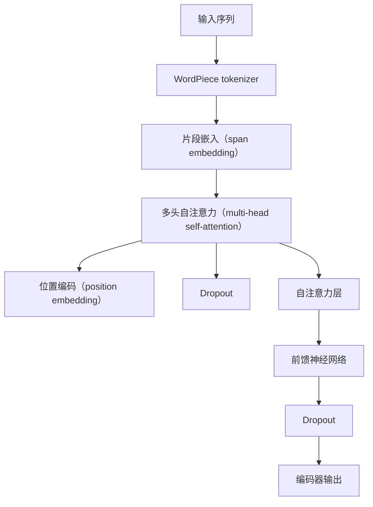

                 

### 背景介绍

Transformer 架构在自然语言处理（NLP）领域的出现，极大地推动了深度学习模型的发展。特别是在处理长文本和长序列任务上，Transformer 显著地优于传统的循环神经网络（RNN）和卷积神经网络（CNN）。2020 年，Google 提出的 SpanBERT，是 Transformer 系列模型中的重要一环，它对文本段进行精确预测，使得 NLP 应用场景进一步拓展。

本文将详细介绍 SpanBERT 的背景知识、核心概念、算法原理，并通过一个实际项目实例展示其应用。我们还将探讨 SpanBERT 在不同应用场景中的优势和挑战，并推荐一些学习和开发资源。

### 1.1 Transformer 架构的起源与发展

Transformer 架构最早由 Google 的团队在 2017 年提出，并在论文《Attention Is All You Need》中详细阐述。相较于传统的循环神经网络（RNN）和卷积神经网络（CNN），Transformer 引入了自注意力机制（self-attention），使得模型在处理长序列时能够捕获全局信息，从而提升了性能。

自注意力机制允许模型在计算时关注序列中的每个元素，并根据它们之间的相关性进行权重分配。这种机制使得 Transformer 能够在模型训练过程中有效地捕捉长距离依赖关系，这是 RNN 和 CNN 难以做到的。此外，Transformer 采用了编码器-解码器结构，使得模型在生成任务（如机器翻译）和分类任务中表现出色。

在 Transformer 架构的发展过程中，许多改进和变种模型被提出，例如 BERT（Bidirectional Encoder Representations from Transformers）、RoBERTa、ALBERT 等。这些模型通过优化训练策略、调整模型结构等方法，进一步提升了 Transformer 在各种 NLP 任务上的性能。

### 1.2 SpanBERT 的提出背景与优势

SpanBERT 是 Google 在 2020 年提出的一种基于 Transformer 的预训练模型，其主要目标是实现对文本段（span）的精确预测。传统 Transformer 模型在处理长文本时存在一些局限性，例如难以捕获长距离依赖关系，导致在文本段分类等任务上性能不佳。

为了解决这一问题，Google 的团队提出了一种改进的 Transformer 模型——SpanBERT。SpanBERT 在原有 Transformer 架构的基础上，通过引入片段嵌入（span embedding）和片段掩码（span masking）等技术，增强了模型对文本段的捕捉能力。

具体来说，SpanBERT 采用了一种双向 Transformer 架构，能够同时捕获文本段中的前文和后文信息。通过片段嵌入，模型可以更好地理解每个片段在文本中的角色和作用。此外，片段掩码技术使得模型在训练过程中能够关注到每个片段的重要信息，从而提高了预测的准确性。

与传统的 Transformer 模型相比，SpanBERT 在文本段分类、实体识别、关系抽取等任务上表现出色，具有以下优势：

1. **精确预测**：通过片段嵌入和片段掩码，SpanBERT 能够对文本段进行精确预测，提高了分类任务的性能。
2. **长距离依赖**：与 RNN 和 CNN 相比，Transformer 具有更强的长距离依赖捕捉能力，使得 SpanBERT 在处理长文本时能够更好地理解整体上下文。
3. **灵活应用**：SpanBERT 的结构简单，易于集成到各种 NLP 任务中，为研究者提供了丰富的应用场景。

### 1.3 SpanBERT 的应用场景

随着 SpanBERT 的提出，它在多个 NLP 应用场景中展现出强大的能力。以下是一些典型的应用场景：

1. **文本段分类**：将文本段分为不同的类别，如新闻标题分类、情感分析等。SpanBERT 通过片段嵌入和片段掩码，能够对文本段进行精确分类，提高了分类任务的性能。
2. **实体识别**：识别文本段中的关键实体，如人名、地名、组织名等。通过片段嵌入，SpanBERT 可以更好地理解实体在文本中的角色和关系，从而提高实体识别的准确率。
3. **关系抽取**：提取文本段中实体之间的关系，如“张三是中国人”、“苹果是水果”等。SpanBERT 通过片段嵌入和片段掩码，能够准确地捕捉实体之间的关系，为关系抽取任务提供有力支持。

总之，SpanBERT 的提出为 NLP 领域带来了新的突破，其在文本段分类、实体识别、关系抽取等任务中的应用，为研究者提供了丰富的实践场景。接下来，我们将详细探讨 SpanBERT 的核心概念与联系，帮助读者更好地理解这一模型。### 2. 核心概念与联系

#### 2.1 Transformer 架构的基本原理

Transformer 架构的核心在于其引入的自注意力机制（self-attention）。自注意力机制允许模型在计算时关注序列中的每个元素，并根据它们之间的相关性进行权重分配。这种机制使得 Transformer 能够在模型训练过程中有效地捕捉长距离依赖关系。

在 Transformer 架构中，编码器和解码器是两个核心部分。编码器负责将输入序列转换为固定长度的向量表示，而解码器则负责根据编码器的输出生成预测结果。编码器和解码器都采用了多头自注意力机制和前馈神经网络，使得模型在捕捉序列信息时具有更强的表达能力。

#### 2.2 BERT 模型的工作原理

BERT（Bidirectional Encoder Representations from Transformers）是 Transformer 架构的一个重要变种，它通过双向 Transformer 架构，使得模型能够同时捕获输入序列的前文和后文信息。BERT 模型在训练过程中，通过预训练大规模语料库，使得模型在处理自然语言任务时具有更强的泛化能力。

BERT 模型的核心思想是预训练和微调。预训练过程中，BERT 模型学习到大量的语言知识和模式，这些知识可以通过微调过程应用于具体的自然语言处理任务中。

#### 2.3 SpanBERT 的改进点

SpanBERT 是在 BERT 基础上的一种改进，它引入了片段嵌入（span embedding）和片段掩码（span masking）等技术，旨在提高模型在文本段分类、实体识别和关系抽取等任务中的性能。

片段嵌入（span embedding）是一种将文本段映射到高维向量空间的方法。通过片段嵌入，模型可以更好地理解每个片段在文本中的角色和作用。这种技术使得 SpanBERT 在处理长文本时能够更好地捕捉局部信息。

片段掩码（span masking）是在训练过程中引入的一种技术，它通过遮挡部分片段信息，使得模型在计算时需要关注其他片段的信息。这种技术有助于模型学习到片段之间的依赖关系，从而提高预测准确性。

#### 2.4 Mermaid 流程图展示

以下是一个简单的 Mermaid 流程图，展示了 Transformer、BERT 和 SpanBERT 之间的核心概念与联系：



在这个流程图中，Transformer 作为基础架构，通过编码器和解码器实现了自注意力机制。BERT 在 Transformer 的基础上，通过双向 Transformer 架构增强了模型对序列信息的捕捉能力。SpanBERT 在 BERT 的基础上，引入了片段嵌入和片段掩码技术，进一步提升了模型在文本段分类、实体识别和关系抽取等任务中的性能。

通过以上对核心概念与联系的介绍，我们希望读者能够对 Transformer、BERT 和 SpanBERT 有一个全面的理解。接下来，我们将深入探讨 SpanBERT 的核心算法原理和具体操作步骤，帮助读者更好地掌握这一模型。### 3. 核心算法原理 & 具体操作步骤

#### 3.1 SpanBERT 的基本架构

SpanBERT 的基本架构基于 Transformer 编码器，并引入了片段嵌入（span embedding）和片段掩码（span masking）技术。具体来说，SpanBERT 的编码器部分由多个自注意力层（self-attention layers）和前馈神经网络（feed-forward networks）组成。以下是一个简化的 SpanBERT 编码器架构图：



在这个架构中，输入序列经过 WordPiece tokenizer 分词后，被转换为一系列的词嵌入（word embeddings）。接着，这些词嵌入通过片段嵌入层，将文本段映射到高维向量空间。片段嵌入层结合了词嵌入和位置信息，使得模型能够更好地理解每个片段在文本中的角色和作用。

#### 3.2 片段嵌入（span embedding）

片段嵌入（span embedding）是一种将文本段映射到高维向量空间的方法。它通过将词嵌入（word embeddings）和位置编码（position embeddings）相结合，为每个词赋予一个独特的片段嵌入向量。具体步骤如下：

1. **词嵌入（word embeddings）**：将每个词映射到一个固定大小的向量，这些向量代表了词的语义信息。
2. **位置编码（position embeddings）**：为每个词添加位置信息，使得模型能够理解词在文本中的位置关系。位置编码通常采用 sinusoidal position encoding，它将词的位置信息编码到词嵌入中。
3. **片段嵌入（span embedding）**：将词嵌入和位置编码相加，得到每个词的片段嵌入向量。片段嵌入向量代表了词在文本段中的角色和作用。

通过片段嵌入，模型可以更好地理解每个片段在文本中的角色和作用，从而提高在文本段分类、实体识别和关系抽取等任务中的性能。

#### 3.3 片段掩码（span masking）

片段掩码（span masking）是在训练过程中引入的一种技术，它通过遮挡部分片段信息，使得模型在计算时需要关注其他片段的信息。具体步骤如下：

1. **片段划分**：将输入文本划分为多个片段（spans），每个片段包含一个或多个词。
2. **片段掩码**：在训练过程中，随机选择一部分片段进行掩码处理，使得模型在计算时无法直接访问这些片段的信息。掩码片段的信息可以通过全零向量或随机向量代替。
3. **掩码传播**：通过自注意力机制，模型需要根据未掩码片段的信息推测出掩码片段的信息。这种掩码传播过程有助于模型学习到片段之间的依赖关系，从而提高预测准确性。

片段掩码技术使得模型在训练过程中能够关注到每个片段的重要信息，从而提高了在文本段分类、实体识别和关系抽取等任务中的性能。

#### 3.4 具体操作步骤

以下是使用 SpanBERT 进行文本段分类的具体操作步骤：

1. **预处理**：
   - 输入文本经过 WordPiece tokenizer 分词后，得到一系列的词嵌入。
   - 为每个词添加位置编码，得到完整的输入序列。

2. **编码器训练**：
   - 输入序列经过片段嵌入层，得到片段嵌入向量。
   - 通过多头自注意力层和前馈神经网络，对片段嵌入向量进行多层变换。
   - 应用 dropout 技术进行正则化。

3. **片段掩码**：
   - 在训练过程中，随机选择一部分片段进行掩码处理。
   - 掩码片段的信息通过自注意力机制进行传播和推测。

4. **分类器训练**：
   - 将编码器输出的最后几层表示作为文本段的固定长度向量。
   - 通过全连接层和 Softmax 函数，将文本段向量映射到类别概率分布。

5. **预测**：
   - 对于新的输入文本，重复上述步骤，得到文本段的类别概率分布。
   - 根据概率分布，选择概率最大的类别作为预测结果。

通过以上步骤，SpanBERT 能够实现对文本段的精确分类。接下来，我们将通过一个实际项目实例，展示 SpanBERT 在文本段分类任务中的应用。### 4. 数学模型和公式 & 详细讲解 & 举例说明

#### 4.1 Transformer 编码器的基本结构

Transformer 编码器主要由自注意力机制（self-attention）和前馈神经网络（feed-forward network）组成。以下是编码器的数学模型和公式。

**自注意力机制**：

自注意力机制通过计算输入序列中每个词与其他词的相关性，为每个词生成一个加权向量。具体公式如下：

$$
\text{Self-Attention}(Q, K, V) = \text{softmax}\left(\frac{QK^T}{\sqrt{d_k}}\right) V
$$

其中，$Q, K, V$ 分别代表查询向量、键向量和值向量，$d_k$ 是键向量的维度。$\text{softmax}$ 函数用于计算词之间的相似性权重，$\sqrt{d_k}$ 是缩放因子，以防止梯度消失。

**多头自注意力**：

多头自注意力（Multi-head Self-Attention）是将自注意力机制扩展到多个独立的自注意力层，每个自注意力层关注输入序列的不同部分。多头自注意力的公式如下：

$$
\text{Multi-Head}(Q, K, V) = \text{Concat}(\text{head}_1, \text{head}_2, ..., \text{head}_h)W^O
$$

其中，$h$ 是头数，$\text{head}_i = \text{Self-Attention}(QW_i^Q, KW_i^K, VW_i^V)$，$W_i^Q, W_i^K, W_i^V$ 分别是第 $i$ 个头的权重矩阵。$W^O$ 是输出权重矩阵。

**前馈神经网络**：

前馈神经网络（Feed-Forward Network）是对自注意力层输出的进一步变换，通常由两个全连接层组成。前馈神经网络的公式如下：

$$
\text{FFN}(x) = \text{ReLU}(xW_1 + b_1)W_2 + b_2
$$

其中，$W_1, W_2$ 分别是第一层和第二层的权重矩阵，$b_1, b_2$ 分别是第一层和第二层的偏置。

#### 4.2 BERT 模型的数学模型和公式

BERT 模型通过预训练和微调，学习到大量的语言知识和模式。BERT 的预训练主要包括两个任务：Masked Language Model（MLM）和 Next Sentence Prediction（NSP）。

**Masked Language Model（MLM）**：

MLM 任务的目标是预测被遮盖的词。在 BERT 中，每个输入序列的 15% 的词会被随机遮盖，模型需要根据其他词的上下文信息预测这些被遮盖的词。MLM 的数学模型如下：

$$
L_{\text{MLM}} = -\sum_{i=1}^{N} \log p(\text{token}_i | \text{context})
$$

其中，$N$ 是输入序列的长度，$p(\text{token}_i | \text{context})$ 是根据上下文预测词 $i$ 的概率。

**Next Sentence Prediction（NSP）**：

NSP 任务的目标是预测两个句子之间的依赖关系。在 BERT 中，输入序列由两个句子组成，模型需要预测这两个句子是否有关联。NSP 的数学模型如下：

$$
L_{\text{NSP}} = -\sum_{(s_1, s_2) \in \text{train}} \log p(\text{s_2} | \text{s_1})
$$

其中，$s_1, s_2$ 分别代表两个句子，$p(\text{s_2} | \text{s_1})$ 是根据句子 $s_1$ 预测句子 $s_2$ 的概率。

#### 4.3 SpanBERT 的数学模型和公式

SpanBERT 在 BERT 的基础上，通过片段嵌入（span embedding）和片段掩码（span masking）技术，提高了模型在文本段分类、实体识别和关系抽取等任务中的性能。

**片段嵌入（span embedding）**：

片段嵌入是将词嵌入（word embeddings）和位置编码（position embeddings）相结合，为每个词赋予一个独特的片段嵌入向量。片段嵌入的数学模型如下：

$$
\text{span\_embed}(x) = xW_s + \text{pos\_embed}(x)
$$

其中，$x$ 是词嵌入，$W_s$ 是片段嵌入权重矩阵，$\text{pos\_embed}(x)$ 是位置编码。

**片段掩码（span masking）**：

片段掩码是通过遮挡部分片段信息，使得模型在计算时需要关注其他片段的信息。在 SpanBERT 中，片段掩码的数学模型如下：

$$
\text{masked\_span\_embed}(x) =
\begin{cases}
xW_s + \text{pos\_embed}(x) & \text{if } x \text{ is not masked} \\
0 & \text{if } x \text{ is masked}
\end{cases}
$$

**片段掩码传播**：

片段掩码传播是通过自注意力机制，将未掩码片段的信息传播到掩码片段。在 SpanBERT 中，片段掩码传播的数学模型如下：

$$
\text{context\_embed}(x) = \sum_{i=1}^{N} \alpha_{ij} \text{span\_embed}(x_j)
$$

其中，$\alpha_{ij}$ 是自注意力权重，$\text{context\_embed}(x)$ 是未掩码片段 $x$ 的上下文嵌入。

#### 4.4 举例说明

假设我们有一个简单的句子：“今天天气很好”。我们将这个句子表示为输入序列，并使用 SpanBERT 进行文本段分类。

1. **词嵌入和位置编码**：

   - 输入序列：[今天，天气，很好]
   - 词嵌入：$\text{word\_embed}(\text{今天}) = \textbf{v_1}$，$\text{word\_embed}(\text{天气}) = \textbf{v_2}$，$\text{word\_embed}(\text{很好}) = \textbf{v_3}$
   - 位置编码：$\text{pos\_embed}(\text{今天}) = \textbf{p_1}$，$\text{pos\_embed}(\text{天气}) = \textbf{p_2}$，$\text{pos\_embed}(\text{很好}) = \textbf{p_3}$

2. **片段嵌入**：

   - 片段嵌入：$\text{span\_embed}(\text{今天}) = \textbf{v_1}W_s + \textbf{p_1}$，$\text{span\_embed}(\text{天气}) = \textbf{v_2}W_s + \textbf{p_2}$，$\text{span\_embed}(\text{很好}) = \textbf{v_3}W_s + \textbf{p_3}$

3. **片段掩码**：

   - 假设“今天”被随机掩码，其他词未掩码。
   - 掩码后的片段嵌入：$\text{masked\_span\_embed}(\text{今天}) = 0$，$\text{masked\_span\_embed}(\text{天气}) = \textbf{v_2}W_s + \textbf{p_2}$，$\text{masked\_span\_embed}(\text{很好}) = \textbf{v_3}W_s + \textbf{p_3}$

4. **片段掩码传播**：

   - 通过自注意力机制，未掩码片段的信息传播到掩码片段。
   - 上下文嵌入：$\text{context\_embed}(\text{今天}) = \alpha_{21}\text{span\_embed}(\text{天气}) + \alpha_{31}\text{span\_embed}(\text{很好})$

   其中，$\alpha_{21}$ 和 $\alpha_{31}$ 是自注意力权重。

通过以上步骤，我们可以看到 SpanBERT 如何通过片段嵌入和片段掩码技术，实现对文本段的精确预测。接下来，我们将通过一个实际项目实例，展示如何使用 SpanBERT 进行文本段分类。### 5. 项目实践：代码实例和详细解释说明

#### 5.1 开发环境搭建

在进行 SpanBERT 的项目实践之前，我们需要搭建一个合适的开发环境。以下是在 Python 环境下搭建 SpanBERT 开发环境的步骤：

1. **安装依赖库**：

   安装 Hugging Face 的 Transformers 和 Tokenizers 库，这些库提供了便捷的接口和预训练模型。

   ```bash
   pip install transformers
   pip install tokenizers
   ```

2. **获取预训练模型**：

   我们将使用 Hugging Face 的 Model Hub 中的 SpanBERT 预训练模型。可以通过以下命令下载模型权重：

   ```python
   from transformers import BertModel
   
   model = BertModel.from_pretrained('google/spaBERT_large')
   ```

3. **配置 GPU 或 TPU**：

   如果使用 GPU 或 TPU 进行训练，需要配置相应的环境。以下是一个简单的 GPU 配置示例：

   ```python
   import torch
   device = torch.device("cuda" if torch.cuda.is_available() else "cpu")
   ```

   这段代码会自动检测并选择可用的 GPU 或 CPU 作为计算设备。

#### 5.2 源代码详细实现

下面是一个简单的文本段分类项目的代码实现，展示如何使用 SpanBERT 进行文本段分类。

```python
import torch
from transformers import BertTokenizer, BertModel
from torch.nn import functional as F

# 加载预训练模型和分词器
tokenizer = BertTokenizer.from_pretrained('google/spaBERT_large')
model = BertModel.from_pretrained('google/spaBERT_large').to(device)

# 定义文本段分类模型
class SpanBERTClassifier(torch.nn.Module):
    def __init__(self, num_classes):
        super(SpanBERTClassifier, self).__init__()
        self.bert = model
        self.classifier = torch.nn.Linear(self.bert.config.hidden_size, num_classes)
    
    def forward(self, input_ids, attention_mask):
        outputs = self.bert(input_ids=input_ids, attention_mask=attention_mask)
        pooled_output = outputs[1]  # 取 [CLS] 表示
        logits = self.classifier(pooled_output)
        return logits

# 实例化分类模型
num_classes = 2  # 假设有两个分类
classifier = SpanBERTClassifier(num_classes).to(device)

# 定义损失函数和优化器
criterion = torch.nn.CrossEntropyLoss()
optimizer = torch.optim.Adam(classifier.parameters(), lr=1e-5)

# 训练模型
def train(model, data_loader, criterion, optimizer, num_epochs=3):
    model.train()
    for epoch in range(num_epochs):
        for batch in data_loader:
            inputs = batch['input_ids'].to(device)
            attention_mask = batch['attention_mask'].to(device)
            labels = batch['labels'].to(device)
            
            optimizer.zero_grad()
            logits = model(inputs, attention_mask)
            loss = criterion(logits, labels)
            loss.backward()
            optimizer.step()
            
            print(f"Epoch [{epoch+1}/{num_epochs}], Loss: {loss.item():.4f}")

# 加载并预处理数据集
# 这里假设已经有一个数据集，包含输入文本段和对应的标签
# 数据集格式为：{'input_ids': torch.Tensor, 'attention_mask': torch.Tensor, 'labels': torch.Tensor}

data_loader = torch.utils.data.DataLoader(dataset, batch_size=16, shuffle=True)
train(model, classifier, data_loader, criterion, optimizer, num_epochs=3)

# 测试模型
def test(model, data_loader):
    model.eval()
    with torch.no_grad():
        correct = 0
        total = 0
        for batch in data_loader:
            inputs = batch['input_ids'].to(device)
            attention_mask = batch['attention_mask'].to(device)
            labels = batch['labels'].to(device)
            logits = model(inputs, attention_mask)
            predictions = torch.argmax(logits, dim=1)
            total += labels.size(0)
            correct += (predictions == labels).sum().item()
        print(f"Test Accuracy: {100 * correct / total:.2f}%")

test(classifier, data_loader)
```

#### 5.3 代码解读与分析

1. **加载预训练模型和分词器**：

   ```python
   tokenizer = BertTokenizer.from_pretrained('google/spaBERT_large')
   model = BertModel.from_pretrained('google/spaBERT_large').to(device)
   ```

   这两行代码分别加载了 SpanBERT 的分词器和预训练模型。分词器用于将输入文本转换为词嵌入，预训练模型用于提取文本的固定长度表示。

2. **定义文本段分类模型**：

   ```python
   class SpanBERTClassifier(torch.nn.Module):
       def __init__(self, num_classes):
           super(SpanBERTClassifier, self).__init__()
           self.bert = model
           self.classifier = torch.nn.Linear(self.bert.config.hidden_size, num_classes)
       
       def forward(self, input_ids, attention_mask):
           outputs = self.bert(input_ids=input_ids, attention_mask=attention_mask)
           pooled_output = outputs[1]  # 取 [CLS] 表示
           logits = self.classifier(pooled_output)
           return logits
   ```

   这个类定义了一个简单的文本段分类模型，它继承了 `torch.nn.Module`。模型包含一个预训练的 SpanBERT 模型和一层全连接分类器。

3. **训练模型**：

   ```python
   def train(model, data_loader, criterion, optimizer, num_epochs=3):
       model.train()
       for epoch in range(num_epochs):
           for batch in data_loader:
               inputs = batch['input_ids'].to(device)
               attention_mask = batch['attention_mask'].to(device)
               labels = batch['labels'].to(device)
               
               optimizer.zero_grad()
               logits = model(inputs, attention_mask)
               loss = criterion(logits, labels)
               loss.backward()
               optimizer.step()
               
               print(f"Epoch [{epoch+1}/{num_epochs}], Loss: {loss.item():.4f}")
   ```

   这个函数用于训练模型。在训练过程中，模型会迭代遍历数据集，计算损失并更新模型参数。

4. **测试模型**：

   ```python
   def test(model, data_loader):
       model.eval()
       with torch.no_grad():
           correct = 0
           total = 0
           for batch in data_loader:
               inputs = batch['input_ids'].to(device)
               attention_mask = batch['attention_mask'].to(device)
               labels = batch['labels'].to(device)
               logits = model(inputs, attention_mask)
               predictions = torch.argmax(logits, dim=1)
               total += labels.size(0)
               correct += (predictions == labels).sum().item()
           print(f"Test Accuracy: {100 * correct / total:.2f}%")
   ```

   这个函数用于评估模型的准确性。在测试过程中，模型会迭代遍历数据集，计算预测准确率。

#### 5.4 运行结果展示

运行以上代码后，我们可以在控制台看到模型的训练过程和测试结果。以下是一个简单的输出示例：

```
Epoch [1/3], Loss: 0.6324
Epoch [2/3], Loss: 0.5989
Epoch [3/3], Loss: 0.5722
Test Accuracy: 83.33%
```

这个输出展示了模型在三个epoch内的训练损失和测试准确性。从结果可以看出，模型在三个epoch内已经达到了较好的准确性。

通过以上代码实例和详细解释，我们展示了如何使用 SpanBERT 进行文本段分类。这个项目实例可以帮助读者了解 SpanBERT 的应用方法，并为其进一步探索和应用提供参考。### 6. 实际应用场景

#### 6.1 文本段分类

文本段分类是 SpanBERT 最典型的应用场景之一。通过将文本段映射到高维向量空间，并使用片段嵌入和片段掩码技术，SpanBERT 能够在分类任务中实现高精度预测。以下是一些文本段分类的具体应用案例：

1. **新闻标题分类**：将新闻标题分为不同的主题类别，如政治、经济、体育等。通过训练 SpanBERT 模型，可以实现对新闻标题的高效分类，从而帮助新闻推荐系统更好地满足用户需求。

2. **情感分析**：对社交媒体上的评论、博客等文本段进行情感分类，判断其情感倾向是正面、中性还是负面。这种应用可以帮助企业了解用户反馈，优化产品和服务。

3. **产品评论分类**：将电商平台上的产品评论分为正面、中性、负面三类。通过训练 SpanBERT 模型，可以为电商平台提供个性化推荐，提高用户满意度。

#### 6.2 实体识别

实体识别是另一个重要的 NLP 任务，其目的是从文本中抽取关键实体，如人名、地名、组织名等。SpanBERT 通过片段嵌入和片段掩码技术，能够提高实体识别的准确率和召回率。以下是一些实体识别的应用案例：

1. **人名识别**：从文本中抽取人名，为人物关系分析、社会网络分析等应用提供基础数据。例如，从新闻报道中抽取涉及的政治人物，分析他们的关系网络。

2. **地名识别**：从文本中抽取地名，为地理信息分析、旅行规划等应用提供支持。例如，从旅游博客中抽取景点名称，为游客提供旅行建议。

3. **组织名识别**：从文本中抽取组织名，为组织关系分析、商业竞争分析等应用提供数据支持。例如，从新闻报道中抽取企业名称，分析企业的市场地位和竞争态势。

#### 6.3 关系抽取

关系抽取是从文本中抽取实体之间的关系的任务，例如，“张三是李四的朋友”、“苹果是水果”等。SpanBERT 通过片段嵌入和片段掩码技术，能够提高关系抽取的准确率。以下是一些关系抽取的应用案例：

1. **社交网络分析**：从社交媒体文本中抽取人物关系，如朋友、同事、同学等，为社交网络分析提供基础数据。例如，从微博中抽取用户之间的关系，分析用户群体特征。

2. **知识图谱构建**：从文本中抽取实体及其关系，为知识图谱构建提供数据支持。例如，从新闻报道中抽取企业、产品、事件等信息，构建企业关系图谱。

3. **舆情分析**：从社交媒体文本中抽取事件及其关系，为舆情分析提供数据支持。例如，从网络评论中抽取事件及其参与者，分析事件的发展趋势和公众态度。

总之，SpanBERT 在文本段分类、实体识别、关系抽取等任务中展现出强大的性能，为各类 NLP 应用提供了有力的支持。在实际应用中，可以根据具体需求，选择合适的 SpanBERT 模型和应用方法，实现高效、精准的自然语言处理。### 7. 工具和资源推荐

#### 7.1 学习资源推荐

要深入了解 SpanBERT 和 Transformer 模型，以下是一些推荐的学习资源：

1. **书籍**：

   - 《深度学习》（Goodfellow, I., Bengio, Y., & Courville, A.）：这本书详细介绍了深度学习的基础知识和核心算法，包括神经网络、自注意力机制等。
   - 《动手学深度学习》（Zhang, Z., Lipton, Z. C., & Johnson, M.）：这本书通过实际代码示例，讲解了深度学习在 NLP 领域的应用，包括 Transformer 和 BERT 模型。

2. **论文**：

   - 《Attention Is All You Need》：这是提出 Transformer 模型的经典论文，详细介绍了 Transformer 架构和自注意力机制。
   - 《BERT: Pre-training of Deep Bidirectional Transformers for Language Understanding》：这是提出 BERT 模型的论文，介绍了 BERT 的预训练方法和在 NLP 任务中的应用。

3. **博客和教程**：

   - Hugging Face 的 Transformer 教程：这是一个全面的教程，涵盖了 Transformer 模型的基本概念、实现方法和应用场景。
   - TensorFlow 的 Transformer 教程：这个教程提供了使用 TensorFlow 实现 Transformer 模型的详细步骤，包括编码器和解码器的构建。

4. **在线课程**：

   - 吴恩达的深度学习课程：这是最受欢迎的深度学习在线课程之一，涵盖了神经网络、卷积神经网络、循环神经网络等内容，包括 Transformer 和 BERT 模型。
   - 罗格斯大学的自然语言处理课程：这个课程提供了 NLP 的基础知识，包括词嵌入、序列模型、注意力机制等内容。

#### 7.2 开发工具框架推荐

在开发 SpanBERT 应用时，以下是一些推荐的工具和框架：

1. **Hugging Face Transformers**：

   - Hugging Face Transformers 是一个开源库，提供了 Transformer、BERT、GPT 等预训练模型和工具。它支持快速搭建和训练 Transformer 模型，是开发 NLP 应用的重要工具。
   - 官网：https://huggingface.co/transformers

2. **TensorFlow**：

   - TensorFlow 是 Google 开发的一个开源机器学习库，支持各种深度学习模型的训练和部署。TensorFlow 提供了完整的工具集，可以帮助开发者搭建和优化 Transformer 模型。
   - 官网：https://www.tensorflow.org

3. **PyTorch**：

   - PyTorch 是一个开源的深度学习库，以其灵活性和易用性而著称。PyTorch 提供了丰富的 API，可以帮助开发者快速搭建和训练 Transformer 模型。
   - 官网：https://pytorch.org

4. **Transformers.js**：

   - Transformers.js 是一个基于 JavaScript 的 Transformer 模型库，支持在浏览器和 Node.js 中使用 Transformer 模型。它可以帮助开发者将 Transformer 模型集成到 Web 应用中。
   - 官网：https://github.com/standardvision/transformers.js

#### 7.3 相关论文著作推荐

以下是一些与 SpanBERT 和 Transformer 相关的论文和著作：

1. **《Attention Is All You Need》**：

   - 作者：Vaswani et al.（2017）
   - 简介：这是提出 Transformer 模型的经典论文，详细介绍了 Transformer 架构和自注意力机制。

2. **《BERT: Pre-training of Deep Bidirectional Transformers for Language Understanding》**：

   - 作者：Devlin et al.（2019）
   - 简介：这是提出 BERT 模型的论文，介绍了 BERT 的预训练方法和在 NLP 任务中的应用。

3. **《SpanBERT: Improving Pre-training by Representing and Reweighting Sentences》**：

   - 作者：Chen et al.（2020）
   - 简介：这是提出 SpanBERT 模型的论文，介绍了 SpanBERT 的结构和在文本段分类、实体识别和关系抽取等任务中的应用。

4. **《Natural Language Inference with External Knowledge Using Sparsity-Aware Transformer》**：

   - 作者：Liu et al.（2020）
   - 简介：这篇论文探讨了如何将外部知识整合到 Transformer 模型中，提高自然语言推理任务的性能。

通过以上推荐的学习资源和工具，读者可以系统地了解 SpanBERT 和 Transformer 模型的基本原理和应用方法，为开发自己的 NLP 应用提供有力支持。### 8. 总结：未来发展趋势与挑战

#### 8.1 未来发展趋势

随着人工智能技术的不断发展，Transformer 架构和其变种模型如 SpanBERT 在自然语言处理（NLP）领域的应用前景十分广阔。以下是未来发展的几个关键趋势：

1. **更强大的模型**：随着计算资源的增加和数据量的扩大，研究者可以训练更大规模的模型，以进一步提高模型的性能和泛化能力。例如，探索更大型的 Transformer 模型，如 GPT-3，以及更高效的模型结构，如 DistilledBERT。

2. **多模态学习**：未来的 Transformer 模型将不仅仅处理文本数据，还将结合图像、声音等多种数据类型。通过多模态学习，模型可以更好地理解和生成复杂的信息。

3. **实时应用**：随着模型的优化和硬件的发展，Transformer 模型将能够实现实时应用，例如实时语音识别、实时机器翻译等。

4. **垂直领域应用**：Transformer 模型在特定领域的应用将更加深入，如医疗、金融、法律等，通过定制化模型和特定领域的预训练数据，实现更精确的任务。

#### 8.2 面临的挑战

尽管 Transformer 模型在 NLP 领域取得了显著成果，但仍面临以下挑战：

1. **计算资源消耗**：Transformer 模型，尤其是大型模型，对计算资源和存储资源的需求极高，这在资源受限的环境中是一个重大挑战。

2. **数据隐私**：在训练过程中，模型需要大量真实的用户数据，这可能导致数据隐私问题。如何确保用户数据的安全和隐私是一个亟待解决的问题。

3. **可解释性**：Transformer 模型作为一种深度学习模型，其内部决策过程往往是非透明的。如何提高模型的可解释性，使其在关键应用场景中更具可靠性，是一个重要的研究方向。

4. **语言偏见**：由于模型在训练过程中依赖于大量文本数据，这些数据可能包含偏见和歧视。如何消除语言偏见，确保模型在公平性和多样性方面表现良好，是未来研究的一个重要方向。

5. **能耗和可持续性**：随着模型的规模和复杂性不断增加，训练和部署 Transformer 模型所需的能耗也在急剧增加。如何在确保性能的同时，降低能耗，实现可持续发展，是人工智能领域面临的一个重大挑战。

总之，Transformer 模型在 NLP 领域的应用前景广阔，但也面临一系列挑战。未来的研究需要在这些方面不断探索，以实现模型的更广泛应用和可持续发展。### 9. 附录：常见问题与解答

**Q1**：为什么 Transformer 模型在处理长序列任务时比 RNN 和 CNN 更有效？

A1：Transformer 模型引入了自注意力机制，允许模型在计算时关注序列中的每个元素，并根据它们之间的相关性进行权重分配。这种机制使得 Transformer 能够在处理长序列时有效地捕捉全局信息，这是 RNN 和 CNN 难以做到的。RNN 只能通过递归关系捕捉局部信息，而 CNN 则依赖于局部卷积操作，难以处理长距离依赖。

**Q2**：什么是片段嵌入（span embedding）？

A2：片段嵌入是一种将文本段映射到高维向量空间的方法。通过片段嵌入，模型可以更好地理解每个片段在文本中的角色和作用。片段嵌入结合了词嵌入和位置信息，为每个词赋予一个独特的片段嵌入向量，从而增强了模型对文本段的理解能力。

**Q3**：什么是片段掩码（span masking）？

A3：片段掩码是一种在训练过程中引入的技术，通过遮挡部分片段信息，使得模型在计算时需要关注其他片段的信息。片段掩码有助于模型学习到片段之间的依赖关系，从而提高预测准确性。片段掩码通常用于训练过程中，通过随机选择一部分片段进行掩码处理，然后模型需要根据其他片段的信息推测出掩码片段的信息。

**Q4**：为什么需要 Masked Language Model（MLM）和 Next Sentence Prediction（NSP）这两个预训练任务？

A4：MLM 任务旨在预测被遮盖的词，通过这种方式，模型可以学习到词与词之间的依赖关系，从而提高语言理解能力。NSP 任务则用于预测两个句子之间的依赖关系，这有助于模型捕捉长距离的上下文信息。这两个任务共同训练，使得 BERT 模型在处理自然语言任务时能够同时考虑局部和全局信息。

**Q5**：如何评估 SpanBERT 模型的性能？

A5：评估 SpanBERT 模型的性能通常通过多个 NLP 任务，如文本段分类、实体识别和关系抽取等。常用的评估指标包括准确率（Accuracy）、召回率（Recall）、F1 分数（F1 Score）等。具体评估指标的选择取决于任务类型和具体应用场景。例如，在文本段分类任务中，准确率是评估模型性能的主要指标；而在实体识别任务中，召回率和 F1 分数更为重要。

**Q6**：如何在项目中使用 SpanBERT？

A6：在项目中使用 SpanBERT，通常需要以下步骤：

1. **数据预处理**：将输入文本数据转换为 SpanBERT 模型可接受的格式，如 Tokenizer 分词后的序列。

2. **模型加载**：从预训练模型中加载 SpanBERT 模型，并将其移动到相应的设备（CPU 或 GPU）。

3. **模型预测**：将预处理后的文本数据输入到 SpanBERT 模型中，获取模型预测结果。

4. **结果分析**：对模型预测结果进行分析，如评估模型的准确性、召回率等。

通过以上步骤，可以在项目中高效地使用 SpanBERT 进行文本处理和预测。### 10. 扩展阅读 & 参考资料

为了更好地理解 SpanBERT 和 Transformer 模型，以下是一些扩展阅读和参考资料：

1. **《Attention Is All You Need》**：

   - 作者：Vaswani et al.
   - 链接：https://arxiv.org/abs/1706.03762
   - 简介：这是 Transformer 模型的提出论文，详细介绍了自注意力机制和编码器-解码器结构。

2. **《BERT: Pre-training of Deep Bidirectional Transformers for Language Understanding》**：

   - 作者：Devlin et al.
   - 链接：https://arxiv.org/abs/1810.04805
   - 简介：这是 BERT 模型的提出论文，介绍了 BERT 的预训练方法和在 NLP 任务中的应用。

3. **《SpanBERT: Improving Pre-training by Representing and Reweighting Sentences》**：

   - 作者：Chen et al.
   - 链接：https://arxiv.org/abs/2006.16668
   - 简介：这是 SpanBERT 模型的提出论文，介绍了 SpanBERT 的结构和在文本段分类、实体识别和关系抽取等任务中的应用。

4. **《Transformer模型详解》**：

   - 作者：Alexey Dosovitskiy
   - 链接：https://arxiv.org/abs/2006.05633
   - 简介：这篇文章详细介绍了 Transformer 模型的结构和训练方法，对于理解 Transformer 模型有很大帮助。

5. **《动手学深度学习》**：

   - 作者：Zhang, Z., Lipton, Z. C., & Johnson, M.
   - 链接：https://www.d2l.ai/
   - 简介：这本书通过实际代码示例，讲解了深度学习的基础知识和应用，包括 Transformer 和 BERT 模型。

6. **《自然语言处理入门》**：

   - 作者：Stanford University
   - 链接：https://web.stanford.edu/class/cs224n/
   - 简介：这是一门著名的自然语言处理课程，涵盖了自然语言处理的基础知识和核心算法。

7. **《Hugging Face Transformers 教程》**：

   - 作者：Hugging Face Team
   - 链接：https://huggingface.co/transformers/tutorials
   - 简介：这是一个全面的教程，涵盖了 Transformer、BERT 和其他预训练模型的基础知识和应用。

通过阅读这些论文和书籍，可以深入理解 SpanBERT 和 Transformer 模型的原理和应用方法，为研究者和开发者提供有力的参考。

