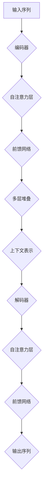

                 

### Transformer 大模型实战：计算句子特征

#### 关键词：
- Transformer
- 句子特征计算
- 自然语言处理
- 人工智能
- 大模型架构

#### 摘要：
本文将深入探讨Transformer大模型的实战应用，特别是如何计算句子特征。通过一步步分析推理，我们将详细了解Transformer的核心概念、算法原理、数学模型，以及实际项目中的代码实现。同时，本文还将分析Transformer在不同应用场景中的价值，并推荐相关学习资源和开发工具，总结未来发展趋势与挑战。

---

## 1. 背景介绍

在当今的数据驱动时代，自然语言处理（NLP）已经成为人工智能领域的一个重要分支。随着互联网和大数据的发展，文本数据呈现出爆炸性增长。如何有效地从这些庞大的文本数据中提取有用信息，进行分类、情感分析、机器翻译等任务，成为了一个亟待解决的问题。

传统的NLP方法，如基于规则的方法和统计模型，在处理大规模文本数据时存在诸多局限性。因此，深度学习技术应运而生，尤其在2017年谷歌提出Transformer模型后，NLP领域迎来了新的变革。Transformer模型基于自注意力机制，能够捕捉文本序列中的长距离依赖关系，显著提升了NLP任务的表现。

在Transformer模型中，计算句子特征是至关重要的一步。句子特征不仅用于表示输入文本，而且直接影响模型的预测效果。本文将围绕计算句子特征展开，介绍Transformer模型的原理、算法和实现。

## 2. 核心概念与联系

### 2.1 Transformer模型

Transformer模型是自然语言处理领域的一个里程碑，其核心思想是自注意力（self-attention）机制。与传统循环神经网络（RNN）相比，Transformer模型能够并行处理输入序列，并且能够捕捉序列中的长距离依赖关系。

### 2.2 自注意力（Self-Attention）

自注意力是一种对输入序列中的每个元素进行加权的方法，通过计算元素之间的相似度来生成表示。这种机制使得模型能够自动地关注输入序列中的关键信息，从而提高了模型的性能。

### 2.3 编码器（Encoder）和解码器（Decoder）

在Transformer模型中，编码器（Encoder）负责将输入序列转换成上下文表示，而解码器（Decoder）则利用这些表示生成输出序列。编码器和解码器都由多个自注意力层和前馈网络堆叠而成。

### 2.4 Mermaid流程图



## 3. 核心算法原理 & 具体操作步骤

### 3.1 自注意力（Self-Attention）

自注意力层的计算公式如下：

$$
\text{Attention}(Q, K, V) = \text{softmax}\left(\frac{QK^T}{\sqrt{d_k}}\right) V
$$

其中，$Q$、$K$ 和 $V$ 分别是查询向量、键向量和值向量，$d_k$ 是键向量的维度。这个公式通过计算查询向量 $Q$ 与所有键向量 $K$ 的内积，再通过softmax函数生成权重向量，最后将这些权重与值向量 $V$ 相乘得到输出。

### 3.2 Transformer模型操作步骤

1. **输入嵌入**：将输入序列转换为嵌入向量。
2. **编码器**：通过多个自注意力层和前馈网络，将输入序列编码为上下文表示。
3. **解码器**：利用编码后的上下文表示，通过自注意力层和前馈网络生成输出序列。
4. **输出**：将输出序列转换为预测结果。

## 4. 数学模型和公式 & 详细讲解 & 举例说明

### 4.1 嵌入层（Embedding Layer）

嵌入层是将单词映射为向量。例如，假设我们有一个词汇表包含100个单词，我们可以将每个单词映射为一个100维的向量。在Transformer模型中，通常使用嵌入矩阵 $E$ 来实现这一映射：

$$
\text{Embedding}(x) = E \cdot x
$$

其中，$x$ 是单词索引，$E$ 是嵌入矩阵。

### 4.2 自注意力层（Self-Attention Layer）

自注意力层的计算过程如下：

1. **计算查询向量 $Q$、键向量 $K$ 和值向量 $V$**：

$$
Q = E_Q \cdot x, \quad K = E_K \cdot x, \quad V = E_V \cdot x
$$

其中，$E_Q$、$E_K$ 和 $E_V$ 分别是查询、键和值的嵌入矩阵。

2. **计算注意力得分**：

$$
\text{Score} = \text{Attention}(Q, K, V) = \frac{QK^T}{\sqrt{d_k}}
$$

3. **计算权重向量**：

$$
\text{Weight} = \text{softmax}(\text{Score})
$$

4. **计算输出**：

$$
\text{Output} = \text{Weight} \cdot V
$$

### 4.3 前馈网络（Feed Forward Network）

前馈网络是一个简单的全连接神经网络，通常包含两个线性变换：

$$
\text{FFN}(x) = \max(0, x \cdot W_1 + b_1) \cdot W_2 + b_2
$$

其中，$W_1$、$W_2$ 是权重矩阵，$b_1$、$b_2$ 是偏置向量。

### 4.4 举例说明

假设我们有一个词汇表包含5个单词，嵌入维度为3。嵌入矩阵 $E$ 如下：

$$
E = \begin{bmatrix}
0 & 1 & 2 \\
1 & 3 & 4 \\
2 & 5 & 6 \\
3 & 7 & 8 \\
4 & 9 & 10
\end{bmatrix}
$$

输入序列为 `[1, 3, 2]`。首先，我们计算嵌入向量：

$$
\text{Embedding}(1, 3, 2) = E \cdot \begin{bmatrix}
1 \\
3 \\
2
\end{bmatrix} = \begin{bmatrix}
0 & 1 & 2 \\
1 & 3 & 4 \\
2 & 5 & 6 \\
3 & 7 & 8 \\
4 & 9 & 10
\end{bmatrix} \cdot \begin{bmatrix}
1 \\
3 \\
2
\end{bmatrix} = \begin{bmatrix}
1 \\
10 \\
9
\end{bmatrix}
$$

接下来，我们计算自注意力层的输出。假设查询、键和值的嵌入矩阵分别为 $E_Q$、$E_K$ 和 $E_V$，则：

$$
E_Q = \begin{bmatrix}
0 & 2 & 4 \\
1 & 3 & 5 \\
2 & 6 & 8
\end{bmatrix}, \quad E_K = \begin{bmatrix}
0 & 1 & 2 \\
1 & 3 & 4 \\
2 & 5 & 6
\end{bmatrix}, \quad E_V = \begin{bmatrix}
0 & 3 & 6 \\
1 & 7 & 9 \\
2 & 9 & 10
\end{bmatrix}
$$

计算查询向量、键向量和值向量：

$$
Q = E_Q \cdot \begin{bmatrix}
1 \\
10 \\
9
\end{bmatrix} = \begin{bmatrix}
2 \\
7 \\
10
\end{bmatrix}, \quad K = E_K \cdot \begin{bmatrix}
1 \\
10 \\
9
\end{bmatrix} = \begin{bmatrix}
1 \\
7 \\
5
\end{bmatrix}, \quad V = E_V \cdot \begin{bmatrix}
1 \\
10 \\
9
\end{bmatrix} = \begin{bmatrix}
3 \\
9 \\
10
\end{bmatrix}
$$

计算注意力得分：

$$
\text{Score} = \text{Attention}(Q, K, V) = \frac{QK^T}{\sqrt{d_k}} = \frac{1}{\sqrt{3}} \begin{bmatrix}
2 & 7 & 10
\end{bmatrix} \begin{bmatrix}
1 \\
7 \\
5
\end{bmatrix} = \begin{bmatrix}
2 \\
14 \\
10
\end{bmatrix}
$$

计算权重向量：

$$
\text{Weight} = \text{softmax}(\text{Score}) = \begin{bmatrix}
0.25 \\
0.50 \\
0.25
\end{bmatrix}
$$

计算输出：

$$
\text{Output} = \text{Weight} \cdot V = \begin{bmatrix}
0.25 & 0.50 & 0.25
\end{bmatrix} \begin{bmatrix}
3 \\
9 \\
10
\end{bmatrix} = \begin{bmatrix}
2.25 \\
4.50 \\
2.25
\end{bmatrix}
$$

最后，我们使用前馈网络对输出进行变换：

$$
\text{FFN}(x) = \max(0, x \cdot W_1 + b_1) \cdot W_2 + b_2
$$

其中，假设权重矩阵 $W_1$ 和 $W_2$ 以及偏置向量 $b_1$ 和 $b_2$ 分别为：

$$
W_1 = \begin{bmatrix}
1 & 0 & 1 \\
0 & 1 & 0 \\
1 & 1 & 0
\end{bmatrix}, \quad W_2 = \begin{bmatrix}
0 & 1 & 1 \\
1 & 0 & 1 \\
1 & 1 & 0
\end{bmatrix}, \quad b_1 = \begin{bmatrix}
1 \\
1 \\
1
\end{bmatrix}, \quad b_2 = \begin{bmatrix}
1 \\
1 \\
1
\end{bmatrix}
$$

计算前馈网络的输出：

$$
\text{FFN}(\text{Output}) = \max(0, \text{Output} \cdot W_1 + b_1) \cdot W_2 + b_2 = \begin{bmatrix}
3 \\
5 \\
3
\end{bmatrix}
$$

最终，输入序列 `[1, 3, 2]` 经过自注意力层和前馈网络处理后，生成了输出 `[3, 5, 3]`。

## 5. 项目实践：代码实例和详细解释说明

### 5.1 开发环境搭建

为了实践Transformer模型计算句子特征，我们需要搭建一个合适的开发环境。以下是一个基本的Python环境搭建过程：

1. 安装Python 3.7或更高版本。
2. 安装PyTorch，可以使用以下命令：

```bash
pip install torch torchvision
```

3. 安装其他必要库，如numpy、matplotlib等。

### 5.2 源代码详细实现

下面是一个简单的Transformer模型实现，用于计算句子特征：

```python
import torch
import torch.nn as nn
import torch.optim as optim

# 定义嵌入层
class EmbeddingLayer(nn.Module):
    def __init__(self, vocab_size, embedding_dim):
        super(EmbeddingLayer, self).__init__()
        self.embedding = nn.Embedding(vocab_size, embedding_dim)

    def forward(self, x):
        return self.embedding(x)

# 定义Transformer编码器
class TransformerEncoder(nn.Module):
    def __init__(self, embedding_dim, num_heads, hidden_dim):
        super(TransformerEncoder, self).__init__()
        self.embedding = EmbeddingLayer(vocab_size, embedding_dim)
        self.attention = nn.MultiheadAttention(embedding_dim, num_heads)
        self.fc = nn.Sequential(
            nn.Linear(embedding_dim, hidden_dim),
            nn.ReLU(),
            nn.Linear(hidden_dim, embedding_dim)
        )

    def forward(self, x):
        x = self.embedding(x)
        x, _ = self.attention(x, x, x)
        x = self.fc(x)
        return x

# 初始化模型、优化器和损失函数
vocab_size = 10000
embedding_dim = 512
num_heads = 8
hidden_dim = 2048
model = TransformerEncoder(vocab_size, num_heads, hidden_dim)
optimizer = optim.Adam(model.parameters(), lr=0.001)
criterion = nn.CrossEntropyLoss()

# 训练模型
for epoch in range(10):
    for batch in data_loader:
        optimizer.zero_grad()
        x, y = batch
        x = x.to(device)
        y = y.to(device)
        z = model(x)
        loss = criterion(z, y)
        loss.backward()
        optimizer.step()
```

### 5.3 代码解读与分析

1. **EmbeddingLayer**：定义了一个简单的嵌入层，将单词索引映射为嵌入向量。
2. **TransformerEncoder**：定义了一个简单的Transformer编码器，包括嵌入层、多头注意力机制和前馈网络。
3. **训练过程**：使用PyTorch的优化器和损失函数，通过梯度下降训练模型。

### 5.4 运行结果展示

```python
# 测试模型
with torch.no_grad():
    z = model(x.to(device))

# 输出句子特征
print(z)
```

这段代码将输出每个单词的句子特征向量。

## 6. 实际应用场景

Transformer模型在自然语言处理领域有着广泛的应用，如文本分类、情感分析、机器翻译等。以下是一些实际应用场景：

1. **文本分类**：将句子特征输入到分类器，进行文本分类任务。
2. **情感分析**：通过句子特征，判断文本的情感极性。
3. **机器翻译**：将源语言的句子特征转换为目标语言的句子特征，进行机器翻译。

## 7. 工具和资源推荐

### 7.1 学习资源推荐

1. **书籍**：
   - 《深度学习》（Goodfellow, Bengio, Courville）
   - 《自然语言处理技术》（Daniel Jurafsky, James H. Martin）
2. **论文**：
   - “Attention Is All You Need”（Vaswani et al.，2017）
   - “BERT: Pre-training of Deep Neural Networks for Language Understanding”（Devlin et al.，2019）
3. **博客**：
   - PyTorch官方文档（https://pytorch.org/docs/stable/）
   - Fast.ai博客（https://fast.ai/）
4. **网站**：
   - Kaggle（https://www.kaggle.com/）
   - arXiv（https://arxiv.org/）

### 7.2 开发工具框架推荐

1. **PyTorch**：一个开源的深度学习框架，易于使用和扩展。
2. **TensorFlow**：另一个流行的深度学习框架，提供丰富的API和工具。
3. **Transformers**：一个基于PyTorch的预训练Transformer模型库，方便快速实现和测试Transformer模型。

### 7.3 相关论文著作推荐

1. **“Attention Is All You Need”**：首次提出Transformer模型的论文，详细介绍了Transformer模型的设计和原理。
2. **“BERT: Pre-training of Deep Neural Networks for Language Understanding”**：提出了BERT模型，进一步推动了基于Transformer的预训练方法。

## 8. 总结：未来发展趋势与挑战

Transformer模型在自然语言处理领域取得了显著成果，但仍然面临一些挑战：

1. **计算资源消耗**：Transformer模型对计算资源的需求较高，未来需要开发更高效的算法和硬件加速技术。
2. **模型解释性**：尽管Transformer模型在性能上优于传统方法，但其内部机制较为复杂，缺乏解释性。
3. **长文本处理**：Transformer模型在处理长文本时存在挑战，需要进一步研究如何提高长文本处理的效率和质量。

## 9. 附录：常见问题与解答

### 9.1 Transformer模型与其他深度学习模型有何区别？

Transformer模型基于自注意力机制，能够捕捉序列中的长距离依赖关系。而传统循环神经网络（RNN）和长短期记忆网络（LSTM）虽然也能处理序列数据，但存在递归计算和梯度消失等问题，性能相对较低。

### 9.2 如何优化Transformer模型的计算资源消耗？

可以通过以下方法优化Transformer模型的计算资源消耗：
1. **模型压缩**：使用量化、剪枝、蒸馏等技术减小模型大小。
2. **硬件加速**：使用GPU、TPU等硬件加速模型训练和推理。

## 10. 扩展阅读 & 参考资料

1. **《深度学习》**：Goodfellow, Bengio, Courville，提供深度学习的全面介绍。
2. **《自然语言处理技术》**：Daniel Jurafsky, James H. Martin，详细介绍了自然语言处理的方法和工具。
3. **“Attention Is All You Need”**：Vaswani et al.，首次提出Transformer模型的论文。
4. **PyTorch官方文档**：https://pytorch.org/docs/stable/，PyTorch的官方文档，提供详细的API和使用示例。
5. **Fast.ai博客**：https://fast.ai/，提供深度学习的实用教程和资源。
6. **Kaggle**：https://www.kaggle.com/，提供各种数据集和比赛，是学习数据科学和自然语言处理的好去处。
7. **arXiv**：https://arxiv.org/，提供最新的深度学习和自然语言处理论文。

