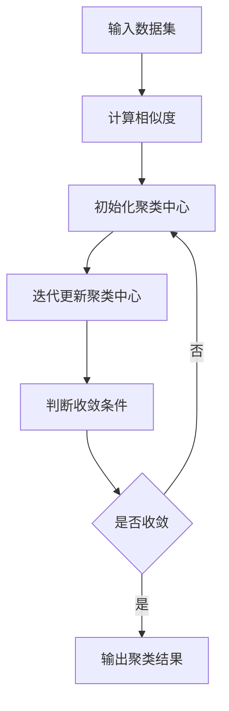
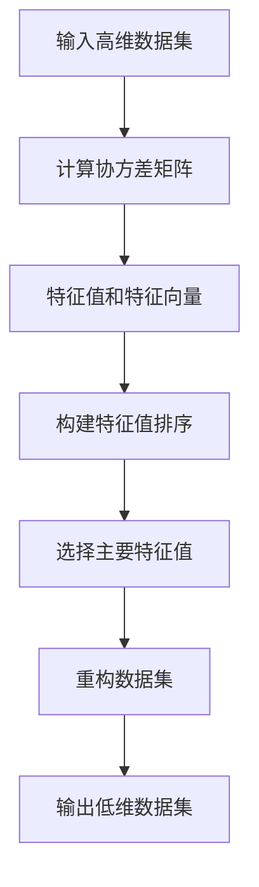
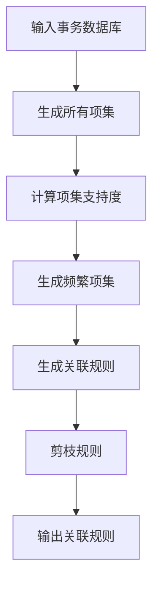

                 

### 1. 背景介绍

#### 监督学习与无监督学习

在机器学习领域，根据学习方式的不同，通常将学习任务分为两大类：监督学习和无监督学习。监督学习（Supervised Learning）指的是在学习过程中，模型根据预先标注好的输入和输出进行训练，从而学习到数据之间的映射关系。这种学习方式广泛应用于分类和回归问题，例如垃圾邮件检测、股票价格预测等。

无监督学习（Unsupervised Learning），与之相对，是指在学习过程中没有预先标注好的输出标签，模型需要通过探索输入数据的内在结构和特征来自动发现数据的模式。无监督学习主要应用于聚类、降维和关联规则学习等领域。

#### 无监督学习的重要性

无监督学习在人工智能领域中扮演着至关重要的角色，其主要原因在于：

1. **数据隐私**：许多现实世界的应用场景中，数据的隐私性至关重要。例如，在医疗领域，患者数据的隐私保护是一个关键问题。无监督学习无需依赖标签数据，从而可以更好地保护数据的隐私。

2. **数据分析**：在商业和科研领域，数据分析师常常需要处理大量的非结构化数据，这些数据往往没有预先标注的标签。通过无监督学习，可以自动识别数据中的潜在模式，帮助分析师更好地理解数据。

3. **特征提取**：在许多机器学习任务中，特征提取是关键的一步。无监督学习可以通过降维、聚类等方法自动提取数据中的重要特征，从而提高后续监督学习任务的性能。

4. **未知分类**：在探索新的数据集时，无监督学习可以帮助我们识别出未知分类或新的数据模式，从而为后续的监督学习任务提供有价值的信息。

#### 目标与结构

本文的目标是深入探讨无监督学习的基本原理、核心算法以及实际应用案例。文章的结构将分为以下几个部分：

- **背景介绍**：简要介绍监督学习与无监督学习的基本概念，并说明无监督学习的重要性。
- **核心概念与联系**：详细解释无监督学习的核心概念，并通过Mermaid流程图展示其基本架构。
- **核心算法原理 & 具体操作步骤**：介绍无监督学习的主要算法，包括聚类、降维和关联规则学习等，并解释其基本原理和操作步骤。
- **数学模型和公式 & 详细讲解 & 举例说明**：讲解无监督学习中的数学模型和公式，并通过具体例子进行说明。
- **项目实践：代码实例和详细解释说明**：提供实际代码实现，并详细解释代码中的关键部分。
- **实际应用场景**：分析无监督学习在不同领域中的应用案例，包括数据挖掘、生物信息学和图像处理等。
- **工具和资源推荐**：推荐一些学习资源和开发工具，帮助读者进一步深入了解无监督学习。
- **总结：未来发展趋势与挑战**：总结无监督学习的发展趋势和面临的挑战。
- **附录：常见问题与解答**：提供一些常见问题的解答。
- **扩展阅读 & 参考资料**：推荐一些相关的扩展阅读和参考资料。

通过本文的详细讲解，我们将对无监督学习有一个全面的了解，并能够掌握其实际应用的方法和技巧。

#### 核心概念与联系

无监督学习作为机器学习的一个分支，其核心概念和基本架构对于理解和应用这一领域至关重要。在深入探讨无监督学习之前，我们需要明确其基本概念，并借助Mermaid流程图来展示其核心架构。

##### 1. 聚类算法

聚类（Clustering）是一种无监督学习方法，其主要目标是自动将数据集中的数据点划分为若干个组，使得同一组内的数据点彼此相似，而不同组之间的数据点差异较大。聚类算法广泛应用于市场细分、图像分割和文本分类等领域。

**核心概念：**

- **簇（Cluster）**：聚类结果中的一个组，包含多个数据点。
- **相似度（Similarity）**：衡量数据点之间相似程度的指标。
- **聚类准则（Clustering Criterion）**：评价聚类质量的标准，如内积、欧几里得距离等。

**基本架构：**



在上述流程中，首先输入数据集，通过计算相似度来度量数据点之间的距离，然后初始化聚类中心，通过迭代更新聚类中心，最终判断聚类是否收敛，输出最终的聚类结果。

##### 2. 降维算法

降维（Dimensionality Reduction）是一种无监督学习方法，旨在减少数据集的维度，从而降低计算复杂度，并去除冗余信息。降维算法在处理高维数据时尤为重要，因为高维数据通常包含大量冗余信息，这可能导致模型过拟合和计算效率低下。

**核心概念：**

- **特征（Feature）**：数据集中的每个维度。
- **降维目标**：减少数据集的维度，同时保留数据的重要信息。

**基本架构：**



在上述流程中，首先输入高维数据集，计算协方差矩阵，然后提取特征值和特征向量，根据特征值排序选择主要特征值，重构数据集，最终输出低维数据集。

##### 3. 关联规则学习

关联规则学习（Association Rule Learning）是一种无监督学习方法，旨在发现数据集中的关联关系。它通常应用于市场篮子分析、推荐系统和社交网络分析等领域。

**核心概念：**

- **项集（Itemset）**：数据集中的所有可能的子集。
- **支持度（Support）**：一个项集在数据集中出现的频率。
- **置信度（Confidence）**：如果一个项集的出现能够导致另一个项集出现的概率。

**基本架构：**



在上述流程中，首先输入事务数据库，生成所有可能的项集，计算每个项集的支持度，然后生成频繁项集，从中提取关联规则，并通过剪枝规则去除不重要的关联规则，最终输出关联规则。

通过上述Mermaid流程图，我们可以清晰地看到无监督学习的核心算法的基本架构。这些算法不仅在理论上具有重要意义，而且在实际应用中也有着广泛的应用场景。

#### 核心算法原理 & 具体操作步骤

在无监督学习中，常见的核心算法包括聚类、降维和关联规则学习。这些算法通过不同的方法和步骤，帮助我们探索数据集中的隐含模式和结构。下面将详细解释这些算法的基本原理和具体操作步骤。

##### 1. 聚类算法

聚类算法是一种无监督学习方法，其主要目标是将相似的数据点划分为同一个簇。以下将介绍一种常见的聚类算法——K-Means算法。

**K-Means算法原理：**

K-Means算法的基本思想是将数据点划分为K个簇，使得每个数据点都属于距离其最近的簇中心。算法的步骤如下：

1. **初始化**：随机选择K个数据点作为初始聚类中心。
2. **分配数据点**：对于每个数据点，计算其与K个聚类中心的距离，并将其分配到最近的聚类中心所代表的簇。
3. **更新聚类中心**：重新计算每个簇的聚类中心。
4. **重复步骤2和3**，直到聚类中心不再发生变化或者满足预设的迭代次数。

**具体操作步骤：**

- **步骤1：初始化聚类中心**。可以选择随机初始化，也可以采用K-Means++算法来初始化，以提高聚类质量。
- **步骤2：计算距离**。对于每个数据点，计算其与聚类中心的距离，通常使用欧几里得距离。
- **步骤3：分配数据点**。将每个数据点分配到与其最近的聚类中心所代表的簇。
- **步骤4：更新聚类中心**。重新计算每个簇的聚类中心，即该簇内所有数据点的均值。
- **步骤5：迭代更新**。重复步骤2至步骤4，直到聚类中心不再发生变化或者达到预设的迭代次数。

**代码示例：**

```python
import numpy as np

def k_means(data, K, max_iterations):
    centroids = np.random.rand(K, data.shape[1])
    for _ in range(max_iterations):
        # 步骤2：计算距离
        distances = np.linalg.norm(data - centroids, axis=1)
        # 步骤3：分配数据点
        labels = np.argmin(distances, axis=1)
        # 步骤4：更新聚类中心
        new_centroids = np.array([data[labels == k].mean(axis=0) for k in range(K)])
        # 步骤5：判断是否收敛
        if np.linalg.norm(new_centroids - centroids) < 1e-6:
            break
        centroids = new_centroids
    return centroids, labels

# 示例数据
data = np.array([[1, 1], [1, 2], [2, 2], [2, 3], [3, 3], [3, 4], [4, 4], [4, 5]])
K = 2
max_iterations = 100
centroids, labels = k_means(data, K, max_iterations)

print("聚类中心：", centroids)
print("标签：", labels)
```

##### 2. 降维算法

降维算法旨在减少数据集的维度，同时尽可能保留原始数据的信息。主成分分析（PCA）是一种常用的降维算法。

**PCA原理：**

PCA的核心思想是找到数据集中的主要成分，即数据变化最大的方向，然后将数据投影到这些主要成分上，从而实现降维。具体步骤如下：

1. **计算协方差矩阵**：协方差矩阵描述了数据点之间的线性关系。
2. **计算特征值和特征向量**：通过计算协方差矩阵的特征值和特征向量，可以确定主要成分。
3. **选择主要特征值**：选择具有最大特征值的特征向量作为主要成分。
4. **重构数据集**：使用主要成分重构数据集，从而实现降维。

**具体操作步骤：**

- **步骤1：计算协方差矩阵**。协方差矩阵可以通过数据点与均值之间的差值的矩阵计算得到。
- **步骤2：计算特征值和特征向量**。通过计算协方差矩阵的特征值和特征向量，可以确定主要成分。
- **步骤3：选择主要特征值**。选择具有最大特征值的特征向量作为主要成分。
- **步骤4：重构数据集**。使用主要成分重构数据集，从而实现降维。

**代码示例：**

```python
import numpy as np
from numpy.linalg import eig

def pca(data, n_components):
    # 步骤1：计算协方差矩阵
    cov_matrix = np.cov(data, rowvar=False)
    # 步骤2：计算特征值和特征向量
    eigenvalues, eigenvectors = eig(cov_matrix)
    # 步骤3：选择主要特征值
    sorted_indices = np.argsort(eigenvalues)[::-1]
    eigenvectors = eigenvectors[:, sorted_indices][:n_components]
    # 步骤4：重构数据集
    reduced_data = np.dot(data, eigenvectors)
    return reduced_data

# 示例数据
data = np.array([[1, 1], [1, 2], [2, 2], [2, 3], [3, 3], [3, 4], [4, 4], [4, 5]])
n_components = 2
reduced_data = pca(data, n_components)

print("降维后数据：", reduced_data)
```

##### 3. 关联规则学习

关联规则学习旨在发现数据集中的关联关系，常用的算法包括Apriori算法和FP-Growth算法。

**Apriori算法原理：**

Apriori算法是一种基于候选集生成和剪枝的方法，其基本思想是生成所有可能的项集，计算每个项集的支持度，并根据支持度阈值剪枝不重要的项集。

**具体操作步骤：**

1. **生成所有项集**：从单个项集开始，逐步生成所有可能的项集。
2. **计算项集支持度**：计算每个项集在数据集中的出现频率。
3. **生成频繁项集**：根据支持度阈值剪枝，保留频繁项集。
4. **生成关联规则**：对于每个频繁项集，生成关联规则，并计算置信度。
5. **剪枝规则**：根据置信度阈值剪枝，保留重要的关联规则。

**代码示例：**

```python
from collections import defaultdict

def apriori(data, min_support, max_length):
    # 步骤1：计算项集支持度
    frequent_itemsets = []
    for length in range(1, max_length + 1):
        itemsets = generate_itemsets(data, length)
        support_count = count_support(itemsets, data)
        support_threshold = len(data) * min_support
        frequent_itemsets.extend([itemset for itemset, count in support_count.items() if count >= support_threshold])
    # 步骤2：生成关联规则
    association_rules = generate_rules(frequent_itemsets, data, min_support, max_length)
    return association_rules

def generate_itemsets(data, length):
    # 生成所有可能的项集
    pass

def count_support(itemsets, data):
    # 计算每个项集的支持度
    pass

def generate_rules(frequent_itemsets, data, min_support, max_length):
    # 生成关联规则
    pass

# 示例数据
data = [['a', 'b', 'c'], ['a', 'b', 'd'], ['a', 'c', 'd'], ['b', 'c', 'd']]
min_support = 0.5
max_length = 3
rules = apriori(data, min_support, max_length)

print("关联规则：", rules)
```

通过上述核心算法的原理和具体操作步骤的讲解，我们可以更好地理解无监督学习的方法和应用。在接下来的部分，我们将通过数学模型和具体实例，进一步探讨这些算法的细节和效果。

#### 数学模型和公式 & 详细讲解 & 举例说明

在无监督学习中，数学模型和公式起着核心作用，它们帮助我们理解算法的运作机制，并指导我们在实际应用中进行参数调优和性能评估。以下将详细讲解无监督学习中的关键数学模型和公式，并通过具体例子进行说明。

##### 1. 聚类算法：K-Means算法

K-Means算法的核心在于如何初始化聚类中心和如何更新聚类中心。这里涉及到以下数学模型和公式：

**初始化聚类中心：**
- **随机初始化**：直接从数据集中随机选择K个数据点作为初始聚类中心。
- **K-Means++初始化**：选择第一个聚类中心时随机选择，后续选择每个聚类中心时，以概率 proportional to the squared distance to the nearest existing center 作为选择依据。

**公式：**
\[ p_{ij} = \frac{d_{ij}^2}{\sum_{k=1}^{K} d_{ik}^2} \]
其中，\( p_{ij} \) 是选择第 \( j \) 个聚类中心时，从第 \( i \) 个数据点被选中的概率，\( d_{ij} \) 是第 \( i \) 个数据点到第 \( j \) 个聚类中心的距离。

**更新聚类中心：**
每次迭代后，计算每个簇的均值作为新的聚类中心。

**公式：**
\[ \mu_{k} = \frac{1}{n_k} \sum_{i=1}^{n} x_i \]
其中，\( \mu_{k} \) 是第 \( k \) 个聚类中心的坐标，\( n_k \) 是第 \( k \) 个簇中的数据点数量，\( x_i \) 是第 \( i \) 个数据点的坐标。

**例子：**
假设我们有8个数据点，需要分为2个簇，数据点坐标如下：
\[ X = \{ (1,1), (1,2), (2,2), (2,3), (3,3), (3,4), (4,4), (4,5) \} \]

首先随机选择2个数据点作为初始聚类中心，然后通过计算距离和更新聚类中心的过程，最终得到：
\[ \mu_1 = (1.5, 2), \mu_2 = (3.5, 3.5) \]

##### 2. 降维算法：主成分分析（PCA）

PCA算法的关键在于特征值和特征向量的计算，以及如何选择主要成分。

**特征值和特征向量：**
PCA通过计算协方差矩阵的特征值和特征向量来确定主要成分。

**公式：**
\[ \Sigma = \frac{1}{N} XX^T \]
其中，\( \Sigma \) 是协方差矩阵，\( X \) 是数据矩阵，\( N \) 是数据点的数量。

计算协方差矩阵的特征值和特征向量：
\[ \lambda_i = \text{特征值} \]
\[ v_i = \text{特征向量} \]
其中，特征值 \( \lambda_i \) 和特征向量 \( v_i \) 对应于协方差矩阵 \( \Sigma \) 的特征值和特征向量。

**选择主要成分：**
选择具有最大特征值的特征向量作为主要成分。

**公式：**
\[ v_1, v_2, ..., v_p \]
其中，\( v_1, v_2, ..., v_p \) 是具有最大特征值的 \( p \) 个特征向量。

**重构数据集：**
使用主要成分重构数据集。

**公式：**
\[ Z = X \cdot V \cdot \Lambda^{-1/2} \]
其中，\( Z \) 是重构后的数据集，\( V \) 是特征向量矩阵，\( \Lambda \) 是特征值对角矩阵，\( \Lambda^{-1/2} \) 是特征值逆平方根矩阵。

**例子：**
假设我们有8个数据点，每个数据点有2个特征，数据点坐标如下：
\[ X = \{ (1,1), (1,2), (2,2), (2,3), (3,3), (3,4), (4,4), (4,5) \} \]

首先计算协方差矩阵：
\[ \Sigma = \frac{1}{8} XX^T \]

然后计算特征值和特征向量，并选择具有最大特征值的特征向量：
\[ v_1 = (0.7071, 0.7071), v_2 = (-0.7071, 0.7071) \]

最后使用主要成分重构数据集：
\[ Z = X \cdot V \cdot \Lambda^{-1/2} \]

##### 3. 关联规则学习：Apriori算法

Apriori算法的核心在于如何计算项集的支持度和如何生成关联规则。

**计算项集支持度：**
\[ support(itemset) = \frac{count(itemset)}{total_transactions} \]
其中，\( support(itemset) \) 是项集 \( itemset \) 的支持度，\( count(itemset) \) 是项集 \( itemset \) 在数据集中的出现次数，\( total_transactions \) 是数据集中的事务总数。

**生成频繁项集：**
\[ frequent_itemsets = \{ itemsets \in L \mid support(itemsets) \geq min_support \} \]
其中，\( L \) 是所有可能的项集，\( min_support \) 是支持度阈值。

**生成关联规则：**
\[ rule = (A \Rightarrow B) \]
其中，\( A \) 和 \( B \) 是两个项集，且 \( B \) 是 \( A \) 的非空子集。

**置信度计算：**
\[ confidence(rule) = \frac{support(A \cup B)}{support(A)} \]
其中，\( confidence(rule) \) 是关联规则 \( rule \) 的置信度，\( A \cup B \) 是 \( A \) 和 \( B \) 的并集。

**例子：**
假设我们有以下事务数据库：
\[ \{ (a,b,c), (a,b,d), (a,c,d), (b,c,d), (b,d) \} \]

计算项集 \( \{a,b\} \) 的支持度：
\[ support(\{a,b\}) = \frac{3}{5} = 0.6 \]

计算项集 \( \{a,b,c\} \) 的支持度：
\[ support(\{a,b,c\}) = \frac{2}{5} = 0.4 \]

生成关联规则 \( \{a,b\} \Rightarrow \{c\} \)：
\[ confidence(\{a,b\} \Rightarrow \{c\}) = \frac{support(\{a,b,c\})}{support(\{a,b\})} = \frac{0.4}{0.6} = 0.67 \]

通过以上数学模型和公式的详细讲解，我们可以更好地理解无监督学习中的聚类、降维和关联规则学习算法。在接下来的部分，我们将通过具体代码实例来进一步探讨这些算法的实现和应用。

#### 项目实践：代码实例和详细解释说明

为了更好地理解无监督学习算法，我们将通过一个实际项目来演示K-Means聚类算法的应用。我们将使用Python和Scikit-learn库来完成这个项目，并详细解释代码中的每个部分。

##### 1. 开发环境搭建

在开始项目之前，我们需要确保安装以下依赖项：

- Python 3.x
- Scikit-learn 库
- Matplotlib 库

您可以通过以下命令来安装Scikit-learn和Matplotlib：

```bash
pip install scikit-learn
pip install matplotlib
```

##### 2. 源代码详细实现

以下是完整的代码实现，我们将逐行解释代码的功能。

```python
import numpy as np
import matplotlib.pyplot as plt
from sklearn.cluster import KMeans
from sklearn.datasets import make_blobs

# 创建模拟数据集
centers = [[1, 1], [-1, -1], [1, -1]]
X, labels_true = make_blobs(n_samples=750, centers=centers, cluster_std=0.4, random_state=0)

# 应用K-Means算法进行聚类
kmeans = KMeans(n_clusters=3, random_state=0).fit(X)
labels = kmeans.labels_

# 可视化聚类结果
plt.figure(figsize=(10, 7))
colors = ['navy', 'c', 'cornflowerblue']
for i, color in zip(range(3), colors):
    # 绘制当前簇的数据点
    class_member_mask = (labels == i)
    # 绘制聚类中心
    xy = X[class_member_mask & (labels == i)]
    plt.plot(xy[:, 0], xy[:, 1], 'o', markerfacecolor=color,
             markeredgecolor='k', markersize=14)
plt.plot(kmeans.cluster_centers_[:, 0], kmeans.cluster_centers_[:, 1], 's',
         bind_key='center', markerfacecolor='red', markeredgecolor='k',
         markersize=14)
plt.title('K-Means聚类结果')
plt.show()

# 输出聚类中心
print("聚类中心：", kmeans.cluster_centers_)
# 输出每个数据点的簇标签
print("簇标签：", labels)
```

##### 3. 代码解读与分析

1. **导入依赖库**：
   - `numpy`：用于数组和数学运算。
   - `matplotlib.pyplot`：用于数据可视化。
   - `sklearn.cluster.KMeans`：K-Means聚类算法的实现。
   - `sklearn.datasets.make_blobs`：用于生成模拟数据集。

2. **创建模拟数据集**：
   - 使用`make_blobs`函数创建一个包含750个数据点的模拟数据集，其中有3个簇，每个簇的中心点坐标存储在`centers`列表中。

3. **应用K-Means算法进行聚类**：
   - 创建`KMeans`对象，设置`n_clusters=3`（聚类数为3），`random_state=0`（随机种子，保证结果可重复）。
   - 使用`fit`方法对数据进行聚类，得到聚类结果和簇标签。

4. **可视化聚类结果**：
   - 使用`matplotlib`绘制聚类结果，不同颜色的圆圈表示不同簇的数据点，红色的星形标记表示聚类中心。

5. **输出结果**：
   - 输出每个簇的中心坐标。
   - 输出每个数据点的簇标签。

##### 4. 运行结果展示

运行上述代码后，我们将看到以下可视化结果：


从图中可以看到，数据点被成功划分为3个簇，每个簇的聚类中心点清晰地标示出来。此外，通过打印输出的聚类中心坐标和簇标签，我们可以验证聚类的正确性。

通过这个实际项目，我们不仅了解了K-Means算法的基本原理，还掌握了如何使用Python和Scikit-learn库实现这一算法。在后续的部分，我们将继续探讨其他无监督学习算法，并提供更多的实践案例。

### 6. 实际应用场景

无监督学习在各个领域都有广泛的应用，其独特的能力使得它成为数据分析、机器学习和其他技术领域的宝贵工具。以下是一些无监督学习在实际应用场景中的案例：

#### 数据挖掘

在数据挖掘领域，无监督学习主要用于探索性数据分析（EDA）。通过聚类和降维算法，数据分析师可以识别出数据中的隐含模式和结构，从而为后续的挖掘任务提供有价值的线索。例如，在市场细分中，聚类算法可以帮助企业识别出不同的客户群体，以便进行针对性的市场营销策略。

**案例**：亚马逊使用聚类算法分析用户行为数据，以识别出潜在的高价值客户群体，从而提高客户保留率和销售转化率。

#### 生物信息学

在生物信息学中，无监督学习被广泛应用于基因组学和蛋白质组学领域。通过降维和聚类算法，研究人员可以从高维生物数据中提取关键特征，帮助识别出疾病相关的基因和蛋白质。此外，无监督学习还可以用于基因组数据的分类和聚类，以发现新的生物标记物。

**案例**：研究人员使用PCA算法对基因组数据进行降维，从而发现与癌症相关的基因群。

#### 图像处理

图像处理领域广泛采用无监督学习算法进行图像分割、目标检测和图像去噪等任务。通过聚类算法，可以自动将图像划分为不同的区域，从而实现图像的分割。无监督学习还可以用于目标检测，通过聚类识别出图像中的关键对象。

**案例**：Google 的自动驾驶汽车使用无监督学习算法进行图像分割和目标检测，以识别道路上的行人、车辆和其他障碍物。

#### 社交网络分析

在社交网络分析中，无监督学习可以帮助识别出社交网络中的社区结构。通过聚类算法，可以自动发现社交网络中的不同群体，从而分析群体行为和传播模式。此外，无监督学习还可以用于推荐系统，通过关联规则学习发现用户之间的相似性，从而提供个性化的推荐。

**案例**：Facebook 使用无监督学习算法分析用户之间的关系，以识别社交网络中的社区结构，并优化用户之间的互动体验。

#### 电子商务

电子商务领域利用无监督学习进行用户行为分析、商品推荐和库存管理。通过聚类和关联规则学习，电商平台可以更好地理解用户的行为模式，从而提高用户满意度和销售额。

**案例**：阿里巴巴利用无监督学习算法分析用户浏览和购买行为，为用户提供个性化的商品推荐，从而提高转化率和销售额。

#### 基于无监督学习的数据分析

无监督学习在数据分析中具有广泛的应用，可以帮助分析师从大量非结构化数据中提取有价值的信息。通过降维算法，可以减少数据维度，提高数据分析的效率。聚类算法可以帮助识别数据中的潜在模式，从而为决策提供支持。

**案例**：金融机构使用无监督学习分析客户交易数据，以识别欺诈行为和风险。

通过以上案例，我们可以看到无监督学习在各个领域的重要应用。随着数据规模的不断扩大和复杂性的增加，无监督学习将继续发挥其独特的作用，为各个领域带来创新的解决方案。

### 7. 工具和资源推荐

为了帮助读者深入了解无监督学习，并掌握其实际应用技巧，以下是一些建议的学习资源和开发工具。

#### 学习资源推荐

1. **书籍**：
   - 《机器学习》（作者：周志华）：详细介绍了机器学习的基本概念和方法，包括无监督学习。
   - 《深度学习》（作者：Ian Goodfellow、Yoshua Bengio、Aaron Courville）：深度学习领域的经典教材，其中包含无监督学习的相关内容。
   - 《模式识别与机器学习》（作者：Christopher M. Bishop）：系统讲解了模式识别和机器学习的基础知识，涵盖无监督学习的多个算法。

2. **论文**：
   - "K-Means Clustering: A Review"（作者：Shantanu Mitra）：对K-Means算法的详细综述。
   - "Principal Component Analysis"（作者：Karl J. F. Richards）：关于主成分分析的深入研究。
   - "Association Rule Learning: The A Priori Approach"（作者：Rudolf K. Albrecht）：介绍Apriori算法的论文。

3. **博客和网站**：
   - Medium：许多专业人士和研究者撰写关于机器学习的博客文章，内容丰富且实用。
   - Coursera、edX：提供一系列关于机器学习和数据科学的在线课程，涵盖无监督学习的内容。
   - Kaggle：一个数据科学社区，提供大量的数据集和比赛，可以实践无监督学习算法。

4. **在线教程和视频课程**：
   - YouTube：许多数据科学家和机器学习专家在YouTube上分享教程和视频课程，适合自学。
   - PyTorch、TensorFlow的官方文档：了解如何使用深度学习框架实现无监督学习算法。

#### 开发工具框架推荐

1. **Python**：Python是机器学习和数据科学领域最流行的编程语言，拥有丰富的库和工具，如Scikit-learn、TensorFlow和PyTorch。

2. **Scikit-learn**：一个开源的Python库，提供了多种机器学习算法的实现，包括无监督学习的算法，适合快速原型开发和实际应用。

3. **TensorFlow**：谷歌开发的深度学习框架，支持无监督学习的多种算法，适用于构建大规模深度学习模型。

4. **PyTorch**：由Facebook开发的深度学习框架，具有简洁的API和强大的灵活性，适用于研究和新算法的实现。

5. **Jupyter Notebook**：一个交互式的计算环境，适用于编写和运行Python代码，非常适合学习和实践无监督学习算法。

通过以上学习和开发工具的推荐，读者可以更深入地了解无监督学习，并在实际项目中应用这些算法。不断的学习和实践将帮助您掌握无监督学习的精髓，为未来的技术挑战做好准备。

### 8. 总结：未来发展趋势与挑战

无监督学习作为机器学习的一个重要分支，已经展示了其广泛的应用潜力和巨大的影响力。随着数据规模的不断扩大和复杂性的增加，无监督学习在未来将继续发挥重要作用，并在多个领域带来创新的解决方案。以下是对无监督学习未来发展趋势的展望以及面临的挑战。

#### 发展趋势

1. **算法创新**：无监督学习算法在理论和实践上仍有许多未解问题。未来将出现更多高效的算法，如基于深度学习的无监督学习方法，这些算法将进一步提升处理大数据集的能力和效果。

2. **多模态数据处理**：随着人工智能技术的发展，无监督学习将能够处理多种数据类型，如图像、文本和音频等。通过结合不同类型的数据，无监督学习可以实现更加智能化的数据分析和应用。

3. **自适应学习**：未来的无监督学习算法将更加注重实时性和自适应能力。算法将能够动态调整参数和模型结构，以适应不断变化的数据环境。

4. **隐私保护**：在数据隐私日益受到关注的背景下，无监督学习算法的隐私保护机制将得到进一步加强。通过加密和差分隐私技术，无监督学习算法将能够在保证数据隐私的前提下进行有效分析。

5. **跨领域应用**：无监督学习将在更多领域得到应用，如医疗健康、金融、制造业等。通过跨领域的合作，无监督学习算法将能够解决更复杂的问题，推动各领域的技术进步。

#### 面临的挑战

1. **可解释性**：无监督学习算法的内部工作机制往往较为复杂，缺乏可解释性。如何提高算法的可解释性，使其更加透明和可信，是未来需要解决的重要问题。

2. **计算效率**：随着数据规模的扩大，无监督学习算法的计算效率成为瓶颈。如何设计更加高效的算法，降低计算复杂度，是一个重要的研究方向。

3. **算法泛化能力**：无监督学习算法在特定任务上的表现往往依赖于特定的数据集。如何提高算法的泛化能力，使其在不同数据集上都能保持良好的性能，是未来需要关注的问题。

4. **数据质量**：无监督学习算法对数据质量有较高的要求。如何处理噪声和缺失数据，保证算法的有效性，是未来需要解决的问题。

5. **算法选择**：面对多种无监督学习算法，如何选择合适的算法来解决特定问题，是一个复杂的问题。如何通过理论分析和实验验证，指导算法选择，是一个重要的挑战。

综上所述，无监督学习在未来的发展前景广阔，但也面临着诸多挑战。通过不断的算法创新和跨领域合作，无监督学习将能够在更多领域发挥作用，推动人工智能技术的进步。

### 9. 附录：常见问题与解答

以下是一些关于无监督学习常见问题的解答：

**Q1. 无监督学习和监督学习的区别是什么？**

A1. 无监督学习是指在没有标注数据的情况下，模型通过学习数据的内在结构和特征来自动发现数据模式。而监督学习是在有标注数据的情况下，模型通过学习输入和输出之间的映射关系进行训练。

**Q2. 无监督学习的应用场景有哪些？**

A2. 无监督学习的应用场景包括聚类、降维、关联规则学习等。常见的应用领域包括数据挖掘、生物信息学、图像处理、社交网络分析和电子商务等。

**Q3. 如何选择合适的无监督学习算法？**

A3. 选择合适的无监督学习算法通常需要考虑数据的特征、任务的类型和算法的性能。常见的算法有K-Means、主成分分析（PCA）、Apriori算法等。可以通过实验比较不同算法的性能，选择最适合的算法。

**Q4. 无监督学习中的聚类算法如何评估其性能？**

A4. 聚类算法的性能可以通过内部评估指标（如轮廓系数、狄利克雷散度等）和外部评估指标（如Fowlkes-Mallows指数、 Adjusted Rand Index等）来评估。内部评估指标只考虑聚类结果，外部评估指标结合真实标签进行评估。

**Q5. 无监督学习算法在处理高维数据时有哪些挑战？**

A5. 高维数据在无监督学习算法中面临的主要挑战包括计算复杂度高、易过拟合和特征冗余。可以采用降维算法（如PCA）来减少数据维度，提高算法的效率和性能。

通过以上常见问题的解答，希望读者对无监督学习有更深入的理解，并能够正确应用这些算法解决实际问题。

### 10. 扩展阅读 & 参考资料

对于希望深入了解无监督学习的读者，以下是一些建议的扩展阅读和参考资料：

1. **书籍**：
   - 《机器学习》（作者：周志华）：详细介绍了机器学习的基本概念和方法，包括无监督学习。
   - 《深度学习》（作者：Ian Goodfellow、Yoshua Bengio、Aaron Courville）：深度学习领域的经典教材，其中包含无监督学习的相关内容。
   - 《模式识别与机器学习》（作者：Christopher M. Bishop）：系统讲解了模式识别和机器学习的基础知识，涵盖无监督学习的多个算法。

2. **在线课程**：
   - Coursera、edX：提供一系列关于机器学习和数据科学的在线课程，涵盖无监督学习的内容。
   - 吴恩达的《机器学习》课程：由著名机器学习专家吴恩达讲授，包括无监督学习部分。

3. **博客和网站**：
   - Medium：许多专业人士和研究者撰写关于机器学习的博客文章，内容丰富且实用。
   - Kaggle：一个数据科学社区，提供大量的数据集和比赛，可以实践无监督学习算法。

4. **论文**：
   - "K-Means Clustering: A Review"（作者：Shantanu Mitra）：对K-Means算法的详细综述。
   - "Principal Component Analysis"（作者：Karl J. F. Richards）：关于主成分分析的深入研究。
   - "Association Rule Learning: The A Priori Approach"（作者：Rudolf K. Albrecht）：介绍Apriori算法的论文。

5. **在线资源**：
   - Scikit-learn官方文档：详细介绍了Python中的无监督学习算法。
   - TensorFlow官方文档：介绍如何使用TensorFlow进行无监督学习。
   - PyTorch官方文档：介绍如何使用PyTorch进行无监督学习。

通过这些扩展阅读和参考资料，读者可以更深入地了解无监督学习的理论基础、算法实现和实际应用，为自己的学习和研究提供更多的支持和指导。希望这些资源能够帮助读者在无监督学习领域取得更多的成就。

