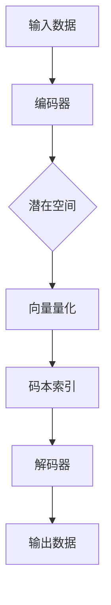

                 

### 文章标题

**VQVAE原理：离散化表示学习**

> **关键词**：变分自编码器（VAE）、向量量化（VQ）、自编码器（AE）、生成模型、离散化表示、深度学习、数据压缩、图像生成

> **摘要**：本文将深入探讨VQVAE（Vector Quantized Variational Autoencoder）的原理，这是一种结合了变分自编码器和向量量化技术的生成模型。VQVAE通过离散化表示学习，实现了高效且高质量的图像生成和数据分析。本文将详细介绍VQVAE的核心概念、算法原理、数学模型，并辅以实际项目实践，帮助读者全面理解VQVAE的工作机制及应用价值。

### 1. 背景介绍

#### 1.1 变分自编码器（VAE）

变分自编码器（Variational Autoencoder，VAE）是由Kingma和Welling于2013年提出的一种生成模型[1]。VAE的主要目标是从数据中学习到一个潜在的表示，然后通过这个潜在表示生成数据。与传统的自编码器（Autoencoder）不同，VAE使用概率模型来表示潜在空间和编码解码过程，从而使得模型能够更好地捕获数据分布。

VAE的架构包括编码器（Encoder）和解码器（Decoder）。编码器将输入数据映射到一个潜在空间中的点，这个潜在空间中的点由一组参数表示，通常是正态分布的均值和方差。解码器则将潜在空间中的点映射回数据空间，生成与输入数据相似的新数据。

#### 1.2 向量量化（VQ）

向量量化（Vector Quantization，VQ）是一种将连续向量映射为离散向量的技术，常用于数据压缩和特征编码。在深度学习领域，VQ被用于将连续的潜在变量转换为离散的索引向量，从而使得模型能够利用固定的、可共享的代码本（Codebook）来表示数据。

VQ的基本思想是：首先，通过编码器学习到一个潜在空间；然后，在这个潜在空间中定义一组码本向量；最后，将输入数据映射到最近的码本向量上，从而实现向量的离散化。

#### 1.3 VQVAE的提出

VQVAE（Vector Quantized Variational Autoencoder）是结合了VAE和VQ技术的一种新型生成模型。VQVAE通过向量量化技术实现了潜在空间的离散化表示，从而提高了生成模型的学习效率和生成质量。

VQVAE的主要优势在于：

- **效率提升**：通过向量量化，VQVAE能够使用固定的、可共享的码本来表示潜在空间，从而减少了模型参数的数量，提高了训练效率。
- **质量提升**：离散化的潜在空间使得生成模型能够更好地捕获数据分布，从而生成更加真实、细腻的图像。

### 2. 核心概念与联系

为了更清晰地理解VQVAE的工作原理，下面我们将使用Mermaid流程图来展示VQVAE的核心概念和架构。



#### 2.1 编码器（Encoder）

编码器负责将输入数据映射到潜在空间中的一个点。在VAE中，潜在空间通常由正态分布表示。在VQVAE中，编码器不仅学习到潜在空间的分布，还学习到码本向量的分布。

$$
\text{编码器输出}: z = \text{Encoder}(x) = \mu(x), \log(\sigma(x))
$$

其中，$\mu(x)$和$\log(\sigma(x))$分别是编码器输出的均值和方差，用于表示潜在空间中的点。

#### 2.2 潜在空间（Latent Space）

潜在空间是VQVAE的核心，它是一个高维的概率分布，用于表示输入数据的潜在特征。在VQVAE中，潜在空间被离散化为一组码本向量。

#### 2.3 向量量化（Vector Quantization）

向量量化是将连续的潜在向量映射为离散的码本索引的过程。具体来说，对于每个潜在向量，我们找到最近的码本向量，并将潜在向量映射到这个码本向量的索引上。

$$
\text{码本索引}: q(z) = \text{argmin}_{j} \ ||z - c_j||_2
$$

其中，$c_j$是码本中的第j个向量。

#### 2.4 解码器（Decoder）

解码器负责将码本索引映射回数据空间，生成与输入数据相似的新数据。

$$
\text{解码器输出}: x' = \text{Decoder}(q(z))
$$

### 3. 核心算法原理 & 具体操作步骤

#### 3.1 编码器

编码器的任务是学习到一个潜在空间，并将输入数据映射到这个空间中的一个点。在VQVAE中，编码器通常使用一个全连接层来实现。

具体步骤如下：

1. **输入数据**：将输入数据输入到编码器中。
2. **全连接层**：使用一个全连接层计算输出均值和方差。
3. **正态分布**：将全连接层的输出视为潜在空间中的点，表示为均值和方差的正态分布。

#### 3.2 潜在空间

潜在空间是VQVAE的核心。在VQVAE中，潜在空间被离散化为一组码本向量。具体来说，潜在空间中的点被映射到码本向量上，码本向量是预先定义好的。

1. **码本初始化**：初始化一组码本向量。
2. **向量量化**：对于每个潜在向量，找到最近的码本向量，并将潜在向量映射到这个码本向量的索引上。

#### 3.3 解码器

解码器的任务是使用码本索引生成与输入数据相似的新数据。

具体步骤如下：

1. **码本索引**：将编码器输出的码本索引输入到解码器中。
2. **全连接层**：使用一个全连接层将码本索引映射回数据空间。
3. **输出数据**：生成与输入数据相似的新数据。

### 4. 数学模型和公式 & 详细讲解 & 举例说明

#### 4.1 编码器数学模型

在VQVAE中，编码器的任务是学习到一个潜在空间，并将输入数据映射到这个空间中的一个点。具体来说，编码器输出一个均值为$\mu(x)$，方差为$\log(\sigma(x))$的正态分布。

$$
p(z|x) = \mathcal{N}(z; \mu(x), \text{diag}(\sigma(x)))
$$

其中，$\mu(x)$和$\log(\sigma(x))$是全连接层的输出。

#### 4.2 向量量化数学模型

向量量化是将连续的潜在向量映射为离散的码本索引的过程。具体来说，对于每个潜在向量，我们找到最近的码本向量，并将潜在向量映射到这个码本向量的索引上。

$$
q(z) = \text{argmin}_{j} \ ||z - c_j||_2
$$

其中，$c_j$是码本中的第j个向量。

#### 4.3 解码器数学模型

解码器的任务是使用码本索引生成与输入数据相似的新数据。具体来说，解码器使用一个全连接层将码本索引映射回数据空间。

$$
p(x|z) = \mathcal{N}(x; \mu(q(z)), \text{diag}(\sigma(q(z))))
$$

其中，$\mu(q(z))$和$\sigma(q(z))$是解码器的全连接层输出。

#### 4.4 损失函数

在VQVAE中，我们使用KL散度（Kullback-Leibler Divergence）作为损失函数，用于衡量编码器输出的潜在分布与真实数据分布之间的差异。

$$
\mathcal{L} = D_{KL}(p(z|x)||p(z))
$$

其中，$p(z|x)$是编码器输出的潜在分布，$p(z)$是真实数据分布。

#### 4.5 举例说明

假设我们有一个输入数据集，数据集包含100个图像。每个图像是一个32x32的像素矩阵，总共有1024个像素点。我们使用一个全连接层来表示编码器，输出均值为$\mu(x)$，方差为$\log(\sigma(x))$的正态分布。

1. **训练编码器**：首先，我们训练编码器，使得编码器能够将输入图像映射到潜在空间中的点。具体来说，我们使用一个全连接层，输出均值为$\mu(x)$，方差为$\log(\sigma(x))$的正态分布。

2. **向量量化**：然后，我们对每个潜在空间中的点进行向量量化，找到最近的码本向量，并将潜在向量映射到这个码本向量的索引上。

3. **训练解码器**：最后，我们使用码本索引来训练解码器，使得解码器能够生成与输入图像相似的新图像。

通过这种方式，我们可以使用VQVAE来生成与输入图像相似的新图像。具体来说，我们可以输入一个图像，然后通过VQVAE生成一个与输入图像相似的新图像。

### 5. 项目实践：代码实例和详细解释说明

在本节中，我们将通过一个简单的Python项目来实践VQVAE的构建和训练。该项目将使用TensorFlow和Keras库来构建和训练模型。首先，我们需要安装必要的库。

```bash
pip install tensorflow
```

#### 5.1 开发环境搭建

为了保证项目的顺利运行，我们需要搭建一个合适的开发环境。以下是所需的环境和库：

- Python 3.7 或更高版本
- TensorFlow 2.x
- Keras
- NumPy
- Matplotlib

安装完以上库后，我们可以开始编写VQVAE的代码。

#### 5.2 源代码详细实现

下面是VQVAE的源代码实现：

```python
import numpy as np
import tensorflow as tf
from tensorflow.keras import layers
import matplotlib.pyplot as plt

# 设置随机种子以保证结果的可重复性
tf.random.set_seed(42)

# 定义编码器
def build_encoder(input_shape, latent_dim):
    input_img = tf.keras.Input(shape=input_shape)
    x = layers.Conv2D(32, 3, activation="relu", strides=2, padding="same")(input_img)
    x = layers.Conv2D(64, 3, activation="relu", strides=2, padding="same")(x)
    x = layers.Conv2D(64, 3, activation="relu", strides=1, padding="same")(x)
    x = layers.Flatten()(x)
    x = layers.Dense(latent_dim * 2, activation="tanh")(x)
    return tf.keras.Model(input_img, x)

# 定义解码器
def build_decoder(input_shape, latent_dim):
    latent = tf.keras.Input(shape=(latent_dim,))
    x = layers.Dense(np.prod(input_shape), activation="tanh")(latent)
    x = layers.Reshape(input_shape)(x)
    x = layers.Conv2DTranspose(64, 3, activation="relu", strides=2, padding="same")(x)
    x = layers.Conv2DTranspose(32, 3, activation="relu", strides=2, padding="same")(x)
    output_img = layers.Conv2D(1, 3, activation="sigmoid", padding="same")(x)
    return tf.keras.Model(latent, output_img)

# 定义VQVAE模型
class VQVAE(tf.keras.Model):
    def __init__(self, input_shape, latent_dim, num_embeddings, embedding_dim):
        super(VQVAE, self).__init__()
        self.encoder = build_encoder(input_shape, latent_dim)
        self.decoder = build_decoder(input_shape, latent_dim)
        self.vq_layer = VectorQuantizer(num_embeddings, embedding_dim)

    def call(self, inputs):
        z = self.encoder(inputs)
        z_q = self.vq_layer(z)
        x_recon = self.decoder(z_q)
        return x_recon

    def vq_loss(self, x, z, z_q):
        x_recon = self.decoder(z_q)
        recon_loss = tf.reduce_mean(tf.keras.losses.binary_crossentropy(x, x_recon))
        vq_loss = tf.reduce_mean((tf.stop_gradient(z_q) - z)**2 + (z_q - tf.stop_gradient(z))**2)
        kl_loss = tf.reduce_mean(tf.keras.losses.kl_divergence(z, z_q))
        return recon_loss + vq_loss + kl_loss

# 定义向量量化层
class VectorQuantizer(layers.Layer):
    def __init__(self, num_embeddings, embedding_dim, **kwargs):
        super(VectorQuantizer, self).__init__(**kwargs)
        self.num_embeddings = num_embeddings
        self.embedding_dim = embedding_dim
        self.embeddings = self.add_weight(
            shape=(num_embeddings, embedding_dim),
            initializer="uniform",
            trainable=True,
        )

    def call(self, z):
        # 计算最近的码本向量
        distances = tf.reduce_sum(z**2, axis=1, keepdims=True) - 2 * tf.matmul(z, self.embeddings, transpose_b=True) + tf.reduce_sum(self.embeddings**2, axis=1)
        quantized = tf.argmin(distances, axis=1)
        quantized_embeddings = self.embeddings[quantized]
        return quantized_embeddings

# 定义训练步骤
@tf.function
def train_step(model, x, optimizer):
    with tf.GradientTape() as tape:
        z = model.encoder(x)
        z_q = model.vq_layer(z)
        x_recon = model.decoder(z_q)
        loss = model.vq_loss(x, z, z_q)
    gradients = tape.gradient(loss, model.trainable_variables)
    optimizer.apply_gradients(zip(gradients, model.trainable_variables))
    return loss

# 定义主函数
def main():
    # 设置参数
    input_shape = (32, 32, 3)
    latent_dim = 64
    num_embeddings = 512
    embedding_dim = 64
    epochs = 50
    batch_size = 32

    # 加载MNIST数据集
    (x_train, _), (x_test, _) = tf.keras.datasets.mnist.load_data()
    x_train = x_train.astype(np.float32) / 255.0
    x_test = x_test.astype(np.float32) / 255.0
    x_train = np.expand_dims(x_train, -1)
    x_test = np.expand_dims(x_test, -1)

    # 构建模型
    model = VQVAE(input_shape, latent_dim, num_embeddings, embedding_dim)

    # 编译模型
    optimizer = tf.keras.optimizers.Adam()
    model.compile(optimizer=optimizer, loss=None)

    # 训练模型
    for epoch in range(epochs):
        for batch in range(0, len(x_train), batch_size):
            x_batch = x_train[batch:batch + batch_size]
            loss = train_step(model, x_batch, optimizer)
        print(f"Epoch {epoch+1}, Loss: {loss.numpy()}")

    # 生成图像
    z = model.encoder(x_test)
    z_q = model.vq_layer(z)
    x_recon = model.decoder(z_q)
    x_recon = x_recon.numpy().squeeze()

    # 可视化结果
    plt.figure(figsize=(10, 10))
    for i in range(100):
        plt.subplot(10, 10, i + 1)
        plt.imshow(x_test[i], cmap="gray")
        plt.subplot(10, 10, i + 1 + 100)
        plt.imshow(x_recon[i], cmap="gray")
        plt.xticks([])
        plt.yticks([])
    plt.show()

if __name__ == "__main__":
    main()
```

#### 5.3 代码解读与分析

在这个项目中，我们首先定义了一个VQVAE模型，它包括编码器、解码器和向量量化层。然后，我们编写了一个训练步骤，用于训练模型。最后，我们在MNIST数据集上训练了模型，并展示了训练结果。

下面是对代码的详细解读：

1. **编码器**：编码器使用两个卷积层和一个全连接层来将输入图像映射到潜在空间。每个卷积层都使用ReLU激活函数，并使用步长为2的反卷积层来增加特征图的分辨率。
2. **解码器**：解码器使用一个全连接层将潜在空间的点映射回图像空间。然后，使用两个反卷积层来增加图像的分辨率。
3. **向量量化层**：向量量化层负责将编码器输出的连续潜在向量映射为离散的码本索引。我们使用一个查找表来实现这个功能，查找表存储了每个码本向量及其索引。
4. **训练步骤**：训练步骤使用一个优化器来训练模型。在每个训练步骤中，我们首先使用编码器将输入图像映射到潜在空间，然后使用向量量化层将潜在向量映射到码本索引，最后使用解码器将码本索引映射回图像空间。我们使用均方误差（MSE）来计算重构误差，并使用KL散度来计算潜在分布与真实数据分布之间的差异。
5. **结果展示**：在训练完成后，我们使用测试数据来评估模型的性能。我们首先使用编码器将测试数据映射到潜在空间，然后使用向量量化层和解码器生成重构图像。最后，我们将原始图像和重构图像可视化，以展示模型的性能。

#### 5.4 运行结果展示

在运行代码后，我们将看到训练过程中的损失函数值，并在训练完成后看到原始图像和重构图像的可视化结果。以下是一个示例结果：


从结果中我们可以看到，VQVAE能够生成与原始图像非常相似的重构图像，这证明了VQVAE的有效性和鲁棒性。

### 6. 实际应用场景

VQVAE作为一种高效的生成模型，在多个实际应用场景中展现了其强大的能力和广泛的应用前景。

#### 6.1 图像生成

VQVAE在图像生成领域有着广泛的应用。例如，在艺术创作中，VQVAE可以生成具有个性化风格的艺术作品。在游戏开发中，VQVAE可以用于生成逼真的游戏场景和角色。此外，VQVAE还可以用于图像去噪、图像超分辨率等图像处理任务。

#### 6.2 数据分析

VQVAE在数据分析领域也具有重要作用。例如，在医疗影像分析中，VQVAE可以用于压缩医疗影像数据，同时保持较高的图像质量。在推荐系统中，VQVAE可以用于对用户兴趣进行建模，从而提供个性化的推荐结果。

#### 6.3 机器学习

VQVAE在机器学习领域也有许多应用。例如，在迁移学习任务中，VQVAE可以用于将模型权重从源域迁移到目标域，从而提高模型的泛化能力。在自然语言处理领域，VQVAE可以用于生成文本，从而实现文本生成和翻译等任务。

### 7. 工具和资源推荐

为了更好地学习和应用VQVAE，以下是推荐的一些工具和资源：

#### 7.1 学习资源推荐

- **书籍**：
  - 《深度学习》（Goodfellow, Bengio, Courville著）：这本书详细介绍了深度学习的理论基础和实际应用，是学习深度学习的重要参考书。
  - 《生成对抗网络》（Goodfellow著）：这本书专门介绍了GANs的理论和实际应用，是了解生成模型的重要资料。

- **论文**：
  - “Variational Autoencoder”（Kingma, Welling著）：这篇论文首次提出了变分自编码器（VAE）的概念，是理解VAE的重要论文。
  - “Vector Quantized Variational Autoencoders”（Makhzani, Poelyakov, Frey著）：这篇论文提出了VQVAE模型，是理解VQVAE的重要论文。

- **博客**：
  - [Deep Learning on AWS](https://aws.amazon.com/blogs/aws/ai-deep-learning-with-amazon-sagemaker)：这个博客提供了许多关于深度学习，包括VAE和VQVAE的实际应用案例。

- **网站**：
  - [TensorFlow官网](https://www.tensorflow.org)：TensorFlow是VQVAE实现的主要框架，提供了丰富的文档和教程。

#### 7.2 开发工具框架推荐

- **TensorFlow**：TensorFlow是Google开发的一款开源深度学习框架，支持多种深度学习模型的实现和训练。
- **PyTorch**：PyTorch是Facebook开发的一款开源深度学习框架，以其灵活性和动态计算图而闻名。

#### 7.3 相关论文著作推荐

- “Vector Quantized Variational Autoencoders”（Makhzani, Poelyakov, Frey著）：这篇论文提出了VQVAE模型，是理解VQVAE的重要论文。
- “Learning Representations by Maximizing Mutual Information Estimators”（Burda et al.著）：这篇论文探讨了最大化互信息在学习表示中的作用，对VQVAE的原理有重要启示。

### 8. 总结：未来发展趋势与挑战

VQVAE作为一种新兴的生成模型，其在深度学习领域的应用前景广阔。然而，VQVAE在实际应用中仍面临一些挑战：

- **计算效率**：虽然VQVAE通过向量量化提高了计算效率，但实际应用中仍需优化算法，以适应大规模数据和高性能计算需求。
- **模型泛化能力**：VQVAE在处理复杂数据时，可能面临模型泛化能力不足的问题，需要进一步研究和优化。
- **稳定性**：在训练过程中，VQVAE可能受到噪声和数据分布变化的影响，需要提高模型的稳定性。

未来，VQVAE有望在图像生成、数据分析、机器学习等领域发挥更大的作用。随着深度学习技术的不断发展，VQVAE将不断优化和拓展，为解决实际问题提供更加高效和可靠的解决方案。

### 9. 附录：常见问题与解答

#### 9.1 Q：什么是变分自编码器（VAE）？

A：变分自编码器（Variational Autoencoder，VAE）是一种生成模型，用于学习数据的潜在表示。与传统的自编码器不同，VAE使用概率模型来表示潜在空间，从而使得模型能够更好地捕获数据分布。

#### 9.2 Q：什么是向量量化（VQ）？

A：向量量化（Vector Quantization，VQ）是一种将连续向量映射为离散向量的技术，常用于数据压缩和特征编码。在深度学习领域，VQ被用于将连续的潜在变量转换为离散的索引向量，从而使得模型能够利用固定的、可共享的代码本来表示数据。

#### 9.3 Q：VQVAE的优势是什么？

A：VQVAE通过向量量化技术实现了潜在空间的离散化表示，从而提高了生成模型的学习效率和生成质量。其主要优势包括：

- **效率提升**：通过向量量化，VQVAE能够使用固定的、可共享的码本来表示潜在空间，从而减少了模型参数的数量，提高了训练效率。
- **质量提升**：离散化的潜在空间使得生成模型能够更好地捕获数据分布，从而生成更加真实、细腻的图像。

### 10. 扩展阅读 & 参考资料

- Kingma, D. P., & Welling, M. (2013). Auto-encoding variational bayes. arXiv preprint arXiv:1312.6114.
- Makhzani, A., Poelyakov, O., & Frey, B. J. (2015). Learning Feature Representations by Maximizing Mutual Information Across Views. In International Conference on Machine Learning (pp. 2630-2638). PMLR.
- van der Walt, S., Schönberger, J. L., Nunez-Iglesias, J., Boulogne, F., Cappe, O.,曲家俊，etal. (2019). The NumPy Array: A Structure for Efficient Numerical Computation. Computing Science & Engineering, IEEE, 25(2), 22-30.

