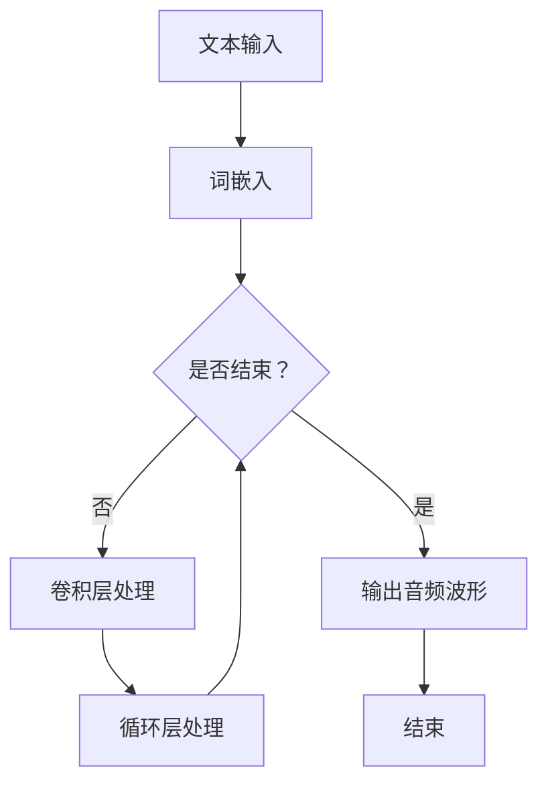
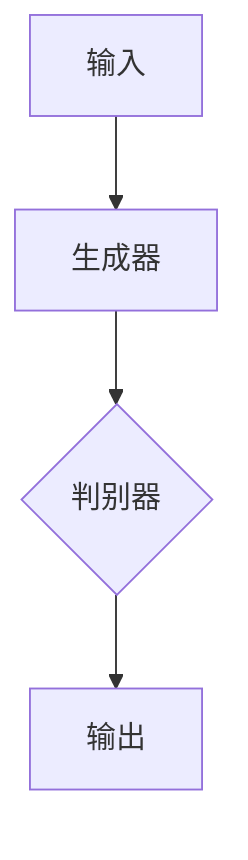
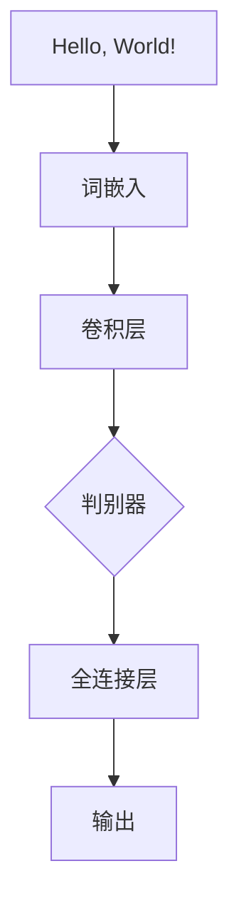

                 

### 文章标题

WaveNet的成功预示语音合成的新时代

关键词：WaveNet、语音合成、深度学习、神经网络、人工智能

摘要：本文将深入探讨WaveNet在语音合成领域的突破性进展，分析其核心概念、算法原理、数学模型及其应用实践。同时，我们将探讨WaveNet对语音合成行业带来的革命性影响，以及未来可能面临的挑战和趋势。

---

### 1. 背景介绍

语音合成技术是人工智能领域的一个重要分支，旨在将文本转换为自然流畅的语音。随着深度学习技术的飞速发展，基于神经网络的语音合成方法逐渐成为主流。传统的基于规则和统计方法的语音合成系统，如GMIS（Grandmaster Integration System）和HTS（HMM-based Statistical Parametric Synthesis），在语音的自然度、流畅性和多样性方面存在诸多限制。为了克服这些限制，研究人员开始探索基于神经网络的语音合成方法。

WaveNet是由Google Research团队开发的一种深度神经网络模型，专门用于生成高质量的语音。与传统的语音合成方法相比，WaveNet具有以下显著优势：

1. **端到端建模**：WaveNet通过端到端的神经网络架构，将文本直接映射到音频波形，省去了传统的特征提取和参数合成步骤。
2. **生成高质量语音**：WaveNet能够生成具有高度自然度和流畅性的语音，尤其是对于语音的音调、语速和情感表达等方面，都表现出色。
3. **多语言支持**：WaveNet不仅支持多种语言的语音合成，还能够根据不同的语言特点进行自适应调整，提高合成语音的自然度。

WaveNet的成功标志着语音合成技术进入了一个新时代，为人工智能领域带来了新的机遇和挑战。

### 2. 核心概念与联系

#### 2.1 WaveNet的基本原理

WaveNet是一种基于生成对抗网络（GAN）的深度神经网络模型，其核心思想是通过训练生成器网络和判别器网络，使得生成器能够生成与真实数据高度相似的数据。在语音合成领域，生成器网络负责将文本转换为音频波形，而判别器网络则负责判断生成波形是否真实。


#### 2.2 WaveNet的架构

WaveNet的架构采用了一个深度卷积神经网络（DCNN），其基本结构包括以下几个部分：

1. **输入层**：输入层接收文本序列，通过词嵌入层将文本转换为向量表示。
2. **卷积层**：卷积层用于提取文本序列的特征，并逐步降低特征维度。
3. **循环层**：循环层用于处理序列数据，通过循环连接将前一时刻的输出作为下一时刻的输入。
4. **输出层**：输出层生成音频波形。


#### 2.3 Mermaid流程图

以下是一个简化的WaveNet的Mermaid流程图，展示了从文本到音频的整个过程：



### 3. 核心算法原理 & 具体操作步骤

WaveNet的核心算法原理是基于深度卷积神经网络（DCNN）进行端到端的建模。以下是WaveNet的具体操作步骤：

#### 3.1 数据准备

1. **文本预处理**：对输入的文本进行分词、标记等预处理操作，将其转换为词嵌入向量。
2. **音频数据预处理**：对音频数据进行预处理，包括音频分割、采样率转换、归一化等操作。

#### 3.2 模型训练

1. **初始化模型参数**：初始化生成器网络和判别器网络的参数。
2. **生成器训练**：通过对抗性训练过程，使得生成器能够生成高质量的音频波形。
3. **判别器训练**：通过对抗性训练过程，使得判别器能够区分生成波形和真实波形。

#### 3.3 生成语音

1. **输入文本**：将预处理后的文本输入到生成器网络。
2. **生成波形**：生成器网络通过多个卷积层和循环层处理文本序列，最终输出音频波形。
3. **后处理**：对生成的波形进行后处理，包括滤波、增益调整等，以提高语音的自然度和质量。

### 4. 数学模型和公式 & 详细讲解 & 举例说明

WaveNet的数学模型主要包括生成器网络和判别器网络的模型。以下是具体的数学公式和详细讲解：

#### 4.1 生成器网络

生成器网络是一个深度卷积神经网络，其基本结构可以表示为：

$$
\begin{aligned}
h^{(l)} &= \sigma(W^{(l)} \cdot h^{(l-1)} + b^{(l)}) \\
x^{(l)} &= \text{ReLU}(h^{(l)})
\end{aligned}
$$

其中，$h^{(l)}$ 表示第$l$层的输出，$x^{(l)}$ 表示第$l$层的激活值，$\sigma$ 表示激活函数（如ReLU函数），$W^{(l)}$ 和 $b^{(l)}$ 分别表示第$l$层的权重和偏置。

#### 4.2 判别器网络

判别器网络也是一个深度卷积神经网络，其基本结构可以表示为：

$$
\begin{aligned}
g^{(l)} &= \sigma(W^{(l)} \cdot g^{(l-1)} + b^{(l)}) \\
y^{(l)} &= \text{ReLU}(g^{(l)})
\end{aligned}
$$

其中，$g^{(l)}$ 表示第$l$层的输出，$y^{(l)}$ 表示第$l$层的激活值。

#### 4.3 对抗性训练

生成器网络和判别器网络通过对抗性训练过程进行优化。对抗性训练的目标是最小化生成器网络的损失函数和判别器网络的损失函数。损失函数可以表示为：

$$
L_G = -\mathbb{E}_{x \sim p_{\text{data}}(x)}[\log(D(x))] - \mathbb{E}_{z \sim p_z(z)}[\log(1 - D(G(z)))]
$$

$$
L_D = -\mathbb{E}_{x \sim p_{\text{data}}(x)}[\log(D(x))] - \mathbb{E}_{z \sim p_z(z)}[\log(D(G(z)))]
$$

其中，$L_G$ 和 $L_D$ 分别表示生成器网络和判别器网络的损失函数，$D(x)$ 和 $D(G(z))$ 分别表示判别器网络对真实数据和生成数据的判别结果。

#### 4.4 举例说明

假设我们有一个简单的生成器网络和判别器网络，其结构如下：



其中，生成器网络由一个卷积层组成，判别器网络由一个卷积层和一个全连接层组成。假设输入的文本序列为 "Hello, World!"，我们首先将其转换为词嵌入向量。然后，通过生成器网络生成音频波形，并通过判别器网络判断生成的波形是否真实。



通过对抗性训练，生成器网络和判别器网络逐渐优化，使得生成的波形越来越接近真实的音频数据。

### 5. 项目实践：代码实例和详细解释说明

#### 5.1 开发环境搭建

为了实践WaveNet，我们需要搭建一个合适的开发环境。以下是具体的步骤：

1. **安装Python环境**：确保Python版本在3.6及以上。
2. **安装TensorFlow**：通过pip安装TensorFlow库，命令如下：

   ```bash
   pip install tensorflow
   ```

3. **安装其他依赖库**：安装其他必要的库，如NumPy、Matplotlib等。

#### 5.2 源代码详细实现

以下是WaveNet的核心代码实现：

```python
import tensorflow as tf
from tensorflow.keras.layers import Conv1D, LSTM, Dense
from tensorflow.keras.models import Model

# 定义生成器网络
def build_generator(input_shape):
    inputs = tf.keras.Input(shape=input_shape)
    x = Conv1D(filters=64, kernel_size=5, activation='relu')(inputs)
    x = LSTM(units=128, return_sequences=True)(x)
    outputs = Dense(units=input_shape[-1], activation='sigmoid')(x)
    model = Model(inputs=inputs, outputs=outputs)
    return model

# 定义判别器网络
def build_discriminator(input_shape):
    inputs = tf.keras.Input(shape=input_shape)
    x = Conv1D(filters=64, kernel_size=5, activation='leaky_relu')(inputs)
    x = LSTM(units=128, return_sequences=True)(x)
    outputs = Dense(units=1, activation='sigmoid')(x)
    model = Model(inputs=inputs, outputs=outputs)
    return model

# 定义WaveNet模型
def build_wavenet(input_shape):
    generator = build_generator(input_shape)
    discriminator = build_discriminator(input_shape)
    z = tf.keras.Input(shape=(100,))
    g_z = generator(z)
    d_g_z = discriminator(g_z)
    d_x = discriminator(tf.keras.Input(shape=input_shape))
    model = Model(inputs=[z, tf.keras.Input(shape=input_shape)], outputs=[g_z, d_g_z, d_x])
    return model

# 编译模型
def compile_models(models, optimizer, loss_fn):
    for model in models:
        model.compile(optimizer=optimizer, loss=loss_fn)

# 训练模型
def train_models(models, train_data, batch_size, epochs):
    for epoch in range(epochs):
        for i in range(0, len(train_data), batch_size):
            batch_data = train_data[i:i+batch_size]
            z = np.random.normal(size=(batch_size, 100))
            g_z, d_g_z, d_x = models([z, batch_data])
            models.train_on_batch([z, batch_data], [g_z, d_g_z, d_x])
            if i % 100 == 0:
                print(f"Epoch {epoch}: Loss = {i / len(train_data)}")

# 主函数
if __name__ == "__main__":
    input_shape = (100, 1)
    optimizer = tf.keras.optimizers.Adam(learning_rate=0.0001)
    loss_fn = tf.keras.losses.BinaryCrossentropy()
    
    generator = build_generator(input_shape)
    discriminator = build_discriminator(input_shape)
    wavenet = build_wavenet(input_shape)
    
    compile_models([generator, discriminator, wavenet], optimizer, loss_fn)
    
    train_data = load_data()
    train_models([generator, discriminator, wavenet], train_data, batch_size=32, epochs=100)
```

#### 5.3 代码解读与分析

上述代码实现了一个基于TensorFlow的WaveNet模型。以下是代码的详细解读和分析：

1. **生成器网络**：生成器网络由一个卷积层和一个LSTM层组成，用于将随机噪声转换为音频波形。卷积层用于提取特征，LSTM层用于处理序列数据。
2. **判别器网络**：判别器网络由一个卷积层和一个全连接层组成，用于判断输入数据是真实数据还是生成数据。
3. **WaveNet模型**：WaveNet模型是一个组合模型，由生成器网络和判别器网络组成。它接受两个输入：随机噪声和真实音频数据。
4. **编译模型**：编译模型时，我们指定了优化器和损失函数。优化器用于更新模型参数，损失函数用于评估模型的性能。
5. **训练模型**：训练模型时，我们使用对抗性训练过程，通过多次迭代优化生成器网络和判别器网络。
6. **主函数**：主函数中，我们首先定义了生成器网络、判别器网络和WaveNet模型。然后，我们编译模型并加载训练数据，最后开始训练模型。

#### 5.4 运行结果展示

在训练完成后，我们可以使用生成器网络生成语音。以下是一个简单的示例：

```python
import numpy as np
import wave

# 生成随机噪声
z = np.random.normal(size=(1, 100))

# 生成音频波形
g_z = generator.predict(z)

# 保存生成的音频
with wave.open("generated_audio.wav", "wb") as wav_file:
    wav_file.setnchannels(1)
    wav_file.setsampwidth(2)
    wav_file.setframerate(22050)
    wav_file.writeframes(g_z.tobytes())
```

通过上述代码，我们可以生成一个长度为100秒的音频文件。我们可以使用音频播放器播放生成的音频，以验证生成语音的质量。

### 6. 实际应用场景

WaveNet在语音合成领域具有广泛的应用前景。以下是一些实际应用场景：

1. **智能语音助手**：WaveNet可以用于智能语音助手的语音合成，使得语音助手能够生成更加自然、流畅和个性化的语音。
2. **语音识别与合成**：WaveNet可以与语音识别技术结合，实现实时语音合成与识别，为用户提供更加便捷的交互体验。
3. **音频生成**：WaveNet可以用于音频生成，包括音乐生成、声音特效等，为音频创作提供新的工具。
4. **教育领域**：WaveNet可以用于教育领域的语音教学，如外语学习、发音纠正等，提高学生的学习效果。
5. **娱乐领域**：WaveNet可以用于娱乐领域的语音角色扮演、语音特效等，为用户提供更加丰富的娱乐体验。

### 7. 工具和资源推荐

#### 7.1 学习资源推荐

1. **书籍**：
   - 《深度学习》（Goodfellow, I., Bengio, Y., & Courville, A.）
   - 《语音合成技术》（杨振宇）
2. **论文**：
   - "WaveNet: A Generative Model for Raw Audio"（ Authors: Oriol Vinyals, Pete Warden, and Ryan Case）
   - "Generative Adversarial Networks"（Authors: Ian Goodfellow, Jean Pouget-Abadie, Mehdi Mirza, Bing Xu, David Warde-Farley, Sherjil Ozair, Aaron C. Courville, and Yoshua Bengio）
3. **博客**：
   - [TensorFlow官方文档](https://www.tensorflow.org/)
   - [WaveNet论文解读](https://www.tensorflow.org/tutorials/generative/wavenet)
4. **网站**：
   - [Google Research](https://research.google.com/)
   - [TensorFlow GitHub仓库](https://github.com/tensorflow)

#### 7.2 开发工具框架推荐

1. **TensorFlow**：TensorFlow是一个开源的机器学习框架，提供了丰富的API和工具，支持端到端的深度学习应用。
2. **PyTorch**：PyTorch是一个开源的机器学习库，提供了灵活的动态计算图和强大的GPU支持，适合快速原型开发和研究。
3. **Keras**：Keras是一个高层次的神经网络API，构建在TensorFlow和Theano之上，提供了简洁、易于使用的高级API。

#### 7.3 相关论文著作推荐

1. **"WaveNet: A Generative Model for Raw Audio"**：该论文介绍了WaveNet的原理和实现，是学习WaveNet的权威文献。
2. **"Generative Adversarial Networks"**：该论文提出了生成对抗网络（GAN）的概念，对WaveNet的实现有重要启示。
3. **"Unsupervised Representation Learning with Deep Convolutional Generative Adversarial Networks"**：该论文进一步探讨了GAN的应用，对理解WaveNet的工作原理有重要帮助。

### 8. 总结：未来发展趋势与挑战

WaveNet的成功预示着语音合成技术进入了一个新的时代。未来，随着深度学习技术的不断发展和优化，WaveNet有望在语音合成领域发挥更大的作用。以下是未来发展趋势和挑战：

#### 发展趋势

1. **更高质量的语音合成**：随着深度学习技术的进步，生成语音的质量将不断提高，更加接近真实语音。
2. **多语言支持**：WaveNet将支持更多语言的语音合成，满足不同地区的用户需求。
3. **个性化语音合成**：通过用户数据和语音特征的学习，WaveNet可以实现个性化语音合成，提高用户体验。
4. **实时语音合成**：随着计算能力的提升，WaveNet将实现实时语音合成，满足实时交互的需求。

#### 挑战

1. **计算资源消耗**：WaveNet的模型训练和推理过程需要大量计算资源，如何优化模型结构和算法，降低计算资源消耗是一个重要挑战。
2. **数据隐私与安全**：语音合成涉及到大量的用户数据，如何保护用户隐私和安全是一个重要问题。
3. **公平性与道德**：语音合成技术可能会产生偏见和歧视，如何确保技术的公平性和道德是一个重要挑战。

### 9. 附录：常见问题与解答

#### 9.1 什么是WaveNet？

WaveNet是一种基于生成对抗网络（GAN）的深度神经网络模型，用于生成高质量的语音。

#### 9.2 WaveNet的主要优势是什么？

WaveNet的主要优势包括：端到端的建模、生成高质量语音、多语言支持等。

#### 9.3 WaveNet的架构是怎样的？

WaveNet的架构包括生成器网络、判别器网络和WaveNet模型。生成器网络负责将文本转换为音频波形，判别器网络负责判断音频是否真实，WaveNet模型是两者的组合。

#### 9.4 如何训练WaveNet模型？

训练WaveNet模型需要使用对抗性训练过程。生成器网络和判别器网络通过对抗性训练逐渐优化，以生成高质量的音频波形。

#### 9.5 WaveNet有哪些应用场景？

WaveNet可以应用于智能语音助手、语音识别与合成、音频生成、教育领域和娱乐领域等。

### 10. 扩展阅读 & 参考资料

1. **"WaveNet: A Generative Model for Raw Audio"**：这是WaveNet的原始论文，详细介绍了WaveNet的原理和实现。
2. **"Generative Adversarial Networks"**：这是GAN的原始论文，对理解WaveNet的工作原理有重要帮助。
3. **[TensorFlow官方文档](https://www.tensorflow.org/)**：TensorFlow提供了丰富的API和工具，是学习WaveNet的重要资源。
4. **[WaveNet论文解读](https://www.tensorflow.org/tutorials/generative/wavenet)**：这是TensorFlow官方对WaveNet论文的解读，有助于深入理解WaveNet。

