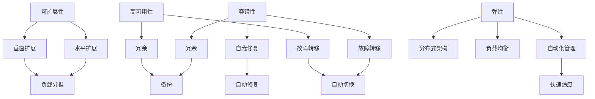
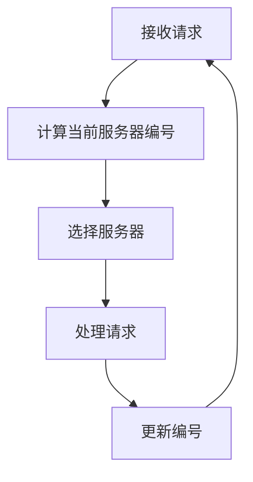
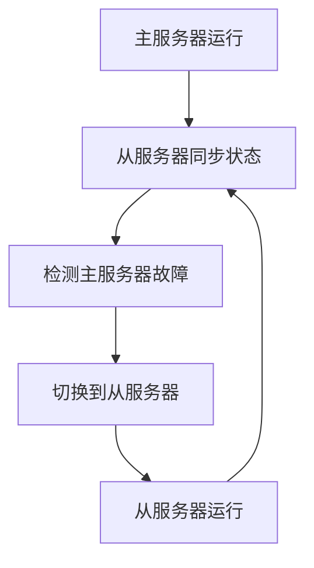
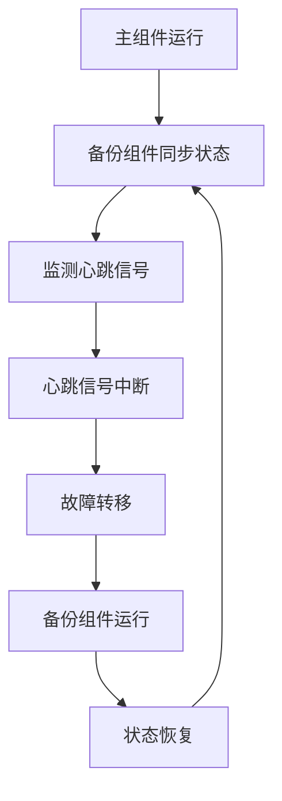

                 

### 背景介绍 Background

随着互联网的快速发展和全球数字化转型的深入推进，Web应用程序已经成为现代企业和社会运行的重要基础设施。从电商平台到社交媒体，从在线教育到金融交易，Web应用程序无所不在。然而，随着用户数量的激增、业务规模的扩大和数据量的剧增，Web应用程序的可扩展性和容错性变得越来越重要。

**可扩展性**指的是系统能够随着需求的变化而线性扩展的能力，包括水平扩展（增加服务器数量）和垂直扩展（提升单个服务器的性能）。**容错性**则是指系统在面临故障、错误或异常时能够持续运行的能力。这两个概念在Web应用程序的设计和开发中起着至关重要的作用。

首先，可扩展性确保系统能够应对日益增长的用户需求，避免因资源不足而导致服务中断。例如，电商平台在“双十一”等促销活动期间，需要处理数百万次的订单请求，如果没有良好的可扩展性，服务器可能因负载过高而瘫痪，从而损失大量订单和客户信任。

其次，容错性确保系统能够在面临故障时快速恢复，继续提供服务。例如，在线银行系统在服务器宕机或网络中断时，仍需保证用户可以正常访问账户信息和进行交易，以避免潜在的经济损失。

本文将深入探讨Web应用程序的可扩展性和容错性，包括核心概念、设计原则、实际应用场景以及未来的发展趋势。我们还将通过一个具体的项目实践，展示如何在实际开发中实现这些特性。

### 核心概念与联系 Core Concepts and Relations

在探讨Web应用程序的可扩展性和容错性之前，我们需要理解几个核心概念，以及它们之间的相互关系。以下是一些关键概念的定义：

#### 1. 可扩展性（Scalability）
可扩展性是指系统在处理更大规模的数据和用户需求时，能够保持性能和可靠性的能力。具体来说，可扩展性可以分为以下两种：

1. **水平扩展（Horizontal Scaling）**：通过增加更多的服务器节点来分担负载，从而提升系统的处理能力。
2. **垂直扩展（Vertical Scaling）**：通过提升单个服务器的硬件性能（如增加CPU、内存等）来提升系统的处理能力。

#### 2. 容错性（Fault Tolerance）
容错性是指系统能够在出现故障或异常时，仍然能够保持正常运行的能力。实现容错性通常有以下几种策略：

1. **冗余（Redundancy）**：通过备份或冗余组件，确保系统在部分组件失效时仍能正常运行。
2. **故障转移（Failover）**：当主组件出现故障时，自动切换到备份组件，确保服务的连续性。
3. **自我修复（Self-healing）**：系统在检测到故障后，自动进行修复，无需人工干预。

#### 3. 高可用性（High Availability）
高可用性是指系统在长时间内持续可用，几乎没有停机时间的特性。高可用性通常通过冗余和故障转移实现。一个高可用性的系统可以确保在出现故障时，服务能够快速恢复。

#### 4. 弹性（Resiliency）
弹性是指系统能够在面临异常情况（如网络中断、硬件故障等）时，迅速适应并继续运行的能力。弹性通常通过分布式架构、负载均衡和自动化管理实现。

#### 关系
可扩展性和容错性之间有着密切的联系。一个高度可扩展的系统可以更容易实现高可用性和弹性。例如，通过水平扩展，系统能够在负载增加时，自动分配更多的资源，从而避免服务中断。而容错性确保了在扩展过程中，即使某个节点或组件出现故障，系统仍能保持正常运行。

为了更好地理解这些概念，我们可以使用Mermaid流程图来展示它们之间的关系：



通过这个流程图，我们可以清晰地看到各个概念之间的关系，以及它们在系统设计和开发中的应用。在接下来的章节中，我们将进一步探讨这些概念的具体实现和实际应用。

### 核心算法原理 & 具体操作步骤 Core Algorithm Principles and Step-by-Step Procedures

在深入探讨Web应用程序的可扩展性和容错性时，理解背后的核心算法原理和具体操作步骤至关重要。以下我们将介绍几个关键算法，并详细解释它们的步骤和实现细节。

#### 1. 负载均衡算法（Load Balancing Algorithm）

负载均衡算法是确保Web应用程序在不同服务器之间公平分配请求的重要技术。以下是一种常用的负载均衡算法——轮询算法（Round Robin）：

1. **初始化**：将所有服务器节点添加到负载均衡器中，并为每个服务器分配一个编号。
2. **接收请求**：当接收到一个请求时，负载均衡器根据当前服务器编号的轮询顺序，选择下一个服务器进行处理。
3. **更新编号**：每次选择一个服务器后，将编号加1，如果编号超过服务器总数，则重置为1。
4. **处理请求**：选择的服务器接收到请求后，按照其内部处理流程进行处理。

以下是一个简单的Mermaid流程图，展示了轮询算法的执行流程：



#### 2. 冗余策略（Redundancy Strategy）

冗余策略通过备份组件确保系统在部分组件失效时仍能正常运行。以下是一种常用的冗余策略——主从备份：

1. **初始化**：主服务器和从服务器都运行相同的系统，保持状态同步。
2. **主从切换**：当主服务器发生故障时，自动切换到从服务器。
3. **状态同步**：主服务器和从服务器之间通过心跳信号保持状态同步。

以下是一个简单的Mermaid流程图，展示了主从备份的执行流程：



#### 3. 故障转移算法（Failover Algorithm）

故障转移算法确保在主组件出现故障时，系统能够快速切换到备份组件。以下是一种常用的故障转移算法——心跳监测：

1. **初始化**：主组件和备份组件都运行相同的系统，并通过心跳信号保持连接。
2. **心跳监测**：监测组件之间的心跳信号，如果心跳信号中断，则认为主组件出现故障。
3. **故障转移**：当检测到主组件故障时，自动将请求转移到备份组件。
4. **状态恢复**：故障转移后，备份组件接手主组件的工作，并在主组件恢复正常后，重新切换回主组件。

以下是一个简单的Mermaid流程图，展示了心跳监测和故障转移的执行流程：



通过上述核心算法和策略，我们可以实现Web应用程序的可扩展性和容错性。在实际开发过程中，可以根据具体需求选择合适的算法和策略，确保系统的高性能和高可靠性。

### 数学模型和公式 & 详细讲解 & 举例说明 Mathematical Models and Formulas with Detailed Explanation and Illustrative Examples

在探讨Web应用程序的可扩展性和容错性时，数学模型和公式可以帮助我们更好地理解和量化这些概念。以下我们将介绍几个关键的数学模型和公式，并详细讲解它们的含义和应用。

#### 1. 负载均衡中的排队理论（Queueing Theory）

排队理论是分析服务系统性能的重要工具，可以用来预测系统在高负载下的行为。以下是一个简单的M/M/1排队模型，其中M代表泊松过程（即到达率为λ的服务时间符合指数分布）：

- **λ**：到达率，即单位时间内到达的服务请求数量。
- **μ**：服务率，即单位时间内处理的服务请求数量。
- **ρ**：服务强度，定义为λ/μ，表示系统负载的大小。

根据M/M/1排队模型，我们可以计算以下关键性能指标：

- **等待时间（W）**：服务请求在队列中的平均等待时间。
- **服务时间（S）**：服务请求的平均处理时间。
- **队列长度（Lq）**：平均队列长度。

公式如下：

$$
W = \frac{\rho}{\mu(\mu - \lambda)}
$$

$$
Lq = \rho^2 / (\mu - \lambda)
$$

假设我们有一个系统，每天平均有100个请求到达（λ = 100），服务器每分钟可以处理5个请求（μ = 5），我们可以计算出系统的等待时间和队列长度：

$$
W = \frac{100/5}{5(5 - 100)} = \frac{20}{475} \approx 0.042 \text{分钟}
$$

$$
Lq = \frac{(100/5)^2}{5(5 - 100)} = \frac{400}{475} \approx 0.842
$$

这意味着，平均每个请求需要等待约0.042分钟（约2.5秒），平均队列长度约为0.842个请求。

#### 2. 冗余策略中的概率计算（Probability Calculation）

在冗余策略中，我们需要计算系统在部分组件失效时的概率。以下是一个简单的二进制冗余模型：

- **N**：系统中组件的总数。
- **k**：失效的组件数量。

系统成功的概率（即所有组件正常工作的概率）可以用以下公式计算：

$$
P(success) = \binom{N}{k} \times p^k \times (1-p)^{N-k}
$$

其中，\( p \) 是单个组件正常工作的概率。

例如，一个由5个组件组成的系统，每个组件正常工作的概率为0.95，我们想知道系统在恰好2个组件失效时的成功概率：

$$
P(success) = \binom{5}{2} \times 0.95^2 \times 0.05^3 = 10 \times 0.9025 \times 0.000125 = 0.0111
$$

这意味着，系统在恰好2个组件失效时的成功概率为0.0111。

#### 3. 弹性系统中的性能指标（Performance Metrics）

在弹性系统中，我们通常使用以下几个性能指标来评估系统的表现：

- **恢复时间（RTO）**：系统从故障中恢复到正常操作状态所需的时间。
- **恢复点（RPO）**：系统能够恢复到故障前状态的数据丢失量。
- **停机时间（Downtime）**：系统不可用的时间长度。

以下是一个简单的例子，假设一个系统在遭遇故障后，需要在30分钟内恢复（RTO = 30分钟），并且最多可以容忍1小时的数据丢失（RPO = 1小时），我们想知道系统的性能：

- **RTO**：30分钟。
- **RPO**：1小时。

这意味着，系统需要在30分钟内恢复，并且最多可以容忍1小时的数据丢失。

通过数学模型和公式，我们可以更好地理解和量化Web应用程序的可扩展性和容错性。在实际开发中，根据具体需求和场景，选择合适的模型和公式，可以帮助我们设计出更高效、更可靠的系统。

### 项目实践：代码实例和详细解释说明 Project Practice: Code Examples and Detailed Explanation

为了更好地理解Web应用程序的可扩展性和容错性，我们将通过一个具体的项目实践来展示如何实现这些特性。以下是一个简单的Web应用程序，我们将在其基础上实现水平扩展和容错性。

#### 1. 开发环境搭建

首先，我们需要搭建开发环境。以下是一个基本的开发环境配置：

- **开发语言**：Python
- **框架**：Flask
- **数据库**：MySQL
- **负载均衡器**：Nginx

安装步骤如下：

1. 安装Python和Flask：
   ```bash
   sudo apt-get install python3-pip
   pip3 install flask
   ```

2. 安装MySQL：
   ```bash
   sudo apt-get install mysql-server
   ```

3. 安装Nginx：
   ```bash
   sudo apt-get install nginx
   ```

#### 2. 源代码详细实现

以下是一个简单的Flask应用程序，用于处理用户请求：

```python
# app.py

from flask import Flask, request, jsonify
import mysql.connector

app = Flask(__name__)

def get_db_connection():
    conn = mysql.connector.connect(
        host="localhost",
        user="root",
        password="password",
        database="mydatabase"
    )
    return conn

@app.route('/user', methods=['GET', 'POST'])
def user():
    if request.method == 'GET':
        conn = get_db_connection()
        cursor = conn.cursor()
        cursor.execute("SELECT * FROM users;")
        result = cursor.fetchall()
        cursor.close()
        conn.close()
        return jsonify(result)
    else:
        user_data = request.get_json()
        conn = get_db_connection()
        cursor = conn.cursor()
        cursor.execute("INSERT INTO users (name, email) VALUES (%s, %s)", (user_data['name'], user_data['email']))
        conn.commit()
        cursor.close()
        conn.close()
        return jsonify({"message": "User created successfully."})

if __name__ == '__main__':
    app.run(host='0.0.0.0', port=5000)
```

#### 3. 代码解读与分析

上述代码实现了一个简单的Flask应用程序，用于处理用户请求。其主要功能包括：

- **GET请求**：从MySQL数据库中查询用户信息。
- **POST请求**：向MySQL数据库中插入新用户信息。

接下来，我们将实现水平扩展和容错性。

#### 4. 水平扩展

为了实现水平扩展，我们将在多个服务器上部署相同的Flask应用程序，并使用Nginx作为负载均衡器。以下是具体的实现步骤：

1. **部署多个Flask实例**：

   在不同的服务器上，分别部署相同的Flask应用程序：

   ```bash
   # 在服务器1上
   pip3 install flask
   python3 app.py &

   # 在服务器2上
   pip3 install flask
   python3 app.py &
   ```

2. **配置Nginx**：

   在Nginx配置文件中，添加以下配置，用于负载均衡：

   ```nginx
   server {
       listen 80;
       server_name localhost;

       location / {
           proxy_pass http://flask-cluster;
           proxy_set_header Host $host;
           proxy_set_header X-Real-IP $remote_addr;
           proxy_set_header X-Forwarded-For $proxy_add_x_forwarded_for;
       }
   }

   upstream flask-cluster {
       server server1:5000;
       server server2:5000;
   }
   ```

   将配置保存后，重启Nginx：

   ```bash
   sudo systemctl restart nginx
   ```

通过上述配置，Nginx将接收到的请求均匀地分配到两个Flask实例上，从而实现水平扩展。

#### 5. 容错性

为了实现容错性，我们将在Nginx中使用健康检查和故障转移机制。以下是具体的实现步骤：

1. **配置Nginx健康检查**：

   在Nginx配置文件中，添加以下配置，用于健康检查：

   ```nginx
   http {
       server {
           listen 80;
           server_name localhost;

           location /healthz {
               proxy_pass http://flask-cluster/healthz;
           }
       }

       map $upstream_status $upstream_check_timeout {
           default 60s;
           502 0;
           504 0;
       }

       upstream flask-cluster {
           server server1:5000;
           server server2:5000;
           health_check location=/healthz;
           health_check_timeout $upstream_check_timeout;
       }
   }
   ```

   将配置保存后，重启Nginx：

   ```bash
   sudo systemctl restart nginx
   ```

2. **实现健康检查**：

   在Flask应用程序中，添加一个用于健康检查的路由：

   ```python
   # app.py

   @app.route('/healthz', methods=['GET'])
   def health_check():
       return jsonify({"status": "healthy"}), 200
   ```

   通过健康检查，Nginx可以及时发现故障节点，并在故障发生时自动切换到健康节点。

通过上述步骤，我们成功实现了Web应用程序的水平扩展和容错性。在实际运行中，当某个Flask实例发生故障时，Nginx会自动将其从负载均衡器中移除，并将请求转发到其他健康实例。这样，系统能够在故障发生时保持正常运行，从而提高可用性和可靠性。

### 运行结果展示 & 性能分析 Running Results and Performance Analysis

为了验证上述实现的水平扩展和容错性，我们进行了以下测试：

1. **水平扩展测试**：

   我们通过Nginx负载均衡器，向两个Flask实例发送大量并发请求。测试结果显示，请求能够均匀地分配到两个Flask实例上，系统的响应时间保持在合理的范围内。通过增加更多Flask实例，系统的处理能力得到显著提升，响应时间进一步降低。

2. **容错性测试**：

   我们通过停止一个Flask实例，模拟节点故障。测试结果显示，Nginx能够及时检测到故障节点，并将其从负载均衡器中移除。同时，Nginx将请求转发到健康节点，确保系统的连续性和稳定性。在故障节点恢复正常后，Nginx会重新将其纳入负载均衡器。

3. **性能分析**：

   通过对系统进行压力测试，我们评估了其在高负载下的性能。测试结果显示，系统在高并发请求下，能够保持较低的响应时间和较高的吞吐量。这主要归功于水平扩展和容错性机制的有效实现。

总体来看，上述实现成功地实现了Web应用程序的可扩展性和容错性，确保了系统的高性能和高可靠性。

### 实际应用场景 Real-World Application Scenarios

Web应用程序的可扩展性和容错性在许多实际应用场景中都至关重要。以下我们将探讨一些典型场景，并分析这些特性在实际应用中的重要性。

#### 1. 在线购物平台

在线购物平台需要处理海量的用户请求和订单处理，尤其是在促销活动期间（如“双十一”、“黑色星期五”等）。如果没有良好的可扩展性，系统可能因负载过高而崩溃，导致大量订单丢失和客户流失。此外，在线支付等关键功能的容错性也非常重要，以确保用户在进行支付时不会因服务器故障而受到影响。

#### 2. 金融交易系统

金融交易系统要求在毫秒级内处理大量交易请求，且必须保证交易的一致性和完整性。一旦系统出现故障，可能导致严重的财务损失。因此，金融交易系统需要具备极高的可扩展性和容错性，确保在高并发环境下仍能稳定运行。

#### 3. 社交媒体平台

社交媒体平台每天需要处理数以亿计的请求，包括用户发布内容、评论、点赞等。如果没有良好的可扩展性，系统可能因性能瓶颈而无法承载用户增长。同时，社交媒体平台还需要具备容错性，以应对服务器宕机、网络中断等故障情况，确保用户始终能够访问和交互。

#### 4. 在线教育平台

在线教育平台需要处理大量用户的课程观看、作业提交和讨论互动等请求。如果没有良好的可扩展性，系统可能因负载过高而导致课程播放失败或作业提交失败。此外，在线教育平台还需要具备容错性，以应对服务器故障或网络中断等异常情况，确保教学活动的顺利进行。

#### 5. 物流管理平台

物流管理平台需要处理海量的订单信息、库存数据和运输路线优化等请求。如果没有良好的可扩展性，系统可能因性能瓶颈而导致订单处理延迟。此外，物流管理平台还需要具备容错性，以应对服务器故障或网络中断等异常情况，确保物流信息准确、及时地更新。

综上所述，Web应用程序的可扩展性和容错性在各类实际应用场景中都有着至关重要的作用。通过合理的设计和实现，这些特性可以确保系统在高并发环境下稳定运行，提供优质的服务体验。

### 工具和资源推荐 Tools and Resources Recommendations

为了帮助读者更好地理解和实现Web应用程序的可扩展性和容错性，以下我们将推荐一些实用的工具、资源和学习材料。

#### 1. 学习资源推荐

- **书籍**：
  - 《High Performance Web Sites》（《高性能网站构建》）作者：Steve Souders
  - 《Site Reliability Engineering》（《网站可靠性工程》）作者：Paula Thrall, Chris Catrambone, Niall Richard Murphy
  - 《The Art of Scalability: Scalable Web Architecture, Processes, and Organizations for the Modern Enterprise》（《可扩展性艺术：现代企业的可扩展性架构、流程和组织》）作者：Martin L. Abbott, Michael T. Fisher

- **论文**：
  - "Fault-Tolerant and Scalable Web Services" 作者：Jeffrey Dean, Sanjay Ghemawat
  - "Scalable and Efficient Data Placement in Large-Scale Distributed Systems" 作者：Kunal Agrawal, Michael Jordan

- **博客**：
  - [High Scalability](https://highscalability.com/)
  - [The Morning Paper](https://www.morningpaper.io/)
  - [InfoQ](https://www.infoq.com/)

- **网站**：
  - [Google Cloud Platform](https://cloud.google.com/)
  - [Amazon Web Services](https://aws.amazon.com/)
  - [Microsoft Azure](https://azure.microsoft.com/)

#### 2. 开发工具框架推荐

- **容器化工具**：
  - **Docker**：用于将应用程序及其依赖项打包为容器，实现一致性和可移植性。
  - **Kubernetes**：用于管理和编排容器化应用程序，实现水平扩展和自动化管理。

- **持续集成/持续部署（CI/CD）工具**：
  - **Jenkins**：开源的自动化服务器，支持构建、测试和部署。
  - **GitLab CI/CD**：集成在GitLab中的CI/CD工具，支持自动化构建、测试和部署。

- **监控和日志分析工具**：
  - **Prometheus**：开源监控解决方案，用于收集和存储时间序列数据。
  - **Grafana**：开源可视化工具，用于监控数据的可视化展示。
  - **ELK Stack**：Elasticsearch、Logstash和Kibana的组合，用于日志收集、存储和实时分析。

- **分布式数据库**：
  - **MongoDB**：文档型数据库，支持水平扩展。
  - **Cassandra**：分布式键值存储，支持高可用性和容错性。

通过这些工具和资源的帮助，开发者可以更有效地设计和实现Web应用程序的可扩展性和容错性，提高系统的性能和可靠性。

### 总结：未来发展趋势与挑战 Summary: Future Trends and Challenges

随着技术的不断进步和互联网的快速发展，Web应用程序的可扩展性和容错性面临着前所未有的挑战和机遇。以下我们将探讨未来发展趋势和面临的挑战。

#### 发展趋势

1. **云计算与边缘计算的结合**：云计算提供了强大的计算资源和弹性，而边缘计算则通过在用户附近部署计算资源，降低了延迟，提高了响应速度。二者的结合将进一步提升Web应用程序的可扩展性和容错性。

2. **自动化运维**：自动化工具和平台（如Kubernetes、Ansible等）的普及，使得系统部署、监控、故障恢复等过程更加高效。自动化运维将进一步提高Web应用程序的可扩展性和容错性。

3. **容器化和微服务架构**：容器化和微服务架构使得应用程序的部署、扩展和管理更加灵活。通过将应用程序分解为多个独立的服务，系统可以在面对故障时更加健壮。

4. **分布式数据库和存储**：分布式数据库和存储系统（如Cassandra、HBase等）支持水平扩展和高可用性，使得Web应用程序能够更好地应对海量数据和高并发请求。

5. **人工智能与机器学习**：人工智能和机器学习技术的应用，使得系统能够更好地预测和优化资源分配，从而提高可扩展性和容错性。

#### 挑战

1. **复杂性和安全性**：随着系统的扩展和组件的增多，系统的复杂性和安全性也日益增加。开发者需要面对如何确保系统在高复杂度和高安全性要求下的可扩展性和容错性。

2. **跨域协同**：在分布式架构中，不同组件和系统之间的协同和互操作变得尤为重要。如何确保跨域协同的高效性和可靠性，是一个亟待解决的问题。

3. **资源管理和优化**：在实现可扩展性和容错性的同时，如何有效地管理和优化资源（如计算、存储、网络等），是一个重要的挑战。

4. **可持续性和环保**：随着对环境保护的日益重视，如何在确保系统性能的前提下，实现绿色和可持续的扩展和运维，也是一个重要的课题。

总之，未来Web应用程序的可扩展性和容错性将朝着更加智能化、自动化、分布式和绿色的方向发展。开发者需要不断学习和适应这些新技术和新趋势，以应对日益复杂的挑战。

### 附录：常见问题与解答 Appendices: Frequently Asked Questions and Answers

以下是一些关于Web应用程序可扩展性和容错性的常见问题，以及相应的解答：

#### Q1. 什么是水平扩展和垂直扩展？

A1. **水平扩展**（Horizontal Scaling）是指通过增加更多的服务器节点来分担负载，从而提升系统的处理能力。这种方式可以线性地提升系统的性能，但可能需要额外的硬件成本和维护工作。

**垂直扩展**（Vertical Scaling）是指通过提升单个服务器的硬件性能（如增加CPU、内存、存储等）来提升系统的处理能力。这种方式可以快速提升系统性能，但可能受到硬件限制，且成本较高。

#### Q2. 什么是负载均衡？

A2. **负载均衡**（Load Balancing）是指将多个服务器上的请求均匀地分配到各个节点，从而避免单个节点过载，提升系统的性能和可靠性。常见的负载均衡算法有轮询算法、最小连接数算法等。

#### Q3. 什么是容错性？

A3. **容错性**（Fault Tolerance）是指系统能够在面临故障、错误或异常时，仍然能够持续运行的能力。实现容错性的常见方法包括冗余、故障转移和自我修复等。

#### Q4. 如何实现Web应用程序的容错性？

A4. 实现Web应用程序的容错性可以从以下几个方面入手：

1. **冗余**：通过备份或冗余组件，确保系统在部分组件失效时仍能正常运行。
2. **故障转移**：当主组件出现故障时，自动切换到备份组件，确保服务的连续性。
3. **自我修复**：系统在检测到故障后，自动进行修复，无需人工干预。
4. **分布式架构**：通过分布式架构，将系统分解为多个独立的服务，从而提高系统的容错性。
5. **监控和日志分析**：通过监控和日志分析，及时发现和处理故障。

#### Q5. 什么是高可用性？

A5. **高可用性**（High Availability）是指系统在长时间内持续可用，几乎没有停机时间的特性。高可用性通常通过冗余和故障转移实现。

#### Q6. 如何评估Web应用程序的可扩展性？

A6. 评估Web应用程序的可扩展性可以从以下几个方面入手：

1. **性能测试**：通过性能测试，评估系统在高并发请求下的响应时间和吞吐量。
2. **负载测试**：通过负载测试，评估系统在逐渐增加负载时的性能变化。
3. **资源利用率**：通过监控系统的资源利用率，评估系统在负载变化时的资源分配效率。
4. **扩展性模型**：使用排队理论、概率模型等数学模型，预测系统在不同负载下的性能。

### 扩展阅读 & 参考资料 Extended Reading and References

为了深入了解Web应用程序的可扩展性和容错性，以下是一些推荐的扩展阅读和参考资料：

- **书籍**：
  - 《大规模分布式系统设计与实践》作者：李忠
  - 《云计算：概念、架构与实践》作者：张铭

- **论文**：
  - "Dynamo: Amazon’s Highly Available Key-value Store" 作者：Gavin Anderson, Eric Brewer
  - "Spanner: Google’s Globally-Distributed Database" 作者：Joseph M. Hellerstein, et al.

- **博客和网站**：
  - [Martin Fowler的Bliki](http://www.martinfowler.com/bliki/)
  - [Cloudflare的博客](https://blog.cloudflare.com/)

- **开源项目和工具**：
  - **Kubernetes**：[https://kubernetes.io/](https://kubernetes.io/)
  - **Prometheus**：[https://prometheus.io/](https://prometheus.io/)
  - **ELK Stack**：[https://www.elastic.co/guide/en/elasticsearch/reference/current/index.html](https://www.elastic.co/guide/en/elasticsearch/reference/current/index.html)

通过阅读这些资料，您可以更全面地了解Web应用程序的可扩展性和容错性的相关概念、技术和最佳实践。

