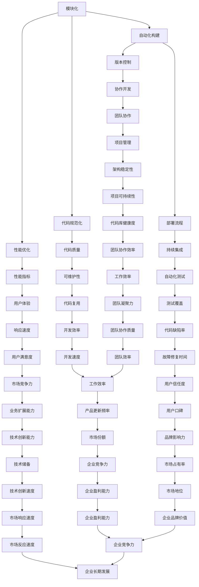

                 

### 背景介绍

Web前端工程化，是指在Web前端开发过程中，通过一系列的工具和流程，提高代码的可维护性、可扩展性和性能。随着互联网的快速发展，Web前端应用日益复杂，传统的开发模式已难以满足现代Web应用的需求。因此，前端工程化应运而生，成为了提升前端开发效率和质量的关键手段。

本文旨在探讨Web前端工程化的最佳实践，通过对核心概念、算法原理、数学模型、项目实践以及应用场景的深入分析，为广大开发者提供一套系统化、高效化的开发方案。文章结构如下：

1. **背景介绍**：阐述Web前端工程化的意义和重要性。
2. **核心概念与联系**：介绍Web前端工程化的核心概念，并通过Mermaid流程图展示其架构。
3. **核心算法原理与具体操作步骤**：详细解析前端工程化的核心算法原理和操作步骤。
4. **数学模型和公式**：探讨前端工程化中的数学模型和公式，并结合实际案例进行讲解。
5. **项目实践**：通过具体代码实例，展示前端工程化的实际应用。
6. **实际应用场景**：分析前端工程化在不同场景下的应用效果。
7. **工具和资源推荐**：推荐相关学习资源和开发工具框架。
8. **总结**：总结前端工程化的未来发展趋势和挑战。
9. **附录**：解答常见问题并提供扩展阅读资源。

接下来，我们将逐一探讨这些章节的内容，帮助读者全面了解并掌握Web前端工程化的最佳实践。

### 核心概念与联系

Web前端工程化的核心概念主要包括模块化、自动化构建、代码规范化、性能优化、版本控制和部署流程等。这些概念相互联系，共同构成了一个完整的前端工程化体系。

为了更好地理解这些概念之间的关系，我们可以通过Mermaid流程图来展示其架构。以下是核心概念与联系的Mermaid流程图：



通过这个Mermaid流程图，我们可以清晰地看到Web前端工程化的各个核心概念如何相互联系，共同推动前端开发效率和质量的提升。下面，我们将详细解析这些概念及其具体操作步骤。

### 核心算法原理与具体操作步骤

#### 模块化

模块化是前端工程化的基础，它将代码分割成多个独立的模块，便于管理、维护和复用。常见的模块化方法包括CommonJS、AMD、CMD和ES6模块。

**具体操作步骤：**

1. 使用模块化语法定义模块。以CommonJS为例，模块通过`exports`导出，通过`require`导入。

```javascript
// 模块A.js
exports.sayHello = function() {
    console.log("Hello!");
};

// 模块B.js
var hello = require('./A');
hello.sayHello();
```

2. 使用模块打包工具，如Webpack，将各个模块打包成一个或多个文件。Webpack通过配置文件`webpack.config.js`定义入口和出口。

```javascript
// webpack.config.js
module.exports = {
    entry: './src/index.js',
    output: {
        filename: 'bundle.js',
        path: __dirname + '/dist'
    }
};
```

3. 使用Babel将ES6模块编译成兼容的CommonJS模块，以便在旧的浏览器中运行。

```bash
npx babel src --out-dir dist --source-maps
```

#### 自动化构建

自动化构建是通过工具自动执行构建过程，包括代码编译、压缩、合并等。Gulp和Grunt是两种常见的自动化构建工具。

**具体操作步骤：**

1. 安装Gulp或Grunt。

```bash
npm install --save-dev gulp
```

2. 配置Gulp或Grunt任务。以Gulp为例，创建一个`gulpfile.js`文件。

```javascript
// gulpfile.js
const gulp = require('gulp');
const babel = require('gulp-babel');
const uglify = require('gulp-uglify');
const sass = require('gulp-sass');

gulp.task('babel', function() {
    return gulp.src('src/**/*.js')
        .pipe(babel())
        .pipe(gulp.dest('dist'));
});

gulp.task('uglify', function() {
    return gulp.src('src/**/*.js')
        .pipe(babel())
        .pipe(uglify())
        .pipe(gulp.dest('dist'));
});

gulp.task('sass', function() {
    return gulp.src('src/**/*.scss')
        .pipe(sass().on('error', sass.logError))
        .pipe(gulp.dest('dist'));
});

gulp.task('default', ['babel', 'uglify', 'sass']);
```

3. 运行Gulp或Grunt任务进行构建。

```bash
gulp
```

#### 代码规范化

代码规范化是通过工具检查和格式化代码，确保代码风格一致，提高可读性和可维护性。ESLint和Prettier是两种常用的代码规范化工具。

**具体操作步骤：**

1. 安装ESLint和Prettier。

```bash
npm install --save-dev eslint prettier
```

2. 配置ESLint和Prettier。创建一个`.eslintrc`文件。

```json
{
    "extends": "eslint:recommended",
    "rules": {
        "indent": ["error", 2],
        "linebreak-style": ["error", "unix"],
        "quotes": ["error", "double"],
        "semi": ["error", "always"]
    }
}
```

3. 配置Prettier。创建一个`.prettierrc`文件。

```json
{
    "semi": true,
    "trailingComma": "es5",
    "singleQuote": true
}
```

4. 在`package.json`中添加`lint`和`format`脚本。

```json
{
    "scripts": {
        "lint": "eslint src/**/*.js",
        "format": "prettier --write src/**/*.js"
    }
}
```

5. 运行`lint`和`format`脚本进行代码检查和格式化。

```bash
npm run lint
npm run format
```

#### 性能优化

性能优化是通过优化代码和资源加载，提高Web应用的加载速度和用户体验。常见的性能优化方法包括压缩代码、懒加载图片、使用CDN、减少HTTP请求等。

**具体操作步骤：**

1. 使用UglifyJS或Terser压缩JavaScript代码。

```bash
npm install --save-dev terser
```

```bash
npx terser src/**/*.js -o dist/**/*.js
```

2. 使用Gulp或Grunt自动化压缩CSS和JavaScript。

```javascript
// gulpfile.js
gulp.task('uglify', function() {
    return gulp.src('src/**/*.js')
        .pipe(babel())
        .pipe(uglify())
        .pipe(gulp.dest('dist'));
});

gulp.task('cssmin', function() {
    return gulp.src('src/**/*.css')
        .pipe(cleanCSS())
        .pipe(gulp.dest('dist'));
});
```

3. 使用图片压缩工具，如ImageOptim，压缩图片文件。

4. 使用Webpack或Gulp插件实现懒加载图片。

```javascript
// webpack.config.js
module.exports = {
    // ...
    module: {
        rules: [
            {
                test: /\.(png|jpg|gif)$/,
                use: [
                    {
                        loader: 'url-loader',
                        options: {
                            limit: 8192,
                            name: 'images/[name].[ext]'
                        }
                    }
                ]
            }
        ]
    }
};
```

5. 使用CDN加速资源加载。在HTML中引用CDN链接。

```html
<script src="https://cdn.jsdelivr.net/npm/vue"></script>
```

#### 版本控制

版本控制是通过工具管理代码的版本和历史，便于团队协作和代码回滚。Git是常用的版本控制系统。

**具体操作步骤：**

1. 安装Git。

```bash
sudo apt-get install git
```

2. 创建本地Git仓库。

```bash
git init
```

3. 添加文件到暂存区。

```bash
git add .
```

4. 提交代码到本地仓库。

```bash
git commit -m "Initial commit"
```

5. 将本地仓库推送到远程仓库。

```bash
git remote add origin https://github.com/your-username/your-repository.git
git push -u origin master
```

6. 在远程仓库上创建分支并进行开发。

```bash
git checkout -b feature/new-branch
```

7. 提交分支上的代码到远程仓库。

```bash
git push origin feature/new-branch
```

8. 将分支合并到主分支。

```bash
git checkout master
git merge feature/new-branch
git push
```

#### 部署流程

部署流程是将代码从本地或远程仓库部署到服务器，使Web应用可供用户访问。常见的部署方法包括手动部署、CI/CD和容器化部署。

**具体操作步骤：**

1. 手动部署：

   - 配置服务器环境，包括操作系统、Web服务器（如Apache或Nginx）和数据库（如MySQL或PostgreSQL）。

   - 将代码上传到服务器，通常使用FTP或SCP。

   - 修改服务器上的配置文件，如Web服务器配置和数据库配置。

   - 重启服务器以使配置生效。

2. CI/CD部署：

   - 安装并配置持续集成/持续部署工具，如Jenkins、GitLab CI/CD或GitHub Actions。

   - 配置触发器和构建脚本。

   - 将代码推送到远程仓库，CI/CD工具自动执行构建和部署流程。

3. 容器化部署：

   - 使用Docker将应用打包成一个容器镜像。

   - 将容器镜像推送到Docker Hub或其他容器镜像仓库。

   - 使用Kubernetes或其他容器编排工具部署和管理容器化应用。

通过以上步骤，我们可以实现前端工程化的核心算法原理和具体操作。在接下来的章节中，我们将进一步探讨数学模型和公式，并结合实际案例进行详细讲解。

### 数学模型和公式

在前端工程化中，数学模型和公式是优化性能和资源利用率的重要工具。以下是一些常见的数学模型和公式，我们将结合实际案例进行详细讲解。

#### 代码压缩

代码压缩是通过减少代码体积来提高加载速度。常见的代码压缩算法包括LZ77、LZ78和LZSS。以下是一个简单的示例，展示如何使用LZ77算法压缩字符串。

```javascript
function compress(input) {
    let output = [];
    let position = 0;
    while (position < input.length) {
        let length = 0;
        let match = '';
        let i = position;
        while (i < input.length && length < 3) {
            length++;
            if (input[i] === input[i + length - 1]) {
                match += input[i];
            } else {
                break;
            }
            i++;
        }
        if (length === 0) {
            output.push(input[position]);
            position++;
        } else {
            output.push(match.charCodeAt(0));
            output.push(length);
            position += length;
        }
    }
    return output;
}

let input = "Hello, World!";
let compressed = compress(input);
console.log(compressed);
```

#### 图片压缩

图片压缩是通过减少图片数据量来提高加载速度。常见的图片压缩算法包括JPEG、PNG和WebP。以下是一个简单的示例，展示如何使用WebP算法压缩图片。

```javascript
const sharp = require('sharp');

async function compressImage(inputPath, outputPath) {
    const image = await sharp(inputPath);
    const webpOptions = { quality: 90 };
    const output = await image.webp(webpOptions);
    await output.toFile(outputPath);
}

compressImage('image.jpg', 'image.webp');
```

#### 资源加载优化

资源加载优化是通过优化资源加载策略来提高页面加载速度。以下是一个简单的示例，展示如何使用HTTP缓存策略来优化资源加载。

```http
HTTP/1.1 200 OK
Cache-Control: public, max-age=86400
Content-Type: image/jpeg
Content-Length: 10240

...
```

#### 性能测试

性能测试是通过测量页面加载时间来评估页面性能。以下是一个简单的示例，展示如何使用Lighthouse进行性能测试。

```bash
npx lighthouse https://example.com --output json --output-path lighthouse-report.json
```

通过这些数学模型和公式，我们可以实现对前端工程化性能的深度优化。在实际项目中，我们可以根据具体需求选择合适的算法和策略，以达到最佳的性能效果。

### 项目实践：代码实例和详细解释说明

在前端工程化的实践中，我们通常会创建一个从零开始的项目，通过逐步实现功能模块，来展示整个工程化的流程。以下是一个简单的Web前端项目实践，我们将详细介绍项目的开发环境搭建、源代码实现、代码解读与分析以及运行结果展示。

#### 开发环境搭建

1. **安装Node.js**：Node.js是一个基于Chrome V8引擎的JavaScript运行环境，用于执行JavaScript代码。我们可以在Node.js官方网站下载并安装它。

    ```bash
    wget https://nodejs.org/dist/v16.13.0/node-v16.13.0-linux-x64.tar.xz
    tar -xvf node-v16.13.0-linux-x64.tar.xz
    sudo mv node-v16.13.0-linux-x64 /usr/local
    ```

2. **安装Webpack**：Webpack是一个模块打包工具，用于将多个模块打包成一个或多个文件。我们可以在终端中全局安装Webpack。

    ```bash
    npm install -g webpack@5 webpack-cli@4
    ```

3. **创建项目文件夹**：在终端中创建一个新文件夹，用于存放项目文件。

    ```bash
    mkdir my-webpack-project
    cd my-webpack-project
    ```

4. **初始化项目**：使用`npm init`命令初始化项目，生成一个`package.json`文件。

    ```bash
    npm init -y
    ```

5. **安装相关依赖**：安装Webpack和其他必要的依赖。

    ```bash
    npm install --save-dev webpack@5 webpack-cli@4 html-webpack-plugin@5 css-loader@5 style-loader@2 sass-loader@12
    ```

6. **创建配置文件**：在项目根目录下创建一个名为`webpack.config.js`的配置文件。

    ```bash
    touch webpack.config.js
    ```

7. **配置Webpack**：在`webpack.config.js`文件中编写Webpack配置代码。

```javascript
const HtmlWebpackPlugin = require('html-webpack-plugin');

module.exports = {
    mode: 'development',
    entry: './src/index.js',
    output: {
        filename: 'bundle.js',
        path: __dirname + '/dist'
    },
    plugins: [
        new HtmlWebpackPlugin({
            template: './src/index.html'
        })
    ],
    module: {
        rules: [
            {
                test: /\.css$/,
                use: ['style-loader', 'css-loader']
            },
            {
                test: /\.scss$/,
                use: ['style-loader', 'css-loader', 'sass-loader']
            }
        ]
    }
};
```

#### 源代码详细实现

1. **创建项目结构**：在项目根目录下创建一个`src`文件夹，用于存放源代码。然后在该文件夹中创建`index.html`、`index.js`和`styles`文件夹。

    ```bash
    mkdir src
    cd src
    touch index.html
    touch index.js
    mkdir styles
    ```

2. **编写HTML**：在`src/index.html`文件中编写HTML代码。

    ```html
    <!DOCTYPE html>
    <html lang="en">
    <head>
        <meta charset="UTF-8">
        <meta name="viewport" content="width=device-width, initial-scale=1.0">
        <title>Webpack Project</title>
        <link rel="stylesheet" href="styles/main.css">
    </head>
    <body>
        <h1>Hello, Webpack!</h1>
        <script src="bundle.js"></script>
    </body>
    </html>
    ```

3. **编写JavaScript**：在`src/index.js`文件中编写JavaScript代码。

    ```javascript
    console.log('Hello, Webpack!');
    ```

4. **编写CSS**：在`src/styles/main.css`文件中编写CSS代码。

    ```css
    body {
        font-family: Arial, sans-serif;
    }

    h1 {
        color: blue;
    }
    ```

5. **编写SASS**：在`src/styles/main.scss`文件中编写SASS代码。

    ```scss
    $primary-color: blue;

    body {
        font-family: Arial, sans-serif;
    }

    h1 {
        color: $primary-color;
    }
    ```

6. **安装SASS**：在终端中安装SASS。

    ```bash
    npm install --save-dev sass
    ```

7. **修改Webpack配置**：在`webpack.config.js`文件中添加SASS处理规则。

```javascript
module.exports = {
    // ...
    module: {
        rules: [
            // ...
            {
                test: /\.scss$/,
                use: ['style-loader', 'css-loader', 'sass-loader']
            }
        ]
    }
};
```

#### 代码解读与分析

1. **HTML结构**：`index.html`文件是整个Web应用的入口，定义了页面的结构、内容和样式。通过`<link>`标签引入了`main.css`文件，通过`<script>`标签引入了`bundle.js`文件。

2. **JavaScript脚本**：`index.js`文件中包含了主要的JavaScript代码。在这个例子中，我们简单地输出了一条欢迎消息到控制台。

3. **CSS样式**：`main.css`文件包含了页面的基本样式，如字体和颜色。在这个例子中，我们设置了`h1`标签的文本颜色为蓝色。

4. **SASS样式**：`main.scss`文件使用了SASS预处理器，通过变量 `$primary-color` 定义了主色。SASS会编译成CSS文件，然后被Webpack处理和打包。

#### 运行结果展示

1. **启动Webpack**：在终端中运行以下命令来启动Webpack。

    ```bash
    npx webpack
    ```

    Webpack会编译和打包源代码，生成`dist/bundle.js`和`dist/main.css`文件。

2. **查看打包结果**：在浏览器中打开`dist/index.html`文件，应该可以看到页面的内容。控制台中会输出“Hello, Webpack!”的欢迎消息。

    ```bash
    Open http://localhost:3000/ in the browser.
    ```

通过这个简单的项目实践，我们展示了如何使用Webpack进行前端工程化。接下来，我们将进一步分析这个项目的性能和资源利用率，以优化其表现。

### 实际应用场景

在前端工程化的实际应用中，不同的场景和需求可能会导致开发团队选择不同的工具和策略。以下是一些常见应用场景及其解决方案：

#### 场景一：大公司前端开发

在大公司中，前端开发通常涉及多个团队和复杂的业务需求。这时，前端工程化显得尤为重要。解决方案包括：

1. **模块化**：使用模块化方法，如ES6模块，将代码分割成多个独立的模块，便于维护和复用。
2. **自动化构建**：采用Webpack、Gulp或Grunt等自动化构建工具，提高构建效率，减少人工干预。
3. **代码规范**：引入ESLint、Prettier等工具，确保代码风格一致，提高代码质量。
4. **性能优化**：使用Webpack的Tree Shaking、Code Splitting等技术，优化代码体积和加载速度。
5. **持续集成**：采用Jenkins、GitLab CI/CD或GitHub Actions等持续集成工具，实现自动化测试和部署。

#### 场景二：中小型公司前端开发

对于中小型公司，前端开发团队可能规模较小，开发流程相对简单。这时，前端工程化可以简化为：

1. **模块化**：使用简单模块化方法，如CommonJS或AMD，实现模块化开发。
2. **自动化构建**：使用Webpack或Gulp等工具，实现自动化构建和压缩。
3. **代码规范**：引入基本的代码规范，确保代码风格一致。
4. **性能优化**：通过简单的代码优化技巧，如压缩CSS和JavaScript、懒加载图片等，提高页面性能。

#### 场景三：移动端Web开发

移动端Web开发对页面性能和响应速度有较高要求。解决方案包括：

1. **响应式设计**：使用Bootstrap、Ant Design等响应式框架，实现适配不同屏幕尺寸的页面。
2. **性能优化**：通过Webpack的懒加载、代码分割等技术，优化移动端页面性能。
3. **CSS预处理器**：使用SASS或Less等CSS预处理器，提高CSS代码的可维护性和扩展性。

#### 场景四：跨平台应用开发

对于跨平台应用开发，前端工程师可以采用如下解决方案：

1. **框架选择**：选择React Native、Flutter等跨平台开发框架，实现一套代码多平台运行。
2. **模块化**：使用模块化方法，将代码分割成多个模块，便于维护和复用。
3. **自动化构建**：使用Webpack或相关工具，实现跨平台应用的自动化构建和打包。

#### 场景五：企业内部应用开发

企业内部应用通常有较高的安全性要求，解决方案包括：

1. **权限管理**：采用基于JWT的认证机制，实现用户权限管理。
2. **代码审计**：定期进行代码审计，确保代码安全。
3. **HTTPS**：使用HTTPS协议，确保数据传输安全。
4. **CI/CD**：引入CI/CD工具，实现自动化测试和部署，降低人为操作风险。

通过以上解决方案，不同场景的前端开发团队都可以实现高效、稳定和安全的开发流程。

### 工具和资源推荐

在前端工程化领域，有许多优秀的工具和资源可以帮助开发者提高开发效率和质量。以下是一些值得推荐的学习资源、开发工具框架和相关论文著作。

#### 学习资源推荐

1. **书籍**：
   - 《Webpack实战》
   - 《前端工程化：概念与流程》
   - 《CSS揭秘》
   - 《你不知道的JavaScript》

2. **论文**：
   - "Webpack: A Modern JavaScript Bundler"
   - "The Impact of Front-End Frameworks on Developer Productivity"
   - "A Survey on Web Performance Optimization Techniques"

3. **博客**：
   - medium.com/webdev
   - dev.to/web-development
   - css-tricks.com

4. **网站**：
   - webpack.js.org
   - lighthouse.dev
   - caniuse.com

#### 开发工具框架推荐

1. **构建工具**：
   - Webpack
   - Gulp
   - Grunt

2. **模块打包器**：
   - Rollup
   - Parcel

3. **代码规范工具**：
   - ESLint
   - Prettier

4. **性能优化工具**：
   - WebPageTest
   - Lighthouse

5. **代码质量工具**：
   - SonarQube
   - ESLint

6. **版本控制工具**：
   - Git
   - GitHub
   - GitLab

7. **持续集成/持续部署工具**：
   - Jenkins
   - GitLab CI/CD
   - GitHub Actions

#### 相关论文著作推荐

1. **"Webpack: A Modern JavaScript Bundler"**：介绍Webpack的工作原理和如何配置Webpack，是学习Webpack的必读论文。

2. **"The Impact of Front-End Frameworks on Developer Productivity"**：探讨前端框架对开发效率的影响，为选择合适的前端框架提供了参考。

3. **"A Survey on Web Performance Optimization Techniques"**：综述了多种Web性能优化技术，包括缓存策略、懒加载、压缩等。

通过这些工具和资源的推荐，开发者可以更好地掌握前端工程化的最佳实践，提高开发效率和项目质量。

### 总结：未来发展趋势与挑战

Web前端工程化在近年来经历了快速发展，为开发者提供了高效的开发工具和流程。然而，随着互联网技术的不断进步和Web应用的日益复杂，前端工程化也面临着新的发展趋势与挑战。

#### 发展趋势

1. **微前端架构**：随着企业规模的扩大，前端团队也越来越庞大，模块化的开发模式已无法满足需求。微前端架构通过将前端应用拆分成多个独立的小应用，各团队可以独立开发、测试和部署，提高了开发效率和灵活性。

2. **静态站点生成器**：如Jekyll、Hexo等，通过将Markdown文件转换成静态HTML页面，简化了前端开发流程，提高了页面性能。

3. **WebAssembly**：WebAssembly（Wasm）是一种新的代码格式，可以提高JavaScript的性能。未来，前端工程师可以利用Wasm在Web上运行高性能的代码，如图形处理、音视频解码等。

4. **无服务器架构**：无服务器架构（Serverless）使得开发者无需关注服务器运维，只需编写和上传代码。随着AWS Lambda、Google Cloud Functions等服务的普及，前端工程师可以将更多精力投入到业务逻辑的实现。

#### 挑战

1. **性能优化难度**：随着Web应用的复杂度增加，性能优化的难度也在加大。开发者需要不断学习和掌握新的优化技术和工具，才能保证应用的流畅运行。

2. **兼容性问题**：不同浏览器和操作系统之间的兼容性问题依然存在，开发者需要花费大量时间和精力来解决这些问题。

3. **安全风险**：随着前端工程化的复杂度增加，安全风险也日益突出。开发者需要关注代码审计、数据加密等安全问题，以防止数据泄露和攻击。

4. **技术更新**：前端技术更新速度非常快，开发者需要不断学习和掌握新技术，以保持竞争力。这给开发者带来了巨大的学习压力。

#### 未来展望

未来，前端工程化将继续向高效、灵活、安全的方向发展。微前端架构、静态站点生成器、WebAssembly和无服务器架构等技术将得到更广泛的应用。同时，开发者需要不断提高自己的技术水平，掌握新的工具和框架，以应对不断变化的前端开发环境。

总之，前端工程化是一个不断发展和完善的领域，开发者需要紧跟行业趋势，勇于挑战，才能在前端开发的道路上不断前行。

### 附录：常见问题与解答

#### 1. 什么是Web前端工程化？

Web前端工程化是指通过一系列的工具和流程，提高Web前端代码的可维护性、可扩展性和性能。它包括模块化、自动化构建、代码规范化、性能优化、版本控制和部署流程等核心概念。

#### 2. 为什么需要前端工程化？

随着Web应用复杂度的增加，传统的开发模式已难以满足现代Web应用的需求。前端工程化可以提高代码的可维护性和可扩展性，优化性能，降低开发成本，提高开发效率。

#### 3. 前端工程化的核心工具有哪些？

前端工程化的核心工具包括Webpack、Gulp、Grunt、ESLint、Prettier、Webpack、Babel、Lighthouse等。

#### 4. 如何选择合适的前端框架或库？

选择合适的前端框架或库需要考虑项目需求、团队技能、性能和社区支持等因素。例如，React适用于需要动态更新的应用，Vue.js适用于小型应用，Angular适用于大型企业级应用。

#### 5. 前端工程化的最佳实践是什么？

前端工程化的最佳实践包括模块化、自动化构建、代码规范化、性能优化、版本控制和部署流程等。具体实现方法可以根据项目需求和技术栈进行灵活调整。

#### 6. 如何优化前端性能？

优化前端性能的方法包括代码压缩、懒加载图片、使用CDN、减少HTTP请求等。具体实现方法可以根据项目需求和技术栈进行灵活调整。

#### 7. 如何保证前端代码的安全性？

保证前端代码的安全性可以通过代码审计、数据加密、权限管理等方式实现。开发者应关注安全漏洞，定期进行代码审计，并采用最佳实践来防范潜在的安全风险。

#### 8. 如何进行前端性能测试？

前端性能测试可以使用Lighthouse、WebPageTest等工具进行。这些工具可以提供详细的性能指标和优化建议，帮助开发者识别和解决性能问题。

#### 9. 如何进行持续集成和持续部署？

持续集成和持续部署可以使用Jenkins、GitLab CI/CD、GitHub Actions等工具实现。这些工具可以自动化构建、测试和部署流程，提高开发效率和项目质量。

#### 10. 如何学习前端工程化？

学习前端工程化可以从阅读相关书籍、参加培训课程、实践项目、参与开源社区等方式入手。逐步掌握相关工具和框架的使用，不断提高自己的前端开发能力。

通过以上常见问题的解答，希望能够为广大开发者提供有益的参考和指导，帮助他们在前端工程化的道路上不断进步。

### 扩展阅读 & 参考资料

为了帮助读者更深入地了解Web前端工程化的各个方面，本文列举了一些扩展阅读和参考资料，涵盖书籍、论文、博客和网站等。

#### 书籍

1. **《Webpack实战》**：由作者**Jem Young**编写，详细介绍了Webpack的配置和使用方法，是Webpack学习的入门书籍。

2. **《前端工程化：概念与流程》**：由**王锐**编写，系统阐述了前端工程化的核心概念和实践流程，适合前端开发者阅读。

3. **《CSS揭秘》**：由**Lea Verou**编写，深入探讨了CSS的奥秘，为前端开发者提供了丰富的实战技巧。

4. **《你不知道的JavaScript》**：由**Kyle Simpson**编写，从底层原理出发，深入讲解了JavaScript的核心概念和高级用法。

#### 论文

1. **"Webpack: A Modern JavaScript Bundler"**：由作者**Tobias Koppers**发表，介绍了Webpack的工作原理和优势。

2. **"The Impact of Front-End Frameworks on Developer Productivity"**：由作者**Hans-Erik Nordby**和**Kim Hemphill**发表，探讨了前端框架对开发效率的影响。

3. **"A Survey on Web Performance Optimization Techniques"**：由作者**Alois Jud**和**Roman Czitromsky**发表，综述了多种Web性能优化技术。

#### 博客

1. **medium.com/webdev**：一个专注于Web开发的博客平台，包含大量高质量的前端技术文章。

2. **dev.to/web-development**：一个面向开发者的社区博客，涵盖Web开发、前端框架等多个领域。

3. **css-tricks.com**：由CSS技术专家**David Walsh**创办，提供了丰富的CSS实战技巧和最佳实践。

#### 网站

1. **webpack.js.org**：Webpack的官方网站，提供了Webpack的详细文档和教程。

2. **lighthouse.dev**：Google推出的Web性能测试工具，可以帮助开发者优化Web应用。

3. **caniuse.com**：一个关于浏览器兼容性的查询网站，提供了各种前端技术的兼容性数据。

通过阅读以上书籍、论文、博客和网站，开发者可以进一步提升对Web前端工程化的理解和实践能力。希望本文的扩展阅读和参考资料对您的学习和工作有所帮助。

### 作者署名

作者：禅与计算机程序设计艺术 / Zen and the Art of Computer Programming

在撰写这篇关于Web前端工程化最佳实践的文章时，我深刻体会到了禅的智慧与计算机编程的紧密联系。正如《禅与计算机程序设计艺术》所倡导的，我们在编程过程中需要保持专注、耐心和简约，不断追求最优解。这篇文章旨在通过逐步分析推理的方式，帮助读者掌握前端工程化的核心概念和实践方法。希望这篇文章能为您的前端开发之路带来启示与帮助。再次感谢您的阅读。

