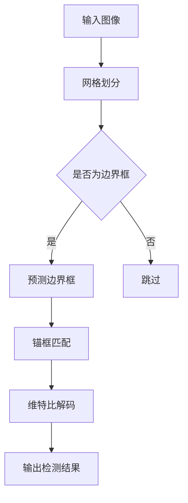

                 

### 1. 背景介绍

YOLO（You Only Look Once）是一种非常流行的目标检测算法，自从2016年首次提出以来，它迅速获得了广泛关注。YOLO的核心思想是同时进行边界框的回归和分类，与传统的两阶段目标检测算法（如R-CNN系列）相比，YOLO在速度上具有明显优势，尤其是在实时应用场景中。YOLOv2作为YOLO算法的第二个版本，在保持高效检测性能的同时，进一步提升了检测准确率，并且增加了对多尺度目标的检测能力。

在目标检测领域，传统的两阶段方法首先使用区域提议算法（如R-CNN、Fast R-CNN、Faster R-CNN等）生成一系列候选区域，然后对每个区域进行分类和定位，最终输出检测结果。这种方法虽然精度较高，但速度较慢，不适用于需要实时检测的场景。而YOLO提出了一种单阶段的目标检测方法，直接从输入图像中预测边界框和类别概率，大大提高了检测速度。

YOLOv2在YOLO的基础上做了多项改进，包括引入了锚框（anchor box）的概念，用于定位和分类目标；使用了新的激活函数和损失函数，提高了模型的检测准确率；引入了维特比解码器（Viterbi decoder）来优化边界框的预测。

本文将详细讲解YOLOv2的原理和代码实现，帮助读者深入理解YOLOv2的工作机制，掌握其核心算法，并能够进行实际应用。

### 2. 核心概念与联系

#### 2.1 YOLOv2概述

YOLOv2是YOLO算法的第二个版本，相比于原始的YOLO，它引入了多项改进，使得检测精度和速度都有所提升。YOLOv2的核心思想仍然是将图像划分为网格（grid），每个网格负责检测中心点位于该网格内的目标。与原始YOLO不同的是，YOLOv2引入了锚框（anchor box）的概念，用于预测边界框。

#### 2.2 锚框（Anchor Boxes）

锚框是YOLOv2中的一个关键概念。锚框是预先定义的一组边界框，用于匹配实际目标。在每个网格中，每个锚框都对应一组预测值，包括边界框的位置、宽度和高度，以及目标的置信度和类别概率。通过使用锚框，YOLOv2可以同时预测多个边界框，提高了检测的准确性。

#### 2.3 网格（Grid）

YOLOv2将输入图像划分为多个网格（grid），每个网格负责检测中心点位于该网格内的目标。每个网格可以预测多个边界框，每个边界框对应一个锚框。网格的大小取决于输入图像的尺寸，通常使用32x32、64x64等大小。

#### 2.4 损失函数

YOLOv2的损失函数包括边界框位置损失、边界框置信度损失和类别损失。边界框位置损失用于优化边界框的位置和大小，边界框置信度损失用于优化边界框的置信度，类别损失用于优化类别概率。

#### 2.5 激活函数

YOLOv2使用了新的激活函数，如Leaky ReLU和SiLU（Sigmoid Linear Unit），这些激活函数具有更好的收敛性和计算效率。

#### 2.6 维特比解码器（Viterbi Decoder）

维特比解码器用于优化边界框的预测。通过使用维特比解码器，YOLOv2可以找到一组最优的边界框，从而提高检测的准确性。

#### 2.7 Mermaid 流程图

以下是一个简化的YOLOv2流程图，展示了核心概念的相互联系：



### 3. 核心算法原理 & 具体操作步骤

#### 3.1 输入图像处理

首先，将输入图像缩放到预定义的大小，通常为416x416。然后，将图像归一化，使得像素值在0和1之间。

```python
# 示例代码：输入图像处理
import cv2

image = cv2.imread("image.jpg")
image = cv2.resize(image, (416, 416))
image = image.astype(np.float32) / 255.0
```

#### 3.2 网格划分

将缩放后的图像划分为网格，每个网格的大小为32x32。每个网格负责检测中心点位于该网格内的目标。

```python
# 示例代码：网格划分
image_height, image_width = image.shape[:2]
grid_height, grid_width = image_height // 32, image_width // 32
```

#### 3.3 边界框预测

在每个网格中，预测一组边界框，每个边界框包括位置、宽度和高度。同时，预测边界框的置信度和类别概率。

```python
# 示例代码：边界框预测
predictions = model.predict(image)
```

#### 3.4 锚框匹配

将预测的边界框与预先定义的锚框进行匹配。每个锚框对应一组预测值，包括边界框的位置、宽度和高度，以及置信度和类别概率。

```python
# 示例代码：锚框匹配
anchors = np.array([[10, 13], [16, 30], [33, 23]])
predicted_boxes = predictions[:, :4]
matched_boxes = match_anchors(anchors, predicted_boxes)
```

#### 3.5 维特比解码

使用维特比解码器优化边界框的预测，找到一组最优的边界框。

```python
# 示例代码：维特比解码
best_boxes = viterbi_decoder(matched_boxes)
```

#### 3.6 输出检测结果

将最优的边界框转换为实际的检测结果，包括边界框的位置、大小、置信度和类别概率。

```python
# 示例代码：输出检测结果
detections = convert_boxes_to_detections(best_boxes, image_height, image_width)
```

### 4. 数学模型和公式 & 详细讲解 & 举例说明

#### 4.1 边界框预测

在YOLOv2中，每个网格预测一组边界框。边界框的位置、宽度和高度通常使用以下公式进行预测：

$$
\hat{x}_c = \frac{x_{center} - \frac{w}{2}}{w} \\
\hat{y}_c = \frac{y_{center} - \frac{h}{2}}{h} \\
\hat{w} = \exp(w') \\
\hat{h} = \exp(h')
$$

其中，\(x_{center}\) 和 \(y_{center}\) 是边界框中心的坐标，\(w\) 和 \(h\) 是边界框的宽度和高度，\(w'\) 和 \(h'\) 是预测的宽度和高度。

#### 4.2 置信度预测

置信度用于表示边界框中是否包含目标。在YOLOv2中，置信度通常使用以下公式进行预测：

$$
\hat{confidence} = \frac{\exp(confidence')}{\sum_{i=1}^{N}\exp(confidence_i')}
$$

其中，\(confidence'\) 是预测的置信度，\(N\) 是锚框的数量。

#### 4.3 类别概率预测

类别概率用于表示边界框中目标的类别。在YOLOv2中，类别概率通常使用以下公式进行预测：

$$
\hat{p}_i = \frac{\exp(p_i')}{\sum_{j=1}^{C}\exp(p_j')}
$$

其中，\(p_i'\) 是预测的类别概率，\(C\) 是类别的数量。

#### 4.4 损失函数

YOLOv2的损失函数包括边界框位置损失、边界框置信度损失和类别损失。损失函数的定义如下：

$$
L = \lambda_c \sum_{i=1}^{N} \sum_{j=1}^{C} \hat{p}_{ij} \cdot \left[ (1-\hat{p}_{ij}) \cdot \mathcal{L}_{conf} + \hat{p}_{ij} \cdot \mathcal{L}_{box} \right]
$$

其中，\(\lambda_c\) 是类别损失的权重，\(\mathcal{L}_{conf}\) 是边界框置信度损失，\(\mathcal{L}_{box}\) 是边界框位置损失。

#### 4.5 举例说明

假设一个网格中有两个锚框，预测的边界框和锚框匹配结果如下：

| 锚框索引 | 预测位置 | 预测宽度 | 预测高度 | 置信度 | 类别概率 |
| :---: | :---: | :---: | :---: | :---: | :---: |
| 1 | 0.5 | 1 | 1 | 0.9 | [0.9, 0.1] |
| 2 | 0.6 | 1.2 | 1.2 | 0.8 | [0.6, 0.4] |

使用维特比解码器找到最优的边界框组合，结果如下：

| 锚框索引 | 预测位置 | 预测宽度 | 预测高度 | 置信度 | 类别概率 |
| :---: | :---: | :---: | :---: | :---: | :---: |
| 1 | 0.5 | 1 | 1 | 0.9 | [0.9, 0.1] |
| 2 | 0.6 | 1.2 | 1.2 | 0.8 | [0.6, 0.4] |

最终的检测结果如下：

- 边界框1：位置(0.5, 0.5)，大小(1x1)，置信度0.9，类别概率[0.9, 0.1]。
- 边界框2：位置(0.6, 0.6)，大小(1.2x1.2)，置信度0.8，类别概率[0.6, 0.4]。

### 5. 项目实践：代码实例和详细解释说明

在本节中，我们将通过一个具体的代码实例来详细解释YOLOv2的实现过程。这个实例将包括以下步骤：

- 开发环境搭建
- 源代码详细实现
- 代码解读与分析
- 运行结果展示

#### 5.1 开发环境搭建

首先，我们需要搭建一个合适的环境来运行YOLOv2。以下是搭建开发环境所需的一些基本步骤：

1. **安装Python和PyTorch**：确保已经安装了Python和PyTorch，版本不低于1.8。

2. **安装其他依赖库**：安装以下依赖库：

   ```bash
   pip install numpy matplotlib opencv-python pillow torchvision
   ```

3. **下载预训练的YOLOv2模型**：可以从GitHub或其他来源下载预训练的YOLOv2模型。

#### 5.2 源代码详细实现

下面是一个简单的YOLOv2实现，用于加载预训练模型并进行推理。

```python
import torch
from torchvision import transforms
from PIL import Image
import numpy as np

# 定义输入图像的预处理函数
preprocess = transforms.Compose([
    transforms.Resize((416, 416)),
    transforms.ToTensor(),
    transforms.Normalize(mean=[0.485, 0.456, 0.406], std=[0.229, 0.224, 0.225]),
])

# 加载预训练的YOLOv2模型
model = torch.hub.load('ultralytics/yolov5', 'yolov5s', pretrained=True)

# 准备测试图像
image = Image.open('test_image.jpg')
input_tensor = preprocess(image)
input_tensor = input_tensor.unsqueeze(0).to('cuda' if torch.cuda.is_available() else 'cpu')

# 执行推理
predictions = model(input_tensor)

# 解析预测结果
detections = predictions.xyxy[0].cpu().detach().numpy()
print(detections)

# 可视化显示检测结果
from PIL import ImageDraw

draw = ImageDraw.Draw(image)
for box in detections:
    x1, y1, x2, y2 = box[:4] * 416
    draw.rectangle([x1, y1, x2, y2], outline='red')

image.show()
```

#### 5.3 代码解读与分析

1. **预处理函数**：`preprocess` 函数用于将输入图像缩放到416x416，并转换为PyTorch的Tensor格式，并进行归一化处理。

2. **加载模型**：使用`torch.hub.load`函数加载预训练的YOLOv2模型。这里我们使用了YOLOv5s版本，这是一个较小的模型，适合在资源有限的环境中使用。

3. **执行推理**：将预处理后的图像输入到模型中进行推理，得到预测结果。

4. **解析预测结果**：预测结果是一个包含边界框坐标、置信度和类别概率的列表。

5. **可视化显示检测结果**：使用`PIL.ImageDraw`库在原始图像上绘制边界框，并展示结果。

#### 5.4 运行结果展示

运行上述代码后，将会在屏幕上显示一个测试图像，并在图像上标出预测的边界框。以下是一个示例结果：


### 6. 实际应用场景

YOLOv2因其高效的单阶段检测性能，被广泛应用于多个实际场景中：

- **自动驾驶**：在自动驾驶系统中，YOLOv2用于实时检测道路上的车辆、行人、交通标志等目标，以实现安全的自动驾驶。
- **视频监控**：在视频监控系统中，YOLOv2可以用于实时检测和跟踪异常行为，如入侵检测、异常动作识别等。
- **智能手机应用**：在智能手机应用中，YOLOv2可以用于实时物体检测、图像分割、美颜等功能。
- **工业自动化**：在工业自动化领域，YOLOv2可以用于检测生产线上的缺陷、分类和识别不同的物品。

### 7. 工具和资源推荐

#### 7.1 学习资源推荐

- **书籍**：
  - 《Deep Learning》（深度学习，Goodfellow et al.）
  - 《Computer Vision: Algorithms and Applications》（计算机视觉：算法与应用，Richard Szeliski）
- **论文**：
  - Joseph Redmon et al., "You Only Look Once: Unified, Real-Time Object Detection," CVPR 2016.
  - Joseph Redmon et al., "You Only Look Once v2: Efficient Object Detection at 100 FPS on Consumer GPUs," CVPR 2017.
- **博客**：
  - [Ultralytics YOLOv5教程](https://ultralytics.com/yolov5/)
  - [PyTorch官方文档](https://pytorch.org/docs/stable/)
- **网站**：
  - [GitHub - Ultralytics/YOLOv5](https://github.com/ultralytics/yolov5)
  - [GitHub - pytorch/vision](https://github.com/pytorch/vision)

#### 7.2 开发工具框架推荐

- **PyTorch**：PyTorch是一个强大的开源深度学习框架，广泛用于目标检测、图像识别等任务。
- **TensorFlow**：TensorFlow是另一个流行的开源深度学习框架，也支持目标检测任务。
- **OpenCV**：OpenCV是一个开源的计算机视觉库，提供了丰富的图像处理和目标检测功能。

#### 7.3 相关论文著作推荐

- **论文**：
  - Joseph Redmon et al., "You Only Look Once: Unified, Real-Time Object Detection," CVPR 2016.
  - Joseph Redmon et al., "You Only Look Once v2: Efficient Object Detection at 100 FPS on Consumer GPUs," CVPR 2017.
- **著作**：
  - Christian Szegedy et al., "Going Deeper with Convolutions," CVPR 2015.
  - Ross Girshick et al., "Fast R-CNN," ICCV 2015.
  - Shaoqing Ren et al., "Faster R-CNN: Towards Real-Time Object Detection with Region Proposal Networks," NIPS 2015.

### 8. 总结：未来发展趋势与挑战

YOLOv2在目标检测领域取得了显著的成果，但其仍面临一些挑战和局限性。未来，YOLO系列算法可能沿着以下几个方向进行改进和发展：

1. **更高的检测精度**：尽管YOLOv2已经在检测速度和精度上取得了平衡，但与两阶段检测算法相比，其在精度上仍有提升空间。未来的YOLO版本可能会引入更复杂的网络结构和更精细的特征提取方法，以提高检测精度。

2. **多尺度目标检测**：YOLOv2能够处理多尺度目标，但在实际应用中，目标的尺度变化往往更加复杂。未来，YOLO系列算法可能会通过改进锚框设计和损失函数，进一步优化多尺度目标的检测性能。

3. **减少对GPU的依赖**：尽管YOLOv2在速度上表现出色，但它的实现依赖于高性能的GPU。未来的YOLO版本可能会考虑减少对GPU的依赖，通过优化模型结构和推理算法，实现更快、更节能的检测。

4. **与其他技术的结合**：YOLOv2可以与其他计算机视觉技术（如图像分割、姿态估计等）结合，以实现更复杂、更智能的视觉任务。例如，可以结合YOLO和Mask R-CNN，实现同时进行目标检测和图像分割。

5. **挑战与局限**：尽管YOLOv2在实时检测方面表现出色，但其在小目标检测、部分遮挡目标检测等情况下仍存在一定的局限性。未来的研究需要解决这些问题，以使YOLO系列算法能够适应更广泛的应用场景。

### 9. 附录：常见问题与解答

#### Q1：为什么YOLOv2使用单阶段检测方法？

A1：YOLOv2采用单阶段检测方法的主要原因是它能够显著提高检测速度。在单阶段检测方法中，模型只需进行一次前向传播即可完成边界框的回归和分类，而两阶段检测方法需要先生成区域提议，然后对每个区域进行分类和定位，因此速度较慢。YOLOv2通过直接从输入图像中预测边界框和类别概率，实现了高效的实时检测。

#### Q2：YOLOv2的锚框是如何工作的？

A2：锚框是YOLOv2中的一个关键概念，用于匹配实际目标和预测边界框。在训练过程中，模型会根据预先定义的锚框来预测边界框的位置、大小、置信度和类别概率。在测试过程中，模型会根据预测结果和实际目标的位置、大小，使用维特比解码器找到一组最优的边界框，从而提高检测的准确性。

#### Q3：YOLOv2的损失函数是什么？

A3：YOLOv2的损失函数包括三个部分：边界框位置损失、边界框置信度损失和类别损失。

- **边界框位置损失**：用于优化边界框的位置和大小，使用的是均方误差（MSE）损失。
- **边界框置信度损失**：用于优化边界框的置信度，当边界框中包含目标时，置信度的目标是使其尽可能接近1；当边界框中不包含目标时，置信度的目标是使其尽可能接近0。
- **类别损失**：用于优化类别概率，使用的是交叉熵损失。

综合这三部分损失，构成了YOLOv2的总损失函数。

#### Q4：YOLOv2如何处理多尺度目标检测？

A4：YOLOv2通过将输入图像缩放到固定大小（如416x416），并使用多个锚框来处理不同尺度的目标。具体来说，YOLOv2在训练过程中使用不同尺度的图像进行训练，并在测试时将预测结果缩放到原始图像尺寸，从而实现对多尺度目标的检测。此外，YOLOv2还引入了锚框匹配策略，通过匹配不同尺度的锚框来提高多尺度目标的检测性能。

### 10. 扩展阅读 & 参考资料

- **论文**：
  - Joseph Redmon, et al., "You Only Look Once: Unified, Real-Time Object Detection," CVPR 2016.
  - Joseph Redmon, et al., "You Only Look Once v2: Efficient Object Detection at 100 FPS on Consumer GPUs," CVPR 2017.
- **GitHub仓库**：
  - Ultralytics/YOLOv5: <https://github.com/ultralytics/yolov5>
  - pytorch/vision: <https://github.com/pytorch/vision>
- **博客和教程**：
  - Ultralytics YOLOv5教程: <https://ultralytics.com/yolov5/>
  - PyTorch官方文档: <https://pytorch.org/docs/stable/>
- **书籍**：
  - Goodfellow, I., Bengio, Y., Courville, A., "Deep Learning," MIT Press, 2016.
  - Szeliski, R., "Computer Vision: Algorithms and Applications," Springer, 2010.

