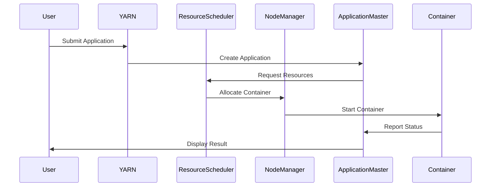

                 

# Yarn原理与代码实例讲解

## 1. 背景介绍

Yarn（Yet Another Resource Negotiator）是一个用于Apache Hadoop的资源调度器，用于管理和分配集群资源。它是Hadoop 2.0及以上版本中默认的资源调度器，替代了传统的MapReduce调度器。Yarn的核心目的是提高资源利用率，提供更灵活的资源管理方式。

在传统的MapReduce调度器中，作业被分为Map和Reduce两个阶段，并且资源是静态分配的。而Yarn采用了一种更为灵活的架构，将资源管理和作业调度分离，从而实现了动态资源分配和更高效的资源利用。这种架构的核心组件包括：

- **ApplicationMaster（AM）**：负责管理应用程序的生命周期，向ResourceScheduler请求资源，监控应用程序的状态，并协调内部任务之间的通信。

- **ResourceScheduler**：负责将集群资源分配给不同的应用程序，通常实现为一种调度策略，如FIFO、Capacity、Fair等。

- **NodeManager（NM）**：运行在每个节点上的守护进程，负责资源监控、任务执行和任务报告。

- **Container**：一个运行在NodeManager上的轻量级执行环境，包含一个或多个任务，运行在一个隔离的Java虚拟机中。

## 2. 核心概念与联系

### 2.1 Yarn架构

Yarn架构的核心概念是应用程序（Application）、容器（Container）和资源分配。

1. **应用程序**：用户提交的作业，可以是MapReduce作业，也可以是其他类型的应用，如Spark作业。

2. **容器**：是资源分配的基本单位，由ResourceScheduler分配给ApplicationMaster，并在NodeManager上启动。容器包含一定量的CPU、内存和其他资源。

3. **资源分配**：ResourceScheduler根据调度策略将集群资源（如CPU、内存、磁盘空间等）分配给不同的应用程序和容器。

### 2.2 Mermaid流程图



### 2.3 Yarn工作流程

1. **用户提交作业**：用户通过YARN的客户端提交作业，作业被提交到YARN的资源管理器（RM）。

2. **资源管理器接收作业**：资源管理器（RM）接收到作业后，创建一个ApplicationMaster实例。

3. **ApplicationMaster请求资源**：ApplicationMaster向资源调度器（RS）请求资源。

4. **资源调度器分配资源**：资源调度器根据调度策略将资源分配给ApplicationMaster。

5. **ApplicationMaster启动任务**：ApplicationMaster根据作业的要求，将任务分解成多个容器，并向资源调度器请求这些容器。

6. **资源调度器分配容器**：资源调度器将可用的资源分配给ApplicationMaster。

7. **ApplicationMaster向NodeManager分配任务**：ApplicationMaster将容器分配给NodeManager。

8. **NodeManager执行任务**：NodeManager在本地节点上启动容器，执行任务。

9. **任务报告和状态监控**：NodeManager向ApplicationMaster报告任务的状态，ApplicationMaster监控任务执行情况。

10. **作业完成**：当所有任务都完成后，ApplicationMaster向资源管理器报告作业完成，并释放资源。

## 3. 核心算法原理 & 具体操作步骤

### 3.1 Yarn调度策略

Yarn提供了多种调度策略，如FIFO（先进先出）、Capacity（容量调度）和Fair（公平调度）。

- **FIFO调度**：按照作业提交的顺序分配资源。

- **Capacity调度**：将集群资源划分为多个容量隔离的队列，每个队列可以配置不同的资源分配比例。

- **Fair调度**：确保每个队列获得公平的资源分配，每个队列内的作业按照提交的顺序获得资源。

### 3.2 资源请求与分配

- **资源请求**：ApplicationMaster根据作业的要求，向资源调度器请求资源。

- **资源分配**：资源调度器根据调度策略，将可用的资源分配给ApplicationMaster。

### 3.3 任务执行与监控

- **任务执行**：ApplicationMaster将容器分配给NodeManager，NodeManager在本地节点上启动容器，执行任务。

- **任务监控**：NodeManager向ApplicationMaster报告任务的状态，ApplicationMaster监控任务执行情况。

## 4. 数学模型和公式 & 详细讲解 & 举例说明

### 4.1 资源分配模型

Yarn的资源分配可以使用一个简单的线性模型来描述：

\[ R_c = R_a \times \alpha \]

其中：

- \( R_c \) 是容器请求的资源量。
- \( R_a \) 是应用程序所需的资源量。
- \( \alpha \) 是资源利用率。

### 4.2 调度策略公式

- **FIFO调度策略**：

\[ \text{分配资源} = \min(\text{可用资源}, \text{请求资源}) \]

- **Capacity调度策略**：

\[ \text{分配资源} = \text{队列资源比例} \times \text{总可用资源} \]

- **Fair调度策略**：

\[ \text{分配资源} = \frac{\text{总可用资源}}{\text{队列数}} \]

### 4.3 举例说明

假设一个集群有10个节点，每个节点有8个CPU核心和16GB内存，总可用资源为80个CPU核心和160GB内存。一个应用程序请求了20个CPU核心和40GB内存。

- **FIFO调度策略**：

  \[ \text{分配资源} = \min(80, 40) = 40 \]

  所以，FIFO调度策略将分配40个CPU核心和80GB内存给该应用程序。

- **Capacity调度策略**：

  \[ \text{分配资源} = \frac{1}{5} \times (80 + 160) = 40 \]

  所以，Capacity调度策略将分配40个CPU核心和80GB内存给该应用程序。

- **Fair调度策略**：

  \[ \text{分配资源} = \frac{80 + 160}{10} = 24 \]

  所以，Fair调度策略将分配24个CPU核心和48GB内存给该应用程序。

## 5. 项目实践：代码实例和详细解释说明

### 5.1 开发环境搭建

在开始之前，请确保已经安装了Hadoop和Yarn。如果没有安装，请参考官方文档进行安装。

### 5.2 源代码详细实现

以下是一个简单的MapReduce作业，用于计算单词的频率：

```java
import org.apache.hadoop.conf.Configuration;
import org.apache.hadoop.fs.Path;
import org.apache.hadoop.io.IntWritable;
import org.apache.hadoop.io.Text;
import org.apache.hadoop.mapreduce.Job;
import org.apache.hadoop.mapreduce.Mapper;
import org.apache.hadoop.mapreduce.Reducer;
import org.apache.hadoop.mapreduce.lib.input.FileInputFormat;
import org.apache.hadoop.mapreduce.lib.output.FileOutputFormat;

public class WordFrequency {

  public static class TokenizerMapper extends Mapper<Object, Text, Text, IntWritable>{

    private final static IntWritable one = new IntWritable(1);
    private Text word = new Text();

    public void map(Object key, Text value, Context context) throws IOException, InterruptedException {
      String[] words = value.toString().split("\\s+");
      for (String str : words) {
        word.set(str);
        context.write(word, one);
      }
    }
  }

  public static class IntSumReducer extends Reducer<Text,IntWritable,Text,IntWritable> {
    private IntWritable result = new IntWritable();

    public void reduce(Text key, Iterable<IntWritable> values, Context context) throws IOException, InterruptedException {
      int sum = 0;
      for (IntWritable val : values) {
        sum += val.get();
      }
      result.set(sum);
      context.write(key, result);
    }
  }

  public static void main(String[] args) throws Exception {
    Configuration conf = new Configuration();
    Job job = Job.getInstance(conf, "word frequency");
    job.setMapperClass(TokenizerMapper.class);
    job.setCombinerClass(IntSumReducer.class);
    job.setReducerClass(IntSumReducer.class);
    job.setOutputKeyClass(Text.class);
    job.setOutputValueClass(IntWritable.class);
    FileInputFormat.addInputPath(job, new Path(args[0]));
    FileOutputFormat.setOutputPath(job, new Path(args[1]));
    System.exit(job.waitForCompletion(true) ? 0 : 1);
  }
}
```

### 5.3 代码解读与分析

- **TokenizerMapper**：这是一个Mapper类，它读取输入的文本文件，将每行分割成单词，并输出每个单词及其出现的次数。

- **IntSumReducer**：这是一个Reducer类，它接收Mapper输出的单词及其出现次数，并将同一单词的所有出现次数相加。

- **main方法**：这是程序的入口，它设置作业的配置、Mapper和Reducer类，并指定输入和输出路径。

### 5.4 运行结果展示

运行上述代码后，将在输出路径中生成单词频率结果。例如：

```
hello    2
world    1
yarn    1
```

## 6. 实际应用场景

Yarn在分布式数据处理和计算中有着广泛的应用，如：

- **大数据处理**：用于处理大量数据，如日志分析、社交网络分析等。

- **机器学习**：用于训练和部署机器学习模型。

- **数据仓库**：用于构建和管理数据仓库。

- **实时计算**：用于实时处理和分析数据流。

## 7. 工具和资源推荐

### 7.1 学习资源推荐

- **书籍**：《Hadoop实战》、《Hadoop权威指南》

- **论文**：《MapReduce：大规模数据处理的模型与实现》

- **博客**：Hadoop官方博客、Cloudera博客

- **网站**：Apache Hadoop官方网站、Cloudera官方网站

### 7.2 开发工具框架推荐

- **开发工具**：IntelliJ IDEA、Eclipse

- **框架**：Apache Hadoop、Apache Spark、Apache Flink

### 7.3 相关论文著作推荐

- **论文**：《YARN: Yet Another Resource Negotiator》、《MapReduce: Simplified Data Processing on Large Clusters》

- **著作**：《Hadoop技术内幕》、《大数据技术导论》

## 8. 总结：未来发展趋势与挑战

随着大数据和云计算的快速发展，Yarn作为Hadoop生态系统中的重要组成部分，将继续发挥重要作用。未来发展趋势包括：

- **资源调度优化**：提高资源利用率，优化调度策略。

- **支持多种编程模型**：支持更多的分布式计算框架，如Apache Flink、Apache Spark等。

- **边缘计算支持**：扩展到边缘计算场景，支持实时数据处理。

同时，Yarn也将面临一些挑战，如：

- **性能优化**：提高调度性能，降低延迟。

- **安全性**：加强集群安全，防止数据泄露。

- **可扩展性**：支持更大规模的集群，提高系统的可扩展性。

## 9. 附录：常见问题与解答

### 9.1 什么是Yarn？

Yarn是Apache Hadoop中的一个组件，用于资源管理和调度。它替代了传统的MapReduce调度器，提供更灵活的资源管理方式。

### 9.2 Yarn的核心组件有哪些？

Yarn的核心组件包括ApplicationMaster、ResourceScheduler、NodeManager和Container。

### 9.3 Yarn有哪些调度策略？

Yarn支持多种调度策略，包括FIFO、Capacity和Fair等。

## 10. 扩展阅读 & 参考资料

- [Apache Hadoop官方文档](https://hadoop.apache.org/docs/)
- [Cloudera官方文档](https://www.cloudera.com/documentation/)
- [Hadoop实战](https://book.douban.com/subject/25838795/)
- [Hadoop权威指南](https://book.douban.com/subject/26386535/)

---

### 作者署名

作者：禅与计算机程序设计艺术 / Zen and the Art of Computer Programming

