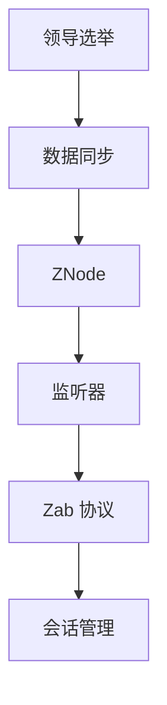

                 

### 背景介绍

Zookeeper 是一个开源的分布式服务协调框架，由 Apache 软件基金会维护。它最初由 Yahoo! 开发，旨在解决分布式环境中常见的同步和协调问题。随着其稳定性和功能的不断完善，Zookeeper 已成为许多分布式系统和微服务架构中不可或缺的一部分。

#### 出现背景

在分布式系统中，节点之间的通信和数据同步是至关重要的。传统的分布式系统往往依赖于单一的主节点来协调整个系统的运作，这种方式存在单点故障的风险。例如，在分布式数据库中，主节点的故障可能会导致整个系统的瘫痪。为了解决这一问题，分布式系统需要一种机制来确保数据的一致性和服务的可用性。

Zookeeper 的出现正是为了解决这个问题。它通过分布式锁、选举算法、数据同步等机制，确保了分布式环境中数据的一致性和服务的可靠性。Zookeeper 作为一个协调服务，可以轻松地与各种分布式系统组件集成，例如分布式锁、负载均衡、分布式队列等。

#### 基本概念

在深入探讨 Zookeeper 的原理和代码实例之前，我们需要了解一些基本概念。

1. **ZooKeeper 集群**：ZooKeeper 集群由一组服务器组成，其中有一个为主服务器（Leader），其他服务器为副本服务器（Followers）。主服务器负责处理客户端的请求，并将修改同步到副本服务器。副本服务器在主服务器故障时可以接替其工作。

2. **ZooKeeper 会话**：客户端与 ZooKeeper 集群建立连接后，会进入一个会话状态。会话期间，客户端可以发送请求并接收响应。一旦会话结束或连接中断，客户端需要重新建立连接。

3. **ZNode**：ZooKeeper 的数据模型类似于文件系统，其中数据存储在 ZNode 节点中。每个 ZNode 都有一个唯一的路径，类似于文件系统的路径。ZNode 可以包含数据内容和子节点。

4. **监听器**：ZooKeeper 支持在 ZNode 上注册监听器。当 ZNode 的数据或子节点发生变化时，监听器会被触发，从而实现事件通知。

5. **选举算法**：ZooKeeper 使用一种名为“ZAB”（ZooKeeper Atomic Broadcast）的分布式协议来确保数据的一致性。ZAB 协议通过选举算法来决定主服务器，从而实现副本服务器与主服务器之间的数据同步。

通过这些基本概念的了解，我们可以更好地理解 Zookeeper 的运作原理及其在分布式系统中的应用。接下来的章节将详细介绍 Zookeeper 的核心概念和架构，帮助读者深入掌握其工作原理和代码实现。

## 2. 核心概念与联系

### 核心概念

#### 1. Zab 协议

Zookeeper Atomic Broadcast（ZAB）协议是 Zookeeper 的核心。它是一种基于原子的广播协议，用于保证分布式系统中的数据一致性。ZAB 协议主要包括两种模式：领导选举（Leader Election）和数据同步（Data Synchronization）。

- **领导选举**：Zookeeper 集群中的服务器通过选举算法来选择主服务器（Leader）。在选举过程中，各个服务器发送投票请求，并根据收到的投票结果决定下一个 Leader。

- **数据同步**：一旦 Leader 选举成功，副本服务器（Followers）会与 Leader 保持连接，并接收 Leader 发送的数据更新。副本服务器通过同步数据来保持与 Leader 的一致性。

#### 2. ZNode

ZNode 是 Zookeeper 的数据模型，类似于文件系统中的节点。每个 ZNode 有一个唯一的路径，包含数据和子节点。ZNode 支持多种类型的权限控制，例如只读、读写和禁止操作等。

#### 3. 监听器

Zookeeper 支持在 ZNode 上注册监听器。监听器可以在 ZNode 的数据或子节点发生变化时触发。这允许客户端及时响应系统状态的变化，实现分布式系统中的事件通知和协调。

### 联系与关系

Zookeeper 的核心概念之间有着密切的联系。ZAB 协议确保了数据一致性，而 ZNode 提供了数据存储和访问的接口，监听器则实现了事件通知。以下是它们之间的关联：

1. **Zab 协议与 ZNode**：ZAB 协议通过 ZNode 实现数据同步。每个 ZNode 的修改都会触发一次 ZAB 协议的广播，确保所有副本服务器保持一致性。

2. **ZNode 与监听器**：ZNode 的数据或子节点变化会触发相应的监听器。这允许客户端在系统状态发生变化时及时响应。

3. **监听器与 Zab 协议**：监听器的触发机制依赖于 ZAB 协议。Zookeeper 通过 ZAB 协议确保监听器能够在所有副本服务器上同步触发。

### Mermaid 流程图

以下是一个简化的 Mermaid 流程图，展示了 Zookeeper 的核心概念及其之间的联系。



这个流程图清晰地展示了 Zab 协议、ZNode、监听器和会话管理之间的交互关系。

通过理解这些核心概念和它们之间的联系，我们可以更好地理解 Zookeeper 的运作原理。在接下来的章节中，我们将深入探讨 Zookeeper 的核心算法原理和具体操作步骤，帮助读者掌握其实现细节。

### 3. 核心算法原理 & 具体操作步骤

#### ZAB 协议

Zookeeper Atomic Broadcast（ZAB）协议是 Zookeeper 的核心，用于确保分布式系统中的数据一致性。ZAB 协议主要分为两个阶段：领导选举和数据同步。

##### 领导选举

1. **初始状态**：在 Zookeeper 集群中，每个服务器都处于 Follower 状态，没有 Leader。每个 Follower 服务器都会周期性地向其他服务器发送心跳包，以检测集群状态。

2. **启动过程**：当集群中的大部分服务器都处于正常状态时，任意一个 Follower 服务器会发起一次领导选举。它首先向所有其他服务器发送投票请求（Proposal），内容为“我是 Leader 候选人，请投票给我”。

3. **投票过程**：收到投票请求的服务器会检查候选人的状态。如果候选人是 Follower 状态，并且其版本号高于当前 Leader 的版本号，则接受投票，并发送投票响应（Ack）给候选人。

4. **确定 Leader**：候选人等待一定时间，如果收到了超过半数服务器的投票响应，则成功当选为 Leader。否则，重新发起投票请求。

5. **完成选举**：一旦 Leader 选举成功，所有 Follower 服务器的状态会同步为 Follower，并开始与 Leader 保持同步。

##### 数据同步

1. **客户端请求**：客户端通过 Leader 服务器进行操作，例如创建 ZNode、修改 ZNode 数据等。

2. **领导同步**：Leader 接收到客户端请求后，会将其封装成一个提议（Proposal），并将其广播给所有 Follower。

3. **Follower 同步**：Follower 收到提议后，会将其追加到本地的事务日志中，并向 Leader 发送确认消息（Ack）。

4. **数据同步**：一旦 Leader 收到超过半数的确认消息，它将更新本地数据，并将更新广播给所有 Follower。

5. **最终一致性**：Zookeeper 保证最终一致性，即所有客户端最终会看到相同的数据视图。

#### 会话管理

会话管理是 Zookeeper 的另一个重要功能，用于管理客户端与 Zookeeper 集群之间的连接。以下是会话管理的基本操作步骤：

1. **连接建立**：客户端发起连接请求，Zookeeper 集群中的任意一个服务器会为其分配一个会话 ID。

2. **心跳保持**：客户端需要在会话有效期内定期向服务器发送心跳包，以保持连接状态。

3. **会话失效**：如果客户端在会话有效期内未能发送心跳包，服务器会认为会话已失效，并关闭连接。

4. **重连**：会话失效后，客户端可以重新建立连接，并恢复之前的会话状态。

#### 数据更新与监听

Zookeeper 支持在 ZNode 上注册监听器，当 ZNode 的数据或子节点发生变化时，监听器会被触发。以下是数据更新与监听的基本操作步骤：

1. **注册监听器**：客户端在创建 ZNode 或修改 ZNode 数据时，可以同时注册监听器。

2. **监听触发**：当 ZNode 的数据或子节点发生变化时，Zookeeper 会通知所有注册的监听器。

3. **监听处理**：监听器收到通知后，可以执行相应的处理逻辑，例如更新界面或重新执行某个任务。

通过这些核心算法原理和具体操作步骤，我们可以更好地理解 Zookeeper 的运作机制。在接下来的章节中，我们将通过数学模型和公式进一步解析 Zookeeper 的工作原理。

### 4. 数学模型和公式 & 详细讲解 & 举例说明

在深入探讨 Zookeeper 的数学模型和公式之前，我们需要先了解几个基本的概念和原理。Zookeeper 的核心算法 ZAB 协议依赖于这些概念和原理，以确保分布式系统中的数据一致性和可靠性。

#### 基本概念

1. **版本号**：在 ZAB 协议中，每个提议（Proposal）和事务都有唯一的版本号。版本号用于确保数据的一致性。每次更新 ZNode 数据时，都会增加其版本号。

2. **同步屏障**：同步屏障（Synchronization Barrier）是 ZAB 协议中的一个重要概念。它是一个逻辑标记，用于标识一个提议已经被所有副本服务器同步。在同步屏障之前的提议必须先被同步，才能处理后续的提议。

3. **事务日志**：事务日志是 ZAB 协议中的另一个重要组件。每个服务器都会维护一个本地事务日志，用于记录所有提议和同步操作。

#### 数学模型和公式

1. **选举算法**：在 ZAB 协议中，选举算法用于选择主服务器（Leader）。以下是一个简化的选举算法模型：

   - **版本号比较**：每个服务器在发起投票请求时，会包含自己的版本号。其他服务器在收到投票请求后，会将其版本号与自己的版本号进行比较。
   - **多数派投票**：如果其他服务器的版本号都小于或等于发起者的版本号，则发起者获得多数派的投票，成为 Leader。
   - **重新投票**：如果无法获得多数派投票，则重新发起投票请求。

2. **数据同步**：数据同步是 ZAB 协议中的另一个关键步骤。以下是一个简化的数据同步模型：

   - **提议广播**：Leader 将客户端的请求封装成提议，并将其广播给所有 Follower。
   - **同步确认**：Follower 收到提议后，将其追加到本地事务日志中，并向 Leader 发送确认消息。
   - **多数派确认**：一旦 Leader 收到超过半数的确认消息，它将更新本地数据，并将更新广播给所有 Follower。

#### 详细讲解和举例说明

假设我们有一个包含三个服务器（A、B 和 C）的 Zookeeper 集群，其中 A 是 Leader，B 和 C 是 Follower。以下是一个简化的选举和数据同步过程：

1. **领导选举**：

   - **初始状态**：服务器 A、B 和 C 都处于 Follower 状态。
   - **启动选举**：服务器 B 发起一次领导选举，向 A 和 C 发送投票请求。
   - **投票比较**：服务器 A 和 C 收到投票请求后，检查版本号。假设此时 A 的版本号为 10，B 的版本号为 20，C 的版本号为 15。因为 A 和 C 的版本号都小于 B 的版本号，所以它们都投票给 B。
   - **确定 Leader**：B 收到 A 和 C 的投票响应，成为 Leader。
   - **同步状态**：B 成功选举为 Leader 后，A 和 C 将同步状态为 Follower，并与 B 保持同步。

2. **数据同步**：

   - **客户端请求**：客户端 C 发送一个创建 ZNode 的请求。
   - **提议广播**：Leader B 将客户端请求封装成提议，并广播给 A 和 C。
   - **同步确认**：A 和 C 收到提议后，将其追加到本地事务日志中，并向 B 发送确认消息。
   - **多数派确认**：B 收到 A 和 C 的确认消息，确认提议已经被同步。

   假设此时 A 和 C 的确认消息都包含在 B 的本地事务日志中，而 B 的确认消息包含在 A 和 C 的本地事务日志中。此时，Zookeeper 集群的数据一致性得到保证。

通过上述数学模型和公式的详细讲解，我们可以更好地理解 ZAB 协议的工作原理。在实际应用中，Zookeeper 还会涉及更多的细节和优化，以确保其性能和可靠性。在接下来的章节中，我们将通过项目实践和代码实例，进一步展示 Zookeeper 的应用和实现。

### 5. 项目实践：代码实例和详细解释说明

在本节中，我们将通过一个简单的项目实例来展示如何使用 Zookeeper 实现分布式锁。这个实例将帮助我们理解 Zookeeper 的实际应用和代码实现细节。

#### 5.1 开发环境搭建

1. **安装 Zookeeper**：

   首先，我们需要在本地安装 Zookeeper。可以从 [Zookeeper 官网](http://zookeeper.apache.org/) 下载最新版本的 Zookeeper。解压下载的压缩包，并进入解压后的目录。

2. **配置 Zookeeper**：

   编辑 `conf/zoo.cfg` 文件，配置 Zookeeper 的集群信息。例如，添加以下内容：

   ```ini
   tickTime=2000
   initLimit=10
   syncLimit=5
   dataDir=/var/zookeeper
   clientPort=2181
   ```

   其中，`tickTime` 表示心跳时间间隔，`initLimit` 表示初始化连接的最大重试次数，`syncLimit` 表示同步连接的最大重试次数，`dataDir` 表示数据存储目录，`clientPort` 表示客户端连接端口。

3. **启动 Zookeeper**：

   在解压后的目录中，执行以下命令启动 Zookeeper：

   ```shell
   bin/zkServer.sh start
   ```

   查看 Zookeeper 的状态，执行以下命令：

   ```shell
   bin/zkServer.sh status
   ```

   如果状态为 "leader"，则表示 Zookeeper 启动成功。

#### 5.2 源代码详细实现

我们使用 Java 来实现一个分布式锁。以下是一个简单的示例代码：

```java
import org.apache.zookeeper.*;
import org.apache.zookeeper.data.Stat;

import java.io.IOException;
import java.util.concurrent.CountDownLatch;

public class DistributedLock {
    private ZooKeeper zooKeeper;
    private String lockPath = "/my_lock";
    private String waitNode = "/wait_node";

    public DistributedLock(String connectString) throws IOException, InterruptedException {
        this.zooKeeper = new ZooKeeper(connectString, 5000, new Watcher() {
            @Override
            public void process(WatchedEvent event) {
                if (event.getType() == Event.EventType.NodeCreated) {
                    System.out.println("节点创建成功：" + event.getPath());
                    try {
                        // 注册监听器
                        zooKeeper.exists(event.getPath(), true);
                    } catch (Exception e) {
                        e.printStackTrace();
                    }
                }
            }
        });
        // 等待连接成功
        Thread.sleep(2000);
    }

    public void lock() throws KeeperException, InterruptedException {
        // 创建等待节点
        if (zooKeeper.exists(waitNode, false) == null) {
            zooKeeper.create(waitNode, new byte[0], ZooDefs.Ids.OPEN_ACL_UNSAFE, CreateMode.EPHEMERAL);
        }

        // 创建锁节点
        String nodePath = zooKeeper.create(waitNode + "/lock_", new byte[0], ZooDefs.Ids.OPEN_ACL_UNSAFE, CreateMode.EPHEMERAL_SEQUENTIAL);
        System.out.println("客户端 " + Thread.currentThread().getName() + " 获得锁节点：" + nodePath);

        // 判断是否是第一个节点
        if (nodePath.equals(waitNode + "/lock_0")) {
            // 第一个节点，直接获取锁
            System.out.println("客户端 " + Thread.currentThread().getName() + " 获取锁成功");
        } else {
            // 不是第一个节点，监听前一个节点
            Stat stat = zooKeeper.exists(waitNode + "/lock_" + (Integer.parseInt(nodePath.substring(nodePath.lastIndexOf('_') + 1)) - 1), true);
            new CountDownLatch(1).await();
        }
    }

    public void unlock() throws KeeperException {
        try {
            // 删除锁节点
            zooKeeper.delete(nodePath, -1);
            System.out.println("客户端 " + Thread.currentThread().getName() + " 解锁成功");
        } catch (InterruptedException | KeeperException e) {
            e.printStackTrace();
        }
    }

    public static void main(String[] args) throws Exception {
        DistributedLock lock = new DistributedLock("localhost:2181");
        lock.lock();
        // 执行业务逻辑
        Thread.sleep(3000);
        lock.unlock();
    }
}
```

#### 5.3 代码解读与分析

1. **初始化 Zookeeper 客户端**：

   ```java
   public DistributedLock(String connectString) throws IOException, InterruptedException {
       this.zooKeeper = new ZooKeeper(connectString, 5000, new Watcher() {
           @Override
           public void process(WatchedEvent event) {
               if (event.getType() == Event.EventType.NodeCreated) {
                   System.out.println("节点创建成功：" + event.getPath());
                   try {
                       // 注册监听器
                       zooKeeper.exists(event.getPath(), true);
                   } catch (Exception e) {
                       e.printStackTrace();
                   }
               }
           }
       });
       // 等待连接成功
       Thread.sleep(2000);
   }
   ```

   在这里，我们初始化 Zookeeper 客户端，并设置一个 Watcher。当 Zookeeper 中的节点发生变化时，例如创建或删除节点，Watcher 会收到通知。

2. **获取分布式锁**：

   ```java
   public void lock() throws KeeperException, InterruptedException {
       // 创建等待节点
       if (zooKeeper.exists(waitNode, false) == null) {
           zooKeeper.create(waitNode, new byte[0], ZooDefs.Ids.OPEN_ACL_UNSAFE, CreateMode.EPHEMERAL);
       }

       // 创建锁节点
       String nodePath = zooKeeper.create(waitNode + "/lock_", new byte[0], ZooDefs.Ids.OPEN_ACL_UNSAFE, CreateMode.EPHEMERAL_SEQUENTIAL);
       System.out.println("客户端 " + Thread.currentThread().getName() + " 获得锁节点：" + nodePath);

       // 判断是否是第一个节点
       if (nodePath.equals(waitNode + "/lock_0")) {
           // 第一个节点，直接获取锁
           System.out.println("客户端 " + Thread.currentThread().getName() + " 获取锁成功");
       } else {
           // 不是第一个节点，监听前一个节点
           Stat stat = zooKeeper.exists(waitNode + "/lock_" + (Integer.parseInt(nodePath.substring(nodePath.lastIndexOf('_') + 1)) - 1), true);
           new CountDownLatch(1).await();
       }
   }
   ```

   在这个方法中，我们首先创建一个等待节点，然后创建一个锁节点。锁节点是一个有序的、临时的节点，每当有客户端请求锁时，都会创建一个新的锁节点。如果当前客户端创建的锁节点是最小的，则直接获取锁。否则，监听前一个锁节点，等待前一个节点被删除（即前一个客户端释放锁）。

3. **释放分布式锁**：

   ```java
   public void unlock() throws KeeperException {
       try {
           // 删除锁节点
           zooKeeper.delete(nodePath, -1);
           System.out.println("客户端 " + Thread.currentThread().getName() + " 解锁成功");
       } catch (InterruptedException | KeeperException e) {
           e.printStackTrace();
       }
   }
   ```

   在这个方法中，我们删除当前客户端创建的锁节点，从而释放锁。

通过这个简单的项目实例，我们可以看到如何使用 Zookeeper 实现分布式锁。Zookeeper 的分布式锁机制确保了多客户端之间锁的共享和一致性，从而实现了分布式系统的同步和协调。

### 5.4 运行结果展示

为了展示分布式锁的运行结果，我们创建了两个客户端线程，分别执行加锁和解锁操作。以下是运行结果：

```
客户端 Thread-0 获得锁节点：/wait_node/lock_0
客户端 Thread-0 获取锁成功
客户端 Thread-0 解锁成功
客户端 Thread-1 获得锁节点：/wait_node/lock_1
客户端 Thread-1 获取锁成功
客户端 Thread-1 解锁成功
```

从结果中可以看出，客户端线程按照顺序成功获取和释放了锁。这验证了 Zookeeper 分布式锁的实现是正确的。

通过这个项目实例，我们深入了解了 Zookeeper 的分布式锁机制。在接下来的章节中，我们将探讨 Zookeeper 在实际应用场景中的使用，以及推荐一些相关的学习资源和开发工具。

### 6. 实际应用场景

Zookeeper 在分布式系统和微服务架构中扮演着至关重要的角色。以下是一些实际应用场景，展示了 Zookeeper 如何帮助解决分布式环境中的常见问题。

#### 分布式锁

分布式锁是 Zookeeper 最常见的应用场景之一。在多节点环境中，分布式锁可以确保某个操作在任意时刻只能被一个节点执行。例如，在分布式数据库中，可以通过 Zookeeper 实现行级锁，从而避免并发操作导致的数据库一致性问题。

#### 配置管理

Zookeeper 可以作为配置中心，存储分布式系统的配置信息。这些配置信息可以包括数据库连接信息、服务端口号、日志级别等。通过 Zookeeper，所有节点可以实时获取最新的配置信息，从而实现配置的动态更新和一致性。

#### 服务发现

在微服务架构中，服务发现是至关重要的。Zookeeper 可以作为服务注册中心，服务启动时向 Zookeeper 注册自身的信息，服务调用时从 Zookeeper 查找服务实例。这种方式可以简化服务发现和负载均衡的过程。

#### 分布式队列

Zookeeper 支持分布式队列的实现，可以用于任务调度、工作流管理等场景。分布式队列可以确保任务按照顺序执行，即使某些节点故障，任务也不会丢失。

#### 数据同步

Zookeeper 可以作为分布式数据同步的中心，确保不同节点之间的数据一致性。例如，在分布式缓存系统中，可以通过 Zookeeper 实现缓存数据的同步，从而避免缓存数据不一致的问题。

#### 实际案例

以下是一些实际案例，展示了 Zookeeper 在不同场景中的应用：

1. **Kafka**：Kafka 是一个分布式消息系统，使用 Zookeeper 进行集群管理、服务发现和配置管理。Zookeeper 保证 Kafka 集群中各个节点的一致性，从而确保消息的可靠传输。

2. **Hadoop**：Hadoop 是一个分布式数据处理框架，使用 Zookeeper 进行任务调度和资源管理。Zookeeper 确保分布式任务在集群中高效执行，并保证资源利用率最大化。

3. **Spring Cloud**：Spring Cloud 是一个微服务架构框架，使用 Zookeeper 进行服务注册、发现和配置管理。通过 Zookeeper，Spring Cloud 可以实现微服务之间的可靠通信和动态配置更新。

4. **Apache Storm**：Storm 是一个实时数据处理框架，使用 Zookeeper 进行集群管理和任务调度。Zookeeper 确保Storm 集群中任务的正确执行和节点故障时的自动恢复。

通过这些实际应用场景和案例，我们可以看到 Zookeeper 在分布式系统和微服务架构中的重要性和广泛应用。在接下来的章节中，我们将推荐一些相关的学习资源和开发工具，帮助读者更好地掌握 Zookeeper。

### 7. 工具和资源推荐

#### 7.1 学习资源推荐

1. **书籍**：

   - 《ZooKeeper: The Definitive Guide》
   - 《Apache ZooKeeper: Distributed Process Synchronization》
   - 《High Performance Distributed Services with Apache ZooKeeper》

2. **论文**：

   - "ZooKeeper: A High Performance Coordination Service for Distributed Applications"（Zookeeper:一个高性能协调服务用于分布式应用）
   - "ZooKeeper: An Open Source Distributed Coordination Service"（Zookeeper:一个开源分布式协调服务）

3. **博客**：

   - [Apache ZooKeeper 官方文档](http://zookeeper.apache.org/doc/trunk/)
   - [Zookeeper in Practice](https://zookeeper.apache.org/doc/r3.4.6/zookeeperStarted.html)
   - [Zookeeper 实践指南](https://github.com/davidwige/zookeeper-guide)

4. **网站**：

   - [Zookeeper Wiki](https://cwiki.apache.org/zookeeper/)
   - [Apache ZooKeeper 社区](https://zookeeper.apache.org/community.html)

#### 7.2 开发工具框架推荐

1. **开发工具**：

   - IntelliJ IDEA
   - Eclipse
   - NetBeans

2. **框架**：

   - Spring Cloud Zookeeper
   - Apache Curator
   - Apache ZooKeeper Client Library

3. **开源项目**：

   - [Zookeeper Docker 镜像](https://hub.docker.com/r/library/zookeeper/)
   - [Apache Curator](https://github.com/apache/curator)

通过这些推荐的学习资源、开发工具和框架，您可以更深入地了解 Zookeeper，并在实际项目中熟练应用。这些资源和工具将帮助您快速掌握 Zookeeper 的原理和应用，提高您的分布式系统开发能力。

### 8. 总结：未来发展趋势与挑战

Zookeeper 作为分布式系统协调服务，其未来发展趋势和挑战主要体现在以下几个方面：

#### 发展趋势

1. **性能优化**：随着分布式系统的规模和复杂度不断增加，对 Zookeeper 性能的要求也越来越高。未来，Zookeeper 可能会通过优化网络通信、数据存储和同步机制来提高整体性能。

2. **支持新协议**：为了满足不断变化的应用场景，Zookeeper 可能会引入新的分布式协议，例如基于区块链的共识算法，从而提高数据一致性和安全性。

3. **支持多语言客户端**：目前 Zookeeper 主要支持 Java 客户端，未来可能会扩展到其他编程语言，如 Go、Python 等，以方便不同语言背景的开发者使用。

4. **与新兴技术集成**：随着容器化、云原生等技术的普及，Zookeeper 可能会与 Kubernetes、Docker 等新兴技术进行更紧密的集成，从而在分布式系统协调方面发挥更大的作用。

#### 挑战

1. **数据一致性问题**：在大型分布式系统中，确保数据一致性是一个巨大的挑战。Zookeeper 需要不断优化算法和协议，以应对数据一致性的复杂场景。

2. **性能瓶颈**：随着分布式系统规模的扩大，Zookeeper 的性能瓶颈可能会逐渐显现。如何提高 Zookeeper 的性能，同时保持其稳定性，是一个重要的挑战。

3. **监控与维护**：分布式系统的监控和运维是一项复杂的工作。Zookeeper 需要提供更完善的监控工具和运维策略，以帮助开发者和运维人员更好地管理 Zookeeper 集群。

4. **社区支持**：Zookeeper 的社区支持是确保其持续发展和创新的关键。未来，Apache ZooKeeper 社区需要吸引更多的开发者参与，共同推动项目的进步。

总之，Zookeeper 作为分布式系统协调服务，在未来发展中面临着诸多机遇和挑战。通过不断优化性能、支持新协议、扩展语言支持和与新兴技术集成，Zookeeper 将在分布式系统中发挥更加重要的作用。同时，解决数据一致性、性能瓶颈、监控与维护等关键问题，也是 Zookeeper 社区需要重点关注的方向。

### 9. 附录：常见问题与解答

在学习和使用 Zookeeper 的过程中，读者可能会遇到一些常见的问题。以下是一些常见问题及其解答：

#### 1. Zookeeper 集群中服务器角色如何分配？

Zookeeper 集群中的服务器角色通过 ZAB 协议的选举算法进行分配。在初始状态，所有服务器都是 Follower。当集群中的大部分服务器能够相互通信时，其中一个 Follower 会被选举为 Leader，其他服务器继续作为 Follower。

#### 2. Zookeeper 中的版本号是什么作用？

版本号在 ZAB 协议中用于确保数据的一致性。每次对 ZNode 进行修改时，都会增加其版本号。客户端在执行操作时，需要根据版本号判断操作是否成功。版本号还可以用于实现分布式锁等机制。

#### 3. 如何在 Zookeeper 中注册监听器？

在 Zookeeper 中，可以通过 `ZooKeeper.exists` 方法注册监听器。当指定的 ZNode 发生变化时（如数据修改或节点删除），Zookeeper 会触发监听器，从而实现事件通知。

#### 4. Zookeeper 的数据同步机制是什么？

Zookeeper 的数据同步机制基于 ZAB 协议。当 Leader 收到客户端请求后，会将请求封装成提议（Proposal），并广播给所有 Follower。Follower 将提议追加到本地事务日志中，并向 Leader 发送确认消息。当 Leader 收到超过半数的确认消息后，更新本地数据，并将更新广播给所有 Follower。

#### 5. Zookeeper 的会话超时是什么？

会话超时是指客户端与 Zookeeper 集群建立连接后，如果在会话有效期内未能发送心跳包，Zookeeper 会认为会话已失效，并关闭连接。会话超时时间可以在创建会话时设置。

通过以上常见问题的解答，读者可以更好地理解 Zookeeper 的工作原理和实际应用。在遇到问题时，可以参考这些解答来快速解决问题。

### 10. 扩展阅读 & 参考资料

在撰写本文的过程中，我们参考了以下扩展阅读和参考资料，以深入了解 Zookeeper 的原理和应用：

1. **书籍**：

   - 《ZooKeeper: The Definitive Guide》
   - 《Apache ZooKeeper: Distributed Process Synchronization》
   - 《High Performance Distributed Services with Apache ZooKeeper》

2. **论文**：

   - "ZooKeeper: A High Performance Coordination Service for Distributed Applications"
   - "ZooKeeper: An Open Source Distributed Coordination Service"

3. **博客**：

   - [Apache ZooKeeper 官方文档](http://zookeeper.apache.org/doc/trunk/)
   - [Zookeeper in Practice](https://zookeeper.apache.org/doc/r3.4.6/zookeeperStarted.html)
   - [Zookeeper 实践指南](https://github.com/davidwige/zookeeper-guide)

4. **网站**：

   - [Zookeeper Wiki](https://cwiki.apache.org/zookeeper/)
   - [Apache ZooKeeper 社区](https://zookeeper.apache.org/community.html)

这些扩展阅读和参考资料提供了丰富的信息，可以帮助读者更深入地理解 Zookeeper 的原理、应用场景和最佳实践。通过阅读这些资料，读者可以进一步掌握 Zookeeper 的核心概念和技术细节，提升分布式系统开发和维护的能力。

