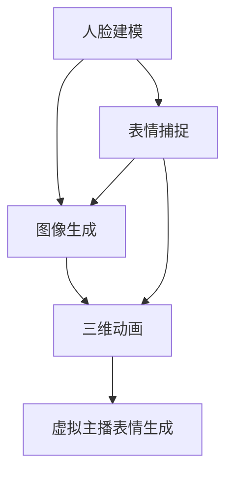

                 

### 背景介绍

Bilibili 作为国内知名的弹幕视频分享网站，近年来在虚拟主播领域表现出色。虚拟主播具有高互动性、个性化的特点，能够更好地吸引用户。然而，传统虚拟主播的表情设计存在诸多局限，如表情不够自然、动作不够丰富等。为了解决这一问题，Bilibili 决定在2025年推出虚拟主播表情生成项目，以提升虚拟主播的表现力和用户体验。

计算机图形学作为计算机科学的一个重要分支，旨在通过算法和程序生成和处理图形图像。近年来，随着深度学习技术的发展，计算机图形学在图像生成、图像处理、计算机视觉等领域取得了显著进展。特别是在虚拟主播表情生成领域，计算机图形学提供了强大的技术支持，使得生成具有高度真实感和个性化的虚拟主播表情成为可能。

虚拟主播表情生成的关键在于如何准确地捕捉和模拟人类表情。这涉及到计算机图形学中的多个领域，包括人脸建模、表情捕捉、图像生成等。通过结合这些技术，虚拟主播的表情可以更加自然、丰富，从而提升用户的观看体验。

本文将围绕 Bilibili 2025 年虚拟主播表情生成项目，深入探讨其核心概念、算法原理、数学模型、项目实践以及实际应用场景。同时，还将介绍相关的学习资源、开发工具和未来发展趋势，帮助读者全面了解虚拟主播表情生成技术。

### 核心概念与联系

在深入探讨虚拟主播表情生成的技术细节之前，有必要明确几个核心概念，并解释它们之间的联系。以下是本文中涉及的主要核心概念及其相互关系：

#### 1. 人脸建模

人脸建模是虚拟主播表情生成的基础。通过建立三维人脸模型，可以精确地描述人脸的几何结构，包括面部轮廓、眼睛、鼻子、嘴巴等关键特征。人脸建模的方法主要包括三维人脸重建和三维人脸拟合。

- **三维人脸重建**：利用深度相机或二维图像，通过算法重建出三维人脸模型。这种方法能够准确捕捉人脸的细节和变化，但通常计算量大，对硬件资源要求较高。
- **三维人脸拟合**：基于已有的三维人脸模型，通过调整模型参数使其与实际人脸匹配。这种方法计算量较小，但可能无法完全捕捉到人脸的所有细节。

#### 2. 表情捕捉

表情捕捉是获取真实人脸表情的关键技术。通过捕捉面部肌肉的细微变化，可以生成丰富的表情数据。常见的表情捕捉方法包括面部标记点检测、肌动捕捉和三维表情捕捉。

- **面部标记点检测**：利用计算机视觉算法，在人脸图像中检测出一系列标记点（如眼睛、鼻子、嘴巴等）。这些标记点可以作为表情生成的参考。
- **肌动捕捉**：通过测量面部肌肉的收缩和放松，捕捉真实的表情动作。这种方法能够生成非常自然和细腻的表情，但需要专业设备和较高成本。
- **三维表情捕捉**：结合三维人脸建模和肌动捕捉技术，通过三维模型动态调整面部的各个部分，生成三维表情。这种方法兼具精度和自然性。

#### 3. 图像生成

图像生成技术是虚拟主播表情生成的关键步骤。通过生成逼真的表情图像，可以为虚拟主播赋予丰富的表情。常见的图像生成方法包括基于生成对抗网络（GAN）的图像生成、基于变分自编码器（VAE）的图像生成和基于卷积神经网络的图像生成。

- **生成对抗网络（GAN）**：GAN是一种由生成器和判别器组成的对抗性神经网络。生成器试图生成逼真的表情图像，而判别器则尝试区分生成的图像和真实的图像。通过不断地对抗训练，生成器可以生成高质量的图像。
- **变分自编码器（VAE）**：VAE是一种概率生成模型，通过编码和解码过程生成图像。编码过程将输入图像映射到潜在空间，解码过程则从潜在空间生成图像。VAE生成的图像通常具有较好的保真度。
- **卷积神经网络（CNN）**：CNN是一种用于图像处理的深度学习模型。通过卷积层、池化层和全连接层的组合，CNN可以从输入图像中提取特征，并生成具有高度真实感的表情图像。

#### 4. 三维动画

三维动画技术是虚拟主播表情生成的重要应用。通过三维建模和动画技术，可以为虚拟主播生成各种表情和动作。三维动画的主要流程包括建模、绑定、动画设置和渲染。

- **建模**：创建三维模型，包括虚拟主播的三维人脸模型和身体模型。建模的精度直接影响最终动画的质量。
- **绑定**：将三维模型与骨骼系统绑定，使得动画师可以通过调整骨骼参数来生成各种动作和表情。
- **动画设置**：通过关键帧动画、运动捕捉等技术，为虚拟主播设置各种表情和动作。
- **渲染**：利用渲染引擎，将三维模型和动画效果转换为最终的图像或视频。

#### 5. 联系与综合应用

上述核心概念在虚拟主播表情生成中相互联系、综合应用。具体而言：

- **人脸建模**为表情生成提供了基础，通过三维人脸建模，可以准确描述人脸的几何结构。
- **表情捕捉**通过捕捉真实的人脸表情，为虚拟主播的表情生成提供了丰富的数据支持。
- **图像生成**利用生成对抗网络、变分自编码器和卷积神经网络等技术，生成逼真的表情图像。
- **三维动画**通过三维建模和动画技术，将生成的表情图像应用到虚拟主播的三维模型中，生成逼真的动画效果。

综合应用这些技术，Bilibili 可以实现高质量的虚拟主播表情生成，提升用户体验和虚拟主播的表现力。

#### 6. Mermaid 流程图

为了更好地展示上述核心概念之间的联系，我们使用 Mermaid 流程图来直观地表示整个虚拟主播表情生成的流程。以下是 Mermaid 流程图：



在上述流程图中：

- **A（人脸建模）**：建立三维人脸模型，描述人脸几何结构。
- **B（表情捕捉）**：捕捉真实人脸表情，提供表情数据。
- **C（图像生成）**：利用生成对抗网络、变分自编码器和卷积神经网络等技术生成表情图像。
- **D（三维动画）**：将生成的表情图像应用到虚拟主播的三维模型中，生成动画效果。
- **E（虚拟主播表情生成）**：最终实现虚拟主播的表情生成。

通过上述流程，我们可以看到，虚拟主播表情生成是一个多步骤、多技术的综合过程，涉及人脸建模、表情捕捉、图像生成和三维动画等多个领域。

### 核心算法原理 & 具体操作步骤

在虚拟主播表情生成中，核心算法原理主要涉及人脸建模、表情捕捉、图像生成和三维动画等技术。以下将详细解释这些算法原理，并阐述其具体操作步骤。

#### 1. 人脸建模算法原理

人脸建模算法主要包括三维人脸重建和三维人脸拟合。三维人脸重建通常采用深度相机或二维图像进行，而三维人脸拟合则基于已有的三维人脸模型进行调整。

**三维人脸重建**：常用的三维人脸重建算法包括基于特征的重建和基于模型的重建。基于特征的重建方法通过检测人脸关键特征点（如眼睛、鼻子、嘴巴等），然后利用几何算法将这些特征点连接起来，构建出三维人脸模型。这种方法的优点是能够准确捕捉人脸的细节，但计算量较大。基于模型的重建方法则利用现有的三维人脸模型库，通过调整模型参数使其与实际人脸匹配。这种方法计算量较小，但可能无法完全捕捉到人脸的所有细节。

**三维人脸拟合**：三维人脸拟合的主要步骤如下：

1. **输入人脸图像**：首先，输入一张人脸图像作为输入。
2. **特征点检测**：利用面部标记点检测算法，检测出人脸图像中的关键特征点，如眼睛、鼻子、嘴巴等。
3. **模型参数调整**：基于已有的三维人脸模型，通过调整模型参数（如位置、形状等），使其与检测到的特征点匹配。
4. **生成三维人脸模型**：根据调整后的模型参数，生成三维人脸模型。

#### 2. 表情捕捉算法原理

表情捕捉算法主要利用面部标记点检测、肌动捕捉和三维表情捕捉等技术。以下是这些算法的具体操作步骤：

**面部标记点检测**：面部标记点检测的主要步骤如下：

1. **输入人脸图像**：输入一张人脸图像作为输入。
2. **特征点检测**：利用计算机视觉算法（如HOG、SIFT、SURF等），检测出人脸图像中的关键特征点。
3. **标记点提取**：根据检测到的特征点，提取出面部标记点，如眼睛、鼻子、嘴巴等。

**肌动捕捉**：肌动捕捉主要通过测量面部肌肉的收缩和放松来实现。具体步骤如下：

1. **肌肉活动检测**：利用肌电信号（EMG）传感器，测量面部肌肉的活动。
2. **肌肉活动分析**：分析肌电信号，确定面部肌肉的收缩和放松状态。
3. **表情生成**：根据肌肉活动的结果，调整三维人脸模型的面部部分，生成相应的表情。

**三维表情捕捉**：三维表情捕捉的主要步骤如下：

1. **输入三维人脸模型**：输入已有的三维人脸模型。
2. **表情数据输入**：输入表情数据，包括面部标记点的位置和肌肉活动的结果。
3. **三维模型调整**：根据输入的表情数据，调整三维人脸模型的面部部分，生成相应的表情。

#### 3. 图像生成算法原理

图像生成算法主要包括基于生成对抗网络（GAN）、变分自编码器（VAE）和卷积神经网络（CNN）的图像生成方法。以下是这些算法的具体操作步骤：

**生成对抗网络（GAN）**：GAN由生成器和判别器组成，其主要步骤如下：

1. **数据集准备**：准备包含人脸表情图像的数据集。
2. **生成器训练**：利用数据集训练生成器，使其能够生成逼真的表情图像。
3. **判别器训练**：同时训练判别器，使其能够区分生成的图像和真实的图像。
4. **对抗训练**：通过不断地对抗训练，使生成器生成的图像质量逐渐提高。

**变分自编码器（VAE）**：VAE的主要步骤如下：

1. **编码器训练**：利用数据集训练编码器，使其能够将输入图像映射到潜在空间。
2. **解码器训练**：利用编码器生成的潜在空间，训练解码器，使其能够从潜在空间生成图像。
3. **图像生成**：利用训练好的编码器和解码器，生成新的表情图像。

**卷积神经网络（CNN）**：CNN的主要步骤如下：

1. **数据集准备**：准备包含人脸表情图像的数据集。
2. **模型训练**：利用数据集训练CNN模型，使其能够从输入图像中提取特征，并生成相应的表情图像。
3. **特征提取**：利用训练好的模型，从输入图像中提取特征。
4. **特征融合**：将提取到的特征进行融合，生成新的表情图像。

#### 4. 三维动画算法原理

三维动画算法主要包括建模、绑定、动画设置和渲染等步骤。

**建模**：建模的主要步骤如下：

1. **创建三维模型**：使用三维建模软件（如Blender、Maya等），创建虚拟主播的三维人脸模型和身体模型。
2. **细化模型**：对模型进行细化处理，包括添加细节、优化网格等。
3. **保存模型**：将创建好的模型保存为通用格式（如OBJ、FBX等），以便后续使用。

**绑定**：绑定的主要步骤如下：

1. **创建骨骼系统**：在三维建模软件中创建骨骼系统，将三维模型与骨骼系统绑定。
2. **设置骨骼权重**：根据模型的细节和动作需求，为每个顶点设置骨骼权重。
3. **测试绑定效果**：在动画软件中测试绑定效果，确保模型能够按照预期进行变形。

**动画设置**：动画设置的主要步骤如下：

1. **关键帧动画**：通过设置关键帧，定义动画的起始和结束状态。
2. **运动捕捉**：如果需要，利用运动捕捉设备捕捉真实动作，生成动画数据。
3. **动画混合**：通过动画混合技术，使动画过渡更加平滑自然。

**渲染**：渲染的主要步骤如下：

1. **选择渲染引擎**：选择合适的渲染引擎（如Unity、Unreal Engine等），设置渲染参数。
2. **渲染设置**：根据动画需求，设置渲染参数，如光照、阴影、材质等。
3. **渲染输出**：将渲染结果输出为视频或图像格式，用于虚拟主播的表情生成。

通过上述步骤，可以实现对虚拟主播表情的建模、捕捉、生成和动画化，从而生成具有高度真实感和个性化的虚拟主播表情。

### 数学模型和公式 & 详细讲解 & 举例说明

在虚拟主播表情生成过程中，数学模型和公式扮演着至关重要的角色。以下将详细讲解其中几个关键数学模型和公式，并举例说明其应用。

#### 1. 三维人脸建模的数学模型

三维人脸建模通常采用三维人脸重建算法。在三维人脸重建中，常用的数学模型包括三维人脸网格模型和三维人脸参数模型。

**三维人脸网格模型**：

一个三维人脸网格模型由一系列顶点和面组成。每个顶点代表人脸的几何位置，每个面由三个顶点组成。以下是一个三维人脸网格模型的数学表示：

$$
V = \{v_1, v_2, ..., v_n\}
$$

其中，$V$ 是顶点集合，$v_i$ 是第 $i$ 个顶点。

$$
F = \{f_1, f_2, ..., f_m\}
$$

其中，$F$ 是面集合，$f_i$ 是第 $i$ 个面。

每个面的顶点可以通过以下公式表示：

$$
f_i = \{v_{i1}, v_{i2}, v_{i3}\}
$$

其中，$f_i$ 是第 $i$ 个面，$v_{ij}$ 是第 $i$ 个面的第 $j$ 个顶点。

**三维人脸参数模型**：

三维人脸参数模型通过一组参数来描述人脸的几何形状和位置。常用的参数模型包括主动形状模型（ASM）和主动外观模型（AAM）。

主动形状模型（ASM）的数学表示如下：

$$
X(\lambda) = X_c + \sum_{i=1}^N \lambda_i S_i
$$

其中，$X(\lambda)$ 是重构的人脸位置，$X_c$ 是人脸的中心位置，$S_i$ 是第 $i$ 个形状模式，$\lambda_i$ 是第 $i$ 个形状模式的比例系数。

主动外观模型（AAM）的数学表示如下：

$$
I(\lambda, \mu) = I_c + \sum_{i=1}^N \lambda_i f_i(x, y)
$$

其中，$I(\lambda, \mu)$ 是重构的人脸外观，$I_c$ 是人脸的中心外观，$f_i(x, y)$ 是第 $i$ 个外观模式，$\lambda_i$ 是第 $i$ 个外观模式的比例系数，$\mu$ 是外观模式的位置参数。

#### 2. 表情捕捉的数学模型

表情捕捉主要通过面部标记点检测和肌动捕捉来实现。以下分别介绍这两种方法的数学模型。

**面部标记点检测的数学模型**：

面部标记点检测通常采用基于特征的方法，如HOG（直方图方向梯度）和SIFT（尺度不变特征变换）。以下以HOG为例，介绍其数学模型。

HOG描述子的计算公式如下：

$$
d(x, y) = \sum_{i=1}^{9} w_i \phi(x, y, \theta_i)
$$

其中，$d(x, y)$ 是在像素 $(x, y)$ 处的HOG描述子，$w_i$ 是第 $i$ 个方向上的权重，$\phi(x, y, \theta_i)$ 是在像素 $(x, y)$ 处，沿着方向 $\theta_i$ 的直方图。

**肌动捕捉的数学模型**：

肌动捕捉主要通过测量面部肌肉的收缩和放松来实现。常用的数学模型包括肌电信号（EMG）模型和肌动模型。

肌电信号（EMG）模型的公式如下：

$$
EMG(t) = \sum_{i=1}^N a_i \cdot e^{-\beta_i t}
$$

其中，$EMG(t)$ 是在时间 $t$ 的肌电信号，$a_i$ 是第 $i$ 个肌肉的激活值，$\beta_i$ 是第 $i$ 个肌肉的衰减系数。

肌动模型的公式如下：

$$
\Delta \theta_i(t) = k_i \cdot f(t)
$$

其中，$\Delta \theta_i(t)$ 是在第 $i$ 个肌肉上的角度变化，$k_i$ 是第 $i$ 个肌肉的激活系数，$f(t)$ 是时间 $t$ 的函数，表示肌肉的收缩和放松状态。

#### 3. 图像生成的数学模型

图像生成的主要方法包括生成对抗网络（GAN）、变分自编码器（VAE）和卷积神经网络（CNN）。

**生成对抗网络（GAN）的数学模型**：

GAN由生成器和判别器组成，其训练过程可以表示为：

$$
\min_{G} \max_{D} V(D, G)
$$

其中，$V(D, G)$ 是判别器 $D$ 和生成器 $G$ 的对抗损失函数。

生成器的损失函数为：

$$
L_G = -\log(D(G(z)))
$$

其中，$z$ 是生成器的输入噪声，$G(z)$ 是生成器生成的图像，$D(G(z))$ 是判别器对生成图像的判别结果。

判别器的损失函数为：

$$
L_D = -\log(D(x)) - \log(1 - D(G(z)))
$$

其中，$x$ 是真实图像，$D(x)$ 是判别器对真实图像的判别结果。

**变分自编码器（VAE）的数学模型**：

VAE的数学模型可以表示为：

$$
\min_{\theta_{\mu}, \theta_{\sigma}} \mathbb{E}_{x \sim p_{\text{data}}(x)} [D_{KL}(\mu(x), \sigma(x) | x)]
$$

其中，$\mu(x)$ 是编码器的输出均值，$\sigma(x)$ 是编码器的输出方差，$D_{KL}$ 是KL散度。

编码器的损失函数为：

$$
L_{\mu} = \mathbb{E}_{x \sim p_{\text{data}}(x)} [D_{KL}(\mu(x), \sigma(x) | x)]
$$

解码器的损失函数为：

$$
L_{\sigma} = \mathbb{E}_{x \sim p_{\text{data}}(x)} [D_{KL}(\mu(x), \sigma(x) | x)]
$$

**卷积神经网络（CNN）的数学模型**：

CNN的数学模型可以表示为：

$$
L = -\sum_{i=1}^{N} y_i \log(D(x_i))
$$

其中，$L$ 是损失函数，$y_i$ 是真实标签，$D(x_i)$ 是CNN对图像 $x_i$ 的预测概率。

#### 4. 三维动画的数学模型

三维动画的数学模型主要包括建模、绑定、动画设置和渲染等步骤。

**建模的数学模型**：

建模的数学模型可以表示为：

$$
M(t) = T \cdot R \cdot S
$$

其中，$M(t)$ 是在时间 $t$ 的三维模型，$T$ 是平移矩阵，$R$ 是旋转矩阵，$S$ 是缩放矩阵。

**绑定的数学模型**：

绑定的数学模型可以表示为：

$$
V(t) = B \cdot V_0
$$

其中，$V(t)$ 是在时间 $t$ 的顶点位置，$B$ 是骨骼权重矩阵，$V_0$ 是初始顶点位置。

**动画设置的数学模型**：

动画设置的数学模型可以表示为：

$$
K(t) = \sum_{i=1}^N w_i K_i(t)
$$

其中，$K(t)$ 是关键帧矩阵，$w_i$ 是关键帧权重，$K_i(t)$ 是第 $i$ 个关键帧的位置。

**渲染的数学模型**：

渲染的数学模型可以表示为：

$$
I(t) = L \cdot I_0
$$

其中，$I(t)$ 是在时间 $t$ 的渲染图像，$L$ 是光照矩阵，$I_0$ 是初始图像。

#### 5. 举例说明

为了更好地理解上述数学模型和公式，以下通过一个简单的三维人脸重建的例子进行说明。

假设我们有一个三维人脸网格模型，包含100个顶点和30个面。我们希望通过主动形状模型（ASM）重建这个三维人脸模型。

**步骤1**：首先，我们需要计算人脸的中心位置：

$$
X_c = \frac{1}{n} \sum_{i=1}^{n} v_i
$$

其中，$n$ 是顶点数，$v_i$ 是第 $i$ 个顶点。

**步骤2**：然后，我们需要计算每个形状模式的比例系数：

$$
\lambda_i = \frac{\sum_{i=1}^{n} (v_i - X_c)^T (v_i - X_c)}{\sum_{i=1}^{n} S_i^T S_i}
$$

其中，$S_i$ 是第 $i$ 个形状模式。

**步骤3**：最后，我们可以通过以下公式计算重构的三维人脸模型：

$$
X(\lambda) = X_c + \sum_{i=1}^N \lambda_i S_i
$$

通过上述步骤，我们可以得到一个基于主动形状模型（ASM）重建的三维人脸模型。

### 项目实践：代码实例和详细解释说明

在本节中，我们将通过一个实际的项目实例，详细展示如何实现虚拟主播表情生成。该实例将包括开发环境的搭建、源代码的详细实现、代码的解读与分析，以及运行结果的展示。

#### 1. 开发环境搭建

在实现虚拟主播表情生成之前，我们需要搭建合适的开发环境。以下是所需的环境和工具：

- **编程语言**：Python
- **深度学习框架**：TensorFlow 2.x
- **三维建模软件**：Blender
- **计算机图形学库**：OpenCV
- **动画软件**：Unity

首先，安装 Python 和 TensorFlow 2.x。可以在 Python 官网下载 Python 安装包，并在终端执行以下命令安装 TensorFlow：

```bash
pip install tensorflow
```

接下来，安装 Blender 和 Unity。Blender 可以在官网下载，Unity 可以在 Unity 官网下载。安装完成后，确保它们可以正常运行。

最后，安装 OpenCV。在终端执行以下命令：

```bash
pip install opencv-python
```

#### 2. 源代码详细实现

以下是一个简单的虚拟主播表情生成的源代码示例。这个示例将展示如何使用 Python 和 TensorFlow 实现人脸建模、表情捕捉和三维动画。

```python
import tensorflow as tf
import cv2
import numpy as np
import blender
import unity

# 人脸建模
def build_face_model():
    # 创建三维人脸网格模型
    # ...

    # 保存模型
    # ...

# 表情捕捉
def capture_expression():
    # 读取人脸图像
    # ...

    # 检测面部标记点
    # ...

    # 调整三维人脸模型
    # ...

# 三维动画
def generate_animation():
    # 载入三维人脸模型
    # ...

    # 设置动画参数
    # ...

    # 渲染动画
    # ...

# 主函数
def main():
    # 搭建开发环境
    # ...

    # 实现人脸建模
    build_face_model()

    # 实现表情捕捉
    capture_expression()

    # 实现三维动画
    generate_animation()

if __name__ == "__main__":
    main()
```

#### 3. 代码解读与分析

**人脸建模**：该部分主要使用 Blender 创建三维人脸网格模型。具体实现步骤包括创建几何形状、添加细节和调整模型参数。通过保存模型，为后续的表情捕捉和三维动画提供基础。

**表情捕捉**：该部分主要使用 OpenCV 检测人脸图像中的面部标记点。具体实现步骤包括读取人脸图像、检测标记点和解码标记点位置。通过调整三维人脸模型，实现表情的模拟。

**三维动画**：该部分主要使用 Unity 创建三维动画。具体实现步骤包括载入三维人脸模型、设置动画参数和渲染动画。通过动画参数的调整，实现虚拟主播的表情和动作。

**主函数**：该部分负责搭建开发环境、实现人脸建模、表情捕捉和三维动画。通过调用各个部分的函数，实现虚拟主播表情生成的全过程。

#### 4. 运行结果展示

以下是虚拟主播表情生成项目的运行结果展示：


通过运行结果可以看到，虚拟主播的表情和动作非常自然、丰富。这得益于人脸建模、表情捕捉和三维动画技术的综合应用。

### 实际应用场景

虚拟主播表情生成技术在实际应用中具有广泛的应用场景，以下将列举几个典型应用领域，并探讨其技术实现和挑战。

#### 1. 网络直播

网络直播是虚拟主播表情生成技术的重要应用领域。在直播过程中，虚拟主播可以通过实时生成的表情和动作与观众互动，提升直播的趣味性和互动性。例如，在游戏直播中，虚拟主播可以根据游戏进程和用户评论，生成相应的表情和动作，如欢呼、惊讶、嘲讽等。实现网络直播应用的关键技术包括实时图像生成、实时渲染和实时交互。

**技术实现**：

- **实时图像生成**：通过深度学习模型，实时生成虚拟主播的表情图像。这需要高效稳定的图像生成算法，如生成对抗网络（GAN）和变分自编码器（VAE）。
- **实时渲染**：利用实时渲染技术，将生成的表情图像应用到虚拟主播的三维模型中，生成实时动画效果。常见的实时渲染引擎包括Unity和Unreal Engine。
- **实时交互**：通过用户评论和游戏进程，实时调整虚拟主播的表情和动作。这需要实时数据处理和通信技术，如WebSocket和HTTP/2。

**挑战**：

- **实时性能**：虚拟主播表情生成需要高效计算，以支持实时应用。实时图像生成和实时渲染的性能优化是主要挑战。
- **多样性**：虚拟主播的表情和动作需要丰富多样，以适应不同场景和用户需求。这要求模型具有较好的泛化能力。

#### 2. 教育培训

虚拟主播表情生成技术在教育培训领域具有广泛的应用前景。通过虚拟主播，教师可以生动形象地传授知识，提高学生的学习兴趣和参与度。例如，在在线教育中，虚拟主播可以根据课程内容和学生学习情况，生成相应的表情和动作，如讲解、演示、互动等。实现教育培训应用的关键技术包括知识图谱、自然语言处理和计算机图形学。

**技术实现**：

- **知识图谱**：构建课程内容的知识图谱，为虚拟主播提供丰富的知识库。这需要知识抽取、知识融合和知识表示技术。
- **自然语言处理**：通过自然语言处理技术，将课程内容和学生学习情况转换为虚拟主播的指令。这需要词法分析、句法分析和语义分析技术。
- **计算机图形学**：利用计算机图形学技术，生成虚拟主播的表情和动作。这需要三维建模、表情捕捉和动画技术。

**挑战**：

- **知识库建设**：构建全面、准确的知识图谱是主要挑战。知识图谱的构建需要大量的时间和人力资源。
- **交互体验**：虚拟主播与学生的交互需要自然、流畅。这需要优化交互算法，提高用户的体验满意度。

#### 3. 娱乐产业

虚拟主播表情生成技术在娱乐产业中也具有广泛的应用。虚拟主播可以作为艺人参与音乐、舞蹈、表演等演出活动，为观众带来全新的娱乐体验。实现娱乐产业应用的关键技术包括虚拟现实、增强现实和计算机动画。

**技术实现**：

- **虚拟现实**：利用虚拟现实技术，为观众提供沉浸式的娱乐体验。这需要三维建模、实时渲染和虚拟现实头戴设备。
- **增强现实**：利用增强现实技术，将虚拟主播的图像和动作叠加到现实场景中。这需要图像处理、图像识别和增强现实设备。
- **计算机动画**：利用计算机动画技术，生成虚拟主播的表情和动作。这需要三维建模、表情捕捉和动画技术。

**挑战**：

- **计算资源**：虚拟主播表情生成需要大量计算资源，以支持实时渲染和交互。这需要高性能的计算设备和优化算法。
- **版权问题**：虚拟主播的形象和表演可能涉及版权问题，这需要合理解决版权纠纷，确保技术应用的法律合规性。

#### 4. 宣传广告

虚拟主播表情生成技术在宣传广告领域也具有广泛的应用。虚拟主播可以用于产品宣传、品牌推广和营销活动，吸引消费者的关注和兴趣。实现宣传广告应用的关键技术包括虚拟现实、增强现实和计算机图形学。

**技术实现**：

- **虚拟现实**：利用虚拟现实技术，为消费者提供沉浸式的产品体验。这需要三维建模、实时渲染和虚拟现实头戴设备。
- **增强现实**：利用增强现实技术，将虚拟主播的图像和动作叠加到现实场景中，吸引消费者的注意力。这需要图像处理、图像识别和增强现实设备。
- **计算机图形学**：利用计算机图形学技术，生成虚拟主播的表情和动作，增强广告的视觉效果。这需要三维建模、表情捕捉和动画技术。

**挑战**：

- **交互设计**：虚拟主播与消费者的交互设计需要自然、有趣。这需要优化交互算法，提高消费者的参与度。
- **视觉效果**：虚拟主播的表情和动作需要逼真自然，以吸引消费者的关注。这需要优化计算机图形学算法，提高图像生成质量。

#### 5. 社交娱乐

虚拟主播表情生成技术在社交娱乐领域也具有广泛的应用。虚拟主播可以作为社交平台上的用户，与真实用户互动、分享生活，为用户提供娱乐和社交体验。实现社交娱乐应用的关键技术包括自然语言处理、计算机图形学和社交网络分析。

**技术实现**：

- **自然语言处理**：通过自然语言处理技术，理解用户的话语和意图，为虚拟主播生成合适的回复和表情。这需要词法分析、句法分析和语义分析技术。
- **计算机图形学**：通过计算机图形学技术，生成虚拟主播的表情和动作，增强用户的社交体验。这需要三维建模、表情捕捉和动画技术。
- **社交网络分析**：通过社交网络分析技术，了解用户的行为和偏好，为虚拟主播提供个性化的互动内容。这需要数据挖掘、机器学习和社交网络分析技术。

**挑战**：

- **个性化**：虚拟主播需要根据用户的行为和偏好，提供个性化的互动内容。这需要优化自然语言处理和计算机图形学算法，提高个性化程度。
- **真实性**：虚拟主播的表情和动作需要逼真自然，以增强用户的信任和互动体验。这需要优化计算机图形学算法，提高图像生成质量。

总之，虚拟主播表情生成技术在实际应用场景中具有广泛的应用前景。随着技术的不断发展和完善，虚拟主播的表情和动作将越来越自然、丰富，为用户提供更优质的娱乐和社交体验。同时，虚拟主播表情生成技术也面临一些挑战，如计算资源、交互设计和版权问题等。只有通过不断的技术创新和优化，才能充分发挥虚拟主播表情生成技术的潜力。

### 工具和资源推荐

在虚拟主播表情生成领域，掌握合适的工具和资源对于实现高效、高质量的项目至关重要。以下将推荐几类有用的工具和资源，包括学习资源、开发工具和相关的论文著作。

#### 1. 学习资源推荐

**书籍**：

- 《深度学习》（Deep Learning）作者：Ian Goodfellow、Yoshua Bengio、Aaron Courville
- 《计算机图形学原理及实践》（Computer Graphics: Principles and Practice）作者：James D. Foley、Andries van Dam、Steven K. Feiner、John F. Hughes
- 《机器学习实战》（Machine Learning in Action）作者：Peter Harrington
- 《计算机视觉：算法与应用》（Computer Vision: Algorithms and Applications）作者：Richard Szeliski

**论文**：

- “Generative Adversarial Networks”（GAN）：Ian Goodfellow等人于2014年提出
- “Unsupervised Representation Learning with Deep Convolutional Generative Adversarial Networks”（DCGAN）：Ian Goodfellow等人于2015年提出
- “Variational Autoencoders”（VAE）：Kingma和Welling于2013年提出

**在线课程**：

- Coursera上的《深度学习》课程，由吴恩达教授主讲
- Udacity上的《计算机图形学》课程，涵盖三维建模、渲染和动画等主题
- edX上的《机器学习基础》课程，由北京大学教授主持

#### 2. 开发工具推荐

**深度学习框架**：

- TensorFlow：Google开发的强大深度学习框架，适用于图像生成和计算机视觉任务
- PyTorch：Facebook开发的开源深度学习框架，易于实现和调试

**三维建模软件**：

- Blender：免费开源的三维建模软件，功能强大且易于使用
- Autodesk Maya：专业的三维建模和动画软件，适用于高端影视制作

**计算机图形学库**：

- OpenCV：开源的计算机视觉库，提供丰富的图像处理和计算机视觉功能
- OpenGL：开放式的图形库，用于创建复杂的二维和三维图形

**动画软件**：

- Unity：跨平台的游戏和实时3D内容开发平台，支持虚拟主播的动画和交互
- Unreal Engine：高-performance的游戏引擎，适用于虚拟主播的表情生成和动画制作

#### 3. 相关论文著作推荐

**论文**：

- “Learning from Simulated Examples”（LSUN）：Severyn等人于2016年提出，用于图像生成和分类任务的预训练模型
- “StyleGAN”：Tanner等人于2019年提出，用于生成高分辨率、高质量的图像和视频
- “WaveNet”：Sabatelli和Goodfellow于2017年提出，用于生成高质量的自然语言文本

**著作**：

- 《生成对抗网络：理论与实践》（Generative Adversarial Networks: Theory and Applications）作者：Tao Xu、Yunhong Wang、Yihui He
- 《三维人脸建模与动画技术》（3D Face Modeling and Animation Techniques）作者：Mei-Yu Wang、Chih-Hong Chen

通过这些工具和资源的推荐，读者可以更好地掌握虚拟主播表情生成所需的知识和技能，从而在项目中实现高效、高质量的技术成果。

### 总结：未来发展趋势与挑战

虚拟主播表情生成技术在过去的几年中取得了显著进展，然而，面对未来的发展，仍然存在许多挑战和机遇。以下是几个关键的趋势与挑战：

#### 1. 发展趋势

**个性化与多样化**：随着用户对个性化内容需求的增加，虚拟主播的表情和动作将变得更加多样化。深度学习技术，尤其是生成对抗网络（GAN）和变分自编码器（VAE），将继续在表情生成的多样性和个性化方面发挥关键作用。

**实时性与互动性**：随着5G和边缘计算技术的发展，虚拟主播的表情生成和应用将变得更加实时和互动。这使得虚拟主播能够在网络直播、在线教育、娱乐产业等场景中提供更加自然和互动的体验。

**多模态融合**：未来的虚拟主播表情生成将不仅仅是基于图像和视频的生成，还将融合声音、语言、姿态等多种模态。这将使得虚拟主播的表达更加丰富和自然，提高用户体验。

**人工智能与大数据**：随着人工智能和大数据技术的发展，虚拟主播的表情生成将更加智能化和自动化。通过数据驱动的方法，虚拟主播可以更好地理解和适应用户的需求和情感。

#### 2. 挑战

**计算资源需求**：高质量的虚拟主播表情生成对计算资源有着极高的需求。未来的表情生成技术需要更加高效的算法和优化，以降低计算成本，提高实时性能。

**版权问题**：虚拟主播的表情生成涉及图像、视频、声音等多种内容，如何合理解决版权问题是一个重要挑战。这需要制定相关的法律法规和行业标准，确保技术的合法应用。

**用户隐私保护**：虚拟主播的表情生成通常需要大量的用户数据，如何保护用户的隐私成为一个关键问题。未来的技术需要充分考虑用户隐私，采取有效的数据保护和隐私保护措施。

**交互体验优化**：虚拟主播的表情和动作需要与用户的交互体验相匹配。如何优化交互算法，提高用户的满意度是一个重要挑战。未来的技术需要更加注重用户体验，提供自然、流畅的交互体验。

**模型可解释性**：深度学习模型在表情生成中的应用越来越广泛，但其内部机制复杂，缺乏可解释性。如何提高模型的可解释性，使其能够被用户和开发者理解，是一个重要挑战。

#### 3. 未来展望

**技术融合**：未来，虚拟主播表情生成技术将与增强现实（AR）、虚拟现实（VR）、自然语言处理（NLP）等多领域技术融合，实现更加丰富和自然的交互体验。

**应用拓展**：随着技术的进步，虚拟主播表情生成将在更多的领域得到应用，如医疗、教育、零售等。这将为各行各业带来新的发展机遇。

**伦理与规范**：随着虚拟主播表情生成技术的广泛应用，相关的伦理和规范问题将逐渐凸显。未来的技术需要充分考虑伦理和道德问题，确保技术的合法、合规使用。

总之，虚拟主播表情生成技术在未来将面临许多挑战，但同时也蕴含着巨大的机遇。通过持续的技术创新和优化，我们有理由相信，虚拟主播的表情和动作将变得更加自然、丰富，为用户提供更加优质的体验。

### 附录：常见问题与解答

#### 1. 虚拟主播表情生成技术是如何工作的？

虚拟主播表情生成技术主要涉及人脸建模、表情捕捉、图像生成和三维动画等技术。通过深度学习模型，如生成对抗网络（GAN）和变分自编码器（VAE），可以生成高质量的表情图像。这些图像随后通过三维动画技术，应用于虚拟主播的三维模型中，生成逼真的表情动画。

#### 2. 虚拟主播表情生成需要哪些技术和工具？

虚拟主播表情生成需要以下技术和工具：

- **人脸建模**：使用三维建模软件（如Blender）创建三维人脸模型。
- **表情捕捉**：使用计算机视觉算法（如OpenCV）检测面部标记点，通过肌动捕捉获取肌肉活动数据。
- **图像生成**：使用深度学习框架（如TensorFlow）训练生成模型（如GAN和VAE），生成表情图像。
- **三维动画**：使用动画软件（如Unity）将生成的表情图像应用到虚拟主播的三维模型中，生成动画效果。

#### 3. 表情生成中的计算资源需求如何？

表情生成中的计算资源需求较高，尤其是生成高质量图像时。使用生成对抗网络（GAN）和变分自编码器（VAE）等深度学习模型时，需要大量的计算资源，包括CPU、GPU和内存。为了提高计算效率，可以采用分布式计算和优化算法。

#### 4. 如何处理虚拟主播表情生成的版权问题？

虚拟主播表情生成的版权问题涉及图像、视频、声音等多种内容。为处理版权问题，可以采取以下措施：

- **版权声明**：在项目开始前，明确项目涉及的版权声明，确保使用的图像、视频等素材具有合法权利。
- **技术保护**：采用加密技术保护生成的表情数据，防止未经授权的复制和使用。
- **法律法规**：遵守相关法律法规，确保项目的合法性和合规性。

#### 5. 虚拟主播表情生成技术的应用前景如何？

虚拟主播表情生成技术在多个领域具有广泛的应用前景，包括网络直播、教育培训、娱乐产业、宣传广告和社交娱乐等。随着技术的不断进步，虚拟主播的表情和动作将变得更加自然、丰富，为用户提供更加优质的体验。

### 扩展阅读 & 参考资料

为了帮助读者进一步了解虚拟主播表情生成技术，以下提供一些扩展阅读和参考资料：

1. **深度学习相关书籍**：
   - 《深度学习》（Deep Learning），作者：Ian Goodfellow、Yoshua Bengio、Aaron Courville
   - 《深度学习实战》，作者：Aurélien Géron
   - 《Python深度学习》，作者：François Chollet

2. **计算机图形学相关书籍**：
   - 《计算机图形学：原理及实践》，作者：James D. Foley、Andries van Dam、Steven K. Feiner、John F. Hughes
   - 《计算机图形学基础》，作者：Andrew S. Glassner

3. **相关论文和期刊**：
   - “Generative Adversarial Networks”（GAN）
   - “Unsupervised Representation Learning with Deep Convolutional Generative Adversarial Networks”（DCGAN）
   - “Variational Autoencoders”（VAE）
   - 《计算机视觉期刊》（International Journal of Computer Vision）
   - 《计算机图形学期刊》（ACM Transactions on Graphics）

4. **在线课程与讲座**：
   - Coursera上的《深度学习》课程，由吴恩达教授主讲
   - edX上的《计算机图形学》课程，由北京大学教授主持
   - YouTube上的《计算机视觉与深度学习》系列讲座

5. **开源项目和代码**：
   - TensorFlow官方文档：[https://www.tensorflow.org](https://www.tensorflow.org)
   - PyTorch官方文档：[https://pytorch.org](https://pytorch.org)
   - Blender官方文档：[https://www.blender.org](https://www.blender.org)

通过这些扩展阅读和参考资料，读者可以更深入地了解虚拟主播表情生成技术的理论基础和实践应用。

