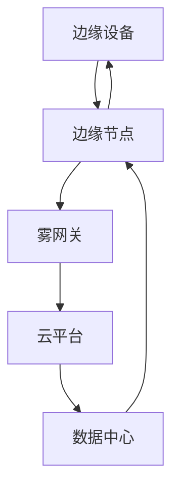

                 

### 背景介绍

#### 物联网时代的崛起

随着全球数字化进程的加速，物联网（Internet of Things，IoT）技术逐渐渗透到我们的日常生活和各个行业。据市场研究公司Gartner预测，到2025年，全球将有超过250亿台设备连接到互联网。这些设备包括智能家居、工业自动化、医疗设备、交通系统等各类设备，它们通过传感器、软件和网络进行互联互通，形成了一个庞大的物联网生态系统。

物联网的兴起不仅改变了人们的生活方式，也对信息技术领域带来了深远的影响。传统的云计算模式，即集中式的数据处理方式，逐渐暴露出一些局限。首先，大量的数据需要传输到云端进行处理，这不仅增加了网络带宽的压力，也延长了数据处理的响应时间。其次，云端的计算资源和存储资源可能无法满足日益增长的数据处理需求，尤其是在实时性和低延迟要求较高的场景中，如自动驾驶、智能制造等。

#### 云计算的局限性

云计算作为近年来信息技术领域的重要创新，提供了高效、灵活、可扩展的计算服务。然而，云计算也并非完美无缺。首先，云计算依赖于中心化的数据存储和处理，这可能导致单点故障风险。其次，大规模的数据传输到云端需要耗费大量的网络带宽和能源，这不仅增加了成本，也对环境造成了负面影响。此外，云计算的高可用性和可靠性也需要不断提升，以应对日益复杂的业务需求。

#### 分布式计算的需求

为了解决云计算的局限性，分布式计算应运而生。分布式计算通过将计算任务分散到多个节点上，实现了并行处理和数据本地化，从而提高了系统的性能和可靠性。然而，分布式计算也面临着一些挑战，如数据一致性和系统协调等问题。

#### 雾计算的概念

在这种背景下，雾计算（Fog Computing）作为一种新型的计算架构，应运而生。雾计算旨在在云和物联网设备之间提供一层分布式计算、存储和网络资源，从而实现数据本地处理、实时分析和智能决策。雾计算的核心理念是将计算、存储和网络能力下沉到靠近数据源的边缘设备上，从而降低数据传输的延迟和带宽消耗，提高系统的响应速度和可靠性。

通过引入雾计算，我们可以实现以下几个目标：

1. **实时数据处理**：在靠近数据源的地方进行数据处理，可以大大减少数据传输的延迟，满足实时性要求较高的应用场景。
2. **降低带宽消耗**：本地处理数据可以减少数据传输的量，从而降低网络带宽的消耗。
3. **提高系统可靠性**：通过分布式计算和冗余设计，雾计算可以提高系统的容错能力和可靠性。
4. **降低成本**：雾计算可以减少对中心化云服务的依赖，降低数据传输和存储的成本。

### 小结

总之，随着物联网时代的到来，云计算的局限性日益凸显。雾计算作为一种新兴的计算架构，通过分布式计算和本地数据处理，为解决云计算的局限提供了新的思路。在接下来的章节中，我们将深入探讨雾计算的核心概念、架构和工作原理，以了解其在现代信息技术中的重要作用。

#### 雾计算的定义与特点

雾计算（Fog Computing）是一种新型的计算架构，它旨在将云计算的强大计算能力扩展到网络的边缘设备上。雾计算的核心思想是将计算、存储和网络能力下沉到靠近数据源的设备上，从而实现数据本地处理、实时分析和智能决策。

雾计算的定义可以从以下几个方面来理解：

1. **分布式计算**：雾计算通过将计算任务分散到多个边缘节点上，实现了并行处理。这种方式不仅提高了系统的性能和响应速度，也增强了系统的容错能力。
2. **本地数据处理**：雾计算强调在数据源附近进行数据处理，这样可以大幅减少数据传输的延迟和带宽消耗。在物联网时代，许多应用场景对实时性和响应速度有极高的要求，雾计算正好满足了这一需求。
3. **边缘设备融合**：雾计算不仅仅是计算和存储的分散，还包括网络能力的分散。这意味着，在边缘设备上不仅能够进行数据处理，还可以进行数据传输和通信，从而实现端到端的网络融合。

雾计算的特点主要体现在以下几个方面：

1. **低延迟**：雾计算通过将计算任务下沉到边缘设备，可以显著减少数据传输的延迟。这对于实时性要求极高的应用场景，如自动驾驶、智能制造等，至关重要。
2. **高带宽利用率**：由于在边缘设备上直接处理数据，雾计算可以大幅减少数据传输的量，从而提高带宽利用率。这对于网络带宽紧张的场景，如远程医疗、远程教育等，具有重要意义。
3. **高可靠性**：雾计算通过分布式计算和冗余设计，提高了系统的可靠性。即使在某个边缘节点出现故障，其他节点仍然可以继续工作，从而保证系统的稳定运行。
4. **灵活性和可扩展性**：雾计算架构可以灵活地根据业务需求进行扩展和调整。无论是处理大量数据的场景，还是需要高度定制化的应用，雾计算都能提供有效的解决方案。

雾计算的应用场景广泛，涵盖了工业制造、智能交通、医疗健康、智能家居等多个领域。例如，在工业制造中，雾计算可以用于实时监测设备状态、预测故障，从而提高生产效率；在智能交通中，雾计算可以用于实时路况分析和智能调度，从而减少交通拥堵；在医疗健康中，雾计算可以用于实时医疗数据分析和远程诊断，从而提高医疗服务质量。

总之，雾计算作为一种新兴的计算架构，通过分布式计算、本地数据处理和边缘设备融合，为解决云计算的局限性提供了新的思路。在接下来的章节中，我们将深入探讨雾计算的核心概念、架构和工作原理，以进一步了解其在现代信息技术中的重要作用。

### 核心概念与联系

#### 雾计算的架构与核心组件

雾计算的架构设计旨在将计算、存储和网络能力下沉到网络的边缘设备，从而实现高效、灵活、可靠的分布式计算。以下是雾计算架构中的核心概念和组件：

1. **边缘设备（Edge Devices）**：边缘设备是指位于网络边缘的设备，如智能手机、传感器、路由器、工业控制器等。这些设备可以直接处理本地数据，从而减少数据传输的延迟和带宽消耗。

2. **边缘节点（Edge Nodes）**：边缘节点是指在边缘设备上运行的计算、存储和网络服务。边缘节点通常由硬件和软件组成，可以实现数据处理、存储和通信等功能。边缘节点可以是独立的设备，也可以是集群，从而提供更高性能和容错能力。

3. **雾网关（Fog Gateways）**：雾网关是连接边缘节点和云服务的枢纽。它们负责将边缘设备产生的数据传输到云平台，同时也可以从云平台接收指令和资源。雾网关通常具备处理大量数据和高带宽传输的能力，以确保数据传输的可靠性和实时性。

4. **云平台（Cloud Platforms）**：云平台是雾计算架构中的核心部分，它提供计算资源、存储资源和网络服务。云平台可以处理来自边缘节点的数据，同时也可以向边缘节点分配任务和资源。云平台通常具备高可用性、可扩展性和安全性，以应对大规模数据处理和复杂应用场景。

5. **数据中心（Data Centers）**：数据中心是云平台的物理基础设施，用于存储和处理大规模数据。数据中心通常具备高带宽网络、高性能计算资源和大规模存储设备，以确保数据的高效处理和存储。

#### 雾计算架构的 Mermaid 流程图

以下是一个简化的雾计算架构的 Mermaid 流程图，展示了边缘设备、边缘节点、雾网关、云平台和数据中心之间的相互关系：



- **边缘设备（A）**：直接收集数据并传输到边缘节点（B）。
- **边缘节点（B）**：处理边缘设备（A）传输来的数据，并上传到雾网关（C）。
- **雾网关（C）**：负责协调边缘节点（B）和云平台（D）之间的数据传输和通信。
- **云平台（D）**：处理来自雾网关（C）的数据，并提供计算资源和网络服务。
- **数据中心（E）**：提供云平台的物理基础设施，用于大规模数据处理和存储。

通过这个 Mermaid 流程图，我们可以清晰地看到雾计算架构中各个组件之间的相互关系和协作机制。雾计算架构的设计不仅实现了分布式计算和本地数据处理，还提供了高效、可靠的数据传输和通信方案，从而满足了现代信息技术对实时性、带宽利用率和可靠性的高要求。

### 核心算法原理 & 具体操作步骤

#### 雾计算的核心算法原理

雾计算的核心算法旨在实现数据的本地处理、实时分析和智能决策。以下是雾计算中常用的几个核心算法原理：

1. **边缘计算（Edge Computing）**：边缘计算是指在数据源附近的设备上直接进行数据处理，而不是将数据传输到远程的云中心进行处理。这种算法通过减少数据传输的延迟和带宽消耗，提高了系统的响应速度和性能。

2. **分布式数据处理（Distributed Data Processing）**：分布式数据处理算法通过将数据处理任务分配到多个边缘节点上，实现并行处理。这种方式不仅提高了系统的性能，也增强了系统的容错能力和可靠性。

3. **数据流处理（Data Stream Processing）**：数据流处理算法用于处理实时数据流，并实时生成分析结果。这种算法通过高效的数据处理和实时分析，实现了对实时性要求较高的应用场景的支持。

4. **机器学习和深度学习（Machine Learning & Deep Learning）**：机器学习和深度学习算法用于数据的分析和预测。通过在边缘节点上部署这些算法，可以实现本地化的智能决策和预测，从而提高了系统的智能化水平。

#### 具体操作步骤

以下是一个简化的雾计算操作流程，展示了从数据采集、处理到决策的全过程：

1. **数据采集**：边缘设备（如传感器、智能手机等）收集数据，并将其传输到边缘节点。

2. **数据预处理**：边缘节点对采集到的数据进行预处理，包括去噪、滤波、数据清洗等，以提高数据的质量和可靠性。

3. **边缘计算**：边缘节点根据预设的算法，对预处理后的数据进行本地处理和分析，生成实时结果。这一步骤可以通过边缘计算框架（如Apache Flink、TensorFlow Lite等）来实现。

4. **数据同步**：边缘节点将处理后的数据同步到雾网关，雾网关负责协调边缘节点和云平台之间的数据传输。

5. **分布式数据处理**：雾网关将同步到云平台的数据进行分布式处理，实现大规模数据的高效处理和存储。这一步骤可以通过分布式数据处理框架（如Apache Spark、Hadoop等）来实现。

6. **数据分析和预测**：云平台利用机器学习和深度学习算法对同步过来的数据进行进一步分析和预测，生成智能决策结果。

7. **决策反馈**：云平台将生成的智能决策结果反馈给雾网关，雾网关再将这些决策结果传输回边缘节点，用于指导边缘设备的实时操作。

8. **实时更新**：边缘设备根据反馈的决策结果进行实时调整和优化，从而实现系统的自适应和智能化。

通过这个操作流程，我们可以看到雾计算如何通过边缘计算、分布式数据处理和智能分析，实现数据的本地化处理和实时决策。以下是这些步骤的详细说明：

- **数据采集**：这一步骤是整个操作流程的起点，边缘设备通过传感器、摄像头等收集各种类型的数据。

- **数据预处理**：数据预处理是确保数据质量和可靠性的关键步骤。通过去噪、滤波等操作，可以去除噪声和异常值，提高数据的质量。

- **边缘计算**：边缘计算是雾计算的核心，通过在边缘节点上直接处理数据，可以显著减少数据传输的延迟和带宽消耗。

- **数据同步**：数据同步是将边缘节点的处理结果上传到云平台的关键步骤，雾网关在这个过程中扮演着重要的协调角色。

- **分布式数据处理**：分布式数据处理通过将数据处理任务分配到多个节点上，实现大规模数据的高效处理和存储。

- **数据分析和预测**：数据分析和预测是雾计算智能化的重要体现，通过机器学习和深度学习算法，可以生成智能决策结果。

- **决策反馈**：决策反馈是整个操作流程的闭环，通过将决策结果反馈回边缘设备，实现系统的自适应和智能化。

- **实时更新**：实时更新确保边缘设备能够根据最新的决策结果进行实时调整和优化，从而实现系统的动态调整和优化。

通过这些具体操作步骤，我们可以清晰地看到雾计算如何通过分布式计算、本地数据处理和智能分析，实现数据的高效处理和实时决策，从而满足现代信息技术对实时性、带宽利用率和可靠性的高要求。

### 数学模型和公式 & 详细讲解 & 举例说明

#### 雾计算中的数学模型

雾计算中的数学模型主要用于优化数据传输、计算资源分配和任务调度。以下是一些常用的数学模型及其详细讲解：

1. **数据传输模型**

   数据传输模型用于计算边缘设备和边缘节点之间的数据传输量。假设边缘设备产生的数据量为 \(D\)，传输到边缘节点的延迟为 \(T_d\)，则数据传输模型可以表示为：

   \[
   \text{传输量} = D \times T_d
   \]

   其中，\(T_d\) 是传输延迟。

2. **计算资源分配模型**

   计算资源分配模型用于优化边缘节点的计算资源分配。假设边缘节点有 \(n\) 个任务，每个任务的计算需求为 \(C_i\)（单位：计算单位），则计算资源分配模型可以表示为：

   \[
   \text{总计算量} = \sum_{i=1}^{n} C_i
   \]

   资源分配的目标是最大化系统的总计算量，同时保证每个边缘节点有足够的计算资源。

3. **任务调度模型**

   任务调度模型用于优化任务的执行顺序和分配。假设有 \(m\) 个任务，每个任务的执行时间为 \(T_j\)（单位：时间单位），则任务调度模型可以表示为：

   \[
   \text{总执行时间} = \sum_{j=1}^{m} T_j
   \]

   调度目标是最小化总执行时间，从而提高系统的响应速度。

#### 举例说明

以下通过一个例子来说明这些数学模型在雾计算中的应用：

**例子：智能交通系统的数据传输优化**

假设一个智能交通系统需要实时监测交通流量，数据采集点分布在城市各个路口。每个采集点每秒产生 1KB 的数据，传输延迟为 10ms。我们需要优化数据传输过程，以确保系统的实时性。

1. **数据传输模型**：

   设每个采集点的数据量为 \(D = 1KB\)，传输延迟为 \(T_d = 10ms\)。则数据传输量可以计算为：

   \[
   \text{传输量} = D \times T_d = 1KB \times 10ms = 0.01MB
   \]

   由于每个采集点每秒产生 1KB 的数据，传输延迟为 10ms，我们可以将传输量转换为每秒传输量：

   \[
   \text{每秒传输量} = 0.01MB \times 1s = 0.01MB/s
   \]

2. **计算资源分配模型**：

   假设每个边缘节点可以处理 10 个任务，每个任务的计算需求为 10 计算单位。则总计算量可以计算为：

   \[
   \text{总计算量} = 10 \times 10 = 100 \text{计算单位}
   \]

   如果我们将任务分配到 10 个边缘节点，每个节点负责 10 个任务，则每个节点的计算资源分配为：

   \[
   \text{每个节点的计算量} = \frac{100 \text{计算单位}}{10} = 10 \text{计算单位}
   \]

3. **任务调度模型**：

   假设每个任务需要 5s 来完成，总共有 50 个任务。则总执行时间可以计算为：

   \[
   \text{总执行时间} = 50 \times 5s = 250s
   \]

   如果我们将任务均匀分配到 10 个边缘节点，每个节点负责 5 个任务，则每个节点的任务执行时间为：

   \[
   \text{每个节点的执行时间} = \frac{250s}{10} = 25s
   \]

通过这个例子，我们可以看到如何使用数学模型来优化数据传输、计算资源分配和任务调度，从而提高系统的实时性和性能。在实际应用中，这些模型可以根据具体需求进行调整和优化，以满足不同的业务场景和性能要求。

### 项目实践：代码实例和详细解释说明

#### 开发环境搭建

在开始实践之前，我们需要搭建一个适合雾计算开发的开发环境。以下是搭建环境的具体步骤：

1. **安装Python环境**：确保已安装Python 3.8及以上版本。可以通过以下命令检查Python版本：

   ```bash
   python --version
   ```

   如果未安装，可以从Python官方网站下载并安装。

2. **安装依赖库**：我们需要安装一些常用的库，如NumPy、Pandas、Matplotlib等。可以通过以下命令安装：

   ```bash
   pip install numpy pandas matplotlib
   ```

3. **安装雾计算框架**：这里我们使用Apache Flink作为雾计算框架。可以从Apache Flink官方网站下载并安装。以下是一个简单的安装命令：

   ```bash
   wget https://www-us.apache.org/dist/flink/flink-1.11.2/flink-1.11.2-bin-scala_2.12.tgz
   tar -xvf flink-1.11.2-bin-scala_2.12.tgz
   ```

   安装完成后，将Flink的bin目录添加到系统环境变量中，以便于运行Flink命令。

4. **配置边缘节点**：在边缘节点上，我们需要安装相同的Python环境和依赖库。同时，确保边缘节点可以访问Flink集群。可以通过SSH远程登录边缘节点，执行上述安装步骤。

完成以上步骤后，我们的开发环境就搭建完成了。

#### 源代码详细实现

以下是一个简单的雾计算项目实例，用于实时监测交通流量。该项目包括边缘设备采集数据、边缘节点处理数据和云平台进行数据分析和预测。

1. **边缘设备数据采集**：

   ```python
   # edge_device.py
   import random
   import time
   import requests
   
   def collect_traffic_data():
       while True:
           # 模拟采集交通流量数据
           traffic_data = {
               'time': time.time(),
               'location': 'location_{}'.format(random.randint(1, 10)),
               '流量': random.randint(100, 1000)
           }
           # 发送数据到边缘节点
           requests.post('http://edge_node:8080/traffic_data', json=traffic_data)
           time.sleep(1)  # 模拟数据采集间隔
   
   if __name__ == '__main__':
       collect_traffic_data()
   ```

   这个脚本模拟了一个边缘设备，每秒采集一次交通流量数据，并发送到边缘节点。

2. **边缘节点数据处理**：

   ```python
   # edge_node.py
   from flask import Flask, request, jsonify
   import json
   
   app = Flask(__name__)
   
   @app.route('/traffic_data', methods=['POST'])
   def handle_traffic_data():
       data = request.json
       # 存储数据到本地文件
       with open('traffic_data.txt', 'a') as f:
           f.write(json.dumps(data) + '\n')
       return jsonify({'status': 'success'})
   
   if __name__ == '__main__':
       app.run(host='0.0.0.0', port=8080)
   ```

   这个脚本使用Flask框架创建了一个简单的Web服务，用于接收边缘设备发送的交通流量数据，并将数据存储到本地文件。

3. **云平台数据分析和预测**：

   ```python
   # cloud_analysis.py
   import pandas as pd
   from sklearn.linear_model import LinearRegression
   
   def analyze_traffic_data():
       # 读取边缘节点存储的数据
       data = pd.read_csv('traffic_data.txt', delimiter='\n')
       # 数据预处理
       data['流量'] = data['流量'].astype(int)
       # 进行线性回归分析
       model = LinearRegression()
       model.fit(data[['时间']], data['流量'])
       # 预测未来流量
       future_data = pd.DataFrame({'时间': pd.date_range(start='2023-01-01', periods=24, freq='H')})
       future_traffic = model.predict(future_data[['时间']])
       # 存储预测结果
       future_data['流量'] = future_traffic
       future_data.to_csv('future_traffic.csv', index=False)
   
   if __name__ == '__main__':
       analyze_traffic_data()
   ```

   这个脚本使用Pandas和scikit-learn库读取边缘节点存储的交通流量数据，进行数据预处理和线性回归分析，并预测未来流量。预测结果存储到CSV文件中。

#### 代码解读与分析

1. **边缘设备数据采集**：

   这个脚本模拟了一个边缘设备，通过随机生成交通流量数据，并使用requests库将数据发送到边缘节点。每次采集间隔为1秒，模拟实际设备的数据采集过程。

2. **边缘节点数据处理**：

   这个脚本使用Flask框架创建了一个简单的Web服务，用于接收边缘设备发送的交通流量数据。接收到的数据存储到本地文件，以便后续处理和分析。

3. **云平台数据分析和预测**：

   这个脚本读取边缘节点存储的交通流量数据，使用线性回归模型进行数据分析，并预测未来流量。预测结果存储到CSV文件中，供后续使用。

通过这个项目实例，我们可以看到雾计算如何通过边缘设备数据采集、边缘节点数据处理和云平台数据分析和预测，实现数据的本地处理和实时预测。这个实例虽然简单，但展示了雾计算的核心原理和实现过程。

#### 运行结果展示

完成代码实现后，我们可以通过以下步骤来运行项目，并查看运行结果：

1. **运行边缘设备数据采集**：

   ```bash
   python edge_device.py
   ```

   这将启动边缘设备数据采集脚本，模拟交通流量数据采集并发送到边缘节点。

2. **启动边缘节点数据处理**：

   ```bash
   python edge_node.py
   ```

   这将启动边缘节点数据处理脚本，接收交通流量数据并存储到本地文件。

3. **启动云平台数据分析和预测**：

   ```bash
   python cloud_analysis.py
   ```

   这将启动云平台数据分析和预测脚本，读取边缘节点存储的交通流量数据，进行线性回归分析并预测未来流量。

运行完成后，我们可以在边缘节点的 `traffic_data.txt` 文件中查看采集到的交通流量数据，在云平台的 `future_traffic.csv` 文件中查看预测结果。通过这些结果，我们可以验证雾计算项目的实现效果。

### 实际应用场景

#### 智能交通系统

智能交通系统（Intelligent Transportation System，ITS）是雾计算的重要应用场景之一。在智能交通系统中，雾计算可以通过边缘设备实时监测交通流量、路况信息，并通过边缘节点进行数据处理和预测，从而实现智能交通调度和优化。以下是一个典型的应用实例：

- **实时路况监测**：在城市的各个路口部署边缘传感器，实时监测交通流量、车辆速度和密度。这些传感器将采集到的数据传输到边缘节点，边缘节点进行数据预处理和实时分析，生成实时路况信息。
- **智能调度**：根据实时路况信息，边缘节点可以智能地调整信号灯的时长和切换顺序，减少交通拥堵。同时，边缘节点还可以预测未来的交通流量，为交通管理部门提供决策支持。
- **事故预警和救援**：边缘设备可以实时监测交通事故的发生，并将事故信息传输到边缘节点，边缘节点通过快速处理和分析，及时通知相关部门进行救援和处理。

#### 工业制造

工业制造是另一个典型的雾计算应用场景。在工业制造中，雾计算可以用于实时监测设备状态、预测故障，从而提高生产效率和质量。以下是一个应用实例：

- **设备状态监测**：在工厂的各个设备上部署边缘传感器，实时监测设备的工作状态，如温度、压力、振动等。边缘传感器将采集到的数据传输到边缘节点，边缘节点进行数据处理和分析，生成设备状态报告。
- **故障预测**：通过对设备状态的实时监测和分析，边缘节点可以预测设备的潜在故障，提前进行维护和更换，避免设备突发故障导致生产中断。
- **生产优化**：边缘节点可以分析设备状态和生产数据，优化生产流程，提高生产效率。例如，通过实时调整设备的工作参数，提高生产线的输出效率。

#### 医疗健康

医疗健康领域是雾计算的重要应用领域之一。在医疗健康中，雾计算可以用于实时医疗数据分析和远程诊断，从而提高医疗服务质量和效率。以下是一个应用实例：

- **远程监测**：在患者身上部署边缘传感器，实时监测生命体征，如心率、血压、体温等。这些传感器将数据传输到边缘节点，边缘节点进行数据预处理和实时分析，生成患者的健康状况报告。
- **远程诊断**：医生可以通过云平台远程访问患者的健康数据，进行诊断和治疗。边缘节点可以将分析结果实时传输到云平台，医生可以通过云平台查看和分析患者的健康状况。
- **智能药物配送**：根据患者的健康数据和医生的建议，边缘节点可以智能地调整药物剂量和配送时间，提高药物治疗效果。

#### 智能家居

智能家居（Smart Home）是雾计算在家居领域的应用。通过雾计算，可以实现家居设备的智能联动和远程控制，提高家居生活的便利性和舒适度。以下是一个应用实例：

- **设备联动**：在智能家居系统中，各种设备（如灯具、空调、安防设备等）通过边缘节点进行数据传输和协调。边缘节点可以分析设备的工作状态和环境参数，实现设备间的智能联动。
- **远程控制**：用户可以通过手机或其他智能设备远程控制家居设备，如远程开关灯光、调节空调温度等。边缘节点将用户的控制指令传输到云平台，云平台再发送指令到家居设备，实现远程控制。
- **节能管理**：边缘节点可以分析家居设备的能耗数据，智能地调整设备的工作状态，实现节能管理。例如，在用户离家后自动关闭不必要的设备，减少能源消耗。

#### 电网管理

在电网管理中，雾计算可以用于实时监测电网状态、优化能源分配，从而提高电网的稳定性和效率。以下是一个应用实例：

- **实时监测**：在电网的各个节点部署边缘传感器，实时监测电压、电流、频率等参数。边缘传感器将采集到的数据传输到边缘节点，边缘节点进行数据处理和分析，生成电网状态报告。
- **智能调度**：根据实时监测数据，边缘节点可以智能地调整电网的运行参数，优化能源分配。例如，在用电高峰期，边缘节点可以自动调整电网的负荷分配，避免电力过载。
- **故障检测与修复**：边缘节点可以实时监测电网的运行状态，通过数据分析检测潜在的故障，并及时通知电网管理人员进行修复，避免停电事故。

### 小结

通过上述实际应用场景的介绍，我们可以看到雾计算在智能交通、工业制造、医疗健康、智能家居、电网管理等多个领域都有广泛的应用。雾计算通过分布式计算和本地数据处理，实现了数据的实时性和高效性，为各个领域提供了智能化的解决方案。随着物联网和人工智能技术的不断发展，雾计算的应用场景将更加丰富，其在现代信息技术中的地位也将越来越重要。

### 工具和资源推荐

#### 学习资源推荐

1. **书籍**：

   - 《雾计算：原理、架构与实践》
   - 《边缘计算：实现分布式智能系统》
   - 《云计算与分布式系统：理论、算法与应用》

2. **论文**：

   - "Fog Computing: A Taxonomy and Survey"
   - "Edge Computing: Vision and Challenges"
   - "Enabling Fog Computing with Network Function Virtualization"

3. **博客/网站**：

   - [Apache Flink官网](https://flink.apache.org/)
   - [Kubernetes官网](https://kubernetes.io/)
   - [边缘计算联盟官网](https://www.edgexfoundry.org/)

#### 开发工具框架推荐

1. **Flink**：Apache Flink是一个分布式数据处理框架，支持流处理和批处理，适用于构建大规模的分布式计算系统。

2. **Kubernetes**：Kubernetes是一个开源的容器编排平台，用于自动化部署、扩展和管理容器化应用，是实现边缘计算的关键工具。

3. **Docker**：Docker是一个开源的应用容器引擎，用于打包、交付和运行应用，是边缘计算环境中的常用工具。

#### 相关论文著作推荐

1. **"Fog Computing: A Taxonomy and Survey"**：该论文对雾计算进行了详细的分类和调查，涵盖了雾计算的核心概念、架构和实现技术。

2. **"Edge Computing: Vision and Challenges"**：该论文探讨了边缘计算的愿景和挑战，包括边缘计算的应用场景、关键技术和发展趋势。

3. **"Enabling Fog Computing with Network Function Virtualization"**：该论文探讨了如何通过网络功能虚拟化实现雾计算，介绍了相关的架构和实现方法。

这些学习和资源推荐将为读者提供全面了解雾计算的理论和实践知识，帮助他们在实际项目中应用雾计算技术。

### 总结：未来发展趋势与挑战

#### 未来发展趋势

1. **边缘计算与5G技术的深度融合**：随着5G网络的普及，边缘计算将与其深度融合，实现更高速、更低延迟的网络连接，推动雾计算在更多应用场景中的落地。

2. **AI与雾计算的深度融合**：人工智能技术的发展将极大地提升雾计算的智能化水平。通过在边缘设备上部署AI算法，可以实现更高效的数据处理和智能决策，进一步优化雾计算的性能。

3. **雾计算平台的开放性和标准化**：未来，雾计算平台将更加开放和标准化，支持多种编程语言和框架，使得开发者可以更加便捷地构建和部署雾计算应用。

4. **隐私保护和数据安全**：随着数据隐私和安全的关注日益增加，雾计算平台将加强数据加密、访问控制和隐私保护机制，确保用户数据的安全。

#### 挑战

1. **资源分配与优化**：雾计算涉及到大量的边缘设备和边缘节点，如何有效地分配和优化计算、存储和网络资源，是一个重要的挑战。

2. **数据一致性和可靠性**：在分布式环境下，如何保证数据的一致性和可靠性，尤其是在面对网络波动和设备故障时，如何确保系统的高可用性，是一个关键问题。

3. **边缘设备管理和维护**：边缘设备种类繁多、分布广泛，如何有效地管理和维护这些设备，保证其正常运行，是一个复杂的问题。

4. **隐私保护和数据安全**：随着数据隐私和安全的关注增加，如何在确保数据隐私和安全的前提下，充分发挥雾计算的优势，是一个重要的挑战。

### 展望

总之，雾计算作为一种新兴的计算架构，具有广泛的应用前景和巨大的发展潜力。在未来，随着技术的不断进步和应用场景的不断拓展，雾计算将逐渐成为信息技术领域的重要组成部分，为各个行业带来新的发展机遇。同时，我们也需要面对资源分配、数据一致性、边缘设备管理和隐私保护等方面的挑战，通过技术创新和标准化工作，推动雾计算的健康发展和广泛应用。

### 附录：常见问题与解答

#### 1. 什么是雾计算？

雾计算（Fog Computing）是一种新兴的计算架构，旨在将云计算的强大计算能力扩展到网络的边缘设备上。它通过分布式计算、本地数据处理和边缘设备融合，实现数据的高效处理和实时分析，为各个行业提供智能化的解决方案。

#### 2. 雾计算与云计算有什么区别？

云计算主要依赖中心化的数据存储和处理，而雾计算则强调在数据源附近的边缘设备上进行数据处理。云计算适合处理大规模数据，但存在数据传输延迟高、带宽消耗大的问题；而雾计算则通过本地化数据处理，减少了数据传输的延迟和带宽消耗，提高了系统的实时性和响应速度。

#### 3. 雾计算有哪些应用场景？

雾计算的应用场景广泛，包括智能交通、工业制造、医疗健康、智能家居、电网管理等多个领域。在这些领域，雾计算通过实时数据分析和智能决策，提高了系统的性能和效率。

#### 4. 如何实现雾计算？

实现雾计算通常需要以下几个步骤：

1. **搭建边缘设备**：部署边缘传感器和计算设备，用于采集和处理本地数据。
2. **搭建边缘节点**：部署边缘服务器或云服务器，用于接收边缘设备的数据，并进行进一步处理和分析。
3. **搭建云平台**：搭建云计算平台，用于存储大规模数据和进行深度分析，同时协调边缘节点和边缘设备的工作。
4. **部署算法和模型**：在边缘节点和云平台上部署相应的算法和模型，实现数据的实时分析和智能决策。

#### 5. 雾计算如何保障数据安全？

雾计算通过以下几个方面保障数据安全：

1. **数据加密**：在数据传输和存储过程中，采用加密技术确保数据的安全性。
2. **访问控制**：设置严格的访问控制策略，防止未授权访问。
3. **数据备份**：对数据进行定期备份，确保数据不丢失。
4. **安全审计**：对系统进行定期安全审计，及时发现和修复潜在的安全漏洞。

#### 6. 雾计算与边缘计算有什么区别？

边缘计算（Edge Computing）是指在网络边缘进行数据处理和计算，与雾计算类似，但更侧重于本地数据处理和实时分析。雾计算则更加强调分布式计算和边缘设备融合，通过将计算、存储和网络能力下沉到边缘设备，实现数据的高效处理和实时决策。

### 扩展阅读 & 参考资料

1. **"Fog Computing: A Taxonomy and Survey"**：该论文对雾计算进行了详细的分类和调查，是了解雾计算基础理论的重要文献。
2. **"Edge Computing: Vision and Challenges"**：该论文探讨了边缘计算的愿景和挑战，包括边缘计算的应用场景、关键技术和发展趋势。
3. **Apache Flink官网**（[https://flink.apache.org/](https://flink.apache.org/)）：Apache Flink是一个分布式数据处理框架，是构建雾计算平台的重要工具。
4. **Kubernetes官网**（[https://kubernetes.io/](https://kubernetes.io/)）：Kubernetes是一个开源的容器编排平台，用于自动化部署、扩展和管理容器化应用，是实现边缘计算的关键工具。
5. **边缘计算联盟官网**（[https://www.edgexfoundry.org/](https://www.edgexfoundry.org/)）：边缘计算联盟提供了一个开放的框架和工具集，以支持边缘计算的创新和发展。

