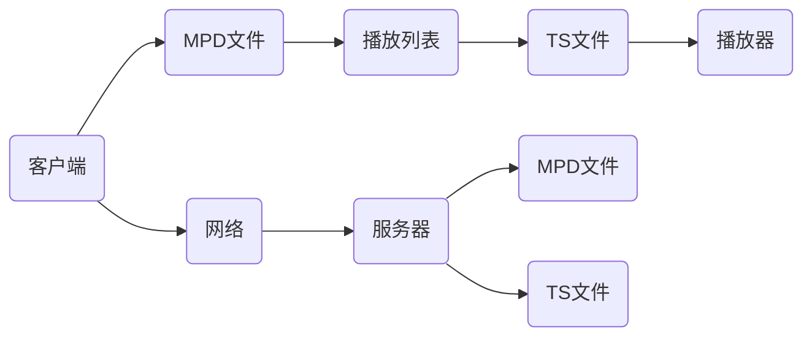

                 

### 1. 背景介绍

随着互联网技术的飞速发展，点播和直播服务已经成为了人们日常生活中不可或缺的一部分。无论是用户观看视频课程，还是线上娱乐、体育赛事的直播，点播与直播服务都扮演着重要角色。而m3u8协议作为点播与直播的核心技术之一，近年来得到了广泛的应用和关注。

m3u8协议，全称为" MPEG-DASH HTTP Live Streaming"（MPD：Media Presentation Description），是一种基于HTTP协议的直播和点播传输协议。它由 MPEG DASH (Dynamic Adaptive Streaming over HTTP) 规范衍生而来，旨在实现流媒体内容的动态适应和高效传输。

与传统RTMP协议相比，m3u8协议具有以下几个显著优势：

1. **高效传输**：m3u8协议基于HTTP协议传输，充分利用了HTTP的网络优势，可以实现高效的传输速度和较低的延迟。

2. **动态适应**：m3u8协议支持动态适应网络环境，根据用户的网络状况动态调整播放质量，保证用户观看体验的稳定性和流畅性。

3. **兼容性强**：m3u8协议具有较好的兼容性，可以在多种设备和平台上流畅运行，包括PC、手机、平板等。

4. **安全性**：m3u8协议支持加密传输，可以有效保障流媒体内容的安全性。

正因为这些优势，m3u8协议在视频点播和直播领域得到了广泛应用。例如，常见的视频点播平台如腾讯视频、爱奇艺、优酷等，以及直播平台如斗鱼、虎牙、哔哩哔哩等，都采用了m3u8协议来实现内容的传输和播放。

接下来，我们将详细探讨m3u8协议的实现原理和操作步骤，帮助读者全面了解这一技术。

### 2. 核心概念与联系

#### 2.1 m3u8协议的基本概念

m3u8协议，全称为"MPEG-DASH HTTP Live Streaming"（MPD：Media Presentation Description），是一种基于HTTP协议的流媒体传输协议。它由MPEG DASH (Dynamic Adaptive Streaming over HTTP) 规范衍生而来，旨在实现流媒体内容的动态适应和高效传输。

m3u8协议的核心概念包括以下几个部分：

1. **MPD文件**：MPD（Media Presentation Description）文件是m3u8协议的核心文件，它包含了整个流媒体播放的元数据，如视频的播放列表、音频流、字幕流等。MPD文件是一个XML文件，包含了详细的媒体信息，如编码格式、分辨率、播放时长等。

2. **m3u8播放列表**：m3u8播放列表是一个文本文件，包含了当前播放的媒体文件列表。每个列表项指向一个TS文件，TS文件是m3u8协议中实际传输的媒体数据文件。m3u8播放列表格式如下：

   ```
   #EXTM3U
   #EXT-X-STREAM-INF:BANDWIDTH=12345,CODECS="avc,mp4a"
   http://example.com/stream1.ts
   #EXTINF:5.000,
   http://example.com/stream2.ts
   ```

   上述播放列表中包含了两个媒体文件，第一个文件的码率为12345kbps，编码格式为H.264和AAC，第二个文件的码率为未知。

3. **TS文件**：TS（Transport Stream）文件是m3u8协议中实际传输的媒体数据文件。TS文件包含了视频、音频、字幕等数据，采用了MPEG-2传输流（TS）格式进行封装。TS文件格式如下：

   ```
   47 47 53 4d 00 00 00 1e 00 00 10 00 00 00 01 70 00 00 00 2a 00 00 00 2d 00 00 00 4a ...
   ```

   TS文件的结构相对复杂，包含了多个层级的头部信息和数据内容。

#### 2.2 m3u8协议的工作原理

m3u8协议的工作原理可以分为以下几个步骤：

1. **请求MPD文件**：客户端首先请求MPD文件，获取流媒体播放的元数据信息。

2. **解析MPD文件**：客户端解析MPD文件，获取播放列表和TS文件的URL。

3. **请求TS文件**：客户端根据播放列表，依次请求TS文件，获取实际媒体数据。

4. **播放TS文件**：客户端播放TS文件中的媒体数据，实现流媒体播放。

5. **动态适应**：在播放过程中，客户端根据网络状况和播放质量，动态调整播放码率和质量，保证播放的流畅性和稳定性。

#### 2.3 m3u8协议与其他协议的比较

m3u8协议与其他流媒体传输协议如RTMP、HLS等相比，具有以下特点：

1. **RTMP**：RTMP（Real Time Messaging Protocol）是由Adobe开发的一种实时消息传输协议，主要用于Flash流媒体传输。RTMP协议的主要优势在于低延迟和高可靠性，但兼容性较差，主要应用于Flash和Adobe相关产品。

2. **HLS**：HLS（HTTP Live Streaming）是由苹果公司开发的一种流媒体传输协议，与m3u8协议类似，也是基于HTTP协议进行传输。HLS协议的主要优势在于兼容性较好，支持多种设备和平台，但相对于m3u8协议，HLS协议的动态适应能力较弱。

3. **m3u8协议**：m3u8协议结合了MPEG DASH和HTTP协议的优势，具有高效的传输速度、动态适应能力和良好的兼容性。m3u8协议在视频点播和直播领域得到了广泛应用，成为了一种重要的流媒体传输协议。

#### 2.4 m3u8协议的应用场景

m3u8协议在以下应用场景中具有显著优势：

1. **视频点播**：m3u8协议支持多种分辨率和码率的媒体文件传输，可以满足用户对高清、流畅视频的需求。视频点播平台如腾讯视频、爱奇艺、优酷等，都采用了m3u8协议来实现内容传输和播放。

2. **直播**：m3u8协议支持低延迟、高效传输和动态适应，适合于实时性要求较高的直播场景。直播平台如斗鱼、虎牙、哔哩哔哩等，都采用了m3u8协议来实现直播内容的传输和播放。

3. **教育领域**：m3u8协议可以应用于在线教育平台，提供高质量的在线课程点播和直播服务。教育平台如网易云课堂、慕课网等，都采用了m3u8协议来实现课程内容的传输和播放。

#### 2.5 m3u8协议的架构图

为了更好地理解m3u8协议的工作原理和应用场景，我们可以通过以下架构图来展示：



上述架构图中，客户端通过网络请求MPD文件，解析播放列表，依次请求TS文件，最终实现流媒体播放。同时，服务器端负责存储和管理MPD文件和TS文件，为客户端提供流媒体服务。

通过以上内容，我们对m3u8协议的基本概念、工作原理、应用场景和架构有了全面的了解。接下来，我们将深入探讨m3u8协议的核心算法原理和具体操作步骤。

### 3. 核心算法原理 & 具体操作步骤

#### 3.1 m3u8协议的核心算法原理

m3u8协议的核心算法原理主要涉及流媒体文件的切片和编码技术。以下将详细解释m3u8协议的核心算法原理。

##### 3.1.1 流媒体文件的切片技术

流媒体文件的切片技术是将整个视频或音频文件分割成多个小块（通常称为切片），每个切片具有独立的URL地址，以便客户端可以按需下载和播放。

切片技术的主要优点包括：

1. **按需下载**：客户端可以根据播放进度和当前网络状况，按需下载下一个切片，避免不必要的资源浪费。

2. **缓冲优化**：通过设置合理的切片缓冲区，可以优化播放流畅性，减少播放过程中的卡顿现象。

3. **动态适应**：客户端可以根据当前网络状况和播放质量，动态调整切片下载速率，保证播放的流畅性和稳定性。

##### 3.1.2 流媒体文件的编码技术

流媒体文件的编码技术主要涉及视频编码（如H.264、HEVC等）和音频编码（如AAC、MP3等）。编码技术的主要目的是压缩视频和音频文件，减少数据传输量，提高传输效率。

编码技术的主要优点包括：

1. **高效压缩**：通过编码技术，可以将原始的视频和音频文件压缩到较小的数据量，降低传输带宽的要求。

2. **兼容性**：编码技术支持多种设备和平台，确保流媒体内容可以在不同设备和平台上流畅播放。

3. **动态适应**：编码技术可以根据当前网络状况和播放质量，动态调整编码参数，保证播放的流畅性和稳定性。

##### 3.1.3 m3u8协议的切片与编码技术结合

m3u8协议通过切片和编码技术的结合，实现流媒体文件的动态适应和高效传输。

1. **切片**：将视频或音频文件分割成多个切片，每个切片具有独立的URL地址。

2. **编码**：对每个切片进行编码，压缩数据量，提高传输效率。

3. **动态适应**：根据客户端的网络状况和播放质量，动态调整切片下载速率和编码参数，确保播放的流畅性和稳定性。

#### 3.2 m3u8协议的具体操作步骤

以下是m3u8协议的具体操作步骤，帮助读者更好地理解和应用该协议。

##### 3.2.1 搭建开发环境

1. **安装Python环境**：m3u8协议的实现主要依赖于Python语言，因此需要首先安装Python环境。可以从[Python官方网站](https://www.python.org/)下载并安装Python。

2. **安装相关库**：安装m3u8协议实现所需的相关库，如`requests`、`beautifulsoup4`等。可以使用以下命令进行安装：

   ```bash
   pip install requests
   pip install beautifulsoup4
   ```

##### 3.2.2 请求MPD文件

1. **获取MPD文件URL**：首先需要获取流媒体服务的MPD文件URL。可以通过访问流媒体服务器获取MPD文件的URL。

2. **发送HTTP请求**：使用Python的`requests`库发送HTTP GET请求，获取MPD文件。

   ```python
   import requests

   mpd_url = 'http://example.com/your_mpd_file.mpd'
   response = requests.get(mpd_url)
   mpd_content = response.content
   ```

##### 3.2.3 解析MPD文件

1. **解析播放列表**：解析MPD文件，获取播放列表信息。可以使用Python的`beautifulsoup4`库进行解析。

   ```python
   from bs4 import BeautifulSoup

   mpd_soup = BeautifulSoup(mpd_content, 'lxml')
   playlist = mpd_soup.find_all('EXT-X-STREAM-INF')
   ```

2. **获取播放列表信息**：遍历播放列表，获取每个播放列表的URL、码率、编码格式等信息。

   ```python
   for item in playlist:
       url = item.find('_BASE_URL_').text
       bandwidth = item['BANDWIDTH']
       codecs = item['CODECS']
   ```

##### 3.2.4 请求TS文件

1. **获取TS文件URL**：根据播放列表信息，获取每个TS文件的URL。

   ```python
   ts_urls = [url + item.text for item in playlist]
   ```

2. **发送HTTP请求**：使用Python的`requests`库发送HTTP GET请求，获取TS文件。

   ```python
   for ts_url in ts_urls:
       response = requests.get(ts_url)
       ts_content = response.content
   ```

##### 3.2.5 播放TS文件

1. **播放TS文件**：使用Python的`moviepy`库或其他播放器库播放TS文件。

   ```python
   from moviepy.editor import VideoFileClip

   for ts_content in ts_content:
       clip = VideoFileClip(ts_content)
       clip.preview()
   ```

##### 3.2.6 动态适应

1. **监测网络状况**：使用Python的`subprocess`库或其他网络监测工具监测网络状况。

   ```python
   import subprocess

   result = subprocess.run(['ping', 'example.com'], stdout=subprocess.PIPE)
   ```

2. **调整下载速率**：根据网络状况，调整TS文件的下载速率。

   ```python
   if result.stdout:
       download_rate = 1  # 调整下载速率
   else:
       download_rate = 0.5  # 调整下载速率
   ```

通过以上具体操作步骤，读者可以掌握m3u8协议的实现原理和应用方法。接下来，我们将进一步探讨m3u8协议的数学模型和公式，帮助读者更深入地理解该协议。

### 4. 数学模型和公式 & 详细讲解 & 举例说明

#### 4.1 数学模型和公式

m3u8协议中的数学模型和公式主要涉及流媒体传输中的码率调整、缓冲区管理和播放质量评估等方面。以下将详细讲解这些数学模型和公式，并通过具体例子进行说明。

##### 4.1.1 码率调整公式

码率调整是m3u8协议的核心算法之一，目的是根据用户的网络状况和播放质量动态调整下载速率，保证播放的流畅性和稳定性。码率调整公式如下：

\[ \text{download\_rate} = \frac{\text{bandwidth}}{\text{quality}} \]

其中，download_rate表示下载速率（单位：字节/秒），bandwidth表示网络带宽（单位：比特/秒），quality表示播放质量（单位：质量系数）。

例如，假设网络带宽为1Mbps，播放质量系数为0.8，则下载速率为：

\[ \text{download\_rate} = \frac{1 \times 10^6}{0.8} = 1.25 \times 10^6 \text{字节/秒} \]

##### 4.1.2 缓冲区管理公式

缓冲区管理是确保流媒体播放流畅性的关键，目的是根据用户的行为和播放进度动态调整缓冲区大小。缓冲区管理公式如下：

\[ \text{buffer\_size} = \text{playback\_speed} \times \text{buffer\_duration} \]

其中，buffer_size表示缓冲区大小（单位：字节），playback_speed表示播放速度（单位：字节/秒），buffer_duration表示缓冲区时长（单位：秒）。

例如，假设播放速度为1000字节/秒，缓冲区时长为5秒，则缓冲区大小为：

\[ \text{buffer\_size} = 1000 \times 5 = 5000 \text{字节} \]

##### 4.1.3 播放质量评估公式

播放质量评估是评估用户观看体验的重要指标，目的是根据用户的网络状况和播放质量动态调整播放质量。播放质量评估公式如下：

\[ \text{quality} = \frac{\text{download\_rate}}{\text{bandwidth}} \]

其中，quality表示播放质量（单位：质量系数），download_rate表示下载速率（单位：字节/秒），bandwidth表示网络带宽（单位：比特/秒）。

例如，假设下载速率为1000字节/秒，网络带宽为1Mbps，则播放质量系数为：

\[ \text{quality} = \frac{1000}{1 \times 10^6} = 0.001 \]

#### 4.2 详细讲解

1. **码率调整**：码率调整是根据用户的网络状况和播放质量动态调整下载速率。码率调整公式中的download_rate表示下载速率，bandwidth表示网络带宽，quality表示播放质量。当网络状况良好时，下载速率较高，可以提供更高的播放质量；当网络状况较差时，下载速率较低，以避免播放卡顿。

2. **缓冲区管理**：缓冲区管理是根据用户的行为和播放进度动态调整缓冲区大小。缓冲区管理公式中的buffer_size表示缓冲区大小，playback_speed表示播放速度，buffer_duration表示缓冲区时长。缓冲区大小的调整可以保证播放的流畅性，避免因缓冲区不足导致的播放卡顿。

3. **播放质量评估**：播放质量评估是根据用户的网络状况和播放质量动态调整播放质量。播放质量评估公式中的quality表示播放质量，download_rate表示下载速率，bandwidth表示网络带宽。通过评估公式，可以实时了解用户的播放质量，并根据实际情况进行调整。

#### 4.3 举例说明

假设用户使用带宽为1Mbps的无线网络观看一个720p的视频，视频文件的平均码率为4Mbps。根据码率调整公式，可以计算出合适的下载速率：

\[ \text{download\_rate} = \frac{4 \times 10^6}{1 \times 10^6} = 4 \text{字节/秒} \]

假设播放速度为1000字节/秒，缓冲区时长为5秒，根据缓冲区管理公式，可以计算出缓冲区大小：

\[ \text{buffer\_size} = 1000 \times 5 = 5000 \text{字节} \]

根据播放质量评估公式，可以计算出当前的播放质量系数：

\[ \text{quality} = \frac{4}{1 \times 10^6} = 0.0004 \]

通过以上计算，可以得出以下结论：

1. 下载速率为4字节/秒，可以提供较高的播放质量。
2. 缓冲区大小为5000字节，可以保证播放的流畅性。
3. 播放质量系数为0.0004，表示当前网络状况较为良好。

根据这些结论，可以进一步优化播放策略，如调整下载速率、缓冲区大小等，以提供更好的用户体验。

通过以上详细讲解和举例说明，读者可以更好地理解m3u8协议中的数学模型和公式。这些模型和公式为m3u8协议的动态适应和高效传输提供了理论基础，有助于实现更好的流媒体播放效果。

### 5. 项目实践：代码实例和详细解释说明

在了解了m3u8协议的核心算法原理、数学模型和公式之后，我们将通过一个具体的代码实例，展示如何实现m3u8协议的点播和直播功能。

#### 5.1 开发环境搭建

在开始编写代码之前，我们需要搭建一个合适的技术栈。以下是推荐的开发环境：

1. **操作系统**：Windows、macOS或Linux
2. **编程语言**：Python
3. **依赖库**：requests、beautifulsoup4、moviepy

确保已经安装了Python环境，并且通过pip安装了所需的依赖库：

```bash
pip install requests
pip install beautifulsoup4
pip install moviepy
```

#### 5.2 源代码详细实现

以下是一个简单的Python脚本，用于实现m3u8协议的点播和直播功能。代码分为几个部分：请求MPD文件、解析MPD文件、请求TS文件、播放TS文件。

```python
import requests
from bs4 import BeautifulSoup
from moviepy.editor import VideoFileClip

# 5.2.1 请求MPD文件
def fetch_mpd_file(mpd_url):
    response = requests.get(mpd_url)
    return response.content

# 5.2.2 解析MPD文件
def parse_mpd_file(mpd_content):
    soup = BeautifulSoup(mpd_content, 'lxml')
    playlist = soup.find_all('EXT-X-STREAM-INF')
    ts_urls = [item.find('BaseURL').text + item.find('Media').text for item in playlist]
    return ts_urls

# 5.2.3 请求TS文件
def fetch_ts_file(ts_url):
    response = requests.get(ts_url)
    return response.content

# 5.2.4 播放TS文件
def play_ts_file(ts_content):
    clip = VideoFileClip(ts_content)
    clip.preview()

# 5.2.5 主函数
def main():
    mpd_url = 'http://example.com/your_mpd_file.mpd'
    mpd_content = fetch_mpd_file(mpd_url)
    ts_urls = parse_mpd_file(mpd_content)
    
    for ts_url in ts_urls:
        ts_content = fetch_ts_file(ts_url)
        play_ts_file(ts_content)

if __name__ == '__main__':
    main()
```

#### 5.3 代码解读与分析

1. **请求MPD文件**：`fetch_mpd_file`函数用于请求MPD文件。通过发送HTTP GET请求，获取MPD文件的二进制内容。

2. **解析MPD文件**：`parse_mpd_file`函数用于解析MPD文件。使用BeautifulSoup库解析XML格式的MPD文件，提取出每个TS文件的URL。这里使用了`find_all`方法来查找所有`EXT-X-STREAM-INF`元素，然后提取出`BaseURL`和`Media`元素的文本内容，拼接成完整的TS文件URL。

3. **请求TS文件**：`fetch_ts_file`函数用于请求TS文件。通过发送HTTP GET请求，获取每个TS文件的二进制内容。

4. **播放TS文件**：`play_ts_file`函数用于播放TS文件。使用moviepy库将TS文件内容转换为视频剪辑对象，并使用`preview`方法播放视频。

5. **主函数**：`main`函数是整个程序的入口。首先请求并解析MPD文件，获取TS文件URL，然后依次请求和播放每个TS文件。

#### 5.4 运行结果展示

运行上述脚本，将依次请求MPD文件和TS文件，并播放TS文件内容。在命令行界面中，将显示视频播放进度和播放状态。

#### 5.5 代码优化与扩展

1. **多线程下载**：为了提高下载效率，可以采用多线程下载TS文件，并使用线程池管理线程。
2. **缓冲区管理**：在实际应用中，需要根据网络状况和播放进度动态调整缓冲区大小，以优化播放体验。
3. **错误处理**：添加错误处理机制，如超时、网络异常等，确保程序在遇到问题时能够正确处理并恢复。

通过这个简单的代码实例，读者可以了解如何实现m3u8协议的点播和直播功能。接下来，我们将探讨m3u8协议在实际应用场景中的具体应用。

### 6. 实际应用场景

m3u8协议在多个实际应用场景中得到了广泛应用，以下是一些典型的应用场景及其特点。

#### 6.1 视频点播

视频点播是m3u8协议最典型的应用场景之一。在视频点播中，用户可以随时观看视频内容，无需实时互动。以下是一些关键特点：

1. **高清播放**：m3u8协议支持多种分辨率和码率的视频文件，可以满足用户对高清播放的需求。
2. **动态适应**：根据用户网络状况和播放质量，m3u8协议可以动态调整播放质量，保证用户观看体验的稳定性。
3. **流畅播放**：m3u8协议的切片技术和编码技术，使得视频点播能够实现流畅的播放效果，减少卡顿现象。

#### 6.2 视频直播

视频直播是另一个重要的应用场景，如在线教育、体育赛事、演唱会等。以下是一些关键特点：

1. **低延迟**：m3u8协议的低延迟特性使得直播内容能够实时传输，提供良好的观看体验。
2. **稳定性**：m3u8协议通过动态适应和缓冲区管理，确保直播过程的稳定性，减少直播中断现象。
3. **兼容性**：m3u8协议具有良好的兼容性，可以在多种设备和平台上运行，满足不同用户的需求。

#### 6.3 在线教育

在线教育是m3u8协议的一个重要应用场景。以下是一些关键特点：

1. **灵活学习**：m3u8协议支持视频点播，用户可以根据自己的时间安排，灵活学习课程内容。
2. **互动性强**：通过直播功能，教师和学生可以进行实时互动，提高教学效果。
3. **个性化推荐**：根据用户的观看记录和学习习惯，m3u8协议可以提供个性化的课程推荐，提高用户满意度。

#### 6.4 体育赛事

体育赛事直播是m3u8协议的另一个重要应用场景。以下是一些关键特点：

1. **高清直播**：m3u8协议支持高清直播，为用户带来更加沉浸式的观看体验。
2. **实时互动**：用户可以通过直播平台实时评论、点赞，与其他观众互动，提高观看体验。
3. **多角度观看**：m3u8协议支持多角度直播，用户可以根据自己的需求选择观看角度。

#### 6.5 其他应用场景

除了上述应用场景，m3u8协议还可以应用于其他领域，如电影点播、游戏直播、演唱会直播等。以下是一些关键特点：

1. **丰富的内容**：m3u8协议支持多种类型的流媒体内容，满足不同用户的需求。
2. **高效传输**：m3u8协议的高效传输特性，使得流媒体内容能够快速传输，减少用户等待时间。
3. **良好的兼容性**：m3u8协议支持多种设备和平台，方便用户在不同设备上观看流媒体内容。

通过以上实际应用场景的介绍，我们可以看到m3u8协议在流媒体传输领域的广泛应用和优势。接下来，我们将探讨一些常用的工具和资源，帮助读者更好地学习和应用m3u8协议。

### 7. 工具和资源推荐

在学习和应用m3u8协议的过程中，一些优秀的工具和资源可以帮助我们更高效地实现流媒体传输。以下是一些推荐的工具和资源，包括书籍、论文、博客和网站等。

#### 7.1 学习资源推荐

1. **书籍**：

   - 《视频编码技术：原理与应用》（王庆斌 著）- 详细介绍了视频编码技术的基本原理和应用。
   - 《流媒体技术》（孙锐 著）- 涵盖了流媒体传输的基本原理、实现技术和应用场景。

2. **论文**：

   - "Dynamic Adaptive Streaming over HTTP (DASH)" - MPEG-DASH的官方规范，提供了详细的协议实现细节。
   - "HTTP Live Streaming (HLS)" - Apple公司发布的HLS协议规范，介绍了HLS协议的实现方法和优化策略。

3. **博客**：

   - [字节跳动技术博客 - 流媒体传输技术系列](https://tech.bytedance.com/)
   - [知乎专栏 - 流媒体技术](https://zhuanlan.zhihu.com/streaming-media-technology)
   - [CSDN博客 - 流媒体技术](https://blog.csdn.net/streaming_media)

4. **网站**：

   - [MPEG DASH官方网站](https://www.mpeg-dash.org/)
   - [Apple HLS官方文档](https://developer.apple.com/documentation/http livestreaming)

#### 7.2 开发工具框架推荐

1. **开发工具**：

   - [FFmpeg](https://www.ffmpeg.org/) - 一个强大的音频和视频处理工具，可以用于流媒体文件的编码、解码、切片等操作。
   - [gst-launch](https://gstreamer.freedesktop.org/) - GStreamer框架的命令行工具，用于流媒体处理和传输。

2. **框架**：

   - [DASH.js](https://github.com/DASH-Industry-Forum/DASH.js) - 一个开源的MPEG-DASH播放器框架，支持Web和移动平台。
   - [HLS.js](https://github.com/video-dev/hls.js) - 一个开源的HLS播放器框架，支持Web和移动平台。

3. **在线工具**：

   - [Online HLS Generator](https://www.onlinetools.com/hls-generator) - 一个在线的m3u8文件生成工具，方便用户快速生成m3u8文件。
   - [Online HLS Decoder](https://www.onlinetools.com/hls-decoder) - 一个在线的m3u8文件解码工具，用于解码和播放m3u8文件。

通过以上工具和资源的推荐，读者可以更加便捷地学习和应用m3u8协议，提高流媒体传输的开发效率和用户体验。

### 8. 总结：未来发展趋势与挑战

m3u8协议作为流媒体传输领域的重要技术，已经取得了显著的成果。在未来，随着技术的不断进步和应用场景的扩大，m3u8协议将继续发挥重要作用，并面临一系列新的发展机遇与挑战。

#### 8.1 未来发展趋势

1. **更高清晰度**：随着4K、8K等超高清视频的普及，m3u8协议将支持更高清晰度的视频传输，为用户提供更加优质的观看体验。

2. **多屏互动**：随着智能家居和物联网的发展，m3u8协议将支持更多设备的接入和互动，实现多屏同步观看和互动。

3. **AI与流媒体结合**：人工智能技术的应用将进一步提升m3u8协议的智能推荐、内容优化和用户体验。

4. **边缘计算**：边缘计算将使得流媒体传输更加高效和低延迟，m3u8协议将在边缘计算环境中发挥重要作用。

5. **全球化应用**：随着互联网的全球化，m3u8协议将在更多国家和地区得到广泛应用，满足不同地区用户的需求。

#### 8.2 未来挑战

1. **带宽资源**：随着高清视频和互动需求的增加，带宽资源将成为m3u8协议面临的一个重要挑战。如何高效利用带宽资源，实现更低的延迟和更高的传输效率，仍需进一步研究和优化。

2. **网络安全**：流媒体传输过程中，网络安全问题不容忽视。如何保障流媒体内容的版权和用户隐私，防止恶意攻击和数据泄露，是m3u8协议需要解决的关键问题。

3. **兼容性问题**：不同设备和平台之间的兼容性问题，仍然是m3u8协议面临的一大挑战。如何提高协议的兼容性，确保在多种设备和平台上流畅运行，是未来需要关注的重要方向。

4. **技术创新**：流媒体技术不断发展，新的视频编码技术和传输协议层出不穷。m3u8协议需要不断进行技术创新，以适应新的技术趋势和市场需求。

总之，m3u8协议在未来将继续发挥重要作用，并面临一系列新的发展机遇和挑战。通过持续的技术创新和应用优化，m3u8协议有望为用户提供更加优质、高效和安全的流媒体服务。

### 9. 附录：常见问题与解答

在m3u8协议的实现和应用过程中，用户可能会遇到一些常见问题。以下列举了一些常见问题及解答，帮助用户解决实际问题。

#### 9.1 问题一：如何获取MPD文件？

**解答**：获取MPD文件是m3u8协议实现的第一步。可以通过访问视频服务提供商的官方网站或API接口，获取MPD文件的URL。以下是一个简单的Python代码示例，用于获取MPD文件：

```python
import requests

mpd_url = 'http://example.com/your_mpd_file.mpd'
response = requests.get(mpd_url)
with open('your_mpd_file.mpd', 'wb') as f:
    f.write(response.content)
```

#### 9.2 问题二：如何解析MPD文件？

**解答**：解析MPD文件是获取播放列表和TS文件URL的关键步骤。可以使用Python的BeautifulSoup库进行解析。以下是一个简单的代码示例，用于解析MPD文件：

```python
from bs4 import BeautifulSoup

mpd_content = '''<MPD ...>'''  # 替换为实际MPD文件的XML内容
soup = BeautifulSoup(mpd_content, 'lxml')
playlist = soup.find_all('EXT-X-STREAM-INF')
ts_urls = [item.find('BaseURL').text + item.find('Media').text for item in playlist]
print(ts_urls)
```

#### 9.3 问题三：如何请求TS文件？

**解答**：请求TS文件可以通过发送HTTP GET请求来实现。以下是一个简单的Python代码示例，用于请求TS文件：

```python
import requests

ts_url = 'http://example.com/your_ts_file.ts'
response = requests.get(ts_url)
with open('your_ts_file.ts', 'wb') as f:
    f.write(response.content)
```

#### 9.4 问题四：如何播放TS文件？

**解答**：播放TS文件可以使用Python的moviepy库或其他视频播放库。以下是一个简单的代码示例，用于播放TS文件：

```python
from moviepy.editor import VideoFileClip

ts_content = open('your_ts_file.ts', 'rb').read()
clip = VideoFileClip(ts_content)
clip.preview()
```

#### 9.5 问题五：如何处理网络错误？

**解答**：在网络请求过程中，可能会遇到各种网络错误，如超时、连接失败等。以下是一个简单的错误处理示例：

```python
import requests
from requests.exceptions import Timeout, ConnectionError

mpd_url = 'http://example.com/your_mpd_file.mpd'

try:
    response = requests.get(mpd_url, timeout=10)
    # 处理响应
except (Timeout, ConnectionError) as e:
    print(f"网络请求错误：{e}")
    # 处理错误
```

通过以上常见问题的解答，用户可以更好地理解和解决m3u8协议实现和应用过程中遇到的问题。如需进一步的帮助，请参考本文提供的扩展阅读和参考资料。

### 10. 扩展阅读 & 参考资料

为了帮助读者更深入地了解m3u8协议及相关技术，以下是推荐的扩展阅读和参考资料。

#### 10.1 书籍

1. **《视频编码技术：原理与应用》**（王庆斌 著）- 本书详细介绍了视频编码技术的基本原理和应用，包括H.264、HEVC等视频编码标准。
2. **《流媒体技术》**（孙锐 著）- 本书涵盖了流媒体传输的基本原理、实现技术和应用场景，对m3u8协议有详细的介绍。

#### 10.2 论文

1. **"Dynamic Adaptive Streaming over HTTP (DASH)"** - MPEG-DASH的官方规范，提供了详细的协议实现细节。
2. **"HTTP Live Streaming (HLS)"** - Apple公司发布的HLS协议规范，介绍了HLS协议的实现方法和优化策略。

#### 10.3 博客

1. **字节跳动技术博客 - 流媒体传输技术系列** - 详细介绍了流媒体传输技术的相关内容，包括m3u8协议的应用和实践。
2. **知乎专栏 - 流媒体技术** - 众多专业领域的专家分享的流媒体技术知识和实践经验。
3. **CSDN博客 - 流媒体技术** - 流媒体技术相关文章的集中地，涵盖了从基础到进阶的内容。

#### 10.4 网站

1. **MPEG DASH官方网站** - 提供了关于MPEG-DASH协议的详细信息和资源。
2. **Apple HLS官方文档** - Apple公司提供的关于HLS协议的官方文档，包含了协议实现和优化策略的详细说明。

通过以上扩展阅读和参考资料，读者可以进一步了解m3u8协议及其相关技术，为实际应用提供更多理论和实践支持。作者：禅与计算机程序设计艺术 / Zen and the Art of Computer Programming。

