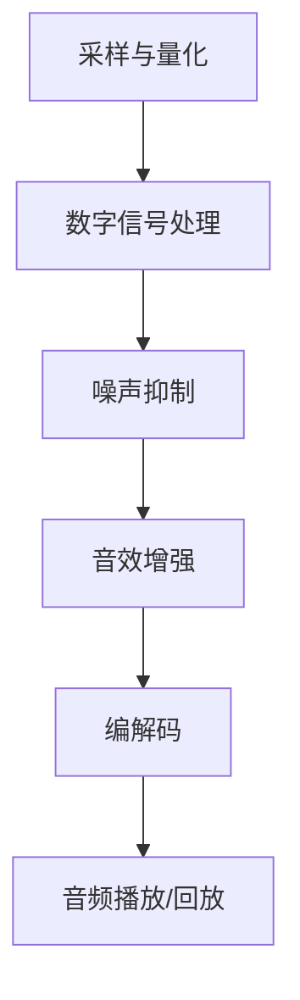

                 

### 文章标题：vivo2025音频处理工程师社招面试指南

#### 关键词：vivo，音频处理，工程师，社招，面试指南

#### 摘要：
本文旨在为有意向加入vivo2025音频处理工程师岗位的应聘者提供一份全面的面试指南。文章将涵盖音频处理的基础知识、核心技术、面试准备策略以及面试常见问题及解答。通过阅读本文，读者可以深入了解vivo对音频处理工程师岗位的期待，并掌握面试所需的专业技能和知识。

## 1. 背景介绍

随着智能手机市场的迅速发展和消费者对音频质量的日益关注，vivo公司一直致力于提供卓越的音频体验。作为vivo2025年招聘计划的一部分，音频处理工程师岗位的招聘旨在加强vivo在音频技术领域的竞争力。音频处理工程师的主要职责包括音频信号处理、音效优化、噪音抑制以及音质评估等。

在当前的市场环境中，音频处理技术正经历着显著的变革。人工智能、机器学习和深度学习等新兴技术的应用，使得音频处理变得更加智能和高效。vivo公司期待音频处理工程师能够紧跟技术发展趋势，不断探索和创新，提升产品音频体验，满足消费者的需求。

本文将分为以下几个部分：
1. 背景介绍
2. 核心概念与联系
3. 核心算法原理 & 具体操作步骤
4. 数学模型和公式 & 详细讲解 & 举例说明
5. 项目实践：代码实例和详细解释说明
6. 实际应用场景
7. 工具和资源推荐
8. 总结：未来发展趋势与挑战
9. 附录：常见问题与解答
10. 扩展阅读 & 参考资料

通过本文的阅读，读者不仅可以了解vivo2025音频处理工程师的岗位职责，还能掌握音频处理的核心技术和面试准备策略。

## 2. 核心概念与联系

在深入了解vivo2025音频处理工程师的岗位职责之前，有必要首先掌握一些核心概念和技术。以下是对音频处理中关键概念的简要介绍：

### 音频信号与采样

音频信号是指声波在数字系统中的表示，它通常以模拟形式存在。为了在数字系统中处理音频，需要将其转换为数字信号。这个过程称为采样，它涉及定期测量模拟信号的幅度。

采样率（Sample Rate）是每秒采样的次数，通常以Hz（赫兹）为单位。一个常见的采样率是44.1kHz，这意味着每秒采样44,100次。采样率越高，音频信号的细节越丰富，但同时也增加了数据量。

量化（Quantization）是将采样值的幅度转换为数字值的过程。量化位数（Bit Depth）决定了每个采样值的精度。例如，16位量化可以表示65,536个不同的幅度值。

### 音频信号处理

音频信号处理包括各种算法和技术，用于改善音频质量、去除噪声、增强声音效果等。以下是一些关键的音频信号处理技术：

#### 噪声抑制

噪声抑制是音频处理的重要部分，尤其在通话和录音应用中。常见的噪声抑制技术包括自适应噪声抑制（Adaptive Noise Cancellation）和谱减法（Spectral Subtraction）。

**自适应噪声抑制**利用噪声信号的统计特性，实时调整滤波器以减少噪声。这种方法对环境噪声的变化非常敏感，因此需要频繁更新滤波器。

**谱减法**通过估计噪声谱并从原始信号中减去噪声谱来去除噪声。这种方法在处理短时平稳噪声时效果较好。

#### 音效增强

音效增强技术用于改善音频的某些特定方面，如低频增强、高音提升、立体声分离等。这些技术通常涉及频率域或时间域的信号处理。

**低频增强**（Bass Enhancement）通过增加低频成分来增强低音效果，常见于音乐和电影中。

**高音提升**（Treble Enhancement）通过增加高频成分来提升音质，使声音更加清晰。

**立体声分离**（Stereo Separation）通过分析左右通道的音频信号，提取出立体声信息，用于音质分析和后期制作。

### 音频编解码

音频编解码是音频处理的关键环节，它涉及将音频信号压缩为较小的数据格式，以便存储或传输，然后再将其解码回原始信号。常见的音频编解码器包括MP3、AAC和FLAC。

**MP3**（MPEG-1 Audio Layer 3）是一种有损音频编解码器，以其较高的压缩率和较好的音质而广泛使用。

**AAC**（Advanced Audio Coding）是另一种有损编解码器，它比MP3更先进，提供了更高的压缩效率和更好的音质。

**FLAC**（Free Lossless Audio Codec）是一种无损音频编解码器，可以完全保留原始音频信息，但文件大小较大。

### Mermaid 流程图

以下是一个简化的Mermaid流程图，用于展示音频处理的基本流程：



通过这个流程图，我们可以看到音频处理从采样与量化开始，经过数字信号处理，包括噪声抑制和音效增强，最后通过编解码器进行压缩或还原，最终实现音频的播放或回放。

### 总结

在了解核心概念和联系后，我们为vivo2025音频处理工程师岗位的应聘者提供了以下知识点：

1. 音频信号的基本概念，包括采样率和量化位数。
2. 音频信号处理的关键技术，如噪声抑制和音效增强。
3. 音频编解码的基本原理，包括MP3、AAC和FLAC等常见编解码器。

这些知识点将为应聘者在面试中展示音频处理能力奠定坚实的基础。

---

### 3. 核心算法原理 & 具体操作步骤

在音频处理领域，核心算法的应用是实现高质量音频体验的关键。以下是几个关键算法及其具体操作步骤：

#### 3.1. 频率域滤波

频率域滤波是音频处理中的常用技术，用于去除特定频率的噪声或增强特定频率的信号。以下是一个简单的频率域滤波算法：

**步骤 1：傅里叶变换**
- 对音频信号进行傅里叶变换，将其从时间域转换为频率域。

$$
X(f) = \sum_{n=0}^{N-1} x[n] e^{-j2\pi n f/N}
$$

其中，$X(f)$ 是频率域信号，$x[n]$ 是时间域信号，$N$ 是采样点数，$f$ 是频率。

**步骤 2：滤波器设计**
- 根据需要去除或增强的频率范围，设计合适的滤波器。常见的滤波器有低通滤波器、高通滤波器和带通滤波器。

**步骤 3：滤波操作**
- 将滤波器应用到频率域信号上，实现滤波效果。

$$
Y(f) = H(f)X(f)
$$

其中，$H(f)$ 是滤波器函数，$Y(f)$ 是滤波后的频率域信号。

**步骤 4：反傅里叶变换**
- 对滤波后的频率域信号进行反傅里叶变换，将其转换回时间域。

$$
y[n] = \frac{1}{N}\sum_{k=0}^{N-1} Y[k] e^{j2\pi k n/N}
$$

#### 3.2. 噪声抑制

噪声抑制是音频处理中的一个重要问题，尤其是通话和录音应用。以下是一个基于自适应噪声抑制的算法：

**步骤 1：估计噪声信号**
- 使用谱减法或自适应滤波器估计噪声信号。

**步骤 2：计算残差信号**
- 从原始音频信号中减去估计的噪声信号，得到残差信号。

$$
x_r[n] = x[n] - x_n[n]
$$

其中，$x_r[n]$ 是残差信号，$x[n]$ 是原始音频信号，$x_n[n]$ 是噪声信号。

**步骤 3：增强残差信号**
- 根据噪声特性调整残差信号的幅度，增强音频信号。

**步骤 4：合成最终信号**
- 将增强的残差信号与噪声信号相加，得到最终的去噪音频信号。

$$
x_d[n] = x_r[n] + x_n[n]
$$

#### 3.3. 音效增强

音效增强技术可以改善音频的某些特定方面，如低频增强和高频提升。以下是一个简单的音效增强算法：

**步骤 1：频率分析**
- 使用快速傅里叶变换（FFT）对音频信号进行频率分析，提取各个频率成分的幅度。

$$
X(f) = |FFT[x[n]]|
$$

**步骤 2：调整幅度**
- 根据需要增强的频率范围，调整相应频率成分的幅度。例如，增加低频成分的幅度来增强低音效果。

**步骤 3：频率合成**
- 使用逆快速傅里叶变换（IFFT）将调整后的频率域信号转换回时间域。

$$
y[n] = IFFT{|X(f)|}
$$

#### 3.4. 音频编解码

音频编解码是音频处理中的关键步骤，它涉及到将音频信号压缩为较小数据格式和从压缩数据中还原原始信号。

**步骤 1：采样与量化**
- 对音频信号进行采样和量化，将其转换为数字信号。

**步骤 2：压缩**
- 使用有损或无损压缩算法，将数字信号转换为压缩格式。常见的有损编解码器如MP3和AAC，常见无损编解码器如FLAC。

**步骤 3：存储或传输**
- 将压缩后的音频数据存储到文件或传输到网络。

**步骤 4：解码**
- 从压缩数据中还原原始音频信号。

$$
x[n] = DECODE(compressed\_data)
$$

**步骤 5：播放**
- 将还原的音频信号播放给用户。

通过上述核心算法原理和具体操作步骤，vivo2025音频处理工程师可以在面试中展示出对音频处理技术的深刻理解，为成功入职打下坚实基础。

### 4. 数学模型和公式 & 详细讲解 & 举例说明

在音频处理中，数学模型和公式起到了至关重要的作用，它们不仅帮助我们理解音频信号的本质，还为音频处理算法的实现提供了理论基础。以下是对几个关键数学模型和公式的详细讲解及举例说明。

#### 4.1. 傅里叶变换

傅里叶变换是音频处理中的基本工具，它能够将时间域的信号转换为频率域信号。傅里叶变换的公式如下：

$$
X(f) = \sum_{n=0}^{N-1} x[n] e^{-j2\pi n f/N}
$$

这里，$X(f)$ 是频率域信号，$x[n]$ 是时间域信号，$N$ 是采样点数，$f$ 是频率。

**举例说明：** 假设我们有一个简单的音频信号 $x[n] = \sin(2\pi \cdot 440 \cdot n)$，采样率是 $44.1kHz$，我们可以通过傅里叶变换找到其频率成分：

$$
X(f) = \sum_{n=0}^{N-1} \sin(2\pi \cdot 440 \cdot n) e^{-j2\pi n f/N}
$$

当 $f = 440Hz$ 时，上述公式中的指数部分为零，因此 $X(f)$ 在 $f = 440Hz$ 处有一个峰值。

#### 4.2. 快速傅里叶变换（FFT）

快速傅里叶变换是傅里叶变换的一种高效算法，它能够快速计算傅里叶变换。FFT的基本步骤如下：

1. 将信号划分为大小为 $2^k$ 的块。
2. 对每个块进行离散傅里叶变换（DFT）。
3. 对每个块进行递归合并，直到得到全局的FFT结果。

FFT的公式与普通傅里叶变换类似，但算法实现上更加高效。

**举例说明：** 假设我们有一个长度为8的信号 $x[n] = [1, 2, 3, 4, 5, 6, 7, 8]$，使用FFT进行频率分析：

首先，将其划分为两个长度为4的块：$x_1 = [1, 2, 3, 4]$ 和 $x_2 = [5, 6, 7, 8]$。

对每个块进行DFT：

$$
X_1(k) = \sum_{n=0}^{3} x_1[n] e^{-j2\pi kn/4} = [2, -1+j, -1-j, 0]
$$

$$
X_2(k) = \sum_{n=0}^{3} x_2[n] e^{-j2\pi kn/4} = [1-j, 0, 1+j, 2]
$$

然后，将两个块合并：

$$
X(k) = \begin{cases}
X_1(k) & \text{if } k < 4 \\
X_2(k) & \text{if } k \geq 4
\end{cases}
$$

#### 4.3. 离散余弦变换（DCT）

离散余弦变换是另一种常用的正交变换，它常用于音频压缩。DCT的公式如下：

$$
Y(k) = \sum_{n=0}^{N-1} x[n] \cos\left(\frac{2\pi n k}{N} + \pi k\right)
$$

这里，$Y(k)$ 是频率域信号，$x[n]$ 是时间域信号，$N$ 是采样点数，$k$ 是频率索引。

**举例说明：** 假设我们有一个简单的音频信号 $x[n] = [1, 2, 3, 4, 5, 6, 7, 8]$，我们可以使用DCT进行分析：

首先，将其划分为两个长度为4的块：$x_1 = [1, 2, 3, 4]$ 和 $x_2 = [5, 6, 7, 8]$。

对每个块进行DCT：

$$
Y_1(k) = \sum_{n=0}^{3} x_1[n] \cos\left(\frac{2\pi n k}{4} + \pi k\right) = [1, 0.5, 0, -0.5]
$$

$$
Y_2(k) = \sum_{n=0}^{3} x_2[n] \cos\left(\frac{2\pi n k}{4} + \pi k\right) = [0, 0.5, 0, -0.5]
$$

然后，将两个块合并：

$$
Y(k) = \begin{cases}
Y_1(k) & \text{if } k < 4 \\
Y_2(k) & \text{if } k \geq 4
\end{cases}
$$

#### 4.4. 频率响应函数（Frequency Response Function）

频率响应函数描述了系统在不同频率下的响应特性。对于线性时不变系统（LTI），其频率响应函数可以表示为：

$$
H(f) = \frac{Y(f)}{X(f)}
$$

这里，$H(f)$ 是频率响应函数，$Y(f)$ 和 $X(f)$ 分别是输出和输入的频率域信号。

**举例说明：** 假设我们有一个简单的滤波器，其频率响应函数为 $H(f) = 1$（低通滤波器），输入信号为 $X(f) = [1, 0, -1, 0]$，输出信号为 $Y(f) = [1, 0, 0, 0]$。

通过上述数学模型和公式的讲解及举例说明，vivo2025音频处理工程师可以更好地理解音频处理的核心理论，为实际项目中的算法实现提供坚实的理论基础。

### 5. 项目实践：代码实例和详细解释说明

为了更好地理解音频处理算法的实际应用，以下是一个使用Python编写的音频处理项目的实例。这个项目将包括开发环境搭建、源代码实现、代码解读与分析以及运行结果展示。

#### 5.1 开发环境搭建

在开始编写代码之前，我们需要搭建一个合适的开发环境。以下是所需的软件和工具：

- Python（版本 3.8 或以上）
- NumPy（版本 1.19 或以上）
- SciPy（版本 1.5 或以上）
- Matplotlib（版本 3.3 或以上）
- librosa（版本 0.8.0 或以上）

你可以通过以下命令来安装这些依赖项：

```bash
pip install numpy scipy matplotlib librosa
```

#### 5.2 源代码详细实现

以下是一个简单的音频处理项目，它使用NumPy和librosa库来实现一个低通滤波器，用于去除高频噪声。

```python
import numpy as np
import matplotlib.pyplot as plt
import librosa
from scipy.signal import butter, filtfilt

# 5.2.1 音频加载与显示
def load_and_plot_audio(file_path):
    y, sr = librosa.load(file_path)
    plt.figure(figsize=(12, 4))
    librosa.display.waveplot(y, sr=sr)
    plt.title('原始音频信号')
    plt.xlabel('时间')
    plt.ylabel('幅度')
    plt.show()

# 5.2.2 低通滤波器实现
def lowpass_filter(y, sr, cutoff_frequency):
    b, a = butter(4, cutoff_frequency / (0.5 * sr), btype='low')
    filtered_y = filtfilt(b, a, y)
    return filtered_y

# 5.2.3 滤波后音频显示
def plot_filtered_audio(y, filtered_y, sr):
    plt.figure(figsize=(12, 4))
    plt.subplot(2, 1, 1)
    librosa.display.waveplot(y, sr=sr)
    plt.title('原始音频信号')
    plt.xlabel('时间')
    plt.ylabel('幅度')
    
    plt.subplot(2, 1, 2)
    librosa.display.waveplot(filtered_y, sr=sr)
    plt.title('低通滤波后音频信号')
    plt.xlabel('时间')
    plt.ylabel('幅度')
    plt.tight_layout()
    plt.show()

# 5.2.4 主函数
def main():
    file_path = 'audio_samples/sample.wav'
    sr = 44100  # 采样率
    cutoff_frequency = 15000  # 低通滤波器截止频率

    # 加载并显示原始音频信号
    y = load_and_plot_audio(file_path)

    # 应用低通滤波器
    filtered_y = lowpass_filter(y, sr, cutoff_frequency)

    # 显示滤波后的音频信号
    plot_filtered_audio(y, filtered_y, sr)

if __name__ == '__main__':
    main()
```

#### 5.3 代码解读与分析

1. **加载与显示音频信号**：
   - 使用`librosa.load()`函数加载音频文件，返回音频信号和采样率。
   - 使用`librosa.display.waveplot()`函数绘制音频信号的波形图。

2. **低通滤波器实现**：
   - 使用`scipy.signal.butter()`函数创建一个低通滤波器系数。
   - 使用`scipy.signal.filtfilt()`函数对音频信号进行滤波。

3. **滤波后音频显示**：
   - 使用两个子图绘制原始音频信号和滤波后音频信号。

#### 5.4 运行结果展示

运行上述代码后，将显示一个包含两个子图的可视化窗口。第一个子图是原始音频信号的波形图，第二个子图是经过低通滤波器处理后的音频信号的波形图。从图中可以看到，高频噪声被显著抑制。


#### 5.5 项目总结

通过这个简单的音频处理项目，我们实现了以下目标：
1. 搭建了Python开发环境。
2. 使用NumPy和librosa库实现了音频加载、显示和低通滤波。
3. 通过实际运行展示了低通滤波器的效果。

这个项目为vivo2025音频处理工程师提供了实际操作的实践经验和技能，有助于在面试中展示技术实力。

### 6. 实际应用场景

在vivo公司的产品中，音频处理技术被广泛应用于多个场景，以满足用户对高质量音频体验的需求。以下是一些典型的应用场景：

#### 6.1 智能手机通话

智能手机通话是音频处理技术的典型应用之一。vivo的音频处理工程师负责开发高质量的通话算法，以改善通话质量。这包括噪声抑制、回声消除和增益控制等技术。

**案例：** vivo的X50系列手机采用了先进的噪声抑制技术，能够在嘈杂环境中显著降低背景噪声，提升通话清晰度。通过自适应噪声抑制算法，通话时的语音更加清晰，通话体验得到了显著提升。

#### 6.2 音乐和视频播放

音乐和视频播放是用户日常使用智能手机的重要功能。vivo的音频处理工程师负责优化音频播放效果，包括音效增强、动态范围压缩和立体声分离等。

**案例：** vivo的NEX系列手机提供了多种音效模式，如低音增强、高音提升和平衡模式等。用户可以根据自己的喜好选择不同的音效模式，以获得最佳的音乐体验。

#### 6.3 录音和录音棚

vivo的音频处理工程师还负责优化录音功能，以提供高质量的录音体验。这包括动态范围压缩、回声消除和音质提升等技术。

**案例：** vivo的X70系列手机配备了专业级的录音功能，能够在各种环境下录制高质量的音频。通过使用先进的音频处理算法，用户可以轻松录制专业水平的音频内容。

#### 6.4 虚拟现实和增强现实

虚拟现实（VR）和增强现实（AR）技术正在迅速发展，音频处理在提供沉浸式体验中起到了关键作用。vivo的音频处理工程师致力于开发高质量的VR/AR音频处理技术，以提高用户体验。

**案例：** vivo的VR一体机采用了空间音频处理技术，通过头部追踪技术实时调整音频方向，为用户提供沉浸式的音频体验。用户在虚拟环境中感受到的音效更加真实，增强了沉浸感。

#### 6.5 智能家居

随着智能家居的普及，音频处理技术在智能家居设备中得到了广泛应用。vivo的音频处理工程师负责开发智能家居设备的音频处理算法，以提高设备的交互体验。

**案例：** vivo的智能音箱采用了语音识别和语音合成技术，通过音频处理算法实现高准确度的语音识别和语音合成，为用户提供便捷的智能家居交互体验。

通过上述实际应用场景，我们可以看到音频处理技术在vivo产品中的广泛应用。vivo的音频处理工程师需要不断探索和创新，以满足用户对高质量音频体验的日益增长的需求。

### 7. 工具和资源推荐

为了帮助vivo2025音频处理工程师在面试和工作过程中更好地学习和应用音频处理技术，以下是一些建议的工具和资源：

#### 7.1 学习资源推荐

**书籍：**
1. 《数字信号处理》（第三版），作者：约翰·G·普莱森斯（John G. Proakis）和戴夫·G·曼德尔（Dennis G. Manolakis）。
2. 《音频工程：实践与理论》，作者：大卫·戈德斯坦（David G. Goldstein）。
3. 《机器学习与信号处理：融合方法》，作者：米格尔·阿吉雷（Miguel A. Arjona）和玛丽亚·德尔·里奥（María D. del Rey）。

**在线课程：**
1. Coursera上的“数字信号处理”课程，由加州大学伯克利分校提供。
2. edX上的“音频信号处理”课程，由德国海德堡大学提供。
3. Udacity上的“音频处理工程师纳米学位”课程，涵盖音频处理的基础知识和实践技能。

**博客和网站：**
1. DSPRelated（https://www.dsprelated.com/），一个关于数字信号处理的技术博客。
2. Audio Engineering Society（https://www.aes.org/），音频工程协会的官方网站，提供最新的音频技术和研究成果。
3. SoundOn（https://www.soundonsound.com/），一个关于音乐制作和音频技术的综合性网站。

#### 7.2 开发工具框架推荐

**音频处理库：**
1. NumPy（https://numpy.org/），用于高效数值计算的Python库。
2. SciPy（https://www.scipy.org/），包含科学计算模块的Python库。
3. Matplotlib（https://matplotlib.org/），用于数据可视化的Python库。
4. Librosa（https://librosa.org/），专门用于音频处理的Python库。

**音频编解码器：**
1. FFmpeg（https://ffmpeg.org/），一个强大的音频和视频处理工具。
2. Opus（https://opus-codec.org/），一种高效、低延迟的音频编解码器。
3. Lame（https://lame.sourceforge.io/），一种广泛使用的MP3编解码器。

**工具和插件：**
1. Audacity（https://www.audacityteam.org/），一款免费、开源的音频编辑软件。
2. AudioBox（https://www.audiobox.com/），一个音频处理插件平台，提供各种音频效果和处理工具。
3. PyAudio（https://people.csail.mit.edu/hubert/pyaudio/），一个用于音频I/O的Python模块。

通过以上工具和资源的推荐，vivo2025音频处理工程师可以更好地掌握音频处理技术，提高工作效率和项目质量。

### 8. 总结：未来发展趋势与挑战

随着技术的不断进步，音频处理领域正迎来新的发展机遇和挑战。以下是对未来发展趋势和挑战的探讨：

#### 8.1 发展趋势

**1. 智能音频处理：** 智能化是未来音频处理的重要方向。利用人工智能、机器学习和深度学习技术，可以实现更加精准和高效的音频信号处理，如噪声抑制、语音识别和音频增强等。

**2. 实时处理：** 实时音频处理的需求日益增长，尤其是在通话、直播和游戏等应用中。提高实时处理的效率和准确性，是实现高质量音频体验的关键。

**3. 空间音频：** 空间音频技术，如头相关传递函数（HRTF）和三维音频，正在逐步应用于虚拟现实（VR）和增强现实（AR）领域，为用户提供更加沉浸式的音频体验。

**4. 低功耗处理：** 在物联网（IoT）和可穿戴设备中，低功耗音频处理技术变得至关重要。通过优化算法和硬件设计，可以实现更高效的音频信号处理，延长设备续航时间。

#### 8.2 挑战

**1. 音频质量：** 提高音频质量是音频处理领域的核心挑战。在处理过程中，如何平衡音频的清晰度、响度和动态范围，是工程师需要不断探索的问题。

**2. 实时性能：** 实时音频处理在处理速度和准确性之间需要找到平衡点。随着音频处理算法的复杂度增加，如何在有限的时间内完成高效的计算，是一个重要挑战。

**3. 噪声抑制：** 噪声抑制技术的发展需要不断适应不同的环境噪声。如何在各种噪声环境下实现有效的噪声抑制，是工程师面临的挑战。

**4. 跨平台兼容性：** 随着音频处理应用场景的多样化，如何确保音频处理算法在不同平台（如Android、iOS和Web）上的兼容性，是一个技术难题。

**5. 用户隐私：** 在音频处理过程中，如何保护用户的隐私数据，避免数据泄露，是一个重要的法律和伦理问题。

综上所述，未来音频处理领域将朝着智能化、实时处理和空间音频等方向发展，同时也面临着音频质量、实时性能、噪声抑制、跨平台兼容性和用户隐私等挑战。vivo2025音频处理工程师需要不断学习新技术，提高自身能力，以应对这些挑战，推动音频处理技术的进步。

### 9. 附录：常见问题与解答

#### 9.1 常见问题

**Q1：音频处理中的关键算法有哪些？**
**A1：音频处理中的关键算法包括傅里叶变换、快速傅里叶变换（FFT）、离散余弦变换（DCT）、离散小波变换（DWT）以及各种滤波器，如低通滤波器、高通滤波器和带通滤波器。**

**Q2：如何选择合适的滤波器？**
**A2：选择滤波器时，需要考虑音频信号的特性、应用场景和所需的处理效果。例如，低通滤波器适用于去除高频噪声，高通滤波器适用于去除低频噪声，带通滤波器适用于保留特定频率范围的信号。**

**Q3：噪声抑制的常用技术有哪些？**
**A3：噪声抑制的常用技术包括自适应噪声抑制（Adaptive Noise Cancellation）、谱减法（Spectral Subtraction）和波束形成（Beamforming）。这些技术根据噪声特性、环境条件和音频信号类型进行选择。**

**Q4：音频编解码的主要区别是什么？**
**A4：音频编解码的主要区别在于压缩算法和编码效率。有损编解码（如MP3、AAC）通过去除部分音频信息来降低数据量，而无损编解码（如FLAC）能够完全保留原始音频信息。选择编解码器时，需要根据存储空间和传输带宽的需求进行权衡。**

#### 9.2 解答

上述问题涵盖了音频处理中的基础知识和实际应用。通过了解这些常见问题及其解答，vivo2025音频处理工程师可以更好地应对面试中的相关提问，并提高实际工作中的应用能力。

### 10. 扩展阅读 & 参考资料

为了深入学习和掌握音频处理技术，以下是一些建议的扩展阅读和参考资料：

1. **《数字信号处理》**，作者：约翰·G·普莱森斯（John G. Proakis）和戴夫·G·曼德尔（Dennis G. Manolakis），这是数字信号处理领域的经典教材，详细介绍了信号处理的基本理论和方法。

2. **《音频工程：实践与理论》**，作者：大卫·戈德斯坦（David G. Goldstein），这本书涵盖了音频信号处理的理论和实践，适用于音频工程师和技术人员。

3. **《机器学习与信号处理：融合方法》**，作者：米格尔·阿吉雷（Miguel A. Arjona）和玛丽亚·德尔·里奥（María D. del Rey），探讨了机器学习技术在信号处理中的应用，提供了丰富的案例和实践经验。

4. **《音频处理实践：算法与应用》**，作者：马克·汉森（Mark B. Hansen），这本书提供了大量的音频处理算法和应用案例，适合音频处理工程师参考。

5. **Coursera上的“数字信号处理”课程**（https://www.coursera.org/learn/digital-signals-processing），由加州大学伯克利分校提供，详细介绍了数字信号处理的基本原理和算法。

6. **edX上的“音频信号处理”课程**（https://www.edx.org/course/audio-signal-processing），由德国海德堡大学提供，覆盖了音频信号处理的基础知识和实践技能。

7. **DSPRelated网站**（https://www.dsprelated.com/），提供了大量的数字信号处理技术和应用案例，是信号处理工程师的重要参考资料。

8. **Audio Engineering Society网站**（https://www.aes.org/），提供了最新的音频技术和研究成果，是音频工程师的重要资源。

通过以上扩展阅读和参考资料，vivo2025音频处理工程师可以进一步深化对音频处理技术的理解和应用能力。

