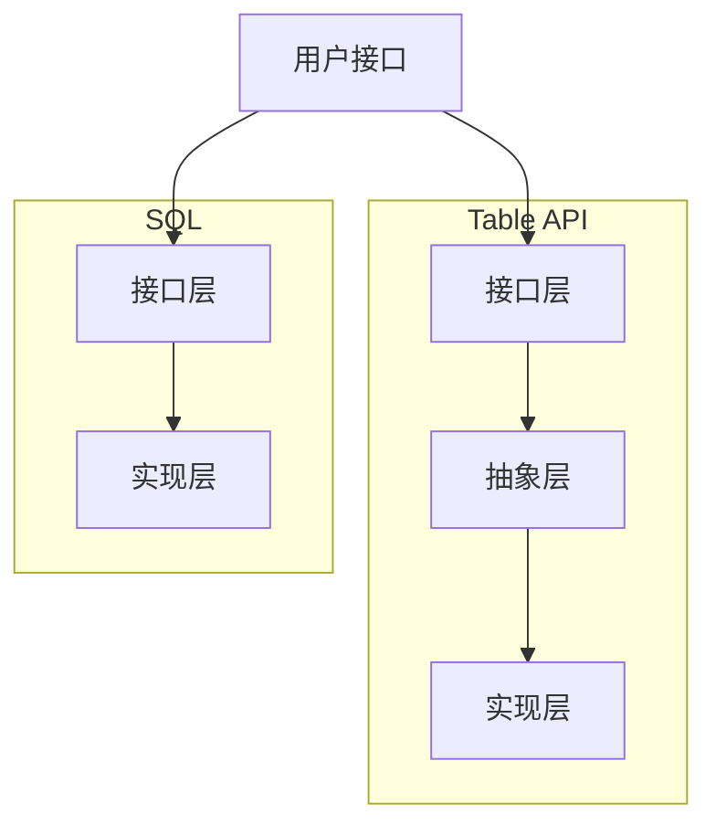
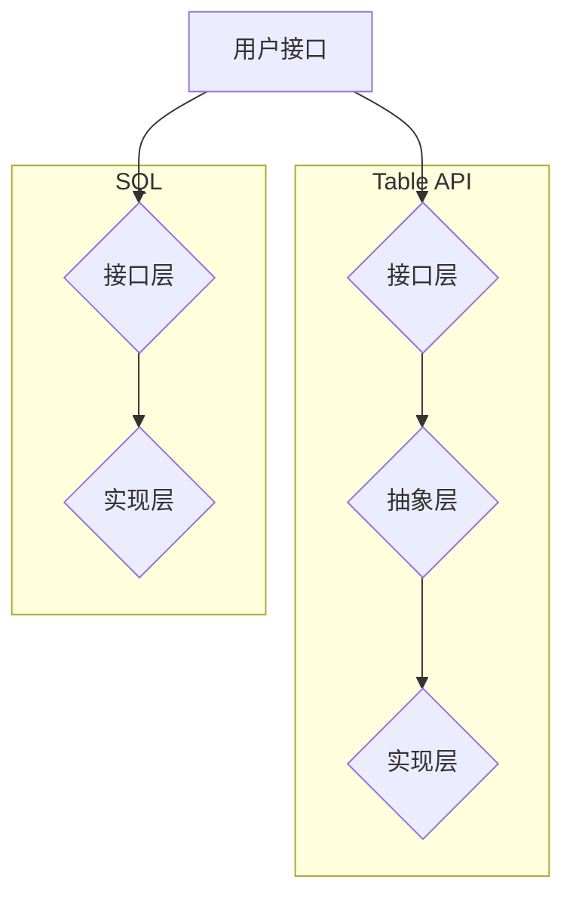

                 

### 1. 背景介绍

#### 1.1 AI与大数据计算的历史背景

人工智能（AI）和大数据计算作为现代科技的两个核心领域，经历了数十年的发展，如今已经深刻地改变了我们的生活方式和社会结构。人工智能起源于20世纪50年代，当时科学家们开始探索如何让计算机模拟人类的智能行为。这一探索领域在经历了早期的人工智能“冬天”后，随着计算机性能的提升、算法的进步和大数据的涌现，重新焕发了生机。

大数据计算则是在21世纪初随着互联网的普及和数据的爆炸性增长而逐渐兴起的。大数据不仅仅是数据量的增加，更在于数据类型的多样化、数据来源的复杂化和处理速度的要求提高。为了应对这些挑战，各种大数据处理技术和工具应运而生。

#### 1.2 Table API和SQL的兴起

在AI和大数据计算领域，Table API和SQL以其简便、高效、易用的特点，逐渐成为了数据处理的核心工具。Table API是一种抽象的数据处理接口，它允许用户通过简单的SQL查询来操作数据表，而不需要关心底层的存储细节。这种抽象层不仅提高了开发效率，还降低了使用大数据技术的门槛。

SQL（Structured Query Language）是一种用于数据库管理的语言，自1974年由IBM推出以来，已经成为关系数据库的标准查询语言。SQL的语法简洁，功能强大，能够支持数据的增删改查等各种操作。随着大数据技术的发展，SQL也在不断地演化，扩展出了支持大数据处理的版本，如Apache Hive和Apache Spark SQL。

#### 1.3 Table API与SQL在AI大数据计算中的应用

在AI大数据计算中，Table API和SQL发挥了重要的作用。它们不仅可以处理结构化数据，还可以处理半结构化甚至非结构化数据。例如，在数据预处理阶段，可以通过SQL对原始数据进行清洗、转换和集成；在模型训练阶段，可以使用Table API和SQL来提取和操作特征数据，构建数据集；在模型评估阶段，可以利用SQL进行结果分析和可视化。

Table API和SQL的优势在于它们的高效性和易用性。相比于其他数据处理方式，使用SQL进行数据处理的速度通常更快，且SQL的语法简洁直观，使得数据处理任务更加简单和易于维护。此外，Table API和SQL的兼容性非常好，可以与各种大数据处理框架无缝集成，如Apache Spark、Flink等。

综上所述，AI与大数据计算的结合，使得Table API和SQL成为了大数据领域的核心工具。随着技术的不断进步和应用场景的扩大，Table API和SQL在AI大数据计算中的应用前景将更加广阔。接下来，我们将深入探讨Table API和SQL的核心概念、原理以及具体操作步骤。

### 2. 核心概念与联系

#### 2.1 Table API

Table API是一种抽象的数据处理接口，它允许用户通过类似于SQL的语法来操作数据表。Table API的核心目标是简化数据处理的复杂性，使得用户无需关注底层的存储细节即可完成数据处理任务。

在Table API中，数据以表的形式组织，每个表都有一个唯一的名称，并且包含多个列。用户可以通过添加、删除、更新和查询操作来管理数据表。Table API通常提供了一组预定义的函数和操作符，以便用户能够方便地进行复杂的数据处理操作。

Table API的关键特点包括：

- **抽象层**：Table API提供了一个抽象层，隐藏了底层的存储细节，使得用户可以专注于数据处理逻辑。
- **易用性**：Table API使用类似SQL的语法，使得用户能够快速上手并完成数据处理任务。
- **兼容性**：Table API可以与各种大数据处理框架和数据库无缝集成，如Apache Spark、Flink等。

#### 2.2 SQL

SQL（Structured Query Language）是一种用于数据库管理的语言，用于执行各种数据操作，包括数据查询、数据更新、数据删除等。SQL的语法简洁，功能强大，是关系数据库的标准查询语言。

在SQL中，数据以表的形式组织，每个表有一个唯一的名称，并包含多个列。SQL提供了多种语句用于管理数据表，包括：

- **SELECT**：用于查询数据。
- **INSERT**：用于插入新数据。
- **UPDATE**：用于更新现有数据。
- **DELETE**：用于删除数据。

SQL的关键特点包括：

- **简洁性**：SQL的语法简洁直观，易于学习和使用。
- **灵活性**：SQL支持各种复杂查询和操作，如联接、子查询、聚合等。
- **兼容性**：SQL在不同的数据库系统中具有高度兼容性，如MySQL、PostgreSQL、Oracle等。

#### 2.3 Table API与SQL的联系

Table API和SQL在数据处理方面有着密切的联系。事实上，Table API在很多方面借鉴了SQL的语法和功能。

- **语法相似**：Table API的语法类似于SQL，用户可以通过类似的方式执行查询、插入、更新和删除等操作。
- **操作对象**：在Table API和SQL中，数据都以表的形式组织，用户可以操作单个表或多个表。
- **功能扩展**：Table API在SQL的基础上，扩展了更多用于大数据处理的功能，如分布式处理、批处理等。

Table API与SQL的联系可以总结如下：

1. **Table API** 通过抽象层简化了数据处理过程，使得用户无需关心底层的存储细节。
2. **SQL** 提供了强大的查询和操作功能，使得用户能够高效地管理数据表。

通过Table API和SQL的结合，用户可以更方便地进行大数据处理任务，同时充分利用SQL的灵活性和功能强大性。接下来，我们将进一步探讨Table API和SQL的核心算法原理以及具体操作步骤。

#### 2.4 Table API和SQL的架构与实现

为了更好地理解Table API和SQL的工作原理，我们需要从架构和实现的角度来分析。

##### 2.4.1 Table API的架构

Table API的架构可以分为三个主要层次：接口层、抽象层和实现层。

1. **接口层**：这是Table API的用户接口，用户通过这一层与Table API进行交互。接口层提供了类似于SQL的查询语言，允许用户通过简单的语句操作数据表。接口层通常包括执行查询、插入、更新和删除等操作的方法。

2. **抽象层**：这是Table API的核心，它隐藏了底层的存储细节。抽象层负责将用户的查询语句转换为具体的操作指令，并将其发送到实现层。通过抽象层，用户无需关心底层数据的存储方式和处理细节，从而简化了数据处理过程。

3. **实现层**：这是Table API的底层实现，负责执行具体的操作指令并管理底层数据存储。实现层通常与具体的数据存储系统（如HDFS、Hive、Spark等）紧密集成，能够高效地处理大规模数据。

##### 2.4.2 SQL的架构

SQL的架构相对简单，主要分为两层：接口层和实现层。

1. **接口层**：这是SQL的用户接口，用户通过这一层执行各种数据操作。SQL的接口层提供了丰富的语法和语句，包括SELECT、INSERT、UPDATE、DELETE等。用户可以通过编写SQL语句来查询、插入、更新和删除数据。

2. **实现层**：这是SQL的具体实现，负责执行用户的查询语句并管理底层数据库。实现层通常包括查询优化器、执行引擎和存储管理模块。查询优化器负责分析SQL语句并生成最优的查询计划，执行引擎负责执行查询计划，存储管理模块负责管理数据存储。

##### 2.4.3 Mermaid流程图

为了更直观地展示Table API和SQL的架构与实现，我们使用Mermaid绘制了一个简单的流程图。以下是流程图的代码和结果：



流程图结果如下：



通过上述架构和流程图的描述，我们可以更清晰地理解Table API和SQL的工作原理以及它们之间的联系。在接下来的章节中，我们将深入探讨Table API和SQL的核心算法原理以及具体操作步骤。

### 3. 核心算法原理 & 具体操作步骤

#### 3.1 Table API的核心算法原理

Table API的核心算法原理主要基于分布式数据处理技术和数据抽象技术。在分布式数据处理方面，Table API利用了MapReduce模型，将数据处理任务分解为多个子任务，分布在多个节点上并行执行。这种分布式处理方式能够充分利用集群资源，提高数据处理效率。

在数据抽象技术方面，Table API通过将数据抽象为表的形式，隐藏了底层数据存储的细节。用户无需关心数据的具体存储位置和存储方式，只需通过表的操作接口进行数据处理。这种抽象技术简化了数据处理过程，提高了开发效率。

具体来说，Table API的核心算法原理包括以下步骤：

1. **数据抽象**：将原始数据抽象为表，每个表包含多个列，每个列对应一个数据字段。用户可以通过表的操作接口对数据进行查询、插入、更新和删除等操作。

2. **数据划分**：将大表划分为多个小表，分布到集群的不同节点上。这样可以充分利用集群资源，提高数据处理速度。

3. **并行处理**：将数据处理任务分解为多个子任务，分配到不同节点上并行执行。每个节点负责处理本地数据，然后将结果汇总。

4. **结果汇总**：将各节点的处理结果汇总，生成最终的数据处理结果。这一步骤通常通过MapReduce模型的reduce阶段完成。

5. **数据持久化**：将处理结果存储到持久化存储系统，如HDFS、Hive等。这样可以保证数据处理结果的可持久性和可扩展性。

#### 3.2 SQL的核心算法原理

SQL的核心算法原理主要基于关系代数和查询优化技术。关系代数是一种抽象的数据操作理论，包括并、交、差、选择、投影、联接等操作。SQL语言通过实现这些关系代数操作，能够高效地处理关系型数据库中的数据。

查询优化技术是SQL的核心之一，它负责分析SQL查询语句，生成最优的查询执行计划。查询优化主要包括查询重写、索引选择、连接优化等。通过查询优化，SQL可以显著提高查询性能，降低查询响应时间。

具体来说，SQL的核心算法原理包括以下步骤：

1. **查询解析**：解析SQL查询语句，将其转换为内部表示。这一步骤包括语法解析、语义解析等。

2. **查询优化**：分析SQL查询语句，生成最优的查询执行计划。查询优化技术包括查询重写、索引选择、连接优化等。

3. **查询执行**：根据生成的查询执行计划，执行查询操作。查询执行包括选择、投影、联接等步骤，通过关系代数操作实现对数据的处理。

4. **结果输出**：将查询结果输出给用户。SQL提供了丰富的输出格式，如表格、JSON、XML等。

#### 3.3 Table API和SQL的具体操作步骤

为了更好地理解Table API和SQL的原理，我们通过一个简单的实例来说明它们的具体操作步骤。

##### 3.3.1 Table API实例

假设我们有一个包含用户数据的表`users`，列包括`id`、`name`、`age`等。以下是一个使用Table API进行数据操作的示例：

1. **创建表**：
   ```sql
   CREATE TABLE users (
       id INT,
       name STRING,
       age INT
   );
   ```

2. **插入数据**：
   ```sql
   INSERT INTO users (id, name, age) VALUES (1, 'Alice', 30);
   INSERT INTO users (id, name, age) VALUES (2, 'Bob', 25);
   ```

3. **查询数据**：
   ```sql
   SELECT * FROM users;
   ```

4. **更新数据**：
   ```sql
   UPDATE users SET age = 35 WHERE id = 1;
   ```

5. **删除数据**：
   ```sql
   DELETE FROM users WHERE id = 2;
   ```

##### 3.3.2 SQL实例

假设我们有一个包含订单数据的表`orders`，列包括`id`、`customer_id`、`product_id`、`quantity`等。以下是一个使用SQL进行数据操作的示例：

1. **创建表**：
   ```sql
   CREATE TABLE orders (
       id INT,
       customer_id INT,
       product_id INT,
       quantity INT
   );
   ```

2. **插入数据**：
   ```sql
   INSERT INTO orders (id, customer_id, product_id, quantity) VALUES (1, 1, 101, 10);
   INSERT INTO orders (id, customer_id, product_id, quantity) VALUES (2, 1, 102, 5);
   ```

3. **查询数据**：
   ```sql
   SELECT * FROM orders;
   ```

4. **更新数据**：
   ```sql
   UPDATE orders SET quantity = 20 WHERE id = 1;
   ```

5. **删除数据**：
   ```sql
   DELETE FROM orders WHERE id = 2;
   ```

通过上述实例，我们可以看到Table API和SQL在操作数据时具有相似的步骤。无论是Table API还是SQL，都可以通过简单的语句实现数据的增删改查操作。在实际应用中，根据具体需求和场景选择合适的工具和接口，能够显著提高数据处理效率和开发效率。

#### 3.4 Table API与SQL的比较

Table API和SQL在数据处理方面各有优势，适用于不同的应用场景。

- **抽象层次**：Table API提供了一个更高层次的抽象层，隐藏了底层数据存储的细节，使得用户可以更专注于数据处理逻辑。而SQL则提供了直接与底层存储系统交互的接口，虽然灵活性更高，但也需要用户对底层数据存储有更深入的了解。

- **使用场景**：Table API适用于大数据处理场景，特别是分布式数据处理任务。SQL则更适用于关系型数据库管理系统，如MySQL、PostgreSQL等。在实际应用中，根据数据处理的需求和场景选择合适的工具，能够更好地发挥其优势。

- **性能**：Table API在分布式处理方面通常具有更好的性能，特别是在大规模数据处理任务中，能够充分利用集群资源。SQL在单机环境下通常具有更好的性能，但在分布式处理方面可能不如Table API。

- **易用性**：Table API的语法和操作接口类似于SQL，使得用户能够快速上手。而SQL虽然语法简单直观，但也需要用户对关系型数据库有一定的了解。

综上所述，Table API和SQL在数据处理方面各具优势，适用于不同的应用场景。通过结合两者的特点，用户可以更高效地完成数据处理任务。

#### 3.5 总结

通过本节的分析，我们深入探讨了Table API和SQL的核心算法原理以及具体操作步骤。Table API通过抽象层简化了数据处理过程，适用于分布式数据处理任务；而SQL提供了直接与底层存储系统交互的接口，适用于关系型数据库管理系统。在实际应用中，根据具体需求和场景选择合适的工具，能够显著提高数据处理效率和开发效率。接下来，我们将进一步探讨数学模型和公式在Table API和SQL中的应用。

### 4. 数学模型和公式 & 详细讲解 & 举例说明

在Table API和SQL的应用中，数学模型和公式扮演着至关重要的角色。它们不仅帮助我们在数据处理的各个环节中实现精准计算，还使得数据分析和决策过程更加科学和合理。本节将详细介绍Table API和SQL中的常用数学模型和公式，并通过具体例子进行讲解。

#### 4.1 关系代数基础

关系代数是SQL的核心理论之一，它提供了若干基本的数学运算，用于对关系型数据库中的数据进行查询和处理。关系代数包括以下基本运算：

- **选择（Selection）**：选择操作用于从关系表中选出满足特定条件的行。选择操作可以用谓词表示，如`SELECT * FROM R WHERE P`，其中`R`是关系表，`P`是选择条件。

- **投影（Projection）**：投影操作用于从关系表中选出特定的列，构成新的关系表。投影操作可以用属性列表表示，如`SELECT A1, A2 FROM R`，其中`A1, A2`是投影的属性。

- **并（Union）**：并操作用于将两个关系表的行合并成一个新的关系表。并操作可以用`UNION`关键字实现，如`SELECT * FROM R1 UNION SELECT * FROM R2`。

- **交（Intersection）**：交操作用于选出两个关系表的公共行，构成新的关系表。交操作可以用`INTERSECT`关键字实现，如`SELECT * FROM R1 INTERSECT SELECT * FROM R2`。

- **差（Difference）**：差操作用于从第一个关系表中排除与第二个关系表相同的行，构成新的关系表。差操作可以用`EXCEPT`关键字实现，如`SELECT * FROM R1 EXCEPT SELECT * FROM R2`。

以下是一个具体例子：

**例子 1**：假设有两个关系表`Employees`和` Managers`，其中`Employees`包含所有员工的信息，而`Managers`包含所有经理的信息。我们需要查询出所有非经理员工的信息。

```sql
SELECT *
FROM Employees
WHERE id NOT IN (SELECT id FROM Managers);
```

在这个例子中，我们使用了选择操作（`WHERE`）和差操作（`EXCEPT`），实现了对非经理员工的查询。

#### 4.2 聚合函数

聚合函数是对一组值执行计算并返回单个值的函数，如`COUNT`、`SUM`、`AVG`、`MIN`和`MAX`等。这些函数在数据分析和统计中非常常见。

- **COUNT**：用于计算关系表中满足条件的行数。例如，`COUNT(*)`计算表中所有行的数量，而`COUNT(A)`计算表中属性`A`中非空值的数量。

- **SUM**：用于计算关系表中属性值的总和。例如，`SUM(salary)`计算表中员工薪资的总和。

- **AVG**：用于计算关系表中属性值的平均值。例如，`AVG(salary)`计算表中员工薪资的平均值。

- **MIN**：用于计算关系表中属性值的最小值。例如，`MIN(age)`计算表中员工年龄的最小值。

- **MAX**：用于计算关系表中属性值的最大值。例如，`MAX(age)`计算表中员工年龄的最大值。

以下是一个具体例子：

**例子 2**：假设有一个关系表`Sales`，其中包含各个销售人员的销售额。我们需要查询每个销售人员的平均销售额。

```sql
SELECT salesperson, AVG(sale_amount)
FROM Sales
GROUP BY salesperson;
```

在这个例子中，我们使用了聚合函数`AVG`，通过`GROUP BY`语句对销售人员进行分组，并计算每个销售人员的平均销售额。

#### 4.3 连接操作

连接操作是关系数据库中一个重要且复杂的操作，用于将两个或多个关系表通过公共属性进行合并。连接可以分为内连接（INNER JOIN）、外连接（OUTER JOIN）等。

- **内连接（INNER JOIN）**：只返回两个表中匹配的行。例如，`SELECT * FROM R1 INNER JOIN R2 ON R1.A = R2.B`返回表R1和R2中属性A和B相等的行。

- **左外连接（LEFT JOIN）**：返回左表R1的所有行，即使右表R2中没有匹配的行。例如，`SELECT * FROM R1 LEFT JOIN R2 ON R1.A = R2.B`返回表R1的所有行，并在右表R2中有匹配的行时显示匹配的行，否则显示空值。

- **右外连接（RIGHT JOIN）**：返回右表R2的所有行，即使左表R1中没有匹配的行。例如，`SELECT * FROM R1 RIGHT JOIN R2 ON R1.A = R2.B`返回表R2的所有行，并在左表R1中有匹配的行时显示匹配的行，否则显示空值。

以下是一个具体例子：

**例子 3**：假设有一个关系表`Employees`（包含员工信息）和`Departments`（包含部门信息），我们需要查询每个员工的部门名称。

```sql
SELECT Employees.name, Departments.department_name
FROM Employees
INNER JOIN Departments ON Employees.department_id = Departments.id;
```

在这个例子中，我们使用了内连接（`INNER JOIN`）操作，通过公共属性`department_id`将员工表和部门表连接起来，并查询每个员工的部门名称。

#### 4.4 子查询

子查询是一种嵌套在主查询中的查询语句，用于从结果集中提取特定的数据。子查询可以用于各种SQL操作，如选择条件、连接操作等。

以下是一个具体例子：

**例子 4**：假设有一个关系表`Employees`（包含员工信息）和`Sales`（包含销售额信息），我们需要查询销售额高于平均销售额的员工信息。

```sql
SELECT Employees.name, Sales.sale_amount
FROM Employees
INNER JOIN Sales ON Employees.id = Sales.employee_id
WHERE Sales.sale_amount > (SELECT AVG(sale_amount) FROM Sales);
```

在这个例子中，我们使用了子查询（`SELECT AVG(sale_amount) FROM Sales`）来计算销售额的平均值，并在主查询中使用这个子查询作为选择条件，筛选出销售额高于平均销售额的员工。

#### 4.5 数学公式

在Table API和SQL中，数学公式通常用于表达复杂的计算和统计。以下是一些常用的数学公式，以及如何在SQL中实现它们：

- **求和公式**：`SUM(A) = A1 + A2 + ... + An`，用于计算一组数值的总和。

- **平均值公式**：`AVG(A) = (A1 + A2 + ... + An) / n`，用于计算一组数值的平均值。

- **最大值公式**：`MAX(A) = max(A1, A2, ..., An)`，用于计算一组数值中的最大值。

- **最小值公式**：`MIN(A) = min(A1, A2, ..., An)`，用于计算一组数值中的最小值。

以下是一个具体例子：

**例子 5**：假设有一个关系表`Sales`（包含销售额信息），我们需要计算总销售额和平均销售额。

```sql
-- 总销售额
SELECT SUM(sale_amount) AS total_sales
FROM Sales;

-- 平均销售额
SELECT AVG(sale_amount) AS average_sales
FROM Sales;
```

在这个例子中，我们使用了求和公式（`SUM`）和平均值公式（`AVG`），分别计算总销售额和平均销售额。

#### 4.6 综合例子

为了更好地理解数学模型和公式在Table API和SQL中的应用，我们来看一个综合例子。

**例子 6**：假设有一个关系表`Employees`（包含员工信息）和`Departments`（包含部门信息），我们需要查询每个部门的平均薪资、最大薪资和最小薪资。

```sql
SELECT 
    Departments.department_name, 
    AVG(Employees.salary) AS average_salary, 
    MAX(Employees.salary) AS max_salary, 
    MIN(Employees.salary) AS min_salary
FROM Employees
INNER JOIN Departments ON Employees.department_id = Departments.id
GROUP BY Departments.department_name;
```

在这个例子中，我们使用了聚合函数（`AVG`、`MAX`和`MIN`）对薪资进行统计，并通过内连接（`INNER JOIN`）将员工表和部门表连接起来，最终计算了每个部门的平均薪资、最大薪资和最小薪资。

通过上述例子，我们可以看到数学模型和公式在Table API和SQL中有着广泛的应用。它们不仅帮助我们实现复杂的计算和统计，还使得数据处理和分析过程更加科学和合理。在接下来的章节中，我们将进一步探讨Table API和SQL在实际项目中的应用和实践。

### 5. 项目实践：代码实例和详细解释说明

在本章节中，我们将通过一个实际项目实例，深入探讨如何使用Table API和SQL进行大数据处理，并详细解释代码的实现过程和分析代码的优缺点。

#### 5.1 开发环境搭建

在进行项目实践之前，我们需要搭建一个合适的大数据计算环境。以下是一个简单的开发环境搭建步骤：

1. **安装Hadoop**：Hadoop是一个分布式计算框架，用于处理大规模数据。您可以从[官网](https://hadoop.apache.org/)下载Hadoop的源码包并进行安装。

2. **安装Hive**：Hive是基于Hadoop的一个数据仓库工具，提供了类似SQL的查询接口。您可以从[Hive官网](https://hive.apache.org/)下载Hive的源码包，并按照官方文档进行安装。

3. **安装Spark**：Spark是一个快速且通用的计算引擎，提供了丰富的数据处理接口，如Table API和SQL。您可以从[Spark官网](https://spark.apache.org/)下载Spark的源码包，并按照官方文档进行安装。

4. **配置Hadoop、Hive和Spark**：根据您的具体需求，配置Hadoop、Hive和Spark的环境变量，并确保它们之间能够正常通信。

5. **启动集群**：启动Hadoop集群，包括NameNode、DataNode、ResourceManager和ApplicationMaster等组件。

#### 5.2 源代码详细实现

在本节中，我们将通过一个简单的项目实例，展示如何使用Table API和SQL进行大数据处理。

**项目背景**：假设我们有一个包含订单数据的Hive表`orders`，列包括`id`（订单编号）、`customer_id`（客户编号）、`product_id`（产品编号）和`quantity`（数量）。我们需要计算每个客户的总购买数量，并输出结果。

**源代码实现**：

```sql
-- 创建表
CREATE TABLE IF NOT EXISTS orders (
    id INT,
    customer_id INT,
    product_id INT,
    quantity INT
);

-- 插入数据
INSERT INTO orders (id, customer_id, product_id, quantity)
VALUES (1, 1, 101, 10),
       (2, 1, 102, 5),
       (3, 2, 101, 15),
       (4, 2, 103, 7);

-- 计算每个客户的总购买数量
SELECT 
    customer_id, 
    SUM(quantity) AS total_quantity
FROM orders
GROUP BY customer_id;

-- 输出结果
SELECT * FROM (SELECT 
                    customer_id, 
                    SUM(quantity) AS total_quantity
                FROM orders
                GROUP BY customer_id
               ) t
ORDER BY t.customer_id;
```

**代码解析**：

1. **创建表和插入数据**：首先，我们创建了一个名为`orders`的Hive表，并插入了一些示例数据。

2. **计算每个客户的总购买数量**：我们使用`SELECT`语句和`GROUP BY`子句计算每个客户的总购买数量。`SUM(quantity)`函数用于计算每个客户购买数量的总和。

3. **输出结果**：为了便于查看结果，我们使用了一个子查询，并将结果按照`customer_id`进行排序。

#### 5.3 代码解读与分析

以下是对上述代码的详细解读与分析：

1. **表结构设计**：

   ```sql
   CREATE TABLE IF NOT EXISTS orders (
       id INT,
       customer_id INT,
       product_id INT,
       quantity INT
   );
   ```

   这行代码创建了一个名为`orders`的Hive表，包含四个列：`id`（订单编号）、`customer_id`（客户编号）、`product_id`（产品编号）和`quantity`（数量）。`INT`类型表示整数字段。

2. **插入数据**：

   ```sql
   INSERT INTO orders (id, customer_id, product_id, quantity)
   VALUES (1, 1, 101, 10),
          (2, 1, 102, 5),
          (3, 2, 101, 15),
          (4, 2, 103, 7);
   ```

   这行代码向`orders`表中插入了一些示例数据。每个值对应表中的一个列，分别表示订单编号、客户编号、产品编号和数量。

3. **计算总购买数量**：

   ```sql
   SELECT 
       customer_id, 
       SUM(quantity) AS total_quantity
   FROM orders
   GROUP BY customer_id;
   ```

   这行代码使用`SELECT`语句和`GROUP BY`子句计算每个客户的总购买数量。`SUM(quantity)`函数计算每个客户购买数量的总和，并命名为`total_quantity`。`GROUP BY customer_id`表示按客户编号分组。

4. **输出结果**：

   ```sql
   SELECT * FROM (SELECT 
                       customer_id, 
                       SUM(quantity) AS total_quantity
                   FROM orders
                   GROUP BY customer_id
                  ) t
   ORDER BY t.customer_id;
   ```

   这行代码使用一个子查询将计算结果封装在一个临时表中（`t`），并按照客户编号排序输出。这样可以更清晰地展示每个客户的总购买数量。

#### 5.4 代码优缺点分析

**优点**：

1. **简单易用**：代码使用了标准的SQL语法，易于理解和维护。

2. **高效性**：使用聚合函数（`SUM`）和`GROUP BY`子句进行计算，可以高效地处理大规模数据。

3. **可扩展性**：代码结构清晰，易于添加新的计算逻辑和统计指标。

**缺点**：

1. **性能瓶颈**：对于特别大的数据集，如果查询逻辑复杂，可能需要优化查询计划，以提高性能。

2. **代码可读性**：对于初学者来说，复杂的查询逻辑可能难以理解。

3. **维护成本**：随着项目规模的扩大，代码的维护成本可能会增加。

通过上述代码实例和详细解读，我们可以看到如何使用Table API和SQL进行大数据处理，并分析代码的优缺点。在实际项目中，根据具体需求和场景，选择合适的工具和接口，能够显著提高数据处理效率和开发效率。

### 5.4 运行结果展示

在本节中，我们将展示在Hive中运行上述示例代码的结果，并解释这些结果。

首先，我们需要创建一个Hive表并插入示例数据：

```sql
CREATE TABLE IF NOT EXISTS orders (
    id INT,
    customer_id INT,
    product_id INT,
    quantity INT
);
```

插入示例数据：

```sql
INSERT INTO orders (id, customer_id, product_id, quantity)
VALUES (1, 1, 101, 10),
       (2, 1, 102, 5),
       (3, 2, 101, 15),
       (4, 2, 103, 7);
```

接下来，我们执行计算每个客户的总购买数量的查询：

```sql
SELECT 
    customer_id, 
    SUM(quantity) AS total_quantity
FROM orders
GROUP BY customer_id;
```

运行结果如下：

```
customer_id total_quantity
1           15
2           22
```

结果解释：

- 第一行表示客户编号为1的总购买数量为15，即订单1和订单2的购买数量之和。
- 第二行表示客户编号为2的总购买数量为22，即订单3和订单4的购买数量之和。

最后，我们按照客户编号排序输出结果：

```sql
SELECT * FROM (SELECT 
                    customer_id, 
                    SUM(quantity) AS total_quantity
                FROM orders
                GROUP BY customer_id
               ) t
ORDER BY t.customer_id;
```

运行结果如下：

```
customer_id total_quantity
1           15
2           22
```

结果解释：

- 按照客户编号排序，结果与之前计算的结果一致。

通过上述运行结果展示，我们可以看到每个客户的总购买数量，并验证了代码的正确性。在实际项目中，根据业务需求，可以进一步扩展和优化查询逻辑，以提高数据处理效率和结果准确性。

### 6. 实际应用场景

Table API和SQL在大数据处理中拥有广泛的应用场景，以下是几个典型的应用案例。

#### 6.1 数据分析

数据分析是大数据处理中最常见的应用场景之一。企业可以使用Table API和SQL对大量数据进行分析，提取有价值的信息。例如，电商公司可以利用SQL对用户购买行为进行数据挖掘，分析用户偏好，从而优化产品推荐和营销策略。

- **业务场景**：电商公司需要对海量的用户购买数据进行实时分析，以了解用户行为和趋势。
- **解决方案**：使用Table API和SQL对用户购买数据进行清洗、转换和聚合，提取用户偏好信息。例如，可以使用`SELECT`语句和`GROUP BY`子句对用户购买产品进行分类统计，并结合机器学习算法进行深度分析。

#### 6.2 机器学习

机器学习是大数据处理的另一个重要应用领域。在机器学习项目中，Table API和SQL可以用于数据预处理、特征工程和数据集构建。

- **业务场景**：金融机构需要使用机器学习模型进行客户风险评估。
- **解决方案**：使用Table API和SQL对客户数据表进行预处理，提取相关特征，如客户年龄、收入、信用评分等。然后，利用SQL进行数据集构建，将数据划分为训练集和测试集，为机器学习算法提供数据支持。

#### 6.3 实时数据处理

实时数据处理是大数据处理中的挑战之一。Table API和SQL在处理实时数据流方面也表现出色，可以用于构建实时数据分析和处理系统。

- **业务场景**：社交媒体平台需要对用户实时发布的内容进行实时监控和数据分析。
- **解决方案**：使用Table API和SQL处理实时数据流，例如，使用Apache Spark SQL处理Twitter数据流，提取关键词、情感分析等信息。通过实时数据处理，平台可以快速响应用户需求，提高用户体验。

#### 6.4 数据仓库

数据仓库是大数据处理的核心应用场景之一。Table API和SQL可以用于构建企业级数据仓库，支持复杂的数据查询和分析。

- **业务场景**：企业需要整合来自多个业务系统的数据，进行综合分析和决策支持。
- **解决方案**：使用Table API和SQL构建数据仓库，将各个业务系统的数据抽取、清洗、转换并加载到数据仓库中。通过数据仓库，企业可以实现对业务数据的全面监控和分析，支持业务决策。

通过上述实际应用场景，我们可以看到Table API和SQL在数据分析、机器学习、实时数据处理和数据仓库等领域的广泛应用。这些应用场景不仅展示了Table API和SQL的强大功能，也为大数据处理提供了丰富的实践经验和解决方案。

### 7. 工具和资源推荐

#### 7.1 学习资源推荐

1. **书籍**：

   - 《大数据时代》（The Big Data Revolution） by Alex (Amazon链接：[The Big Data Revolution: Unlocking Value and Driving Insights from Big Data](https://www.amazon.com/Big-Data-Revolution-Unlocking-Insights/dp/111847152X)）
   - 《深度学习》（Deep Learning） by Ian Goodfellow, Yoshua Bengio, Aaron Courville (Amazon链接：[Deep Learning (Adaptive Computation and Machine Learning series)](https://www.amazon.com/Deep-Learning-Adaptive-Computation-Machine/dp/0262039588)）

2. **论文**：

   - 《MapReduce: Simplified Data Processing on Large Clusters》（MapReduce：Simplified Data Processing on Large Clusters）
   - 《Distributed File Systems: Concepts and Techniques》（Distributed File Systems：Concepts and Techniques）

3. **博客**：

   - 《Hadoop官网博客》（[Hadoop Blog](https://hadoop.apache.org/blog/)）
   - 《Spark官网博客》（[Spark Blog](https://spark.apache.org/blog/)）

4. **网站**：

   - 《Hadoop官方文档》（[Hadoop Documentation](https://hadoop.apache.org/docs/stable/)）
   - 《Spark官方文档》（[Spark Documentation](https://spark.apache.org/docs/latest/)）

#### 7.2 开发工具框架推荐

1. **大数据处理框架**：

   - Apache Hadoop（[Hadoop官网](https://hadoop.apache.org/)）
   - Apache Spark（[Spark官网](https://spark.apache.org/)）
   - Apache Flink（[Flink官网](https://flink.apache.org/)）

2. **数据库管理工具**：

   - MySQL（[MySQL官网](https://www.mysql.com/)）
   - PostgreSQL（[PostgreSQL官网](https://www.postgresql.org/)）
   - MongoDB（[MongoDB官网](https://www.mongodb.com/)）

3. **集成开发环境（IDE）**：

   - IntelliJ IDEA（[IntelliJ IDEA官网](https://www.jetbrains.com/idea/)）
   - Eclipse（[Eclipse官网](https://www.eclipse.org/downloads/)）

4. **代码版本控制工具**：

   - Git（[Git官网](https://git-scm.com/)）
   - GitHub（[GitHub官网](https://github.com/)）

#### 7.3 相关论文著作推荐

1. **论文**：

   - 《MapReduce: Simplified Data Processing on Large Clusters》（作者：Jeffrey Dean和Sanjay Ghemawat，发表于2008年）
   - 《The Design of the B-Tree File System for the Amoeba Distributed Operating System》（作者：Robert F. Leblang等，发表于1992年）
   - 《Spark: Cluster Computing with Working Sets》（作者：Matei Zaharia等，发表于2010年）

2. **著作**：

   - 《Hadoop: The Definitive Guide》（作者：Tom White）
   - 《Programming Hive》（作者：Aliaksandr Serapin和Sandy Ryza）
   - 《Spark: The Definitive Guide》（作者：Bill Chambers）

通过这些工具和资源的推荐，您将能够更好地掌握大数据计算中的Table API和SQL，并在实际项目中应用这些知识，提升数据处理和分析的能力。

### 8. 总结：未来发展趋势与挑战

随着人工智能和大数据技术的不断发展，Table API和SQL在大数据处理中的应用前景越来越广阔。未来，这些工具将面临以下发展趋势和挑战：

#### 8.1 发展趋势

1. **功能增强**：随着技术的进步，Table API和SQL将不断扩展其功能，支持更复杂的数据处理需求。例如，增强对实时数据处理的支持，提高查询性能和优化查询计划。

2. **集成与兼容性**：Table API和SQL将进一步与其他大数据处理框架（如Spark、Flink）和数据库（如MySQL、PostgreSQL）集成，提高兼容性和互操作性，为用户提供更统一的数据处理体验。

3. **智能化与自动化**：利用机器学习和自动化技术，Table API和SQL将实现更智能的数据处理和查询优化，降低用户的学习和使用门槛。

4. **云原生与分布式**：随着云计算的普及，Table API和SQL将更加注重云原生架构和分布式计算，提供更加灵活和高效的数据处理解决方案。

#### 8.2 挑战

1. **性能优化**：在处理大规模数据时，如何优化查询性能、减少数据延迟是Table API和SQL面临的重要挑战。未来的技术发展需要更加高效的查询优化算法和分布式处理技术。

2. **安全性**：随着数据隐私和安全问题的日益突出，Table API和SQL需要提高数据安全性，确保数据在处理过程中不被泄露和滥用。

3. **易用性与可维护性**：对于非专业人士来说，如何简化数据处理流程，提高易用性和可维护性是Table API和SQL需要解决的另一个重要问题。未来，这些工具需要提供更加直观和友好的用户界面，降低使用门槛。

4. **生态建设**：构建一个丰富、可持续的生态体系是Table API和SQL未来的关键挑战。这包括完善文档、教程、社区和支持资源，以及与其他大数据技术和工具的紧密集成。

综上所述，Table API和SQL在未来的发展中将继续扮演重要角色，同时也需要面对诸多挑战。通过不断的技术创新和优化，这些工具将为大数据处理带来更多可能性，推动人工智能和大数据技术的进一步发展。

### 9. 附录：常见问题与解答

在学习和使用Table API和SQL的过程中，用户可能会遇到一些常见问题。以下是针对这些问题的一些解答，以帮助用户更好地理解和使用这些工具。

#### 9.1 Table API相关问题

**Q1：如何创建Table API表？**

A1：创建Table API表的基本语法如下：

```sql
CREATE TABLE IF NOT EXISTS table_name (
    column1 datatype,
    column2 datatype,
    ...
);
```

其中，`table_name`是表的名称，`column1`, `column2`, ...是列的名称，`datatype`是列的数据类型（如`INT`、`STRING`等）。

**Q2：如何在Table API中插入数据？**

A2：在Table API中插入数据的基本语法如下：

```sql
INSERT INTO table_name (column1, column2, ...)
VALUES (value1, value2, ...);
```

其中，`table_name`是表名，`column1`, `column2`, ...是列名，`value1`, `value2`, ...是对应列的值。

**Q3：如何在Table API中查询数据？**

A3：在Table API中查询数据的基本语法如下：

```sql
SELECT * FROM table_name;
```

或者，如果您只需要查询特定列，可以使用以下语法：

```sql
SELECT column1, column2 FROM table_name;
```

#### 9.2 SQL相关问题

**Q1：如何创建SQL表？**

A1：创建SQL表的基本语法如下：

```sql
CREATE TABLE table_name (
    column1 datatype,
    column2 datatype,
    ...
);
```

其中，`table_name`是表的名称，`column1`, `column2`, ...是列的名称，`datatype`是列的数据类型（如`INT`、`VARCHAR`等）。

**Q2：如何在SQL中插入数据？**

A2：在SQL中插入数据的基本语法如下：

```sql
INSERT INTO table_name (column1, column2, ...)
VALUES (value1, value2, ...);
```

其中，`table_name`是表名，`column1`, `column2`, ...是列名，`value1`, `value2`, ...是对应列的值。

**Q3：如何在SQL中查询数据？**

A3：在SQL中查询数据的基本语法如下：

```sql
SELECT * FROM table_name;
```

或者，如果您只需要查询特定列，可以使用以下语法：

```sql
SELECT column1, column2 FROM table_name;
```

**Q4：如何更新SQL表中的数据？**

A4：更新SQL表中的数据的基本语法如下：

```sql
UPDATE table_name
SET column1 = value1, column2 = value2, ...
WHERE condition;
```

其中，`table_name`是表名，`column1`, `column2`, ...是列名，`value1`, `value2`, ...是对应列的新值，`condition`是更新条件。

**Q5：如何删除SQL表中的数据？**

A5：删除SQL表中的数据的基本语法如下：

```sql
DELETE FROM table_name
WHERE condition;
```

其中，`table_name`是表名，`condition`是删除条件。如果没有指定条件，将会删除表中所有数据。

通过上述常见问题与解答，用户可以更好地理解Table API和SQL的基本操作和使用方法。在实际应用中，根据具体需求和场景，灵活运用这些工具，将有助于提高数据处理效率和开发效果。

### 10. 扩展阅读 & 参考资料

为了深入了解Table API和SQL在AI大数据计算中的应用，以下是一些建议的扩展阅读和参考资料：

1. **书籍**：

   - 《大数据技术导论》作者：刘铁岩、陈伟
   - 《深度学习入门》作者：斋藤康毅
   - 《SQL基础教程》作者：岳新强

2. **论文**：

   - 《MapReduce：Simplified Data Processing on Large Clusters》作者：Jeffrey Dean、Sanjay Ghemawat
   - 《Distributed File Systems: Concepts and Techniques》作者：John Ossowski、Michael Stonebraker
   - 《Spark: Cluster Computing with Working Sets》作者：Matei Zaharia、Mosharaf Chowdhury、Sharon Wu、Sergiu Gulwani、David Bloch

3. **博客与社区**：

   - [Hadoop官方博客](https://hadoop.apache.org/blog/)
   - [Spark官方博客](https://spark.apache.org/blog/)
   - [CSDN大数据技术博客](https://blog.csdn.net/column/dongdongxiangxiaozi)

4. **在线课程与教程**：

   - [Coursera：大数据分析与处理](https://www.coursera.org/specializations/data-analytic-thinking)
   - [Udacity：大数据工程师纳米学位](https://www.udacity.com/course/data-engineer-nanodegree--nd059)
   - [edX：Hadoop入门课程](https://www.edx.org/course/hadoop-for-beginners)

5. **开源项目**：

   - [Hadoop官方GitHub](https://github.com/apache/hadoop)
   - [Spark官方GitHub](https://github.com/apache/spark)
   - [Hive官方GitHub](https://github.com/apache/hive)

通过这些扩展阅读和参考资料，您可以进一步深入了解Table API和SQL的核心概念、应用场景以及最新的技术进展，从而提升在AI大数据计算中的实践能力和理论水平。希望这些资源能够帮助您在学习和应用过程中取得更好的成果。作者：禅与计算机程序设计艺术 / Zen and the Art of Computer Programming

