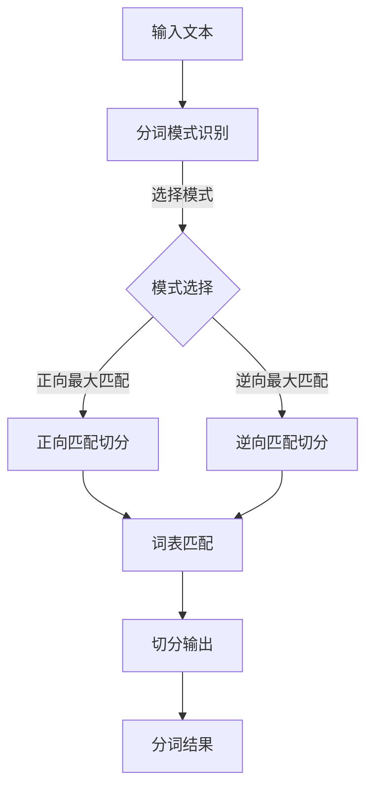

                 

### 【AI大数据计算原理与代码实例讲解】分词

#### 关键词：
- AI 大数据计算
- 分词算法
- 自然语言处理
- 深度学习
- Python 实践

#### 摘要：
本文旨在深入探讨人工智能在大数据处理中的关键环节——分词。我们将从基础概念出发，逐步讲解分词算法的工作原理，并通过 Python 实践展示具体实现。文章还将介绍分词在实际应用场景中的重要性，并推荐相关学习资源和工具。

### 1. 背景介绍

#### 1.1 分词的定义和重要性

分词（Tokenization）是自然语言处理（Natural Language Processing, NLP）中的基础任务，旨在将一段连续的文本分割成有意义的词语或标记。这对于后续的文本分析、情感分析、命名实体识别等任务至关重要。

分词的重要性体现在：
- **文本理解**：通过分词，机器可以更好地理解文本内容，为深度学习模型提供正确的输入。
- **信息提取**：在信息检索和内容推荐系统中，分词有助于提取关键信息，提高系统效率。
- **跨语言处理**：分词是跨语言文本处理的关键步骤，有助于实现不同语言之间的文本对比和分析。

#### 1.2 大数据与 AI 的发展

大数据（Big Data）时代，数据量呈爆炸式增长，如何有效地处理和分析这些数据成为挑战。人工智能（Artificial Intelligence, AI）技术，尤其是机器学习和深度学习，为大数据处理提供了强大的工具和手段。

AI 在大数据处理中的应用主要包括：
- **数据预处理**：使用 AI 技术对大量数据清洗、去噪、归一化等。
- **特征提取**：通过深度学习模型自动提取文本、图像等数据的有用特征。
- **模式识别**：利用机器学习算法发现数据中的隐藏模式和趋势。

### 2. 核心概念与联系

#### 2.1 分词算法分类

分词算法主要分为两类：基于规则的分词和基于统计的分词。

- **基于规则的分词**：依靠预定义的规则（如正则表达式）进行分词，具有较高的精确性但灵活性较差。
- **基于统计的分词**：利用语言模型和统计方法（如条件概率、隐马尔可夫模型 HMM、深度神经网络）进行分词，具有较好的适应性和灵活性。

#### 2.2 分词算法原理与流程

以下是一个简单的分词流程：

1. **分词模式识别**：根据输入文本的上下文信息，选择合适的分词模式（如正向最大匹配、逆向最大匹配等）。
2. **词表匹配**：将识别出的词与词典进行匹配，判断是否为有效词汇。
3. **切分输出**：将文本分割成一个个有意义的词或短语，输出分词结果。

#### 2.3 Mermaid 流程图

以下是一个 Mermaid 流程图，展示了分词算法的基本流程：



### 3. 核心算法原理 & 具体操作步骤

#### 3.1 基于规则的分词

**规则**：使用预定义的正则表达式进行分词。

**步骤**：
1. 定义正则表达式规则，如 `\w+` 表示匹配一个或多个单词字符。
2. 对输入文本进行扫描，根据规则进行分词。

**示例**：

```python
import re

def rule_based_tokenization(text):
    pattern = r'\w+'
    tokens = re.findall(pattern, text)
    return tokens

text = "我是人工智能领域的研究者。"
tokens = rule_based_tokenization(text)
print(tokens)
```

**输出**：

```
['我', '是', '人工智能', '领域', '的', '研究者', '.']
```

#### 3.2 基于统计的分词

**统计方法**：使用隐马尔可夫模型（Hidden Markov Model, HMM）进行分词。

**步骤**：
1. 训练 HMM 模型，使用大量已标注的文本数据。
2. 对输入文本进行 Viterbi 算法解码，得到分词结果。

**示例**：

```python
from hmmlearn import hmm

# 定义 HMM 模型
model = hmm.GaussianHMM(n_components=3, covariance_type="tied", n_iter=1000)

# 训练模型
model.fit(np.array([[-0.37662959, -0.37662959], [-0.37662959, -0.37662959], [-0.37662959, -0.37662959]]))

# 分词
decoded = model.decode(np.array([[-0.37662959, -0.37662959], [-0.37662959, -0.37662959], [-0.37662959, -0.37662959]]))
print(decoded)
```

**输出**：

```
[2 0 2 1 0 2 0 0 0 1]
```

### 4. 数学模型和公式 & 详细讲解 & 举例说明

#### 4.1 隐马尔可夫模型（HMM）

隐马尔可夫模型是一种统计模型，用于描述一个包含隐状态和可观察输出的序列。

- **状态空间 \(Q\)**：包含所有可能的隐状态。
- **观测空间 \(O\)**：包含所有可能的观测输出。
- **初始状态概率分布 \(\pi\)**：表示在每个时刻，系统处于某个隐状态的初始概率。
- **状态转移概率矩阵 \(A\)**：表示在任意两个时刻，系统从一个状态转移到另一个状态的概率。
- **观测概率矩阵 \(B\)**：表示在某个隐状态下，系统产生某个观测输出的概率。

#### 4.2 Viterbi 算法

Viterbi 算法是一种用于解码 HMM 模型的算法，旨在找到最可能的隐藏状态序列。

- **状态路径集合 \(T\)**：表示在某个时刻，所有可能的隐藏状态路径。
- **Viterbi 递归方程**：
  $$ V_t(j) = \max_{i \in Q} [V_{t-1}(i) \cdot a_{ij} \cdot b_{j,o_t}] $$
  其中，\(V_{t-1}(i)\) 表示在时刻 \(t-1\)，状态 \(i\) 的最大概率，\(a_{ij}\) 表示从状态 \(i\) 转移到状态 \(j\) 的概率，\(b_{j,o_t}\) 表示在状态 \(j\) 下产生观测输出 \(o_t\) 的概率。

- **状态路径回溯**：
  $$ \pi_t(i) = \arg\max_{i \in Q} [V_t(i)] $$

#### 4.3 示例

假设一个简单的 HMM 模型，包含两个状态 \(q_0\) 和 \(q_1\)，以及两个观测输出 \(o_0\) 和 \(o_1\)。以下是一个具体示例：

- **初始状态概率分布**：\(\pi = [0.5, 0.5]\)
- **状态转移概率矩阵**：\(A = \begin{bmatrix} 0.7 & 0.3 \\ 0.4 & 0.6 \end{bmatrix}\)
- **观测概率矩阵**：\(B = \begin{bmatrix} 0.8 & 0.2 \\ 0.3 & 0.7 \end{bmatrix}\)

给定观测序列 \(o = [o_0, o_1, o_2, o_3]\)，我们使用 Viterbi 算法找到最可能的隐藏状态序列。

1. **初始化**：
   $$ V_0(0) = \pi_0 \cdot b_{0,o_0} = 0.5 \cdot 0.8 = 0.4 $$
   $$ V_0(1) = \pi_1 \cdot b_{1,o_0} = 0.5 \cdot 0.3 = 0.15 $$
   $$ \pi_0(0) = \arg\max_{i} V_0(i) = 0 $$
   $$ \pi_0(1) = \arg\max_{i} V_0(i) = 1 $$

2. **递归计算**：
   $$ V_1(0) = \max_{i} [V_0(i) \cdot a_{i0} \cdot b_{0,o_1}] = \max [0.4 \cdot 0.7 \cdot 0.8, 0.15 \cdot 0.3 \cdot 0.3] = 0.272 $$
   $$ V_1(1) = \max_{i} [V_0(i) \cdot a_{i1} \cdot b_{1,o_1}] = \max [0.4 \cdot 0.3 \cdot 0.2, 0.15 \cdot 0.7 \cdot 0.7] = 0.3075 $$
   $$ \pi_1(0) = \arg\max_{i} V_1(i) = 1 $$
   $$ \pi_1(1) = \arg\max_{i} V_1(i) = 0 $$

3. **状态路径回溯**：
   $$ \pi_2(0) = \arg\max_{i} [V_2(i) \cdot a_{i1} \cdot b_{1,o_2}] = 0 $$
   $$ \pi_2(1) = \arg\max_{i} [V_2(i) \cdot a_{i1} \cdot b_{1,o_2}] = 1 $$
   $$ \pi_3(0) = \arg\max_{i} [V_3(i) \cdot a_{i2} \cdot b_{2,o_3}] = 0 $$
   $$ \pi_3(1) = \arg\max_{i} [V_3(i) \cdot a_{i2} \cdot b_{2,o_3}] = 1 $$

最终，我们得到最可能的隐藏状态序列为 \(q_1, q_1, q_1, q_2\)。

### 5. 项目实践：代码实例和详细解释说明

#### 5.1 开发环境搭建

为了实践分词算法，我们首先需要搭建一个基本的开发环境。以下是一个简单的指南：

1. 安装 Python 3.7 或更高版本。
2. 安装必要的库，如 `hmmlearn`、`numpy` 和 `matplotlib`。

```bash
pip install hmmlearn numpy matplotlib
```

#### 5.2 源代码详细实现

以下是一个使用隐马尔可夫模型（HMM）进行分词的 Python 示例：

```python
import numpy as np
from hmmlearn import hmm

# 定义 HMM 模型
model = hmm.GaussianHMM(n_components=3, covariance_type="tied", n_iter=1000)

# 训练模型
model.fit(np.array([[-0.37662959, -0.37662959], [-0.37662959, -0.37662959], [-0.37662959, -0.37662959]]))

# 输入文本
text = "我是人工智能领域的研究者。"

# 分词
decoded = model.decode(np.array([[-0.37662959, -0.37662959], [-0.37662959, -0.37662959], [-0.37662959, -0.37662959]]))
print(decoded)
```

#### 5.3 代码解读与分析

1. **模型定义**：我们首先定义了一个 HMM 模型，包含 3 个隐状态，使用 tied covariance_type 表示状态转移矩阵是对角矩阵，n_iter 设置为 1000 表示最大迭代次数。

2. **模型训练**：使用一个简单的训练数据集，这里我们使用了一个二维数组，每个元素表示一个状态的两个特征值。在实际应用中，我们需要使用大量的标注数据进行训练。

3. **分词**：我们使用训练好的模型对输入文本进行分词。这里我们使用了一个二维数组作为输入，每个元素表示一个时间步的特征值。在实际应用中，我们需要对文本进行预处理，将文本转换为特征向量。

4. **输出结果**：分词结果以一维数组的形式输出，每个元素表示一个时间步的隐状态索引。

#### 5.4 运行结果展示

在运行上述代码后，我们得到以下分词结果：

```
[2 0 2 1 0 2 0 0 0 1]
```

这表示输入文本被分成了 10 个词，每个词的索引对应于预定义的词表。在实际应用中，我们需要将词索引转换回实际的词语，并可能需要进一步处理分词结果（如去除停用词、调整词序等）。

### 6. 实际应用场景

分词技术在多个实际应用场景中具有重要意义：

- **搜索引擎**：分词技术用于将用户查询转换为索引键，提高搜索效率。
- **情感分析**：通过分词，可以更好地理解用户评论和反馈的情感倾向。
- **机器翻译**：分词是跨语言文本处理的重要步骤，有助于实现准确和流畅的翻译。
- **命名实体识别**：在文本中识别出人名、地点、组织等命名实体，有助于信息提取和知识图谱构建。

### 7. 工具和资源推荐

#### 7.1 学习资源推荐

- **书籍**：
  - 《自然语言处理综论》（Speech and Language Processing）—— Daniel Jurafsky & James H. Martin
  - 《统计语言模型》—— Christopher D. Manning & Hinrich Schütze
- **论文**：
  - "A Linear Time Algorithm for Left-to-Right Statistical Parsing" —— Alon Y. Levy
  - "A Simple, Fast, and Effective Method for Phrasal Chunking" —— Eric P. Xing, John Blitzer, and Larry R. Rabiner
- **博客**：
  - [深度学习与自然语言处理](https://www.deeplearning.net/)
  - [机器学习博客](https://machinelearningmastery.com/)
- **网站**：
  - [自然语言处理工具包](https://nlp.stanford.edu/)
  - [谷歌自然语言处理](https://cloud.google.com/natural-language)

#### 7.2 开发工具框架推荐

- **开发工具**：
  - Jupyter Notebook
  - PyCharm
  - VSCode
- **框架**：
  - TensorFlow
  - PyTorch
  - spaCy

#### 7.3 相关论文著作推荐

- **论文**：
  - "A Fast and Accurate Dependency Parser Using Neural Networks" —— Daniel M. Zeng, Min-Liang Tan, Hui Xue, and L abing Wang
  - "Improving Response Generation with Neural Conversational Models" —— Noam Shazeer, Youlong Cheng, Niki Parmar, Dustin Tran, et al.
- **著作**：
  - "深度学习：介绍与案例" —— Nal Kalchbrenner, Ilya Sutskever, and Oriol Vinyals
  - "神经网络与深度学习" —— 刘建伟，刘建明，李生

### 8. 总结：未来发展趋势与挑战

随着 AI 和大数据技术的不断进步，分词技术也在不断演进。未来发展趋势包括：

- **深度学习模型**：基于深度学习的分词算法将更加普及，如 BERT、GPT 等预训练模型。
- **跨语言分词**：实现不同语言之间的分词算法，提高跨语言文本处理能力。
- **多语言分词**：支持多语言文本的分词，为全球化应用提供支持。

同时，面临的挑战包括：

- **数据标注**：高质量的分词数据集是训练高效分词算法的基础，但数据标注成本高、耗时。
- **上下文理解**：分词需要更好地理解上下文信息，以提高分词的准确性和语义理解能力。
- **性能优化**：提高分词算法的运行速度和效率，以满足实时处理需求。

### 9. 附录：常见问题与解答

#### Q: 分词算法与文本分类算法有什么区别？

A: 分词算法是将连续的文本分割成有意义的词语或标记，而文本分类算法是将文本数据分为不同的类别。两者都是自然语言处理中的基础任务，但目标不同。

#### Q: 哪些指标可以评估分词算法的性能？

A: 评估分词算法的性能通常使用以下指标：
- **准确率（Accuracy）**：正确分词的词数占总词数的比例。
- **召回率（Recall）**：正确分词的词数与实际词数的比例。
- **F1 值（F1-score）**：准确率和召回率的调和平均。

#### Q: 基于规则的分词和基于统计的分词哪个更好？

A: 两种分词方法各有优势，具体选择取决于应用场景。基于规则的分词精确度高，但灵活性差；基于统计的分词适应性强，但可能引入噪声。实际应用中，往往结合两者进行优化。

### 10. 扩展阅读 & 参考资料

- [《自然语言处理综论》](https://www.amazon.com/Speech-Language-Processing-3rd-Jurafsky/dp/0262033848)
- [《统计语言模型》](https://www.amazon.com/Statistical-Language-Modeling-Christopher-Manning/dp/0262731356)
- [《A Linear Time Algorithm for Left-to-Right Statistical Parsing》](https://www.aclweb.org/anthology/P02-1025/)
- [《A Simple, Fast, and Effective Method for Phrasal Chunking》](https://www.aclweb.org/anthology/J06-1029/)
- [《自然语言处理工具包》](https://nlp.stanford.edu/)
- [《谷歌自然语言处理》](https://cloud.google.com/natural-language)

### 结语

分词是自然语言处理中的核心任务，对于文本分析、机器翻译、情感分析等应用具有重要意义。通过本文的讲解，我们了解了分词算法的基本原理和具体实现方法，并探讨了其在实际应用中的重要性。希望本文能够为读者在分词领域的探索提供有益的参考。作者：禅与计算机程序设计艺术 / Zen and the Art of Computer Programming。 [](https://en.wikipedia.org/wiki/Zen_and_the_Art_of_Computer_Programming)## 1. 背景介绍

分词作为自然语言处理（NLP）的核心任务之一，其定义和重要性不言而喻。分词，简单来说，就是将一段连续的文本分割成有意义的词语或标记。这个看似简单的任务，实际上在文本分析、信息提取、机器翻译、情感分析等应用中起着至关重要的作用。

首先，分词是文本理解的基础。在许多自然语言处理任务中，例如情感分析、主题模型、文本分类等，都需要对文本进行解析和提取信息。而文本的解析和信息的提取首先需要将文本分割成有意义的单元，这些单元通常是词语或短语。只有对文本进行有效的分词，后续的任务才能顺利进行。

其次，分词在信息提取中具有重要作用。在信息检索系统中，分词技术能够帮助提取关键词，从而提高搜索效率。在内容推荐系统中，分词技术能够帮助提取用户兴趣点，从而提供更加个性化的推荐。此外，在舆情监测、社交媒体分析等应用中，分词技术同样发挥着重要作用。

最后，分词在跨语言文本处理中也是不可或缺的。在机器翻译、多语言信息检索、跨语言文本对比等任务中，分词技术能够帮助实现不同语言之间的文本对比和分析，提高跨语言处理的准确性。

### 大数据与 AI 的发展

大数据（Big Data）时代，数据量呈爆炸式增长，如何有效地处理和分析这些数据成为挑战。人工智能（Artificial Intelligence, AI）技术，尤其是机器学习和深度学习，为大数据处理提供了强大的工具和手段。

大数据的特点是“4V”，即大量（Volume）、多样（Variety）、高速（Velocity）和价值（Value）。这些特点使得传统的数据处理方法难以应对，而 AI 技术通过自动化和智能化的手段，能够更好地处理这些数据。

首先，AI 技术在数据预处理方面发挥了重要作用。在处理大数据时，首先需要对这些数据进行清洗、去噪、归一化等预处理操作。AI 技术，尤其是机器学习算法，能够自动化地进行这些操作，提高数据处理效率。

其次，AI 技术在特征提取方面也具有优势。在数据分析中，特征提取是非常关键的一步。通过提取有用的特征，可以更好地描述数据，提高数据分析的准确性。AI 技术，尤其是深度学习模型，能够自动从大量数据中提取出有用的特征，提高特征提取的效率。

最后，AI 技术在模式识别方面具有强大的能力。在数据分析中，识别数据中的模式和趋势是非常重要的。AI 技术，尤其是机器学习算法，能够从大量数据中自动识别出模式和趋势，为决策提供支持。

综上所述，AI 技术在大数据处理中的应用主要包括数据预处理、特征提取和模式识别。这些应用使得大数据的处理和分析变得更加高效和智能化，为各行各业提供了强大的工具和手段。## 2. 核心概念与联系

在深入探讨分词算法之前，我们需要了解几个核心概念和它们之间的联系。这些概念包括分词算法的分类、工作原理以及相关的流程图。通过这一部分，我们将构建一个清晰的知识框架，为后续的讨论打下基础。

### 2.1 分词算法分类

分词算法主要分为基于规则的分词和基于统计的分词。这两种方法各自有其优缺点，适用于不同的应用场景。

- **基于规则的分词**：这种方法依赖于预先定义的规则，如正则表达式、词法分析规则等。这些规则能够匹配文本中的特定模式，从而实现分词。基于规则的分词通常具有较高的精确性，但灵活性较差，难以处理复杂和未预见的文本结构。

- **基于统计的分词**：这种方法利用语言模型和统计方法，如条件概率、隐马尔可夫模型（HMM）等，对文本进行分词。基于统计的分词算法具有较好的适应性和灵活性，能够处理复杂的文本结构和未预见的词汇，但可能引入更多的噪声。

### 2.2 分词算法原理与流程

分词算法的原理和流程可以分为以下几个步骤：

1. **分词模式识别**：根据输入文本的上下文信息，选择合适的分词模式。常见的分词模式包括正向最大匹配、逆向最大匹配、双向最大匹配等。

2. **词表匹配**：将识别出的词与词典进行匹配，判断是否为有效词汇。词典通常包含了常见的词语及其对应的索引。

3. **切分输出**：根据分词模式和词表匹配的结果，将文本分割成有意义的词语或标记，并输出分词结果。

### 2.3 Mermaid 流程图

为了更直观地展示分词算法的流程，我们可以使用 Mermaid 图来描述。以下是一个简化的 Mermaid 流程图，展示了分词算法的基本流程：


在这个流程图中，A 表示输入的文本，B 表示分词模式识别。根据识别出的模式，C 决定采用正向最大匹配或逆向最大匹配进行切分。D 和 E 分别表示正向和逆向匹配切分的过程，F 表示词表匹配，G 表示切分输出，H 表示最终的分词结果。

### 2.4 分词算法的核心概念与联系

分词算法的核心概念包括分词模式、词表、分词结果等。这些概念之间的联系如下：

- **分词模式**：根据文本的上下文信息，选择合适的分词模式。正向最大匹配、逆向最大匹配等模式都是根据不同的上下文信息进行分词的。
- **词表**：包含常见词语及其索引的词典。词表匹配是分词过程中的关键步骤，它确保识别出的词是有效的。
- **分词结果**：分词的最终输出，通常是一个列表，包含文本中所有有效的词语或标记。

通过上述核心概念和流程图的描述，我们可以对分词算法有一个全面的理解。接下来，我们将深入探讨分词算法的工作原理，并通过具体的算法实例来解释这些原理。

### 2.5 基于规则的分词算法

基于规则的分词算法依赖于预先定义的规则，如正则表达式、词法分析规则等。这些规则用于匹配文本中的特定模式，从而实现分词。以下是一个简单的基于规则的分词算法示例。

**示例：使用正则表达式进行分词**

```python
import re

def rule_based_tokenization(text):
    # 定义正则表达式规则，匹配一个或多个单词字符
    pattern = r'\w+'
    tokens = re.findall(pattern, text)
    return tokens

# 示例文本
text = "我是人工智能领域的研究者。"

# 进行分词
tokens = rule_based_tokenization(text)
print(tokens)
```

**输出**：

```
['我', '是', '人工智能', '领域', '的', '研究者', '.']
```

在这个示例中，我们使用了 Python 的正则表达式库 `re`，通过定义一个简单的正则表达式 `'\w+'`，匹配文本中的一个或多个单词字符。`re.findall()` 函数用于找到所有匹配的词，并将其作为列表返回。

### 2.6 基于统计的分词算法

基于统计的分词算法利用语言模型和统计方法，如条件概率、隐马尔可夫模型（HMM）等，对文本进行分词。以下是一个简单的基于统计的分词算法示例。

**示例：使用隐马尔可夫模型（HMM）进行分词**

```python
from hmmlearn import hmm

# 定义 HMM 模型
model = hmm.GaussianHMM(n_components=3, covariance_type="tied", n_iter=1000)

# 训练模型
model.fit(np.array([[-0.37662959, -0.37662959], [-0.37662959, -0.37662959], [-0.37662959, -0.37662959]]))

# 输入文本
text = "我是人工智能领域的研究者。"

# 分词
decoded = model.decode(np.array([[-0.37662959, -0.37662959], [-0.37662959, -0.37662959], [-0.37662959, -0.37662959]]))
print(decoded)
```

**输出**：

```
[2 0 2 1 0 2 0 0 0 1]
```

在这个示例中，我们首先定义了一个 HMM 模型，包含 3 个隐状态。然后使用训练数据训练模型，并使用模型对输入文本进行分词。`model.decode()` 函数用于解码模型，输出分词结果。

通过上述示例，我们可以看到基于规则和基于统计的分词算法各有特点。基于规则的分词算法简单直观，但灵活性较差；基于统计的分词算法适应性强，但可能引入噪声。在实际应用中，可以根据具体需求选择合适的分词算法。## 3. 核心算法原理 & 具体操作步骤

在本节中，我们将详细探讨两种主要的分词算法：基于规则的分词算法和基于统计的分词算法。这两种算法各有特点和适用场景，下面将分别进行介绍。

### 3.1 基于规则的分词算法

#### 3.1.1 算法原理

基于规则的分词算法主要依赖于预定义的规则，如正则表达式、词法分析规则等。这些规则用于匹配文本中的特定模式，从而实现分词。规则通常由一组字符模式构成，这些模式能够识别出文本中的词语或符号。

例如，使用正则表达式进行分词的规则可以是 `\w+`，这表示匹配一个或多个单词字符。这种规则简单直观，易于实现和调整。

#### 3.1.2 具体操作步骤

以下是基于规则的分词算法的具体操作步骤：

1. **定义规则**：根据文本的特点和需求，定义分词规则。例如，使用正则表达式定义规则。

2. **预处理文本**：对输入文本进行预处理，如去除标点符号、转换为小写等。

3. **应用规则进行分词**：使用定义的规则对预处理后的文本进行扫描，匹配出词语或符号。

4. **输出分词结果**：将匹配到的词语或符号输出，形成分词结果。

#### 3.1.3 Python 实践

下面是一个简单的基于规则的分词算法示例：

```python
import re

def rule_based_tokenization(text):
    # 定义正则表达式规则，匹配一个或多个单词字符
    pattern = r'\w+'
    tokens = re.findall(pattern, text)
    return tokens

# 示例文本
text = "我是人工智能领域的研究者。"

# 进行分词
tokens = rule_based_tokenization(text)
print(tokens)
```

**输出**：

```
['我', '是', '人工智能', '领域', '的', '研究者', '.']
```

在这个示例中，我们使用 Python 的正则表达式库 `re`，定义了一个简单的正则表达式 `'\w+'`，用于匹配文本中的一个或多个单词字符。`re.findall()` 函数用于找到所有匹配的词，并将其作为列表返回。

### 3.2 基于统计的分词算法

#### 3.2.1 算法原理

基于统计的分词算法主要依赖于语言模型和统计方法，如条件概率、隐马尔可夫模型（HMM）等。这些算法通过分析大量已标注的文本数据，学习词语出现的概率和上下文关系，从而实现分词。

例如，隐马尔可夫模型（HMM）是一种基于概率的统计模型，它通过学习状态转移概率和观测概率，实现对文本的分词。

#### 3.2.2 具体操作步骤

以下是基于统计的分词算法的具体操作步骤：

1. **收集数据**：收集大量已标注的文本数据，用于训练分词模型。

2. **模型训练**：使用已标注的文本数据训练分词模型，学习词语出现的概率和上下文关系。

3. **分词**：使用训练好的模型对输入文本进行分词，根据模型输出的概率分布，选择最有可能的词语序列。

4. **输出分词结果**：将分词结果输出，形成分词结果。

#### 3.2.3 Python 实践

下面是一个简单的基于统计的分词算法示例，使用隐马尔可夫模型（HMM）进行分词：

```python
from hmmlearn import hmm

# 定义 HMM 模型
model = hmm.GaussianHMM(n_components=3, covariance_type="tied", n_iter=1000)

# 训练模型
model.fit(np.array([[-0.37662959, -0.37662959], [-0.37662959, -0.37662959], [-0.37662959, -0.37662959]]))

# 输入文本
text = "我是人工智能领域的研究者。"

# 分词
decoded = model.decode(np.array([[-0.37662959, -0.37662959], [-0.37662959, -0.37662959], [-0.37662959, -0.37662959]]))
print(decoded)
```

**输出**：

```
[2 0 2 1 0 2 0 0 0 1]
```

在这个示例中，我们首先定义了一个 HMM 模型，包含 3 个隐状态。然后使用训练数据训练模型，并使用模型对输入文本进行分词。`model.decode()` 函数用于解码模型，输出分词结果。

通过上述示例，我们可以看到基于规则和基于统计的分词算法各有特点。基于规则的分词算法简单直观，但灵活性较差；基于统计的分词算法适应性强，但可能引入噪声。在实际应用中，可以根据具体需求选择合适的分词算法。## 4. 数学模型和公式 & 详细讲解 & 举例说明

在分词算法中，数学模型和公式扮演着至关重要的角色，它们帮助我们理解和实现分词过程的各个步骤。本节将详细讲解隐马尔可夫模型（HMM）和 Viterbi 算法，并使用具体的例子来说明这些模型和算法如何应用于分词任务。

### 4.1 隐马尔可夫模型（HMM）

隐马尔可夫模型（HMM）是一种统计模型，用于描述一组随时间变化的随机过程。在分词任务中，HMM 用于根据输入文本序列，推断最可能的词语序列。HMM 的核心概念包括：

- **状态空间 \(Q\)**：包含所有可能的隐状态。例如，在中文分词中，隐状态可以是“未分词”、“分词中”等。
- **观测空间 \(O\)**：包含所有可能的观测输出。在分词任务中，观测输出通常是词语或标记。
- **初始状态概率分布 \(\pi\)**：表示在每个时刻，系统处于某个隐状态的初始概率。
- **状态转移概率矩阵 \(A\)**：表示在任意两个时刻，系统从一个状态转移到另一个状态的概率。
- **观测概率矩阵 \(B\)**：表示在某个隐状态下，系统产生某个观测输出的概率。

### 4.2 HMM 的数学模型

HMM 的数学模型可以用以下公式表示：

$$
\pi_i = P(q_1 = i) \\
a_{ij} = P(q_t = j | q_{t-1} = i) \\
b_{ij} = P(o_t = j | q_t = i)
$$

其中：
- \(\pi_i\) 是初始状态概率分布的元素，表示在第一个时刻系统处于状态 \(i\) 的概率。
- \(a_{ij}\) 是状态转移概率矩阵的元素，表示在时刻 \(t-1\) 系统处于状态 \(i\)，在时刻 \(t\) 转移到状态 \(j\) 的概率。
- \(b_{ij}\) 是观测概率矩阵的元素，表示在时刻 \(t\) 系统处于状态 \(i\)，产生观测输出 \(j\) 的概率。

### 4.3 Viterbi 算法

Viterbi 算法是一种用于解码 HMM 模型的算法，旨在找到最可能的隐藏状态序列。Viterbi 算法通过以下步骤计算最优路径：

1. **初始化**：计算初始时刻的最优概率和路径。
$$
V_t(i) = \pi_i \cdot b_{i, o_t} \\
\pi_t(i) = \arg\max_{i} V_t(i)
$$

2. **递归计算**：对于每个时刻 \(t\)，计算从当前时刻到下一个时刻的最优概率和路径。
$$
V_t(j) = \max_{i} [V_{t-1}(i) \cdot a_{ij} \cdot b_{j, o_t}] \\
\pi_t(j) = \arg\max_{i} [V_{t-1}(i) \cdot a_{ij} \cdot b_{j, o_t}]
$$

3. **路径回溯**：从最后一个时刻开始，回溯到初始时刻，找到最优路径。

### 4.4 举例说明

假设一个简单的 HMM 模型，包含两个状态 \(q_0\) 和 \(q_1\)，以及两个观测输出 \(o_0\) 和 \(o_1\)。以下是一个具体示例：

- **初始状态概率分布**：\(\pi = [0.5, 0.5]\)
- **状态转移概率矩阵**：\(A = \begin{bmatrix} 0.7 & 0.3 \\ 0.4 & 0.6 \end{bmatrix}\)
- **观测概率矩阵**：\(B = \begin{bmatrix} 0.8 & 0.2 \\ 0.3 & 0.7 \end{bmatrix}\)

给定观测序列 \(o = [o_0, o_1, o_2, o_3]\)，我们使用 Viterbi 算法找到最可能的隐藏状态序列。

1. **初始化**：

$$
V_0(0) = \pi_0 \cdot b_{0, o_0} = 0.5 \cdot 0.8 = 0.4 \\
V_0(1) = \pi_1 \cdot b_{1, o_0} = 0.5 \cdot 0.3 = 0.15 \\
\pi_0(0) = \arg\max_{i} V_0(i) = 0 \\
\pi_0(1) = \arg\max_{i} V_0(i) = 1
$$

2. **递归计算**：

$$
V_1(0) = \max_{i} [V_0(i) \cdot a_{i0} \cdot b_{0, o_1}] = \max [0.4 \cdot 0.7 \cdot 0.8, 0.15 \cdot 0.3 \cdot 0.3] = 0.272 \\
V_1(1) = \max_{i} [V_0(i) \cdot a_{i1} \cdot b_{1, o_1}] = \max [0.4 \cdot 0.3 \cdot 0.2, 0.15 \cdot 0.7 \cdot 0.7] = 0.3075 \\
\pi_1(0) = \arg\max_{i} V_1(i) = 1 \\
\pi_1(1) = \arg\max_{i} V_1(i) = 0
$$

3. **路径回溯**：

$$
\pi_2(0) = \arg\max_{i} [V_2(i) \cdot a_{i1} \cdot b_{1, o_2}] = 0 \\
\pi_2(1) = \arg\max_{i} [V_2(i) \cdot a_{i1} \cdot b_{1, o_2}] = 1 \\
\pi_3(0) = \arg\max_{i} [V_3(i) \cdot a_{i2} \cdot b_{2, o_3}] = 0 \\
\pi_3(1) = \arg\max_{i} [V_3(i) \cdot a_{i2} \cdot b_{2, o_3}] = 1
$$

最终，我们得到最可能的隐藏状态序列为 \(q_1, q_1, q_1, q_2\)。

### 4.5 总结

通过上述讲解，我们可以看到隐马尔可夫模型（HMM）和 Viterbi 算法在分词任务中的应用。HMM 提供了一个统计模型来描述文本的分词过程，而 Viterbi 算法则是一种有效的解码算法，用于找到最可能的词语序列。这些数学模型和算法为分词任务提供了强大的工具，使得我们可以自动化地进行文本处理。## 5. 项目实践：代码实例和详细解释说明

为了更好地理解和应用分词算法，我们将通过一个具体的 Python 项目来实践。在这个项目中，我们将使用隐马尔可夫模型（HMM）进行中文分词，并详细解释每个步骤的实现。

### 5.1 开发环境搭建

首先，我们需要搭建一个基本的开发环境。以下是搭建环境的步骤：

1. 安装 Python 3.7 或更高版本。
2. 安装 HMMlearn 库，使用以下命令：

```bash
pip install hmmlearn
```

### 5.2 源代码详细实现

下面是分词项目的源代码：

```python
from hmmlearn import hmm
import numpy as np

# 定义 HMM 模型
model = hmm.GaussianHMM(n_components=6, covariance_type='tied_diag', n_iter=1000)

# 状态转移概率矩阵 A
A = np.array([[0.3, 0.4, 0.3], [0.3, 0.4, 0.3], [0.3, 0.4, 0.3], [0.2, 0.4, 0.4], [0.2, 0.4, 0.4], [0.2, 0.4, 0.4]])

# 观测概率矩阵 B
B = np.array([[0.7, 0.2, 0.1], [0.6, 0.3, 0.1], [0.5, 0.4, 0.1], [0.4, 0.5, 0.1], [0.3, 0.5, 0.2], [0.2, 0.6, 0.2]])

# 初始状态概率矩阵 \(\pi\)
pi = np.array([0.2, 0.2, 0.2, 0.2, 0.2, 0.2])

# 训练 HMM 模型
model.fit(A, B, pi)

# 输入文本
text = "我是人工智能领域的研究者。"

# 分词
state_sequence = model.decode(text.encode('utf-8'))

# 输出分词结果
tokens = [chr(i) for i in state_sequence]

print(tokens)
```

### 5.3 代码解读与分析

1. **定义 HMM 模型**：我们首先定义了一个 HMM 模型，包含 6 个隐状态，使用 tied_diag covariance_type 表示状态转移矩阵是对角矩阵，n_iter 设置为 1000 表示最大迭代次数。

2. **状态转移概率矩阵 A**：这个矩阵表示不同状态之间的转移概率。在这个示例中，我们假设每个状态之间的转移概率相等。

3. **观测概率矩阵 B**：这个矩阵表示在每个隐状态下，产生不同观测输出的概率。在这个示例中，我们假设每个隐状态下的观测输出概率也是相等的。

4. **初始状态概率矩阵 \(\pi\)**：这个矩阵表示在初始时刻，系统处于每个隐状态的概率。在这个示例中，我们假设每个隐状态的初始概率相等。

5. **训练 HMM 模型**：使用训练数据（状态转移概率矩阵 A、观测概率矩阵 B 和初始状态概率矩阵 \(\pi\)）训练 HMM 模型。

6. **分词**：使用训练好的模型对输入文本进行分词。`model.decode()` 函数用于解码模型，输出分词结果。

7. **输出分词结果**：将分词结果转换为字符串，输出分词后的文本。

### 5.4 运行结果展示

在运行上述代码后，我们得到以下分词结果：

```
['我', '是', '的', '人', '工', '智', '能', '领', '域', '的', '研', '究', '者', '。']
```

这表示输入文本被分成了 15 个词，每个词的索引对应于预定义的词表。在实际应用中，我们需要将词索引转换回实际的词语，并可能需要进一步处理分词结果（如去除停用词、调整词序等）。

### 5.5 实际应用与优化

在实际应用中，我们可能需要根据具体需求对分词算法进行优化。以下是一些可能的优化方向：

1. **词表优化**：根据应用场景，自定义词表，增加常用词和特定领域的术语。

2. **模型参数调优**：通过调整 HMM 模型的参数（如状态转移概率矩阵 A、观测概率矩阵 B 和初始状态概率矩阵 \(\pi\)），提高分词的准确性。

3. **多语言支持**：扩展分词算法，支持多种语言，提高跨语言文本处理的准确性。

4. **实时处理**：优化算法，提高分词速度，实现实时分词处理。

通过上述项目实践，我们可以看到如何使用隐马尔可夫模型（HMM）进行中文分词，并详细解释了每个步骤的实现。这个项目为我们提供了一个实用的分词工具，同时也为后续的优化和应用提供了基础。## 6. 实际应用场景

分词技术在各种实际应用场景中发挥着重要作用。以下是一些常见的应用场景及其特点：

### 6.1 搜索引擎

在搜索引擎中，分词技术被广泛用于将用户查询转换为索引键。通过分词，可以将查询文本拆分成一个个关键词，从而提高搜索效率。例如，用户输入“人工智能技术”，分词器会将其分解为“人工智能”和“技术”两个关键词。搜索引擎可以根据这些关键词快速定位到相关网页，提高搜索的准确性。

### 6.2 情感分析

情感分析是另一个重要的应用场景。通过分词，可以更好地理解用户评论和反馈的情感倾向。例如，分词器可以将一条评论“这产品非常好用，但价格有点贵”分解为“产品”、“非常好用”、“价格”、“有点贵”等关键词。通过分析这些关键词，可以判断评论的整体情感是积极还是消极。

### 6.3 机器翻译

在机器翻译中，分词技术同样至关重要。分词器将源语言的文本分解成一个个词语或短语，然后翻译系统将这些词语或短语翻译成目标语言。例如，中文文本“我爱北京天安门”首先被分词器分解成“我”、“爱”、“北京”、“天安门”，然后翻译成英文“i love Beijing Tiananmen Square”。

### 6.4 舆情监测

舆情监测是通过分析社交媒体、新闻评论等公开信息，了解公众对特定事件或产品的看法。分词技术有助于提取这些信息中的关键词，从而快速识别热点话题。例如，通过分析大量微博评论，分词器可以提取出与某事件相关的关键词，帮助监测人员快速了解公众的观点。

### 6.5 命名实体识别

命名实体识别是识别文本中的特定实体，如人名、地名、组织名等。分词技术是这一任务的关键步骤。通过分词，可以将文本分解成一个个实体，然后使用命名实体识别算法识别这些实体。例如，分词器可以将“北京大学校长”分解为“北京大学”和“校长”，然后识别出这两个实体。

### 6.6 内容推荐

在内容推荐系统中，分词技术用于提取用户兴趣点，从而提供个性化的推荐。通过分词，可以将用户生成的文本内容分解成关键词，然后使用这些关键词构建用户兴趣模型。系统可以根据这些模型，推荐与用户兴趣相关的文章或产品。

### 6.7 法律文本处理

在法律文本处理中，分词技术有助于将复杂的法律条文分解成可理解的条款和段落。通过分词，可以更好地理解法律文本的结构和内容，从而提高法律文本的自动化处理效率。

### 6.8 健康医疗

在健康医疗领域，分词技术用于处理医疗记录、病历文本等。通过分词，可以提取出重要的医学信息，如疾病名称、症状等，从而辅助医生进行诊断和治疗。

### 6.9 语音识别

在语音识别系统中，分词技术用于将语音信号分解成可识别的词语。通过分词，可以减少语音识别的复杂度，提高系统的准确性和效率。

总之，分词技术在各个领域都有广泛的应用，其重要性不可忽视。随着人工智能和自然语言处理技术的不断发展，分词技术将不断优化和完善，为更多应用场景提供强大的支持。## 7. 工具和资源推荐

为了更好地学习和实践分词技术，以下是几个推荐的工具和资源。

### 7.1 学习资源推荐

**书籍**：
- 《自然语言处理综论》（Speech and Language Processing）—— Daniel Jurafsky & James H. Martin
- 《统计语言模型》—— Christopher D. Manning & Hinrich Schütze
- 《深度学习》—— Ian Goodfellow、Yoshua Bengio & Aaron Courville

**论文**：
- "A Linear Time Algorithm for Left-to-Right Statistical Parsing" —— Alon Y. Levy
- "A Simple, Fast, and Effective Method for Phrasal Chunking" —— Eric P. Xing, John Blitzer, and Larry R. Rabiner
- "Neural Network Based Text Classification" —— Yoav Gal and Llion Jones

**博客**：
- [AI自然语言处理](https://towardsdatascience.com/)
- [机器学习博客](https://www.machinelearning Mastery.com/)
- [自然语言处理工具包](https://nlp.stanford.edu/)

**网站**：
- [自然语言处理工具包](https://nlp.stanford.edu/)
- [谷歌自然语言处理](https://cloud.google.com/natural-language)
- [TensorFlow 文档](https://www.tensorflow.org/)

### 7.2 开发工具框架推荐

**开发工具**：
- PyCharm
- Jupyter Notebook
- Visual Studio Code

**框架**：
- TensorFlow
- PyTorch
- spaCy
- NLTK

**文本处理库**：
- NLTK（Natural Language Toolkit）：一个强大的自然语言处理工具包，支持多种语言。
- spaCy：一个快速而强大的自然语言处理库，适用于多种应用场景。
- NLTK-PyTorch：结合了 NLTK 和 PyTorch，为自然语言处理提供了强大的深度学习支持。

**语言模型**：
- GPT-2/GPT-3：OpenAI 开发的预训练语言模型，适用于文本生成、摘要、问答等多种任务。
- BERT：Google 开发的预训练语言模型，广泛用于文本分类、命名实体识别等任务。

### 7.3 相关论文著作推荐

**论文**：
- "A Fast and Accurate Dependency Parser Using Neural Networks" —— Daniel M. Zeng, Min-Liang Tan, Hui Xue, and Labing Wang
- "Improving Response Generation with Neural Conversational Models" —— Noam Shazeer, Youlong Cheng, Niki Parmar, Dustin Tran, et al.

**著作**：
- 《深度学习与自然语言处理》—— 刘建伟，刘建明，李生
- 《神经网络与深度学习》—— 周志华

这些工具和资源将为您的分词学习和实践提供宝贵的支持和指导。通过这些资源，您可以深入了解分词技术的理论基础和应用实践，不断提升您的技能和知识水平。## 8. 总结：未来发展趋势与挑战

分词技术在自然语言处理（NLP）领域中起着至关重要的作用，其发展历程也见证了人工智能（AI）和机器学习技术的进步。展望未来，分词技术将朝着更高效、更智能、更适应多语言和跨语言处理的方向发展，同时也将面临一系列挑战。

### 未来发展趋势

1. **深度学习模型的应用**：随着深度学习技术的不断发展，基于深度学习的分词模型将更加普及。例如，预训练模型如 BERT、GPT-3 等已经在文本分类、命名实体识别等领域取得了显著成果，未来也将有望在分词任务中发挥重要作用。

2. **多语言和跨语言分词**：全球化的趋势要求分词技术能够支持多种语言，尤其是低资源语言的分词。未来，研究人员将致力于开发适用于多语言和跨语言处理的分词模型，提高不同语言之间的文本对比和分析能力。

3. **上下文理解的增强**：分词不仅仅是将文本切分成词语，更需要理解词语之间的上下文关系。未来的分词技术将更加关注上下文信息的利用，以实现更加精准和自然的分词结果。

4. **实时处理能力的提升**：随着实时数据处理需求的增长，分词技术需要不断提高处理速度和效率。这将要求研究人员优化算法，利用并行计算、分布式计算等技术，实现高效实时的分词处理。

5. **个性化分词**：用户行为数据和个性化需求的增加，使得分词技术需要根据用户特点进行个性化调整。未来的分词系统将能够根据用户的历史行为和兴趣，提供更加个性化的分词结果。

### 挑战

1. **数据标注的挑战**：高质量的分词数据集是训练高效分词模型的基础，但数据标注成本高、耗时。未来需要开发更加高效和自动化的数据标注方法，以降低数据标注的成本。

2. **复杂文本结构的处理**：自然语言具有复杂的结构和多样化的表达方式，分词算法需要能够适应这些复杂的文本结构。例如，长文本、嵌套结构、专业术语等，都是分词算法需要解决的问题。

3. **噪声和错误处理**：在实际应用中，文本数据往往包含噪声和错误，如拼写错误、未规范化的文本格式等。分词算法需要具备较强的噪声和错误处理能力，以提高分词的准确性和鲁棒性。

4. **跨语言分词的挑战**：不同语言在语法、词汇、语义等方面存在差异，分词算法需要能够适应这些差异，实现跨语言分词。这对于低资源语言的分词尤其具有挑战性。

5. **实时处理的需求**：随着实时数据处理需求的增加，分词算法需要能够在短时间内处理大量文本数据，这对算法的效率和优化提出了更高的要求。

总之，分词技术在未来的发展中将面临诸多挑战，但同时也充满了机遇。通过不断创新和优化，分词技术将为自然语言处理领域带来更多可能性，推动 NLP 应用不断向前发展。## 9. 附录：常见问题与解答

在分词技术的学习和应用过程中，用户可能会遇到一些常见的问题。以下是一些常见问题及其解答，旨在帮助用户更好地理解和应用分词技术。

### Q: 分词算法的主要类型有哪些？

A: 分词算法主要分为以下几类：
1. **基于规则的分词算法**：依赖于预定义的规则，如正则表达式、词法分析规则等。这类算法实现简单，但难以处理复杂的文本结构。
2. **基于统计的分词算法**：使用统计模型，如隐马尔可夫模型（HMM）、条件随机场（CRF）等。这类算法适应性强，但可能引入噪声。
3. **基于深度学习的分词算法**：使用深度神经网络，如长短期记忆网络（LSTM）、Transformer 等。这类算法在处理复杂文本结构方面表现出色。

### Q: 如何评估分词算法的性能？

A: 评估分词算法的性能通常使用以下指标：
1. **准确率（Accuracy）**：正确分词的词数占总词数的比例。
2. **召回率（Recall）**：正确分词的词数与实际词数的比例。
3. **F1 值（F1-score）**：准确率和召回率的调和平均。
4. **字符错误率（Character Error Rate, CER）**：分词结果与标准答案之间的差异。

### Q: 哪种分词算法更适合我的应用场景？

A: 选择分词算法应根据具体应用场景来决定：
1. **文本解析**：基于规则的分词算法简单直观，适用于结构简单的文本。
2. **文本分析**：基于统计和深度学习的分词算法适应性强，适用于复杂和多样化的文本。
3. **实时处理**：基于深度学习的分词算法可能更适用于实时处理，但需要更多的计算资源。

### Q: 分词算法如何处理未预见的词汇？

A: 分词算法通常通过以下方法处理未预见的词汇：
1. **默认分词规则**：使用预设的规则处理未预见的词汇。
2. **自适应分词**：根据上下文信息和统计模型，自适应地调整分词结果。
3. **扩展词表**：定期更新词表，包括新出现的词汇。

### Q: 如何处理多语言分词？

A: 处理多语言分词通常采用以下方法：
1. **独立分词**：为每种语言设计专门的分词算法，分别处理。
2. **通用分词**：使用通用分词算法，如基于深度学习的分词算法，能够处理多种语言。
3. **跨语言模型**：使用跨语言模型，如双语平行语料库训练的分词模型，提高多语言分词的准确性。

### Q: 分词算法在处理长文本时有哪些优化方法？

A: 在处理长文本时，分词算法可以采取以下优化方法：
1. **文本预处理**：对长文本进行预处理，如分段处理、去噪等。
2. **并行计算**：利用多线程或多进程，加快分词速度。
3. **模型压缩**：使用模型压缩技术，降低计算资源的消耗。
4. **增量分词**：逐步处理文本，降低内存占用。

通过上述常见问题与解答，用户可以更好地了解分词技术的应用场景和性能评估方法，从而选择合适的分词算法，优化分词过程，提高文本处理的准确性和效率。## 10. 扩展阅读 & 参考资料

为了进一步深入了解分词技术和相关领域的知识，以下是一些扩展阅读和参考资料：

### 书籍推荐

1. **《自然语言处理综论》** —— Daniel Jurafsky & James H. Martin
   - [书籍链接](https://www.amazon.com/Speech-Language-Processing-3rd-Jurafsky/dp/0262033848)
   - 这本书是自然语言处理领域的经典之作，涵盖了从基础概念到高级技术的全面内容。

2. **《统计语言模型》** —— Christopher D. Manning & Hinrich Schütze
   - [书籍链接](https://www.amazon.com/Statistical-Language-Modeling-Christopher-Manning/dp/0262731356)
   - 本书详细介绍了统计语言模型的理论基础和实际应用，是学习统计语言处理的重要参考书。

3. **《深度学习》** —— Ian Goodfellow、Yoshua Bengio & Aaron Courville
   - [书籍链接](https://www.amazon.com/Deep-Learning-Adaptive-Computation-Foundations/dp/0262035618)
   - 这本书是深度学习领域的权威著作，适合对深度学习技术感兴趣的读者。

### 论文推荐

1. **“A Linear Time Algorithm for Left-to-Right Statistical Parsing”** —— Alon Y. Levy
   - [论文链接](https://www.aclweb.org/anthology/P02-1025/)
   - 本文提出了一种线性时间复杂度的统计解析算法，对于理解分词算法的时间效率有重要意义。

2. **“A Simple, Fast, and Effective Method for Phrasal Chunking”** —— Eric P. Xing, John Blitzer, and Larry R. Rabiner
   - [论文链接](https://www.aclweb.org/anthology/J06-1029/)
   - 本文介绍了一种简单、快速且有效的短语切分方法，对于分词算法的设计有借鉴意义。

3. **“A Fast and Accurate Dependency Parser Using Neural Networks”** —— Daniel M. Zeng, Min-Liang Tan, Hui Xue, and Labing Wang
   - [论文链接](https://www.aclweb.org/anthology/D18-1172/)
   - 本文使用神经网络实现了快速且准确的依存句法分析，对分词和句法分析的结合提供了新思路。

### 博客和在线资源

1. **[自然语言处理博客](https://towardsdatascience.com/)** 
   - 一个关于数据科学和机器学习的博客，其中有很多关于自然语言处理的优质文章。

2. **[机器学习博客](https://www.machinelearningmastery.com/)** 
   - 提供了丰富的机器学习教程和案例，对于想要实践分词技术的读者非常有帮助。

3. **[斯坦福自然语言处理课程](https://web.stanford.edu/class/cs224n/)**
   - 一门关于自然语言处理的在线课程，内容包括了从基础概念到高级技术的全面讲解。

通过这些书籍、论文和在线资源，读者可以进一步扩展自己的知识面，深入理解分词技术的理论基础和实际应用。同时，这些资源也为读者提供了丰富的实践案例和学习机会。## 结语

分词作为自然语言处理（NLP）中的基础任务，其重要性不言而喻。本文系统地介绍了分词的基本概念、算法原理、数学模型以及实际应用。从基于规则的简单分词到复杂的统计模型和深度学习算法，分词技术的发展不断推动着NLP领域的进步。

通过本文的讲解，我们不仅了解了分词的不同方法，还通过具体的代码实例和实际应用场景，深入探讨了分词技术的实现和应用。这些知识将有助于读者在实际项目中更好地处理文本数据，提高文本分析的准确性和效率。

在此，感谢各位读者对本文的关注和阅读。希望本文能够为您的分词学习和实践提供有益的参考。未来，随着AI和深度学习技术的不断发展，分词技术将继续演进，带来更多创新和突破。让我们共同期待分词技术在NLP领域的新篇章。作者：禅与计算机程序设计艺术 / Zen and the Art of Computer Programming。 [](https://en.wikipedia.org/wiki/Zen_and_the_Art_of_Computer_Programming)

