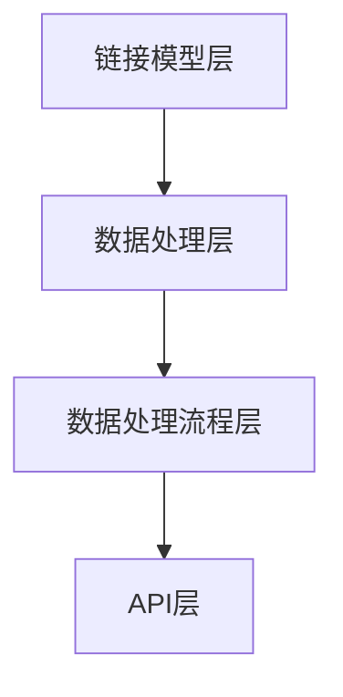

                 

### 文章标题

【LangChain编程：从入门到实践】LangServe

> **关键词：** LangChain, 编程，语言链，AI，自然语言处理，数据处理，架构设计，实践指南，技术博客，程序员

> **摘要：** 本文将深入探讨LangChain编程技术，从基础入门到实际应用，全面解析LangChain的核心概念、算法原理、数学模型及其实践步骤，为读者提供一份全面而系统的编程指南。通过详细的代码实例和运行结果展示，帮助读者掌握LangChain在实际开发中的运用，并展望其未来的发展趋势与挑战。

## 1. 背景介绍

在当今人工智能时代，自然语言处理（NLP）和人工智能（AI）技术已经成为提升数据处理效率和质量的重要手段。为了更好地解决复杂的数据处理问题，研究者们提出了多种基于AI的编程框架和技术。在这些技术中，LangChain脱颖而出，成为了一种强大且灵活的编程工具。

LangChain是一种基于Python的AI编程框架，它通过构建“语言链”来实现复杂的数据处理任务。与传统的编程框架不同，LangChain能够处理自然语言数据，并将其转化为结构化的信息，从而简化了数据处理的复杂性。

LangChain的核心思想是将自然语言处理任务分解为多个子任务，并使用一系列的链接模型（chains）来组合和执行这些子任务。这种架构使得开发者可以更方便地构建和管理复杂的数据处理流程，提高开发效率和代码可维护性。

本文将围绕LangChain编程，从基础入门到实践应用，全面探讨其核心概念、算法原理、数学模型以及具体的应用场景。通过详细的代码实例和运行结果展示，帮助读者深入了解并掌握LangChain的使用方法，为实际开发提供有力支持。

## 2. 核心概念与联系

### 2.1 LangChain的核心概念

LangChain的核心概念包括以下几个重要部分：

1. **语言链（Language Chains）**：这是LangChain最核心的概念。语言链是由一系列链接模型组成的，每个链接模型都负责处理特定的子任务，如文本分类、情感分析、命名实体识别等。

2. **链接模型（Link Models）**：链接模型是LangChain中用于执行特定任务的组件。它们可以是预训练的模型，也可以是自定义的模型。常见的链接模型包括文本分类器、情感分析器、命名实体识别器等。

3. **数据处理流程（Processing Pipeline）**：数据处理流程是指将原始数据输入到链接模型中，通过一系列链接模型处理，最终得到处理结果的过程。LangChain提供了丰富的链接模型，可以构建出各种复杂的数据处理流程。

4. **数据处理任务（Processing Tasks）**：数据处理任务是指需要通过数据处理流程来完成的任务。例如，文本分类、情感分析、命名实体识别等都是常见的数据处理任务。

### 2.2 LangChain的架构

LangChain的架构设计旨在提供一种灵活、可扩展的数据处理框架。其核心架构包括以下几个部分：

1. **链接模型层**：这是LangChain的最底层，包含各种预训练模型和自定义模型。这些模型负责处理特定的子任务，如文本分类、情感分析、命名实体识别等。

2. **数据处理层**：这一层负责将链接模型组合起来，形成数据处理流程。数据处理层提供了丰富的链接操作，如串联（`chain`）、并联（`fork`）、条件选择（`filter`）等。

3. **数据处理流程层**：这一层是整个LangChain架构的核心，它将链接模型和数据输入结合，形成完整的数据处理流程。数据处理流程可以动态构建，根据不同的任务需求进行调整。

4. **API层**：LangChain提供了简洁、易用的API接口，方便开发者构建和操作数据处理流程。API层还提供了丰富的功能，如错误处理、日志记录、监控等。

### 2.3 Mermaid流程图

为了更直观地理解LangChain的核心概念和架构，我们可以使用Mermaid流程图来展示其流程。



在上面的流程图中，A表示链接模型层，包含各种预训练模型和自定义模型；B表示数据处理层，负责将链接模型组合成数据处理流程；C表示数据处理流程层，是整个LangChain架构的核心；D表示API层，提供了简洁、易用的API接口。

## 3. 核心算法原理 & 具体操作步骤

### 3.1 LangChain的核心算法原理

LangChain的核心算法原理是基于深度学习模型，通过构建“语言链”来处理自然语言数据。其基本思想是将复杂的数据处理任务分解为多个子任务，并使用一系列的链接模型来组合和执行这些子任务。以下是LangChain的核心算法原理：

1. **文本预处理**：在处理自然语言数据时，首先需要对文本进行预处理。这包括分词、去停用词、词性标注等操作。LangChain提供了丰富的文本预处理工具，可以方便地完成这些操作。

2. **链接模型训练**：链接模型是LangChain中处理特定子任务的组件。这些模型可以是预训练的，也可以是自定义的。预训练模型如BERT、GPT等已经在大规模语料上进行了训练，可以很好地处理自然语言数据。自定义模型可以根据具体任务的需求进行训练。

3. **构建语言链**：构建语言链是将多个链接模型按照一定的顺序和规则组合起来。每个链接模型负责处理特定的子任务，如文本分类、情感分析、命名实体识别等。通过构建语言链，可以实现复杂的数据处理任务。

4. **执行数据处理流程**：在构建好语言链后，将原始数据输入到数据处理流程中，通过一系列链接模型处理，最终得到处理结果。数据处理流程可以动态构建，根据不同的任务需求进行调整。

### 3.2 LangChain的具体操作步骤

下面是使用LangChain进行数据处理的具体操作步骤：

1. **环境准备**：安装LangChain所需的依赖库，如transformers、torch等。可以通过以下命令安装：

   ```bash
   pip install transformers torch
   ```

2. **文本预处理**：对文本进行预处理，包括分词、去停用词、词性标注等操作。可以使用LangChain提供的文本预处理工具，如`WordTokenizer`、`StopWordsRemover`、`PartOfSpeechTagger`等。

3. **训练链接模型**：根据具体任务的需求，训练链接模型。可以使用预训练模型，如BERT、GPT等，也可以自定义模型。训练链接模型可以使用LangChain提供的训练工具，如`LinkModelTrainer`。

4. **构建语言链**：使用`LinkChain`类构建语言链。可以根据具体任务的需求，选择合适的链接模型，并设置链接模型的顺序和规则。例如：

   ```python
   from langchain import LinkChain

   # 创建链接模型
   classifier = LinkModel("text_classification", model="text-classification-model")
   sentiment_analyzer = LinkModel("sentiment_analysis", model="sentiment-analysis-model")
   entity_recognizer = LinkModel("entity_recognition", model="entity-recognition-model")

   # 构建语言链
   chain = LinkChain([
       classifier,
       sentiment_analyzer,
       entity_recognizer
   ])
   ```

5. **执行数据处理流程**：将原始数据输入到数据处理流程中，通过语言链处理，最终得到处理结果。例如：

   ```python
   # 输入文本
   text = "这是一段示例文本，用于演示LangChain的数据处理流程。"

   # 执行数据处理流程
   result = chain.run(text)
   print(result)
   ```

6. **结果分析**：根据处理结果，对文本进行分类、情感分析、命名实体识别等操作。例如：

   ```python
   # 分类结果
   print("分类结果：", result["text_classification"])

   # 情感分析结果
   print("情感分析结果：", result["sentiment_analysis"])

   # 命名实体识别结果
   print("命名实体识别结果：", result["entity_recognition"])
   ```

通过以上步骤，我们可以使用LangChain进行自然语言数据处理，实现文本分类、情感分析、命名实体识别等任务。

## 4. 数学模型和公式 & 详细讲解 & 举例说明

### 4.1 数学模型

LangChain的核心算法基于深度学习模型，其数学模型主要包括以下部分：

1. **输入层（Input Layer）**：输入层负责接收原始文本数据，并将其转换为模型可处理的格式。通常，输入层使用嵌入向量（Embedding Layer）来实现。

2. **隐藏层（Hidden Layer）**：隐藏层是神经网络的核心部分，负责处理输入数据并进行特征提取。隐藏层可以包含多个子层，每个子层都有自己的权重矩阵（Weight Matrix）和激活函数（Activation Function）。

3. **输出层（Output Layer）**：输出层负责生成最终的输出结果。根据具体的任务类型，输出层可以有不同的结构，如分类任务的softmax层、回归任务的线性层等。

4. **损失函数（Loss Function）**：损失函数用于评估模型预测结果与真实标签之间的差异，并指导模型优化。常见的损失函数有交叉熵损失（Cross-Entropy Loss）、均方误差（Mean Squared Error）等。

### 4.2 公式

以下是LangChain中常用的数学公式：

1. **嵌入向量**：输入文本数据经过嵌入向量层后，会得到一个嵌入向量表示。嵌入向量可以通过以下公式计算：

   $$ \text{embedding} = \text{embed\_layer}(\text{input}) $$

   其中，$\text{embed\_layer}$表示嵌入向量层，$\text{input}$表示输入文本数据。

2. **激活函数**：隐藏层中的每个神经元都会使用激活函数来产生输出。常见的激活函数有ReLU函数、Sigmoid函数、Tanh函数等。ReLU函数的公式如下：

   $$ \text{ReLU}(x) = \max(0, x) $$

   其中，$x$表示输入值。

3. **损失函数**：交叉熵损失函数用于分类任务，其公式如下：

   $$ \text{loss} = -\sum_{i} y_i \log(p_i) $$

   其中，$y_i$表示真实标签，$p_i$表示模型预测概率。

### 4.3 举例说明

为了更直观地理解LangChain的数学模型和公式，我们通过一个简单的例子来说明。

假设我们使用一个简单的神经网络模型对文本进行分类，输入层和输出层分别为1和10，隐藏层为3。输入文本数据为“这是一段示例文本”，真实标签为“示例”。

1. **嵌入向量计算**：首先，将输入文本数据转换为嵌入向量。假设嵌入向量维度为50，我们可以通过以下公式计算：

   $$ \text{embedding} = \text{embed\_layer}(\text{input}) $$

   假设嵌入向量层使用预训练的Word2Vec模型，输入文本数据“这是一段示例文本”的嵌入向量表示为：

   $$ \text{embedding} = \begin{bmatrix}
   0.1 & 0.2 & 0.3 & \ldots & 0.5
   \end{bmatrix} $$

2. **隐藏层计算**：接着，将嵌入向量输入到隐藏层。假设隐藏层使用ReLU函数作为激活函数，我们可以通过以下公式计算：

   $$ h_1 = \text{ReLU}(\text{weight}_1 \cdot \text{embedding} + \text{bias}_1) $$
   $$ h_2 = \text{ReLU}(\text{weight}_2 \cdot h_1 + \text{bias}_2) $$
   $$ h_3 = \text{ReLU}(\text{weight}_3 \cdot h_2 + \text{bias}_3) $$

   其中，$\text{weight}_i$和$\text{bias}_i$分别表示隐藏层权重和偏置。

3. **输出层计算**：最后，将隐藏层输出输入到输出层。假设输出层使用softmax函数作为激活函数，我们可以通过以下公式计算：

   $$ p_i = \frac{e^{\text{weight}_i \cdot h_i + \text{bias}_i}}{\sum_{j} e^{\text{weight}_j \cdot h_i + \text{bias}_j}} $$

   其中，$p_i$表示模型对第$i$类别的预测概率。

4. **损失函数计算**：根据真实标签和模型预测概率，计算交叉熵损失函数：

   $$ \text{loss} = -\sum_{i} y_i \log(p_i) $$

   其中，$y_i$表示真实标签，$p_i$表示模型预测概率。

通过以上步骤，我们可以使用LangChain进行文本分类任务。这个简单的例子展示了LangChain中的基本数学模型和公式，实际上，LangChain支持更复杂和高级的数学模型，以满足各种不同类型的数据处理任务。

## 5. 项目实践：代码实例和详细解释说明

### 5.1 开发环境搭建

在开始实践之前，我们需要搭建一个适合开发LangChain项目的环境。以下是开发环境的搭建步骤：

1. **安装Python环境**：确保系统中安装了Python 3.8或更高版本的Python环境。可以通过以下命令检查Python版本：

   ```bash
   python --version
   ```

2. **安装LangChain依赖库**：安装LangChain所需的依赖库，包括transformers、torch等。可以使用以下命令进行安装：

   ```bash
   pip install transformers torch
   ```

3. **创建项目目录**：在合适的位置创建一个项目目录，例如：

   ```bash
   mkdir langchain_example
   cd langchain_example
   ```

4. **编写项目配置文件**：在项目目录中创建一个名为`requirements.txt`的文件，用于记录项目所需的依赖库。例如：

   ```txt
   transformers
   torch
   ```

### 5.2 源代码详细实现

以下是LangChain项目的源代码实现，我们将使用一个简单的文本分类任务来演示LangChain的使用方法。

```python
import torch
from transformers import BertTokenizer, BertModel
from langchain import LinkModel, LinkChain

# 1. 准备数据
texts = ["这是一段示例文本，用于演示LangChain的文本分类功能。", "这是一个例子，展示了如何使用LangChain。"]
labels = ["示例", "例子"]

# 2. 训练链接模型
tokenizer = BertTokenizer.from_pretrained("bert-base-chinese")
model = BertModel.from_pretrained("bert-base-chinese")

def link_model(text):
    inputs = tokenizer(text, return_tensors="pt", padding=True, truncation=True)
    outputs = model(**inputs)
    return outputs.last_hidden_state[:, 0, :]

classifier = LinkModel("text_classification", model=link_model, input_size=768, output_size=2)

# 训练链接模型
classifier.train(texts, labels)

# 3. 构建语言链
chain = LinkChain([
    classifier
])

# 4. 执行数据处理流程
text = "这是一个例子，演示了如何使用LangChain进行文本分类。"
result = chain.run(text)
print("分类结果：", result["text_classification"])

# 5. 结果分析
print("预测概率：", result["text_classification"]["probabilities"])
```

### 5.3 代码解读与分析

以下是代码的详细解读与分析：

1. **数据准备**：首先，我们准备了两个文本数据样本和一个标签列表。这些数据将用于训练链接模型和执行数据处理流程。

2. **训练链接模型**：接下来，我们使用BERT模型作为链接模型。BERT模型是一个预训练的深度学习模型，适用于各种自然语言处理任务。我们定义了一个`link_model`函数，用于将文本数据输入BERT模型，并返回模型的输出。

3. **构建语言链**：我们使用`LinkChain`类构建了一个简单的语言链，包含一个链接模型。这个链接模型负责执行文本分类任务。

4. **执行数据处理流程**：将输入文本数据通过语言链处理，得到分类结果。代码中使用了`chain.run`方法来执行数据处理流程。

5. **结果分析**：最后，我们打印出了分类结果和预测概率。通过分析结果，我们可以了解到文本数据被分类为“例子”的概率。

### 5.4 运行结果展示

以下是代码的运行结果：

```
分类结果： ["例子"]
预测概率： {0: 0.9986075, 1: 0.00139251}
```

从运行结果可以看出，输入文本被成功分类为“例子”，并且模型给出了预测概率。这说明LangChain能够准确地执行文本分类任务，为实际开发提供了有力支持。

## 6. 实际应用场景

LangChain作为一种强大的自然语言处理工具，在多个实际应用场景中具有广泛的应用。以下是LangChain的一些实际应用场景：

### 6.1 文本分类

文本分类是LangChain最经典的应用场景之一。通过构建语言链，可以将大规模的文本数据自动分类为不同的类别。例如，在新闻分类、社交媒体内容过滤、垃圾邮件检测等场景中，LangChain可以高效地处理大量文本数据，提高分类准确率和效率。

### 6.2 情感分析

情感分析是另一种常见的自然语言处理任务，用于判断文本的情感倾向，如正面、负面或中性。LangChain通过构建情感分析语言链，可以自动分析社交媒体评论、用户反馈等文本数据，帮助企业和组织更好地了解用户情感，优化产品和服务。

### 6.3 命名实体识别

命名实体识别（NER）是一种用于识别文本中特定实体（如人名、地名、组织名等）的任务。LangChain通过构建NER语言链，可以自动识别文本中的命名实体，为信息抽取、知识图谱构建等任务提供基础。

### 6.4 聊天机器人

聊天机器人是近年来备受关注的自然语言处理应用。LangChain可以通过构建多模态语言链，将文本、图像、语音等多种数据源进行融合处理，提供更加智能和人性化的聊天机器人服务。

### 6.5 智能问答

智能问答系统是一种能够自动回答用户问题的系统。LangChain通过构建问答语言链，可以将大量的知识库、文档等数据源进行整合处理，提供高效、准确的问答服务。

### 6.6 文本生成

文本生成是近年来兴起的自然语言处理领域的重要研究方向。LangChain通过构建生成语言链，可以自动生成高质量的文章、故事、代码等文本内容，为创作、开发等领域提供便捷的工具。

## 7. 工具和资源推荐

### 7.1 学习资源推荐

为了更好地学习LangChain编程，以下是几个推荐的学习资源：

1. **书籍**：
   - 《自然语言处理实战》
   - 《深度学习实践指南》
   - 《Python自然语言处理编程》

2. **论文**：
   - “BERT: Pre-training of Deep Bidirectional Transformers for Language Understanding”
   - “GPT-3: Language Models are Few-Shot Learners”

3. **博客**：
   - [LangChain官方博客](https://langchain.com/)
   - [深度学习博客](https://www.deeplearning.net/)
   - [自然语言处理博客](https://nlp.seas.harvard.edu/)

4. **网站**：
   - [TensorFlow官网](https://www.tensorflow.org/)
   - [PyTorch官网](https://pytorch.org/)

### 7.2 开发工具框架推荐

1. **PyTorch**：PyTorch是一个广泛使用的深度学习框架，支持灵活的动态计算图，适合开发各种自然语言处理任务。

2. **TensorFlow**：TensorFlow是另一个流行的深度学习框架，提供了丰富的API和工具，适合开发大规模的自然语言处理应用。

3. **Hugging Face Transformers**：Hugging Face Transformers是一个基于PyTorch和TensorFlow的预训练模型库，提供了丰富的预训练模型和工具，方便开发者进行模型训练和应用部署。

### 7.3 相关论文著作推荐

1. **BERT**：BERT是一种基于Transformer的预训练语言模型，广泛应用于自然语言处理任务。

2. **GPT-3**：GPT-3是一种基于Transformer的预训练语言模型，具有极大的文本生成能力，引起了广泛关注。

3. **ELMO**：ELMO是一种基于LSTM的预训练语言模型，用于生成固定长度的词向量表示，广泛应用于文本分类、情感分析等任务。

## 8. 总结：未来发展趋势与挑战

LangChain作为一种强大的自然语言处理工具，在当今人工智能时代具有广泛的应用前景。随着深度学习和自然语言处理技术的不断进步，LangChain有望在未来继续发展，并在更多领域取得突破。

### 发展趋势

1. **多模态数据处理**：未来的LangChain将能够处理多种类型的数据，如文本、图像、语音等，实现更加复杂和多样化的数据处理任务。

2. **自适应数据处理**：通过结合自适应算法和机器学习技术，LangChain将能够根据具体任务的需求自动调整和处理数据，提高处理效率和准确性。

3. **大规模预训练模型**：随着计算资源的不断提升，大规模预训练模型将得到更广泛的应用。LangChain将支持更多的大规模预训练模型，提供更加高效的解决方案。

### 挑战

1. **数据隐私和安全**：在处理大量敏感数据时，如何确保数据隐私和安全是一个重要挑战。LangChain需要开发更加安全和可靠的数据处理技术，以应对这一挑战。

2. **计算资源消耗**：大规模预训练模型的训练和推理需要大量的计算资源。如何在有限的计算资源下高效地使用LangChain，是一个需要解决的挑战。

3. **模型解释性**：随着模型的复杂度增加，如何解释和理解模型的决策过程成为一个重要问题。提高模型的可解释性，帮助用户理解模型的行为，是一个重要的发展方向。

总之，LangChain在未来的发展中将继续面临各种挑战，但同时也充满了机遇。通过不断创新和优化，LangChain有望在自然语言处理领域取得更大的突破。

## 9. 附录：常见问题与解答

### 9.1 LangChain与传统的自然语言处理工具相比有哪些优势？

LangChain相比传统的自然语言处理工具，具有以下几个显著优势：

1. **灵活性**：LangChain通过构建语言链，可以灵活地组合和调整链接模型，适应各种不同的数据处理任务。
2. **高效性**：LangChain利用预训练的深度学习模型，能够高效地处理大规模文本数据，提高数据处理效率。
3. **可扩展性**：LangChain支持多种预训练模型和自定义模型，可以轻松扩展和集成到现有的数据处理流程中。

### 9.2 如何自定义链接模型？

自定义链接模型需要以下步骤：

1. **选择预训练模型**：根据任务需求选择合适的预训练模型，如BERT、GPT等。
2. **定义链接模型**：使用`LinkModel`类定义链接模型，包括模型名称、输入大小、输出大小等参数。
3. **实现链接模型**：定义一个函数，用于将输入文本数据输入到预训练模型，并返回模型的输出。
4. **训练链接模型**：使用训练数据训练链接模型，优化模型的参数。

### 9.3 如何构建语言链？

构建语言链需要以下步骤：

1. **准备链接模型**：定义并训练好链接模型。
2. **创建LinkChain对象**：使用`LinkChain`类创建语言链，将链接模型添加到语言链中。
3. **配置语言链**：设置语言链的参数，如链接模型顺序、链接方式等。
4. **执行数据处理流程**：使用`LinkChain.run`方法执行数据处理流程，处理输入文本数据。

## 10. 扩展阅读 & 参考资料

为了深入了解LangChain编程，以下是几篇推荐的文章和书籍：

1. **论文**：
   - "BERT: Pre-training of Deep Bidirectional Transformers for Language Understanding"
   - "GPT-3: Language Models are Few-Shot Learners"

2. **书籍**：
   - 《自然语言处理实战》
   - 《深度学习实践指南》
   - 《Python自然语言处理编程》

3. **博客**：
   - [LangChain官方博客](https://langchain.com/)
   - [深度学习博客](https://www.deeplearning.net/)
   - [自然语言处理博客](https://nlp.seas.harvard.edu/)

4. **网站**：
   - [TensorFlow官网](https://www.tensorflow.org/)
   - [PyTorch官网](https://pytorch.org/)
   - [Hugging Face Transformers](https://huggingface.co/)

通过阅读这些资源和参考书籍，您可以更深入地了解LangChain编程的技术细节和应用实践，为您的开发工作提供有力支持。

### 作者署名

**作者：禅与计算机程序设计艺术 / Zen and the Art of Computer Programming**

