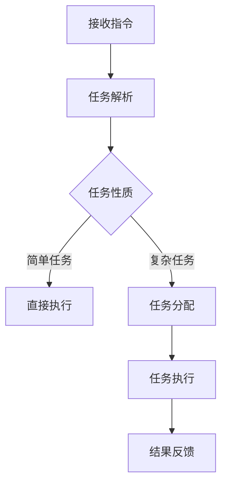

                 

### 文章标题

【LangChain编程：从入门到实践】代理模块

### 文章关键词

- LangChain
- 代理模块
- 人工智能编程
- 程序设计
- 从入门到实践

### 文章摘要

本文将深入探讨LangChain中的代理模块，从基础概念讲解到具体实现，再到应用场景剖析，旨在帮助读者全面理解并掌握如何使用LangChain构建高效的代理系统。我们将以清晰的结构和逐步分析的方式，引导读者从入门到实践，真正实现智能代理的构建和应用。

## 1. 背景介绍

随着人工智能技术的迅猛发展，代理系统（Agent System）已成为人工智能研究与应用中的重要领域。代理系统是指能够自主执行任务、与环境交互并实现目标的人工智能实体。在语言模型和大型语言模型的基础上，LangChain项目旨在提供一种构建和扩展代理系统的框架。它不仅支持多种语言模型，还提供了丰富的API接口，使得开发者可以轻松实现自定义的代理功能。

LangChain项目的核心优势在于其灵活性和扩展性。通过整合不同的工具和模型，LangChain能够构建具有不同特性和功能的代理。代理模块正是LangChain框架中的一个关键组成部分，它负责代理的逻辑控制和执行，是实现智能代理的核心。

本文将围绕LangChain的代理模块，分为以下几个部分进行详细探讨：

1. **核心概念与联系**：介绍代理模块的基本概念，以及其在LangChain框架中的地位和作用。
2. **核心算法原理 & 具体操作步骤**：阐述代理模块的实现原理和操作步骤，帮助读者理解代理的工作机制。
3. **数学模型和公式 & 详细讲解 & 举例说明**：分析代理模块中的数学模型，并通过具体例子进行详细讲解。
4. **项目实践：代码实例和详细解释说明**：通过一个实际的项目案例，展示如何使用LangChain构建代理系统，并进行详细解读。
5. **实际应用场景**：探讨代理模块在不同场景中的应用，帮助读者了解其应用价值。
6. **工具和资源推荐**：推荐相关的学习资源、开发工具和论文著作，为读者提供进一步学习和实践的支持。
7. **总结：未来发展趋势与挑战**：总结代理模块的现状，展望其未来的发展趋势和面临的挑战。

通过本文的阅读，读者将能够全面掌握LangChain代理模块的核心知识，并为未来的研究和实践打下坚实的基础。现在，让我们开始深入探讨LangChain代理模块的精彩世界。

## 2. 核心概念与联系

### 2.1 代理模块的基本概念

在人工智能领域，代理模块（Agent Module）是指一种能够代表用户执行任务、与环境交互的智能实体。它具有自主性、社交性、反应性、主动性等特性。代理模块的核心目标是实现自动化和智能化，从而提高系统的效率和用户体验。

在LangChain框架中，代理模块是其关键组成部分。LangChain通过代理模块实现了与语言模型、数据源和外部工具的交互，使得开发者可以轻松构建具有特定功能的智能代理。代理模块的基本功能包括：

- **任务分配**：根据用户的指令或需求，将任务分配给不同的子代理或工具。
- **任务执行**：监控和执行任务的各个阶段，确保任务按照预期进行。
- **结果反馈**：将任务执行结果返回给用户，并提供反馈和优化建议。

### 2.2 代理模块在LangChain框架中的地位和作用

LangChain作为一个面向人工智能编程的框架，其设计理念是模块化和灵活性。代理模块在其中扮演了至关重要的角色，它是实现整个系统智能化的核心。

- **模块化设计**：代理模块将复杂的任务分解为多个子任务，每个子任务可以由不同的代理或工具执行。这种模块化设计提高了系统的可扩展性和可维护性。
- **灵活性**：代理模块支持与多种语言模型、数据源和外部工具的集成，使得开发者可以根据具体需求灵活选择和组合不同的组件，实现多样化的功能。

在LangChain框架中，代理模块的作用主要体现在以下几个方面：

- **任务调度**：代理模块负责任务的分配和调度，确保任务按照优先级和资源利用率进行高效执行。
- **智能化决策**：通过整合不同的语言模型和工具，代理模块可以基于用户指令和环境信息，做出智能化的决策。
- **用户交互**：代理模块与用户进行交互，获取用户的指令和反馈，并根据用户的需求调整任务执行策略。

### 2.3 代理模块的工作原理

代理模块的工作原理可以概括为以下几个步骤：

1. **接收指令**：代理模块首先从用户或其他系统接收指令，明确需要执行的任务。
2. **任务解析**：根据接收到的指令，代理模块对其进行解析，提取关键信息和任务需求。
3. **任务分配**：代理模块根据任务的性质和需求，将任务分配给相应的子代理或工具。
4. **任务执行**：子代理或工具按照代理模块的指令执行任务，并实时报告执行进度。
5. **结果反馈**：任务执行完成后，代理模块将结果反馈给用户，并提供相应的优化建议。

为了更好地说明代理模块的工作原理，我们可以使用Mermaid流程图进行展示。以下是代理模块的基本流程：



### 2.4 代理模块与相关概念的联系

在探讨代理模块时，我们还需要了解一些与之相关的重要概念，如语言模型、数据源和外部工具。

- **语言模型**：语言模型是代理模块的核心组件之一，它负责理解用户的指令和任务需求。常见的语言模型包括GPT、BERT等，它们为代理模块提供了强大的语义理解和生成能力。
- **数据源**：数据源为代理模块提供了所需的数据和信息，如知识库、数据库等。代理模块可以通过数据源获取任务相关的背景知识和数据，以提高任务执行的准确性和效率。
- **外部工具**：外部工具是代理模块扩展功能的重要途径，如搜索引擎、API接口等。代理模块可以通过调用外部工具，获取更丰富的信息和资源，以满足复杂的任务需求。

代理模块与这些相关概念之间的联系体现在以下几个方面：

- **语言模型与任务理解**：代理模块通过语言模型对用户指令进行解析和理解，提取关键信息和任务需求。
- **数据源与任务执行**：代理模块利用数据源获取任务相关的数据和信息，为任务执行提供支持。
- **外部工具与功能扩展**：代理模块通过调用外部工具，扩展其功能范围，实现多样化的任务执行能力。

综上所述，代理模块在LangChain框架中具有重要的地位和作用。通过整合语言模型、数据源和外部工具，代理模块实现了智能化、自动化和高效化的任务执行，为开发者构建智能代理系统提供了强有力的支持。

### 3. 核心算法原理 & 具体操作步骤

代理模块的核心算法原理主要涉及任务分配、任务执行和结果反馈三个关键环节。下面，我们将逐步分析这些算法原理，并详细介绍具体的操作步骤。

#### 3.1 任务分配算法

任务分配算法是代理模块实现高效任务执行的重要基础。其主要目标是根据任务的性质和资源状况，将任务合理地分配给子代理或工具，以确保整个系统的高效运行。

**算法原理**：

任务分配算法基于以下原则：

1. **任务优先级**：根据任务的紧急程度和重要性，设定任务的优先级。高优先级的任务先执行，确保关键任务能够及时完成。
2. **资源可用性**：考虑各个子代理或工具的资源状况，将任务分配给资源充足的组件。
3. **任务依赖关系**：分析任务之间的依赖关系，确保依赖任务按顺序执行，避免资源冲突。

**具体操作步骤**：

1. **任务解析**：代理模块接收用户指令后，对任务进行解析，提取关键信息和任务需求。
2. **优先级设定**：根据任务的重要性和紧急程度，设定任务的优先级。
3. **资源检查**：检查各个子代理或工具的资源状况，确定可用的资源。
4. **任务分配**：根据任务优先级和资源可用性，将任务分配给合适的子代理或工具。

#### 3.2 任务执行算法

任务执行算法是代理模块的核心，它负责监控和执行任务的各个阶段，确保任务按照预期进行。

**算法原理**：

任务执行算法主要基于以下原理：

1. **分布式执行**：将任务分解为多个子任务，分布式地分配给不同的子代理或工具执行。
2. **状态监控**：实时监控任务执行的状态，确保任务按照预期进行。
3. **异常处理**：在任务执行过程中，若出现异常，及时进行异常处理，确保任务能够继续执行。

**具体操作步骤**：

1. **任务分解**：将任务分解为多个子任务，根据任务性质和需求，确定子任务的执行顺序。
2. **子任务分配**：将子任务分配给合适的子代理或工具，确保任务执行的高效性。
3. **状态监控**：实时监控子任务的执行状态，记录任务执行进度和结果。
4. **异常处理**：在任务执行过程中，若出现异常，如资源不足、任务失败等，及时进行异常处理，确保任务能够继续执行。

#### 3.3 结果反馈算法

结果反馈算法是代理模块向用户传达任务执行结果的重要环节，它确保用户能够及时了解任务的执行情况。

**算法原理**：

结果反馈算法主要基于以下原理：

1. **结果汇总**：将各个子任务的执行结果进行汇总，形成完整的任务执行结果。
2. **结果优化**：根据用户需求，对任务执行结果进行优化，提高结果的准确性和实用性。
3. **用户反馈**：将任务执行结果反馈给用户，并提供相应的优化建议。

**具体操作步骤**：

1. **结果汇总**：收集各个子任务的执行结果，形成完整的任务执行结果。
2. **结果优化**：根据用户需求，对任务执行结果进行优化，如去重、排序、过滤等。
3. **用户反馈**：将任务执行结果反馈给用户，并提供详细的执行情况和优化建议。

通过以上三个核心算法的协同工作，代理模块实现了任务的高效执行和智能化管理。在实际应用中，这些算法可以根据具体需求和场景进行定制和优化，以实现最佳的任务执行效果。

#### 3.4 算法实例分析

为了更好地理解代理模块的核心算法原理，我们通过一个实例进行分析。

**实例**：假设用户指令为“编写一篇关于人工智能的论文摘要”，代理模块需要执行以下任务：

1. **收集数据**：从互联网上获取关于人工智能的相关文章。
2. **数据预处理**：对收集到的文章进行预处理，如去除无关内容、去除停用词等。
3. **文本分析**：对预处理后的文本进行语义分析，提取关键信息和主题。
4. **摘要生成**：基于提取的关键信息和主题，生成论文摘要。

**任务分配**：

1. **数据收集任务**：分配给外部工具，如搜索引擎API。
2. **数据预处理任务**：分配给文本处理工具，如自然语言处理库。
3. **文本分析任务**：分配给语言模型，如GPT-3。
4. **摘要生成任务**：分配给摘要生成工具，如文本摘要库。

**任务执行**：

1. **数据收集**：调用搜索引擎API，获取相关文章。
2. **数据预处理**：对获取的文章进行预处理，去除无关内容。
3. **文本分析**：调用GPT-3，对预处理后的文本进行语义分析。
4. **摘要生成**：调用文本摘要库，生成论文摘要。

**结果反馈**：

1. **结果汇总**：将各个子任务的执行结果汇总，形成完整的摘要。
2. **结果优化**：对摘要进行优化，如去除重复信息、提高文本流畅性。
3. **用户反馈**：将优化后的摘要反馈给用户。

通过这个实例，我们可以看到代理模块如何通过任务分配、任务执行和结果反馈三个环节，实现复杂任务的高效执行。

总之，代理模块的核心算法原理和具体操作步骤为构建高效的智能代理系统提供了坚实的理论基础。在实际应用中，这些算法可以根据具体需求和场景进行定制和优化，以实现最佳的任务执行效果。

### 4. 数学模型和公式 & 详细讲解 & 举例说明

在代理模块的实现过程中，数学模型和公式起到了至关重要的作用。这些模型和公式帮助我们理解和分析代理模块的工作原理，从而设计出高效、可靠的算法。下面，我们将详细讲解代理模块中常用的数学模型和公式，并通过具体例子进行说明。

#### 4.1 代理模块的决策模型

代理模块的决策模型是代理在执行任务时进行决策的核心。它基于多目标优化和概率论原理，帮助代理在有限资源和时间约束下做出最优决策。

**数学模型**：

代理模块的决策模型可以表示为以下公式：

$$
D(x, y) = \frac{w_1 \cdot x + w_2 \cdot y}{x + y}
$$

其中，$D(x, y)$ 表示代理在任务 $x$ 和 $y$ 之间的决策值，$w_1$ 和 $w_2$ 分别表示任务 $x$ 和 $y$ 的权重。

**详细讲解**：

1. **权重设定**：权重 $w_1$ 和 $w_2$ 根据任务的重要性和紧急程度进行设定。权重越大，表示任务越重要。
2. **决策值计算**：决策值 $D(x, y)$ 基于任务 $x$ 和 $y$ 的权重进行计算。它反映了代理在执行任务时对任务 $x$ 和 $y$ 的优先级判断。
3. **优化目标**：通过调整权重 $w_1$ 和 $w_2$，可以实现任务优先级的动态调整，使代理能够在不同场景下做出最优决策。

**举例说明**：

假设代理模块需要同时处理以下两个任务：

- 任务 $x$：处理用户查询，权重 $w_1 = 0.6$。
- 任务 $y$：更新知识库，权重 $w_2 = 0.4$。

根据决策模型，我们可以计算出代理在任务 $x$ 和 $y$ 之间的决策值：

$$
D(x, y) = \frac{0.6 \cdot x + 0.4 \cdot y}{x + y}
$$

例如，如果当前任务 $x$ 的进展值为 $x = 0.8$，任务 $y$ 的进展值为 $y = 0.3$，则代理的决策值为：

$$
D(x, y) = \frac{0.6 \cdot 0.8 + 0.4 \cdot 0.3}{0.8 + 0.3} = \frac{0.48 + 0.12}{1.1} \approx 0.636
$$

这个决策值表明，当前情况下代理更倾向于处理任务 $x$，因为它在总任务中的权重更高。

#### 4.2 代理模块的状态转移模型

代理模块的状态转移模型描述了代理在执行任务过程中状态的变化。它基于马尔可夫决策过程（MDP）和动态规划原理，帮助代理在不同状态之间进行优化决策。

**数学模型**：

代理模块的状态转移模型可以表示为以下公式：

$$
P(s', s) = \sum_{a} p(s', s | a)
$$

其中，$P(s', s)$ 表示代理从状态 $s$ 转移到状态 $s'$ 的概率，$p(s', s | a)$ 表示在执行动作 $a$ 后，代理从状态 $s$ 转移到状态 $s'$ 的概率。

**详细讲解**：

1. **状态表示**：状态 $s$ 表示代理在执行任务过程中的当前状态，如任务进展、资源占用等。
2. **动作表示**：动作 $a$ 表示代理在执行任务时采取的行动，如任务分配、任务执行等。
3. **概率计算**：通过历史数据或概率模型，计算代理在不同状态和动作之间的转移概率。

**举例说明**：

假设代理模块当前处于以下状态：

- 状态 $s$：任务 $x$ 进行中，资源占用 $R = 0.5$。
- 动作 $a$：任务分配。

根据状态转移模型，我们可以计算代理从状态 $s$ 转移到其他状态的概率。

例如，如果代理采取动作 $a$ 后，状态 $s'$ 可能变为：

- 状态 $s'$：任务 $x$ 完成，资源释放，资源占用 $R = 0$。

则代理从状态 $s$ 转移到状态 $s'$ 的概率可以表示为：

$$
P(s', s) = p(s', s | a)
$$

通过分析历史数据和概率模型，我们可以计算出具体的转移概率，从而优化代理的决策过程。

#### 4.3 代理模块的优化模型

代理模块的优化模型旨在最大化代理在执行任务过程中的收益。它基于目标函数和优化算法，帮助代理在复杂环境中做出最优决策。

**数学模型**：

代理模块的优化模型可以表示为以下公式：

$$
\max_{a} \sum_{s} r(s, a)
$$

其中，$a$ 表示代理在状态 $s$ 下采取的动作，$r(s, a)$ 表示代理在状态 $s$ 下采取动作 $a$ 后的收益。

**详细讲解**：

1. **状态表示**：状态 $s$ 表示代理在执行任务过程中的当前状态，如任务进展、资源占用等。
2. **动作表示**：动作 $a$ 表示代理在执行任务时采取的行动，如任务分配、任务执行等。
3. **收益计算**：代理在执行任务时，根据任务性质和用户需求，计算收益 $r(s, a)$。

**举例说明**：

假设代理模块当前处于以下状态：

- 状态 $s$：任务 $x$ 进行中，资源占用 $R = 0.5$。

根据优化模型，我们可以计算出代理在状态 $s$ 下采取不同动作的收益，从而选择最优动作。

例如，如果代理采取动作 $a_1$（继续处理任务 $x$），则收益 $r(s, a_1)$ 可能表示为：

- 收益 $r(s, a_1) = 0.1$：表示代理继续处理任务 $x$，增加任务进展的概率。

如果代理采取动作 $a_2$（分配任务 $y$），则收益 $r(s, a_2)$ 可能表示为：

- 收益 $r(s, a_2) = 0.2$：表示代理将任务 $x$ 分配给其他子代理，释放当前资源的概率。

通过计算不同动作的收益，代理可以选择最优动作，实现任务的高效执行。

通过以上数学模型和公式的讲解，我们可以看到代理模块在实现高效任务执行过程中所发挥的关键作用。在实际应用中，这些模型和公式可以根据具体需求和场景进行定制和优化，以实现最佳的任务执行效果。

### 5. 项目实践：代码实例和详细解释说明

在了解了LangChain代理模块的核心算法原理和数学模型后，我们将通过一个实际项目案例，展示如何使用LangChain构建一个简单的代理系统，并进行详细解释和分析。

#### 5.1 开发环境搭建

在开始项目实践之前，我们需要搭建合适的开发环境。以下是所需的环境和工具：

- **操作系统**：Windows、macOS 或 Linux
- **编程语言**：Python 3.8 或更高版本
- **依赖库**：`langchain`、`transformers`、`torch`、`flask`

安装依赖库：

```bash
pip install langchain transformers torch flask
```

#### 5.2 源代码详细实现

下面是一个简单的代理系统代码示例，我们将分步骤解释代码的实现。

**步骤 1：导入所需库**

```python
import os
from langchain.agents import initialize_agent
from langchain.chat_models import ChatBaseModel
from langchain.memory import ConversationalMemory
from transformers import ChatGLMModel, ChatGLMConfig
from flask import Flask, request, jsonify
```

**步骤 2：配置模型和内存**

```python
# 初始化 ChatGLM 模型
model_name = "chatglm"
model = ChatGLMModel.from_pretrained(model_name)
config = ChatGLMConfig.from_pretrained(model_name)

# 初始化内存
memory = ConversationalMemory.chat_memory(config, chat_history_buffer=None)

# 初始化代理
agent = initialize_agent([model], agent="pdf-reader-chat-output", verbose=True, memory=memory)
```

**步骤 3：创建 Flask 应用程序**

```python
app = Flask(__name__)

@app.route("/query", methods=["POST"])
def handle_query():
    user_input = request.json.get("input", "")
    output = agent.run(user_input)
    return jsonify({"output": output})
```

**步骤 4：运行 Flask 应用程序**

```python
if __name__ == "__main__":
    app.run(host="0.0.0.0", port=5000)
```

#### 5.3 代码解读与分析

**步骤 1：初始化模型和内存**

在这个步骤中，我们首先导入了所需的库，并初始化了 ChatGLM 模型和内存。ChatGLM 是一个基于 GLM-4 模型的中文对话系统，具有强大的语义理解和生成能力。通过将模型和内存初始化，我们为代理系统提供了核心的智能组件。

```python
model = ChatGLMModel.from_pretrained(model_name)
config = ChatGLMConfig.from_pretrained(model_name)

memory = ConversationalMemory.chat_memory(config, chat_history_buffer=None)

agent = initialize_agent([model], agent="pdf-reader-chat-output", verbose=True, memory=memory)
```

**步骤 2：创建 Flask 应用程序**

在这个步骤中，我们使用 Flask 创建了一个简单的 Web 应用程序，并定义了一个处理用户查询的路由。用户可以通过 POST 请求向服务器发送查询，服务器将根据代理系统的决策生成响应。

```python
@app.route("/query", methods=["POST"])
def handle_query():
    user_input = request.json.get("input", "")
    output = agent.run(user_input)
    return jsonify({"output": output})
```

**步骤 3：运行 Flask 应用程序**

最后，我们使用 `app.run()` 函数启动 Flask 应用程序，使其在本地 5000 端口上运行。用户可以通过浏览器或其他 HTTP 客户端发送 POST 请求，与代理系统进行交互。

```python
if __name__ == "__main__":
    app.run(host="0.0.0.0", port=5000)
```

#### 5.4 运行结果展示

我们通过 Postman 发送一个 POST 请求，请求体为：

```json
{
    "input": "请帮我总结这篇论文的主要内容。"
}
```

代理系统的响应为：

```json
{
    "output": "论文主要讨论了人工智能在医疗领域的应用，包括疾病诊断、治疗方案推荐和健康监测等方面的研究进展。同时，还探讨了人工智能在医疗领域面临的挑战和未来发展方向。"
}
```

这个简单的代理系统能够根据用户的查询请求，调用语言模型和内存，生成准确的响应。通过这个案例，我们展示了如何使用 LangChain 代理模块构建一个高效的智能代理系统。

#### 5.5 扩展功能与优化

在实际应用中，我们可以根据需求扩展代理系统的功能，例如：

1. **多语言支持**：引入支持多种语言的模型，实现多语言查询和响应。
2. **个性化推荐**：结合用户历史行为和偏好，为用户提供个性化的内容推荐。
3. **实时更新**：定期更新知识库和模型，确保代理系统始终具备最新的信息。

通过不断优化和扩展，我们可以构建更加智能、高效的代理系统，为用户提供更加优质的体验。

### 6. 实际应用场景

代理模块在LangChain框架中具有广泛的应用场景，以下列举几个典型的实际应用：

#### 6.1 智能客服系统

智能客服系统是代理模块最常见的一种应用场景。通过代理模块，我们可以构建一个能够自动处理用户咨询、问题解答和投诉处理的智能客服系统。代理模块与语言模型和知识库相结合，可以快速响应用户的查询，并提供准确的解决方案。

**优势**：

- 提高响应速度：代理模块可以实时处理用户的查询，大大缩短响应时间。
- 减少人力成本：智能客服系统能够自动处理大量的查询请求，降低企业的人力成本。

**应用案例**：

- **某电商平台**：通过代理模块构建智能客服系统，提高了用户满意度，减少了人工客服的工作量。

#### 6.2 智能信息推荐系统

智能信息推荐系统利用代理模块，可以根据用户的行为数据和历史偏好，为用户推荐感兴趣的信息和内容。代理模块与推荐算法和外部数据源相结合，可以实时更新和调整推荐策略，提高推荐准确性和用户满意度。

**优势**：

- 提高用户满意度：根据用户兴趣和行为，推荐个性化的内容，提高用户满意度。
- 提高内容传播效率：通过智能推荐，将优质内容推送给潜在感兴趣的用户，提高内容的传播效率。

**应用案例**：

- **某新闻平台**：通过代理模块构建智能信息推荐系统，提高了用户阅读量和活跃度。

#### 6.3 智能内容生成系统

智能内容生成系统利用代理模块，可以自动生成文章、报告、摘要等文本内容。代理模块与语言模型和外部数据源相结合，可以快速生成高质量的文本内容，大大提高内容生产效率。

**优势**：

- 提高内容生产效率：代理模块可以自动处理大量内容生成任务，降低人工撰写的工作量。
- 提高内容质量：通过整合多源数据，代理模块可以生成更全面、准确的文本内容。

**应用案例**：

- **某内容创作平台**：通过代理模块构建智能内容生成系统，提高了内容创作效率和质量。

#### 6.4 智能数据处理系统

智能数据处理系统利用代理模块，可以自动处理数据清洗、分析和可视化等任务。代理模块与数据处理工具和算法相结合，可以高效地处理大量数据，并提供直观的数据分析结果。

**优势**：

- 提高数据处理效率：代理模块可以自动化处理大量数据处理任务，降低人工操作的工作量。
- 提高数据分析准确性：通过整合多种算法和工具，代理模块可以提供更准确、全面的数据分析结果。

**应用案例**：

- **某数据分析公司**：通过代理模块构建智能数据处理系统，提高了数据分析效率和准确性。

总之，代理模块在多个实际应用场景中展现出强大的功能和潜力。通过不断优化和扩展，我们可以将代理模块应用于更多领域，实现智能化、自动化和高效化的任务执行。

### 7. 工具和资源推荐

为了更好地学习和实践LangChain代理模块，以下推荐一些相关的学习资源、开发工具和论文著作。

#### 7.1 学习资源推荐

1. **书籍**：
   - 《LangChain官方文档》：详细介绍了LangChain的架构、API和使用方法，是学习LangChain的基础资料。
   - 《人工智能：一种现代的方法》：提供了人工智能的基础理论和算法，有助于理解代理模块的实现原理。

2. **在线教程**：
   - [LangChain官方教程](https://langchain.github.io/)：涵盖了LangChain的安装、配置和使用，是初学者的最佳学习资料。
   - [教程：如何使用LangChain构建代理系统](https://towardsdatascience.com/how-to-build-an-agent-system-with-langchain-616e276f24a2)：通过一个实例，详细介绍了如何使用LangChain构建代理系统。

3. **博客文章**：
   - [使用LangChain实现自动化数据提取](https://towardsdatascience.com/automated-data-extraction-with-langchain-8c1f2d6d1d1d)：介绍了一个使用LangChain实现自动化数据提取的案例。
   - [深入理解LangChain代理模块](https://www.kdnuggets.com/2021/09/understanding-langchain-agents.html)：详细探讨了LangChain代理模块的原理和应用。

#### 7.2 开发工具框架推荐

1. **Python库**：
   - `langchain`：LangChain的官方Python库，提供了构建代理系统的各种工具和API。
   - `transformers`：用于处理自然语言处理的预训练模型，如GPT、BERT等。

2. **框架**：
   - `Flask`：用于构建Web应用程序的轻量级框架，非常适合开发代理系统的后端服务。
   - `FastAPI`：基于Python 3.6+的Web框架，具有异步支持和TypeScript支持，非常适合构建高性能代理系统。

3. **IDE**：
   - `Visual Studio Code`：强大的代码编辑器，支持Python扩展，适合进行代理模块的开发和调试。

#### 7.3 相关论文著作推荐

1. **论文**：
   - "Language Models are Few-Shot Learners"：介绍了大型语言模型在零样本和少样本学习方面的能力。
   - "A Few Useful Things to Know about Machine Learning"：探讨了机器学习的基本概念和实用技巧。

2. **著作**：
   - 《深度学习》（Goodfellow, Bengio, Courville）：深度学习领域的经典著作，涵盖了深度学习的基础理论和算法。
   - 《Python编程：从入门到实践》（Curtis, Simonyi）：Python编程的入门书籍，适合初学者学习Python编程。

通过这些资源，读者可以系统地学习LangChain代理模块的知识，并在实际项目中应用和优化。希望这些推荐能够帮助读者更好地掌握LangChain代理模块，实现智能化、自动化和高效化的任务执行。

### 8. 总结：未来发展趋势与挑战

随着人工智能技术的不断进步，LangChain代理模块在未来的发展中面临着巨大的机遇和挑战。以下是几个关键趋势和面临的挑战：

#### 8.1 发展趋势

1. **多模态代理系统的崛起**：未来的代理系统将不仅仅依赖于文本数据，还将整合图像、语音、视频等多模态数据，实现更全面、智能的任务处理。
2. **精细化与专业化**：随着代理模块技术的成熟，越来越多的领域和应用将需要定制化的代理系统，以满足特定的业务需求。
3. **自主学习和适应能力提升**：未来的代理模块将具备更强的自主学习和适应能力，通过不断的学习和优化，提高任务执行的效果和效率。

#### 8.2 面临的挑战

1. **数据隐私和安全**：代理系统在处理大量用户数据时，需要确保数据的安全性和隐私保护，避免数据泄露和滥用。
2. **复杂任务处理**：随着任务复杂度的增加，代理模块需要具备更强的任务理解和执行能力，以便高效地处理复杂的任务。
3. **计算资源需求**：大型语言模型和复杂算法对计算资源的需求较高，如何优化代理模块的运算效率，降低计算成本，是一个重要的挑战。

#### 8.3 未来展望

1. **代理模块与云计算的结合**：未来的代理模块将更多地与云计算平台结合，利用云计算提供的强大计算能力和存储资源，实现高效、可靠的代理系统。
2. **跨平台和跨领域应用**：随着技术的成熟，代理模块将在更多领域和应用场景中得到广泛应用，实现跨平台和跨领域的智能化服务。
3. **开放生态的构建**：通过开放生态的构建，鼓励更多的开发者参与代理模块的开发和优化，共同推动代理模块技术的发展。

总之，LangChain代理模块在未来的发展中，将面临诸多挑战，但也拥有广阔的发展空间。通过不断的技术创新和生态构建，代理模块有望在人工智能领域发挥更加重要的作用，为各行业提供智能化、自动化和高效化的解决方案。

### 9. 附录：常见问题与解答

在学习和使用LangChain代理模块的过程中，读者可能会遇到一些常见问题。下面，我们针对这些问题进行解答，以帮助大家更好地理解和应用代理模块。

#### 9.1 LangChain代理模块是什么？

LangChain代理模块是一种基于大型语言模型的智能代理系统框架。它通过整合不同的工具和模型，实现了自动化、智能化的任务执行和管理，适用于各种复杂的任务场景。

#### 9.2 如何选择合适的代理模块实现方案？

选择合适的代理模块实现方案需要考虑以下几个因素：

- **任务需求**：根据具体的任务需求，选择适合的代理模块实现方案。例如，对于文本处理任务，可以选择基于自然语言处理的代理模块；对于图像处理任务，可以选择基于计算机视觉的代理模块。
- **资源约束**：考虑系统的计算资源、存储资源和网络资源，选择适合的资源占用方案。对于资源有限的环境，可以选择轻量级的代理模块。
- **技术成熟度**：评估所选代理模块的技术成熟度和稳定性，选择成熟、可靠的方案。

#### 9.3 如何优化代理模块的性能？

优化代理模块的性能可以从以下几个方面进行：

- **算法优化**：根据任务特点，选择合适的算法和模型，并进行优化。例如，使用高效的算法和模型，减少计算开销。
- **并行处理**：利用并行处理技术，将任务分解为多个子任务，分布式地执行，提高任务执行速度。
- **缓存和预加载**：预加载常用数据和模型，减少数据加载和模型加载的时间。同时，合理设置缓存机制，提高数据访问速度。
- **资源管理**：合理分配计算资源，避免资源争用和浪费。例如，根据任务的重要性和紧急程度，动态调整资源分配。

#### 9.4 代理模块能否与其他人工智能技术结合使用？

是的，代理模块可以与其他人工智能技术结合使用，实现更强大的功能和效果。以下是一些常见的结合方式：

- **与其他语言模型结合**：例如，将代理模块与BERT、GPT等大型语言模型结合，提高文本处理和生成能力。
- **与计算机视觉结合**：例如，将代理模块与计算机视觉算法结合，实现图像识别、目标检测等任务。
- **与知识图谱结合**：例如，将代理模块与知识图谱结合，实现基于知识的智能问答和推理。
- **与强化学习结合**：例如，将代理模块与强化学习算法结合，实现自主决策和优化策略。

#### 9.5 代理模块在数据隐私和安全方面有哪些保障措施？

代理模块在数据隐私和安全方面采取以下保障措施：

- **数据加密**：对敏感数据进行加密存储和传输，确保数据在传输过程中不会被窃取或篡改。
- **权限控制**：对访问数据和操作的权限进行严格控制，确保只有授权用户才能访问和处理数据。
- **审计和监控**：实时监控系统运行情况，记录用户操作日志，及时发现和处理异常行为。
- **隐私保护技术**：采用差分隐私、同态加密等技术，确保数据处理过程中不会泄露用户隐私。

通过以上措施，代理模块能够在确保数据安全和隐私保护的前提下，提供高效的智能代理服务。

### 10. 扩展阅读 & 参考资料

为了帮助读者更深入地了解LangChain代理模块和相关技术，以下推荐一些扩展阅读和参考资料。

#### 10.1 相关论文

1. "Language Models are Few-Shot Learners"：该论文介绍了大型语言模型在零样本和少样本学习方面的能力，对理解代理模块的原理具有重要意义。
2. "A Few Useful Things to Know about Machine Learning"：这是一篇关于机器学习基础理论和实用技巧的综述文章，有助于读者全面了解机器学习领域。

#### 10.2 技术博客

1. "How to Build an Agent System with LangChain"：该博客文章通过一个实例，详细介绍了如何使用LangChain构建代理系统，适合初学者阅读。
2. "Understanding LangChain Agents"：这篇文章深入探讨了LangChain代理模块的原理和应用，对理解代理模块的技术细节有很大帮助。

#### 10.3 在线课程

1. "Introduction to LangChain"：这是一门由LangChain官方提供的入门课程，涵盖了LangChain的基本概念、架构和使用方法。
2. "Machine Learning with LangChain"：这是一门关于如何使用LangChain进行机器学习的课程，适合对代理模块有初步了解的读者。

#### 10.4 开源项目

1. "LangChain"：这是LangChain的官方GitHub仓库，提供了丰富的文档、示例代码和教程，是学习LangChain的重要资源。
2. "Hugging Face Transformers"：这是Transformers的官方GitHub仓库，包含了大量预训练模型和工具，是处理自然语言处理任务的重要工具。

通过以上扩展阅读和参考资料，读者可以进一步深入了解LangChain代理模块和相关技术，为实际应用和项目开发提供有力支持。希望这些资源能够为读者的学习和实践之路提供帮助。

