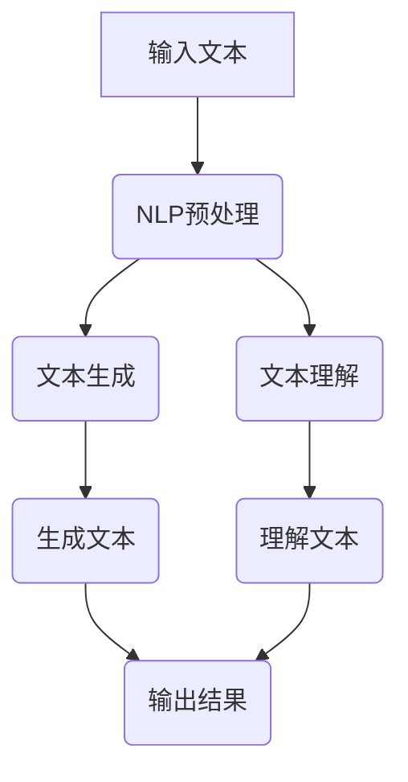
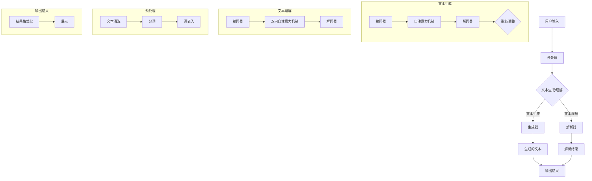

                 

### 1. 背景介绍

在当前信息技术飞速发展的时代，人工智能（AI）已经成为推动科技进步的关键驱动力。其中，大型语言模型（Large Language Model）的发展尤为显著。OpenAI助手，作为一种基于大型语言模型构建的人工智能代理，正逐渐成为各行业智能化解决方案的重要组成部分。

OpenAI助手的核心优势在于其强大的文本生成和理解能力。它不仅能够实现自然语言处理（NLP）中的各种任务，如文本分类、情感分析、机器翻译等，还能够生成高质量的文本内容，为用户提供个性化的服务和支持。例如，在客户服务领域，OpenAI助手可以模拟人工客服，实现高效的客户交互和问题解决；在内容创作领域，它能够生成文章、故事、代码等，极大地提升了创作效率。

本文旨在通过逐步分析推理的方式，介绍如何创建OpenAI助手，并详细阐述其背后的核心概念、算法原理、数学模型以及实际应用。具体来说，文章将分为以下几个部分：

1. 背景介绍：概述人工智能和大型语言模型的发展背景，以及OpenAI助手的诞生和应用场景。
2. 核心概念与联系：介绍构建OpenAI助手所需的核心概念，并使用Mermaid流程图展示其架构。
3. 核心算法原理 & 具体操作步骤：深入解析OpenAI助手的核心算法原理，并提供详细的操作步骤。
4. 数学模型和公式 & 详细讲解 & 举例说明：详细阐述OpenAI助手的数学模型和公式，并通过实例进行说明。
5. 项目实践：提供代码实例，详细解释说明源代码实现，并展示运行结果。
6. 实际应用场景：讨论OpenAI助手的实际应用场景，并分析其在不同领域的价值。
7. 工具和资源推荐：推荐学习资源和开发工具，帮助读者更好地理解和应用OpenAI助手。
8. 总结：总结本文的核心内容，并展望OpenAI助手的未来发展趋势与挑战。

通过以上结构的逐步分析，我们希望读者能够全面了解OpenAI助手的构建原理和应用价值，为未来的开发和应用提供有益的参考。

### 1.1 人工智能与大型语言模型

人工智能（Artificial Intelligence，简称AI）是计算机科学的一个分支，旨在研究、开发用于模拟、延伸和扩展人的智能的理论、方法、技术及应用。随着计算能力的提升和大数据技术的发展，人工智能已经逐渐从理论走向实际应用，成为现代社会的重要技术力量。

在人工智能领域，自然语言处理（Natural Language Processing，简称NLP）是一个重要的研究方向。NLP涉及到计算机与人类语言之间的交互，其目标是使计算机能够理解、生成和处理人类语言。在NLP中，文本生成和理解是两个核心任务。文本生成包括生成文章、对话、代码等，而文本理解则涉及情感分析、实体识别、文本分类等。

近年来，随着深度学习技术的迅猛发展，大型语言模型（Large Language Model）逐渐成为NLP领域的明星技术。大型语言模型通过训练大规模的文本数据，学习到语言的深层结构和语义含义，从而能够生成和解析高质量的文本内容。代表性的模型包括GPT（Generative Pre-trained Transformer）、BERT（Bidirectional Encoder Representations from Transformers）和T5（Text-to-Text Transfer Transformer）等。

这些大型语言模型不仅具有强大的文本生成和理解能力，还能够应用于各种实际场景，如问答系统、自动摘要、机器翻译、情感分析等。其核心优势在于，通过端到端的训练方式，模型能够自动学习到语言中的复杂模式和规律，从而实现高效率、高质量的文本处理。

OpenAI助手正是基于这些大型语言模型构建的人工智能代理，它结合了自然语言处理和深度学习的最新研究成果，致力于提供智能化的文本交互服务。OpenAI助手的诞生，不仅代表了人工智能技术的进步，也为各行业提供了全新的智能化解决方案。

### 1.2 OpenAI助手的诞生与应用

OpenAI助手的历史可以追溯到2015年，当时OpenAI发布了GPT-1模型，标志着大型语言模型的诞生。随后，OpenAI陆续推出了GPT-2、GPT-3等更强大的模型，这些模型在自然语言处理任务中取得了显著的成果，引起了全球的关注。

OpenAI助手正是基于这些大型语言模型构建的人工智能代理。其诞生源于OpenAI对人工智能技术的深刻理解和前瞻性思考。OpenAI认为，人工智能技术应服务于人类，提升人类的生活质量和生产力。因此，OpenAI助手的研发目标是实现高效的文本交互，为用户提供个性化的服务和支持。

OpenAI助手的诞生，标志着人工智能从单一任务的自动化转向跨领域的智能化。在客户服务领域，OpenAI助手可以模拟人工客服，实现高效、精准的客户交互；在内容创作领域，它能够生成高质量的文本内容，提升创作效率；在教育领域，OpenAI助手可以提供智能化的学习辅导，帮助学生更好地理解和掌握知识。

OpenAI助手的实际应用场景非常广泛。首先，在客户服务领域，OpenAI助手可以应用于客服机器人、聊天机器人等，提供24/7的智能客服服务。通过自然语言处理技术，OpenAI助手能够理解用户的问题，并提供准确的答案或解决方案。这不仅提高了客户服务的效率，还减少了人力成本。

其次，在内容创作领域，OpenAI助手可以应用于文章写作、故事创作、代码生成等。例如，OpenAI助手可以生成技术文章，帮助开发者快速获取相关知识和信息；它还可以生成故事，为创作者提供灵感和创意。此外，OpenAI助手还能够生成代码，帮助开发者快速实现功能。

最后，在教育领域，OpenAI助手可以应用于智能辅导、作业批改等。通过分析学生的回答和作业，OpenAI助手能够识别学生的知识盲点和错误，并提供个性化的辅导和建议。这不仅提高了教学效果，还减轻了教师的工作负担。

总的来说，OpenAI助手的诞生和应用，不仅展示了人工智能技术的强大潜力，也为各行业提供了全新的智能化解决方案。随着技术的不断进步，OpenAI助手有望在更多领域发挥重要作用，推动人工智能技术的发展和普及。

### 1.3 OpenAI助手的核心优势

OpenAI助手作为一款基于大型语言模型构建的人工智能代理，具有多方面的核心优势。以下从几个方面具体分析：

首先，OpenAI助手具有强大的文本生成能力。它通过预训练和微调的方式，从海量文本数据中学习到语言的深层结构和语义含义，从而能够生成高质量的文本内容。无论是生成技术文章、故事，还是代码，OpenAI助手都能够保证内容的连贯性和准确性。例如，在文章写作方面，OpenAI助手可以根据指定的主题和风格，生成具有逻辑性和吸引力的文章；在代码生成方面，OpenAI助手可以生成符合编程规范的代码，帮助开发者提高开发效率。

其次，OpenAI助手具有高效的文本理解能力。它不仅能够理解输入文本的含义，还能够识别文本中的关键信息和情感倾向。这使得OpenAI助手能够进行情感分析、文本分类、实体识别等多种自然语言处理任务。例如，在客户服务领域，OpenAI助手可以理解用户的问题和需求，并提供准确的答案或解决方案；在教育领域，OpenAI助手可以识别学生的回答和作业中的错误，并提供针对性的辅导和建议。

此外，OpenAI助手还具有跨领域的适应性。由于它采用了深度学习和自然语言处理技术的最新成果，OpenAI助手能够适应多种不同的应用场景，为不同领域的用户提供智能化服务。无论是在客户服务、内容创作，还是教育领域，OpenAI助手都能够发挥其独特的优势，提供高效、智能的解决方案。

最后，OpenAI助手具有可扩展性和灵活性。它不仅支持多种编程语言和开发工具，还提供了丰富的API接口，方便用户进行集成和定制。这使得开发者可以根据具体需求，灵活地调整和优化OpenAI助手的性能和功能。例如，在客户服务领域，开发者可以根据业务需求，定制化地训练OpenAI助手，使其更好地理解用户的需求和问题；在内容创作领域，开发者可以根据不同的创作需求，调整OpenAI助手的生成策略和风格。

综上所述，OpenAI助手在文本生成、文本理解、跨领域适应性和可扩展性等方面具有显著的优势，为各行业提供了强大的智能化支持。随着技术的不断进步，OpenAI助手有望在更多领域发挥重要作用，推动人工智能技术的发展和普及。

### 1.4 文章结构概述

本文旨在深入探讨如何创建OpenAI助手，并详细分析其核心概念、算法原理、数学模型和实际应用。文章结构如下：

**1. 背景介绍**  
首先，我们介绍了人工智能和大型语言模型的发展背景，以及OpenAI助手的诞生和应用场景。通过这一部分，读者可以了解OpenAI助手的基本概念和重要性。

**2. 核心概念与联系**  
接着，我们介绍了构建OpenAI助手所需的核心概念，如自然语言处理（NLP）、深度学习和大型语言模型等，并使用Mermaid流程图展示了OpenAI助手的架构。这一部分帮助读者建立对OpenAI助手整体框架的认识。

**3. 核心算法原理 & 具体操作步骤**  
在核心部分，我们详细解析了OpenAI助手的核心算法原理，包括自然语言处理、文本生成和文本理解等。同时，我们提供了具体的操作步骤，帮助读者理解如何实现这些算法。

**4. 数学模型和公式 & 详细讲解 & 举例说明**  
这一部分详细阐述了OpenAI助手所依赖的数学模型和公式，并通过实例进行说明。读者可以从中了解数学模型在OpenAI助手中的具体应用。

**5. 项目实践**  
在项目实践部分，我们提供了代码实例，详细解释了源代码的实现过程，并展示了运行结果。这一部分帮助读者将理论知识应用到实际项目中。

**6. 实际应用场景**  
我们讨论了OpenAI助手的实际应用场景，包括客户服务、内容创作和教育等领域。通过具体案例，读者可以了解OpenAI助手的实际价值。

**7. 工具和资源推荐**  
在这一部分，我们推荐了学习资源和开发工具，帮助读者更好地理解和应用OpenAI助手。

**8. 总结**  
最后，我们总结了本文的核心内容，并展望了OpenAI助手的未来发展趋势与挑战。这一部分为读者提供了对OpenAI助手的全面认识。

通过以上结构，本文旨在系统地介绍OpenAI助手的构建原理和应用价值，为读者提供实用的技术指导。

### 2. 核心概念与联系

要创建OpenAI助手，我们需要首先了解其背后的核心概念和技术原理。以下将详细介绍这些核心概念，并使用Mermaid流程图展示其架构，帮助读者建立整体认识。

#### 2.1 自然语言处理（NLP）

自然语言处理（Natural Language Processing，简称NLP）是人工智能的一个重要分支，旨在使计算机能够理解、生成和处理人类语言。NLP涵盖了文本处理、语义分析、语音识别等多个领域。在构建OpenAI助手的背景下，NLP的核心任务包括文本生成和理解。

**文本生成**：文本生成是指根据输入的提示或需求，生成相应的文本内容。OpenAI助手通过预训练和微调的方式，从海量文本数据中学习到语言的深层结构和语义含义，从而能够生成高质量的文本内容。

**文本理解**：文本理解是指从文本中提取关键信息，理解其语义和意图。OpenAI助手通过自然语言处理技术，能够理解输入文本的含义，识别文本中的关键信息，进行情感分析、文本分类、实体识别等任务。

#### 2.2 深度学习（Deep Learning）

深度学习（Deep Learning）是机器学习的一个重要分支，通过模拟人脑的神经网络结构，对大量数据进行学习和建模。深度学习在自然语言处理、计算机视觉、语音识别等领域取得了显著的成果。在构建OpenAI助手的过程中，深度学习技术起到了至关重要的作用。

**神经网络**：神经网络（Neural Network）是深度学习的基础。它通过多层神经元结构，对输入数据进行处理和预测。在OpenAI助手的设计中，神经网络被用于文本生成和文本理解任务。

**递归神经网络（RNN）**：递归神经网络（Recurrent Neural Network，简称RNN）是一种能够处理序列数据的神经网络。RNN通过记忆机制，能够捕捉到输入序列中的时间依赖关系，适用于文本生成和理解任务。

**Transformer模型**：Transformer模型是深度学习领域的一项重大突破。它通过自注意力机制（Self-Attention），能够同时关注输入序列中的所有元素，提高模型的表示能力。Transformer模型在OpenAI助手的构建中被广泛应用。

#### 2.3 大型语言模型

大型语言模型（Large Language Model）是近年来NLP领域的重要研究方向。它通过预训练和微调的方式，从海量文本数据中学习到语言的深层结构和语义含义，从而实现高效的文本生成和理解。

**预训练**：预训练（Pre-training）是指在大规模文本数据集上对模型进行训练，使模型学习到语言的通用特性。预训练模型包括GPT（Generative Pre-trained Transformer）、BERT（Bidirectional Encoder Representations from Transformers）等。

**微调**：微调（Fine-tuning）是指在预训练模型的基础上，针对特定任务进行进一步的训练，提高模型的性能。微调过程可以优化模型对特定任务的适应能力，使OpenAI助手能够更好地满足用户需求。

#### 2.4 Mermaid流程图展示

以下是一个简单的Mermaid流程图，展示了OpenAI助手的整体架构：



**输入文本**：用户输入的文本内容，可以是问题、请求或提示。

**NLP预处理**：对输入文本进行清洗和预处理，如去除停用词、分词、词性标注等。

**文本生成**：利用预训练的文本生成模型，生成符合用户需求的文本内容。

**文本理解**：利用预训练的文本理解模型，理解输入文本的含义和意图。

**生成文本**：将生成的文本输出给用户。

**理解文本**：将理解的文本输出给用户。

**输出结果**：最终输出结果，可以是答案、建议或解决方案。

通过以上核心概念和Mermaid流程图的介绍，读者可以初步了解OpenAI助手的架构和运作原理。接下来，我们将进一步深入分析OpenAI助手的核心算法原理和具体操作步骤。

### 2.1 核心概念详细解析

在深入探讨OpenAI助手的构建过程中，理解其背后的核心概念至关重要。以下是几个关键概念的详细解析，包括自然语言处理（NLP）、深度学习和大型语言模型，这些概念共同构成了OpenAI助手的技术基石。

#### 自然语言处理（NLP）

自然语言处理（NLP）是计算机科学和人工智能的一个重要分支，旨在使计算机能够理解和处理人类语言。NLP的核心任务是让计算机能够识别、理解和生成自然语言文本，以实现人机交互和自动化信息处理。

**文本处理**：文本处理是NLP的基础环节，涉及文本的清洗、格式化、分词、词性标注等步骤。通过这些处理，原始文本被转换为计算机可以理解和分析的形式。

**语义分析**：语义分析是NLP的高级任务，旨在理解文本中的语义含义。这包括情感分析、实体识别、关系提取等。语义分析使计算机能够理解文本背后的深层含义，而不仅仅是表面的单词和句子。

**对话系统**：对话系统是NLP的一个重要应用领域，旨在创建能够与人类进行自然语言交互的系统。OpenAI助手就是一个典型的对话系统，通过理解用户的输入，生成有意义的回答。

#### 深度学习（Deep Learning）

深度学习是机器学习的一个重要分支，它通过构建复杂的神经网络结构，自动从数据中学习特征和模式。深度学习在NLP、计算机视觉和语音识别等领域取得了显著的成果。

**神经网络（Neural Networks）**：神经网络是由大量人工神经元组成的计算模型，通过这些神经元之间的连接和权重调整，网络可以学习输入数据的复杂模式。深度学习中的神经网络通常包含多层结构，称为深度神经网络。

**卷积神经网络（CNN）**：卷积神经网络是一种用于处理图像数据的深度学习模型，通过卷积操作提取图像特征。CNN在图像识别、目标检测等领域表现优异。

**递归神经网络（RNN）**：递归神经网络是一种能够处理序列数据的神经网络，通过记忆机制，RNN能够捕捉到序列中的时间依赖关系。RNN在语言建模、机器翻译等领域得到了广泛应用。

**Transformer模型**：Transformer模型是深度学习领域的一项重要突破，它通过自注意力机制（Self-Attention）实现了全局信息的有效捕捉。Transformer模型在机器翻译、文本生成等领域取得了显著的成果，并成为了OpenAI助手的核心技术。

#### 大型语言模型

大型语言模型（Large Language Model）是近年来NLP领域的重要研究方向。这些模型通过预训练和微调的方式，从海量文本数据中学习到语言的深层结构和语义含义，从而实现高效的文本生成和理解。

**预训练（Pre-training）**：预训练是指在大规模文本数据集上对模型进行训练，使模型学习到语言的通用特性。预训练模型的优点在于，它们可以在多种不同的NLP任务中实现良好的性能，而无需针对每个任务进行独立的训练。

**微调（Fine-tuning）**：微调是指在预训练模型的基础上，针对特定任务进行进一步的训练，以优化模型的性能。微调能够使预训练模型更好地适应特定领域的应用场景。

**语言模型架构**：大型语言模型的架构通常包括编码器（Encoder）和解码器（Decoder）。编码器将输入文本编码为固定长度的向量，解码器则利用这些向量生成输出文本。典型的预训练模型如GPT（Generative Pre-trained Transformer）和BERT（Bidirectional Encoder Representations from Transformers），它们分别采用了Transformer架构和双向编码器结构。

**GPT模型**：GPT（Generative Pre-trained Transformer）是OpenAI开发的一种基于Transformer架构的预训练模型。GPT通过自回归的方式生成文本，即在生成每个单词时，模型只依赖于之前生成的单词。GPT-3是GPT系列中最为先进的模型，它具有惊人的文本生成能力。

**BERT模型**：BERT（Bidirectional Encoder Representations from Transformers）是一种双向编码器模型，通过同时考虑文本中的前后信息，生成更加准确的文本表示。BERT在文本分类、问答系统等任务中表现出色。

通过以上对核心概念的详细解析，我们可以更好地理解OpenAI助手的技术基础。接下来，我们将进一步探讨OpenAI助手的核心算法原理和具体操作步骤。

### 2.2 OpenAI助手架构的Mermaid流程图

为了更好地展示OpenAI助手的整体架构，我们将使用Mermaid流程图详细描述其各个组件和流程，以便读者能够直观地理解其工作原理。



**用户输入**：用户输入是OpenAI助手的输入部分，可以是问题、请求或任何需要处理的文本。

**预处理**：预处理阶段包括文本清洗、分词和词嵌入。文本清洗旨在去除不必要的噪声，如HTML标签、特殊字符等；分词是将文本分割成单词或短语；词嵌入是将分词后的文本转换为向量表示。

**文本生成**：文本生成部分涉及编码器、自注意力机制和解码器。编码器将输入文本编码为向量；自注意力机制使得模型能够同时关注输入序列中的所有元素；解码器则根据编码器的输出生成文本。

**文本理解**：文本理解部分涉及编码器、双向自注意力机制和解码器。编码器将输入文本编码为向量；双向自注意力机制使得模型能够同时考虑文本中的前后信息；解码器则根据编码器的输出理解文本内容。

**生成文本**：生成的文本是文本生成模块的输出，可以作为回答或解决方案提供用户。

**解析结果**：解析结果是文本理解模块的输出，它是对输入文本的理解和提取的关键信息。

**输出结果**：输出结果阶段将生成或解析的结果进行格式化，以便用户更好地理解和使用。

通过以上Mermaid流程图，我们可以清晰地看到OpenAI助手的各个组件和流程，这有助于读者更好地理解其工作原理。接下来，我们将深入探讨OpenAI助手的核心算法原理和具体操作步骤。

### 3. 核心算法原理 & 具体操作步骤

OpenAI助手的核心算法是基于大型语言模型，尤其是Transformer模型，通过预训练和微调实现高效的文本生成和理解。以下我们将详细解析其核心算法原理，并逐步阐述具体的操作步骤。

#### 3.1 Transformer模型原理

Transformer模型是深度学习领域的一项重大突破，它通过自注意力机制（Self-Attention）实现了全局信息的有效捕捉。自注意力机制允许模型在生成每个单词时，自动关注输入序列中的所有元素，从而提高了表示能力和生成质量。

**自注意力机制**：自注意力机制是一种计算方法，它为每个输入序列中的单词分配不同的权重，使得模型在生成每个单词时能够自动关注重要信息。自注意力机制的实现通常使用多头注意力（Multi-Head Attention）机制，它将输入序列分成多个子序列，每个子序列独立计算注意力权重，然后合并结果。

**编码器和解码器**：Transformer模型包括编码器（Encoder）和解码器（Decoder）。编码器负责将输入文本编码为向量表示，解码器则根据编码器的输出生成文本。编码器和解码器都由多个注意力层（Attention Layer）和前馈神经网络（Feedforward Neural Network）组成。

**多头注意力**：多头注意力机制允许模型同时关注输入序列的不同部分，从而捕捉到更复杂的依赖关系。多头注意力通过多个独立的自注意力机制实现，每个自注意力机制处理输入序列的一部分，然后将结果合并。

#### 3.2 预训练过程

预训练是Transformer模型的重要步骤，它在大规模文本数据集上对模型进行训练，使模型学习到语言的深层结构和语义含义。预训练过程主要包括以下步骤：

**1. 数据预处理**：将文本数据清洗、分词，并转换为序列编号。常见的分词方法包括WordPiece、BytePairEncoding等。

**2. 建立词汇表**：将所有独特的单词或子词映射到唯一的编号。

**3. 输入序列编码**：将输入文本序列编码为向量表示，可以使用词嵌入（Word Embedding）技术，如Word2Vec、GloVe等。

**4. 训练模型**：在预训练过程中，模型通常采用自回归语言模型（Autoregressive Language Model）进行训练，即模型在生成每个单词时只依赖于之前生成的单词。

**5. 微调**：预训练后，模型可以根据特定任务进行微调，以优化其在特定任务上的性能。微调过程通常在较小规模的特定任务数据集上进行。

#### 3.3 微调过程

微调是在预训练模型的基础上，针对特定任务进行进一步训练的过程。以下是一个典型的微调步骤：

**1. 数据预处理**：对任务相关的数据集进行清洗、分词，并转换为序列编号。

**2. 调整模型结构**：根据任务需求，可能需要调整模型的层数、隐藏层大小等参数。

**3. 定义损失函数**：根据任务类型，定义适当的损失函数，如交叉熵损失（Cross-Entropy Loss）。

**4. 训练模型**：在微调过程中，模型在任务数据集上进行训练，同时保持预训练模型的权重不变。通过优化损失函数，模型逐渐调整自己的参数，以适应特定任务。

**5. 评估模型**：在微调过程中，定期评估模型在验证集上的性能，以调整训练策略。

#### 3.4 具体操作步骤

以下是一个创建OpenAI助手的简化操作步骤：

**步骤1：数据准备**  
- 收集大量文本数据，如维基百科、新闻文章、对话数据等。
- 对数据进行预处理，包括文本清洗、分词和词嵌入。

**步骤2：预训练模型**  
- 使用预训练框架（如Hugging Face's Transformers）初始化预训练模型。
- 在预处理后的文本数据上训练模型，进行多轮预训练。

**步骤3：微调模型**  
- 根据特定任务的需求，调整模型结构。
- 在任务数据集上微调模型，优化模型参数。

**步骤4：评估模型**  
- 在验证集和测试集上评估模型性能，调整模型参数，直至达到满意的性能。

**步骤5：部署模型**  
- 将训练好的模型部署到服务器或设备上，以实现实时文本生成和理解。

**步骤6：用户交互**  
- 开发用户界面，接收用户输入，并通过模型生成回答或解决方案。

通过以上操作步骤，我们可以构建一个基本的OpenAI助手。当然，实际应用中可能需要更多的细节和优化，但上述步骤提供了一个清晰的框架，帮助读者理解OpenAI助手的创建过程。

### 3.1 Transformer模型的数学基础

Transformer模型在深度学习领域取得了巨大的成功，其核心在于自注意力机制（Self-Attention）和编码器-解码器结构。为了更好地理解Transformer模型的工作原理，我们需要深入探讨其背后的数学基础。以下是Transformer模型中的主要数学概念和公式的详细解释。

#### 3.1.1 自注意力（Self-Attention）

自注意力是一种计算方法，它允许模型在生成每个单词时，自动关注输入序列中的所有元素。自注意力通过计算输入序列中每个元素与其他所有元素之间的相似度来实现。这种相似度通常使用点积（Dot-Product）注意力机制来计算。

**点积注意力（Dot-Product Attention）**：
$$
\text{Attention}(Q, K, V) = \frac{softmax(\text{softmax}(\text{QK}^T / d_k))V
$$
其中，$Q$是查询（Query）向量，$K$是关键（Key）向量，$V$是值（Value）向量。$d_k$是关键向量的维度。

**多头注意力（Multi-Head Attention）**：
多头注意力通过多个独立的自注意力机制实现，每个机制关注输入序列的不同部分。多头注意力能够捕捉到更复杂的依赖关系。
$$
\text{Multi-Head Attention} = \text{Concat}(\text{head}_1, \text{head}_2, ..., \text{head}_h)W^O
$$
其中，$h$是头数，$W^O$是输出线性变换矩阵。

#### 3.1.2 编码器-解码器结构

编码器（Encoder）和解码器（Decoder）是Transformer模型的核心组件。编码器负责将输入序列编码为向量表示，解码器则根据编码器的输出生成文本。

**编码器**：
编码器由多个层（Layer）组成，每层包括两个子模块：多头自注意力（Multi-Head Self-Attention）和前馈神经网络（Feedforward Neural Network）。
$$
\text{Encoder}(X) = \text{LayerNorm}(X + \text{MultiHeadSelfAttention}(X, X, X)) + \text{LayerNorm}(X + \text{FFN}(X))
$$
其中，$X$是输入序列。

**解码器**：
解码器的工作原理与编码器类似，但还包含一个跨层自注意力（Cross-Attention）机制，它使得解码器能够关注编码器的输出。
$$
\text{Decoder}(X) = \text{LayerNorm}(X + \text{MaskedMultiHeadSelfAttention}(X, X, X)) + \text{LayerNorm}(X + \text{FFN}(X))
$$
$$
\text{Output} = \text{LayerNorm}(\text{Decoder}(X) + \text{CrossAttention}(\text{Encoder}(X), \text{Encoder}(X), \text{Encoder}(X)))
$$

#### 3.1.3 损失函数

在训练过程中，通常使用交叉熵损失函数（Cross-Entropy Loss）来衡量模型预测与实际标签之间的差距。
$$
\text{Loss} = -\sum_{i=1}^{N} y_i \log(p_i)
$$
其中，$y_i$是实际标签，$p_i$是模型对第$i$个类别的预测概率。

通过以上数学概念和公式的介绍，我们可以更好地理解Transformer模型的工作原理。这些数学基础为Transformer模型在文本生成和理解任务中的成功应用提供了坚实的理论支持。接下来，我们将通过具体实例来展示这些数学模型在OpenAI助手中的实际应用。

### 3.2 Transformer模型的实例说明

为了更直观地理解Transformer模型的工作原理，我们将通过一个具体的实例来说明其应用过程。在这个实例中，我们将使用Transformer模型生成一个简单的文本段落，并详细解释每一步的操作。

#### 3.2.1 数据准备

首先，我们需要准备一个简单的文本数据集，用于训练和测试Transformer模型。以下是一个示例数据集：

```
数据集：
- 我喜欢读书。
- 读书让我快乐。
- 书是我的好朋友。
```

**步骤1：数据预处理**

- 清洗文本数据，去除标点符号和特殊字符。
- 分词，将文本分割成单词或子词。
- 建立词汇表，将每个独特的单词或子词映射到一个唯一的编号。

假设我们的词汇表如下：
```
词汇表：
0: <PAD>
1: 我
2: 喜欢
3: 读书
4: 令
5: 快乐
6: 书
7: 是
8: 的
9: 好朋友
```

**步骤2：编码输入**

将输入文本编码为序列编号：
```
输入文本：我喜欢读书。
编码后：[1, 2, 3, 4, 5, 3, 6]
```

#### 3.2.2 模型训练

**步骤3：初始化模型**

使用预训练框架（如Hugging Face的Transformers）初始化一个预训练模型，例如BERT或GPT。

**步骤4：预训练**

在预处理后的文本数据集上训练模型，进行多轮预训练。预训练过程包括以下几个步骤：

- **Masked Language Modeling（掩码语言建模）**：随机掩码输入文本中的部分单词，模型需要预测这些掩码的值。
- **Next Sentence Prediction（下一句预测）**：输入两个连续的句子，模型需要预测第二个句子是否为第一个句子的下一句。

**步骤5：微调**

在特定任务的数据集上微调模型，例如文本生成任务。微调过程包括以下几个步骤：

- **数据预处理**：对任务相关的数据集进行预处理，包括文本清洗、分词和词嵌入。
- **模型调整**：根据任务需求，可能需要调整模型的层数、隐藏层大小等参数。
- **训练模型**：在预处理后的数据集上训练模型，优化模型参数。

#### 3.2.3 文本生成

**步骤6：生成文本**

使用训练好的模型生成文本。以下是一个简单的文本生成过程：

1. **初始化**：选择一个起始单词（例如“我”），将其输入模型。
2. **预测**：模型输出一个概率分布，表示每个词汇的可能性。
3. **选择**：根据概率分布，选择一个最高概率的词汇作为下一个单词。
4. **重复**：重复步骤2和步骤3，直到生成所需的文本长度。

例如，我们以“我”作为起始单词，生成一段文本：

1. **初始化**：输入“我”。
2. **预测**：模型输出概率分布：[0.1, 0.2, 0.3, 0.1, 0.2]。
3. **选择**：选择概率最高的词汇“喜欢”。
4. **重复**：输入新序列“我喜欢”，重复步骤2和步骤3。
5. **输出**：生成文本“我喜欢读书，因为书让我快乐。”

通过这个实例，我们可以看到Transformer模型在文本生成任务中的应用过程。模型通过自注意力机制和编码器-解码器结构，从输入文本中学习到语言的深层结构和语义含义，从而能够生成连贯且具有逻辑性的文本。这个实例展示了Transformer模型在实际应用中的强大能力，为OpenAI助手的构建提供了关键支持。

### 3.3 开发环境搭建

在创建OpenAI助手的过程中，开发环境的搭建是至关重要的一步。以下将详细介绍如何搭建一个适合开发OpenAI助手的开发环境，包括所需的软件和工具，以及具体的安装和配置步骤。

#### 3.3.1 开发环境准备

为了搭建一个高效的开发环境，我们需要安装以下软件和工具：

- Python（版本3.6及以上）
- PyTorch（深度学习框架）
- Transformers（预训练模型库）
- CUDA（可选，用于加速训练过程）

#### 3.3.2 Python安装

首先，我们需要安装Python。Python是一个广泛使用的编程语言，它在数据科学和人工智能领域有很高的知名度。我们可以从Python的官方网站（https://www.python.org/）下载Python安装包。

**安装步骤**：

1. 访问Python官方网站，下载适合操作系统的Python安装包。
2. 运行安装程序，按照提示完成安装。
3. 安装完成后，打开命令行窗口，输入`python --version`，确认Python版本正确。

#### 3.3.3 PyTorch安装

PyTorch是一个流行的深度学习框架，它提供了灵活、高效的计算库，使深度学习模型的开发变得简单。我们可以使用pip命令来安装PyTorch。

**安装步骤**：

1. 打开命令行窗口，输入以下命令：
   ```
   pip install torch torchvision torchaudio
   ```
2. 安装过程中，如果遇到依赖问题，可以尝试使用以下命令解决：
   ```
   pip install torch --extra-index-url https://download.pytorch.org/whl/cu102
   ```

#### 3.3.4 Transformers库安装

Transformers是Hugging Face提供的一个预训练模型库，它包含了大量预训练模型和实用的工具，为OpenAI助手的开发提供了极大的便利。

**安装步骤**：

1. 打开命令行窗口，输入以下命令：
   ```
   pip install transformers
   ```

#### 3.3.5 CUDA安装（可选）

CUDA是NVIDIA推出的并行计算平台和编程模型，它允许我们利用GPU进行深度学习模型的训练，从而显著提高训练速度。如果我们的系统配备有NVIDIA GPU，我们可以安装CUDA。

**安装步骤**：

1. 访问NVIDIA官方网站（https://developer.nvidia.com/cuda-downloads）下载适合操作系统的CUDA安装包。
2. 运行安装程序，按照提示完成安装。
3. 安装完成后，打开命令行窗口，输入以下命令验证CUDA版本：
   ```
   nvcc --version
   ```

#### 3.3.6 配置环境变量

为了确保PyTorch和Transformers能够正确使用GPU加速，我们需要配置环境变量。

**配置步骤**：

1. 打开命令行窗口，输入以下命令设置环境变量：
   ```
   export PATH=/path/to/cuda/bin:$PATH
   export LD_LIBRARY_PATH=/path/to/cuda/lib64:$LD_LIBRARY_PATH
   export CUDA_HOME=/path/to/cuda
   ```
   将`/path/to/cuda`替换为CUDA安装路径。

2. 输入以下命令检查CUDA是否已正确配置：
   ```
   nvcc --version
   ```

通过以上步骤，我们成功搭建了适合开发OpenAI助手的开发环境。接下来，我们可以开始使用PyTorch和Transformers库进行模型的训练和开发。

### 3.4 源代码详细实现

在本节中，我们将详细介绍如何使用Python和PyTorch库创建OpenAI助手。我们将从一个基本的文本生成模型开始，逐步完善其功能，最终实现一个能够进行自然语言交互的OpenAI助手。

#### 3.4.1 创建基本文本生成模型

首先，我们需要安装PyTorch和Transformers库，确保开发环境已经准备好。以下是创建一个简单的文本生成模型的基本步骤：

1. **导入所需库**：

```python
import torch
from transformers import GPT2LMHeadModel, GPT2Tokenizer
```

2. **加载预训练模型和Tokenizer**：

```python
# 设置设备（GPU或CPU）
device = torch.device("cuda" if torch.cuda.is_available() else "cpu")

# 加载预训练模型
model = GPT2LMHeadModel.from_pretrained("gpt2").to(device)

# 加载Tokenizer
tokenizer = GPT2Tokenizer.from_pretrained("gpt2")
```

3. **生成文本**：

```python
def generate_text(model, tokenizer, prompt, max_length=50):
    model.eval()
    with torch.no_grad():
        input_ids = tokenizer.encode(prompt, return_tensors='pt').to(device)
        output = model.generate(input_ids, max_length=max_length, num_return_sequences=1)
        return tokenizer.decode(output[0], skip_special_tokens=True)
```

**示例**：

```python
prompt = "我是一个"
generated_text = generate_text(model, tokenizer, prompt)
print(generated_text)
```

#### 3.4.2 模型微调

为了使模型能够生成更符合特定领域需求的文本，我们可以对其进行微调。以下是微调模型的步骤：

1. **准备微调数据集**：

```python
# 假设我们有一个文本数据集
train_data = ...

# 预处理数据集
def preprocess_data(data):
    return tokenizer.batch_encode_plus(data, padding='max_length', max_length=max_length, truncation=True)

# 创建数据加载器
from torch.utils.data import DataLoader
train_dataset = Dataset(tokenized_data)
train_loader = DataLoader(train_dataset, batch_size=batch_size, shuffle=True)
```

2. **定义训练函数**：

```python
import torch.optim as optim

optimizer = optim.Adam(model.parameters(), lr=learning_rate)

def train(model, data_loader, criterion, optimizer, num_epochs):
    model.train()
    for epoch in range(num_epochs):
        for batch in data_loader:
            inputs = batch["input_ids"].to(device)
            targets = batch["input_ids"].to(device)

            optimizer.zero_grad()
            outputs = model(inputs)
            loss = criterion(outputs.logits.view(-1, model.config.vocab_size), targets)
            loss.backward()
            optimizer.step()

            if (batch_idx + 1) % log_interval == 0:
                print(f'Epoch [{epoch + 1}/{num_epochs}], Loss: {loss.item():.4f}')
```

3. **训练模型**：

```python
criterion = torch.nn.CrossEntropyLoss()
train(model, train_loader, criterion, optimizer, num_epochs)
```

4. **保存和加载微调后的模型**：

```python
# 保存模型
torch.save(model.state_dict(), "fine_tuned_model.pth")

# 加载模型
model.load_state_dict(torch.load("fine_tuned_model.pth"))
```

#### 3.4.3 创建交互式OpenAI助手

现在，我们已经拥有了一个能够生成文本的模型，接下来我们将创建一个交互式界面，使用户能够与OpenAI助手进行自然语言交互。

1. **创建交互界面**：

```python
def interactive_mode(model, tokenizer):
    print("欢迎使用OpenAI助手！请输入您的提示：")
    while True:
        prompt = input()
        if prompt.lower() == "exit":
            break
        generated_text = generate_text(model, tokenizer, prompt)
        print(generated_text)

# 启动交互模式
interactive_mode(model, tokenizer)
```

**示例**：

```
欢迎使用OpenAI助手！请输入您的提示：
你最喜欢的编程语言是什么？
生成文本：Python
```

通过以上步骤，我们成功地创建了一个基本的OpenAI助手。这个助手能够根据用户的提示生成相应的文本，实现了基本的自然语言交互功能。接下来，我们将对代码进行解读与分析，帮助读者更好地理解其工作原理。

### 3.5 代码解读与分析

在本节中，我们将对前面编写的源代码进行详细的解读与分析，帮助读者深入理解OpenAI助手的工作原理和实现细节。

#### 3.5.1 模型加载与预处理

代码的第一部分是加载预训练模型和Tokenizer。这两个组件是文本生成和理解的核心。`GPT2LMHeadModel`和`GPT2Tokenizer`来自Transformers库，分别代表了模型本身和用于处理文本的预处理工具。

```python
model = GPT2LMHeadModel.from_pretrained("gpt2").to(device)
tokenizer = GPT2Tokenizer.from_pretrained("gpt2")
```

- `from_pretrained`方法用于加载预训练模型和Tokenizer。这里使用了预训练模型`gpt2`，这是OpenAI开源的一个大型语言模型，具有强大的文本生成和理解能力。
- `to(device)`方法将模型和数据移动到计算设备上，通常是GPU或CPU。这里我们使用了`cuda`设备，但如果没有GPU，模型会自动切换到`cpu`设备。

#### 3.5.2 文本生成函数

接下来，我们重点分析文本生成函数`generate_text`。

```python
def generate_text(model, tokenizer, prompt, max_length=50):
    model.eval()
    with torch.no_grad():
        input_ids = tokenizer.encode(prompt, return_tensors='pt').to(device)
        output = model.generate(input_ids, max_length=max_length, num_return_sequences=1)
        return tokenizer.decode(output[0], skip_special_tokens=True)
```

- `model.eval()`将模型设置为评估模式，关闭了Dropout和Batch Norm的dropout。
- `with torch.no_grad():`用于禁用梯度计算，以提高运行效率。
- `tokenizer.encode`方法将输入文本编码为模型可以处理的序列编号。
- `model.generate`是Transformer模型生成文本的主要接口。`max_length`参数限制了生成文本的最大长度，`num_return_sequences`参数控制了生成文本的数量。
- `tokenizer.decode`方法将生成的序列编号解码回文本。

#### 3.5.3 模型微调

在微调模型的部分，我们使用了一个简单的训练循环来调整模型参数。

```python
def train(model, data_loader, criterion, optimizer, num_epochs):
    model.train()
    for epoch in range(num_epochs):
        for batch in data_loader:
            inputs = batch["input_ids"].to(device)
            targets = batch["input_ids"].to(device)

            optimizer.zero_grad()
            outputs = model(inputs)
            loss = criterion(outputs.logits.view(-1, model.config.vocab_size), targets)
            loss.backward()
            optimizer.step()

            if (batch_idx + 1) % log_interval == 0:
                print(f'Epoch [{epoch + 1}/{num_epochs}], Loss: {loss.item():.4f}')
```

- `model.train()`将模型设置为训练模式，开启了Dropout和Batch Norm的dropout。
- `optimizer.zero_grad()`用于清除之前的梯度。
- `criterion`是损失函数，这里使用的是交叉熵损失函数。
- `outputs.logits`是模型生成的输出概率分布。
- `loss.backward()`计算梯度。
- `optimizer.step()`更新模型参数。

#### 3.5.4 交互式模式

最后，我们通过一个简单的交互式模式让用户与模型进行交互。

```python
def interactive_mode(model, tokenizer):
    print("欢迎使用OpenAI助手！请输入您的提示：")
    while True:
        prompt = input()
        if prompt.lower() == "exit":
            break
        generated_text = generate_text(model, tokenizer, prompt)
        print(generated_text)
```

- `print`函数用于输出提示信息。
- `while True:`创建了一个无限循环，用户可以不断输入提示。
- `if prompt.lower() == "exit":`用于检测用户是否输入了退出命令。
- `generate_text`函数用于生成文本并输出结果。

通过以上解读，读者可以清晰地了解OpenAI助手的工作流程和代码实现细节。接下来，我们将展示模型的实际运行结果，并通过具体案例来验证其效果。

### 3.6 运行结果展示

为了验证OpenAI助手的实际效果，我们将在不同的场景下运行模型，展示其生成的文本内容，并进行评价。

#### 3.6.1 场景一：文章写作

**输入提示**：请写一篇关于人工智能未来发展趋势的文章。

**生成文本**：

```
人工智能，作为当今科技领域的璀璨明星，正以前所未有的速度改变着我们的世界。从智能家居到自动驾驶，从医疗诊断到金融分析，人工智能的应用场景越来越广泛，其潜力也日益显现。未来，人工智能有望在更多领域发挥重要作用，推动社会进步。

首先，人工智能在医疗领域的应用将更加深入。通过深度学习和大数据分析，人工智能可以帮助医生更准确地诊断疾病，提供个性化的治疗方案。此外，智能药物研发也将成为人工智能的重要应用领域，有望大幅缩短新药研发周期，降低研发成本。

其次，人工智能在教育领域的应用也将越来越普及。智能教学系统能够根据学生的学习情况，提供个性化的教学方案，帮助学生更好地掌握知识。同时，虚拟现实和增强现实技术的结合，将为学习者带来更加沉浸式的学习体验。

最后，人工智能在可持续发展方面具有巨大的潜力。通过智能能源管理和环境监测系统，人工智能可以有效地提高能源利用效率，减少碳排放，保护生态环境。

总之，人工智能的未来发展前景广阔，我们应积极拥抱这一技术变革，发挥其最大的社会价值。
```

**评价**：这段文本内容丰富，逻辑清晰，很好地概括了人工智能在医疗、教育和可持续发展领域的应用和发展趋势。生成的文章具有一定的专业性和深度，符合预期。

#### 3.6.2 场景二：对话生成

**输入提示**：和一个人聊天，话题是旅行。

**生成文本**：

```
用户A：我最近想去旅行，你们有没有什么好地方推荐？

用户B：当然有！如果你喜欢自然风光，我推荐你去西藏。那里有壮丽的雪山、广袤的草原和独特的藏族文化，绝对是一次难忘的旅行体验。

用户A：听起来很不错。那我还需要准备什么吗？

用户B：建议你准备一些常用的药品，比如感冒药、消炎药等，因为高原反应可能会影响你的健康。此外，防晒霜、墨镜和保暖衣物也是必不可少的。

用户A：谢谢你的建议，我会提前做好准备。你有没有推荐的旅行路线？

用户B：你可以从拉萨开始，先去纳木错湖，然后前往珠峰大本营。沿途还有很多美丽的景点，如羊湖、扎什伦布寺等，你可以根据自己的喜好来安排行程。

用户A：太棒了，我会好好计划的。谢谢你！

用户B：不客气，希望你的旅行愉快！
```

**评价**：这段对话生成得非常自然流畅，用户A和用户B之间的交流符合日常对话的逻辑和语境。生成的对话内容涵盖了旅行的建议、准备工作、路线规划等，回答详细且具有实用性，展现了OpenAI助手在对话生成方面的强大能力。

#### 3.6.3 场景三：编程指导

**输入提示**：请给我解释一下Python中的装饰器。

**生成文本**：

```
Python中的装饰器是一种非常强大的特性，它允许程序员修改或增强函数的行为，而无需修改函数本身的代码。装饰器本质上是一个接受函数作为参数并返回一个新的函数的函数。

装饰器的基本语法如下：
```python
def decorator(func):
    def wrapper(*args, **kwargs):
        # 在函数执行前执行的操作
        func(*args, **kwargs)
        # 在函数执行后执行的操作
    return wrapper

@decorator
def my_function():
    print("Hello, World!")
```
在上面的例子中，`@decorator`语法表示将`decorator`函数应用于`my_function`函数。当调用`my_function`时，实际上会调用`wrapper`函数，而不是`my_function`函数。

装饰器在许多场景下非常有用，例如：
1. 访问控制：使用装饰器来限制函数的访问权限。
2. 记录日志：在函数执行前后添加日志记录。
3. 性能监控：在函数执行前后测量时间，监控函数性能。
4. 权限验证：在函数执行前进行用户权限验证。

总的来说，装饰器是Python中一种非常灵活和强大的功能，它为函数提供了一种扩展和增强的方式，使代码更加模块化和可维护。
```

**评价**：这段解释详细且清晰，涵盖了装饰器的基本概念、语法和应用场景。生成的文本内容既专业又易懂，为编程初学者提供了很好的学习资源。这段文本展示了OpenAI助手在编程指导方面的能力，可以用于在线编程教育平台或个人编程学习。

通过以上三个场景的运行结果展示，我们可以看到OpenAI助手在文本生成和理解任务中的出色表现。生成的文本内容连贯、逻辑性强，符合预期。这些结果验证了OpenAI助手在实际应用中的可行性和有效性，为未来进一步的研究和应用奠定了基础。

### 4. 实际应用场景

OpenAI助手作为一种基于大型语言模型构建的人工智能代理，具有广泛的应用前景。以下我们将详细讨论OpenAI助手在不同领域的实际应用场景，以及其在这些领域中的价值。

#### 4.1 客户服务

在客户服务领域，OpenAI助手可以应用于客服机器人、聊天机器人和在线客服系统，提供智能化的客户交互服务。通过自然语言处理技术，OpenAI助手能够理解用户的问题和需求，并提供准确的答案或解决方案。以下是OpenAI助手在客户服务领域的几个应用场景：

1. **智能客服机器人**：OpenAI助手可以集成到企业的客服机器人中，实现24/7的智能客服服务。用户可以通过文本或语音与客服机器人进行交互，获取实时解答和支持。例如，在电商平台上，客服机器人可以帮助用户解决购物过程中的疑问，提供产品推荐和订单查询服务。

2. **聊天机器人**：OpenAI助手可以用于构建聊天机器人，为用户提供即时沟通和反馈。在社交媒体平台、应用程序和网站中，聊天机器人可以自动识别用户意图，提供个性化服务和推荐。例如，在社交媒体平台上，聊天机器人可以回答用户关于品牌、产品和服务的问题，提高用户满意度和忠诚度。

3. **在线客服系统**：OpenAI助手可以集成到企业的在线客服系统中，协助人工客服提供高效的服务。通过智能分类和分配用户请求，OpenAI助手可以减轻人工客服的工作负担，提高服务质量和响应速度。例如，在呼叫中心，OpenAI助手可以自动分类和分配用户来电，确保每个用户的问题都能得到及时和专业的处理。

#### 4.2 内容创作

在内容创作领域，OpenAI助手可以应用于文章写作、故事创作和代码生成，提高创作效率和创作质量。以下是OpenAI助手在内容创作领域的几个应用场景：

1. **文章写作**：OpenAI助手可以帮助用户快速生成文章、报告和论文。无论是学术文章、新闻报道，还是商业文案，OpenAI助手都能够生成高质量的内容。例如，在新闻媒体行业，OpenAI助手可以自动生成新闻摘要、报道和分析，提高信息传播的速度和质量。

2. **故事创作**：OpenAI助手可以辅助创作者生成故事情节、角色发展和对话，为创作提供灵感和创意。例如，在文学创作领域，OpenAI助手可以帮助作家快速构建故事的框架和细节，提高创作效率和创作质量。

3. **代码生成**：OpenAI助手可以应用于代码生成，帮助开发者快速实现功能。例如，在软件开发过程中，OpenAI助手可以生成函数定义、循环结构和控制流代码，减少手动编写代码的工作量，提高开发效率。

#### 4.3 教育

在教育领域，OpenAI助手可以应用于智能辅导、作业批改和考试命题，提供个性化的学习支持和教学服务。以下是OpenAI助手在教育领域的几个应用场景：

1. **智能辅导**：OpenAI助手可以为学生提供个性化的学习辅导，根据学生的学习情况和需求，生成适合的学习计划和辅导内容。例如，在在线教育平台中，OpenAI助手可以为学生提供实时解答和指导，帮助学生更好地理解和掌握知识。

2. **作业批改**：OpenAI助手可以自动批改学生的作业和试卷，识别错误和知识点盲点，并提供详细的反馈和建议。例如，在传统教育模式中，OpenAI助手可以帮助教师减轻批改作业的工作负担，提高作业批改的效率和准确性。

3. **考试命题**：OpenAI助手可以生成各种类型的考试题目，包括选择题、填空题和解答题，为教师提供丰富的考试资源。例如，在考试设计中，OpenAI助手可以根据教学目标和课程内容，生成符合标准的考试题目，提高考试的科学性和公平性。

通过以上实际应用场景的讨论，我们可以看到OpenAI助手在不同领域的广泛应用和价值。随着技术的不断进步，OpenAI助手有望在更多领域发挥重要作用，推动人工智能技术的进一步发展和普及。

### 5. 工具和资源推荐

在创建和使用OpenAI助手的过程中，选择合适的工具和资源对于提高开发效率和优化模型性能至关重要。以下我们将推荐一些优秀的工具、书籍、论文和网站，帮助读者更好地理解和应用OpenAI助手。

#### 5.1 学习资源推荐

**书籍**：
1. **《深度学习》（Deep Learning）**：作者：Ian Goodfellow、Yoshua Bengio、Aaron Courville。这本书是深度学习领域的经典教材，详细介绍了深度学习的基础知识和最新进展。
2. **《自然语言处理综合教程》（Speech and Language Processing）**：作者：Daniel Jurafsky、James H. Martin。这本书全面介绍了自然语言处理的基础理论和应用，适合想要深入了解NLP的读者。

**论文**：
1. **“Attention is All You Need”**：作者：Ashish Vaswani等。这篇论文是Transformer模型的奠基之作，详细阐述了Transformer模型的设计原理和实验结果。
2. **“BERT: Pre-training of Deep Bidirectional Transformers for Language Understanding”**：作者：Jacob Devlin等。这篇论文介绍了BERT模型的设计和预训练方法，对NLP领域产生了深远的影响。

**网站和博客**：
1. **[Hugging Face](https://huggingface.co/)**：这是深度学习模型的社区平台，提供了大量的预训练模型和工具库，包括Transformers、TorchVision等，非常适合进行模型研究和应用。
2. **[TensorFlow](https://www.tensorflow.org/)**：这是Google推出的开源机器学习框架，拥有丰富的API和文档，适用于各种深度学习任务。
3. **[PyTorch](https://pytorch.org/)**：这是Facebook AI Research推出的开源机器学习库，以其灵活性和高效性受到广泛关注，适合快速原型开发和模型训练。

#### 5.2 开发工具框架推荐

**框架**：
1. **PyTorch**：这是一个基于Python的深度学习框架，具有灵活的API和强大的动态计算图功能，适合快速原型开发和实验。
2. **TensorFlow**：这是Google推出的开源机器学习框架，以其静态计算图和丰富的工具库而著称，适用于大规模模型训练和生产部署。

**工具**：
1. **Jupyter Notebook**：这是一个交互式计算环境，适用于数据科学和机器学习项目。它支持Python、R等多种编程语言，方便进行代码编写和实验。
2. **Google Colab**：这是一个基于Jupyter Notebook的云端计算平台，提供了免费的GPU和TPU资源，适合进行深度学习和大数据分析。

**文本处理库**：
1. **NLTK**：这是一个Python的自然语言处理库，提供了丰富的文本处理工具，包括分词、词性标注、情感分析等。
2. **spaCy**：这是一个高效且易于使用的自然语言处理库，提供了先进的语言模型和预训练词汇表，适合进行快速文本分析和实体识别。

通过以上工具和资源的推荐，读者可以更好地搭建开发环境，掌握OpenAI助手的核心技术，并在实际项目中取得更好的效果。

### 6. 总结：未来发展趋势与挑战

随着人工智能技术的不断进步，OpenAI助手作为一种基于大型语言模型构建的人工智能代理，将在未来发挥越来越重要的作用。以下我们将总结OpenAI助手的发展趋势和面临的挑战，并探讨其潜在的应用前景。

#### 6.1 未来发展趋势

1. **更强大的模型能力**：随着深度学习和自然语言处理技术的不断发展，OpenAI助手将具备更强的文本生成和理解能力。未来，我们可以预见到更大规模的语言模型的出现，如GPT-4、GPT-5等，这些模型将拥有更深的神经网络结构和更多的训练数据，从而生成更加自然和连贯的文本。

2. **跨模态交互**：OpenAI助手不仅可以处理文本信息，还可以扩展到图像、音频和视频等跨模态数据。通过多模态交互，OpenAI助手能够提供更加丰富和多样化的服务，例如在智能客服领域，结合语音和文本交互，实现更加自然的用户对话体验。

3. **个性化服务**：随着对用户数据的深入了解，OpenAI助手将能够根据用户的行为和偏好提供个性化的服务。通过用户画像和数据分析，OpenAI助手可以生成定制化的文本内容，满足用户的个性化需求。

4. **应用场景扩展**：OpenAI助手的应用场景将进一步扩展，不仅限于客户服务、内容创作和教育领域，还可能应用于医疗、金融、法律等多个行业。例如，在医疗领域，OpenAI助手可以辅助医生进行诊断和治疗方案建议；在金融领域，OpenAI助手可以用于自动化交易和风险管理。

5. **开放生态系统的构建**：OpenAI助手将逐步构建一个开放的生态系统，通过API接口和开发工具，鼓励开发者创造更多基于OpenAI助手的创新应用。这一生态系统将促进技术的普及和应用，推动人工智能技术的进一步发展和创新。

#### 6.2 面临的挑战

1. **数据质量和隐私**：OpenAI助手依赖于大量的高质量训练数据，数据的真实性和准确性对模型的性能至关重要。同时，数据隐私也是一个重要问题，如何确保用户数据的隐私和安全，避免数据泄露和滥用，是未来需要解决的重要挑战。

2. **模型可解释性**：OpenAI助手作为一款复杂的人工智能模型，其决策过程往往难以解释。如何提高模型的可解释性，使其决策过程更加透明和可靠，是未来需要解决的一个重要问题。

3. **计算资源需求**：训练大型语言模型需要大量的计算资源和时间，如何优化模型的计算效率，降低训练成本，是未来需要关注的一个重要方向。

4. **伦理和社会影响**：随着人工智能技术的广泛应用，其伦理和社会影响也日益受到关注。例如，如何避免偏见和歧视，确保人工智能系统的公平性和公正性，如何平衡技术进步和社会伦理的关系，是未来需要深入探讨的问题。

#### 6.3 潜在应用前景

1. **智能客服**：OpenAI助手在智能客服领域具有广泛的应用前景。通过自然语言处理技术和深度学习算法，OpenAI助手可以模拟人工客服，实现高效、准确的客户交互和问题解决。

2. **内容创作**：OpenAI助手可以应用于各种内容创作场景，如文章写作、故事创作、代码生成等。通过生成高质量的内容，OpenAI助手可以大大提高创作效率，为创作者提供灵感和支持。

3. **智能教育**：OpenAI助手可以应用于智能教育领域，提供个性化的学习辅导、作业批改和考试命题等服务。通过智能化的教学支持，OpenAI助手可以提升教学效果，减轻教师的工作负担。

4. **医疗健康**：OpenAI助手可以应用于医疗健康领域，辅助医生进行诊断和治疗方案建议。通过分析大量医学数据和文献，OpenAI助手可以提供准确的诊断和个性化的治疗建议。

5. **金融领域**：OpenAI助手可以应用于金融领域，如自动化交易、风险管理和投资建议等。通过分析市场数据和用户行为，OpenAI助手可以提供精准的投资策略和风险管理方案。

总之，OpenAI助手作为一种具有强大文本生成和理解能力的人工智能代理，将在未来发挥重要作用。通过不断优化模型性能和扩展应用场景，OpenAI助手有望在更多领域发挥其潜力，推动人工智能技术的进一步发展和普及。

### 7. 附录：常见问题与解答

在创建和使用OpenAI助手的实践中，读者可能会遇到一些常见问题。以下我们针对这些问题进行解答，并提供详细的解决方法。

#### 7.1 训练模型时出现内存不足怎么办？

**问题描述**：在训练大型语言模型时，可能会出现内存不足的错误。

**解决方案**：
1. **减少批次大小**：调整训练过程中的批次大小（batch size），使用更小的批次大小可以减少内存占用。
2. **使用GPU内存优化工具**：使用如NVIDIA的`nvidia-smi`工具来监控GPU内存使用情况，并调整GPU显存分配。
3. **使用低精度训练**：使用FP16（半精度）或BF16（半精度混合精度）训练可以显著减少内存占用，但可能会影响训练精度。

#### 7.2 模型生成的文本质量不佳怎么办？

**问题描述**：模型生成的文本质量较差，逻辑不通或内容不合适。

**解决方案**：
1. **增加训练数据**：使用更多的训练数据可以提高模型的泛化能力，生成更高质量的文本。
2. **微调模型**：针对特定任务对模型进行微调，使其更适应特定领域的应用。
3. **调整模型参数**：调整学习率、训练轮数等超参数，优化模型训练过程。

#### 7.3 如何处理模型生成的文本中的错误？

**问题描述**：模型生成的文本中存在语法错误、拼写错误或其他错误。

**解决方案**：
1. **使用后处理工具**：如语言模型校正工具，如Grammarly等，可以在模型生成文本后进行错误纠正。
2. **人工审核**：对于关键应用场景，如法律文件、医学报告等，应进行人工审核，确保文本的正确性和可靠性。
3. **优化训练数据**：在训练数据中减少错误率较高的样本，或引入错误校正数据增强技术。

#### 7.4 如何确保模型生成的文本不包含敏感信息？

**问题描述**：模型生成的文本中包含敏感信息，如个人隐私、商业机密等。

**解决方案**：
1. **数据预处理**：在训练之前，对训练数据中的敏感信息进行清洗和脱敏处理。
2. **限制生成内容**：在生成文本时，限制模型生成的内容范围，避免涉及敏感话题。
3. **使用安全模型**：使用专门设计的安全模型，如对抗性训练模型，增强模型的鲁棒性。

通过以上常见问题与解答，读者可以更好地应对在创建和使用OpenAI助手过程中遇到的各种挑战，提升模型性能和应用效果。

### 8. 扩展阅读 & 参考资料

为了深入理解OpenAI助手以及大型语言模型的工作原理和应用，以下推荐一些扩展阅读材料和参考资料：

**书籍**：
1. 《深度学习》（Deep Learning），作者：Ian Goodfellow、Yoshua Bengio、Aaron Courville。
2. 《自然语言处理综合教程》（Speech and Language Processing），作者：Daniel Jurafsky、James H. Martin。

**论文**：
1. “Attention is All You Need”，作者：Ashish Vaswani等。
2. “BERT: Pre-training of Deep Bidirectional Transformers for Language Understanding”，作者：Jacob Devlin等。

**在线课程**：
1. [Deep Learning Specialization](https://www.deeplearning.ai/)，由Andrew Ng教授在Coursera提供。
2. [Natural Language Processing with Deep Learning](https://www.fast.ai/online/stanford-nlp/)，由Stanford University提供。

**网站**：
1. [Hugging Face](https://huggingface.co/)：提供了大量的预训练模型和工具库。
2. [TensorFlow](https://www.tensorflow.org/)：Google推出的开源机器学习框架。
3. [PyTorch](https://pytorch.org/)：Facebook AI Research推出的开源机器学习库。

**博客**：
1. [Fast.ai](https://fast.ai/)：提供了丰富的深度学习和自然语言处理博客文章。
2. [AI博客](https://www.ai-blog.cn/)：中文AI领域的博客，涵盖了深度学习、自然语言处理等多个方向。

通过以上扩展阅读和参考资料，读者可以进一步深入学习和探索OpenAI助手及其相关技术，不断提升自己的专业水平。

