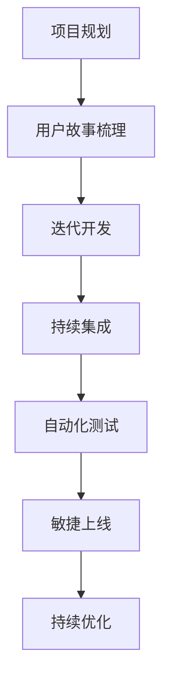

                 

### 背景介绍

在当今快速变化的市场环境中，企业对于产品的迭代速度和上线效率有着越来越高的要求。尤其是对于“一人公司”这样的小型企业或独立开发者来说，如何高效地进行产品的快速迭代开发和敏捷上线，成为了成功的关键因素之一。

一人公司，顾名思义，是由单个个体运营的公司。这样的公司通常具有灵活的组织结构，快速决策的能力，但也面临着资源有限、专业能力需要综合发展等挑战。在这样的背景下，如何通过有效的技术手段和管理方法，实现产品的快速迭代开发和敏捷上线，是本文要探讨的主要内容。

### 核心概念与联系

要实现产品的快速迭代开发和敏捷上线，我们需要从以下几个核心概念入手：

#### 1. 敏捷开发

敏捷开发（Agile Development）是一种以人为核心、迭代、循序渐进的开发方法。它强调软件开发过程中的灵活性和适应性，通过持续交付有价值的软件，快速响应变化。敏捷开发的核心理念包括：

- **迭代开发**：将整个项目划分为多个迭代周期，每个迭代周期都能交付一个可用的产品版本。
- **持续集成**：通过自动化测试和持续集成工具，确保每次代码提交都不会破坏现有的功能。
- **用户故事**：以用户需求为中心，使用用户故事来描述软件功能，确保开发方向与用户需求保持一致。

#### 2. 敏捷上线

敏捷上线（Agile Deployment）是指通过敏捷开发方法，快速将产品部署到生产环境，并进行持续优化。敏捷上线的核心目标是减少发布周期，提高软件交付的频率和质量。

- **持续交付**：确保代码在任何时间点都可以安全地发布到生产环境。
- **自动化测试**：通过自动化测试，快速验证软件的功能和性能，确保每次发布都是高质量的。
- **容器化与微服务**：利用容器化和微服务架构，简化部署流程，提高部署效率。

#### 3. 自动化工具

为了实现快速迭代开发和敏捷上线，自动化工具是不可或缺的。以下是一些常用的自动化工具：

- **持续集成/持续部署（CI/CD）工具**：如Jenkins、GitLab CI/CD、Travis CI等，用于自动化构建、测试和部署流程。
- **容器编排工具**：如Kubernetes、Docker Swarm等，用于管理容器化应用程序的部署和运行。
- **自动化测试工具**：如Selenium、JUnit、pytest等，用于自动化测试软件的功能和性能。

#### 4. 数学模型和公式

在敏捷开发和敏捷上线过程中，以下数学模型和公式有助于优化开发和部署流程：

- **速度（Velocity）**：每个迭代周期内完成的用户故事点数总和，用于评估团队的工作效率。
- **CPI（Cost Per Iteration）**：每个迭代周期的成本，用于评估资源利用率。
- **MTTR（Mean Time to Recovery）**：系统从故障到恢复正常运行的平均时间，用于评估系统的健壮性。

#### 5. Mermaid 流程图

为了更清晰地展示核心概念和流程，我们使用Mermaid绘制以下流程图：



在这个流程图中，项目规划是整个开发过程的起点，通过用户故事梳理明确开发方向。然后进入迭代开发阶段，每个迭代周期都会进行持续集成、自动化测试和敏捷上线，最后通过持续优化不断提高产品质量。

### 核心算法原理 & 具体操作步骤

要实现敏捷开发和敏捷上线，我们需要掌握一些核心算法原理和具体操作步骤。以下是一些关键的步骤：

#### 1. 项目规划

项目规划是敏捷开发的第一步，它包括以下步骤：

- **需求收集**：与利益相关者进行沟通，收集软件需求。
- **用户故事编写**：将需求转化为用户故事，使用INVEST标准（独立、可迭代、可协商、可估算、可测试）进行评估。
- **优先级排序**：根据业务价值、技术难度和风险等因素，对用户故事进行优先级排序。
- **迭代规划**：将用户故事分配到不同的迭代周期，确保每个迭代周期都有可交付的成果。

#### 2. 迭代开发

迭代开发是敏捷开发的核心，以下步骤可以帮助实现高效迭代：

- **每日站会**：团队每天召开短暂的站会，讨论进展、问题及解决方案。
- **代码审查**：在代码提交前进行审查，确保代码质量。
- **自动化测试**：编写单元测试、集成测试和端到端测试，确保每次提交都不会破坏现有功能。
- **持续集成**：将代码提交到版本控制系统，触发自动化构建和测试，确保代码质量。
- **迭代评审**：在每个迭代周期结束时，进行迭代评审，验证用户故事是否按计划完成。

#### 3. 持续集成和持续部署

持续集成（CI）和持续部署（CD）是确保代码质量、加快开发速度的关键：

- **构建和测试**：使用CI工具，如Jenkins，自动构建代码并运行测试。
- **自动化部署**：使用CD工具，如Kubernetes，自动部署到测试和生产环境。
- **回滚策略**：在发现问题时，能够快速回滚到上一个稳定版本，确保系统稳定运行。

#### 4. 自动化测试

自动化测试是保证软件质量和减少测试成本的重要手段：

- **测试框架**：选择合适的测试框架，如Selenium、JUnit、pytest，根据项目需求编写测试脚本。
- **测试覆盖**：确保测试覆盖到关键功能和边界情况，提高测试质量。
- **测试报告**：生成详细的测试报告，便于分析测试结果和定位问题。

### 数学模型和公式 & 详细讲解 & 举例说明

在敏捷开发和敏捷上线过程中，以下数学模型和公式有助于优化流程和评估项目进度：

#### 1. 速度（Velocity）

速度是每个迭代周期内完成的用户故事点数总和，用于评估团队的工作效率。以下是一个示例：

- **用户故事1**：2个点
- **用户故事2**：3个点
- **用户故事3**：5个点

在这个例子中，速度为2+3+5=10个点。

#### 2. CPI（Cost Per Iteration）

CPI是每个迭代周期的成本，用于评估资源利用率。以下是一个示例：

- **人力成本**：1000美元/天
- **迭代周期**：5天

在这个例子中，CPI为1000美元/天 \* 5天 = 5000美元。

#### 3. MTTR（Mean Time to Recovery）

MTTR是系统从故障到恢复正常运行的平均时间，用于评估系统的健壮性。以下是一个示例：

- **故障1**：1小时
- **故障2**：2小时
- **故障3**：3小时

在这个例子中，MTTR为（1+2+3）/3 = 2小时。

### 项目实践：代码实例和详细解释说明

为了更好地理解敏捷开发和敏捷上线的过程，我们以下将通过一个实际项目来展示代码实例和详细解释说明。

#### 1. 开发环境搭建

首先，我们需要搭建一个开发环境。以下是一个简单的示例：

```bash
# 安装JDK
sudo apt-get install openjdk-11-jdk

# 安装Maven
sudo apt-get install maven

# 安装Git
sudo apt-get install git

# 安装Docker
sudo apt-get install docker
```

#### 2. 源代码详细实现

以下是一个简单的Java Web应用程序的源代码示例：

```java
// Main.java
public class Main {
    public static void main(String[] args) {
        System.out.println("Hello, World!");
    }
}
```

```xml
<!-- pom.xml -->
<project xmlns="http://maven.apache.org/POM/4.0.0"
    xmlns:xsi="http://www.w3.org/2001/XMLSchema-instance"
    xsi:schemaLocation="http://maven.apache.org/POM/4.0.0
        http://maven.apache.org/xsd/maven-4.0.0.xsd">
    <modelVersion>4.0.0</modelVersion>
    <groupId>com.example</groupId>
    <artifactId>hello-world</artifactId>
    <version>1.0.0</version>
    <dependencies>
        <dependency>
            <groupId>org.apache.maven.plugins</groupId>
            <artifactId>maven-compiler-plugin</artifactId>
            <version>3.8.1</version>
        </dependency>
    </dependencies>
</project>
```

#### 3. 代码解读与分析

在这个示例中，我们创建了一个名为`Main`的Java类，其中包含了一个`main`方法。该方法在程序运行时输出“Hello, World!”。

通过Maven的`pom.xml`文件，我们指定了项目的依赖关系和插件配置。在这里，我们使用了Maven的编译插件，将Java代码编译成可执行的JAR文件。

#### 4. 运行结果展示

首先，我们需要通过Maven构建项目：

```bash
mvn clean compile
```

然后，运行生成的JAR文件：

```bash
java -jar target/hello-world-1.0.0.jar
```

输出结果为：

```
Hello, World!
```

### 实际应用场景

敏捷开发和敏捷上线在各个行业中都有广泛的应用。以下是一些典型的应用场景：

#### 1. 软件开发

敏捷开发方法在软件开发领域被广泛应用。通过迭代开发和持续集成，团队能够快速响应需求变化，提高软件质量。

#### 2. 移动应用

移动应用开发通常具有较短的开发周期和高频率的版本更新。敏捷开发方法能够帮助开发者快速迭代，及时修复bug和添加新功能。

#### 3. 金融科技

金融科技领域对于系统的安全性、稳定性和合规性要求较高。敏捷开发和敏捷上线能够帮助金融科技公司快速响应市场变化，提高竞争力。

#### 4. 物联网

物联网项目通常涉及多种设备和平台，需要快速集成和部署。敏捷开发方法能够帮助团队快速实现设备互联互通，提高开发效率。

### 工具和资源推荐

为了实现敏捷开发和敏捷上线，以下是一些常用的工具和资源推荐：

#### 1. 学习资源推荐

- **《敏捷软件开发：原则、实践与模式》**：一本经典的敏捷开发指南，详细介绍了敏捷开发的原理和实践。
- **《持续集成：工业强度的软件交付》**：一本关于持续集成和持续部署的权威指南，提供了丰富的实践经验。
- **《Clean Code：A Handbook of Agile Software Craftsmanship》**：一本关于编写整洁代码的经典著作，有助于提高代码质量。

#### 2. 开发工具框架推荐

- **Jenkins**：一款功能强大的持续集成和持续部署工具，支持多种插件和自动化任务。
- **Kubernetes**：一款用于容器编排的开源平台，能够简化应用程序的部署和运行。
- **Selenium**：一款自动化测试工具，支持多种编程语言和浏览器，用于Web应用的自动化测试。

#### 3. 相关论文著作推荐

- **《敏捷软件开发：方法实践》**：一篇关于敏捷开发方法的综述论文，详细介绍了敏捷开发的核心原则和实践。
- **《持续集成：构建高质量软件的关键》**：一篇关于持续集成的论文，分析了持续集成在软件开发中的应用和价值。
- **《敏捷项目管理：实践指南》**：一篇关于敏捷项目管理的论文，介绍了敏捷项目管理的方法和实践。

### 总结：未来发展趋势与挑战

随着技术的不断进步，敏捷开发和敏捷上线在未来的发展趋势和挑战如下：

#### 1. 人工智能的融入

人工智能（AI）技术的快速发展为敏捷开发和敏捷上线带来了新的机遇和挑战。通过AI技术，团队能够实现自动化测试、代码审查和智能推荐等功能，提高开发效率和软件质量。

#### 2. 云原生的普及

云原生技术（如容器化和微服务）在敏捷开发和敏捷上线中的应用越来越广泛。云原生技术能够简化部署流程，提高系统的可扩展性和可靠性，但同时也带来了新的安全和管理挑战。

#### 3. 个性化定制

个性化定制是未来软件开发的重要方向。通过收集用户数据和行为分析，开发者能够为用户提供更加个性化的产品和服务，提高用户满意度。

#### 4. 安全性保障

随着软件系统规模的扩大和复杂度的增加，安全性保障变得越来越重要。开发者需要关注网络安全、数据安全和隐私保护等方面，确保软件系统的安全稳定运行。

### 附录：常见问题与解答

#### 1. 敏捷开发与传统的瀑布开发有何区别？

敏捷开发与传统的瀑布开发在开发流程、团队协作、需求管理等方面存在显著差异。敏捷开发强调迭代、灵活性和用户参与，而瀑布开发则遵循严格的线性流程，需求在开发前确定，修改成本较高。

#### 2. 持续集成和持续部署有什么区别？

持续集成（CI）是指在软件开发过程中，将每次代码提交自动构建、测试和集成，以确保代码质量。持续部署（CD）则是在CI的基础上，自动将代码部署到测试和生产环境，实现快速上线。

#### 3. 敏捷开发是否适用于大型项目？

是的，敏捷开发同样适用于大型项目。敏捷开发通过迭代开发和持续集成，能够提高大型项目的开发效率和软件质量。然而，大型项目在实施敏捷开发时需要更多的协调和沟通。

### 扩展阅读 & 参考资料

- **《敏捷开发实践指南》**：一本详细介绍敏捷开发方法的实践指南，适合初学者和有经验者阅读。
- **《敏捷项目管理》**：一本关于敏捷项目管理的权威著作，涵盖了敏捷项目管理的核心原则和实践。
- **《Jenkins：持续集成实战》**：一本关于Jenkins的实战指南，详细介绍了如何使用Jenkins实现持续集成和持续部署。
- **《容器化与微服务实战》**：一本关于容器化和微服务架构的实战指南，介绍了如何使用容器化和微服务简化部署和管理。

### 结论

敏捷开发和敏捷上线是现代软件开发的重要趋势。通过灵活的开发方法、自动化工具和高效的团队协作，一人公司可以实现产品的快速迭代开发和敏捷上线，提高市场竞争力。在实际应用中，敏捷开发方法和敏捷上线策略需要根据项目特点进行调整，以实现最佳效果。作者：禅与计算机程序设计艺术 / Zen and the Art of Computer Programming。

